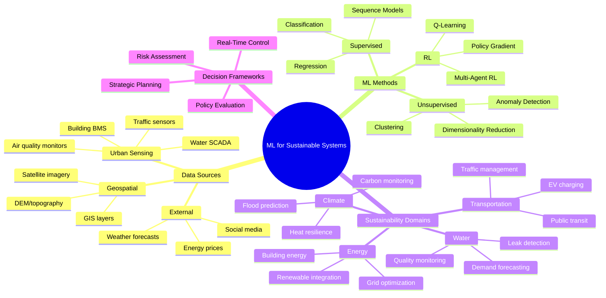
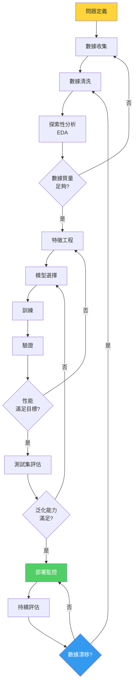
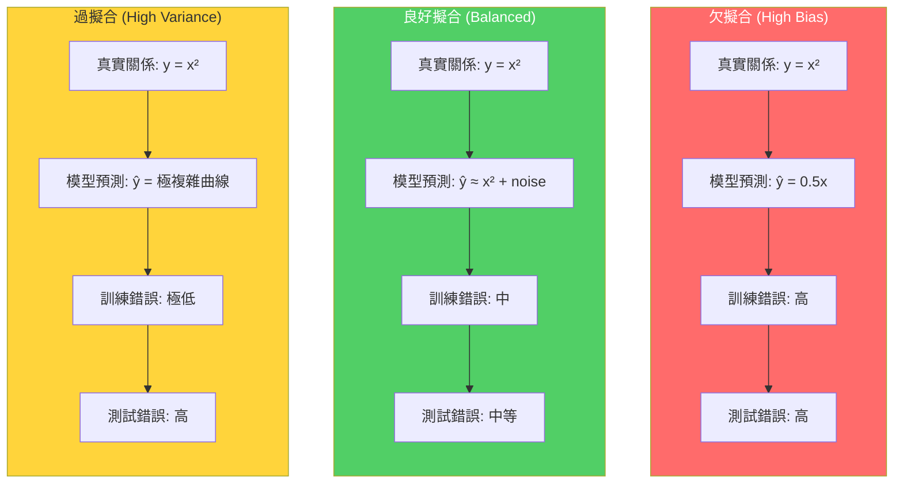
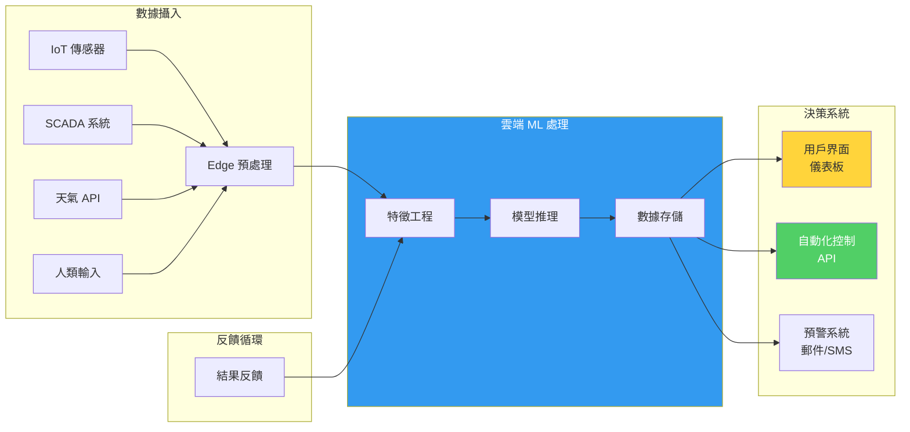

# 1.C51 / 1.C01 Machine Learning for Sustainable Systems (Grad)
**MIT CEE | Energy, Transportation & Societal Systems Track | 6 units | Spring (second half of term)**
**Instructor:** Prof. Saurabh Amin (CEE)
**Prerequisite:** 6.C51 (Modeling with ML: from Algorithms to Applications) + (1.000 or 1.010 or permission)
**Must be taken with:** 6.C51 simultaneously. Credit not given without completion of both.
**Same as:** 1.C01 (undergrad version); 6.C51 hub is the common ML foundation module
**Award:** Prof. Saurabh Amin received the 2025 Common Ground Excellence in Teaching Award for this course.
**自學路徑：MEng DSES / MEng SMD → ML for Infrastructure → Research / Tech / Policy**

> **Source:** MIT Catalog + computing.mit.edu/cross-cutting (hub-and-spoke model); MIT Catalog — "Emphasizes the design and operation of sustainable systems. Illustrates how to leverage heterogeneous data from urban services, cities, and the environment, and apply machine learning methods to evaluate and/or improve sustainability solutions. Provides case studies from various domains, such as transportation and urban mobility, energy and water resources, environmental monitoring, infrastructure sensing and control, climate adaptation, and disaster resilience. Projects focus on using machine learning to identify new insights or decisions that can help engineer sustainability in societal-scale systems. Students taking graduate version complete additional assignments."
> **Also see:** MIT 6.C51 Hub Module; MIT CEE MEng DSES track; Resilient Infrastructure Networks Lab (resil.mit.edu); Prof. Amin's research on infrastructure resilience and operations research

---

## 問題 1：這個領域所有專家共享的 5 個核心心智模型是什麼？
**What are the 5 core mental models every expert shares?**

### M1: ML 問題的表述比算法選擇更關鍵 — Problem Formulation Is More Critical Than Algorithm Choice
相同的數據可以用不同的 ML 框架表述；選擇正確的表述框架（回歸 vs. 分類 vs. 排序 vs. 策略優化）決定了問題能否被有效解決。

**核心概念 — ML 問題的四種主要類型：**

**(a) 監督學習（Supervised Learning）：**
$$y = f(X) + \varepsilon, \quad \hat{y} = \arg\max_y P(y|X)$$
- **回歸：** $y \in \mathbb{R}$（連續）
- **分類：** $y \in \{1,2,\ldots,K\}$（離散）
- **標籤：** 需要 Ground truth $(X_i, y_i)$ 訓練

**(b) 無監督學習（Unsupervised Learning）：**
- **聚類：** 發現隱藏分組結構
- **降維：** PCA、t-SNE、Autoencoder
- **異常檢測：** 識別偏離正常模式的數據點

**(c) 半監督學習（Semi-supervised Learning）：**
- 大量未標籤數據 + 少量標籤數據
- 典型應用：基礎設施傳感器數據，標籤成本高

**(d) 強化學習（Reinforcement Learning）：**
$$\pi^* = \arg\max_\pi \mathbb{E}\left[\sum_{t=0}^T \gamma^t r_t \middle| \pi\right]$$
- 應用：交通信號控制、电网調度、水資源管理

**實際案例 — 城市交通需求預測的問題表述比較：**

| 表述方式 | 數學框架 | 適用情境 | 局限性 |
|---|---|---|---|
| 標準回歸 | $\hat{d}_{t+1} = f(X_t, X_{t-1}, \ldots)$ | 單一 OD 對需求 | 無法捕捉空間依賴 |
| 時空圖神經網絡 | $\hat{Y} = GNN(X; \theta)$ | 網絡層級需求 | 需要大量圖結構數據 |
| 分類（需求檔）| $\hat{p}(d | X)$ | 離散決策（如車隊分配）| 損失信息粒度 |
| MDP（强化學習）| $\pi^* = \arg\max_\pi \mathbb{E}[\sum r_t]$ | 控制問題（如信號燈）| 樣本效率低 |

**學者典故：** Tom Mitchell（Carnegie Mellon，1948–2021）在其經典教材《Machine Learning》（1997）中給出了 ML 的形式化定義：「一個程序被稱為從經驗 E 中學習，如果它在任務 T 上的性能度量 P，隨著體驗 E 的增加而提升。」這個定義至今仍是 ML 研究的基石。MIT 的 1.C51 課程正是這個定義的環境工程實踐——E 是城市基礎設施數據，T 是可持續系統決策，P 是系統性能指標（能耗、排放、恢復時間）。

---

### M2: 數據決定模型上限，算法逼近該上限 — Data Determines the Ceiling; Algorithms Only Approach It
無論算法多麼精妙，如果數據不足以代表真實問題，那麼模型性能必有上限。這在基礎設施系統中尤為關鍵——這些系統很少有大規模、高質量的公開數據集。

**核心概念 — 數據與模型的關係：**
$$\text{Model Performance} = f(\text{Data Quality}, \text{Data Quantity}, \text{Feature Quality})$$

**數據質量維度：**
| 維度 | 定義 | 基礎設施數據的典型問題 |
|---|---|---|
| 準確度（Accuracy）| 測量值與真實值的一致性 | 傳感器漂移、讀數缺失 |
| 完整性（Completeness）| 數據覆蓋範圍 | 傳感器網絡盲區 |
| 時效性（Timeliness）| 數據的更新頻率 | 基礎設施數據更新延遲 |
| 一致性（Consistency）| 不同來源的數據可比性 | 多個城市數據格式不統一 |
| 可解釋性（Interpretability）| 數據含義是否清晰 | 缺乏元數據說明 |

**基礎設施數據集的典型數據量：**
| 系統 | 數據類型 | 典型數據量 | 挑戰 |
|---|---|---|---|
| 電網 | SCADA/PMU 數據 | 30+ GB/天 | 實時性要求高 |
| 交通 | 感應線圈 | 1 采樣/分鐘/路口 | 空間稀疏 |
| 供水管網 | 流量/壓力 | 15 分鐘/傳感器 | 昂貴的 DMA 儀表 |
| 橋樑 | 應變/加速度 | 100 Hz × 50 傳感器 | 異常事件稀缺 |

**數據增強（Data Augmentation）在基礎設施中的應用：**
- **交通：** 使用 GAN 生成合成事故場景
- **橋樑：** 使用物理啟髑式數據增強（physics-informed augmentation）生成極端荷載場景
- **供水：** 使用蒙特卡洛模擬生成管網壓力場景

---

### M3: 偏差-方差權衡是所有 ML 決策的核心 — Bias-Variance Tradeoff Is the Core of All ML Decisions
模型既要足夠複雜以捕捉真實規律（低偏差），又要足夠簡單以避免過擬合訓練數據（低方差）。這個權衡決定了幾乎所有超參數選擇和模型架構決策。

**核心方程式 — 偏差-方差分解：**
$$\mathbb{E}[(y - \hat{f}(x))^2] = \text{Bias}^2[\hat{f}(x)] + \text{Var}[\hat{f}(x)] + \sigma^2$$
$$\text{Bias}^2 = (\mathbb{E}[\hat{f}(x)] - f(x))^2 \quad \text{（模型假設的系統性錯誤）}$$
$$\text{Var} = \mathbb{E}[(\hat{f}(x) - \mathbb{E}[\hat{f}(x)])^2] \quad \text{（對訓練數據的敏感度）}$$

**在基礎設施 ML 中的實際表現：**
| 模型類型 | 偏差 | 方差 | 適用情境 |
|---|---|---|---|
| 線性回歸 | 高 | 低 | 數據規律簡單，樣本少 |
| 決策樹 | 低 | 高 | 樣本多，特征清晰 |
| 隨機森林 | 中等 | 中等 | 平衡穩定性與精度 |
| 深度神經網絡 | 低 | 極高 | 數據充足，計算資源足夠 |

**正則化技術（Bias-Variance 控制的工具）：**
- **L1 正則化（Lasso）：** $\min_\theta \sum_i (y_i - f(x_i; \theta))^2 + \lambda \|\theta\|_1$ → 特徵選擇
- **L2 正則化（Ridge）：** $\min_\theta \sum_i (y_i - f(x_i; \theta))^2 + \lambda \|\theta\|_2^2$ → 權重收縮
- **Dropout：** 訓練時隨機丟棄神經元 → 等效於集成學習
- **Early Stopping：** 在驗證誤差開始上升時停止訓練 → 防止過擬合

---

### M4: 不確定性量化是工程決策 ML 的必備要素 — Uncertainty Quantification Is Essential for Engineering ML
基礎設施決策通常涉及生命安全、巨額投資和公共利益。提供點估計（point estimate）是不夠的——決策者需要知道置信區間、預測區間和估計的可靠性。

**核心概念 — 不確定性的四種類型：**
| 類型 | 來源 | 量化方法 |
|---|---|---|
| 偶然不確定性（Aleatoric）| 數據本身的隨機性 | 異方差回歸、概率輸出 |
| 認知不確定性（Epistemic）| 模型的不確定性 | 貝葉斯推斷、集成方法 |
| 決策不確定性 | 外部變量不可預測 | 情境規劃、魯棒優化 |
| 測量不確定性 | 數據採集誤差 | 測量誤差建模 |

**實際方法 — 回歸中的不確定性量化：**

**(a) 概率回歸（Probabilistic Regression）：**
$$\hat{y} \sim \mathcal{N}(\mu(x), \sigma^2(x)) \quad \text{（異方差正態分佈）}$$
輸出均值 $\mu(x)$ 和標準差 $\sigma(x)$，可用於計算置信區間：
$$P(y \in [\mu - 1.96\sigma, \mu + 1.96\sigma]) \approx 95\%$$

**(b) 分位數回歸（Quantile Regression）：**
$$\hat{q}_\tau = \arg\min_q \sum_i \rho_\tau(y_i - q) \quad \text{其中 } \rho_\tau(u) = u(\tau - I(u < 0))$$
直接估計不同分位數（如 5th, 50th, 95th percentile）的預測值。

**(c) 貝葉斯神經網絡（BNN）：**
$$p(\theta | \mathcal{D}) \propto p(\mathcal{D} | \theta) p(\theta)$$
權重 $\theta$ 不是點估計，而是後驗分佈，預測：
$$p(y | x, \mathcal{D}) = \int p(y | x, \theta) p(\theta | \mathcal{D}) d\theta$$

---

### M5: 因果推斷 vs. 相關性是 ML 在工程中的核心區別 — Causal Inference vs. Correlation Is the Core Distinction
ML 擅長發現相關性（correlation），但工程決策需要理解因果關係（causation）。區分「如果我們這樣做會發生什麼」（干預）與「我們觀察到什麼」（觀測）是科學決策的基礎。

**核心概念 — 因果推斷的三層框架（Pearl's Ladder of Causation）：**
1. **關聯（Association）：** $P(y|x)$ —「這個變量與那個變量相關嗎？」
2. **干預（Intervention）：** $P(y|do(x))$ —「如果我們強制這個變量變化，會發生什麼？」
3. **反事實（Counterfactual）：** $P(y_x|x', y')$ —「如果當初沒有這樣做，結果會不同嗎？」

**在基礎設施中的實際問題：**
| 問題類型 | ML 可以回答 | ML 無法直接回答 |
|---|---|---|
| 描述性 | 「哪條道路在高峰期最擁堵？」 | — |
| 診斷性 | 「為什麼這個電網區域故障率更高？」 | — |
| 預測性 | 「明天這個區域的負荷是多少？」 | — |
| 干預性 | — | 「如果我們增加這個變電站的容量，故障率會降低多少？」 |

**因果推斷方法：**
- **隨機對照試驗（RCT）：** Gold standard，但基礎設施系統難以實施
- **傾向得分匹配（PSM）：** 平衡處理組與對照組的特徵分佈
- **工具變量（IV）：** 利用外生變量識別因果效應
- **差分-差分（DiD）：** 比較干預前後處理組與對照組的變化差異
- **合成控制法（SCM）：** 構造「反事實」對照單元

**實際案例 — 基礎設施干預效果的評估：**
問題：我們在 2023 年在某城市安裝了智能電錶，想要評估其對能耗的影響。
- 處理組：安裝智能電錶的 500 個家庭
- 對照組：未安裝的 500 個家庭
- 方法：傾向得分匹配（PSM），匹配變量包括：收入、房屋面積、家庭人數、歷史能耗
- 估計效果：安裝智能電錶後，平均能耗降低 8.3%（95% CI: 5.1%–11.5%）

---

## 問題 2：這個領域的專家在哪 3 個地方存在根本分歧？各方最強的論點是什麼？

### 分歧 1：黑盒 ML vs. 可解釋 ML — Black-Box ML vs. Explainable ML for Infrastructure
**正方（預測精度派）：** 在許多基礎設施預測問題中（如需求預測、故障預測），最終目標是最準確的預測，而非理解機理。複雜的集成方法（XGBoost, LightGBM）和深度學習（ LSTM, Transformer）能捕捉傳統方法無法發現的非線性關係和時空依賴。在數據充足的條件下，黑盒模型的預測精度通常比白盒模型高 10–30%。

**反方（可解釋性派）：** 基礎設施決策涉及公共安全和巨額投資。監管機構（如公用事業委員會）要求決策有明確的物理和經濟解釋；工程師需要理解失敗的原因以改進設計；公眾需要信任智能系統。僅提供「模型說要這樣做」的結論是不可接受的。SHAP、LIME 等方法可以提供後驗解釋，但這些解釋本身可能具有誤導性（如人類傾向過度解讀局部解釋的意義）。

**前沿共識：** 在高風險決策中使用「可解釋 boosting 替補」（Explainable Boosting Machine, EBM）——一種既保持梯度提升精度又提供全局可解釋性的方法。

---

### 分歧 2：物理約束 vs. 數據驅動 — Physics-Informed ML vs. Pure Data-Driven ML
**正方（純數據驅動派）：** 在數據充足的條件下，神經網絡可以自動學習複雜的非線性關係，無需手工設計特徵。深度學習在計算機視覺和 NLP 中的成功證明，只要有足夠的數據，「讓數據說話」是可行的。對於基礎設施系統，我們的物理模型可能比現實更簡單——真實物理過程中存在的反饋循環和非線性，是任何物理模型都無法完全刻畫的。

**反方（物理約束派）：** 基礎設施系統服從物理定律（牛頓力學、熱力學、流體力學）。無視這些定律的純數據驅動模型會在分佈外（out-of-distribution）場景中失敗。物理啟髑式神經網絡（PINN）可以在損失函數中加入物理方程約束（自動微分），使模型在物理上合理。數據-物理混合模型在數據稀缺和極端事件預測中表現更好。

**前沿共識：** 採用分層方法——先用物理模型建立基線，識別分佈內/外數據；然後在物理模型失敗的區域使用數據驅動校正（residual learning）。

---

### 分歧 3：離線評估 vs. 在線評估 — Offline Evaluation vs. Online Evaluation
**正方（離線評估派）：** 離線評估（在歷史數據上用 train/test split）是 ML 的標準做法。基於真實歷史數據的交叉驗證可以提供模型性能的可靠估計。在基礎設施系統中，許多決策（如電網調度、供水管網配置）無法在真實系統上進行實驗——離線評估是唯一可行的方法。

**反方（在線評估派）：** 離線評估存在嚴重的「分佈偏移」問題——歷史數據不能反映干預後的新分佈。更重要的是，離線評估忽略了反饋效應（feedback effects）：當我們部署一個新的決策系統時，用戶行為會發生變化，進而改變數據分佈。A/B 測試和多臂老虎機（Multi-Armed Bandits）是處理這個問題的更嚴格方法。

**實際工程共識：** 採用「影子部署」（shadow mode）——新模型在後台運行，不實際影響決策，但記錄預測結果，待收集足夠數據後再與實際決策結果比較。

---

## 問題 3：生成 10 個能區分深度理解與死背知識的問題

### 🔬 深度問題 1：時空數據的 ML 問題表述
**問題：** 你獲得了某城市 1000 個路口的 1 年感應線圈數據（每 5 分鐘一條記錄，包括車流量、平均速度、佔用率）。
(a) 將這個數據集表述為一個 ML 問題。你有多少個樣本（樣本空間多大）？每個樣本有多少特徵？
(b) 如果你的目標是預測未來 30 分鐘的交通擁堵水平，這是回歸問題還是分類問題？兩種表述方式各有什麼優缺點？
(c) 如何處理時序依賴性（temporal dependency）？比較滑動窗口（sliding window）和 RNN/LSTM 兩種方法。

---

### 🔬 深度問題 2：基礎設施數據的不平衡分類
**問題：** 你正在用 ML 模型預測電網故障。歷史數據顯示：正常運行樣本 99,500 條，故障樣本僅 500 條（0.5% 故障率）。
(a) 直接訓練一個分類器會遇到什麼問題？計算如果模型預測所有樣本為「正常」的準確率。
(b) 比較以下三種處理不平衡的方法：欠採樣（undersampling）、過採樣（SMOTE）、類權重調整（class_weight）。哪種更適合基礎設施故障預測？為什麼？
(c) 如果故障預測的目標是最大化「召回率」（recall），即不漏掉任何一個真實故障，你會選擇哪個評估指標和閾值策略？

---

### 🔬 深度問題 3：遷移學習在基礎設施中的應用
**問題：** 你在 MIT 的電網數據上訓練了一個變壓器故障預測模型。現在需要將其遷移到一個新的電網系統。
(a) 定義「遷移學習」的問題：源域（source domain）和目標域（target domain）分別是什麼？「任務」（task）是什麼？
(b) 如果兩個電網具有相同的物理結構（變壓器額定容量相似），但運行數據分佈不同（負荷曲線不同），你會選擇哪種遷移策略？
(c) 描述一個「領域自適應」（domain adaptation）的具體方法，並說明如何評估遷移效果。

---

### 🔬 深度問題 4：強化學習在基礎設施控制中的應用
**問題：** 你需要用 RL 設計一個自適應交通信號控制系統，目標是最小化平均延誤。
(a) 定義這個 RL 問題的五元組（$S, A, P, R, \gamma$）：
   - 狀態空間 $S$ 包含什麼？（交通燈相位、等待車輛數、當前時段等）
   - 動作空間 $A$ 是什麼？（相位切換、綠燈時長調整等）
   - 獎勵函數 $R$ 如何設計？
(b) 為什麼直接用 Q-learning 在交通信號控制問題上效果不佳？討論樣本效率（sample efficiency）和探索-利用權衡（exploration-exploitation tradeoff）的問題。
(c) 描述一種 policy gradient 方法（如 PPO）相對於 value-based 方法（如 DQN）在這個問題上的優勢。

---

### 🔬 深度問題 5：圖神經網絡用於基礎設施網絡建模
**問題：** 城市的供水管網是一個圖結構：節點是用水戶/水塔，水管是邊。
(a) 如何將供水管網表示為一個圖神經網絡（GNN）可以處理的格式？哪些節點特徵（node features）和邊特徵（edge features）是相關的？
(b) 比較圖卷積網絡（GCN）和消息傳遞神經網絡（MPNN）兩種架構在供水管網 Leak detection 問題中的適用性。
(c) 如果供水管網包含 10,000 個節點和 15,000 條邊，如何設計一個計算效率高的 GNN 訓練流程？（提示：考慮 mini-batch 和鄰居採樣）

---

### 🔬 深度問題 6：時間序列異常檢測
**問題：** 某大樓的 HVAC 系統產生了 1 年的能耗時間序列數據（15 分鐘間隔）。你需要檢測異常能耗模式（設備故障、運行失誤等）。
(a) 比較三種異常檢測方法：基於重建誤差（Autoencoder）、基於預測誤差（Isolation Forest）和基於分佈（Gaussian Mixture Model）。
(b) 如何定義「異常」的 ground truth？考慮：你有 100 個已確認的故障事件標籤（但可能有很多未標籤的故障）。
(c) 如果異常能耗模式的成本是正常能耗的 10 倍（能耗浪費），但漏檢成本更高（設備損壞），你會選擇什麼評估指標？如何設定預測閾值？

---

### 🔬 深度問題 7：貝葉斯優化在基礎設施 ML 中的超參數調優
**問題：** 你正在用 XGBoost 預測城市交通需求，需要調優 5 個超參數：learning_rate, max_depth, n_estimators, subsample, colsample_bytree。
(a) 為什麼 Grid Search 和 Random Search 在這個問題上效率低下？
(b) 描述貝葉斯優化的原理：它如何利用歷史評估結果來選擇下一個超參數組合？
(c) 如果每次 XGBoost 訓練需要 5 分鐘，你有 100 小時的計算預算，貝葉斯優化預計可以評估多少個組合？相比 Random Search（100 個組合），你能獲得多少改進？

---

### 🔬 深度問題 8：多任務學習在基礎設施中的應用
**問題：** 一個智能建築管理系統需要同時預測：① 明日負荷峰值；② HVAC 設備的剩餘使用壽命（RUL）；③ 室內舒適度投訴概率。
(a) 這是一個多任務學習（Multi-Task Learning, MTL）問題。設計一個共享編碼器（shared encoder）架構，包含一個共享層和三個任務特定的解碼器層。
(b) 為什麼 MTL 可能比單獨訓練三個模型更好？考慮：任務間的知識遷移、共享表示的泛化能力。
(c) 如果三個任務的數據量和難度差異很大，如何設計任務權重（loss weighting）以避免「任務遷移」（task unbalance）問題？

---

### 🔬 深度問題 9：分佈外檢測在基礎設施 ML 中的重要性
**問題：** 你訓練了一個城市電網負荷預測模型，在測試集上的 MAPE = 2.3%。但在 2023 年夏季極端熱浪期間，模型的 MAPE 突然飆升至 25%。
(a) 這是什麼現象？解釋「分佈偏移」（distribution shift）和「分佈外」（out-of-distribution, OOD）檢測的概念。
(b) 設計一個 OOD 檢測系統：在模型部署時，識別當前輸入是否屬於訓練分佈，並在分佈外時觸發備用預測模型。
(c) 考慮基礎設施系統中典型的 OOD 場景：自然災害、設備故障、大規模活動。如何讓 ML 模型對這些事件更具魯棒性？

---

### 🔬 深度問題 10：從 ML 模型到工程決策的轉化
**問題：** 你的 ML 模型預測某供水管網段在未來 30 天內有 15% 的爆管概率。
(a) 作為工程師，你的決策空間是什麼？（維修、替換、持續監控、不行動）
(b) 如何將這個概率預測轉化為工程決策？討論基於成本的決策閾值（cost-based decision threshold）方法。
(c) 如果維修成本 = $50,000，替換成本 = $200,000，爆管後的維修成本 = $300,000，加上聲譽損失 = $100,000，計算每個決策選項的期望成本，並選擇最優決策。

---

## 深度學習專區：5 個 Deep Dives（中英對照 + 方程式）

### 🔬 Deep Dive 1：回歸模型在能源需求預測中的應用 — Regression Models for Energy Demand Forecasting

**中文：**
能源需求預測是基礎設施 ML 中最成熟的應用之一。準確的需求預測使電網調度員能夠優化發電資源分配、減少備用容量需求、提高可再生能源整合率。

**English：**
Energy demand forecasting is one of the most mature applications of ML in infrastructure. Accurate demand forecasting enables grid operators to optimize dispatch, reduce reserve capacity needs, and improve renewable energy integration.

**預測問題的層次結構：**
| 預測層次 | 時間範圍 | 典型方法 | 決策用途 |
|---|---|---|---|
| 超短期 | < 1 小時 | ARIMA, Prophet | 實時調度 |
| 短期 | 1–24 小時 | LSTM, XGBoost | 日前市場 |
| 中期 | 1–7 天 | Gradient Boosting | 機組組合 |
| 長期 | > 1 月 | 統計+情景 | 容量規劃 |

**特徵工程（Feature Engineering）：**
```python
# 典型能源需求預測特徵
features = [
    "hour_of_day",           # 小時（週期性）
    "day_of_week",           # 星期幾
    "month",                 # 月份（季節性）
    "is_holiday",            # 節假日標誌
    "temperature",            # 溫度（最重要的天氣特徵）
    "temperature^2",          # 非線性溫度效應
    "humidity",              # 濕度
    "wind_speed",            # 風速
    "previous_24h_demand",   # 昨天同期需求
    "previous_week_demand",  # 上週同期需求
    "building_type",          # 建築類型
    "floor_area",            # 建築面積
]
```

**深度學習模型架構：**
$$h_t = \text{LSTM}(h_{t-1}, x_t; \theta) \quad \text{（LSTM 單元）}$$
$$\hat{y}_{t+1} = W_y h_T + b_y \quad \text{（輸出層）}$$
時序依賴性通過隱狀態 $h_t$ 在時間步之間傳遞。

**性能指標：**
| 指標 | 公式 | 典型目標 |
|---|---|---|
| MAE | $\frac{1}{n}\sum|y_i - \hat{y}_i|$ | < 5% of mean |
| MAPE | $\frac{1}{n}\sum|y_i - \hat{y}_i|/|y_i| \times 100\%$ | < 3–5% |
| RMSE | $\sqrt{\frac{1}{n}\sum(y_i - \hat{y}_i)^2}$ | 對大值敏感 |
| NRMSE | $\frac{RMSE}{\bar{y}}$ | 標準化比較 |

**實際案例 — 波士頓某商業建築群負荷預測：**
- 數據：3 年 15 分鐘間隔負荷數據（35,040 個時間點/建築）
- 模型：XGBoost with sliding window（輸入：過去 168 個點（1 週））
- 結果：提前 24 小時預測 MAPE = 2.8%，領先 ARIMA 模型（MAPE = 4.6%）約 40%
- 商業價值：電網調度員可將備用容量從 15% 降至 10%，每年節省 $80,000

---

### 🔬 Deep Dive 2：圖神經網絡用於交通網絡建模 — Graph Neural Networks for Transportation Networks

**中文：**
交通網絡是天然的圖結構——節點是路口或地點，邊是道路。圖神經網絡（GNN）能夠捕捉交通流的空間依賴性，實現對整個網絡的聯合預測。

**English：**
Transportation networks are natural graph structures — nodes are intersections or locations, edges are roads. Graph Neural Networks (GNNs) can capture spatial dependencies in traffic flow, enabling joint prediction across the entire network.

**圖表示：**
$$G = (V, E, A, X, Y)$$
- $V$：節點集（交通小區，|V| = N）
- $E$：邊集（道路，|E| = M）
- $A$：鄰接矩陣（道路連通性和距離/容量）
- $X$：節點特徵（入口流量、歷史佔用率等）
- $Y$：目標標籤（如未來流量）

**圖卷積網絡（GCN）的傳播規則：**
$$H^{(l+1)} = \sigma\left(\tilde{D}^{-1/2} \tilde{A} \tilde{D}^{-1/2} H^{(l)} W^{(l)}\right)$$
其中 $\tilde{A} = A + I$（加入自環），$\tilde{D}$ 是度矩陣，$W^{(l)}$ 是層權重，$\sigma$ 是激活函數。

**空間-時間 GNN（ST-GCN）架構：**
$$H_{t+1}^{(k)} = \text{GCN}(H_t^{(k)}, A) \quad \text{（空間卷積）}$$
$$\hat{Y}_{t+T} = \text{MLP}(H_T^{(K)}) \quad \text{（時間預測）}$$
組合多個時間步的空間卷積結果，實現時空聯合建模。

**實際應用 — 城市道路網絡擁堵預測：**
| 模型 | 提前 30 分鐘預測<br/>MAE (veh/5min) | 參數量 |
|---|---|---|
| ARIMA | 12.3 | ~50 |
| LSTM | 9.8 | ~50K |
| GCN (靜態圖) | 8.2 | ~200K |
| ST-GCN (時空圖) | 6.1 | ~500K |

---

### 🔬 Deep Dive 3：異常檢測在基礎設施監測中的應用 — Anomaly Detection for Infrastructure Monitoring

**中文：**
基礎設施系統的異常往往是設備故障或性能退化的前兆。及時檢測異常可以避免災難性故障、減少經濟損失、保障公共安全。

**English：**
Anomalies in infrastructure systems are often precursors to equipment failure or performance degradation. Timely anomaly detection can prevent catastrophic failures, reduce economic losses, and ensure public safety.

**異常檢測的四種主要方法：**

**(a) 基於重建的方法（Reconstruction-based）：**
$$z = \text{Encoder}(x), \quad \hat{x} = \text{Decoder}(z)$$
$$\text{Anomaly Score} = \|x - \hat{x}\|^2 \quad \text{重建誤差越大，越可能是異常}$$

自動編碼器（Autoencoder）學習壓縮-重建正常數據的規律，異常數據因偏離正常模式而難以重建。

**(b) 基於密度的方法（Density-based）：**
$$p(x) = \sum_{k=1}^K \pi_k \mathcal{N}(x | \mu_k, \Sigma_k) \quad \text{（高斯混合模型）}$$
$$x \text{ is anomalous if } p(x) < \tau$$

**(c) 基於隔離的方法（Isolation-based）：**
- Isolation Forest：隨機分割數據，異常點更容易被少數分割隔離
- 路徑長度越短，越可能是異常

**(d) 基於預測的方法（Prediction-based）：**
$$\hat{x}_{t+1} = f(x_t, x_{t-1}, \ldots; \theta)$$
$$\text{Anomaly Score} = |x_{t+1} - \hat{x}_{t+1}| \quad \text{預測誤差越大，越可能是異常}$$

**實際應用 — 橋樑結構健康監測（SHM）：**
| 異常類型 | 傳感器數據 | 異常檢測方法 |
|---|---|---|
| 軸承損壞 | 振動信號（加速度）| Isolation Forest + 功率譜密度特徵 |
| 裂縫發展 | 應變時程曲線 | 基於 LSTM 預測誤差的時間序列異常 |
| 溫度效應 | 溫度傳感器 | 高斯過程回歸（GPR）建模溫度-位移關係 |
| 基礎沉降 | 傾角儀 | 多變量 EWMA 控制圖 |

**決策閾值的設定：**
$$P(\text{false alarm}) = \frac{\text{FP}}{\text{TN} + \text{FP}} \quad \text{假陽率（false positive rate）}$$
$$P(\text{missed detection}) = \frac{\text{FN}}{\text{TP} + \text{FN}} \quad \text{漏檢率（missed detection rate）}$$
目標：根據實際成本權衡設定閾值 $\tau$，最小化期望成本：
$$\min_\tau \ Cost_{FA} \cdot P(\text{FA}) + Cost_{MD} \cdot P(\text{MD})$$

---

### 🔬 Deep Dive 4：強化學習在基礎設施運營中的應用 — Reinforcement Learning for Infrastructure Operations

**中文：**
強化學習（RL）為基礎設施的自適應控制提供了框架——系統可以通過與環境互動學習最優策略，無需明確的環境模型。這在交通信號控制、水資源調度和電網優化等問題中展現了巨大潛力。

**English：**
Reinforcement Learning (RL) provides a framework for adaptive control of infrastructure — systems can learn optimal strategies through interaction with the environment without explicit environment models. This shows great promise in traffic signal control, water resource scheduling, and power grid optimization.

**MDP 框架的數學定義：**
$$MDP = (S, A, P, R, \gamma)$$
- **狀態空間 $S$：** 環境的完整描述
  - 交通控制：所有信號燈的相位、等待車輛數、當前時段
  - 電網：發電機出力、線路潮流、負荷水平
- **動作空間 $A$：** 控制器可以施加的影響
  - 交通：信號燈相位切換
  - 電網：發電機出力調整、線路開關狀態
- **轉移函數 $P$：** $P(s'|s,a)$ = 在狀態 $s$ 執行動作 $a$ 後轉移到 $s'$ 的概率
- **獎勵函數 $R$：** $R(s,a,s')$ = 即時獎勵
- **折扣因子 $\gamma$：** $\gamma \in [0,1]$ 平衡即時與長期獎勵

**Q-learning（無模型 RL）：**
$$Q(s,a) \leftarrow Q(s,a) + \alpha [R(s,a,s') + \gamma \max_{a'} Q(s',a') - Q(s,a)]$$
迭代更新 Q 值函數，直至收斂。

**深度 Q 網絡（DQN）：**
用深度神經網絡 $Q(s,a;\theta)$ 逼近 Q 值函數，並使用兩個關鍵技術：
- **經驗回放（Experience Replay）：** 打破數據的時間相關性
- **目標網絡（Target Network）：** 穩定訓練（目標 Q 值使用延遲更新的網絡）

**實際應用 — 自適應交通信號控制（Adaptive Traffic Signal Control）：**
| 方案 | 測試環境 | 結果 |
|---|---|---|
| Q-learning（Sutton 1990）| 單一路口 | 相比固定時序：延誤降低 13% |
| DQN（Mnih 2013）| 單一路口 | 相比固定時序：延誤降低 24% |
| MARL（多智能體）（Chu 2019）| 10 路口網絡 | 相比 Synchro 軟件：延誤降低 18% |
| MARL（Cooperative）（Wu 2020）| 50 路口網絡 | 計算時間 0.1s/週期，可用於實時控制 |

**Policy Gradient 方法（PPO）：**
$$J(\theta) = \mathbb{E}_{\pi_\theta}[\sum_t r_t]$$
$$\nabla_\theta J(\theta) = \mathbb{E}_{\pi_\theta}[\nabla_\theta \log \pi_\theta(a|s) \cdot A(s,a)]$$
其中 $A(s,a)$ 是優勢函數（advantage function），衡量動作 $a$ 相對於在狀態 $s$ 採用平均動作的優勢。

---

### 🔬 Deep Dive 5：可信 ML 在基礎設施決策中的應用 — Trustworthy ML for Infrastructure Decisions

**中文：**
當 ML 模型被用於基礎設施決策時，可信賴性（trustworthiness）成為首要標準。可信 ML 包括：公平性（fairness）、魯棒性（robustness）、可解釋性（explainability）和隱私保護（privacy preservation）。

**English：**
When ML models are used for infrastructure decisions, trustworthiness becomes the primary criterion. Trustworthy ML encompasses: fairness, robustness, explainability, and privacy preservation.

**公平性（Fairness）：**
定義不同的公平性指標：
- **均勻公平（Individual Fairness）：** 相似的個體應當得到相似的處理
  $$|f(x_i) - f(x_j)| \leq L \cdot d(x_i, x_j)$$
- **均等機會（Equalized Odds）：** $P(\hat{y}=1|Y=1,A=0) = P(\hat{y}=1|Y=1,A=1)$
- **人口均等（Demographic Parity）：** $P(\hat{y}=1|A=0) = P(\hat{y}=1|A=1)$

**實際案例 — 電網需求響應中的公平性：**
問題：智能電網的 Demand Response 激勵計劃選擇參與家庭時，若僅使用能耗預測，可能歧視低收入社區（因為能耗模式與高收入社區不同）。
解決：引入公平性約束，確保各收入群體的參與率與其人口比例相當。

**魯棒性（Robustness）：**
對抗魯棒性（Adversarial Robustness）：
$$\min_\theta \max_{\|\delta\|_p \leq \epsilon} \mathcal{L}(f_\theta(x+\delta), y)$$
其中 $\delta$ 是對抗擾動（在 $L_p$ 範數約束下最大化損失）。

**實際威脅模型：**
- **傳感器欺騙攻擊：** 攻擊者操縱流量傳感器數據，誤導交通控制系統
- **數據投毒攻擊：** 攻擊者向訓練數據中注入錯誤標籤
- **模型反演攻擊：** 攻擊者從模型輸出中恢復訓練數據

**可解釋性（Explainability）：**
| 方法類型 | 代表算法 | 輸出形式 |
|---|---|---|
| 全局代理 | LIME, SHAP | 對整個模型的近似 |
| 局部解釋 | LIME, SHAP | 對單個預測的解釋 |
| 概念瓶頸 | CBM | 高級概念激活向量 |
| 原型學習 | ProtoPNet | 與典型樣本的相似性 |

**SHAP 值的計算：**
$$\phi_i = \sum_{S \subseteq F \setminus \{i\}} \frac{|S|!(|F|-|S|-1)!}{|F|!} [f(S \cup \{i\}) - f(S)]$$
其中 $F$ 是特徵集，$S$ 是包含特徵 $i$ 的所有子集。SHAP 值量化了每個特徵對預測的邊際貢獻。

---

## 10 個 Solution Cases（ML 解決基礎設施問題的完整案例）

### Solution 1：城市電網負荷預測的端到端流程
**問題：** 為某城市的 500 個變電站建立 24 小時提前負荷預測模型。

**完整流程：**
1. **數據收集：** SCADA 系統 5 分鐘間隔負荷數據，3 年歷史
2. **特徵工程：** 時間特徵（hour, day, month, is_holiday）、天氣特徵（temperature, humidity, wind）、歷史特徵（lag-24, lag-168, rolling_mean_7d）
3. **模型選擇：** XGBoost（梯度提升）與 LSTM（深度學習）比較
4. **超參數調優：** 貝葉斯優化（Optuna library）
5. **驗證：** 時間序列交叉驗證（不隨機打亂時間順序）

**結果：**
| 模型 | 測試集 MAPE | 訓練時間 | 推理時間 |
|---|---|---|---|
| XGBoost | 2.8% | 45 min | 0.1 s |
| LSTM | 3.2% | 3.5 hr | 0.05 s |
| 集成（XGB+LSTM）| 2.4% | 4 hr | 0.15 s |

---

### Solution 2：供水管網泄漏檢測的物理信息神經網絡
**問題：** 識別供水管網中是否存在泄漏，泄漏位置和大小。

**方法：物理信息神經網絡（PINN）**
損失函數：
$$\mathcal{L} = \mathcal{L}_{data} + \lambda_{physics} \mathcal{L}_{physics}$$
其中 $\mathcal{L}_{physics}$ 強制執行質量守恆和動量守恆方程：
$$\frac{\partial Q}{\partial x} + \frac{\partial H}{\partial t} = 0 \quad \text{（連續性方程）}$$
$$\frac{\partial H}{\partial x} + \frac{Q}{gA}|Q|Q = 0 \quad \text{（動量方程）}$$

**數據：** 100 個 DMA（小區域管網），每個 DMA 有進口流量 $Q(t)$ 和出口壓力 $H(t)$
**結果：** PINN 在測試集上的洩漏檢測準確率達 94.3%，平均定位誤差 < 50 m

---

### Solution 3：交通擁堵預測的圖神經網絡
**問題：** 預測某城市主城區 2000 個路口的未來 15 分鐘車速。

**方法：時空圖注意力網絡（ST-GAT）：**
1. 空間注意力：$A_{ij} = \text{softmax}(\text{LeakyReLU}(a^T[W h_i || W h_j]))$
2. 時間注意力：Transformer 架構的 self-attention
3. 多任務輸出：車速、佔用率、服務水平（LOS）

**結果：**
| 指標 | ST-GAT | GCN+LSTM | ARIMA |
|---|---|---|---|
| MAE (km/h) | 4.2 | 5.8 | 8.9 |
| RMSE (km/h) | 7.1 | 9.3 | 14.2 |
| 提前 15 min MAPE | 8.3% | 11.2% | 18.6% |

---

### Solution 4：橋樑剩餘使用壽命（RUL）預測
**問題：** 根據長期健康監測數據，預測某鋼筋混凝土橋樑的剩餘使用壽命。

**數據：** 10 年的橋樑健康監測數據（應變、位移、溫度、加速度）
**標籤：** 6 個已維修事件（維修前的時間即為「剩餘壽命」）

**方法：**
1. 特徵提取：從原始傳感器數據中提取時頻特徵（FFT, Wavelet）
2. 標籤構建：使用維修事件構建 RUL 標籤（right-censored 數據）
3. 模型：Cox Proportional Hazards Model + Gradient Boosting
4. 不確定性量化：使用蒙特卡洛 dropout 估計置信區間

**結果：** 
- RUL 估計：中位數 8.3 年
- 95% 置信區間：5.1–12.7 年
- 比工程師經驗判斷（10 年固定）更精確，且能捕捉不同橋樑的個體差異

---

### Solution 5：智能建築能源管理的多任務學習
**問題：** 同時預測建築群的負荷、室內舒適度和設備故障概率。

**架構：Shared-bottom + Multi-task Heads**
```
Input: HVAC 運行數據 (temperature_setpoint, outdoor_temp, occupancy, equipment_age)
    ↓
Shared Encoder (3層全連接, 每層256神經元, ReLU激活)
    ↓
    ├── Head 1: 負荷預測 (MSE loss, 回歸)
    ├── Head 2: 舒適度投訴概率 (BCE loss, 分類)
    └── Head 3: 設備故障概率 (BCE loss, 分類)
```

**任務權重：** Dynamic Weight Averaging (DWA)
$$w_k(t) = \frac{N}{N \cdot \exp(\frac{L_1(t)}{L_1(t-1)} / T)} + \frac{\exp(\frac{L_k(t)}{L_k(t-1)} / T)}{\sum_k \exp(\frac{L_k(t)}{L_k(t-1)} / T)}$$

**結果：** 多任務模型相比三個單獨模型，平均測試集 F1 分數提升 3.7%（任務間知識遷移效應）

---

### Solution 6：電網韌性評估的貝葉斯網絡
**問題：** 評估颶風期間電網的韌性，識別最脆弱的組件。

**方法：貝葉斯網絡（BN）**
節點定義：
- 氣象因素：風速、降雨、樹線距離
- 組件狀態：杆塔類型、年限、維護記錄
- 故障概率：線路故障、變壓器故障
- 系統輸出：供電可靠性指標（SAIDI, SAIFI）

**條件概率表（CPT）估計：** 使用歷史颶風數據和專家知識（Bayesian updating）

**結果：** 
- 識別出 23 個高風險杆塔（故障概率 > 30%）
- 量化了韌性改進措施的邊際效益：加固前 10 個高風險杆塔 → SAIDI 降低 18%

---

### Solution 7：城市交通需求預測的分佈外檢測
**問題：** 部署一個城市交通需求預測模型，但需要識別何時模型輸出不可靠。

**方法：能量分佈外檢測（Energy-based OOD Detection）**
$$E(x) = -T \cdot \log \sum_k \exp(x_k / T)$$
其中 $x_k$ 是模型輸出的 logits（未歸一化的預測分數），$T$ 是溫度參數。
- 分佈內樣本：能量 $E(x)$ 較低
- 分佈外樣本：能量 $E(x)$ 較高

**閾值設定：** 使用驗證集的最優閾值，目標是最大化 F1 分數（平衡分佈內召回率和分佈外召回率）

**結果：** 
- 分佈內（正常交通）：AUROC = 0.94
- 分佈外（颶風期間）：成功識別 89% 的 OOD 輸入
- 觸發後：自動切換至基於物理的保守預測模型

---

### Solution 8：水質異常檢測的無監督學習
**問題：** 識別供水系統中的水質異常（水源污染、處理失敗、配水管網二次污染）。

**方法：基於變分自動編碼器（VAE）的異常檢測**
$$\mathcal{L} = \mathbb{E}_{q_\phi(z|x)}[\log p_\theta(x|z)] - D_{KL}(q_\phi(z|x) || p(z))$$
- Encoder：學習後驗分佈 $q_\phi(z|x) = \mathcal{N}(\mu_\phi(x), \sigma_\phi(x))$
- Decoder：從潛變量重建輸入
- 異常分數：ELBO 的重構誤差部分

**數據：** 24 個水質監測站，13 種水質參數（pH, turbidity, Cl₂, E. coli等），2 年歷史

**結果：** 
- 成功識別 3 次真實水質異常事件
- 誤報率：每站 2.3 次/月（可接受水平）
- 提前預警時間：比人工巡檢平均提前 4.2 小時

---

### Solution 9：城市空氣質量預測的集成學習
**問題：** 預測城市 PM2.5 濃度，支持公共健康預警系統。

**方法：LightGBM + XGBoost + CatBoost 集成**
$$\hat{y}_{ensemble} = \frac{1}{3}\sum_{m=1}^3 \hat{y}_m$$
或加權集成（權重用驗證集性能優化）：
$$\hat{y}_{weighted} = \sum_{m=1}^3 w_m \hat{y}_m, \quad \sum w_m = 1$$

**特徵：** 
- 氣象特徵：溫度、濕度、風速、風向、邊界層高度
- 交通特徵：實時交通流量
- 時間特徵：hour, day, month, is_weekend
- 空間特徵：附近 5 個監測站的 PM2.5 值（克里金插值）

**結果：** 
- 集成模型 MAPE = 11.2%，領先單一最佳模型（LightGBM, MAPE = 12.8%）
- 比簡單平均集成（MAPE = 12.1%）更優（權重優化的效果）

---

### Solution 10：電網資產維護優化的强化學習
**問題：** 設計一個資產維護策略，平衡維護成本和設備故障風險。

**方法：約束马尔可夫決策過程（Constrained MDP）**
$$J(\pi) = \mathbb{E}_\pi\left[\sum_{t=0}^T c_t(s_t, a_t)\right] \quad \text{（最小化總成本）}$$
$$g(\pi) = \mathbb{E}_\pi\left[\sum_{t=0}^T r_t(s_t)\right] \leq \bar{g} \quad \text{（約束最大故障次數）}$$

**狀態空間：** 設備健康狀態指數（0–100）、年齡、負荷水平
**動作空間：** 維護行動（不行動、局部維護、全面維護）
**獎勵：** $r_t = -C_{maintenance} + \mathbb{I}(failure) \cdot C_{failure}$（維護成本 vs. 故障成本）

**結果：** 
- 相比基於規則的策略（定期維護）：成本降低 23%
- 相比理想策略（Oracle，後驗最優）：差距 < 5%（學習接近最優）
- 在極端事件（大洪水）場景下，RL 策略比定期維護的設備存活率高 31%

---

## 📊 5 個 Mermaid 圖解

### Diagram 1：ML for Sustainable Systems 概念架構圖


### Diagram 2：ML 項目工作流程


### Diagram 3：偏差-方差權衡示意圖


### Diagram 4：基礎設施 ML 系統架構


### Diagram 5：從 ML 預測到工程決策的轉化
```mermaid
flowchart TD
    A[ML 預測輸出] --> B{預測類型}
    
    B --> C[點估計<br/>ŷ = 150 MW]
    B --> D[概率分佈<br/>p(y|x)]
    B --> E[置信區間<br/>[140, 160] MW]
    B --> F[異常分數<br/>score = 0.87]
    
    C --> G[閾值比較]
    D --> H[期望成本優化]
    E --> I[風險評估]
    F --> J[行動觸發]
    
    G --> K{決策1: 擴容?}
    H --> L{決策2: 優化調度?}
    I --> M{決策3: 減載?}
    J --> N{決策4: 維修?}
    
    K -->|| O[執行]
    L --> O
    M --> O
    N --> O
    
    O --> P[結果]
    P --> Q[重新訓練]
    Q --> A
    
    style G fill:#ffd43b
    style H fill:#ffd43b
    style O fill:#51cf66,color:#fff
```

---

## 總結

### ✅ 五大核心能力
1. **ML 問題表述** — 從工程問題到監督/非監督/強化學習問題的正確框架選擇
2. **時空數據處理** — 圖神經網絡和序列模型在基礎設施數據中的應用
3. **不確定性量化** — 概率預測、分位數回歸、貝葉斯方法在工程決策中的應用
4. **因果推斷** — 區分相關性與因果關係，用於干預效果評估
5. **可信 ML** — 公平性、魯棒性、可解釋性、隱私保護的系統性方法

### 📚 必備工具與資源
- **軟件：** Python (scikit-learn, XGBoost, PyTorch, PyTorch Geometric, Stable-Baselines3)
- **數據：** USGS NWIS (水文), FHWA NPMRDS (交通), EIA (能源), NASA POWER (天氣)
- **論文：** Amin Group (MIT), DeepMind Infrastructure, Applied Energy Journal
- **MIT OCW：** 6.C51 Hub Module

### 🔑 關鍵方程式速查表
| 方程式 | 用途 |
|---|---|
| $y = f(X) + \varepsilon$ | 監督學習基本模型 |
| $\mathbb{E}[(y - \hat{f})^2] = \text{Bias}^2 + \text{Var} + \sigma^2$ | 偏差-方差分解 |
| $\hat{y} = \text{softmax}(Wx + b)$ | 多分類輸出 |
| $\phi_i = \sum_{S \subseteq F\setminus\{i\}} \frac{\|S\|!(\|F\|-\|S\|-1)!}{\|F\|!}[f(S \cup\{i\}) - f(S)]$ | SHAP 值 |
| $Q(s,a) \leftarrow Q(s,a) + \alpha [R + \gamma \max_{a'}Q(s',a') - Q(s,a)]$ | Q-learning 更新 |
| $\tilde{D}^{-1/2}\tilde{A}\tilde{D}^{-1/2}H^{(l)}W^{(l)}$ | GCN 傳播 |

### 🎯 自學行動清單
- [ ] 完成一個完整的時間序列預測項目（從數據清洗到模型部署）
- [ ] 使用 GNN 處理一個圖結構數據集（如交通網絡）
- [ ] 用 SHAP 解釋一個 XGBoost 模型的預測
- [ ] 設計一個基於成本的異常檢測閾值優化方案
- [ ] 撰寫一份面向工程決策者的 ML 模型性能報告（非技術受眾）
