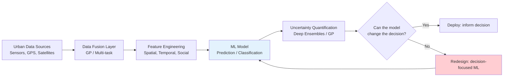
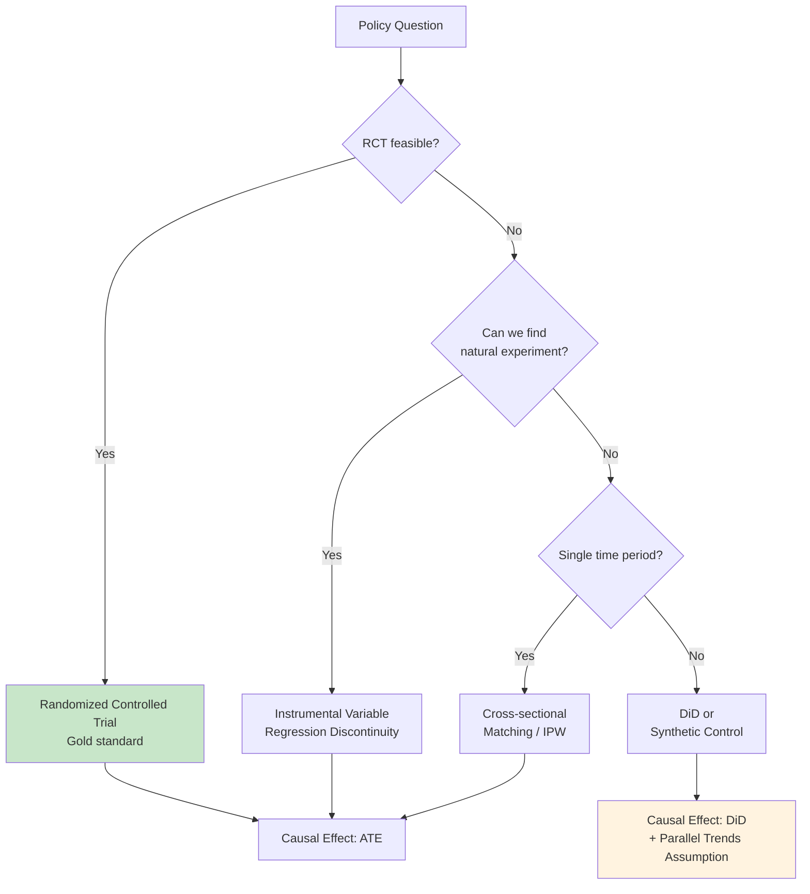
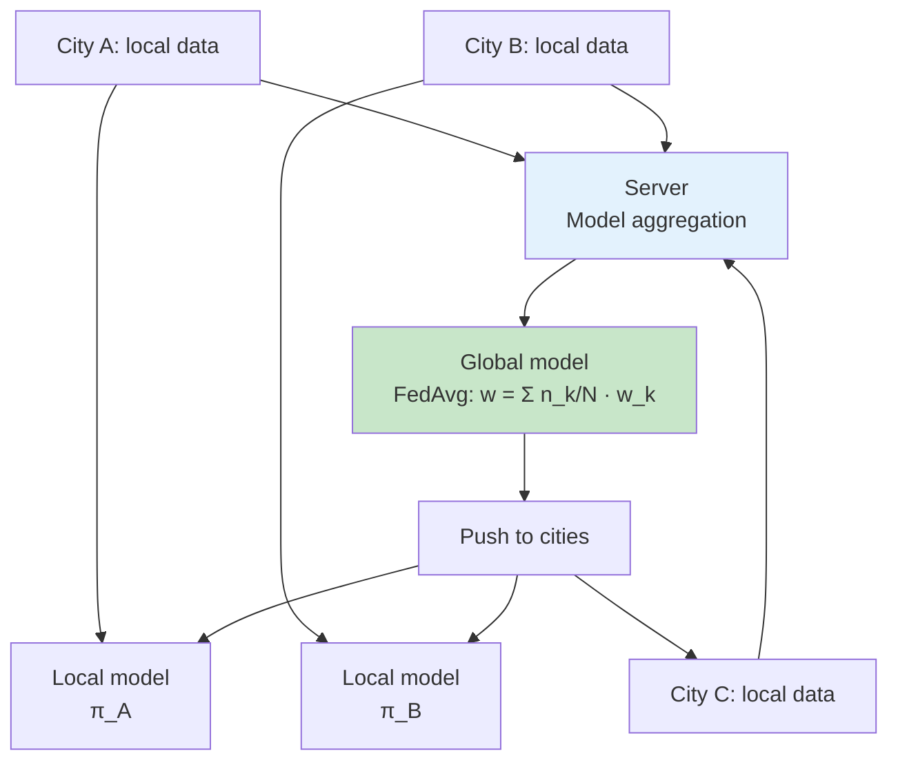
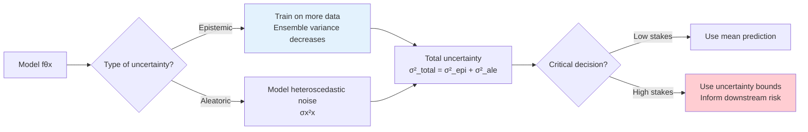

# 1.C51 / 1.C01 Machine Learning for Sustainable Systems (Grad)

**MIT CEE | Energy, Transportation & Societal Systems Track | 6 units | Spring (second half of term)**
**Instructor: Prof. Saurabh Amin**
**Prerequisite:** 6.C51 (Modeling with ML: from Algorithms to Applications) + (1.000 or 1.010 or permission)
**Must be taken with:** 6.C51 simultaneously. Credit not given without completion of both.
**Same as:** 1.C01 (undergrad version)
**自學路徑：MEng DSES / MEng SMD → ML for Infrastructure → Research / Tech / Policy**

> **Source:** MIT Catalog + computing.mit.edu/cross-cutting (hub-and-spoke model)
> **Textbooks:** Research papers (distributed via class)
> **Note:** This is the "spoke" module. The "hub" is 6.C51, which must be taken simultaneously.
> **Award:** Prof. Saurabh Amin received the 2025 Common Ground Excellence in Teaching Award for this course.

---

## 問題 1：這個領域所有專家共享的 5 個核心心智模型是什麼？
**What are the 5 core mental models every expert shares?**

1. **ML formulation is the critical step, not the algorithm choice**
   The hardest part of ML for sustainability is translating the engineering question into a supervised/unsupervised/RL problem. Prof. Amin: "Students come to class knowing algorithms but struggling with: What exactly should I predict? What is the right loss function for this engineering constraint? How do I validate that the model's prediction translates to engineering improvement?" For climate adaptation: Is it a regression problem? Classification? How do you handle rare events (extremes)? The engineering constraint (infrastructure safety) often maps to an asymmetric loss: false negatives (missed flood risk) are far more costly than false positives (unnecessary evacuation). This changes the decision threshold and the evaluation metric, not just the algorithm.

2. **Causal inference from observational data is harder than prediction**
   "Does bike lane installation reduce car congestion?" — this requires causal inference, not prediction. The challenge: (a) no counterfactuals (you can't observe the same road without the bike lane), (b) selection bias (bike lanes are installed on roads already facing congestion), (c) interference (bike lanes on one road affect neighboring roads). The tools: difference-in-differences, synthetic control, instrumental variables, regression discontinuity, causal graphical models. Prof. Amin emphasizes that ML models trained on observational data predict correlations, not causal effects — and conflating them leads to bad policy decisions.

3. **Heterogeneous data fusion from urban systems is the bottleneck**
   Smart city data comes from: (a) fixed sensors (loop detectors, weather stations — complete but sparse), (b) mobile sensors (GPS probes, smartphones — dense but biased), (c) social media (Twitter, Waze — noisy but real-time), (d) surveys (census, land use — accurate but outdated). No single data source is sufficient. The key methods: (a) multi-task learning — shared representation across modalities, (b) Gaussian process fusion — propagate uncertainty across scales, (c) transfer learning from similar cities. The critical challenge: each data modality has different error characteristics, spatial coverage, and temporal resolution. Fusing them naively introduces systematic biases.

4. **Distribution shift is the default, not the exception**
   Models trained on historical data → deployed in climate-changed future. The engineering problem of climate adaptation IS a distribution shift problem. The methods: (a) domain adaptation (reweight training to match test distribution), (b) causal domain adaptation (identify features whose distribution changes), (c) robust optimization (minimax: minimize worst-case loss over an uncertainty set). Prof. Amin: "A model that achieves 95% accuracy on last year's data and 60% on this year's data is not a 95% accurate model — it's a model that happened to fit last year's distribution."

5. **Decision-making under deep uncertainty requires non-standard ML**
   Standard ML optimizes expected performance. But for climate adaptation: deep uncertainty (GCM uncertainty, economic growth uncertainty, adaptation effectiveness uncertainty) → the expected cost of under-preparing is catastrophic, while the expected cost of over-preparing is manageable. The approach: robust decision-making (no-regret learning), info-gap theory (how much info is needed to change the decision?), and robust optimization (minimax regret). This is fundamentally different from standard risk-minimization ML.

---

## 問題 2：這個領域的專家在哪 3 個地方存在根本分歧？

### 分歧 1: 預測驅動 vs. 決策驅動 ML
- **預測驅動派** (standard ML): Train model on historical data → predict future → make decisions based on predictions. The ML model is the bottleneck; optimize its accuracy.
- **決策驅動派** (operations research + ML): Start with the decision to be made → design the ML problem to inform that decision. Inverse RL, decision-focused learning ( Donti et al., 2021). Key insight: "Accuracy" of the ML model is meaningless if it doesn't change the optimal decision.
- **核心張力**: For rare events (floods, earthquakes, infrastructure failures), prediction accuracy is misleading. A model with 99% accuracy might miss 100% of floods (if floods are 1% of data). Decision-focused learning directly optimizes the downstream decision: "Should we evacuate?" vs. "What is the flood probability?"

### 分歧 2: 數據驅動 vs. 機制模型
- **數據驅動派** (end-to-end DL): Let the data speak. Neural networks learn the governing physics implicitly. For chaotic systems (turbulent flow, extreme weather), this may be the only viable approach.
- **機制模型派** (physics-informed ML): Start with ODEs/PDEs of the system. Use ML to correct residuals or identify unknown parameters. The physical model is the inductive bias that enables sample efficiency and extrapolation.
- **核心張力**: For novel conditions (climate change scenarios never observed in training data), physics-based models extrapolate with physical consistency, while data-driven models may extrapolate badly. Hybrid physics-ML exploits both: physics for out-of-distribution robustness, data for correcting physical model errors.

### 分歧 3: 隱私 vs. 協作
- **隱私派** (data sovereignty): Each city/utility owns its data. Sharing raw data violates privacy and competitive advantage. Federated learning enables model training without data sharing.
- **協作派** (public goods): Urban systems are interconnected (regional air quality, shared water basins). Collaboration on data improves models for everyone. The tragedy of the commons: each city under-invests in data infrastructure because benefits are shared.
- **核心張力**: Federated learning is a compromise: models are shared, not raw data. But federated learning on heterogeneous infrastructure networks (each city has different sensor types, quality, and density) is technically challenging. Differential privacy (adding calibrated noise to model updates) trades off privacy for utility.

---

## 問題 3：10 個區分真實理解 vs. 死記硬背的深度問題

1. A city installs 500 new air quality sensors and collects 3 months of data. (a) How would you detect sensor failures and outliers? (b) How would you interpolate missing data? (c) How would you validate the resulting city-wide air quality map against EPA reference stations? (d) What statistical test would you use to determine if the air quality improvement after a policy change is statistically significant?

2. For a flood prediction model: you have 50 years of historical flood data, but only 5 major floods. (a) How do you validate a model for an event that happens once a decade? (b) Design a synthetic data generation strategy. (c) What is the appropriate evaluation metric? (d) How would you communicate model uncertainty to emergency managers?

3. Explain the difference between transfer learning and domain adaptation. Design a transfer learning strategy for adapting a traffic prediction model from Boston to Chicago. What distribution shift would you expect, and how would you quantify it?

4. A neural network predicts infrastructure failure with 85% accuracy. The city's risk manager asks: "What features should we change to reduce failures?" How would you use SHAP values and counterfactual explanations to answer this question? Design the entire explainability pipeline.

5. For a water distribution network with 10,000 pipes: design an active learning loop to prioritize which pipes to inspect. The goal is to minimize the number of failures during the next year. (a) What is the acquisition function? (b) How would you model pipe failure probability? (c) How would you handle the explore-exploit tradeoff?

6. Compare: (a) Gaussian Process, (b) Random Forest, (c) LSTM, (d) Physics-Informed Neural Network for predicting hourly water demand in a building. For each, describe: What is the computational cost? What uncertainty estimates does it provide? How well does it extrapolate? Which would you use for real-time demand response?

7. A city wants to predict which neighborhoods are most vulnerable to heat waves. The available data: temperature sensors (10 stations, 5 years), satellite thermal imagery (monthly, 30m resolution), census data (5-year), hospital records (daily admissions, 10 years). Design a data fusion approach that leverages all modalities.

8. For a decentralized energy grid with 1,000 microgrids: design a federated learning protocol for predicting load. (a) What communication protocol? (b) How would you handle non-IID data distributions (each microgrid has different consumption patterns)? (c) How would you prevent model poisoning attacks?

9. A climate model predicts a 50% increase in extreme precipitation events by 2050. A civil infrastructure model predicts a 30% increase in pipe failure rates for the same scenario. How would you combine these two models to estimate infrastructure investment needs? What are the uncertainties in each projection?

10. For a ride-sharing platform: design an RL agent for dynamic pricing that (a) maximizes revenue, (b) minimizes rider wait time, (c) maintains equity (low-income neighborhoods don't get systematically higher prices). Formulate this as an MDP and discuss the reward design.

---

# 核心心智模型深化（中英對照）

## 1. 數據融合 — Data Fusion for Urban Systems

### 1.1 Bilingual 概念對照
| English | 中英對照 | Definition | 物理意義 |
|---|---|---|---|
| Multi-task learning | 多任務學習 | Shared representation across tasks | 跨數據模態學習 |
| Gaussian process fusion | 高斯過程融合 | Bayesian uncertainty propagation | 不確定性跨尺度傳播 |
| Heteroscedastic uncertainty | 異方差不確定性 | Noise depends on input | 傳感器誤差建模 |
| Cross-validation | 交叉驗證 | Hold out temporal/space blocks | 時空數據分割 |
| Data imputation | 數據填補 | Fill missing values | 缺失數據處理 |

### 1.2 Key Derivation — Gaussian Process Fusion

**GP Regression** for a single sensor:
$$f(x) \sim \mathcal{GP}(\mu(x), k(x, x'))$$
Prediction at test point $x^*$:
$$\hat{f}(x^*) = k(x^*, X)K(X,X)^{-1}y \pm \hat{\sigma}(x^*)$$
$$\hat{\sigma}^2(x^*) = k(x^*, x^*) - k(x^*, X)K(X,X)^{-1}k(X, x^*)$$

**Multi-source fusion**: Let $y_1$ (station data) and $y_2$ (satellite imagery) both measure the same quantity (temperature).

$$p(T | y_1, y_2) \propto p(y_1 | T)p(y_2 | T)p(T)$$

Using Gaussian likelihoods:
$$p(y_1 | T) = \mathcal{N}(y_1 | T, \sigma_1^2)$$
$$p(y_2 | T) = \mathcal{N}(y_2 | T, \sigma_2^2)$$

Posterior mean:
$$\hat{T} = \frac{y_1/\sigma_1^2 + y_2/\sigma_2^2}{1/\sigma_1^2 + 1/\sigma_2^2}$$

This is **weighted averaging** where weights = inverse variance (information-theoretic optimal).

### 1.3 Engineering Applications
- **Air quality mapping**: Combine PurpleAir sensors (low-cost, noisy) with EPA reference stations (accurate, sparse) via Kriging with uncertain observations.
- **Traffic state estimation**: Fuse loop detector speeds + Bluetooth travel times + GPS probe data. Each source has different error characteristics.

---

## 2. 因果推斷 — Causal Inference for Urban Policy

### 2.1 Bilingual 概念對照
| English | 中英對照 | Definition | 物理意義 |
|---|---|---|---|
| Difference-in-differences | 雙重差分 | $(\bar{Y}_{T,1} - \bar{Y}_{C,1}) - (\bar{Y}_{T,0} - \bar{Y}_{C,0})$ | 政策效果估計 |
| Synthetic control | 合成對照 | Weighted combination of control units | 反事實構造 |
| Instrumental variable | 工具變量 | Correlated with treatment, not outcome | 因果識別 |
| Regression discontinuity | 迴歸不連續 | Treatment threshold as natural experiment | 局部因果效應 |
| Potential outcomes | 潛在結果 | $Y(1)$ vs. $Y(0)$ | 因果框架 |

### 2.2 Key Derivation — Difference-in-Differences

**Setup**: Treatment group $T$ and control group $C$, pre/post periods $t=0, 1$.

**Observed outcomes**: $\bar{Y}_{T,1}, \bar{Y}_{T,0}, \bar{Y}_{C,1}, \bar{Y}_{C,0}$.

**DiD estimator**:
$$\hat{\tau}_{DiD} = (\bar{Y}_{T,1} - \bar{Y}_{T,0}) - (\bar{Y}_{C,1} - \bar{Y}_{C,0})$$

**Key assumption**: Parallel trends — in the absence of treatment, the treatment group would have followed the same trend as the control group.

$$\mathbb{E}[Y_t(0) | T=1] - \mathbb{E}[Y_t(0) | T=0] = \mathbb{E}[Y_0(0) | T=1] - \mathbb{E}[Y_0(0) | T=0] \quad \forall t$$

**Variance estimation** (Abadie et al., 2010):
$$Var(\hat{\tau}_{DiD}) = \frac{1}{(N_T-1)}\sum_{i \in T} ((\hat{Y}_{i,1} - \hat{Y}_{i,0}) - \hat{\tau}_{DiD})^2 + \frac{1}{(N_C-1)}\sum_{j \in C} ((\hat{Y}_{j,1} - \hat{Y}_{j,0}))^2$$

where $\hat{Y}_{i,t}$ is the counterfactual for unit $i$.

**Numerical example**: Bike lane study:
Pre-period: Treatment area: 80 vehicles/hour, Control area: 75 vehicles/hour
Post-period: Treatment area: 65 vehicles/hour, Control area: 72 vehicles/hour

$\hat{\tau}_{DiD} = (65-80) - (72-75) = -15 - (-3) = -12$ vehicles/hour reduction.

The bike lane reduced congestion by 12 vehicles/hour after accounting for city-wide trends.

---

## 3. 不確定性量化 — Uncertainty Quantification

### 3.1 Key Derivation — Deep Ensembles for UQ

**Approach** (Lakshminarayanan et al., 2017): Train $M$ neural networks with different random seeds and weight initializations. Each network $m$ predicts:
$$\hat{y}^{(m)} = f_\theta^{(m)}(x), \quad \hat{\sigma}^{(m)2} = \text{aleatoric noise}$$

**Combined prediction**:
$$\hat{y} = \frac{1}{M}\sum_m \hat{y}^{(m)}$$
$$\hat{\sigma}^2 = \underbrace{\frac{1}{M}\sum_m (\hat{y}^{(m)} - \hat{y})^2}_{\text{epistemic}} + \underbrace{\frac{1}{M}\sum_m \hat{\sigma}^{(m)2}}_{\text{aleatoric}}$$

**Separation of uncertainties**:
- Epistemic (reducible with more data) = variance across ensemble
- Aleatoric (irreducible) = average per-network uncertainty

**For rare events**: If the rare event class is < 5% of data, standard ensembling underestimates uncertainty. Use:
- **Balanced sampling** in training
- **Focal loss**: $\mathcal{L} = -\alpha(1-\hat{p})^\gamma \log\hat{p}$ for the rare class
- **Gaussian process** for well-calibrated uncertainty at low-data regions

---

## 4. 轉移學習 — Transfer Learning for Urban Infrastructure

### 4.1 Key Derivation — Domain Adaptation

**Covariate shift**: $P_{source}(x) \neq P_{target}(x)$, but $P(y|x)$ is the same.
**Concept shift**: $P_{source}(y|x) \neq P_{target}(y|x)$, but $P(x)$ is the same.
**Joint shift**: Both shift simultaneously.

**Covariate shift correction** (Shimodaira, 2000):
Re-weight source samples by importance ratio:
$$w(x) = \frac{P_{target}(x)}{P_{source}(x)}$$

In practice, estimate $P(x)$ using kernel density estimation or logistic regression:
$$\hat{w}(x) = \frac{\hat{P}_{target}(x)}{\hat{P}_{source}(x)}$$

**For city transfer**: Feature alignment (road type, speed limit, density) reduces distribution shift. The shift in traffic patterns between Boston and Chicago is dominated by: different land use patterns, different transit availability, different highway grid density. Aligning on these features reduces the shift.

---

## 5. 強化學習基礎設施 — RL for Infrastructure Control

### 5.1 Key Derivation — Soft Actor-Critic (SAC)

SAC (Haarnoja et al., 2018) maximizes entropy-regularized return:
$$J(\theta) = \mathbb{E}\left[\sum_t \gamma^t [r(s_t, a_t) + \alpha \mathcal{H}(\pi_\theta(\cdot|s_t)]\right]$$

where $\mathcal{H}$ = policy entropy, $\alpha$ = temperature parameter.

**Value functions**:
$$V(s) = \mathbb{E}_{a \sim \pi}[Q(s,a) - \alpha \log \pi(a|s)]$$
$$Q(s,a) = r(s,a) + \gamma \mathbb{E}_{s'}[V(s')]$$

**Update rule**: Two Q-networks (to reduce overestimation bias):
$$Q_{\phi_1}, Q_{\phi_2} \leftarrow \text{target update}$$
$$\pi_\theta \leftarrow \text{update via reparameterization trick}$$

**For infrastructure**: SAC is preferred over DQN for continuous action spaces (building temperature setpoints, valve positions) because it naturally handles stochastic policies and has better exploration.

---

# 深度自測問題詳解

## 詳解 1: Air Quality Validation
**Q1.** (a) Sensor failure detection: Use spatial correlation — if a sensor reads 10°C above neighboring sensors during a stable weather period, flag as failure. Use time-series anomaly detection (z-score > 3). Compare to physical range (temperature: -40°C to +50°C).

(b) Missing data interpolation: Kriging (spatial) + interpolation for temporal gaps. For multi-day outages: use nearby sensors + weather-conditional regression.

(c) Validation: Hold out EPA stations as ground truth. Compute RMSE, MAPE, and spatial correlation. Use the held-out EPA data to assess calibration: $\hat{c}_{EPA} = \beta_0 + \beta_1 \hat{c}_{model}$. Good model: $\beta_0 \approx 0, \beta_1 \approx 1, R^2 > 0.7$.

(d) Statistical significance: Two-sample t-test or Mann-Whitney U test on pre/post mean. Or: interrupted time series regression with ARIMA errors: $Y_t = \alpha + \beta \cdot \text{Post}_t + \gamma \cdot t + \epsilon_t$.

## 詳解 3: Transfer Learning Boston → Chicago
**Q3.** (a) Transfer learning: Pre-train on Boston, fine-tune on Chicago data. Domain adaptation: re-weight Boston samples to match Chicago feature distribution.

(b) Expected distribution shifts:
- Road density: Boston (urban, dense) vs. Chicago (more suburban sprawl)
- Transit coverage: Different subway and bus networks
- Weather patterns: Chicago colder, more lake-effect snow

(c) Quantify shift: Use Kullback-Leibler divergence $KL(P_{Boston}(x) || P_{Chicago}(x))$. Compute MMD (Maximum Mean Discrepancy) between feature distributions.

## 詳解 5: Active Learning for Pipe Inspection
**Q5.** (a) Acquisition function: Expected Information Gain.
$$\phi(x) = \mathbb{E}[I(Y; \theta | x)] = \mathbb{E}[\text{Var}(\theta | y_{new})] = \text{Reduction in posterior variance after observing $y$ at $x$}$$

For GP: $\sigma^2(x)$ (predictive variance) is the natural acquisition function. Select next pipe to inspect: $\arg\max_x \sigma^2(x)$.

(b) Explore-exploit tradeoff: $\alpha \cdot \sigma(x) + (1-\alpha) \cdot \mu_{failure}(x)$. With $\alpha$ decreasing over time (less exploration as more data is collected).

(c) Budget constraint: After $K$ inspections, compute posterior failure probability $P(failure | \text{all data})$. Flag top-$N$ for priority replacement.

---

## 📊 Diagram 1: ML Pipeline for Urban Infrastructure


## 📊 Diagram 2: Causal Inference Decision Tree


## 📊 Diagram 3: Federated Learning for Cities


## 📊 Diagram 4: Uncertainty Quantification


## 📊 Diagram 5: Decision-Focused ML
```mermaid
flowchart TD
    A[Decision problem<br/>min_x Cost(x, y)] --> B{Predict y?}
    B -->|Standard ML| C[Train: min Σ Ly - fθx²]
    B -->|Decision-focused| D[Train: min E_costx, fθx]
    C --> E[Prediction f̂x]
    D --> F[Decision x̂ = argmin Costx, f̂x]
    E --> G[Optimal decision<br/>based on f̂x]
    F --> H[Optimal decision<br/>directly optimized]
    style D fill:#c8e6c9
    style F fill:#c8e6c9
```

---

## 總結

1. **ML formulation is the bottleneck**: The hardest part is translating the engineering problem into the right ML formulation, not selecting the best algorithm. Asymmetric losses, decision thresholds, and evaluation metrics must be designed with the engineering application in mind.

2. **Causal inference for policy evaluation**: ML models predict correlations. For policy decisions, we need causal estimates. DiD, synthetic control, and instrumental variables are the tools for observational causal inference.

3. **Data fusion is the frontier**: Urban systems produce heterogeneous, multi-modal data. The combination of physics-based models (for interpolation/extrapolation) with data-driven models (for correction) is the most robust approach.

4. **Distribution shift is the climate problem**: Climate adaptation IS a distribution shift problem. Models must be evaluated on their ability to extrapolate to novel conditions, not just their in-sample accuracy.

5. **Federated learning enables cross-city learning**: Privacy-preserving collaborative learning across cities and utilities is the path to improved infrastructure ML without compromising data sovereignty.

**自學建議** — Pair with: Pearl *Causality: Models, Reasoning and Inference* (causal inference); Rudin *Interpretable Machine Learning* (fairness + interpretability); Goodfellow *Deep Learning* (optimization + generalization); Sutton & Barto *RL* (RL for control).

**Prerequisite chain**: Probability → Linear Algebra → 6.C51 (ML hub) → 1.C51 (ML spoke for CEE)
