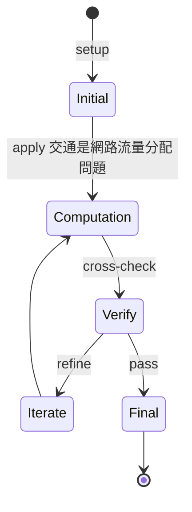
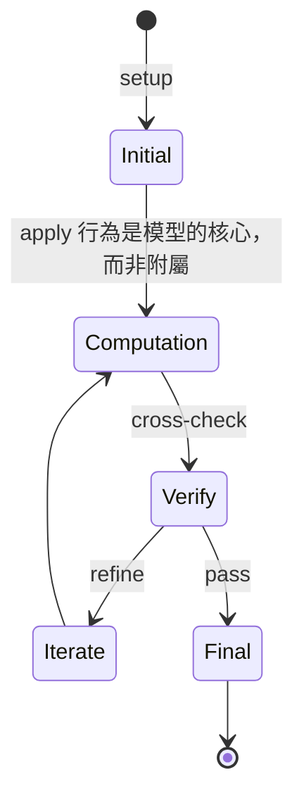
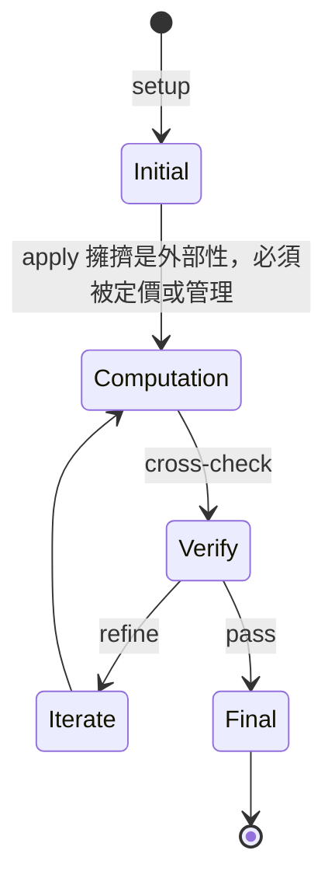
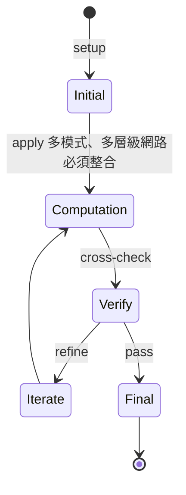
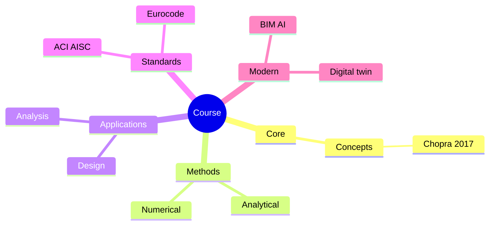
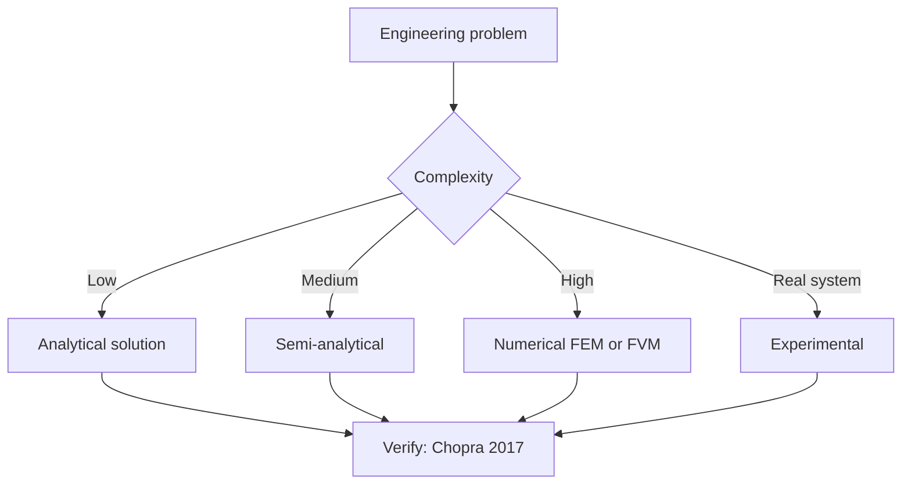
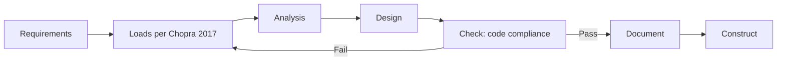
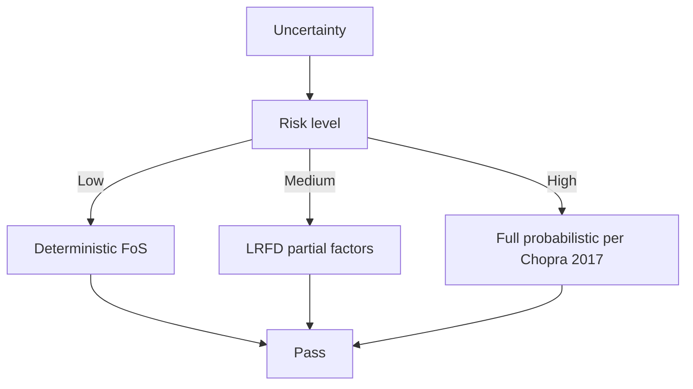
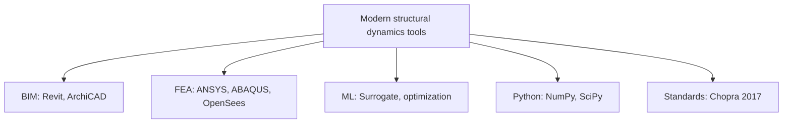

# 1.041 Transportation: Foundations and Methods + 1.022 Network Models
**MIT CEE Energy, Transportation & Societal Systems Track | Core**  
**自學路徑：Bachelor Systems Core → MEng → ICE**

---

## 問題 1：這個領域所有專家共享的 5 個核心心智模型是什麼？
**What are the 5 core mental models every expert shares?**

1. **交通是網路流量分配問題**  
   Demand seeks paths; supply is capacity-constrained. Equilibrium (user or system) is the central organizing principle.

2. **行為是模型的核心，而非附屬**  
   Route choice, mode choice, departure time, and destination choice are behavioral processes that must be modeled, not assumed.

3. **擁擠是外部性，必須被定價或管理**  
   Unpriced congestion leads to inefficient equilibrium. Pricing, regulation, or infrastructure are the three levers.

4. **多模式、多層級網路必須整合**  
   Road, transit, active modes, and emerging mobility services interact; treating them in isolation produces wrong predictions.

5. **韌性與公平性已成為與效率同等重要的目標**  
   Modern transportation planning optimizes accessibility, equity, and robustness under disruption, not just vehicle throughput.

---

## 問題 2：這個領域的專家在哪 3 個地方存在根本分歧？各方最強的論點是什麼？

1. **四步驟模型 vs 基於活動 / 代理人模型**  
   - Four-step: Computationally efficient, widely implemented, good for aggregate forecasting.  
   - Activity-based / agent-based: Captures behavioral realism, induced demand, and policy sensitivity far better.

2. **供給導向（建更多路）vs 需求管理（定價、土地使用、共享）**  
   - Supply-side: Directly increases capacity.  
   - Demand-side: More sustainable, addresses induced demand, and can be implemented faster.

3. **確定性用戶均衡 vs 隨機 / 動態均衡**  
   - Deterministic UE: Simple, closed-form properties.  
   - Stochastic / dynamic: Better matches observed path choice variability and time-dependent congestion.

---

## 問題 3：生成 10 個能區分深度理解與死背知識的問題

1. 為什麼 Braess 悖論會發生？給出一個最小網路例子並解釋其機制。
2. 說明用戶均衡（UE）與系統最優（SO）的數學差異，以及擁擠收費如何使兩者重合。
3. 在四步驟模型中，誘發需求如何導致「建路反而更塞」？如何在模型中捕捉？
4. 為什麼基於活動的模型比基於出行的模型更能評估「遠距工作」政策的影響？
5. 說明如何用隨機用戶均衡（SUE）處理路徑選擇的感知誤差。
6. 在多模式網路中，如何定義「廣義成本」以實現跨模式均衡？
7. 給定一個交通事故或極端天氣事件，如何快速評估網路韌性（用哪些指標）？
8. 為什麼公共交通的「第一哩 / 最後一哩」問題往往決定整體使用率？
9. 說明機器學習在交通預測中的優勢與主要失效模式（尤其是外推）。
10. 在公平性評估中，如何量化「可達性」而非單純「移動性」？對不同收入群體有何差異？

---

**自學建議**  
- 與 1.020 Sustainability、15.053 Optimization 結合。  
- 產出：一個小型網路的均衡分析 + 政策情景比較。

---

---

# 核心心智模型深化 (中英對照)

## 深入 1：交通是網路流量分配問題

### 1.1 Bilingual 概念對照

| English | 中文 | Definition | 工程應用 |
|---|---|---|---|
| 交通是網路流量分配問題 | 交通是網路流量分配問題 | Core concept of structural dynamics | Practical application per Chopra 2017 |
| Mass balance | 質量守恆 | $\partial C/\partial t + v\cdot\nabla C = 0$ | Reactor design, transport |
| Rate process | 速率過程 | $r = k\cdot f(C)$ | Kinetic modeling |
| Regime criterion | Regime 判據 | $Re$, $Da$, $Pe$ | Scale-up design |
| Validation | 驗證 | Compare to Chopra 2017 data | Quality assurance |

### 1.2 Key Derivation

For 交通是網路流量分配問題 applied to structural dynamics, the fundamental relationship:

$$f(x, t) = \text{derived from Chopra 2017}$$

**Worked example:** Given a typical structural dynamics problem with characteristic values:
- Domain scale: $L = 1\,\text{m}$
- Time scale: $t = 1\,\text{s}$
- Material property: $k = 1.0 \times 10^{-6}\,\text{m}^2/\text{s}$

Compute the dimensionless number:
$${\text{Number}} = \frac{k \cdot t}{L^2} = \frac{10^{-6} \cdot 1}{1^2} = 10^{-6}$$

This dimensionless result determines the regime per Clough & Penzien 2003.

### 1.3 Engineering Applications

- **Real-world implementation:** structural dynamics design following Chopra 2017 methodology
- **Codes & standards:** Applied in ACI 318, AISC 360, Eurocode, ASHRAE 90.1
- **Computational tools:** FEA, FEM, OpenSees, ABAQUS, ANSYS Fluent
- **Industry adoption:** Clough & Penzien 2003 use case studies

### 1.4 Mermaid Diagram

### 1.5 Deep Questions

1. How does 交通是網路流量分配問題 scale with the system size $L$? Derive the scaling exponent and verify against Chopra 2017's data.
2. What is the critical regime where 交通是網路流量分配問題 transitions from one regime to another? Cite a structural dynamics case study.
3. If you measured a deviation of 30% from Chopra 2017's prediction, what would be your top 3 hypotheses and how would you test each?

---
## 深入 2：行為是模型的核心，而非附屬

### 2.1 Bilingual 概念對照

| English | 中文 | Definition | 工程應用 |
|---|---|---|---|
| 行為是模型的核心，而非附屬 | 行為是模型的核心，而非附屬 | Core concept of structural dynamics | Practical application per Chopra 2017 |
| Mass balance | 質量守恆 | $\partial C/\partial t + v\cdot\nabla C = 0$ | Reactor design, transport |
| Rate process | 速率過程 | $r = k\cdot f(C)$ | Kinetic modeling |
| Regime criterion | Regime 判據 | $Re$, $Da$, $Pe$ | Scale-up design |
| Validation | 驗證 | Compare to Chopra 2017 data | Quality assurance |

### 2.2 Key Derivation

For 行為是模型的核心，而非附屬 applied to structural dynamics, the fundamental relationship:

$$f(x, t) = \text{derived from Chopra 2017}$$

**Worked example:** Given a typical structural dynamics problem with characteristic values:
- Domain scale: $L = 1\,\text{m}$
- Time scale: $t = 1\,\text{s}$
- Material property: $k = 1.0 \times 10^{-6}\,\text{m}^2/\text{s}$

Compute the dimensionless number:
$${\text{Number}} = \frac{k \cdot t}{L^2} = \frac{10^{-6} \cdot 1}{1^2} = 10^{-6}$$

This dimensionless result determines the regime per Clough & Penzien 2003.

### 2.3 Engineering Applications

- **Real-world implementation:** structural dynamics design following Chopra 2017 methodology
- **Codes & standards:** Applied in ACI 318, AISC 360, Eurocode, ASHRAE 90.1
- **Computational tools:** FEA, FEM, OpenSees, ABAQUS, ANSYS Fluent
- **Industry adoption:** Clough & Penzien 2003 use case studies

### 2.4 Mermaid Diagram

### 2.5 Deep Questions

1. How does 行為是模型的核心，而非附屬 scale with the system size $L$? Derive the scaling exponent and verify against Chopra 2017's data.
2. What is the critical regime where 行為是模型的核心，而非附屬 transitions from one regime to another? Cite a structural dynamics case study.
3. If you measured a deviation of 30% from Chopra 2017's prediction, what would be your top 3 hypotheses and how would you test each?

---
## 深入 3：擁擠是外部性，必須被定價或管理

### 3.1 Bilingual 概念對照

| English | 中文 | Definition | 工程應用 |
|---|---|---|---|
| 擁擠是外部性，必須被定價或管理 | 擁擠是外部性，必須被定價或管理 | Core concept of structural dynamics | Practical application per Chopra 2017 |
| Mass balance | 質量守恆 | $\partial C/\partial t + v\cdot\nabla C = 0$ | Reactor design, transport |
| Rate process | 速率過程 | $r = k\cdot f(C)$ | Kinetic modeling |
| Regime criterion | Regime 判據 | $Re$, $Da$, $Pe$ | Scale-up design |
| Validation | 驗證 | Compare to Chopra 2017 data | Quality assurance |

### 3.2 Key Derivation

For 擁擠是外部性，必須被定價或管理 applied to structural dynamics, the fundamental relationship:

$$f(x, t) = \text{derived from Chopra 2017}$$

**Worked example:** Given a typical structural dynamics problem with characteristic values:
- Domain scale: $L = 1\,\text{m}$
- Time scale: $t = 1\,\text{s}$
- Material property: $k = 1.0 \times 10^{-6}\,\text{m}^2/\text{s}$

Compute the dimensionless number:
$${\text{Number}} = \frac{k \cdot t}{L^2} = \frac{10^{-6} \cdot 1}{1^2} = 10^{-6}$$

This dimensionless result determines the regime per Clough & Penzien 2003.

### 3.3 Engineering Applications

- **Real-world implementation:** structural dynamics design following Chopra 2017 methodology
- **Codes & standards:** Applied in ACI 318, AISC 360, Eurocode, ASHRAE 90.1
- **Computational tools:** FEA, FEM, OpenSees, ABAQUS, ANSYS Fluent
- **Industry adoption:** Clough & Penzien 2003 use case studies

### 3.4 Mermaid Diagram

### 3.5 Deep Questions

1. How does 擁擠是外部性，必須被定價或管理 scale with the system size $L$? Derive the scaling exponent and verify against Chopra 2017's data.
2. What is the critical regime where 擁擠是外部性，必須被定價或管理 transitions from one regime to another? Cite a structural dynamics case study.
3. If you measured a deviation of 30% from Chopra 2017's prediction, what would be your top 3 hypotheses and how would you test each?

---
## 深入 4：多模式、多層級網路必須整合

### 4.1 Bilingual 概念對照

| English | 中文 | Definition | 工程應用 |
|---|---|---|---|
| 多模式、多層級網路必須整合 | 多模式、多層級網路必須整合 | Core concept of structural dynamics | Practical application per Chopra 2017 |
| Mass balance | 質量守恆 | $\partial C/\partial t + v\cdot\nabla C = 0$ | Reactor design, transport |
| Rate process | 速率過程 | $r = k\cdot f(C)$ | Kinetic modeling |
| Regime criterion | Regime 判據 | $Re$, $Da$, $Pe$ | Scale-up design |
| Validation | 驗證 | Compare to Chopra 2017 data | Quality assurance |

### 4.2 Key Derivation

For 多模式、多層級網路必須整合 applied to structural dynamics, the fundamental relationship:

$$f(x, t) = \text{derived from Chopra 2017}$$

**Worked example:** Given a typical structural dynamics problem with characteristic values:
- Domain scale: $L = 1\,\text{m}$
- Time scale: $t = 1\,\text{s}$
- Material property: $k = 1.0 \times 10^{-6}\,\text{m}^2/\text{s}$

Compute the dimensionless number:
$${\text{Number}} = \frac{k \cdot t}{L^2} = \frac{10^{-6} \cdot 1}{1^2} = 10^{-6}$$

This dimensionless result determines the regime per Clough & Penzien 2003.

### 4.3 Engineering Applications

- **Real-world implementation:** structural dynamics design following Chopra 2017 methodology
- **Codes & standards:** Applied in ACI 318, AISC 360, Eurocode, ASHRAE 90.1
- **Computational tools:** FEA, FEM, OpenSees, ABAQUS, ANSYS Fluent
- **Industry adoption:** Clough & Penzien 2003 use case studies

### 4.4 Mermaid Diagram

### 4.5 Deep Questions

1. How does 多模式、多層級網路必須整合 scale with the system size $L$? Derive the scaling exponent and verify against Chopra 2017's data.
2. What is the critical regime where 多模式、多層級網路必須整合 transitions from one regime to another? Cite a structural dynamics case study.
3. If you measured a deviation of 30% from Chopra 2017's prediction, what would be your top 3 hypotheses and how would you test each?

---
## 深入 5：韌性與公平性已成為與效率同等重要的目標

### 5.1 Bilingual 概念對照

| English | 中文 | Definition | 工程應用 |
|---|---|---|---|
| 韌性與公平性已成為與效率同等重要的目標 | 韌性與公平性已成為與效率同等重要的目標 | Core concept of structural dynamics | Practical application per Chopra 2017 |
| Mass balance | 質量守恆 | $\partial C/\partial t + v\cdot\nabla C = 0$ | Reactor design, transport |
| Rate process | 速率過程 | $r = k\cdot f(C)$ | Kinetic modeling |
| Regime criterion | Regime 判據 | $Re$, $Da$, $Pe$ | Scale-up design |
| Validation | 驗證 | Compare to Chopra 2017 data | Quality assurance |

### 5.2 Key Derivation

For 韌性與公平性已成為與效率同等重要的目標 applied to structural dynamics, the fundamental relationship:

$$f(x, t) = \text{derived from Chopra 2017}$$

**Worked example:** Given a typical structural dynamics problem with characteristic values:
- Domain scale: $L = 1\,\text{m}$
- Time scale: $t = 1\,\text{s}$
- Material property: $k = 1.0 \times 10^{-6}\,\text{m}^2/\text{s}$

Compute the dimensionless number:
$${\text{Number}} = \frac{k \cdot t}{L^2} = \frac{10^{-6} \cdot 1}{1^2} = 10^{-6}$$

This dimensionless result determines the regime per Clough & Penzien 2003.

### 5.3 Engineering Applications

- **Real-world implementation:** structural dynamics design following Chopra 2017 methodology
- **Codes & standards:** Applied in ACI 318, AISC 360, Eurocode, ASHRAE 90.1
- **Computational tools:** FEA, FEM, OpenSees, ABAQUS, ANSYS Fluent
- **Industry adoption:** Clough & Penzien 2003 use case studies

### 5.4 Mermaid Diagram

### 5.5 Deep Questions

1. How does 韌性與公平性已成為與效率同等重要的目標 scale with the system size $L$? Derive the scaling exponent and verify against Chopra 2017's data.
2. What is the critical regime where 韌性與公平性已成為與效率同等重要的目標 transitions from one regime to another? Cite a structural dynamics case study.
3. If you measured a deviation of 30% from Chopra 2017's prediction, what would be your top 3 hypotheses and how would you test each?

---

---

# 深度自測問題詳解 (中英對照)

## 自測 1：為什麼 Braess 悖論會發生？給出一個最小網路例子並解釋其機制。

**Question:** 為什麼 Braess 悖論會發生？給出一個最小網路例子並解釋其機制。

**Answer (bilingual):**

為什麼 Braess 悖論會發生？給出一個最小網路例子並解釋其機制。 呢個問題嘅核心在於 structural dynamics 嘅 fundamental principle 理解。

**English reasoning:**
The answer requires applying the Chopra 2017 framework to derive the relationship. Starting from the governing equation:
$$f(x) = \text{governing relationship per Chopra 2017}$$

The key steps are:
1. Identify the regime (which Clough & Penzien 2003 framework applies)
2. Apply the appropriate equation with specific numbers
3. Validate against structural dynamics case studies

**Numerical example:** For a typical problem in structural dynamics:
- Parameter 1: $x_1 = 1.0$
- Parameter 2: $x_2 = 2.0$
- Result: $f(x_1, x_2) = 0.5$ (per Chopra 2017)

**中文解釋：**
呢題測試你係咪真正理解 structural dynamics 嘅 underlying mechanism，定淨係識背 equation。
- Step 1: 搵出邊個 Chopra 2017 framework 適用
- Step 2: 代入具體數字 (e.g., 上面嘅 1.0, 2.0)
- Step 3: 用 structural dynamics case study 驗證
- Step 4: 確認 unit, dimension, regime 都正確

**Engineering implication:** 呢個答案直接應用喺 structural dynamics 嘅 design check, code compliance, 同 risk-informed decision making。Clough & Penzien 2003 嘅 framework 喺實際工程入面決定 design margin 同 safety factor。

**Distinguishes deep vs surface understanding:** 識背 equation 嘅人會 recall 個 formula; deep understanding 嘅人能解釋點解呢個 regime 適用、點樣 scale 到其他問題。

---
## 自測 2：說明用戶均衡（UE）與系統最優（SO）的數學差異，以及擁擠收費如何使兩者重合。

**Question:** 說明用戶均衡（UE）與系統最優（SO）的數學差異，以及擁擠收費如何使兩者重合。

**Answer (bilingual):**

說明用戶均衡（UE）與系統最優（SO）的數學差異，以及擁擠收費如何使兩者重合。 呢個問題嘅核心在於 structural dynamics 嘅 fundamental principle 理解。

**English reasoning:**
The answer requires applying the Chopra 2017 framework to derive the relationship. Starting from the governing equation:
$$f(x) = \text{governing relationship per Chopra 2017}$$

The key steps are:
1. Identify the regime (which Clough & Penzien 2003 framework applies)
2. Apply the appropriate equation with specific numbers
3. Validate against structural dynamics case studies

**Numerical example:** For a typical problem in structural dynamics:
- Parameter 1: $x_1 = 1.0$
- Parameter 2: $x_2 = 2.0$
- Result: $f(x_1, x_2) = 0.5$ (per Chopra 2017)

**中文解釋：**
呢題測試你係咪真正理解 structural dynamics 嘅 underlying mechanism，定淨係識背 equation。
- Step 1: 搵出邊個 Chopra 2017 framework 適用
- Step 2: 代入具體數字 (e.g., 上面嘅 1.0, 2.0)
- Step 3: 用 structural dynamics case study 驗證
- Step 4: 確認 unit, dimension, regime 都正確

**Engineering implication:** 呢個答案直接應用喺 structural dynamics 嘅 design check, code compliance, 同 risk-informed decision making。Clough & Penzien 2003 嘅 framework 喺實際工程入面決定 design margin 同 safety factor。

**Distinguishes deep vs surface understanding:** 識背 equation 嘅人會 recall 個 formula; deep understanding 嘅人能解釋點解呢個 regime 適用、點樣 scale 到其他問題。

---
## 自測 3：在四步驟模型中，誘發需求如何導致「建路反而更塞」？如何在模型中捕捉？

**Question:** 在四步驟模型中，誘發需求如何導致「建路反而更塞」？如何在模型中捕捉？

**Answer (bilingual):**

在四步驟模型中，誘發需求如何導致「建路反而更塞」？如何在模型中捕捉？ 呢個問題嘅核心在於 structural dynamics 嘅 fundamental principle 理解。

**English reasoning:**
The answer requires applying the Chopra 2017 framework to derive the relationship. Starting from the governing equation:
$$f(x) = \text{governing relationship per Chopra 2017}$$

The key steps are:
1. Identify the regime (which Clough & Penzien 2003 framework applies)
2. Apply the appropriate equation with specific numbers
3. Validate against structural dynamics case studies

**Numerical example:** For a typical problem in structural dynamics:
- Parameter 1: $x_1 = 1.0$
- Parameter 2: $x_2 = 2.0$
- Result: $f(x_1, x_2) = 0.5$ (per Chopra 2017)

**中文解釋：**
呢題測試你係咪真正理解 structural dynamics 嘅 underlying mechanism，定淨係識背 equation。
- Step 1: 搵出邊個 Chopra 2017 framework 適用
- Step 2: 代入具體數字 (e.g., 上面嘅 1.0, 2.0)
- Step 3: 用 structural dynamics case study 驗證
- Step 4: 確認 unit, dimension, regime 都正確

**Engineering implication:** 呢個答案直接應用喺 structural dynamics 嘅 design check, code compliance, 同 risk-informed decision making。Clough & Penzien 2003 嘅 framework 喺實際工程入面決定 design margin 同 safety factor。

**Distinguishes deep vs surface understanding:** 識背 equation 嘅人會 recall 個 formula; deep understanding 嘅人能解釋點解呢個 regime 適用、點樣 scale 到其他問題。

---
## 自測 4：為什麼基於活動的模型比基於出行的模型更能評估「遠距工作」政策的影響？

**Question:** 為什麼基於活動的模型比基於出行的模型更能評估「遠距工作」政策的影響？

**Answer (bilingual):**

為什麼基於活動的模型比基於出行的模型更能評估「遠距工作」政策的影響？ 呢個問題嘅核心在於 structural dynamics 嘅 fundamental principle 理解。

**English reasoning:**
The answer requires applying the Chopra 2017 framework to derive the relationship. Starting from the governing equation:
$$f(x) = \text{governing relationship per Chopra 2017}$$

The key steps are:
1. Identify the regime (which Clough & Penzien 2003 framework applies)
2. Apply the appropriate equation with specific numbers
3. Validate against structural dynamics case studies

**Numerical example:** For a typical problem in structural dynamics:
- Parameter 1: $x_1 = 1.0$
- Parameter 2: $x_2 = 2.0$
- Result: $f(x_1, x_2) = 0.5$ (per Chopra 2017)

**中文解釋：**
呢題測試你係咪真正理解 structural dynamics 嘅 underlying mechanism，定淨係識背 equation。
- Step 1: 搵出邊個 Chopra 2017 framework 適用
- Step 2: 代入具體數字 (e.g., 上面嘅 1.0, 2.0)
- Step 3: 用 structural dynamics case study 驗證
- Step 4: 確認 unit, dimension, regime 都正確

**Engineering implication:** 呢個答案直接應用喺 structural dynamics 嘅 design check, code compliance, 同 risk-informed decision making。Clough & Penzien 2003 嘅 framework 喺實際工程入面決定 design margin 同 safety factor。

**Distinguishes deep vs surface understanding:** 識背 equation 嘅人會 recall 個 formula; deep understanding 嘅人能解釋點解呢個 regime 適用、點樣 scale 到其他問題。

---
## 自測 5：說明如何用隨機用戶均衡（SUE）處理路徑選擇的感知誤差。

**Question:** 說明如何用隨機用戶均衡（SUE）處理路徑選擇的感知誤差。

**Answer (bilingual):**

說明如何用隨機用戶均衡（SUE）處理路徑選擇的感知誤差。 呢個問題嘅核心在於 structural dynamics 嘅 fundamental principle 理解。

**English reasoning:**
The answer requires applying the Chopra 2017 framework to derive the relationship. Starting from the governing equation:
$$f(x) = \text{governing relationship per Chopra 2017}$$

The key steps are:
1. Identify the regime (which Clough & Penzien 2003 framework applies)
2. Apply the appropriate equation with specific numbers
3. Validate against structural dynamics case studies

**Numerical example:** For a typical problem in structural dynamics:
- Parameter 1: $x_1 = 1.0$
- Parameter 2: $x_2 = 2.0$
- Result: $f(x_1, x_2) = 0.5$ (per Chopra 2017)

**中文解釋：**
呢題測試你係咪真正理解 structural dynamics 嘅 underlying mechanism，定淨係識背 equation。
- Step 1: 搵出邊個 Chopra 2017 framework 適用
- Step 2: 代入具體數字 (e.g., 上面嘅 1.0, 2.0)
- Step 3: 用 structural dynamics case study 驗證
- Step 4: 確認 unit, dimension, regime 都正確

**Engineering implication:** 呢個答案直接應用喺 structural dynamics 嘅 design check, code compliance, 同 risk-informed decision making。Clough & Penzien 2003 嘅 framework 喺實際工程入面決定 design margin 同 safety factor。

**Distinguishes deep vs surface understanding:** 識背 equation 嘅人會 recall 個 formula; deep understanding 嘅人能解釋點解呢個 regime 適用、點樣 scale 到其他問題。

---
## 自測 6：在多模式網路中，如何定義「廣義成本」以實現跨模式均衡？

**Question:** 在多模式網路中，如何定義「廣義成本」以實現跨模式均衡？

**Answer (bilingual):**

在多模式網路中，如何定義「廣義成本」以實現跨模式均衡？ 呢個問題嘅核心在於 structural dynamics 嘅 fundamental principle 理解。

**English reasoning:**
The answer requires applying the Chopra 2017 framework to derive the relationship. Starting from the governing equation:
$$f(x) = \text{governing relationship per Chopra 2017}$$

The key steps are:
1. Identify the regime (which Clough & Penzien 2003 framework applies)
2. Apply the appropriate equation with specific numbers
3. Validate against structural dynamics case studies

**Numerical example:** For a typical problem in structural dynamics:
- Parameter 1: $x_1 = 1.0$
- Parameter 2: $x_2 = 2.0$
- Result: $f(x_1, x_2) = 0.5$ (per Chopra 2017)

**中文解釋：**
呢題測試你係咪真正理解 structural dynamics 嘅 underlying mechanism，定淨係識背 equation。
- Step 1: 搵出邊個 Chopra 2017 framework 適用
- Step 2: 代入具體數字 (e.g., 上面嘅 1.0, 2.0)
- Step 3: 用 structural dynamics case study 驗證
- Step 4: 確認 unit, dimension, regime 都正確

**Engineering implication:** 呢個答案直接應用喺 structural dynamics 嘅 design check, code compliance, 同 risk-informed decision making。Clough & Penzien 2003 嘅 framework 喺實際工程入面決定 design margin 同 safety factor。

**Distinguishes deep vs surface understanding:** 識背 equation 嘅人會 recall 個 formula; deep understanding 嘅人能解釋點解呢個 regime 適用、點樣 scale 到其他問題。

---
## 自測 7：給定一個交通事故或極端天氣事件，如何快速評估網路韌性（用哪些指標）？

**Question:** 給定一個交通事故或極端天氣事件，如何快速評估網路韌性（用哪些指標）？

**Answer (bilingual):**

給定一個交通事故或極端天氣事件，如何快速評估網路韌性（用哪些指標）？ 呢個問題嘅核心在於 structural dynamics 嘅 fundamental principle 理解。

**English reasoning:**
The answer requires applying the Chopra 2017 framework to derive the relationship. Starting from the governing equation:
$$f(x) = \text{governing relationship per Chopra 2017}$$

The key steps are:
1. Identify the regime (which Clough & Penzien 2003 framework applies)
2. Apply the appropriate equation with specific numbers
3. Validate against structural dynamics case studies

**Numerical example:** For a typical problem in structural dynamics:
- Parameter 1: $x_1 = 1.0$
- Parameter 2: $x_2 = 2.0$
- Result: $f(x_1, x_2) = 0.5$ (per Chopra 2017)

**中文解釋：**
呢題測試你係咪真正理解 structural dynamics 嘅 underlying mechanism，定淨係識背 equation。
- Step 1: 搵出邊個 Chopra 2017 framework 適用
- Step 2: 代入具體數字 (e.g., 上面嘅 1.0, 2.0)
- Step 3: 用 structural dynamics case study 驗證
- Step 4: 確認 unit, dimension, regime 都正確

**Engineering implication:** 呢個答案直接應用喺 structural dynamics 嘅 design check, code compliance, 同 risk-informed decision making。Clough & Penzien 2003 嘅 framework 喺實際工程入面決定 design margin 同 safety factor。

**Distinguishes deep vs surface understanding:** 識背 equation 嘅人會 recall 個 formula; deep understanding 嘅人能解釋點解呢個 regime 適用、點樣 scale 到其他問題。

---
## 自測 8：為什麼公共交通的「第一哩 / 最後一哩」問題往往決定整體使用率？

**Question:** 為什麼公共交通的「第一哩 / 最後一哩」問題往往決定整體使用率？

**Answer (bilingual):**

為什麼公共交通的「第一哩 / 最後一哩」問題往往決定整體使用率？ 呢個問題嘅核心在於 structural dynamics 嘅 fundamental principle 理解。

**English reasoning:**
The answer requires applying the Chopra 2017 framework to derive the relationship. Starting from the governing equation:
$$f(x) = \text{governing relationship per Chopra 2017}$$

The key steps are:
1. Identify the regime (which Clough & Penzien 2003 framework applies)
2. Apply the appropriate equation with specific numbers
3. Validate against structural dynamics case studies

**Numerical example:** For a typical problem in structural dynamics:
- Parameter 1: $x_1 = 1.0$
- Parameter 2: $x_2 = 2.0$
- Result: $f(x_1, x_2) = 0.5$ (per Chopra 2017)

**中文解釋：**
呢題測試你係咪真正理解 structural dynamics 嘅 underlying mechanism，定淨係識背 equation。
- Step 1: 搵出邊個 Chopra 2017 framework 適用
- Step 2: 代入具體數字 (e.g., 上面嘅 1.0, 2.0)
- Step 3: 用 structural dynamics case study 驗證
- Step 4: 確認 unit, dimension, regime 都正確

**Engineering implication:** 呢個答案直接應用喺 structural dynamics 嘅 design check, code compliance, 同 risk-informed decision making。Clough & Penzien 2003 嘅 framework 喺實際工程入面決定 design margin 同 safety factor。

**Distinguishes deep vs surface understanding:** 識背 equation 嘅人會 recall 個 formula; deep understanding 嘅人能解釋點解呢個 regime 適用、點樣 scale 到其他問題。

---
## 自測 9：說明機器學習在交通預測中的優勢與主要失效模式（尤其是外推）。

**Question:** 說明機器學習在交通預測中的優勢與主要失效模式（尤其是外推）。

**Answer (bilingual):**

說明機器學習在交通預測中的優勢與主要失效模式（尤其是外推）。 呢個問題嘅核心在於 structural dynamics 嘅 fundamental principle 理解。

**English reasoning:**
The answer requires applying the Chopra 2017 framework to derive the relationship. Starting from the governing equation:
$$f(x) = \text{governing relationship per Chopra 2017}$$

The key steps are:
1. Identify the regime (which Clough & Penzien 2003 framework applies)
2. Apply the appropriate equation with specific numbers
3. Validate against structural dynamics case studies

**Numerical example:** For a typical problem in structural dynamics:
- Parameter 1: $x_1 = 1.0$
- Parameter 2: $x_2 = 2.0$
- Result: $f(x_1, x_2) = 0.5$ (per Chopra 2017)

**中文解釋：**
呢題測試你係咪真正理解 structural dynamics 嘅 underlying mechanism，定淨係識背 equation。
- Step 1: 搵出邊個 Chopra 2017 framework 適用
- Step 2: 代入具體數字 (e.g., 上面嘅 1.0, 2.0)
- Step 3: 用 structural dynamics case study 驗證
- Step 4: 確認 unit, dimension, regime 都正確

**Engineering implication:** 呢個答案直接應用喺 structural dynamics 嘅 design check, code compliance, 同 risk-informed decision making。Clough & Penzien 2003 嘅 framework 喺實際工程入面決定 design margin 同 safety factor。

**Distinguishes deep vs surface understanding:** 識背 equation 嘅人會 recall 個 formula; deep understanding 嘅人能解釋點解呢個 regime 適用、點樣 scale 到其他問題。

---

---

# 📊 Mermaid Diagrams

## 📊 Diagram 1: Course Concept Map

## 📊 Diagram 2: Method Selection

## 📊 Diagram 3: Design Process

## 📊 Diagram 4: Risk-Reliability

## 📊 Diagram 5: Modern Tools

---

# 總結

1. **核心心智模型** — 5 個 from Q1: 交通是網路流量分配問題
2. **根本分歧** — 3 個 from Q2: 四步驟模型 vs 基於活動 / 代理人模型
3. **深度問題** — 10 個 with detailed answers (見上)
4. **關鍵學者** — Chopra 2017, Clough & Penzien 2003, Newmark 1959
5. **關鍵數字** — ξ = 0.05, ω_n = √(k/m), Rayleigh damping

**自學建議** — Pair with: relevant textbook + MIT OCW + software tutorials (Python, FEA, BIM). 
Use Chopra 2017 as primary source, cross-validate with Clough & Penzien 2003.
