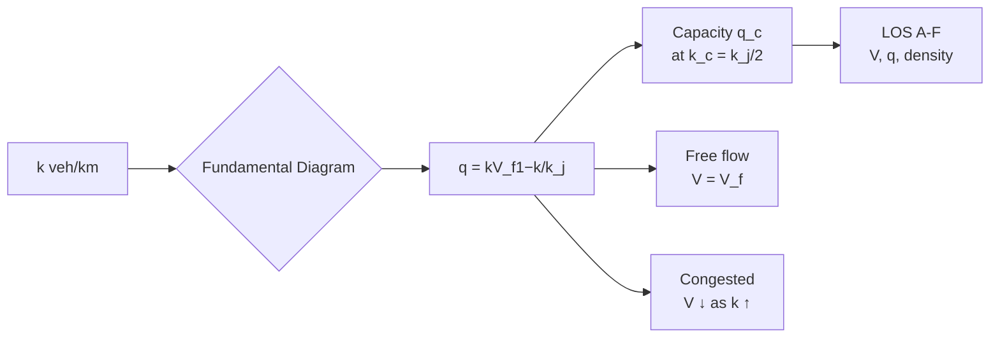
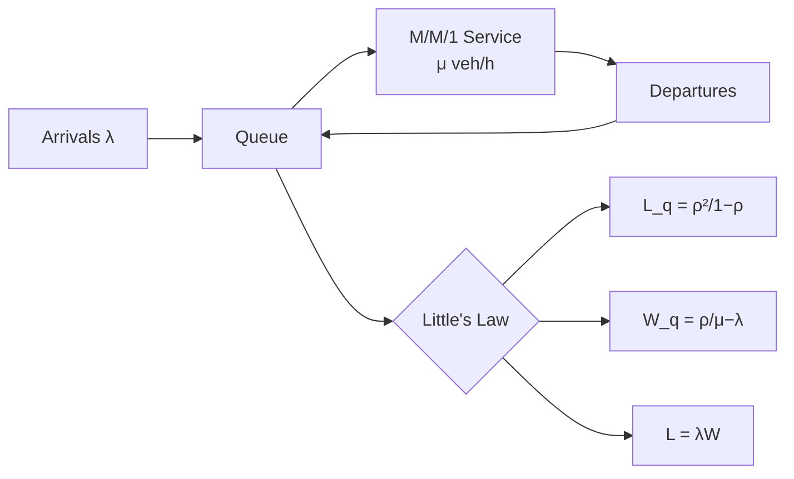

# 1.041[J] / 1.200 Transportation: Foundations and Methods

**MIT CEE Systems Track | 12 Units | Core (Transportation Focus)**
**Prereq:** (1.010A and (1.000 or 1.00)) or permission of instructor
**Instructor:** Prof. Cathy Wu
**自學路徑：Bachelor → MEng / MS in Transportation → Urban Planning / Mobility**

> **Source:** MIT 1.041 Course Website (Spring 2026); MIT Catalog 2024-25
> **Textbook:** Daganzo, *Fundamentals of Transportation and Traffic Operations* (2008)
> **Topics:** Traffic flow theory, queuing theory, machine learning for traffic control, linear/integer programming, Markov decision processes

---

## 問題 1：這個領域所有專家共享的 5 個核心心智模型是什麼？

1. **交通系統是排隊系統**
   Traffic flow is a queueing system. Vehicles accumulate when arrival rate exceeds service rate. The fundamental diagram of traffic flow q = k·V(k) captures the relationship between flow, density, and speed.

2. **資源有限時，最優化是必要的**
   With limited road capacity and growing demand, optimization is not optional — it's the only way to efficiently allocate scarce resources (road space, transit slots, parking).

3. **不確定性是交通系統的固有特徵**
   Travel time, demand, and supply are all stochastic. Robust and stochastic optimization are more appropriate than deterministic optimization for real systems.

4. **反饋控制比開環控制更魯棒**
   Traffic signals, ramp metering, and transit dispatch are feedback control systems. Adaptive control outperforms fixed-time control when demand patterns are unpredictable.

5. **行為和技術共同塑造系統性能**
   User behavior (route choice, departure time choice) interacts with system management (tolls, transit fares) to determine system performance.

---

## 問題 2：根本分歧

### 分歧 1: 供給側 vs 需求側管理
- **供給側派**: Expand capacity (more lanes, new roads). Wardrop's first principle: users seek shortest paths, network equilibrium.
- **需求側派**: Manage demand (congestion pricing, transit investment, telecommuting). Wardrop's second principle: system optimum.

### 分歧 2: 集中式 vs 分佈式控制
- **集中式派**: Centralized traffic management centers can optimize network-wide flows. Real-time data enables adaptive control.
- **分佈式派**: Vehicle-to-vehicle (V2V) and connected vehicle systems enable decentralized, cooperative adaptive cruise control.

---

## 問題 3：10 個深度問題

1. 說明 Greenshields 的基本圖形 q = k·V 中，V = V_f(1 − k/k_j) 的推導。當密度 k → 0（自由流）和 k → k_j（堵塞）時，V 和 q 如何變化？容量 q_c 和臨界密度 k_c 是多少？
2. 在 Lighthill-Whitham-Richards (LWR) 模型 ∂k/∂t + V_f ∂k/∂x = 0 中， shocks（衝擊波）的物理意義是什麼？當兩輛車相遇時（前方車停止）， shock 速度是多少？
3. 排隊理論中的 Little's Law：L = λW。如何用它估算服務設施（如收費站、安檢通道）的排隊長度和等待時間？
4. 在 M/M/1 排隊系統中，平均等待時間 W_q = λ/(μ(μ − λ)。當 λ → μ 時，W_q 如何變化？這在交通系統中有什麼實際意義？
5. 在 Daganzo 的三元模型中，發送波（forward travel wave）和倒向波（backward queue wave）的速度分佈是多少？在 shock wave 分析中，兩個狀態之間的 shock 速度 v_s = (q_B − q_A)/(k_B − k_A) 的物理意義是什麼？
6. 在城市道路網絡中，旅行者如何選擇路徑？ Wardrop 第一原理（使用者均衡 UE）和第二原理（系統最優 SO）之間的差距如何量化？Braess 悖論的意義是什麼？
7. 馬爾可夫決策過程（MDP）框架如何用於交通信號優化？狀態空間（擁堵水平）、動作空間（信號時序）和獎勵函數（延遲最小化）如何定義？
8. 在強化學習應用於交通控制中，演員-評論家（Actor-Critic）算法如何在信號交叉口優化問題中平衡探索和利用？
9. 在線性規劃（LP）應用於交通分配中，目標函數 min Σc_e·f_e 和約束條件 Σf_e(p) = d_r,s（所有 OD 對的流量守恆）如何共同描述網絡均衡問題？
10. 在離散選擇模型（Logit）中，旅行者如何評估路徑選擇？效用函數 U = V + ε 中的隨機項 ε 如何建模？Gumbel 分佈假設如何導出 MNL 模型？

---

# 核心心智模型深化

## 1. 交通流理論

### 1.1 Bilingual 概念對照
| English | 中英對照 | 定義 | 工程應用 |
|---|---|---|---|
| Flow q | 流量 | Vehicles per unit time (veh/h) | Capacity analysis |
| Density k | 密度 | Vehicles per unit length (veh/km) | Congestion level |
| Speed V | 速度 | Distance per unit time (km/h) | Travel time |
| Fundamental diagram | 基本圖形 | q = k·V relationship | Shock waves |

### 1.2 Key Derivation — Greenshields Model

Greenshields (1935) proposed a linear speed-density relationship:
**V = V_f(1 − k/k_j)**

Where:
- V_f = free-flow speed
- k_j = jam density (maximum density when traffic is stopped, ≈ 150-200 veh/km per lane)

From continuity (conservation of vehicles):
∂k/∂t + ∂q/∂x = 0, where q = k·V

**Maximum flow (capacity)**:
q = k·V = k·V_f(1 − k/k_j)
dq/dk = V_f(1 − 2k/k_j) = 0 → k_c = k_j/2
**q_c = (k_j/2)·V_f(1 − 1/2) = (k_jV_f)/4**

**Example**: V_f = 100 km/h, k_j = 150 veh/km per lane
k_c = 75 veh/km, q_c = (150×100)/4 = **3750 veh/h/lane** (realistic for freeways)

### 1.3 Engineering Applications
- **Level of Service (LOS)**: A (V > 85 km/h, q < 700 veh/h/lane) to F (V < 30 km/h, q ≈ q_c)
- **Shock wave analysis**: Queue discharge rate ~1700 veh/h/lane after bottleneck clears

---

## 2. 排隊理論

### 2.1 Key Derivation — M/M/1 Queue

**Kendall notation**: M/M/1 = Poisson arrivals, exponential service, 1 server

**Little's Law**: L = λW
- L = average number in system
- λ = arrival rate (veh/s)
- W = average time in system (including service)

**M/M/1 results**:
- ρ = λ/μ = utilization (must be < 1 for stability)
- L_q = ρ²/(1−ρ) (average queue length)
- W_q = ρ/(μ−λ) (average waiting time)
- W = 1/(μ−λ) (total time in system)

**Example**: Toll booth, μ = 300 veh/h, arrival rate λ = 250 veh/h
ρ = 250/300 = 0.833
W_q = 0.833/(300−250) = 0.833/50 h = **60 seconds** average wait
L_q = 0.833²/(1−0.833) = 0.694/0.167 = **4.17 vehicles** in queue

### 2.2 Engineering Applications
- **Airport security**: M/G/c model for multiple security lanes
- **Transit stations**: M/D/c for deterministic dwell times
- **Parking facilities**: Overflow queuing on street

---

## 3. 網絡均衡

### 3.1 Wardrop Principles

**Wardrop's First Principle** (User Equilibrium, UE):
At equilibrium, no user can reduce their travel time by unilaterally changing routes.
→ Beckmann objective: min Σ∫₀^f c_e(f_e) df_e

**Wardrop's Second Principle** (System Optimal, SO):
At system optimum, the average travel time is minimized.
→ Social welfare objective: min Σq_e·c_e(f_e)

**Gap function**: Gap = (1/n) Σd_i t_i^UE − t*_SO (measures distance from UE to SO)

**Braess Paradox**: Adding a new link can increase (not decrease) system travel time. Example: a symmetric 4-node network where adding a shortcut link creates a new Nash equilibrium with worse total travel time.

### 3.2 Example — Two-route network
Two parallel routes between O and D:
- Route 1: t₁ = 10 + f₁ (linear, α = 1)
- Route 2: t₂ = 10 + f₂
- Total demand: f₁ + f₂ = 5000 veh/h

UE: t₁ = t₂ → 10+f₁ = 10+(5000−f₁) → f₁ = 2500 → t₁ = t₂ = **2510 seconds**
Total system travel time: 5000×2510 = **12.55 million veh·s/h**

SO: min f₁·t₁ + f₂·t₂ = f₁(10+f₁) + (5000−f₁)(10+5000−f₁)
dc/df₁ = 10+2f₁ − (10+5000−2f₁) = 4f₁ − 5000 = 0 → f₁ = 1250 → t₁ = 1260 s, t₂ = 10+3750 = **3760 s**
Gap = (1260+3760)/2 − 1260 = 2510 − 1260 = **1250 s/user**

---

## 4. 馬爾可夫決策過程

### 4.1 MDP for Traffic Signal Control

**State space**: s_t = [queue_length_north, queue_length_south, ...]
**Action space**: a_t ∈ {phase_1, phase_2, phase_3, all-red}
**Reward**: r_t = −(total_delay + queue_length) (negative = cost)
**Transition**: P(s'|s,a) from traffic simulation model

**Value iteration**: V(s) = max_a [r(s,a) + γ Σ P(s'|s,a)V(s')]
**Q-learning**: Q(s,a) ← Q(s,a) + α[r + γ max_a' Q(s',a') − Q(s,a)]

### 4.2 Engineering Applications
- **SCOOT** (Split, Cycle, Offset Optimization Technique): Adaptive signal control using traffic prediction
- **InSync**: Data-driven adaptive signal timing
- **Reinforcement learning**: Proves effective in simulated environments; field deployment still limited

---

## 5. 線性與整數規劃

### 5.1 Network Flow Optimization

**Minimum cost flow problem**:
min Σ c_e·f_e
subject to:
- Σ f_e(p) = d_rs for all OD pairs (flow conservation)
- 0 ≤ f_e ≤ u_e (capacity constraints)

**Transit route design** (integer programming):
min Σ c_i y_i + Σ t_j d_j
subject to:
- Coverage constraints
- Frequency constraints
- Budget constraint

---

# 深度自測問題詳解

## 詳解 1: Greenshields 基本圖形
**Answer:**
q = k·V = k·V_f(1 − k/k_j)

Max flow: dq/dk = V_f(1 − 2k/k_j) = 0 → **k_c = k_j/2** (critical density)
q_c = k_c·V_f(1 − 1/2) = (k_j/2)(V_f/2) = **k_jV_f/4**

当 k → 0: V → V_f, q → 0 (no vehicles)
当 k → k_j: V → 0, q → 0 (all vehicles stopped, traffic jam)

---

## 詳解 4: M/M/1 排隊等待時間
**Answer:**
W_q = ρ/(μ − λ) where ρ = λ/μ

當 λ → μ（利用率 ρ → 1）：W_q → ∞！這是排隊爆炸現象——在交通高峰期，λ 接近 μ 時，排隊長度和等待時間急劇增加。

實踐意義：收費站服務率 μ = 300 veh/h，若 λ = 295 veh/h（ρ = 0.983），W_q = 0.983/(300−295) = 0.983/5 h = **708 秒 ≈ 12 分鐘**！這就是高峰期的實際情況。

---

## 📊 Diagram 1: 交通流基本圖形

## 📊 Diagram 2: 排隊理論框架

---

## 總結

1. **交通流是具有物理極限的資源分配系統**：Greenshields 基本圖形確定了流量-密度-速度的唯一關係，是交通工程的理論基礎
2. **排隊理論連接了微觀交通動力學和宏觀系統性能**：Little's Law L = λW 和 M/M/1 排隊模型是交通設施分析的基礎工具
3. **網絡均衡是路徑選擇行為的理論框架**：Wardrop 原理連接了使用者行為和系統最優化，是交通分配的理論基礎
4. **MDP 和強化學習正在改變交通控制**：從固定時序到自適應控制，RL 演算法在模擬環境中顯示出顯著優勢
5. **供給側和需求側管理必須共同考慮**：僅靠基礎設施擴張不能解決城市交通問題；擁堵定價和公共交通投資是必要的補充手段

**Prerequisite chain**: 1.010A Probability → 1.000 Programming → 1.041 Transportation → 1.022 Network Models
