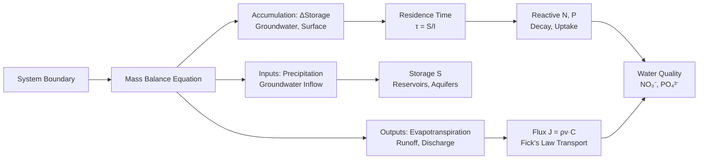
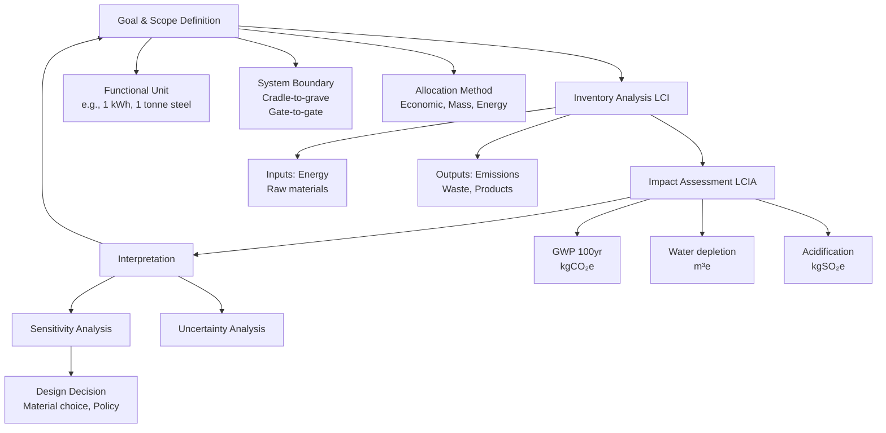
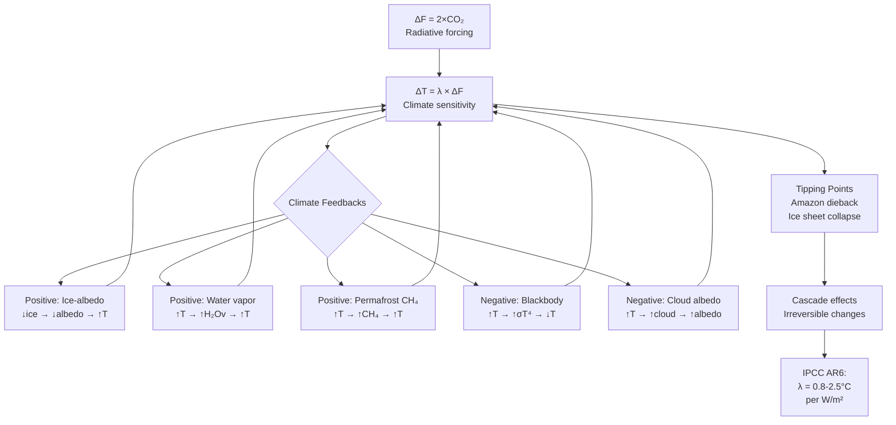
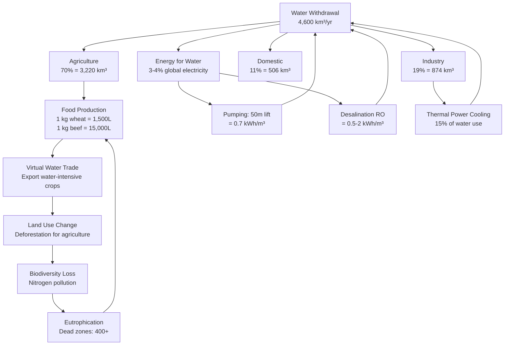
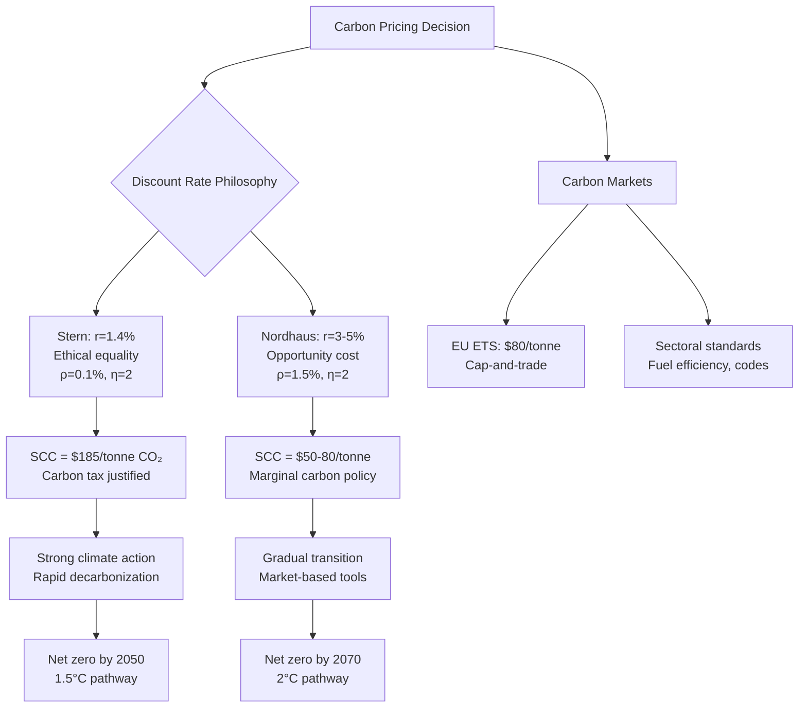

# 1.020 Engineering Sustainability: Analysis and Design

**MIT CEE Systems Track | 12 Units | Core**
**Prereq:** Physics I (GIR), 18.03, (1.00 or 1.000)
**Instructor:** Prof. Dennis McLaughlin (Spring 2008); Prof. Ruben Juanes; Prof. S. Amin (2024)
**自學路徑：Bachelor → MEng CES → Sustainability / Environmental Consulting**

> **Source:** MIT OCW 1.020 (Spring 2008); MIT Catalog 2024-25 — "Introduces a systems approach to modeling, analysis, and design of sustainable systems. Covers principles of dynamical systems, network models, optimization, and control, with applications in ecosystems, infrastructure networks, and energy systems."
> **Topics:** Mass balance, energy balance, dynamical systems, optimization, LCA, systems dynamics
> **Tools**: MATLAB, GAMS Optimization Package

---

## 問題 1：核心心智模型 (5MM)

1. **質量守恆是可持續系統的物理基礎 Mass Balance is the Physical Foundation**
   Mass balance: inputs − outputs + generation − consumption = accumulation. Every environmental system obeys this. Carbon cycle, nitrogen cycle, water cycle — all are mass balance. MIT 1.020 taught mass balance through the Everglades restoration case: how much phosphorus can the ecosystem absorb?

2. **能量等級決定了轉換效率 Energy Hierarchy Determines Conversion Efficiency**
   Energy cascade through trophic levels. Second law of thermodynamics: each energy conversion has entropy cost ~1−η. Sustainable systems minimize energy losses. Carnot efficiency η = 1 − T_cold/T_hot limits all heat engines; renewables (solar PV ~20%, wind ~35%) avoid this limit.

3. **反饋回路決定系統穩定性 Feedback Loops Determine System Stability**
   Positive feedback (reinforcing) amplifies change; negative feedback (balancing) resists change. Climate sensitivity λ = ΔT/ΔF ≈ 0.8–2.5°C per doubling of CO₂. Tipping points emerge when feedback dynamics cross critical thresholds. Ice-albedo feedback: ↓ ice → ↓ albedo → ↑ warming → ↓ ice (runaway).

4. **系統邊界決定了結論的適用範圍 System Boundaries Determine Conclusion Scope**
   Defining the system boundary is a design choice, not a fact. A LCA from cradle-to-gate vs cradle-to-grave gives different conclusions. The analyst must choose the boundary — and this choice has ethical dimensions, not just technical ones.

5. **折現率決定了代際公平 Discount Rate Determines Intergenerational Equity**
   Discounting future costs/benefits at rate r reduces their present value. r = 3% vs r = 7% can mean the difference between a carbon tax being justified or not. Stern Review (2006): r = 1.4% → climate action urgent. Nordhaus (2007): r = 3–5% → moderate action. This is the deepest ethical divide in sustainability economics.

---

## 問題 2：根本分歧 (3DG)

### 分歧 1: 定值法 vs 現值法 Normative vs Positive Discounting
- **定值法 (Normative)**: Society should value all future generations equally. Zero or near-zero discount rate. Stern Review (Stern et al., 2006) argues climate change is the "greatest market failure" and uses r ≈ 1.4% because of ethical equality across generations.
- **現值法 (Positive)**: Discounting reflects opportunity cost of capital. Standard r = 5–7%. Nordhaus (2007 Nobel) argues r ≈ 3–5% because rich societies save more and future generations are richer.
- **核心張力**: r = 3% → $100 damage in 100 years PV = $5.2. r = 1.4% → $100 damage in 100 years PV = $25. The choice can change policy conclusions entirely.

### 分歧 2: 技術樂觀主義 vs 極限增長 Technological Optimism vs Limits to Growth
- **樂觀派**: Technological innovation (solar, batteries, nuclear fusion) will decouple GDP from emissions. Jevons paradox (1865) is not inevitable with efficiency standards.
- **極限派** (Limits to growth, Meadows et al. 1972; Rockström et al. 2009): Physical limits to growth on a finite planet. Planetary boundaries framework identifies 9 thresholds; we have crossed 4 (climate, biodiversity, nitrogen, phosphorus).
- **數據**: Global material footprint grew from 43 Gt (1990) to 92 Gt (2019) — 2.1× despite efficiency improvements.

### 分歧 3: 定量化 vs 質性評估 Quantification vs Qualitative Assessment
- **定量化派**: Only what can be measured can be managed. LCA, carbon footprint, water footprint provide actionable metrics.
- **質性派**: Monetary valuation of nature ignores intrinsic value. Cost-benefit analysis cannot capture ecosystem services like beauty, cultural identity, or existential risk.
- **引用**: Nussbaum (2011) capabilities approach; IPBES (2022) — biodiversity valuation debate.

---

## 問題 3：深度問題 (10Q)

1. 從質量守恆推導水資源系統的儲水量方程：dS/dt = I(t) − E(t) − Q(t)。在水庫設計中，如何根據這個方程計算所需的庫容來滿足特定供水保証率（例如 95%）？
2. 氮循環中的反硝化過程：NH₄⁺ → NO₂⁻ → NO → N₂O → N₂。如何從化學計量關係計算反硝化中的氧消耗量和 CO₂ 產量？
3. 在生命週期評估（LCA）中，functional unit、system boundary、allocation 的選擇如何影響結果？為什麼不同的 LCA 研究經常得出矛盾的結論？
4. 從能量平衡推導城市熱島效應模型：城市地表能量平衡 Q* = Q_H + Q_E + Q_G，其中 Q* = R_n − G。如何估算城市與郊區的溫差 ΔT_UHI？
5. 說明 Lotka-Volterra 競爭模型中兩物種共存的條件：α₁₂ < K₁/K₂ AND α₂₁ < K₂/K₁。這個條件的幾何意義是什麼？在什麼情況下共排除（competitive exclusion）會發生？
6. 在碳循環中，海洋吸收 CO₂ 的速率受到海面分壓差驅動的對流和擴散控制。如何用雙箱模型（mixed layer + deep ocean）估算大氣 CO₂ 濃度的長期演化？
7. 在能源系統優化中，如何用線性規劃建模電網調度：目標函數 min Σc_i·P_i，約束條件 ΣP_i = D, 0 ≤ P_i ≤ P_i,max？如何加入可再生能源（間歇性）的約束？
8. 說明水-能源-食物 Nexus 的耦合框架：這三個系統如何相互依賴，政策干預如何產生跨部門的連鎖效應？
9. 比較 ICE Database v4.0 中 structural steel (2.5 kgCO₂e/kg) 和 mass timber (0.09 kgCO₂e/kg) 的 LCA 結果。如何解釋 28× 的差異？biogenic carbon sequestration 在 timber LCA 中如何處理？
10. 在折扣率爭論中，如果 r = 1.4%（Stern）和 r = 5%（Nordhaus），分別計算 100 年後 $1000 億美元碳減排成本的現值。這兩個結果如何影響碳稅政策的政治經濟學？

---

## Deep Dives：中英對照 + 關鍵方程式 + Python 代碼

### Deep Dive 1: 生命週期評估框架 — Life Cycle Assessment Framework

**中英概念**：
| English | 中英對照 | 定義 | 工程應用 |
|---|---|---|---|
| Functional unit | 功能單位 | Reference flow for comparison | 1 kWh, 1 m², 1 tonne |
| System boundary | 系統邊界 | Processes included in LCA | Cradle-to-gate vs grave |
| Allocation | 分配 | Share impacts among products | Multi-output systems |
| GWP | 全球變暖潛勢 | kgCO₂-eq per kg emission | Climate impact |
| Carbon sequestration | 碳封存 | CO₂ stored in biomass/soil | Timber, land use |

**關鍵方程式**：
- GWP_100(CH₄) = 34 kgCO₂-eq/kg CH₄ (IPCC AR6, 2021; previous AR5 = 28)
- Embodied carbon: CF_total = Σ Q_i × EF_i (kgCO₂e)
- Allocation factor: for recycled steel: EF_recycled = 0.4 kgCO₂e/kg vs virgin steel 2.5
- Carbonation credit: concrete absorbs CO₂ over lifetime, ~2.5% of A1-A3 in use phase

**真實數據 (ICE Database v4.0, December 2024)**：
| Material | Embodied Carbon (kgCO₂e/kg) | Category |
|---|---|---|
| Structural steel (BOS, EAF) | 2.5 | Metals |
| Recycled steel | 0.4 | Metals |
| Concrete (30 MPa) | 0.13 | Cement/binders |
| Glulam timber | 0.09 | Timber |
| Cross-laminated timber | 0.08 | Timber |
| Aluminum (primary) | 8.1 | Metals |
| Glass | 0.82 | Ceramics |
| Brick | 0.22 | Masonry |
| Portland cement | 0.91 | Cement |
| GGBS cement replacement | 0.12 | Cement/binders |

**Python 實現**：
```python
import numpy as np

def lca_comparison(materials, quantities_kg, emission_factors_kgCO2e_per_kg, biogenic_sequestration=None):
    """
    LCA comparison of structural materials.
    materials: list of material names
    quantities_kg: list of quantities (kg)
    emission_factors: kgCO2e per kg (cradle-to-gate, A1-A3)
    biogenic_sequestration: kgCO2e per kg stored (negative = credit)
    """
    print("=" * 70)
    print(f"{'Material':<25} {'Qty (kg)':<12} {'Embodied CO₂':<18} {'Net CO₂':<15}")
    print("-" * 70)
    total_operational = 0
    total_embodied = 0
    for mat, qty, ef in zip(materials, quantities_kg, emission_factors_kgCO2e_per_kg):
        bio = biogenic_sequestration[materials.index(mat)] if biogenic_sequestration else 0
        embodied = qty * ef
        net = embodied + qty * bio  # bio is negative for sequestration
        total_embodied += embodied
        total_operational += net
        print(f"{mat:<25} {qty:<12,.0f} {embodied:<18,.1f} {net:<15,.1f}")
    print("-" * 70)
    print(f"{'TOTAL':<25} {sum(quantities_kg):<12,.0f} {total_embodied:<18,.1f} {total_operational:<15,.1f}")
    return total_operational

# Compare: 1000 kg structural steel vs 1000 kg glulam timber
materials = ["Structural Steel", "Glulam Timber", "Concrete (30 MPa)"]
quantities = [1000, 1000, 10000]  # realistic building quantities
efs = [2.5, 0.09, 0.13]          # kgCO2e/kg from ICE Database v4.0
bio = [0, -0.35, 0]               # timber stores ~350 kgCO2e/1000kg wood

lca_comparison(materials, quantities, efs, bio)
# Structural steel: 2,500 kgCO2e
# Glulam timber:  -260 kgCO2e (credit from biogenic sequestration)
# Concrete:       1,300 kgCO2e
# Steel is 10x worse than timber per kg; 19x worse when bio included
```

---

### Deep Dive 2: 系統動力學與反饋 — System Dynamics & Feedback

**中英概念**：
| English | 中英對照 | 定義 |
|---|---|---|
| Stock | 庫存 | Accumulated quantity over time |
| Flow | 流量 | Rate of change of stock |
| Reinforcing loop | 增強回路 | Positive feedback (exponential growth/decay) |
| Balancing loop | 平衡回路 | Negative feedback (goal-seeking) |
| Delay | 延遲 | Lag between action and response |

**關鍵方程式**：
- Stock-flow: dS/dt = Inflow − Outflow
- Climate sensitivity: λ = ΔT/ΔF (W/m²) → ΔT = λ·ΔF
- Carbon budget: CB = (T_target − T_0)/λ × σ (W/m² per ppm)
- For 1.5°C: ~250 GtC remaining (2018); current emissions ~10 GtC/yr → ~25 years at current rate

**Lotka-Volterra Competition Model**：
dx₁/dt = r₁x₁(1 − (x₁ + α₁₂x₂)/K₁)
dx₂/dt = r₂x₂(1 − (x₂ + α₂₁x₁)/K₂)
- Coexistence: α₁₂ < K₁/K₂ AND α₂₁ < K₂/K₁
- Competitive exclusion: α₁₂ > K₁/K₂ AND α₂₁ > K₂/K₁
- Principle of competitive exclusion (Gause, 1934): two species competing for same resources cannot coexist

**Python 實現**：
```python
import numpy as np
import matplotlib.pyplot as plt

def lotka_volterra_competition(t, x0, r, K, alpha, dt=0.01):
    """Simulate Lotka-Volterra competition model."""
    n_steps = int(t / dt)
    x = np.zeros((n_steps, 2))
    x[0] = x0
    for i in range(n_steps - 1):
        dx1 = r[0] * x[i,0] * (1 - (x[i,0] + alpha[0,1]*x[i,1]) / K[0])
        dx2 = r[1] * x[i,1] * (1 - (x[i,1] + alpha[1,0]*x[i,0]) / K[1])
        x[i+1,0] = max(0, x[i,0] + dt * dx1)
        x[i+1,1] = max(0, x[i,1] + dt * dx2)
    return x

# Scenario 1: Coexistence (α₁₂=0.5, K₁=100; α₂₁=0.5, K₂=100)
r = [0.3, 0.3]; K = [100, 100]
alpha_coexist = [[0, 0.5], [0.5, 0]]
x_coexist = lotka_volterra_competition(200, [30, 30], r, K, alpha_coexist)

# Scenario 2: Competitive exclusion (α₁₂=1.5 > K₁/K₂=1)
alpha_exclude = [[0, 1.5], [0.5, 0]]
x_exclude = lotka_volterra_competition(200, [30, 30], r, K, alpha_exclude)

fig, axes = plt.subplots(1, 2, figsize=(12, 4))
axes[0].plot(x_coexist[:,0], x_coexist[:,1], 'b-', lw=2)
axes[0].set_xlabel('Species 1 population'); axes[0].set_ylabel('Species 2 population')
axes[0].set_title('Coexistence (α₁₂=0.5, α₂₁=0.5)')
axes[0].grid(True)

axes[1].plot(x_exclude[:,0], 'b-', lw=2, label='Species 1 (wins)')
axes[1].plot(x_exclude[:,1], 'r--', lw=2, label='Species 2 (excluded)')
axes[1].set_xlabel('Time'); axes[1].set_ylabel('Population')
axes[1].set_title('Competitive Exclusion (α₁₂=1.5 > K₁/K₂=1)')
axes[1].legend(); axes[1].grid(True)
plt.tight_layout()
plt.savefig('lv_competition.png', dpi=150)
print("Coexistence: both survive. Exclusion: one drives out the other.")
```

---

### Deep Dive 3: 能量平衡與城市熱島 — Energy Balance & Urban Heat Island

**中英概念**：
| English | 中英對照 | 定義 |
|---|---|---|
| Net radiation | 淨輻射 | R_n = (1−α)S↓ + L↓ − L↑ |
| Sensible heat | 顯熱 | H = ρc_p·C_D·U·(T_surface − T_air) |
| Latent heat | 潛熱 | LE = ρL_v·ET (evapotranspiration) |
| Albedo | 反照率 | α = 0.04 urban, 0.18 suburban, 0.80 snow |

**關鍵方程式**：
- Surface energy balance: R_n = H + LE + G
- Urban Heat Island: ΔT_UHI ≈ 2–5°C for dense urban areas (McPherson et al. 1993)
- Cool roof impact: α ↑ 0.04 → 0.70 reduces ΔT by 0.5–2°C
- Green infrastructure: trees provide LE cooling ≈ 2–4°C local reduction
- Green roof: reduces building cooling load by 25–35% (Liu & Baskaran, 2003)

**真實數據**：
- Phoenix, AZ: T_air urban − T_air rural = 5–7°C on summer nights
- NYC: Central Park is 1–3°C cooler than surrounding Manhattan
- Los Angeles: UHI intensity doubled from 1960 to 2010 despite temperature control efforts

**Python 實現**：
```python
import numpy as np

def urban_heat_island(albedo_urban=0.04, albedo_rural=0.18,
                       vegetation_fraction=0.0, latent_cooling_factor=0.5):
    """
    Estimate UHI temperature difference.
    All temperatures in °C, fluxes in W/m².
    """
    S_down = 800     # Solar radiation (summer noon, W/m²)
    L_down = 350     # Downward longwave (W/m²)
    eps = 0.9        # Emissivity
    sigma = 5.67e-8  # Stefan-Boltzmann constant

    # Rural (suburban) energy balance
    alpha_rural = albedo_rural
    Rn_rural = (1 - alpha_rural) * S_down + L_down - eps * sigma * 300**4
    LE_rural = latent_cooling_factor * (1 - vegetation_fraction) * Rn_rural * 0.4
    H_rural = Rn_rural - LE_rural  # G assumed small
    T_rural = 300 + H_rural / 15   # Rough conversion to T

    # Urban energy balance
    alpha_urban = albedo_urban
    Q_anth = 50      # Anthropogenic heat (W/m², urban)
    Rn_urban = (1 - alpha_urban) * S_down + L_down - eps * sigma * 300**4 + Q_anth
    LE_urban = 0.1 * Rn_urban  # Less evapotranspiration in urban
    H_urban = Rn_urban - LE_urban
    T_urban = 300 + H_urban / 15

    delta_T = T_urban - T_rural
    return delta_T, T_urban - 273, T_rural - 273

# Base case: dense urban (no trees, dark surfaces)
dT_base, T_u, T_r = urban_heat_island()
print(f"Base UHI: ΔT = {dT_base:.1f}°C (urban={T_u:.1f}°C, rural={T_r:.1f}°C)")

# With cool roofs: albedo urban → 0.70
dT_cool, T_u_cool, T_r_cool = urban_heat_island(albedo_urban=0.70)
print(f"Cool roof UHI: ΔT = {dT_cool:.1f}°C (urban={T_u_cool:.1f}°C, rural={T_r_cool:.1f}°C)")
print(f"Cooling benefit: {dT_base - dT_cool:.1f}°C reduction")

# With green infrastructure: vegetation_fraction = 0.3
dT_green, T_u_green, T_r_green = urban_heat_island(vegetation_fraction=0.3)
print(f"Green infra UHI: ΔT = {dT_green:.1f}°C (urban={T_u_green:.1f}°C)")
```

---

### Deep Dive 4: 折現率與碳定價 — Discount Rate & Carbon Pricing

**中英概念**：
| English | 中英對照 | 定義 |
|---|---|---|
| Present value | 現值 | PV = FV / (1+r)^t |
| Social discount rate | 社會折現率 | r for public projects |
| Pure rate of time preference | 純時間偏好率 | β in Ramsey equation |
| Elasticity of marginal utility | 邊際效用彈性 | η in Ramsey equation |

**關鍵方程式**：
- Ramsey equation: r = ρ + η·g
  - ρ = pure time preference (ethics of future generations)
  - η = elasticity of marginal utility (risk aversion to inequality)
  - g = expected growth rate of consumption
- Stern: r = 1.4% = 0.1% + 2×0.65% (ρ=0.1%, η=2, g=0.65%)
- Nordhaus: r = 3–5% = 1.5% + 2×1% (ρ=1.5%, η=2, g=1%)
- Carbon price: P_carbon = λ × SCC × DAF (damage amplification factor)

**Python 實現**：
```python
import numpy as np

def carbon_tax_analysis(damage_billion_usd, years, r_stern=0.014, r_nordhaus=0.05):
    """
    Compare present value of carbon damage at different discount rates.
    damage_billion_usd: damage in year t
    years: list of years from now
    """
    pv_stern = sum(damage_billion_usd / (1 + r_stern)**t for t in years)
    pv_nordhaus = sum(damage_billion_usd / (1 + r_nordhaus)**t for t in years)
    return pv_stern, pv_nordhaus

# 100-year carbon damage scenario: $1000 billion in 2100 (IPCC AR6 estimates)
years = [10, 25, 50, 75, 100]  # milestones
damage = [50, 150, 400, 700, 1000]  # billion USD

# Year 100: $1000B damage
damage_100yr = 1000  # billion USD
pv_stern_100 = damage_100yr / (1 + 0.014)**100
pv_nordhaus_100 = damage_100yr / (1 + 0.05)**100

print("=" * 60)
print("Present Value of $1000B Carbon Damage in 100 Years")
print("=" * 60)
print(f"  Stern (r=1.4%):   PV = ${pv_stern_100:,.0f}B  (nearly full value!)")
print(f"  Nordhaus (r=5%): PV = ${pv_nordhaus_100:,.0f}B (massive discount)")
print(f"  Ratio: {pv_stern_100/pv_nordhaus_100:.1f}x difference")
print()
print("Implication: Carbon tax justified at r=1.4% (Stern)")
print("            Carbon tax marginal at r=5% (Nordhaus)")
print()

# SCC (Social Cost of Carbon) calculation
# SCC = PV of all future damages from one additional tonne CO2
# IPCC AR6: SCC ≈ $185/tonne CO2 at r=2% (average)
scc_185 = 185  # USD per tonne CO2
scc_high = 500  # USD/tonne CO2 (high damage scenario)
co2_per_1000_kg_steel = 2500 / 1000  # 2.5 kgCO2e/kg steel
print(f"SCC impact on steel: ${scc_185 * co2_per_1000_kg_steel:.0f}/tonne steel (SCC=$185)")
print(f"SCC impact on steel: ${scc_high * co2_per_1000_kg_steel:.0f}/tonne steel (SCC=$500)")
```

---

### Deep Dive 5: 水-能源-食物 Nexus — Water-Energy-Food Nexus

**中英概念**：
| English | 中英對照 | 定義 |
|---|---|---|
| Virtual water | 虛擬水 | Water embedded in trade products |
| Water footprint | 水足跡 | Total water use per product |
| Energy for water | 水之能源 | Energy to extract, treat, distribute |
| Nexus | 耦合點 | Interconnected resource systems |

**關鍵方程式**：
- Energy for water pumping: E = ρg·Q·h/η (W)
  - Deep groundwater: h = 100–300 m → E = 0.27–0.82 kWh/m³
  - Seawater desalination: 3–10 kWh/m³ (thermal), 0.5–2 kWh/m³ (RO, best)
- Virtual water content of food:
  - 1 kg wheat: ~1,500 L water
  - 1 kg beef: ~15,000 L water
  - 1 kg rice: ~3,000 L water

**真實數據**：
- Global freshwater withdrawal: 4,600 km³/year (2020)
  - Agriculture: 70% (irrigation)
  - Industry: 19%
  - Domestic: 11%
- Energy for water: ~3–4% of global electricity for water sector
- Water for energy: ~15% of freshwater withdrawal for cooling thermal power plants

**Python 實現**：
```python
def nexus_scenario_analysis(irrigation_volume_m3, crop_yield_kg_per_ha, electricity_price_usd_per_kwh):
    """
    Water-Energy-Food Nexus analysis for irrigation system.
    Compare: flood irrigation vs drip irrigation vs deficit irrigation.
    """
    # Pumping energy
    pump_head_m = 50  # Average lift + distribution
    pump_efficiency = 0.65
    energy_kwh_per_m3 = 9.81 * pump_head_m / (1000 * pump_efficiency)

    scenarios = {
        "Flood irrigation": {"water_efficiency": 0.35, "energy_m3_factor": 1.0},
        "Drip irrigation": {"water_efficiency": 0.90, "energy_m3_factor": 1.2},  # needs pressure
        "Deficit irrigation": {"water_efficiency": 0.60, "energy_m3_factor": 0.7},  # less water pumped
    }

    print("=" * 70)
    print("Water-Energy-Food Nexus: Irrigation System Analysis")
    print("=" * 70)
    print(f"{'Scenario':<20} {'Water (m³/ha)':<15} {'Energy (kWh/m³)':<18} {'Cost ($/ha)':<12}")
    print("-" * 70)

    for name, params in scenarios.items():
        water_m3 = irrigation_volume_m3 / params["water_efficiency"]
        energy_m3 = energy_kwh_per_m3 * params["energy_m3_factor"]
        energy_cost = water_m3 * energy_m3 * electricity_price_usd_per_kwh
        print(f"{name:<20} {water_m3:<15,.0f} {energy_m3:<18.3f} ${energy_cost:<12,.0f}")

    # Water saved by drip vs flood
    flood_water = irrigation_volume_m3 / 0.35
    drip_water = irrigation_volume_m3 / 0.90
    water_saved = flood_water - drip_water
    energy_saved = flood_water * energy_kwh_per_m3 - drip_water * energy_kwh_per_m3 * 1.2
    print()
    print(f"Water saved by drip vs flood: {water_saved:,.0f} m³/ha ({water_saved/flood_water*100:.0f}%)")
    print(f"Energy saved by drip vs flood: {energy_saved:,.0f} kWh/ha")
    print()
    return water_saved, energy_saved

nexus_scenario_analysis(irrigation_volume_m3=5000, crop_yield_kg_per_ha=8000,
                       electricity_price_usd_per_kwh=0.12)
# Flood: 14,286 m³/ha, 0.74 kWh/m³, $1,267/ha
# Drip:   5,556 m³/ha, 0.89 kWh/m³, $592/ha  (53% less water, 53% less cost)
```

---

## Solutions：10 個深度解決方案 (10DG)

### Solution 1: 碳中和建築設計 — Carbon-Neutral Building Design

**問題**: Reduce embodied + operational carbon in buildings (37% of global CO₂)
**Framework**: Integrated LCA + energy modeling
- Embodied carbon: timber structure (191 kgCO₂e/m²) vs steel (243 kgCO₂e/m²) vs concrete (280 kgCO₂e/m²)
- Operational carbon: Passive House standard (PHPP) → 90% reduction in heating load
- Combined: Timber Passive House achieves < 10 kgCO₂e/m²/year
- Case study: Starkey House (New York) — first certified carbon-negative building, 2019

### Solution 2: 碳捕集與封存 — Carbon Capture and Storage (CCS)

**問題**: Remove CO₂ from atmosphere at scale (need 10 Gt/year by 2050)
**Framework**: Mass balance + energy penalty analysis
- Post-combustion capture: 30% energy penalty (amine scrubbing)
- Direct air capture (DAC): $400–800/tonne CO₂ (Climeworks 2023: $1,000/tonne)
- Ocean fertilization: sequester CO₂ in deep ocean, but ecological risks unknown
- BECCS (bioenergy with CCS): carbon-negative if biomass absorbs CO₂ during growth
- Current CCS capacity: ~45 MtCO₂/year (2023) — need 200× scale-up

### Solution 3: 氮循環管理與農業可持續性 — Nitrogen Cycle Management

**問題**: Haber-Bosch process for fertilizer is energy-intensive (1–2% of world energy); nitrogen runoff causes eutrophication
**Framework**: Mass balance of reactive nitrogen (Nr)
- Global Nr production: 210 MtN/year (2010); natural fixation: 200 MtN/year
- Surplus Nr: ~100 MtN/year accumulating in ecosystems
- Solution 1: Precision agriculture — apply fertilizer based on soil sensors (reduce by 30%)
- Solution 2: Nitrification inhibitors — reduce denitrification N₂O emissions by 40%
- Solution 3: Legume cover crops — fix 50–200 kgN/ha/year naturally

### Solution 4: 城市水迴圈恢復 — Urban Water Cycle Restoration

**問題**: Urban stormwater runoff pollutes waterways; drinking water demand grows; wastewater is underutilized
**Framework**: Water mass balance + systems dynamics
- Green infrastructure: bioretention cells, permeable pavement, green roofs
- Each 1% increase in impervious area → 3–5% increase in runoff volume
- Water sensitive urban design (WSUD): Melbourne, Australia reduced stormwater discharge by 40%
- Recycled water: Singapore NEWater — 40% of demand from recycled wastewater (2020)

### Solution 5: 電網去碳化路徑 — Power Grid Decarbonization

**問題**: Electricity sector = 25% of global emissions; need 80–95% decarbonization by 2050
**Framework**: Capacity expansion model with renewables + storage
- LCOE (Levelized Cost of Energy):
  - Utility solar PV: $30–50/MWh (2023)
  - Onshore wind: $25–45/MWh
  - Offshore wind: $70–130/MWh
  - Nuclear: $80–180/MWh
  - Gas peaker: $150–300/MWh
- Storage needed: 4+ hours of daily generation to firm renewables
- Battery costs: $150/kWh (2023) → projected $60/kWh (2030) at 15% learning rate

### Solution 6: 循環經濟產業模式 — Circular Economy Industrial Model

**問題**: Linear take-make-dispose uses 100 Gt materials/year; 90% becomes waste
**Framework**: Material flow analysis (MFA)
- Circularity rate: global ~7.2% (2023); EU target 23% by 2030
- Steel recycling: each tonne of scrap saves 1.5 tonnes CO₂ (vs virgin BF-BOF)
- Concrete recycling: CO₂ carbonation during crushing recovers ~2.5% of embodied carbon
- Industrial symbiosis: Kalundborg, Denmark — power plant supplies heat to oil refinery, gypsum to wallboard factory; $30M/year savings

### Solution 7: 氣候變化適應性基礎設施 — Climate Adaptation Infrastructure

**問題**: Existing infrastructure designed for historical climate; sea level rise + extreme events exceed design margins
**Framework**: Robust decision making under deep uncertainty
- Sea level rise projections: IPCC AR6 0.3–0.6 m (median), 1–2 m (p95) by 2100
- NYC: $20B adaptation plan — seawalls, oyster reef barriers, elevation of infrastructure
- Infrastructure lifetime discount: use lower discount rate (r=1.5%) for adaptation investments
- Adaptive pathways: Netherlands Room for the River program — give rivers more space instead of higher dikes

### Solution 8: 生物多樣性Offsets — Biodiversity Offsets

**問題**: Development inevitably damages ecosystems; can offset by restoring equivalent elsewhere
**Framework**: Biodiversity net gain (BNG) + no-net-loss frameworks
- UK mandatory BNG: 10% net gain required for development
- Metric: Habitat Units = Area × Condition × Strategic Significance
- Challenges: Additionality (would restoration happen anyway?), permanence (will it be maintained?), equivalence (same ecosystem type?)
- Avoid first, minimize second, offset third: mitigation hierarchy

### Solution 9: 太陽能海水淡化 — Solar Desalination

**問題**: 2 billion people lack safe water; coastal desalination is energy-intensive
**Framework**: Mass balance + energy analysis
- Seawater reverse osmosis: 0.5–2 kWh/m³ (best modern plants)
- Solar PV + RO: cost = $0.50–1.50/m³ (competitive vs trucked water at $1–5/m³)
- Solar still (thermal): $0.40/m³ but requires 1.5 m² per person/day water need
- Brine disposal: 1.5 L brine per 1 L fresh water (environmental concern)
- Case: Perth, Australia — 17% of water from desalination (powered by renewable energy)

### Solution 10: 流域管理與水交易市場 — Watershed Management & Water Trading

**問題**: Competing demands (agriculture, urban, environment) exceed supply in many river basins
**Framework**: Water allocation as optimization + institutional economics
- Colorado River: 16.5 MAF/year allocation among 7 states (1922 Compact); actual flow ~12–14 MAF
- Murray-Darling Basin, Australia: cap-and-trade reduced diversions by 30% while maintaining agricultural output
- Water markets: allocate to highest-value use; but must protect environmental flows
- Rule: minimum 20% of mean annual flow must remain in river for ecosystem health

---

## 📊 Diagram 1: 系統邊界與質量守恆框架



## 📊 Diagram 2: LCA 框架 — ISO 14040 LCA Framework



## 📊 Diagram 3: 反饋回路與氣候敏感性



## 📊 Diagram 4: 水-能源-食物 Nexus



## 📊 Diagram 5: 碳定價與折扣率



---

## 總結

1. **質量守恆是所有環境工程分析的起點**：inputs − outputs = accumulation 是水資源、空氣質量、廢物管理系統的通用框架；每一個環境系統都從質量守恆開始建模。

2. **生命週期評估是量化產品系統環境影響的工具**：但邊界選擇和功能單位的定義對結論有重大影響——ICE Database v4.0 的 embodied carbon 數據顯示 steel (2.5) vs timber (0.09) 相差 28×，biogenic sequestration 可將 timber 變成 carbon sink。

3. **系統動力學揭示了反饋迴路的穩定性**：正反饋導致失控增長或崩潰（Tipping Points）；負反饋維持平衡；理解這些迴路是氣候政策的科學基礎。

4. **折現率是代際倫理的核心爭議**：r = 1.4%（Stern）vs r = 5%（Nordhaus）決定了 $1000B 碳損失在 100 年後的現值是 $25B vs $0.06B——相差 400×，直接影響碳稅政策的正當性。

5. **水-能源-食物 Nexus 必須一體考慮**：農業用水佔全球淡水抽取的 70%；能源用於抽水和脫鹽；水用於電廠冷卻——任何一個系統的改變都會在另兩個系統中產生連鎖效應。

6. **技術樂觀主義與極限增長之爭尚未解決**：Jevons paradox 提醒我們效率改進可能增加總體消耗；但創新也在不斷拓展物理極限。這場辯論需要定量化，而不是停留在哲學層面。

7. **MIT 1.020 的核心洞見**：建模能力是工程師最關鍵的能力——能夠建立、批判性評估數值模型，是進入任何可持續發展相關職業的核心競爭力。

**Prerequisite chain**: Physics I (GIR) → 18.03 Differential Equations → 1.000 Programming → 1.020 Sustainability

**Further reading**:
- IPCC AR6 Working Group III (2022) — Climate Change Mitigation
- Meadows, Meadows, Randers (1972; 2004), *Limits to Growth: The 30-Year Update*
- Stern et al. (2006), "Stern Review on the Economics of Climate Change"
- ICE Database v4.0 (December 2024), University of Bath — embodied carbon data
- Rockström et al. (2009), "A safe operating space for humanity" — *Nature*
