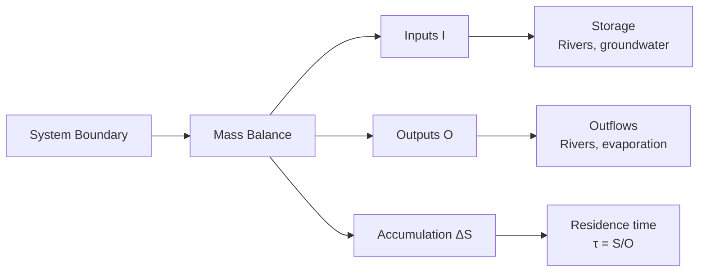
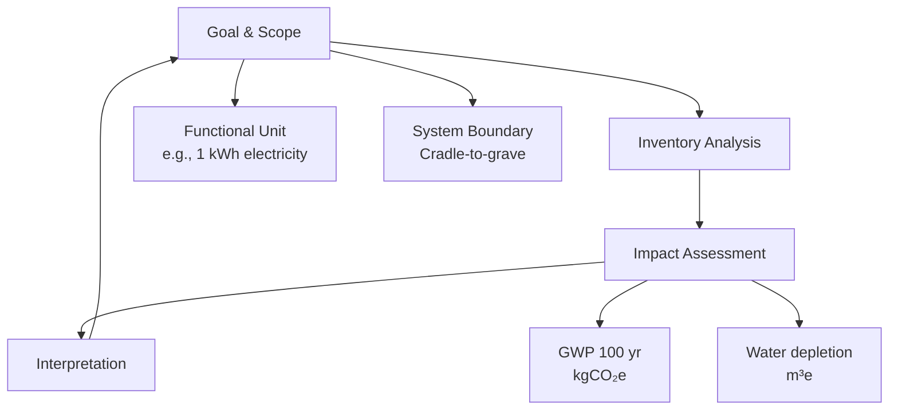

# 1.020 Engineering Sustainability: Analysis and Design

**MIT CEE Systems Track | 12 Units | Core**
**Prereq:** Physics I (GIR), 18.03, (1.00 or 1.000)
**Instructor:** Prof. Dennis McLaughlin; Prof. Ruben Juanes
**自學路徑：Bachelor → MEng CES → Sustainability / Environmental Consulting**

> **Source:** MIT OCW 1.020 (Spring 2008); MIT Catalog 2024-25 — "Introduces a systems approach to modeling, analysis, and design of sustainable systems. Covers principles of dynamical systems, network models, optimization, and control, with applications in ecosystems, infrastructure networks, and energy systems."
> **Topics:** Mass balance, energy balance, dynamical systems, optimization, LCA, systems dynamics

---

## 問題 1：核心心智模型

1. **質量守恆是可持續系統的物理基礎**
   Mass balance: inputs − outputs + generation − consumption = accumulation. Every environmental system obeys this. Carbon cycle, nitrogen cycle, water cycle — all are mass balance.

2. **能量等級決定了轉換效率**
   Energy cascade through trophic levels. Second law of thermodynamics: each energy conversion has entropy cost. Sustainable systems minimize energy losses.

3. **反饋回路決定系統穩定性**
   Positive feedback (reinforcing) amplifies change; negative feedback (balancing) resists change. Climate sensitivity is a feedback system. Tipping points emerge from feedback dynamics.

4. **系統邊界決定了結論的適用範圍**
   Defining the system boundary is a design choice, not a fact. A LCA from cradle-to-gate vs cradle-to-grave gives different conclusions. The analyst must choose the boundary.

5. **折現率決定了代際公平**
   Discounting future costs/benefits at rate r reduces their present value. r = 3% vs r = 7% can mean the difference between a carbon tax being justified or not.

---

## 問題 2：根本分歧

### 分歧 1: 定值法 vs 現值法
- **定值法** (Normative): Society should value all future generations equally. Zero or near-zero discount rate. Climate change mitigation has positive NPV even at low discount rates.
- **現值法** (Positive): Discounting reflects opportunity cost of capital. Standard r = 5-7%. Climate policy cost-benefit analysis uses r = 3-5%.

### 分歧 2: 技術樂觀主義 vs 極限增長
- **樂觀派**: Technological innovation (solar, batteries, nuclear) will decouple GDP from emissions. Efficiency improvements can continue indefinitely.
- **極限派** (Limits to growth, 1972): Physical limits to growth on a finite planet. Rebound effects (Jevons paradox) reduce efficiency gains.

---

## 問題 3：深度問題

1. 從質量守恆推導水資源系統的儲水量方程：dS/dt = I(t) − E(t) − Q(t)。在水庫設計中，如何根據這個方程計算所需的庫容來滿足特定供水保証率（例如 95%）？
2. 氮循環中的反硝化過程：NH₄⁺ → NO₂⁻ → NO → N₂O → N₂。如何從化學計量關係計算反硝化中的氧消耗量和 CO₂ 產量？
3. 在生命週期評估（LCA）中，functional unit、system boundary、allocation 的選擇如何影響結果？為什麼不同的 LCA 研究經常得出矛盾的結論？
4. 從能量平衡推導城市熱島效應的模型：城市地表能量平衡 Q* = Q_H + Q_E + Q_G，其中 Q* = R_n − G。如何估算城市與郊區的溫差 ΔT_UHI？
5. 說明 Lotka-Volterra 競爭模型中，兩物種共存的條件：r₁/K₁ > r₂/K₂ 且 r₂/K₂ > r₁/K₁ 似乎矛盾——解釋這個悖論的實際意義。
6. 在碳循環中，海洋吸收 CO₂ 的速率受到海面分壓差驅動的對流和擴散控制。如何用雙箱模型（mixed layer + deep ocean）估算大氣 CO₂ 濃度的長期演化？
7. 在能源系統優化中，如何用線性規劃建模電網調度：目標函數 min Σc_i·P_i，約束條件 ΣP_i = D, 0 ≤ P_i ≤ P_i,max？如何加入可再生能源（間歇性）的約束？
8. 說明水-能源-食物 Nexus 的耦合框架：這三個系統如何相互依賴，政策干預如何產生跨部門的連鎖效應？

---

# 核心心智模型深化

## 1. 質量守恆與環境系統

### 1.1 Bilingual 概念對照
| English | 中英對照 | 定義 | 工程應用 |
|---|---|---|---|
| Mass balance | 質量守恆 | Input − Output + Generation − Consumption = Accumulation | Environmental engineering |
| Residence time | 停留時間 | τ = V/Q = M/I | Water age, carbon storage |
| Turnover | 周轉率 | 1/τ | System flushing |
| Flux | 通量 | J = −D·∂C/∂x (Fick's law) | Mass transport |

### 1.2 Key Derivation — Water Reservoir Mass Balance

dS/dt = I(t) − E(t) − Q(t)

For design capacity:
- **Inflow** I(t): From watershed hydrology (rainfall-runoff model)
- **Evaporation** E(t): Penman-Monteith: E = (Δ(R_n−G) + ρc_p(e_s−e)/r_a) / (Δ + γ(1+r_s/r_a))
- **Outflow** Q(t): Demand + environmental flow (minimum instream flow)

**Reliability**: P(Q ≥ D for fraction p of time) ≥ reliability target (e.g., 95%)

**Example**: Reservoir with S_max = 10⁸ m³, I_avg = 5 m³/s = 1.58×10⁸ m³/year
Annual net: +0.58×10⁸ m³ → S increases until spillway capacity reached

### 1.3 Engineering Applications
- **River basin management**: Mass balance tracks salt loads, nutrient loads (nitrogen, phosphorus)
- **Groundwater**: Recharge = precipitation − evapotranspiration − runoff; safe yield = recharge
- **Carbon accounting**: National emissions = Σ(sector emissions) − Σ(land use sinks)

---

## 2. 能量平衡與氣候

### 2.1 Key Derivation — Surface Energy Balance

R_n = H + LE + G

Where:
- R_n = net radiation = (1−α)S↓ + L↓ − L↑
- H = sensible heat flux
- LE = latent heat flux (evapotranspiration)
- G = ground heat flux

**Urban Heat Island** (McPherson et al.):
ΔT_UHI = f(urban fraction, building canyon geometry, anthropogenic heat, green infrastructure)
Approximate: ΔT ≈ 2−5°C for dense urban areas vs rural

### 2.2 Engineering Applications
- **Building energy**: HVAC sizing based on heat load = R_n + internal gains − ventilation losses
- **Urban planning**: Cool roofs (high albedo) reduce urban heat island by 0.5-2°C
- **Green infrastructure**: Trees provide evapotranspiration cooling ≈ 2-4°C local temperature reduction

---

## 3. 生命週期評估

### 3.1 LCA Framework (ISO 14040)
1. **Goal and scope definition**: Functional unit, system boundary, allocation
2. **Inventory analysis**: Energy and material inputs, emissions
3. **Impact assessment**: CML (climate change GWP, ozone depletion, acidification)
4. **Interpretation**: Sensitivity analysis, uncertainty

### 3.2 Key Metrics
**Global Warming Potential (GWP)**:
GWP_100 = ∫₀^{100} α_CH₄ · x(t) dt ≈ 34 CO₂-eq (CH₄ has 34× the 100-year warming impact of CO₂)

**Embodied carbon**: kgCO₂e per kg material
| Material | Embodied Carbon (kgCO₂e/kg) |
|---|---|
| Structural steel | 2.5 |
| Concrete (30 MPa) | 0.13 |
| Glulam timber | 0.09 |
| Aluminum | 8.1 |
| Recycled steel | 0.4 |

### 3.3 Engineering Applications
- **Structural optimization**: Timber vs steel vs concrete frame → LCA comparison
- **Infrastructure**: Life cycle carbon assessment for bridges, roads
- **Policy**: Carbon pricing, embodied carbon regulations

---

## 4. 系統動力學

### 4.1 Lotka-Volterra Models
**Competition model** (two species, resource-limited):
dx₁/dt = r₁x₁(1 − (x₁ + α₁₂x₂)/K₁)
dx₂/dt = r₂x₂(1 − (x₂ + α₂₁x₁)/K₂)

**Coexistence condition** (in Lotka-Volterra competition):
α₁₂ < K₁/K₂ AND α₂₁ < K₂/K₁

**Predator-prey** (classic LV):
dx/dt = αx − βxy
dy/dt = δβxy − γy

### 4.2 Climate Feedback Loops
**Positive feedbacks** (amplify warming):
- Ice-albedo: ↓ ice → ↓ albedo → ↑ absorbed → ↑ warming
- Permafrost methane: ↑ warming → ↑ thaw → ↑ CH₄ → ↑ warming

**Negative feedbacks** (resist warming):
- Blackbody radiation: ↑ T → ↑ σT⁴ → ↑ longwave emission
- Cloud albedo: ↑ warming → ↑ cloud cover → ↑ albedo → ↓ warming

**Climate sensitivity** λ = ΔT / ΔF ≈ 0.8-2.5°C per doubling of CO₂

---

## 📊 Diagram 1: 系統邊界與質量守恆

## 📊 Diagram 2: LCA 框架

---

## 總結

1. **質量守恆是所有環境工程分析的起點**：inputs − outputs = accumulation 是水資源、空氣質量、廢物管理系統的通用框架
2. **生命週期評估是量化產品系統環境影響的工具**：但邊界選擇和功能單位的定義對結論有重大影響——分析者必須對這些選擇負責
3. **系統動力學揭示了反饋迴路的穩定性**：正反饋導致失控增長或崩潰；負反饋維持平衡
4. **碳核算和能源系統建模是可持續工程的計算核心**：優化理論、動態規劃、隨機規劃——這些數學工具是現代可持續系統設計的基礎
5. **代際公平通過折現率進入經濟分析**：r = 3% vs r = 7% 的選擇決定了氣候政策投資的經濟合理性

**Prerequisite chain**: Physics I (GIR) → 18.03 Differential Equations → 1.000 Programming → 1.020 Sustainability
