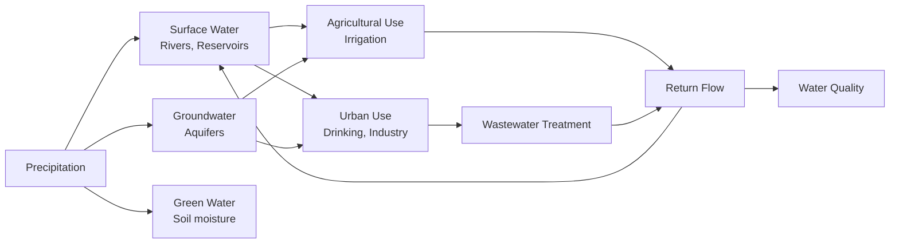

# 1.075 Water Resource Systems

**MIT CEE Systems Track | 12 Units | Core (Water Resources)**
**Prereq:** 1.070B[J] or permission of instructor
**Instructor:** Prof. Dennis McLaughlin
**自學路徑：Bachelor → MEng → Water Resources / Environmental Engineering**

> **Source:** MIT OCW 1.731 (Fall 2006); MIT Catalog 2024-25
> **Topics:** Optimization and simulation methods for water resources; linear, quadratic, nonlinear programming; real-time control; river basin planning; reservoir operations

---

## 問題 1：核心心智模型

1. **水資源系統是多目標、多時間尺度的耦合系統**
   Urban water supply, agricultural irrigation, flood control, and ecosystems services must be simultaneously optimized. Operations at hourly (hydroelectric), seasonal (reservoir), and decadal (climate adaptation) scales interact.

2. **彈性（Resilience）比效率更重要**
   Optimal systems can fail catastrophically under extreme events. Robust optimization explicitly handles uncertainty. Reliable supply requires redundancy.

3. **水-能源-食物 Nexus 是不可分割的**
   Agricultural irrigation consumes 70% of freshwater withdrawals; 8% of global energy is used for pumping. Water scarcity is an energy problem.

4. **不確定性是水資源系統的固有特徵**
   Climate variability (ENSO, NAO), hydrological uncertainty, and demand growth all contribute to uncertainty. Adaptive management is more appropriate than static optimization.

5. **地下水是戰略儲備**
   Groundwater provides 40% of global freshwater supply. Over-extraction creates land subsidence and aquifer depletion. Conjunctive use management links surface and groundwater.

---

## 問題 2：根本分歧

### 分歧 1: 市場定價 vs 政府管理
- **市場派**: Water pricing should reflect scarcity value (marginal cost). Volumetric pricing incentivizes conservation. Tradable water rights enable efficient allocation.
- **政府派**: Water is a human right. Market allocation excludes poor users. Public management ensures equity and access.

### 分歧 2: 供給擴張 vs 需求管理
- **供給派**: Build more dams, desalination plants, inter-basin transfers. Growing populations need more water.
- **需求派**: Water conservation, efficiency, and reuse can meet demand at lower cost. Demand management (pricing, rebates, restrictions) is more cost-effective.

---

## 問題 3：深度問題

1. 說明水庫調度的線性規劃模型：目標函數 max Σc_i·S_i，約束條件水庫水量平衡方程 S_{i+1} = S_i + I_i − R_i − E_i，以及蒸發、供水和防洪約束。
2. 在動態規劃水庫調度問題中，狀態變量（水位 S）和決策變量（洩洪 R）如何定義？Bellman 最優性原理在水庫問題中的具體形式是什麼？
3. 說明 Murray 灌溉渠系優化模型中如何用非線性規劃（NLP）同時求解水流和水質約束？渠系效率 η = Q_out/Q_in 的物理意義如何影響模型？
4. 在海水淡化可行性分析中，資本支出 CAPEX（$/m³/day）和運營支出 OPEX（$/m³）的典型範圍是什麼？太陽能海水淡化（SWDES）如何在偏遠地區降低供水成本？
5. 在地下水-地表水聯合管理模型中，Modflow 如何求解三維地下水水流方程：∂/∂x(K_xx ∂h/∂x) + ∂/∂y(K_yy ∂h/∂y) + ∂/∂z(K_zz ∂h/∂z) = S ∂h/∂t？
6. 說明 SWAT（Soil and Water Assessment Tool）和 HEC-HMS 水文模型如何模擬流域徑流？SCS 曲線數（CN）方法的物理基礎是什麼？
7. 在洪峰頻率分析中，Gumbel 極值分佈 F(x) = exp(−exp(−(x−u)/α)) 如何用於估計 100 年洪水 Q_100？矩估計法（method of moments）如何求解參數？
8. 在實時洪水預報中，卡爾曼濾波（Kalman Filter）如何結合水文模型輸出與觀測水位來提高預報精度？狀態估計和參數估計之間的區別是什麼？
9. 說明農業水資源優化中的種植結構調整：如何在多目標規劃（作物收益 vs 水資源消耗 vs 環境影響）中平衡各方利益？
10. 在水交易系統中（如南澳水交易市場），如何設計拍賣機制來發現水資源的稀缺價格？外部性（第三 方效應）如何影響市場效率？

---

# 核心心智模型深化

## 1. 水庫調度優化

### 1.1 Bilingual 概念對照
| English | 中英對照 | 定義 | 工程應用 |
|---|---|---|---|
| Reservoir routing | 水庫洪水演算 | S-curve routing method | Flood control |
| Safe yield | 安全產量 | Maximum reliable supply | Water supply |
| Rule curve | 運行曲線 | S_target(t) for seasonal operation | Reservoir operation |
| Multi-objective | 多目標 | Min cost, max reliability, min env. impact | Conflict resolution |

### 1.2 Key Derivation — Reservoir Operation LP

**Single-reservoir deterministic LP**:
max Σ c_t·R_t
subject to:
- S_{t+1} = S_t + I_t − R_t − E_t (water balance)
- S_min ≤ S_t ≤ S_max (storage limits)
- R_min ≤ R_t ≤ R_max (release limits)
- Σ R_t ≥ D_t (demand satisfaction)

**Solution**: Simplex or interior-point method. Optimal rule curve: S*_t = f(demand, capacity, inflow forecast).

### 1.3 Example
Reservoir: S_max = 500×10⁶ m³, S_min = 50×10⁶ m³
Inflow: I = 30 m³/s (monthly), evaporation: E = 2% of S per month
Let R_max = 50 m³/s (spillway capacity)
Month 1: S₁ = 200 + 30×2.59×10⁶/10⁶ − 0 = 200 + 77.7 − 0 = 277.7 ×10⁶ m³

---

## 2. 水資源系統建模

### 2.1 Hydrological Models

**SCS Curve Number Method**:
Q = (P − 0.2S)² / (P + 0.8S)
Where S = (1000 − 10CN)/(CN) inches (in metric: S_mm = 254(100/CN − 1))

**Unit hydrograph**:
Q_p = 2.08A/T_p (for metric: peak discharge, A in km², T_p in hours)

### 2.2 Groundwater Modeling

**Modflow** solves:
∂/∂x(K_xx ∂h/∂x) + ∂/∂y(K_yy ∂h/∂y) + ∂/∂z(K_zz ∂h/∂z) = S ∂h/∂t + W

Where:
- K_xx, K_yy, K_zz = hydraulic conductivity
- S = specific storage
- W = source/sink terms

### 2.3 Flood Frequency Analysis

**Gumbel extreme value distribution**:
F(x) = exp(−exp(−(x − u)/α))

Parameters estimated by method of moments:
α = σ√6/π, u = μ − 0.5772α

100-year flood: x_100 = u − α·ln(−ln(1 − 1/100))
= u − α·ln(ln(100)) = u − α×4.6

---

## 3. 水交易與制度

### 3.1 Water Markets
**Murray-Darling Basin** (Australia):
- Cap-and-trade: Total water diversions capped
- Trade-enabled: Water rights freely tradable
- Result: 30% reduction in water use while maintaining agricultural output

**Western US Water Rights** (prior appropriation):
- First-in-time, first-in-right
- Riparian vs appropriative rights
- Groundwater management challenges

### 3.2 Economic Instruments
| Instrument | Mechanism | Efficiency | Equity |
|---|---|---|---|
| Volumetric pricing | Marginal cost | High | Low |
| Two-part tariff | Fixed + variable | Moderate | Moderate |
| Water trading | Price discovery | High | Moderate |
| Non-use value | Environmental flows | Moderate | Low |

---

## 📊 Diagram 1: 水資源系統框架

---

## 總結

1. **水資源系統是多目標耦合的**：灌溉、供水、防洪、生態環境——這些目標之間存在根本衝突，需要多目標優化框架
2. **不確定性和彈性是系統設計的核心**：確定性優化給出最優解，但可能在極端事件下失敗；魯棒優化給出在所有場景下都能運作的解
3. **地下水是戰略儲備**：過度開採地下水的代價是地面沉降和含水層枯竭；聯合管理是必然選擇
4. **水-能源-Nexus 必須一體考慮**：農業用水佔全球淡水抽取的 70%，水資源管理就是能源管理
5. **水和制度設計是技術問題的補充**：市場機制、定價、交易——這些制度工具是技術解決方案的必要補充

**Prerequisite chain**: 1.061A Transport Processes → 1.070A Hydrology → 1.075 Water Resource Systems
