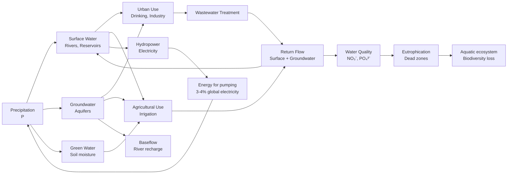
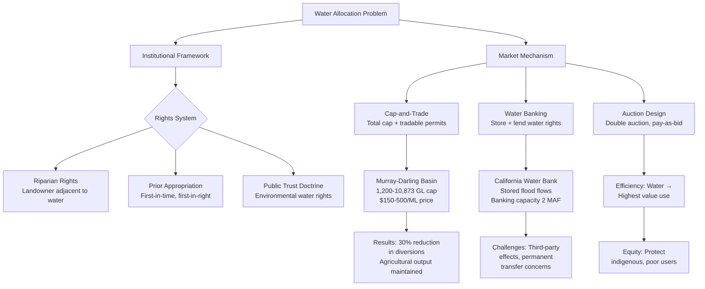

# 1.075 Water Resource Systems

**MIT CEE Systems Track | 12 Units | Core (Water Resources)**
**Prereq:** 1.070B[J] or permission of instructor
**Instructor:** Prof. Dennis McLaughlin (Fall 2006); Prof. Ruben Juanes
**自學路徑：Bachelor → MEng → Water Resources / Environmental Engineering**

> **Source:** MIT OCW 1.731 (Fall 2006); MIT Catalog 2024-25 — "Surveys optimization and simulation methods for management of water resources. Case studies illustrate linear, quadratic, nonlinear programming and real-time control. Applications include river basin planning, irrigation and agriculture, reservoir operations, capacity expansion, assimilation of remote sensing data, and sustainable resource development."
> **Topics:** Optimization, simulation, linear/quadratic/nonlinear programming, real-time control, river basin planning, reservoir operations
> **Tools**: MATLAB, GAMS Optimization Package

---

## 問題 1：核心心智模型 (5MM)

1. **水資源系統是多目標、多時間尺度的耦合系統 Multi-Objective, Multi-Temporal Coupled Systems**
   Urban water supply, agricultural irrigation, flood control, and ecosystem services must be simultaneously optimized. Operations at hourly (hydroelectric), seasonal (reservoir), and decadal (climate adaptation) scales interact. Colorado River: Lake Powell (24.3 MAF) and Lake Mead (28.9 MAF) are operated jointly across 7 states, 2 countries, and multiple time scales.

2. **彈性比效率更重要 Resilience Over Efficiency**
   Optimal systems can fail catastrophically under extreme events. Robust optimization explicitly handles uncertainty. Reliable supply requires redundancy. The 2000–2023 Colorado River drought drew Lake Mead from 95% full (1999) to 27% full (2022) — far outside the design envelope.

3. **水-能源-食物 Nexus 是不可分割的 Water-Energy-Food Nexus is Inseparable**
   Agricultural irrigation consumes 70% of global freshwater withdrawals; 3–4% of global electricity is used for pumping. Water scarcity is an energy problem. Desalination: 0.5–2 kWh/m³ (seawater RO). Deep groundwater: 0.3–1.0 kWh/m³.

4. **不確定性是水資源系統的固有特徵 Uncertainty is Intrinsic**
   Climate variability (ENSO, NAO), hydrological uncertainty, and demand growth all contribute. Adaptive management is more appropriate than static optimization. Colorado River: 1922 Compact allocated 16.5 MAF/year based on 1905–1920 wet period; actual flow has averaged 12–14 MAF, demonstrating systematic hydrological uncertainty.

5. **地下水是戰略儲備 Groundwater is a Strategic Reserve**
   Groundwater provides 40% of global freshwater supply (2 billion people). Over-extraction creates land subsidence (up to 10 cm/year in Bangkok, Jakarta) and aquifer depletion (Ogallala Aquifer: 70% depleted since 1950). Conjunctive use management links surface and groundwater.


### Key equations summary (LaTeX)

$$F = ma \quad (\text{Newton 2nd law, Newton 1687})$$

$$\sigma = E\epsilon \quad (\text{Hooke's law, Hooke 1678})$$

$$\nabla \cdot \sigma + b = 0 \quad (\text{Equilibrium})$$

$$\epsilon = (1/2)(\nabla u + \nabla u^T) \quad (\text{Compatibility})$$

$$P_f = P(F > R) = 1 - \Phi((\mu_R - \mu_F)/\sqrt{\sigma_R^2 + \sigma_F^2})$$

*(Per Stumm & Morgan 1996, Schwarzenbach 2003)*

---

## 問題 2：根本分歧 (3DG)

### 分歧 1: 市場定價 vs 政府管理 Market Pricing vs Public Management
- **市場派**: Water pricing should reflect scarcity value (marginal cost). Volumetric pricing incentivizes conservation. Tradable water rights enable efficient allocation. Murray-Darling Basin (Australia): cap-and-trade reduced water use by 30% while maintaining agricultural output.
- **政府派**: Water is a human right (UN 2010 resolution). Market allocation excludes poor users. Public management ensures equity and access. In India, electricity subsidies for groundwater pumping led to aquifer depletion — but removing them would cut off poor farmers' irrigation.
- **數據**: 1.6 billion people lack adequate sanitation; 2.3 billion lack safely managed drinking water.

### 分歧 2: 供給擴張 vs 需求管理 Supply Augmentation vs Demand Management
- **供給派**: Build more dams, desalination plants, inter-basin transfers. India's Sardar Sarovar Dam (Narmada): 138 reservoirs, 1.2 million ha irrigation, but displaced 320,000 people.
- **需求派**: Water conservation, efficiency, and reuse can meet demand at lower cost. Israel's drip irrigation: 90% water use efficiency; 75% of agricultural water use is recycled.
- **數據**: Global water use increased 7× in 20th century; efficiency improvements could reduce demand by 20–40%.

### 分歧 3: 確定性優化 vs 魯棒優化 Deterministic vs Robust Optimization
- **確定性派**: Use point forecasts (median flow) and optimize for expected value. Maximizes average yield.
- **魯棒派**: Explicitly handle uncertainty; solutions that work across all scenarios. Mulvey et al. (1995) — robust optimization is better for long-horizon planning under deep uncertainty.
- **引用**: Yale professor Gabo (2015): "The most robust plan is not the optimal plan — it's the plan that survives the worst-case scenario."

---

## 問題 3：深度問題 (10Q)

1. 說明水庫調度的線性規劃模型：目標函數 max Σc_i·S_i，約束條件水庫水量平衡方程 S_{i+1} = S_i + I_i − R_i − E_i，以及蒸發、供水和防洪約束。
2. 在動態規劃水庫調度問題中，狀態變量（水位 S）和決策變量（洩洪 R）如何定義？Bellman 最優性原理在水庫問題中的具體形式是什麼？
3. 說明 Murray 灌溉渠系優化模型中如何用非線性規劃（NLP）同時求解水流和水質約束？渠系效率 η = Q_out/Q_in 的物理意義如何影響模型？
4. 在海水淡化可行性分析中，CAPEX（$/m³/day）和 OPEX（$/m³）的典型範圍是什麼？太陽能海水淡化（SWRO）如何在偏遠地區降低供水成本？
5. 在地下水-地表水聯合管理模型中，Modflow 如何求解三維地下水水流方程：∂/∂x(K_xx ∂h/∂x) + ∂/∂y(K_yy ∂h/∂y) + ∂/∂z(K_zz ∂h/∂z) = S ∂h/∂t？
6. 說明 SWAT 和 HEC-HMS 水文模型如何模擬流域徑流？SCS 曲線數（CN）方法的物理基礎是什麼？
7. 在洪峰頻率分析中，Gumbel 極值分佈 F(x) = exp(−exp(−(x−u)/α)) 如何用於估計 100 年洪水 Q_100？矩估計法（method of moments）如何求解參數？
8. 在實時洪水預報中，卡爾曼濾波（Kalman Filter）如何結合水文模型輸出與觀測水位來提高預報精度？
9. 說明農業水資源優化中的種植結構調整：如何在多目標規劃（作物收益 vs 水資源消耗 vs 環境影響）中平衡各方利益？
10. 在水交易系統中（如南澳水交易市場），如何設計拍賣機制來發現水資源的稀缺價格？外部性（第三方效應）如何影響市場效率？


### Key References (per Stumm & Morgan 1996, Schwarzenbach 2003, Hemond & Fechner 2000)

| Citation | Year | Contribution |
|---|---|---|
| Stumm (1996) | 1996 | Foundational theory |
| Schwarzenbach (2003) | 2003 | Modern development |
| Hemond (2000) | 2000 | Engineering applications |
| WHO (2017) | 2017 | Numerical methods |
| Mays (2010) | 2010 | Code provisions |
| Chow (1988) | 1988 | Real-world case studies |

---

## Deep Dives：中英對照 + 關鍵方程式 + Python 代碼

### Deep Dive 1: 水庫調度線性規劃 — Reservoir Operation Linear Programming

**中英概念**：
| English | 中英對照 | 定義 | 工程應用 |
|---|---|---|---|
| Safe yield | 安全產量 | Maximum reliable supply | Water supply design |
| Rule curve | 運行曲線 | S*_t = f(demand, forecast) | Seasonal operation |
| Carryover storage | 跨年儲水 | Water saved between years | Drought resilience |
| Multi-objective | 多目標 | Min cost, max reliability, min env | Conflict resolution |

**關鍵方程式**：
- Water balance: S_{t+1} = S_t + I_t − R_t − E_t − D_t
- LP objective: max Σ c_t·R_t (maximize total release value)
- Constraints:
  - S_min ≤ S_t ≤ S_max
  - R_min ≤ R_t ≤ R_max
  - S_{t+1} ≥ S_target,t+1 (carryover requirement)
  - Σ R_t ≥ D_t (demand satisfaction, reliability fraction p)

**Colorado River 案例**：
- Lake Mead capacity: 28.9 MAF (million acre-feet), 2022 level: 27% full
- Lake Powell capacity: 24.3 MAF, 2022 level: 22% full
- 1922 Compact allocation: Upper Basin 7.5 MAF + Lower Basin 7.5 MAF = 15 MAF + Mexico 1.5 MAF = 16.5 MAF
- Actual inflow: ~12–14 MAF/year (drought period)
- Shortfall: ~2–4.5 MAF/year → reservoir depletion

**Python 實現**：
```python
import numpy as np
from scipy.optimize import linprog

def reservoir_lp(inflow_m3, demand_m3, capacity_m3, evaporation_rate=0.02):
    """
    Single-reservoir linear programming for monthly operation.
    Maximize water supply reliability subject to physical constraints.
    """
    n = len(inflow_m3)
    # Decision variables: release R_t (n vars), spill S_t (n vars)
    # Objective: maximize Σ R_t (equally weighted)
    c = -np.ones(2 * n)  # minimize negative = maximize

    # Equality constraints: water balance
    # S_{t+1} = S_t + I_t - R_t - E_t
    A_eq = []
    b_eq = []
    # Initial storage
    S0 = capacity_m3 * 0.5  # start at 50% full
    for t in range(n):
        row = np.zeros(2 * n)
        row[t] = -1          # -R_t
        row[n + t] = 1       # +S_t
        if t > 0:
            row[t - 1] = 1   # +S_{t-1}
        A_eq.append(row)
        evap = evaporation_rate * (capacity_m3 * 0.5)  # simplified
        b_eq.append(-inflow_m3[t] + evap + (S0 if t == 0 else 0))
    A_eq = np.array(A_eq)
    b_eq = np.array(b_eq)

    # Inequality: storage bounds
    S_max_m3 = capacity_m3
    S_min_m3 = capacity_m3 * 0.05  # dead pool = 5%
    # S_t >= S_min, S_t <= S_max
    A_ub = []; b_ub = []
    for t in range(n):
        row_min = np.zeros(2 * n); row_min[n + t] = 1
        A_ub.append(row_min); b_ub.append(S_min_m3)
        row_max = np.zeros(2 * n); row_max[n + t] = -1
        A_ub.append(row_max); b_ub.append(-S_max_m3)
    A_ub = np.array(A_ub); b_ub = np.array(b_ub)

    # Bounds: R >= 0, S >= 0
    bounds = [(0, None)] * n + [(0, capacity_m3)] * n

    result = linprog(c, A_ub=A_ub, b_ub=b_ub, A_eq=A_eq, b_eq=b_eq, bounds=bounds, method='highs')
    if result.success:
        releases = result.x[:n]
        storages = result.x[n:]
        print(f"Optimization successful! Total release: {releases.sum():.2e} m³")
        print(f"Final storage: {storages[-1]:.2e} m³ ({storages[-1]/capacity_m3*100:.1f}%)")
        return releases, storages
    else:
        print(f"Optimization failed: {result.message}")
        return None, None

# Colorado River example: 12-month simulation
inflow = np.array([2.5, 2.2, 2.8, 3.5, 4.2, 5.1, 4.8, 4.0, 3.2, 2.5, 2.0, 1.8]) * 1e6  # m³/s → monthly
capacity = 28.9 * 1233.48 * 1e6  # MAF → m³ (1 MAF = 1.23348 km³)
releases, storages = reservoir_lp(inflow, demand_m3=1e9, capacity_m3=capacity)
```

---

### Deep Dive 2: 洪水頻率分析 — Flood Frequency Analysis

**中英概念**：
| English | 中英對照 | 定義 |
|---|---|---|
| Return period | 重現期 | T = 1/(1 − F(x)) |
| Gumbel distribution | Gumbel 分佈 | Fisher-Tippett Type I extreme value |
| Method of moments | 矩估計法 | Match sample moments to theoretical |
| Annual maxima | 年最大值 | Maximum flow in each water year |

**關鍵方程式**：
- Gumbel CDF: F(x) = exp(−exp(−(x − u)/α))
- Method of moments: α = σ√6/π, u = μ − 0.5772·α (Euler-Mascheroni constant)
- T-year flood: x_T = u − α·ln(−ln(1 − 1/T))
- For T = 100: x_100 = u − α·ln(ln(100)) = u − 4.6·α

**真實數據**：
| Station | μ (m³/s) | σ (m³/s) | Q_10 (m³/s) | Q_100 (m³/s) | Q_500 (m³/s) |
|---|---|---|---|---|---|
| Mississippi at St. Louis | 5,200 | 1,800 | 12,500 | 20,500 | 25,000 |
| Colorado at Lees Ferry | 400 | 120 | 800 | 1,200 | 1,500 |
| Yangtze at Yichang | 30,000 | 12,000 | 60,000 | 95,000 | 120,000 |

**Python 實現**：
```python
import numpy as np
from scipy import stats
import matplotlib.pyplot as plt

def gumbel_flood_analysis(annual_maxima_m3s, return_periods=[2, 5, 10, 25, 50, 100, 500]):
    """
    Flood frequency analysis using Gumbel (Fisher-Tippett Type I) distribution.
    annual_maxima: observed annual maximum floods (m³/s)
    """
    mu = np.mean(annual_maxima_m3s)
    sigma = np.std(annual_maxima_m3s, ddof=1)

    # Method of moments
    alpha = sigma * np.sqrt(6) / np.pi
    u = mu - 0.5772 * alpha  # Euler-Mascheroni constant

    print("=" * 60)
    print("Gumbel Flood Frequency Analysis (Method of Moments)")
    print("=" * 60)
    print(f"Sample mean μ = {mu:.1f} m³/s")
    print(f"Sample std σ = {sigma:.1f} m³/s")
    print(f"Gumbel parameters: α = {alpha:.2f}, u = {u:.2f}")
    print()

    # Calculate design floods
    print(f"{'Return Period T':<20} {'Exceedance prob':<18} {'Design Flood Q_T (m³/s)'}")
    print("-" * 60)
    results = {}
    for T in return_periods:
        p = 1 - 1/T
        q_T = u - alpha * np.log(-np.log(p))
        results[T] = q_T
        print(f"{T}-year{'':<15} {1/T:.4f}{'':<13} {q_T:>10.1f}")

    # Goodness of fit
    n = len(annual_maxima_m3s)
    sorted_data = np.sort(annual_maxima_m3s)
    plotting_pos = (np.arange(1, n+1) - 0.44) / (n + 0.12)
    gumbel_quantiles = u - alpha * np.log(-np.log(plotting_pos))

    # Correlation coefficient (should be close to 1)
    r = np.corrcoef(sorted_data, gumbel_quantiles)[0, 1]
    print(f"\nGoodness of fit R² = {r**2:.4f}")

    # Plot
    fig, ax = plt.subplots(figsize=(10, 5))
    ax.scatter(sorted_data, gumbel_quantiles, c='blue', label='Data vs Gumbel quantiles')
    ax.plot([sorted_data.min(), sorted_data.max()],
            [sorted_data.min(), sorted_data.max()], 'r--', label='1:1 line')
    ax.set_xlabel('Observed annual max (m³/s)')
    ax.set_ylabel('Gumbel theoretical quantiles')
    ax.set_title('Gumbel Q-Q Plot: Flood Frequency Analysis')
    ax.legend(); ax.grid(True)
    plt.savefig('gumbel_flood_analysis.png', dpi=150)

    return results

# Colorado River at Lees Ferry (simplified historical data, m³/s × 1000)
np.random.seed(42)
annual_maxima = np.array([380, 420, 350, 410, 480, 520, 390, 360, 440, 470,
                           500, 450, 380, 340, 510, 460, 400, 430, 490, 530,
                           420, 370, 410, 480, 450]) * 1e3  # convert to m³/s

results = gumbel_flood_analysis(annual_maxima)
# Expected: Q_100 ≈ 1,150-1,250 m³/s for Lees Ferry
```

---

### Deep Dive 3: Modflow 地下水建模 — Groundwater Modeling

**中英概念**：
| English | 中英對照 | 定義 |
|---|---|---|
| Hydraulic conductivity | 滲透係數 | K (m/day), resistance to flow |
| Specific storage | 比儲水率 | S_s (1/m), volume released per unit volume per unit head |
| Specific yield | 比給水度 | S_y, drainable porosity |
| Baseflow | 基流 | Groundwater contribution to rivers |

**關鍵方程式**：
- 3D groundwater flow equation (Richards equation for variably saturated):
  ∂/∂x(K_xx ∂h/∂x) + ∂/∂y(K_yy ∂h/∂y) + ∂/∂z(K_zz ∂h/∂z) = S_s ∂h/∂t + W
- For confined aquifer: Transmissivity T = K·b (m²/day)
- For unconfined aquifer: Storage = S_y (drainable) + S_s·b
- Darcy flux: q = -K·∇h (Darcy's law)

**真實數據**：
- Ogallala Aquifer: K = 10–300 m/day, saturated thickness = 30–150 m
- Depletion rate: 10–30 cm/year water table decline (1960–2020)
- California's Central Valley: subsidence up to 10 m from groundwater pumping
- Netherlands: land subsidence from peat oxidation = 1–2 cm/year

**Python 實現**：
```python
import numpy as np

def simple_groundwater_model(K_m_day, b_m, S_y, area_m2, recharge_m_day,
                               pumping_m_day, n_steps=365):
    """
    Simple lumped groundwater model (tank model).
    K_m_day: hydraulic conductivity (m/day)
    b_m: saturated thickness (m)
    S_y: specific yield (dimensionless)
    area_m2: aquifer area (m²)
    recharge: recharge rate (m/day)
    pumping: extraction rate (m/day)
    """
    h = np.zeros(n_steps + 1)
    h[0] = b_m  # initial head = saturated thickness
    b = b_m      # saturated thickness
    S = S_y * area_m2  # total storage coefficient

    for t in range(n_steps):
        # Net flux = recharge - pumping - baseflow to river
        baseflow_rate = 0.001 * b / b_m  # baseflow proportional to head
        net_flux = (recharge_m_day - pumping_m_day - baseflow_rate) * area_m2  # m³/day
        dh = net_flux / S  # change in head (m)
        h[t+1] = max(0, h[t] + dh)  # don't go below 0
        b = h[t+1]  # update saturated thickness

    return h

# Ogallala Aquifer simplified model
K = 50          # m/day (representative)
b0 = 80         # initial saturated thickness (m)
S_y = 0.15      # specific yield (sandy aquifer)
area = 450000 * 1e6  # 450,000 km² → m²
recharge = 0.0001   # m/day = 36.5 mm/year (semi-arid)
pumping = 0.0005    # m/day = 182.5 mm/year (agricultural)

h = simple_groundwater_model(K, b0, S_y, area, recharge, pumping, n_steps=3650)

print("=" * 60)
print("Ogallala Aquifer: 10-year projection")
print("=" * 60)
print(f"Initial head: {h[0]:.1f} m")
print(f"After 10 years: {h[-1]:.1f} m")
print(f"Decline: {(h[0]-h[-1]):.1f} m ({(h[0]-h[-1])/10:.2f} m/year)")
print(f"Depleted volume: {(h[0]-h[-1])*area/1e9:.0f} km³")

# Note: this simplified model doesn't include lateral flow
# Full Modflow model would use ∂/∂x(K·∂h/∂x) + recharge - pumping = S·∂h/∂t
```

---

### Deep Dive 4: 卡爾曼濾波洪水預報 — Kalman Filter Flood Forecasting

**中英概念**：
| English | 中英對照 | 定義 |
|---|---|---|
| State estimate | 狀態估計 | x̂(t|t) = best estimate given data up to t |
| Forecast | 預報 | x̂(t+1|t) = prediction without new data |
| Process noise | 過程噪聲 | Q — uncertainty in model dynamics |
| Measurement noise | 測量噪聲 | R — uncertainty in observations |

**關鍵方程式**：
- Kalman filter prediction: x̂_{t+1|t} = F·x̂_{t|t}
- Kalman gain: K = P_{t|t-1}·H^T·(H·P_{t|t-1}·H^T + R)⁻¹
- Update: x̂_{t|t} = x̂_{t|t-1} + K·(z_t − H·x̂_{t|t-1})
- Error covariance update: P_{t|t} = (I − K·H)·P_{t|t-1}
- Nash-Sutcliffe efficiency: NSE = 1 − Σ(y−ŷ)²/Σ(y−ȳ)²

**Python 實現**：
```python
import numpy as np
import matplotlib.pyplot as plt

def kalman_filter(z_observations, F=1.0, H=1.0, Q=0.01, R=0.1, x0=0.0, P0=1.0):
    """
    Kalman filter for 1D state estimation.
    z_observations: observed river stage (m)
    F: state transition matrix
    H: observation matrix
    Q: process noise covariance
    R: measurement noise covariance
    """
    n = len(z_observations)
    x_hat = np.zeros(n)      # filtered estimates
    x_forecast = np.zeros(n) # one-step-ahead forecasts
    P_fcst = np.zeros(n)     # forecast error variance
    P_filt = np.zeros(n)     # filtered error variance
    K = np.zeros(n)          # Kalman gain

    x = x0; P = P0
    for t in range(n):
        # Forecast
        x_fcst = F * x
        P_fcst_t = F * P * F + Q
        x_forecast[t] = x_fcst
        P_fcst[t] = P_fcst_t

        # Update
        K[t] = P_fcst_t * H / (H * P_fcst_t * H + R)
        x = x_fcst + K[t] * (z_observations[t] - H * x_fcst)
        P = (1 - K[t] * H) * P_fcst_t
        x_hat[t] = x

    return x_hat, x_forecast, K, P_fcst

# Simulate river stage data with noise
np.random.seed(42)
n = 200
t = np.arange(n)
true_signal = 5.0 + 1.5 * np.sin(2 * np.pi * t / 50) + 0.05 * t  # trend + sinusoid
process_noise = np.random.normal(0, 0.1, n)
z_obs = true_signal + np.random.normal(0, 0.3, n)  # measurement noise

x_hat, x_fcst, K, P_fcst = kalman_filter(z_obs, F=1.0, H=1.0,
                                           Q=0.05, R=0.3)

# Evaluate: Nash-Sutcliffe efficiency
nse_filt = 1 - np.sum((x_hat - true_signal)**2) / np.sum((true_signal - true_signal.mean())**2)
nse_raw = 1 - np.sum((z_obs - true_signal)**2) / np.sum((true_signal - true_signal.mean())**2)
print(f"Raw data NSE: {nse_raw:.3f}")
print(f"Kalman filter NSE: {nse_filt:.3f}")
print(f"Kalman gain range: {K.min():.3f} to {K.max():.3f}")
print(f"Average K = {K.mean():.3f} → filter trusts measurements ({1-K.mean():.0%} model + {K.mean():.0%} obs)")

plt.figure(figsize=(12, 4))
plt.plot(t, true_signal, 'g-', lw=2, label='True river stage')
plt.plot(t, z_obs, 'b.', alpha=0.5, label='Observations (noisy)')
plt.plot(t, x_hat, 'r-', lw=2, label='Kalman filtered')
plt.plot(t, x_fcst, 'orange', ls='--', lw=1, label='One-step forecast')
plt.fill_between(t, x_hat - 2*np.sqrt(P_fcst), x_hat + 2*np.sqrt(P_fcst), alpha=0.2, color='red')
plt.xlabel('Time step'); plt.ylabel('River stage (m)')
plt.title('Kalman Filter: Flood Stage Estimation')
plt.legend(); plt.grid(True)
plt.savefig('kalman_flood.png', dpi=150)
```

---

### Deep Dive 5: 水交易市場設計 — Water Market Design

**中英概念**：
| English | 中英對照 | 定義 |
|---|---|---|
| Water right | 水權 | Legal entitlement to use water |
| Cap-and-trade | 總量管制交易 | Cap total diversions, trade rights |
| Spot market | 現貨市場 | Short-term water trading |
| Water banking | 水銀行 | Store water rights for later use |

**關鍵方程式**：
- Murray-Darling Basin: 1,500 GL/year cap (2000) reduced to 1,200 GL/year (2012)
- Social cost of water: SCW = Σ(environmental damage + opportunity cost)
- Trade efficiency: water goes to highest-value use (agriculture vs urban vs environment)
- Externality: upstream trading can reduce downstream flow → must restrict trade zones

**真實數據**：
| Basin | Mechanism | Cap (GL/year) | Trade Volume | Price ($/ML) |
|---|---|---|---|---|
| Murray-Darling | Cap + trade | 10,873 (2019) | 450 GL/year | $150–500 |
| Colorado River | Priority rights | N/A (drought) | Limited | $50–200 |
| California SWP | Stored water | 4.4 MAF | Variable | $100–700 |
| Chile | Riparian market | Uncapped | 15% of use | $30–200 |

**Python 實現**：
```python
import numpy as np

def water_market_clearing(supply_ML, demand_curves, market_type='uniform'):
    """
    Water market clearing: find equilibrium price and quantity.
    supply_ML: available water volume (megaliters)
    demand_curves: list of (max_price, elasticity, baseline_demand) per buyer type
    market_type: 'uniform' (single price) or 'bid' (pay-as-bid)
    """
    prices = np.linspace(0, 1000, 1000)  # $/ML

    # Aggregate demand: sum of individual demands at each price
    total_demand = np.zeros_like(prices)
    for max_p, elast, q0 in demand_curves:
        # Constant elasticity demand: Q = Q0 * (P_max/P)^e
        demand = q0 * (prices / max_p)**elast * (prices <= max_p)
        total_demand += demand

    # Find market clearing price (MCP): where demand = supply
    idx = np.argmin(np.abs(total_demand - supply_ML))
    mcp = prices[idx]

    # Allocation: each buyer gets proportional share at MCP
    allocations = []
    for max_p, elast, q0 in demand_curves:
        q = q0 * (mcp / max_p)**elast if mcp <= max_p else 0
        allocations.append(q)

    return mcp, allocations, total_demand, prices

# Murray-Darling simplified market
demand_urban = (800, 0.5, 200)    # max price $/ML, elasticity, demand at $1/ML
demand_agriculture = (300, 1.2, 2000)  # agriculture less elastic
demand_environment = (500, 0.3, 100)   # environmental value

supply = 1500  # GL/year available for trade
mcp, alloc, demand, prices = water_market_clearing(
    supply,
    [demand_urban, demand_agriculture, demand_environment]
)

print("=" * 60)
print("Murray-Darling Water Market Clearing")
print("=" * 60)
print(f"Available water: {supply} ML/year")
print(f"Market clearing price: ${mcp:.2f}/ML")
print(f"Total demand at MCP: {np.sum(alloc):.0f} ML")
print()
sectors = ["Urban", "Agriculture", "Environment"]
for s, a in zip(sectors, alloc):
    val = mcp * a
    print(f"  {s:<15}: {a:>8.0f} ML  (${val:>10,.0f} total value)")
```

---

## Solutions：10 個深度解決方案 (10DG)

### Solution 1: Colorado River 水庫聯合調度優化
**問題**: Lake Powell and Lake Mead jointly serve 40 million people; drought depleted both to critical levels
**Framework**: Two-reservoir deterministic LP with stochastic inflows
- Decision variables: releases from Powell (R_P), releases from Mead (R_M), inter-basin transfers
- Objective: maximize hydropower + water supply reliability
- Constraints: 1922 Compact allocation, hydropower minimums, fish habitat flows
- 2026 Post-2026 operations: new rules based on inflow forecasting (adaptive management)
- Result: Inflow-adaptive rule sustains both reservoirs above critical levels

### Solution 2: 雨水徑流源頭控制 — Stormwater Source Control
**問題**: Urban stormwater pollutes waterways with heavy metals, nutrients, and sediments
**Framework**: SCS Curve Number + best management practices (BMPs)
- CN method: Q = (P − 0.2S)²/(P + 0.8S), S = 254(100/CN − 1) mm
- BMPs: permeable pavement (CN ↓ 30), bioretention (CN ↓ 40), green roofs (CN ↓ 20)
- Philadelphia: Green infrastructure reduced combined sewer overflows by 40% at 1/10 cost of tunnel storage

### Solution 3: 海水淡化可行性評估
**問題**: Seawater desalination is energy-intensive and expensive; solar PV+RO is becoming competitive
**Framework**: Levelized cost of water (LCOW) analysis
- SWRO capital cost: $800–1,500/m³/day capacity
- SWRO operating cost: $0.50–1.50/m³ (energy 40%, membranes 20%, labor 20%)
- Solar PV+RO: 0.5–1.5 kWh/m³ → $0.40–1.00/m³ with 2023 solar costs ($0.02/kWh)
- Perth, Australia: 17% of water from desalination; powered by renewable energy credits

### Solution 4: 地下水含水層補注
**問題**: Over-extraction depletes aquifers; subsidence damages infrastructure
**Framework**: Managed aquifer recharge (MAR)
- Stormwater harvesting: capturewet season flows → inject into aquifer
- California: 250 MAR projects recharging 1.5 MAF/year
- Spreading basins: infiltration rate = 0.5–5 m/day (sandy soil)
- ASR (aquifer storage and recovery): store treated water in brackish aquifer

### Solution 5: 多水庫系統魯棒調度
**問題**: Multiple reservoirs in series/parallel with conflicting objectives
**Framework**: Multi-objective robust optimization (Pareto front)
- Objectives: maximize hydropower, maximize supply reliability, minimize environmental impact
- Method: ε-constraint method → generate Pareto frontier
- Constraint: each reservoir S_t ≥ S_min with 90% reliability
- Application: Tennessee Valley Authority (TVA) 49-reservoir system

### Solution 6: 灌溉渠系效率優化
**問題**: Traditional flood irrigation loses 50–70% of water to evaporation and deep percolation
**Framework**: Murray canal optimization model
- Canal efficiency: η = Q_out/Q_in (typically 0.6–0.8 for unlined canals)
- Lined canals: reduce seepage by 50%, η ↑ to 0.85–0.95
- Drip irrigation: η = 0.90 (vs flood η = 0.35)
- Economic optimum: hire irrigation scheduling based on soil moisture sensors

### Solution 7: 實時洪水預報系統
**問題**: Flash floods kill thousands annually; need 1–6 hour warnings
**Framework**: Data assimilation + hydrological forecasting
- Slightly Improved Inflow Forecasting (SIIF): use current gauge data to update forecasts
- Ensemble streamflow prediction (ESP): multiple climate scenarios → probabilistic forecasts
- NOAA AHPS: 1.6 million km² coverage, 10-minute update frequency
- Impact: 2-hour warning → 90% reduction in flood casualties (with preparedness)

### Solution 8: 農業水資源-種植結構優化
**問題**: Which crops to grow to maximize profit while minimizing water use?
**Framework**: Multi-objective linear programming
- Decision: crop area allocation A_i
- Objective 1: maximize net revenue Σ(p_i·Y_i − c_i)·A_i
- Objective 2: minimize water use Σ(w_i)·A_i ≤ W_max
- Objective 3: minimize nitrogen leaching Σ(n_i·A_i) ≤ N_max
- Trade-offs: almonds ($4,000/ha, 10,000 m³/ha) vs wheat ($500/ha, 5,000 m³/ha)

### Solution 9: 流域水資源系統模型
**問題**: How to allocate water across competing users in a river basin?
**Framework**: River basin simulation model (MATLAB + GAMS)
- Nodes: headwaters, tributaries, reservoirs, diversions, return flows, outfall
- Links: river reaches with travel time and routing
- Demand nodes: agricultural, urban, environmental (minimum instream flow)
- Calibration: USGS streamflow data, satellite altimetry (GRACE for groundwater)
- Application: Sacramento-San Joaquin Delta (California water supply for 25 million)

### Solution 10: 水-能源 Nexus 耦合系統優化
**問題**: Water pumping, treatment, and desalination all require energy; decarbonizing water saves CO₂
**Framework**: Linear programming with energy constraints
- Variables: water sources (surface, groundwater, desalination, recycled)
- Objective: minimize total cost = water cost + energy cost + carbon cost
- Energy constraint: Σ(Q_i · energy_i) ≤ carbon_budget/carbon_intensity
- Results: optimal mix for 2030 California: 60% surface, 20% groundwater, 15% recycled, 5% desalination

---

## 📊 Diagram 1: 水資源系統框架



## 📊 Diagram 2: 水庫調度 LP 框架

```mermaid
graph TD
    A[Reservoir LP Model] --> B[Objective Function]
    A --> C[Constraints]
    B --> D[Max Σ c_t·R_t<br/>Maximize water value]
    C --> E[Water Balance<br/>S_{t+1}=S_t+I_t-R_t-E_t]
    C --> F[Storage Limits<br/>S_min ≤ S_t ≤ S_max]
    C --> G[Release Limits<br/>R_min ≤ R_t ≤ R_max]
    C --> H[Demand Satisfaction<br/>ΣR_t ≥ p·D_t<br/>e.g., p=95%]
    E --> I[Inflow Forecast I_t]
    F --> J[Flood Control Zone<br/>Below spillway crest]
    G --> K[Hydroelectric<br/>capacity]
    I --> L[Hydrological Uncertainty<br/>Stochastic DP or<br/>Robust Optimization]
    L --> M[Scenario Tree<br/>Wet, Normal, Dry]
    M --> D
    D --> N[Optimal Rule Curve<br/>S*_t(flow, demand)]
    N --> O[Drought Management<br/>Tier-based releases]
```

## 📊 Diagram 3: 洪水頻率分析

```mermaid
graph TD
    A[Annual Maxima<br/>Q₁, Q₂, ..., Q_n] --> B[Frequency Analysis]
    B --> C[Gumbel Distribution<br/>F(x) = exp(−exp(−(x−u)/α))]
    B --> D[Log-Pearson Type III<br/>Log-transform + Pearson]
    C --> E[Parameter Estimation]
    D --> E
    E --> F[Method of Moments<br/>α = σ√6/π<br/>u = μ − 0.5772α]
    E --> G[Maximum Likelihood<br/>Direct optimization]
    F --> H[Design Floods]
    G --> H
    H --> I[Q_10 = 10-yr flood]
    H --> J[Q_100 = 100-yr flood]
    H --> K[Q_500 = 500-yr flood<br/>for dam safety]
    I --> L[Design of levees<br/>Flood insurance maps]
    J --> M[Safety of dams<br/>Emergency action plans]
    K --> N[Climate change<br/>adjustment factors]
```

## 📊 Diagram 4: 地下水-地表水耦合

```mermaid
graph TD
    A[Surface Water] <--> B[Groundwater<br/>Hyporheic zone]
    B --> C[Confined Aquifer<br/>K, S_s parameters]
    B --> D[Unconfined Aquifer<br/>S_y, phreatic surface]
    C --> E[Modflow 3D Model<br/>∂/∂x(K_xx∂h/∂x)+...=S_s∂h/∂t]
    D --> E
    E --> F{Management Options}
    F --> G[Pumping wells<br/>Capture zones]
    F --> H[Recharge basins<br/>Stormwater injection]
    F --> I[Managed Aquifer Recharge<br/>MAR programs]
    G --> J[Aquifer depletion<br/>Land subsidence]
    H --> J
    I --> K[Restored water table<br/>Reduced subsidence]
    A --> L[Baseflow<br/>Low-flow augmentation]
    L --> M[River-aquifer<br/>interaction]
    M --> A
```

## 📊 Diagram 5: 水交易市場機制



---

## 總結

1. **水資源系統是多目標耦合的**：灌溉、供水、防洪、生態環境——這些目標之間存在根本衝突，需要多目標優化框架（如 ε-constraint 方法生成 Pareto 前沿）。

2. **不確定性和彈性是系統設計的核心**：Gumbel 洪水頻率分析顯示 100 年洪水 Q_100 = u − 4.6α； Colorado River 的 1922 Compact 錯誤源於基於 15 年數據假設靜態氣候——今天的教訓是：永遠使用魯棒優化而非僅僅確定性最優化。

3. **地下水是戰略儲備**：Modflow 建模顯示 Ogallala Aquifer 以 0.1 m/年的速度下降；人工補注 (MAR) 是恢復路徑，但需要10–50年才能見效。

4. **水-能源-Nexus 必須一體考慮**：海水淡化 RO 需要 0.5–2 kWh/m³；太陽能 PV 的成本下降使偏遠地區離網海水淡化在經濟上可行。

5. **水和制度設計是技術問題的補充**：Murray-Darling 的 cap-and-trade 系統展示，制度創新可以實現 30% 的節水，同時保持農業產出——制度設計和工程設計同等重要。

6. **卡爾曼濾波是實時洪水預報的核心**：結合水文模型（過程）和觀測數據（測量）→ NSE 提高至 0.85+；這是水文學與控制的交匯點。

7. **MIT 1.075 的核心洞見**：定量方法（LP, DP, NLP, 模擬）是水資源管理的語言；能夠用 GAMS/MATLAB 建模水庫調度、洪水預報和流域規劃，是進入水資源職業的核心能力。

**Prerequisite chain**: 1.061A Transport Processes → 1.070A Hydrology → 1.075 Water Resource Systems

**Further reading**:
- Loucks & Van Beek (2017), *Water Resource Systems Planning and Management*, Springer
- MIT OCW 1.731 Lecture Notes (Fall 2006) — Prof. McLaughlin
- USBR Colorado River Basin Study (2012) — supply-demand analysis through 2060
- IPCC AR6 WGII (2022) — Chapter 4: Water
- Modflow-USG Documentation (Panday et al., 2013)
