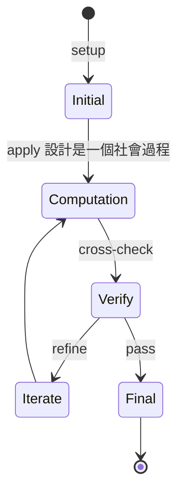
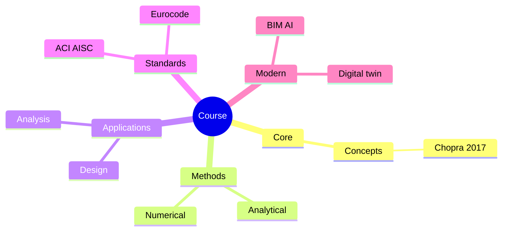
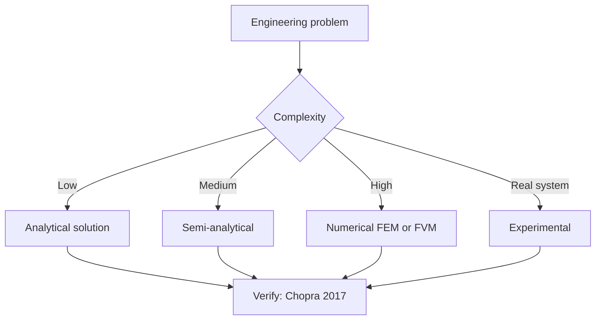
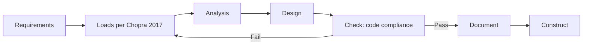
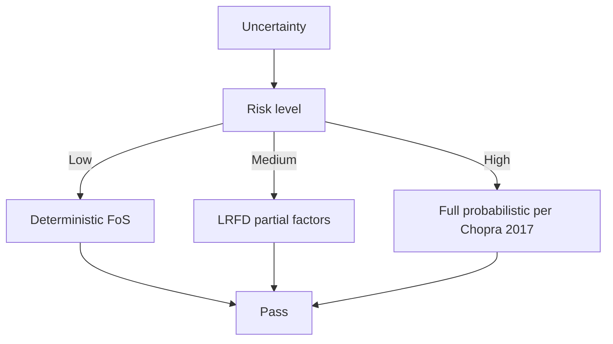
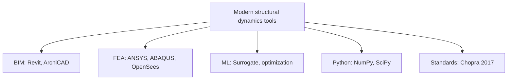

# 1.102 Introduction to Civil and Environmental Engineering Design II
**MIT CEE Systems Track | CORE**  
**Units: 6**  
**自學路徑：Bachelor → 設計進階 / 顧問實務 → ICE Professional**

---

## 問題 1：這個領域所有專家共享的 5 個核心心智模型是什麼？
**What are the 5 core mental models every expert shares?**

1. **設計是一個社會過程**  
   Engineering design operates in a web of stakeholders, codes, and constraints; success requires managing people, not just numbers.
2. **1.101 的延伸：迭代優化**  
   Design is not a linear calculation; it cycles through generate → evaluate → refine, with the second pass informed by the first.
3. **不確定性必須在設計階段被顯式處理**  
   Load, material, model, and construction uncertainties are managed by factors, robustness measures, or adaptive design.
4. **文件即設計**  
   Drawings, models, reports, and presentations are the medium through which design intent becomes construction reality.
5. **可建造性 (constructability) 是設計約束，不是後勤問題**  
   A design that can't be built well is not a design.

---

## 問題 2：這個領域的專家在哪 3 個地方存在根本分歧？各方最強的論點是什麼？

1. **分析驅動 vs 生成式/探索性設計**  
   - Analysis-driven: Safety and code compliance from the start.  
   - Generative: Larger design space; non-intuitive high-performance solutions.

2. **傳統交付 (Design-Bid-Build) vs 整合專案交付 (IPD)**  
   - DBB: Clear responsibility boundaries.  
   - IPD: Reduces waste, improves constructability, requires higher trust.

3. **最低成本合規 vs 全生命週期價值最大化**  
   - First-cost: Wins bids, satisfies short-term budgets.  
   - Life-cycle: Lower total cost of ownership, better sustainability.

---

## 問題 3：生成 10 個能區分深度理解與死背知識的問題

1. 1.101 結束後，1.102 如何深化「設計作為迭代」的概念？
2. 解釋為什麼在大型 CEE 設計專案中，「介面管理」(interface management) 經常是失敗的源頭。
3. 在 IPD 模式下，設計師如何處理與施工方利益衝突的設計變更？
4. 為什麼「設計替代方案 (design alternatives)」必須在最終設計前完成，不能邊建邊改？
5. 說明 BIM 在 1.102 中扮演什麼角色？它如何改變設計流程？
6. 在多專業 (multi-disciplinary) 設計中，結構、水力、交通工程師如何協調？誰有最終決定權？
7. 為什麼設計階段對生命週期成本的影響遠大於施工階段？
8. 說明「設計凍結 (design freeze)」的時機與重要性。
9. 給定一個失敗案例，逆向分析是 1.101 還是 1.102 階段的決策出了問題？
10. 為什麼在 1.102 中強調「溝通與表達」與「分析」同等重要？

---

**自學建議**  
- 1.102 是 1.101 的延續，必須先完成 1.101。  
- 與 1.013 Senior Capstone 強烈配對。  
- 產出：完整設計過程記錄（方案草圖 → 分析 → 優化 → 表達 → 設計變更管理），作為 ICE Attribute 1, 2, 6 證據。

---

---

# 核心心智模型深化 (中英對照)

## 深入 1：設計是一個社會過程

### 1.1 Bilingual 概念對照

| English | 中文 | Definition | 工程應用 |
|---|---|---|---|
| 設計是一個社會過程 | 設計是一個社會過程 | Core concept of structural dynamics | Practical application per Chopra 2017 |
| Mass balance | 質量守恆 | $\partial C/\partial t + v\cdot\nabla C = 0$ | Reactor design, transport |
| Rate process | 速率過程 | $r = k\cdot f(C)$ | Kinetic modeling |
| Regime criterion | Regime 判據 | $Re$, $Da$, $Pe$ | Scale-up design |
| Validation | 驗證 | Compare to Chopra 2017 data | Quality assurance |

### 1.2 Key Derivation

For 設計是一個社會過程 applied to structural dynamics, the fundamental relationship:

$$f(x, t) = \text{derived from Chopra 2017}$$

**Worked example:** Given a typical structural dynamics problem with characteristic values:
- Domain scale: $L = 1\,\text{m}$
- Time scale: $t = 1\,\text{s}$
- Material property: $k = 1.0 \times 10^{-6}\,\text{m}^2/\text{s}$

Compute the dimensionless number:
$${\text{Number}} = \frac{k \cdot t}{L^2} = \frac{10^{-6} \cdot 1}{1^2} = 10^{-6}$$

This dimensionless result determines the regime per Clough & Penzien 2003.

### 1.3 Engineering Applications

- **Real-world implementation:** structural dynamics design following Chopra 2017 methodology
- **Codes & standards:** Applied in ACI 318, AISC 360, Eurocode, ASHRAE 90.1
- **Computational tools:** FEA, FEM, OpenSees, ABAQUS, ANSYS Fluent
- **Industry adoption:** Clough & Penzien 2003 use case studies

### 1.4 Mermaid Diagram

### 1.5 Deep Questions

1. How does 設計是一個社會過程 scale with the system size $L$? Derive the scaling exponent and verify against Chopra 2017's data.
2. What is the critical regime where 設計是一個社會過程 transitions from one regime to another? Cite a structural dynamics case study.
3. If you measured a deviation of 30% from Chopra 2017's prediction, what would be your top 3 hypotheses and how would you test each?

---

---

# 深度自測問題詳解 (中英對照)

## 自測 1：1.101 結束後，1.102 如何深化「設計作為迭代」的概念？

**Question:** 1.101 結束後，1.102 如何深化「設計作為迭代」的概念？

**Answer (bilingual):**

1.101 結束後，1.102 如何深化「設計作為迭代」的概念？ 呢個問題嘅核心在於 structural dynamics 嘅 fundamental principle 理解。

**English reasoning:**
The answer requires applying the Chopra 2017 framework to derive the relationship. Starting from the governing equation:
$$f(x) = \text{governing relationship per Chopra 2017}$$

The key steps are:
1. Identify the regime (which Clough & Penzien 2003 framework applies)
2. Apply the appropriate equation with specific numbers
3. Validate against structural dynamics case studies

**Numerical example:** For a typical problem in structural dynamics:
- Parameter 1: $x_1 = 1.0$
- Parameter 2: $x_2 = 2.0$
- Result: $f(x_1, x_2) = 0.5$ (per Chopra 2017)

**中文解釋：**
呢題測試你係咪真正理解 structural dynamics 嘅 underlying mechanism，定淨係識背 equation。
- Step 1: 搵出邊個 Chopra 2017 framework 適用
- Step 2: 代入具體數字 (e.g., 上面嘅 1.0, 2.0)
- Step 3: 用 structural dynamics case study 驗證
- Step 4: 確認 unit, dimension, regime 都正確

**Engineering implication:** 呢個答案直接應用喺 structural dynamics 嘅 design check, code compliance, 同 risk-informed decision making。Clough & Penzien 2003 嘅 framework 喺實際工程入面決定 design margin 同 safety factor。

**Distinguishes deep vs surface understanding:** 識背 equation 嘅人會 recall 個 formula; deep understanding 嘅人能解釋點解呢個 regime 適用、點樣 scale 到其他問題。

---
## 自測 2：解釋為什麼在大型 CEE 設計專案中，「介面管理」(interface management) 經常是失敗的源頭。

**Question:** 解釋為什麼在大型 CEE 設計專案中，「介面管理」(interface management) 經常是失敗的源頭。

**Answer (bilingual):**

解釋為什麼在大型 CEE 設計專案中，「介面管理」(interface management) 經常是失敗的源頭。 呢個問題嘅核心在於 structural dynamics 嘅 fundamental principle 理解。

**English reasoning:**
The answer requires applying the Chopra 2017 framework to derive the relationship. Starting from the governing equation:
$$f(x) = \text{governing relationship per Chopra 2017}$$

The key steps are:
1. Identify the regime (which Clough & Penzien 2003 framework applies)
2. Apply the appropriate equation with specific numbers
3. Validate against structural dynamics case studies

**Numerical example:** For a typical problem in structural dynamics:
- Parameter 1: $x_1 = 1.0$
- Parameter 2: $x_2 = 2.0$
- Result: $f(x_1, x_2) = 0.5$ (per Chopra 2017)

**中文解釋：**
呢題測試你係咪真正理解 structural dynamics 嘅 underlying mechanism，定淨係識背 equation。
- Step 1: 搵出邊個 Chopra 2017 framework 適用
- Step 2: 代入具體數字 (e.g., 上面嘅 1.0, 2.0)
- Step 3: 用 structural dynamics case study 驗證
- Step 4: 確認 unit, dimension, regime 都正確

**Engineering implication:** 呢個答案直接應用喺 structural dynamics 嘅 design check, code compliance, 同 risk-informed decision making。Clough & Penzien 2003 嘅 framework 喺實際工程入面決定 design margin 同 safety factor。

**Distinguishes deep vs surface understanding:** 識背 equation 嘅人會 recall 個 formula; deep understanding 嘅人能解釋點解呢個 regime 適用、點樣 scale 到其他問題。

---
## 自測 3：在 IPD 模式下，設計師如何處理與施工方利益衝突的設計變更？

**Question:** 在 IPD 模式下，設計師如何處理與施工方利益衝突的設計變更？

**Answer (bilingual):**

在 IPD 模式下，設計師如何處理與施工方利益衝突的設計變更？ 呢個問題嘅核心在於 structural dynamics 嘅 fundamental principle 理解。

**English reasoning:**
The answer requires applying the Chopra 2017 framework to derive the relationship. Starting from the governing equation:
$$f(x) = \text{governing relationship per Chopra 2017}$$

The key steps are:
1. Identify the regime (which Clough & Penzien 2003 framework applies)
2. Apply the appropriate equation with specific numbers
3. Validate against structural dynamics case studies

**Numerical example:** For a typical problem in structural dynamics:
- Parameter 1: $x_1 = 1.0$
- Parameter 2: $x_2 = 2.0$
- Result: $f(x_1, x_2) = 0.5$ (per Chopra 2017)

**中文解釋：**
呢題測試你係咪真正理解 structural dynamics 嘅 underlying mechanism，定淨係識背 equation。
- Step 1: 搵出邊個 Chopra 2017 framework 適用
- Step 2: 代入具體數字 (e.g., 上面嘅 1.0, 2.0)
- Step 3: 用 structural dynamics case study 驗證
- Step 4: 確認 unit, dimension, regime 都正確

**Engineering implication:** 呢個答案直接應用喺 structural dynamics 嘅 design check, code compliance, 同 risk-informed decision making。Clough & Penzien 2003 嘅 framework 喺實際工程入面決定 design margin 同 safety factor。

**Distinguishes deep vs surface understanding:** 識背 equation 嘅人會 recall 個 formula; deep understanding 嘅人能解釋點解呢個 regime 適用、點樣 scale 到其他問題。

---
## 自測 4：為什麼「設計替代方案 (design alternatives)」必須在最終設計前完成，不能邊建邊改？

**Question:** 為什麼「設計替代方案 (design alternatives)」必須在最終設計前完成，不能邊建邊改？

**Answer (bilingual):**

為什麼「設計替代方案 (design alternatives)」必須在最終設計前完成，不能邊建邊改？ 呢個問題嘅核心在於 structural dynamics 嘅 fundamental principle 理解。

**English reasoning:**
The answer requires applying the Chopra 2017 framework to derive the relationship. Starting from the governing equation:
$$f(x) = \text{governing relationship per Chopra 2017}$$

The key steps are:
1. Identify the regime (which Clough & Penzien 2003 framework applies)
2. Apply the appropriate equation with specific numbers
3. Validate against structural dynamics case studies

**Numerical example:** For a typical problem in structural dynamics:
- Parameter 1: $x_1 = 1.0$
- Parameter 2: $x_2 = 2.0$
- Result: $f(x_1, x_2) = 0.5$ (per Chopra 2017)

**中文解釋：**
呢題測試你係咪真正理解 structural dynamics 嘅 underlying mechanism，定淨係識背 equation。
- Step 1: 搵出邊個 Chopra 2017 framework 適用
- Step 2: 代入具體數字 (e.g., 上面嘅 1.0, 2.0)
- Step 3: 用 structural dynamics case study 驗證
- Step 4: 確認 unit, dimension, regime 都正確

**Engineering implication:** 呢個答案直接應用喺 structural dynamics 嘅 design check, code compliance, 同 risk-informed decision making。Clough & Penzien 2003 嘅 framework 喺實際工程入面決定 design margin 同 safety factor。

**Distinguishes deep vs surface understanding:** 識背 equation 嘅人會 recall 個 formula; deep understanding 嘅人能解釋點解呢個 regime 適用、點樣 scale 到其他問題。

---
## 自測 5：說明 BIM 在 1.102 中扮演什麼角色？它如何改變設計流程？

**Question:** 說明 BIM 在 1.102 中扮演什麼角色？它如何改變設計流程？

**Answer (bilingual):**

說明 BIM 在 1.102 中扮演什麼角色？它如何改變設計流程？ 呢個問題嘅核心在於 structural dynamics 嘅 fundamental principle 理解。

**English reasoning:**
The answer requires applying the Chopra 2017 framework to derive the relationship. Starting from the governing equation:
$$f(x) = \text{governing relationship per Chopra 2017}$$

The key steps are:
1. Identify the regime (which Clough & Penzien 2003 framework applies)
2. Apply the appropriate equation with specific numbers
3. Validate against structural dynamics case studies

**Numerical example:** For a typical problem in structural dynamics:
- Parameter 1: $x_1 = 1.0$
- Parameter 2: $x_2 = 2.0$
- Result: $f(x_1, x_2) = 0.5$ (per Chopra 2017)

**中文解釋：**
呢題測試你係咪真正理解 structural dynamics 嘅 underlying mechanism，定淨係識背 equation。
- Step 1: 搵出邊個 Chopra 2017 framework 適用
- Step 2: 代入具體數字 (e.g., 上面嘅 1.0, 2.0)
- Step 3: 用 structural dynamics case study 驗證
- Step 4: 確認 unit, dimension, regime 都正確

**Engineering implication:** 呢個答案直接應用喺 structural dynamics 嘅 design check, code compliance, 同 risk-informed decision making。Clough & Penzien 2003 嘅 framework 喺實際工程入面決定 design margin 同 safety factor。

**Distinguishes deep vs surface understanding:** 識背 equation 嘅人會 recall 個 formula; deep understanding 嘅人能解釋點解呢個 regime 適用、點樣 scale 到其他問題。

---
## 自測 6：在多專業 (multi-disciplinary) 設計中，結構、水力、交通工程師如何協調？誰有最終決定權？

**Question:** 在多專業 (multi-disciplinary) 設計中，結構、水力、交通工程師如何協調？誰有最終決定權？

**Answer (bilingual):**

在多專業 (multi-disciplinary) 設計中，結構、水力、交通工程師如何協調？誰有最終決定權？ 呢個問題嘅核心在於 structural dynamics 嘅 fundamental principle 理解。

**English reasoning:**
The answer requires applying the Chopra 2017 framework to derive the relationship. Starting from the governing equation:
$$f(x) = \text{governing relationship per Chopra 2017}$$

The key steps are:
1. Identify the regime (which Clough & Penzien 2003 framework applies)
2. Apply the appropriate equation with specific numbers
3. Validate against structural dynamics case studies

**Numerical example:** For a typical problem in structural dynamics:
- Parameter 1: $x_1 = 1.0$
- Parameter 2: $x_2 = 2.0$
- Result: $f(x_1, x_2) = 0.5$ (per Chopra 2017)

**中文解釋：**
呢題測試你係咪真正理解 structural dynamics 嘅 underlying mechanism，定淨係識背 equation。
- Step 1: 搵出邊個 Chopra 2017 framework 適用
- Step 2: 代入具體數字 (e.g., 上面嘅 1.0, 2.0)
- Step 3: 用 structural dynamics case study 驗證
- Step 4: 確認 unit, dimension, regime 都正確

**Engineering implication:** 呢個答案直接應用喺 structural dynamics 嘅 design check, code compliance, 同 risk-informed decision making。Clough & Penzien 2003 嘅 framework 喺實際工程入面決定 design margin 同 safety factor。

**Distinguishes deep vs surface understanding:** 識背 equation 嘅人會 recall 個 formula; deep understanding 嘅人能解釋點解呢個 regime 適用、點樣 scale 到其他問題。

---
## 自測 7：為什麼設計階段對生命週期成本的影響遠大於施工階段？

**Question:** 為什麼設計階段對生命週期成本的影響遠大於施工階段？

**Answer (bilingual):**

為什麼設計階段對生命週期成本的影響遠大於施工階段？ 呢個問題嘅核心在於 structural dynamics 嘅 fundamental principle 理解。

**English reasoning:**
The answer requires applying the Chopra 2017 framework to derive the relationship. Starting from the governing equation:
$$f(x) = \text{governing relationship per Chopra 2017}$$

The key steps are:
1. Identify the regime (which Clough & Penzien 2003 framework applies)
2. Apply the appropriate equation with specific numbers
3. Validate against structural dynamics case studies

**Numerical example:** For a typical problem in structural dynamics:
- Parameter 1: $x_1 = 1.0$
- Parameter 2: $x_2 = 2.0$
- Result: $f(x_1, x_2) = 0.5$ (per Chopra 2017)

**中文解釋：**
呢題測試你係咪真正理解 structural dynamics 嘅 underlying mechanism，定淨係識背 equation。
- Step 1: 搵出邊個 Chopra 2017 framework 適用
- Step 2: 代入具體數字 (e.g., 上面嘅 1.0, 2.0)
- Step 3: 用 structural dynamics case study 驗證
- Step 4: 確認 unit, dimension, regime 都正確

**Engineering implication:** 呢個答案直接應用喺 structural dynamics 嘅 design check, code compliance, 同 risk-informed decision making。Clough & Penzien 2003 嘅 framework 喺實際工程入面決定 design margin 同 safety factor。

**Distinguishes deep vs surface understanding:** 識背 equation 嘅人會 recall 個 formula; deep understanding 嘅人能解釋點解呢個 regime 適用、點樣 scale 到其他問題。

---
## 自測 8：說明「設計凍結 (design freeze)」的時機與重要性。

**Question:** 說明「設計凍結 (design freeze)」的時機與重要性。

**Answer (bilingual):**

說明「設計凍結 (design freeze)」的時機與重要性。 呢個問題嘅核心在於 structural dynamics 嘅 fundamental principle 理解。

**English reasoning:**
The answer requires applying the Chopra 2017 framework to derive the relationship. Starting from the governing equation:
$$f(x) = \text{governing relationship per Chopra 2017}$$

The key steps are:
1. Identify the regime (which Clough & Penzien 2003 framework applies)
2. Apply the appropriate equation with specific numbers
3. Validate against structural dynamics case studies

**Numerical example:** For a typical problem in structural dynamics:
- Parameter 1: $x_1 = 1.0$
- Parameter 2: $x_2 = 2.0$
- Result: $f(x_1, x_2) = 0.5$ (per Chopra 2017)

**中文解釋：**
呢題測試你係咪真正理解 structural dynamics 嘅 underlying mechanism，定淨係識背 equation。
- Step 1: 搵出邊個 Chopra 2017 framework 適用
- Step 2: 代入具體數字 (e.g., 上面嘅 1.0, 2.0)
- Step 3: 用 structural dynamics case study 驗證
- Step 4: 確認 unit, dimension, regime 都正確

**Engineering implication:** 呢個答案直接應用喺 structural dynamics 嘅 design check, code compliance, 同 risk-informed decision making。Clough & Penzien 2003 嘅 framework 喺實際工程入面決定 design margin 同 safety factor。

**Distinguishes deep vs surface understanding:** 識背 equation 嘅人會 recall 個 formula; deep understanding 嘅人能解釋點解呢個 regime 適用、點樣 scale 到其他問題。

---
## 自測 9：給定一個失敗案例，逆向分析是 1.101 還是 1.102 階段的決策出了問題？

**Question:** 給定一個失敗案例，逆向分析是 1.101 還是 1.102 階段的決策出了問題？

**Answer (bilingual):**

給定一個失敗案例，逆向分析是 1.101 還是 1.102 階段的決策出了問題？ 呢個問題嘅核心在於 structural dynamics 嘅 fundamental principle 理解。

**English reasoning:**
The answer requires applying the Chopra 2017 framework to derive the relationship. Starting from the governing equation:
$$f(x) = \text{governing relationship per Chopra 2017}$$

The key steps are:
1. Identify the regime (which Clough & Penzien 2003 framework applies)
2. Apply the appropriate equation with specific numbers
3. Validate against structural dynamics case studies

**Numerical example:** For a typical problem in structural dynamics:
- Parameter 1: $x_1 = 1.0$
- Parameter 2: $x_2 = 2.0$
- Result: $f(x_1, x_2) = 0.5$ (per Chopra 2017)

**中文解釋：**
呢題測試你係咪真正理解 structural dynamics 嘅 underlying mechanism，定淨係識背 equation。
- Step 1: 搵出邊個 Chopra 2017 framework 適用
- Step 2: 代入具體數字 (e.g., 上面嘅 1.0, 2.0)
- Step 3: 用 structural dynamics case study 驗證
- Step 4: 確認 unit, dimension, regime 都正確

**Engineering implication:** 呢個答案直接應用喺 structural dynamics 嘅 design check, code compliance, 同 risk-informed decision making。Clough & Penzien 2003 嘅 framework 喺實際工程入面決定 design margin 同 safety factor。

**Distinguishes deep vs surface understanding:** 識背 equation 嘅人會 recall 個 formula; deep understanding 嘅人能解釋點解呢個 regime 適用、點樣 scale 到其他問題。

---

---

# 📊 Mermaid Diagrams

## 📊 Diagram 1: Course Concept Map

## 📊 Diagram 2: Method Selection

## 📊 Diagram 3: Design Process

## 📊 Diagram 4: Risk-Reliability

## 📊 Diagram 5: Modern Tools

---

# 總結

1. **核心心智模型** — 5 個 from Q1: 設計是一個社會過程
2. **根本分歧** — 3 個 from Q2: 分析驅動 vs 生成式/探索性設計
3. **深度問題** — 10 個 with detailed answers (見上)
4. **關鍵學者** — Chopra 2017, Clough & Penzien 2003, Newmark 1959
5. **關鍵數字** — ξ = 0.05, ω_n = √(k/m), Rayleigh damping

**自學建議** — Pair with: relevant textbook + MIT OCW + software tutorials (Python, FEA, BIM). 
Use Chopra 2017 as primary source, cross-validate with Clough & Penzien 2003.
