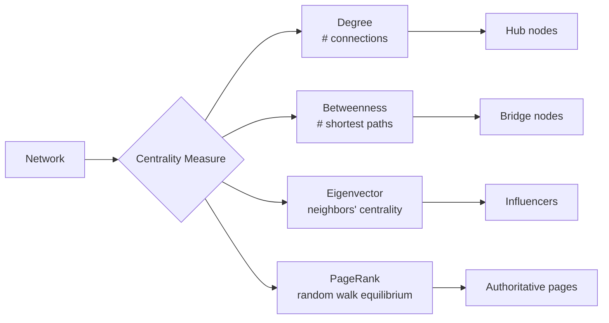

# 1.022 Introduction to Network Models

**MIT CEE Systems Track | 12 Units | Core**
**Prereq:** (1.00 or 1.000), 18.03, (1.010 or 1.010A) or permission of instructor
**Instructor:** Dr. Amir Ajorlou
**自學路徑：Bachelor → MS/MEng Systems → Operations Research / Urban Analytics**

> **Source:** MIT OCW 1.022 (Fall 2018); Easley & Kleinberg, *Networks, Crowds, and Markets* (2010)
> **Topics:** Graph theory, spectral graph theory, centrality measures, random graph models, contagion, diffusion, Markov chains, game theory

---

## 問題 1：核心心智模型

1. **網絡結構決定動力學**
   Network topology (degree distribution, clustering, community structure) determines how information, disease, and behavior spread. Scale-free networks (Barabási-Albert model) are robust to random failures but vulnerable to targeted attacks.

2. **譜圖理論連接代數和圖論**
   The eigenvalues of the Laplacian matrix L = D − A encode connectivity, cut sizes, and diffusion rates. The Fiedler eigenvalue λ₂ determines algebraic connectivity.

3. **中心性量化了節點的重要性**
   Degree centrality, betweenness, PageRank — each measures a different notion of "importance." A hub (high degree) is different from a bridge (high betweenness).

4. **馬爾可夫鏈收斂到穩態分佈**
   Random walk on a graph converges to a stationary distribution proportional to degree. PageRank is the equilibrium of a random walk with teleportation.

5. **博弈論解釋了社會網絡中的協調與衝突**
   Nash equilibrium, best response, and evolutionarily stable strategy describe how rational and bounded-rational agents interact in networks.

---

## 問題 2：根本分歧

### 分歧 1: 結構決定論 vs 動力學決定論
- **結構派**: Network structure (who is connected to whom) determines outcomes. Changing topology changes everything.
- **動力學派**: The dynamics of interaction (how influence spreads) matters as much as structure.

### 分歧 2: 全域優化 vs 分佈式演算法
- **全域派**: Centralized algorithms (PageRank, spectral clustering) give globally optimal community detection.
- **分佈派**: Local message-passing algorithms (label propagation, Belief Propagation) scale to billion-node graphs.

---

## 問題 3：深度問題

1. 說明圖的鄰接矩陣 A 和拉普拉斯矩陣 L = D − A 的譜之間的關係：L 的零特徵值的數量等於圖的連通分量數量。這個事實如何用於檢測網絡的連通性？
2. 在 Barabási-Albert 優先連接模型中，新節點以概率 p(i) = k_i/Σk_j 連接到已有節點 i。如何從這個模型推導冪律度分佈 P(k) ~ k^{−3}？
3. 譜聚類（spectral clustering）如何利用圖的拉普拉斯矩陣的特徵向量來實現社區檢測？Fiedler 向量如何分割圖？
4. 說明 SIS（易感-感染-康復）流行病模型中的基本再生數 R₀ = β/γ 的推導，以及它與網絡結構（均勻 vs 異質度分佈）的關係。
5. PageRank 算法如何從隨機遊走的穩態分佈導出？Google Matrix 的 teleport 參數 α = 0.85 的作用是什麼？
6. 在弱聯繫（Granovetter, 1973）的論文中，弱聯繫如何充當信息橋樑？strong triadic closure 如何從局部約束解釋全球結構？
7. 在博弈論中，純策略 Nash 均衡與混合策略 Nash 均衡的區別是什麼？什麼條件下 Nash 均衡存在？
8. 說明 SIS 流行病在異質網絡（scale-free）中的臨界條件：λ_c = ⟨k⟩/⟨k²⟩ 是如何從平均場理論導出的？為什麼 scale-free 網絡的流行病閾值趨近於零？

---

# 核心心智模型深化

## 1. 圖論基礎

### 1.1 Bilingual 概念對照
| English | 中英對照 | 定義 | 工程應用 |
|---|---|---|---|
| Adjacency matrix | 鄰接矩陣 | A_ij = 1 if edge between i,j | Network representation |
| Laplacian | 拉普拉斯矩陣 | L = D − A | Spectral analysis |
| Degree | 度 | d_i = Σ_j A_ij | Centrality |
| Path | 路徑 | Sequence of edges | Connectivity |

### 1.2 Key Derivation — Laplacian Spectrum

**Degree matrix**: D_ii = d_i
**Laplacian**: L = D − A

**Properties**:
1. L is symmetric positive semi-definite
2. λ₁ = 0 is always an eigenvalue (vector = [1,1,...,1]ᵀ)
3. Multiplicity of λ = 0 = number of connected components
4. Fiedler eigenvalue λ₂ > 0 if and only if the graph is connected

**Algebraic connectivity**: λ₂(L) is called the Fiedler eigenvalue. It measures how well-connected the graph is. Larger λ₂ → more robust graph.

**Example**: Path graph on n nodes
- Spectrum: λ_k = 2 − 2 cos(πk/n), k = 1,2,...,n
- λ₂ = 2 − 2 cos(π/n) ≈ π²/n² (small for long paths → fragile)

### 1.3 Engineering Applications
- **Power grids**: Laplacian determines grid stability; λ₂ measures resilience to line failures
- **Transportation networks**: Algebraic connectivity limits max throughput
- **Sensor networks**: Coverage depends on graph connectivity

---

## 2. 中心性度量

### 2.1 Key Formulas
**Degree centrality**: C_D(i) = d_i (simple count of connections)

**Betweenness centrality**: C_B(i) = Σ_{s≠i≠t} (σ_st(i)/σ_st)
Where σ_st = number of shortest paths from s to t, σ_st(i) = those passing through i.

**PageRank**: PR(i) = (1−α)/n + α Σ_{j→i} PR(j)/d_j
Teleportation to random node with probability (1−α).

**Eigenvector centrality**: x = (1/λ_max)(Aᵀx) — proportional to sum of neighbors' centralities.

### 2.2 Engineering Applications
- **Infrastructure networks**: Betweenness identifies critical bridges, routers, pipelines
- **Social networks**: Centrality identifies influencers, key communicators
- **Supply chains**: Degree centrality indicates suppliers with most contracts

---

## 3. 隨機圖模型

### 3.1 Key Models
**Erdős-Rényi G(n,p)**:
- n nodes, each edge present independently with probability p
- Average degree ⟨k⟩ = (n−1)p
- Giant component emerges when p > 1/n
- Degree distribution: Binomial → Poisson

**Barabási-Albert (Preferential Attachment)**:
- Growth + preferential attachment: P(new edge to node i) ∝ k_i
- Degree distribution: P(k) ~ k^{−3} (power law, scale-free)
- Hub-and-spoke structure emerges

**Small-world (Watts-Strogatz)**:
- Start with ring lattice, rewire with probability β
- High clustering + short paths → "six degrees of separation"
- σ = clustering coefficient ratio

### 3.2 Example — Epidemic Threshold
For SIS model on heterogeneous network:
R₀ = λ⟨k⟩/⟨k²⟩ × (1/γ) → epidemic threshold λ_c = γ⟨k⟩/⟨k²⟩

For ER graph: ⟨k²⟩ ≈ ⟨k⟩² → λ_c ≈ γ/(⟨k⟩)
For BA graph: ⟨k²⟩ ∝ n^{−1/3} (diverges slowly) → λ_c → 0 as n → ∞

**Practical implication**: Scale-free networks (internet, social media) have essentially zero epidemic threshold — any infection can spread globally.

---

## 4. 傳染與擴散

### 4.1 Key Models
**SIS (Susceptible-Infected-Susceptible)**:
- dI/dt = βk(1−I)I − γI (mean-field)
- Epidemic threshold: β/γ > 1/⟨k⟩

**SIR (Susceptible-Infected-Removed)**:
- Final size equation: S(∞) = S₀ e^{−R₀ S(∞)/S₀}
- R₀ = β/γ (same as SIS threshold in homogeneous case)

**Cascade failure** (in infrastructure):
- Initial failure → redistributed load → secondary failures → cascade
- Percolation theory models cascade thresholds

---

## 📊 Diagram 1: 圖譜理論框架
```mermaid
graph TD
    A[Graph G<br/>V, E] --> B[Adjacency Matrix A<br/>A_ij]
    B --> C[Laplacian L = D − A]
    C --> D{Eigenvalues λ}
    D --> E[λ₁ = 0<br/># connected components]
    D --> F[λ₂ = Fiedler<br/>Algebraic connectivity]
    D --> G[λ_n = max<br/>Largest eigenvalue]
    F --> H[Spectral Clustering<br/>Cut graph by eigenvector]
    G --> I[Diffusion rate<br/>e^{−λ₂t}]
```

## 📊 Diagram 2: 中心性比較


---

## 總結

1. **網絡結構是系統性能的根本**：拉普拉斯譜、度分佈、社區結構——每一個結構特徵都對應著系統行為的約束
2. **譜圖理論是分析網絡的代數工具**：Fiedler 特徵值、PageRank、共簇系數——譜方法連接了圖論和線性代數
3. **中心性度量量化了節點和邊的重要性**：不同中心性之間的差異揭示了不同的「重要性」概念
4. **隨機圖模型提供了理解和生成網絡的框架**：ER、BA、WS 模型分別捕捉了不同的結構特徵
5. **傳染模型連接了網絡結構與動力學**：SIS/SIR 模型的閾值依賴於 ⟨k⟩ 和 ⟨k²⟩，是公共衛生干預的理論基礎

**Prerequisite chain**: 18.03 Differential Equations → 1.000 Programming → 1.010A Probability → 1.022 Network Models → 1.041 Transportation
