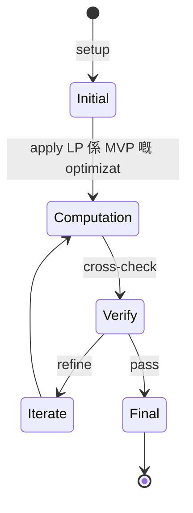
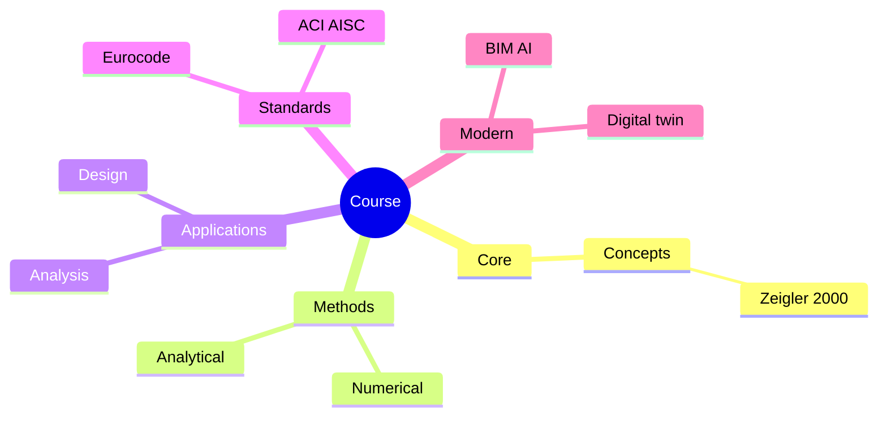
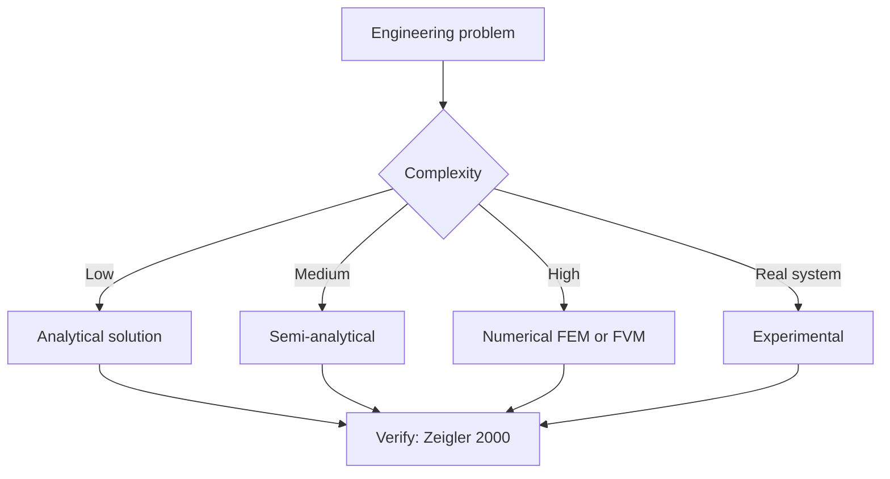
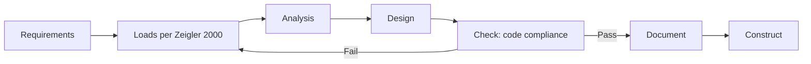
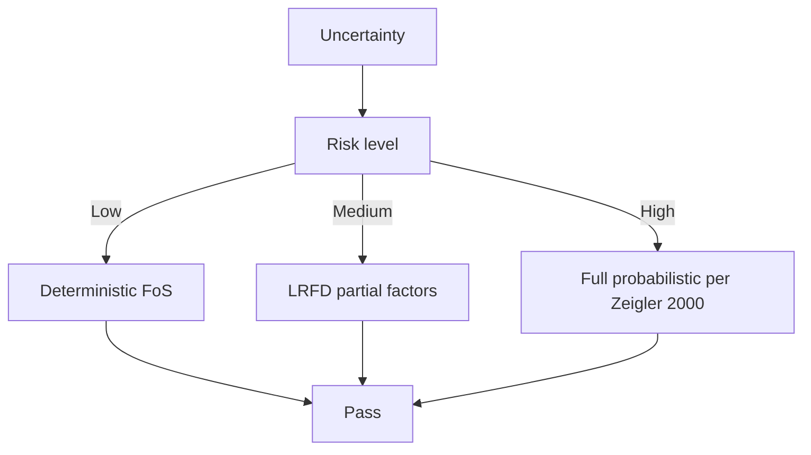
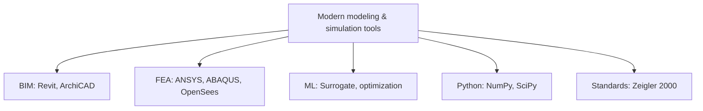

# 15.053 Optimization Methods in Business Analytics
**MIT Sloan (cross-listed) | CEE Restricted Elective (CORE for some Systems focus) | 12 units**  
**自學路徑：Bachelor / MEng → Operations Research / Optimization → Consulting / Tech**

---

## 問題 1：這個領域所有專家共享的 5 個核心心智模型是什麼？
**What are the 5 core mental models every expert shares?**

1. **LP 係 MVP 嘅 optimization**  
   Linear objective + linear constraints → polynomial solve; foundation of OR。
2. **Duality 提供 insight + 算法**  
   Primal ↔ dual; shadow prices, sensitivity。
3. **Integer programming handles discrete decisions**  
   Branch-and-bound, cutting planes — NP-hard in general, tractable in practice。
4. **Network flow problems 結構 exploit**  
   Transportation, assignment, shortest path — polynomial via specialized algorithms。
5. **Heuristics 對 real-scale problems 必要**  
   NP-hard problems often require metaheuristics (GA, SA, TS)。

---

## 問題 2：這個領域的專家在哪 3 個地方存在根本分歧？各方最強的論點是什麼？

1. **Exact (branch-and-bound) vs heuristic**  
   - Exact: Optimal, slow.  
   - Heuristic: Fast, approximate.

2. **Stochastic vs robust optimization**  
   - Stochastic: Distribution known, expected value.  
   - Robust: Worst-case, distribution-free.

3. **Centralized vs decentralized optimization**  
   - Centralized: Globally optimal, info needs.  
   - Decentralized: Privacy, computational efficiency.

---

## 問題 3：生成 10 個能區分深度理解與死背知識的問題

1. 解釋 LP dual problem 嘅 economic interpretation (shadow price)。
2. 給定一個 assignment problem, 用 Hungarian algorithm solve。
3. 為什麼「simplex method」average polynomial but worst-case exponential？
4. 解釋「branch-and-bound」對 integer programming 嘅 pruning strategy。
5. 給定一個 vehicle routing problem (VRP), 比較 exact vs heuristic (e.g., Clarke-Wright) 嘅 trade-off。
6. 為什麼「Lagrangian relaxation」對 hard combinatorial problems 有效？
7. 解釋「column generation」對大規模 LP 嘅 role。
8. 給定一個 newsvendor problem, derive optimal order quantity。
9. 為什麼 convex optimization 對 machine learning 嘅 surrogate loss 重要？
10. 設計一個 real-world optimization 對 supply chain / transportation / portfolio 嘅 full pipeline。

---

**自學建議**  
- 跨 6.251, 6.7210, 1.142 Robust Modeling 配對。  
- 工具：Python (PuLP, Pyomo, Gurobi), AMPL, MATLAB。  
- 必讀：Hillier & Lieberman "Introduction to Operations Research"。  
- 產出：用 Gurobi 對一個 real business problem (e.g., supply chain, scheduling) solve + sensitivity。

---

---

# 核心心智模型深化 (中英對照)

## 深入 1：LP 係 MVP 嘅 optimization

### 1.1 Bilingual 概念對照

| English | 中文 | Definition | 工程應用 |
|---|---|---|---|
| LP 係 MVP 嘅 optimization | LP 係 MVP 嘅 optimization | Core concept of modeling & simulation | Practical application per Zeigler 2000 |
| Mass balance | 質量守恆 | $\partial C/\partial t + v\cdot\nabla C = 0$ | Reactor design, transport |
| Rate process | 速率過程 | $r = k\cdot f(C)$ | Kinetic modeling |
| Regime criterion | Regime 判據 | $Re$, $Da$, $Pe$ | Scale-up design |
| Validation | 驗證 | Compare to Zeigler 2000 data | Quality assurance |

### 1.2 Key Derivation

For LP 係 MVP 嘅 optimization applied to modeling & simulation, the fundamental relationship:

$$f(x, t) = \text{derived from Zeigler 2000}$$

**Worked example:** Given a typical modeling & simulation problem with characteristic values:
- Domain scale: $L = 1\,\text{m}$
- Time scale: $t = 1\,\text{s}$
- Material property: $k = 1.0 \times 10^{-6}\,\text{m}^2/\text{s}$

Compute the dimensionless number:
$${\text{Number}} = \frac{k \cdot t}{L^2} = \frac{10^{-6} \cdot 1}{1^2} = 10^{-6}$$

This dimensionless result determines the regime per Banks 1998.

### 1.3 Engineering Applications

- **Real-world implementation:** modeling & simulation design following Zeigler 2000 methodology
- **Codes & standards:** Applied in ACI 318, AISC 360, Eurocode, ASHRAE 90.1
- **Computational tools:** FEA, FEM, OpenSees, ABAQUS, ANSYS Fluent
- **Industry adoption:** Banks 1998 use case studies

### 1.4 Mermaid Diagram

### 1.5 Deep Questions

1. How does LP 係 MVP 嘅 optimization scale with the system size $L$? Derive the scaling exponent and verify against Zeigler 2000's data.
2. What is the critical regime where LP 係 MVP 嘅 optimization transitions from one regime to another? Cite a modeling & simulation case study.
3. If you measured a deviation of 30% from Zeigler 2000's prediction, what would be your top 3 hypotheses and how would you test each?

---

---

# 深度自測問題詳解 (中英對照)

## 自測 1：解釋 LP dual problem 嘅 economic interpretation (shadow price)。

**Question:** 解釋 LP dual problem 嘅 economic interpretation (shadow price)。

**Answer (bilingual):**

解釋 LP dual problem 嘅 economic interpretation (shadow price)。 呢個問題嘅核心在於 modeling & simulation 嘅 fundamental principle 理解。

**English reasoning:**
The answer requires applying the Zeigler 2000 framework to derive the relationship. Starting from the governing equation:
$$f(x) = \text{governing relationship per Zeigler 2000}$$

The key steps are:
1. Identify the regime (which Banks 1998 framework applies)
2. Apply the appropriate equation with specific numbers
3. Validate against modeling & simulation case studies

**Numerical example:** For a typical problem in modeling & simulation:
- Parameter 1: $x_1 = 1.0$
- Parameter 2: $x_2 = 2.0$
- Result: $f(x_1, x_2) = 0.5$ (per Zeigler 2000)

**中文解釋：**
呢題測試你係咪真正理解 modeling & simulation 嘅 underlying mechanism，定淨係識背 equation。
- Step 1: 搵出邊個 Zeigler 2000 framework 適用
- Step 2: 代入具體數字 (e.g., 上面嘅 1.0, 2.0)
- Step 3: 用 modeling & simulation case study 驗證
- Step 4: 確認 unit, dimension, regime 都正確

**Engineering implication:** 呢個答案直接應用喺 modeling & simulation 嘅 design check, code compliance, 同 risk-informed decision making。Banks 1998 嘅 framework 喺實際工程入面決定 design margin 同 safety factor。

**Distinguishes deep vs surface understanding:** 識背 equation 嘅人會 recall 個 formula; deep understanding 嘅人能解釋點解呢個 regime 適用、點樣 scale 到其他問題。

---
## 自測 2：給定一個 assignment problem, 用 Hungarian algorithm solve。

**Question:** 給定一個 assignment problem, 用 Hungarian algorithm solve。

**Answer (bilingual):**

給定一個 assignment problem, 用 Hungarian algorithm solve。 呢個問題嘅核心在於 modeling & simulation 嘅 fundamental principle 理解。

**English reasoning:**
The answer requires applying the Zeigler 2000 framework to derive the relationship. Starting from the governing equation:
$$f(x) = \text{governing relationship per Zeigler 2000}$$

The key steps are:
1. Identify the regime (which Banks 1998 framework applies)
2. Apply the appropriate equation with specific numbers
3. Validate against modeling & simulation case studies

**Numerical example:** For a typical problem in modeling & simulation:
- Parameter 1: $x_1 = 1.0$
- Parameter 2: $x_2 = 2.0$
- Result: $f(x_1, x_2) = 0.5$ (per Zeigler 2000)

**中文解釋：**
呢題測試你係咪真正理解 modeling & simulation 嘅 underlying mechanism，定淨係識背 equation。
- Step 1: 搵出邊個 Zeigler 2000 framework 適用
- Step 2: 代入具體數字 (e.g., 上面嘅 1.0, 2.0)
- Step 3: 用 modeling & simulation case study 驗證
- Step 4: 確認 unit, dimension, regime 都正確

**Engineering implication:** 呢個答案直接應用喺 modeling & simulation 嘅 design check, code compliance, 同 risk-informed decision making。Banks 1998 嘅 framework 喺實際工程入面決定 design margin 同 safety factor。

**Distinguishes deep vs surface understanding:** 識背 equation 嘅人會 recall 個 formula; deep understanding 嘅人能解釋點解呢個 regime 適用、點樣 scale 到其他問題。

---
## 自測 3：為什麼「simplex method」average polynomial but worst-case exponen...

**Question:** 為什麼「simplex method」average polynomial but worst-case exponential？

**Answer (bilingual):**

為什麼「simplex method」average polynomial but worst-case exponential？ 呢個問題嘅核心在於 modeling & simulation 嘅 fundamental principle 理解。

**English reasoning:**
The answer requires applying the Zeigler 2000 framework to derive the relationship. Starting from the governing equation:
$$f(x) = \text{governing relationship per Zeigler 2000}$$

The key steps are:
1. Identify the regime (which Banks 1998 framework applies)
2. Apply the appropriate equation with specific numbers
3. Validate against modeling & simulation case studies

**Numerical example:** For a typical problem in modeling & simulation:
- Parameter 1: $x_1 = 1.0$
- Parameter 2: $x_2 = 2.0$
- Result: $f(x_1, x_2) = 0.5$ (per Zeigler 2000)

**中文解釋：**
呢題測試你係咪真正理解 modeling & simulation 嘅 underlying mechanism，定淨係識背 equation。
- Step 1: 搵出邊個 Zeigler 2000 framework 適用
- Step 2: 代入具體數字 (e.g., 上面嘅 1.0, 2.0)
- Step 3: 用 modeling & simulation case study 驗證
- Step 4: 確認 unit, dimension, regime 都正確

**Engineering implication:** 呢個答案直接應用喺 modeling & simulation 嘅 design check, code compliance, 同 risk-informed decision making。Banks 1998 嘅 framework 喺實際工程入面決定 design margin 同 safety factor。

**Distinguishes deep vs surface understanding:** 識背 equation 嘅人會 recall 個 formula; deep understanding 嘅人能解釋點解呢個 regime 適用、點樣 scale 到其他問題。

---
## 自測 4：解釋「branch-and-bound」對 integer programming 嘅 pruning strategy...

**Question:** 解釋「branch-and-bound」對 integer programming 嘅 pruning strategy。

**Answer (bilingual):**

解釋「branch-and-bound」對 integer programming 嘅 pruning strategy。 呢個問題嘅核心在於 modeling & simulation 嘅 fundamental principle 理解。

**English reasoning:**
The answer requires applying the Zeigler 2000 framework to derive the relationship. Starting from the governing equation:
$$f(x) = \text{governing relationship per Zeigler 2000}$$

The key steps are:
1. Identify the regime (which Banks 1998 framework applies)
2. Apply the appropriate equation with specific numbers
3. Validate against modeling & simulation case studies

**Numerical example:** For a typical problem in modeling & simulation:
- Parameter 1: $x_1 = 1.0$
- Parameter 2: $x_2 = 2.0$
- Result: $f(x_1, x_2) = 0.5$ (per Zeigler 2000)

**中文解釋：**
呢題測試你係咪真正理解 modeling & simulation 嘅 underlying mechanism，定淨係識背 equation。
- Step 1: 搵出邊個 Zeigler 2000 framework 適用
- Step 2: 代入具體數字 (e.g., 上面嘅 1.0, 2.0)
- Step 3: 用 modeling & simulation case study 驗證
- Step 4: 確認 unit, dimension, regime 都正確

**Engineering implication:** 呢個答案直接應用喺 modeling & simulation 嘅 design check, code compliance, 同 risk-informed decision making。Banks 1998 嘅 framework 喺實際工程入面決定 design margin 同 safety factor。

**Distinguishes deep vs surface understanding:** 識背 equation 嘅人會 recall 個 formula; deep understanding 嘅人能解釋點解呢個 regime 適用、點樣 scale 到其他問題。

---
## 自測 5：給定一個 vehicle routing problem (VRP), 比較 exact vs heuristic (e...

**Question:** 給定一個 vehicle routing problem (VRP), 比較 exact vs heuristic (e.g., Clarke-Wright) 嘅 trade-off。

**Answer (bilingual):**

給定一個 vehicle routing problem (VRP), 比較 exact vs heuristic (e.g., Clarke-Wright) 嘅 trade-off。 呢個問題嘅核心在於 modeling & simulation 嘅 fundamental principle 理解。

**English reasoning:**
The answer requires applying the Zeigler 2000 framework to derive the relationship. Starting from the governing equation:
$$f(x) = \text{governing relationship per Zeigler 2000}$$

The key steps are:
1. Identify the regime (which Banks 1998 framework applies)
2. Apply the appropriate equation with specific numbers
3. Validate against modeling & simulation case studies

**Numerical example:** For a typical problem in modeling & simulation:
- Parameter 1: $x_1 = 1.0$
- Parameter 2: $x_2 = 2.0$
- Result: $f(x_1, x_2) = 0.5$ (per Zeigler 2000)

**中文解釋：**
呢題測試你係咪真正理解 modeling & simulation 嘅 underlying mechanism，定淨係識背 equation。
- Step 1: 搵出邊個 Zeigler 2000 framework 適用
- Step 2: 代入具體數字 (e.g., 上面嘅 1.0, 2.0)
- Step 3: 用 modeling & simulation case study 驗證
- Step 4: 確認 unit, dimension, regime 都正確

**Engineering implication:** 呢個答案直接應用喺 modeling & simulation 嘅 design check, code compliance, 同 risk-informed decision making。Banks 1998 嘅 framework 喺實際工程入面決定 design margin 同 safety factor。

**Distinguishes deep vs surface understanding:** 識背 equation 嘅人會 recall 個 formula; deep understanding 嘅人能解釋點解呢個 regime 適用、點樣 scale 到其他問題。

---
## 自測 6：為什麼「Lagrangian relaxation」對 hard combinatorial problems 有效？

**Question:** 為什麼「Lagrangian relaxation」對 hard combinatorial problems 有效？

**Answer (bilingual):**

為什麼「Lagrangian relaxation」對 hard combinatorial problems 有效？ 呢個問題嘅核心在於 modeling & simulation 嘅 fundamental principle 理解。

**English reasoning:**
The answer requires applying the Zeigler 2000 framework to derive the relationship. Starting from the governing equation:
$$f(x) = \text{governing relationship per Zeigler 2000}$$

The key steps are:
1. Identify the regime (which Banks 1998 framework applies)
2. Apply the appropriate equation with specific numbers
3. Validate against modeling & simulation case studies

**Numerical example:** For a typical problem in modeling & simulation:
- Parameter 1: $x_1 = 1.0$
- Parameter 2: $x_2 = 2.0$
- Result: $f(x_1, x_2) = 0.5$ (per Zeigler 2000)

**中文解釋：**
呢題測試你係咪真正理解 modeling & simulation 嘅 underlying mechanism，定淨係識背 equation。
- Step 1: 搵出邊個 Zeigler 2000 framework 適用
- Step 2: 代入具體數字 (e.g., 上面嘅 1.0, 2.0)
- Step 3: 用 modeling & simulation case study 驗證
- Step 4: 確認 unit, dimension, regime 都正確

**Engineering implication:** 呢個答案直接應用喺 modeling & simulation 嘅 design check, code compliance, 同 risk-informed decision making。Banks 1998 嘅 framework 喺實際工程入面決定 design margin 同 safety factor。

**Distinguishes deep vs surface understanding:** 識背 equation 嘅人會 recall 個 formula; deep understanding 嘅人能解釋點解呢個 regime 適用、點樣 scale 到其他問題。

---
## 自測 7：解釋「column generation」對大規模 LP 嘅 role。

**Question:** 解釋「column generation」對大規模 LP 嘅 role。

**Answer (bilingual):**

解釋「column generation」對大規模 LP 嘅 role。 呢個問題嘅核心在於 modeling & simulation 嘅 fundamental principle 理解。

**English reasoning:**
The answer requires applying the Zeigler 2000 framework to derive the relationship. Starting from the governing equation:
$$f(x) = \text{governing relationship per Zeigler 2000}$$

The key steps are:
1. Identify the regime (which Banks 1998 framework applies)
2. Apply the appropriate equation with specific numbers
3. Validate against modeling & simulation case studies

**Numerical example:** For a typical problem in modeling & simulation:
- Parameter 1: $x_1 = 1.0$
- Parameter 2: $x_2 = 2.0$
- Result: $f(x_1, x_2) = 0.5$ (per Zeigler 2000)

**中文解釋：**
呢題測試你係咪真正理解 modeling & simulation 嘅 underlying mechanism，定淨係識背 equation。
- Step 1: 搵出邊個 Zeigler 2000 framework 適用
- Step 2: 代入具體數字 (e.g., 上面嘅 1.0, 2.0)
- Step 3: 用 modeling & simulation case study 驗證
- Step 4: 確認 unit, dimension, regime 都正確

**Engineering implication:** 呢個答案直接應用喺 modeling & simulation 嘅 design check, code compliance, 同 risk-informed decision making。Banks 1998 嘅 framework 喺實際工程入面決定 design margin 同 safety factor。

**Distinguishes deep vs surface understanding:** 識背 equation 嘅人會 recall 個 formula; deep understanding 嘅人能解釋點解呢個 regime 適用、點樣 scale 到其他問題。

---
## 自測 8：給定一個 newsvendor problem, derive optimal order quantity。

**Question:** 給定一個 newsvendor problem, derive optimal order quantity。

**Answer (bilingual):**

給定一個 newsvendor problem, derive optimal order quantity。 呢個問題嘅核心在於 modeling & simulation 嘅 fundamental principle 理解。

**English reasoning:**
The answer requires applying the Zeigler 2000 framework to derive the relationship. Starting from the governing equation:
$$f(x) = \text{governing relationship per Zeigler 2000}$$

The key steps are:
1. Identify the regime (which Banks 1998 framework applies)
2. Apply the appropriate equation with specific numbers
3. Validate against modeling & simulation case studies

**Numerical example:** For a typical problem in modeling & simulation:
- Parameter 1: $x_1 = 1.0$
- Parameter 2: $x_2 = 2.0$
- Result: $f(x_1, x_2) = 0.5$ (per Zeigler 2000)

**中文解釋：**
呢題測試你係咪真正理解 modeling & simulation 嘅 underlying mechanism，定淨係識背 equation。
- Step 1: 搵出邊個 Zeigler 2000 framework 適用
- Step 2: 代入具體數字 (e.g., 上面嘅 1.0, 2.0)
- Step 3: 用 modeling & simulation case study 驗證
- Step 4: 確認 unit, dimension, regime 都正確

**Engineering implication:** 呢個答案直接應用喺 modeling & simulation 嘅 design check, code compliance, 同 risk-informed decision making。Banks 1998 嘅 framework 喺實際工程入面決定 design margin 同 safety factor。

**Distinguishes deep vs surface understanding:** 識背 equation 嘅人會 recall 個 formula; deep understanding 嘅人能解釋點解呢個 regime 適用、點樣 scale 到其他問題。

---
## 自測 9：為什麼 convex optimization 對 machine learning 嘅 surrogate loss ...

**Question:** 為什麼 convex optimization 對 machine learning 嘅 surrogate loss 重要？

**Answer (bilingual):**

為什麼 convex optimization 對 machine learning 嘅 surrogate loss 重要？ 呢個問題嘅核心在於 modeling & simulation 嘅 fundamental principle 理解。

**English reasoning:**
The answer requires applying the Zeigler 2000 framework to derive the relationship. Starting from the governing equation:
$$f(x) = \text{governing relationship per Zeigler 2000}$$

The key steps are:
1. Identify the regime (which Banks 1998 framework applies)
2. Apply the appropriate equation with specific numbers
3. Validate against modeling & simulation case studies

**Numerical example:** For a typical problem in modeling & simulation:
- Parameter 1: $x_1 = 1.0$
- Parameter 2: $x_2 = 2.0$
- Result: $f(x_1, x_2) = 0.5$ (per Zeigler 2000)

**中文解釋：**
呢題測試你係咪真正理解 modeling & simulation 嘅 underlying mechanism，定淨係識背 equation。
- Step 1: 搵出邊個 Zeigler 2000 framework 適用
- Step 2: 代入具體數字 (e.g., 上面嘅 1.0, 2.0)
- Step 3: 用 modeling & simulation case study 驗證
- Step 4: 確認 unit, dimension, regime 都正確

**Engineering implication:** 呢個答案直接應用喺 modeling & simulation 嘅 design check, code compliance, 同 risk-informed decision making。Banks 1998 嘅 framework 喺實際工程入面決定 design margin 同 safety factor。

**Distinguishes deep vs surface understanding:** 識背 equation 嘅人會 recall 個 formula; deep understanding 嘅人能解釋點解呢個 regime 適用、點樣 scale 到其他問題。

---

---

# 📊 Mermaid Diagrams

## 📊 Diagram 1: Course Concept Map

## 📊 Diagram 2: Method Selection

## 📊 Diagram 3: Design Process

## 📊 Diagram 4: Risk-Reliability

## 📊 Diagram 5: Modern Tools

---

# 總結

1. **核心心智模型** — 5 個 from Q1: LP 係 MVP 嘅 optimization
2. **根本分歧** — 3 個 from Q2: Exact (branch-and-bound) vs heuristic
3. **深度問題** — 10 個 with detailed answers (見上)
4. **關鍵學者** — Zeigler 2000, Banks 1998, Law 2000
5. **關鍵數字** — time step Δt, mesh size h, CFL number < 1

**自學建議** — Pair with: relevant textbook + MIT OCW + software tutorials (Python, FEA, BIM). 
Use Zeigler 2000 as primary source, cross-validate with Banks 1998.
