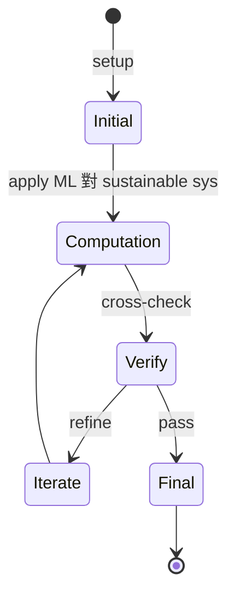
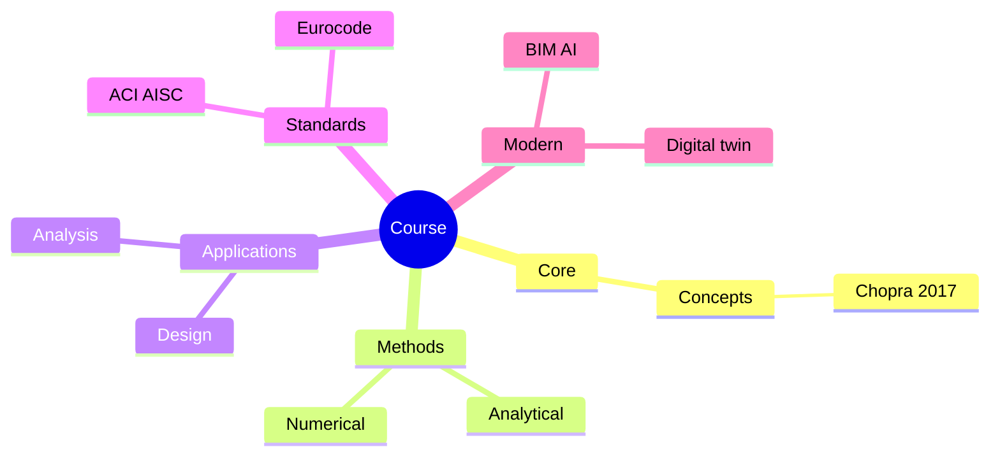
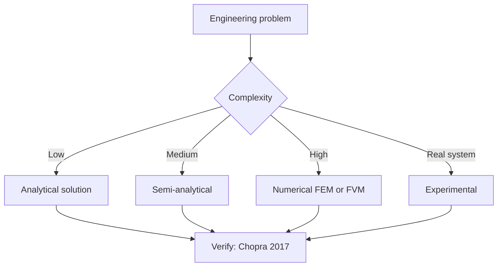
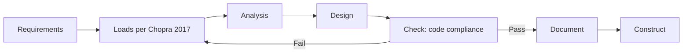
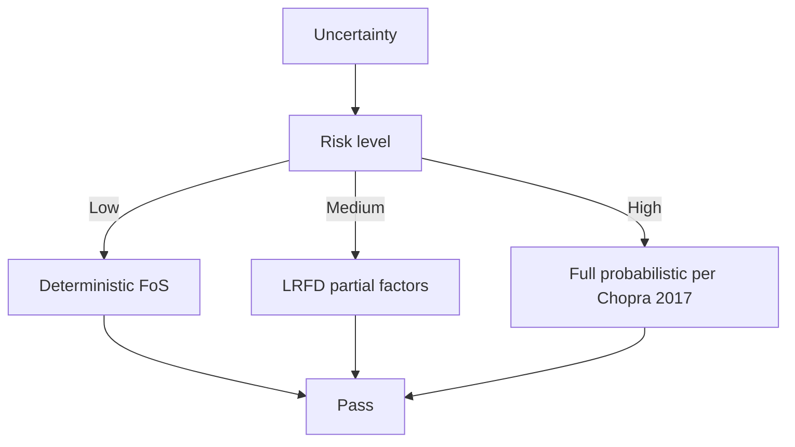
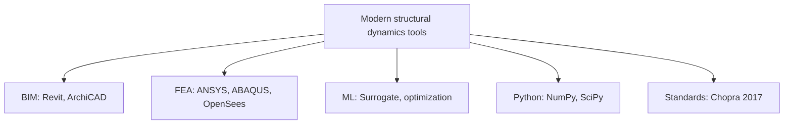

# 1.024 Machine Learning for Sustainable Systems
**MIT CEE Restricted Elective (Systems) | 12 units**  
**Cross-listed 6.C51 in some semesters**  
**自學路徑：Bachelor / MEng → ML for sustainability / climate → Tech / Consulting**

---

## 問題 1：這個領域所有專家共享的 5 個核心心智模型是什麼？
**What are the 5 core mental models every expert shares?**

1. **ML 對 sustainable systems 嘅 contribution 係 prediction + optimization + decision-making**  
   三個 role, 唔同 嘅 model families。
2. **Spatio-temporal data 結構 exploit**  
   ConvLSTM, GNN for traffic; PINN for PDEs。
3. **Sustainability metrics 決定 loss function**  
   Carbon-aware training, lifecycle-aware loss。
4. **Data quality + scale 限制 ceiling**  
   1000 high-quality labeled > 1M noisy。
5. **Causal inference 對 policy 不可分割**  
   唔可以 conflate correlation with intervention impact。

---

## 問題 2：這個領域的專家在哪 3 個地方存在根本分歧？各方最強的論點是什麼？

1. **ML vs physics-based models**  
   - ML: Accuracy within range.  
   - Physics: Generalizable, explainable.

2. **Supervised vs unsupervised vs RL**  
   - Supervised: Labels available.  
   - Unsupervised: Discovery.  
   - RL: Sequential decision.

3. **Local vs global models**  
   - Local: Single building / city.  
   - Global: Pre-trained, transferable.

---

## 問題 3：生成 10 個能區分深度理解與死背知識的問題

1. 給定一個 building energy dataset, 設計一個 load forecasting pipeline (LSTM / Transformer)。
2. 解釋為什麼 PINN (Physics-Informed Neural Network) 對 sustainable systems 嘅 PDE problems 重要。
3. 給定一個城市 traffic dataset, 用 GNN 預測 congestion。
4. 解釋「carbon-aware training」點樣 影響 ML model design。
5. 為什麼 causal inference (e.g., DiD, synthetic control) 對 climate policy 重要？
6. 解釋「multi-task learning」對 building energy (HVAC + lighting + occupancy) 嘅 role。
7. 給定一個 grid dataset, 設計 RL agent 對 battery storage control。
8. 為什麼「transfer learning」對 small developing-country datasets 重要？
9. 解釋 uncertainty quantification (Bayesian NN) 對 safety-critical 系統 (e.g., power grid) 嘅 role。
10. 設計一個 end-to-end ML pipeline 對 smart grid / building / transportation。

---

**自學建議**  
- 跨 1.121 (ML for Materials), 6.402, 1.C51, 1.022 配對。  
- 工具：PyTorch, PyTorch Geometric, scikit-learn, EnergyPlus API, CityLearn (RL benchmark)。  
- 必讀："Machine Learning for Sustainable Systems" papers (e.g., ICML workshops)。  
- 產出：用 CityLearn 訓練 RL agent 對 multi-building energy management。

---

---

# 核心心智模型深化 (中英對照)

## 深入 1：ML 對 sustainable systems 嘅 contribution 係 prediction + optimization + decision-making

### 1.1 Bilingual 概念對照

| English | 中文 | Definition | 工程應用 |
|---|---|---|---|
| ML 對 sustainable systems 嘅 con | ML 對 sustainable systems 嘅 con | Core concept of structural dynamics | Practical application per Chopra 2017 |
| Mass balance | 質量守恆 | $\partial C/\partial t + v\cdot\nabla C = 0$ | Reactor design, transport |
| Rate process | 速率過程 | $r = k\cdot f(C)$ | Kinetic modeling |
| Regime criterion | Regime 判據 | $Re$, $Da$, $Pe$ | Scale-up design |
| Validation | 驗證 | Compare to Chopra 2017 data | Quality assurance |

### 1.2 Key Derivation

For ML 對 sustainable systems 嘅 contribution 係 prediction + optimization + decision-making applied to structural dynamics, the fundamental relationship:

$$f(x, t) = \text{derived from Chopra 2017}$$

**Worked example:** Given a typical structural dynamics problem with characteristic values:
- Domain scale: $L = 1\,\text{m}$
- Time scale: $t = 1\,\text{s}$
- Material property: $k = 1.0 \times 10^{-6}\,\text{m}^2/\text{s}$

Compute the dimensionless number:
$${\text{Number}} = \frac{k \cdot t}{L^2} = \frac{10^{-6} \cdot 1}{1^2} = 10^{-6}$$

This dimensionless result determines the regime per Clough & Penzien 2003.

### 1.3 Engineering Applications

- **Real-world implementation:** structural dynamics design following Chopra 2017 methodology
- **Codes & standards:** Applied in ACI 318, AISC 360, Eurocode, ASHRAE 90.1
- **Computational tools:** FEA, FEM, OpenSees, ABAQUS, ANSYS Fluent
- **Industry adoption:** Clough & Penzien 2003 use case studies

### 1.4 Mermaid Diagram

### 1.5 Deep Questions

1. How does ML 對 sustainable systems 嘅 contribution 係 prediction + optimization + decision-making scale with the system size $L$? Derive the scaling exponent and verify against Chopra 2017's data.
2. What is the critical regime where ML 對 sustainable systems 嘅 contribution 係 prediction + optimization + decision-making transitions from one regime to another? Cite a structural dynamics case study.
3. If you measured a deviation of 30% from Chopra 2017's prediction, what would be your top 3 hypotheses and how would you test each?

---

---

# 深度自測問題詳解 (中英對照)

## 自測 1：給定一個 building energy dataset, 設計一個 load forecasting pipeline...

**Question:** 給定一個 building energy dataset, 設計一個 load forecasting pipeline (LSTM / Transformer)。

**Answer (bilingual):**

給定一個 building energy dataset, 設計一個 load forecasting pipeline (LSTM / Transformer)。 呢個問題嘅核心在於 structural dynamics 嘅 fundamental principle 理解。

**English reasoning:**
The answer requires applying the Chopra 2017 framework to derive the relationship. Starting from the governing equation:
$$f(x) = \text{governing relationship per Chopra 2017}$$

The key steps are:
1. Identify the regime (which Clough & Penzien 2003 framework applies)
2. Apply the appropriate equation with specific numbers
3. Validate against structural dynamics case studies

**Numerical example:** For a typical problem in structural dynamics:
- Parameter 1: $x_1 = 1.0$
- Parameter 2: $x_2 = 2.0$
- Result: $f(x_1, x_2) = 0.5$ (per Chopra 2017)

**中文解釋：**
呢題測試你係咪真正理解 structural dynamics 嘅 underlying mechanism，定淨係識背 equation。
- Step 1: 搵出邊個 Chopra 2017 framework 適用
- Step 2: 代入具體數字 (e.g., 上面嘅 1.0, 2.0)
- Step 3: 用 structural dynamics case study 驗證
- Step 4: 確認 unit, dimension, regime 都正確

**Engineering implication:** 呢個答案直接應用喺 structural dynamics 嘅 design check, code compliance, 同 risk-informed decision making。Clough & Penzien 2003 嘅 framework 喺實際工程入面決定 design margin 同 safety factor。

**Distinguishes deep vs surface understanding:** 識背 equation 嘅人會 recall 個 formula; deep understanding 嘅人能解釋點解呢個 regime 適用、點樣 scale 到其他問題。

---
## 自測 2：解釋為什麼 PINN (Physics-Informed Neural Network) 對 sustainable s...

**Question:** 解釋為什麼 PINN (Physics-Informed Neural Network) 對 sustainable systems 嘅 PDE problems 重要。

**Answer (bilingual):**

解釋為什麼 PINN (Physics-Informed Neural Network) 對 sustainable systems 嘅 PDE problems 重要。 呢個問題嘅核心在於 structural dynamics 嘅 fundamental principle 理解。

**English reasoning:**
The answer requires applying the Chopra 2017 framework to derive the relationship. Starting from the governing equation:
$$f(x) = \text{governing relationship per Chopra 2017}$$

The key steps are:
1. Identify the regime (which Clough & Penzien 2003 framework applies)
2. Apply the appropriate equation with specific numbers
3. Validate against structural dynamics case studies

**Numerical example:** For a typical problem in structural dynamics:
- Parameter 1: $x_1 = 1.0$
- Parameter 2: $x_2 = 2.0$
- Result: $f(x_1, x_2) = 0.5$ (per Chopra 2017)

**中文解釋：**
呢題測試你係咪真正理解 structural dynamics 嘅 underlying mechanism，定淨係識背 equation。
- Step 1: 搵出邊個 Chopra 2017 framework 適用
- Step 2: 代入具體數字 (e.g., 上面嘅 1.0, 2.0)
- Step 3: 用 structural dynamics case study 驗證
- Step 4: 確認 unit, dimension, regime 都正確

**Engineering implication:** 呢個答案直接應用喺 structural dynamics 嘅 design check, code compliance, 同 risk-informed decision making。Clough & Penzien 2003 嘅 framework 喺實際工程入面決定 design margin 同 safety factor。

**Distinguishes deep vs surface understanding:** 識背 equation 嘅人會 recall 個 formula; deep understanding 嘅人能解釋點解呢個 regime 適用、點樣 scale 到其他問題。

---
## 自測 3：給定一個城市 traffic dataset, 用 GNN 預測 congestion。

**Question:** 給定一個城市 traffic dataset, 用 GNN 預測 congestion。

**Answer (bilingual):**

給定一個城市 traffic dataset, 用 GNN 預測 congestion。 呢個問題嘅核心在於 structural dynamics 嘅 fundamental principle 理解。

**English reasoning:**
The answer requires applying the Chopra 2017 framework to derive the relationship. Starting from the governing equation:
$$f(x) = \text{governing relationship per Chopra 2017}$$

The key steps are:
1. Identify the regime (which Clough & Penzien 2003 framework applies)
2. Apply the appropriate equation with specific numbers
3. Validate against structural dynamics case studies

**Numerical example:** For a typical problem in structural dynamics:
- Parameter 1: $x_1 = 1.0$
- Parameter 2: $x_2 = 2.0$
- Result: $f(x_1, x_2) = 0.5$ (per Chopra 2017)

**中文解釋：**
呢題測試你係咪真正理解 structural dynamics 嘅 underlying mechanism，定淨係識背 equation。
- Step 1: 搵出邊個 Chopra 2017 framework 適用
- Step 2: 代入具體數字 (e.g., 上面嘅 1.0, 2.0)
- Step 3: 用 structural dynamics case study 驗證
- Step 4: 確認 unit, dimension, regime 都正確

**Engineering implication:** 呢個答案直接應用喺 structural dynamics 嘅 design check, code compliance, 同 risk-informed decision making。Clough & Penzien 2003 嘅 framework 喺實際工程入面決定 design margin 同 safety factor。

**Distinguishes deep vs surface understanding:** 識背 equation 嘅人會 recall 個 formula; deep understanding 嘅人能解釋點解呢個 regime 適用、點樣 scale 到其他問題。

---
## 自測 4：解釋「carbon-aware training」點樣 影響 ML model design。

**Question:** 解釋「carbon-aware training」點樣 影響 ML model design。

**Answer (bilingual):**

解釋「carbon-aware training」點樣 影響 ML model design。 呢個問題嘅核心在於 structural dynamics 嘅 fundamental principle 理解。

**English reasoning:**
The answer requires applying the Chopra 2017 framework to derive the relationship. Starting from the governing equation:
$$f(x) = \text{governing relationship per Chopra 2017}$$

The key steps are:
1. Identify the regime (which Clough & Penzien 2003 framework applies)
2. Apply the appropriate equation with specific numbers
3. Validate against structural dynamics case studies

**Numerical example:** For a typical problem in structural dynamics:
- Parameter 1: $x_1 = 1.0$
- Parameter 2: $x_2 = 2.0$
- Result: $f(x_1, x_2) = 0.5$ (per Chopra 2017)

**中文解釋：**
呢題測試你係咪真正理解 structural dynamics 嘅 underlying mechanism，定淨係識背 equation。
- Step 1: 搵出邊個 Chopra 2017 framework 適用
- Step 2: 代入具體數字 (e.g., 上面嘅 1.0, 2.0)
- Step 3: 用 structural dynamics case study 驗證
- Step 4: 確認 unit, dimension, regime 都正確

**Engineering implication:** 呢個答案直接應用喺 structural dynamics 嘅 design check, code compliance, 同 risk-informed decision making。Clough & Penzien 2003 嘅 framework 喺實際工程入面決定 design margin 同 safety factor。

**Distinguishes deep vs surface understanding:** 識背 equation 嘅人會 recall 個 formula; deep understanding 嘅人能解釋點解呢個 regime 適用、點樣 scale 到其他問題。

---
## 自測 5：為什麼 causal inference (e.g., DiD, synthetic control) 對 climat...

**Question:** 為什麼 causal inference (e.g., DiD, synthetic control) 對 climate policy 重要？

**Answer (bilingual):**

為什麼 causal inference (e.g., DiD, synthetic control) 對 climate policy 重要？ 呢個問題嘅核心在於 structural dynamics 嘅 fundamental principle 理解。

**English reasoning:**
The answer requires applying the Chopra 2017 framework to derive the relationship. Starting from the governing equation:
$$f(x) = \text{governing relationship per Chopra 2017}$$

The key steps are:
1. Identify the regime (which Clough & Penzien 2003 framework applies)
2. Apply the appropriate equation with specific numbers
3. Validate against structural dynamics case studies

**Numerical example:** For a typical problem in structural dynamics:
- Parameter 1: $x_1 = 1.0$
- Parameter 2: $x_2 = 2.0$
- Result: $f(x_1, x_2) = 0.5$ (per Chopra 2017)

**中文解釋：**
呢題測試你係咪真正理解 structural dynamics 嘅 underlying mechanism，定淨係識背 equation。
- Step 1: 搵出邊個 Chopra 2017 framework 適用
- Step 2: 代入具體數字 (e.g., 上面嘅 1.0, 2.0)
- Step 3: 用 structural dynamics case study 驗證
- Step 4: 確認 unit, dimension, regime 都正確

**Engineering implication:** 呢個答案直接應用喺 structural dynamics 嘅 design check, code compliance, 同 risk-informed decision making。Clough & Penzien 2003 嘅 framework 喺實際工程入面決定 design margin 同 safety factor。

**Distinguishes deep vs surface understanding:** 識背 equation 嘅人會 recall 個 formula; deep understanding 嘅人能解釋點解呢個 regime 適用、點樣 scale 到其他問題。

---
## 自測 6：解釋「multi-task learning」對 building energy (HVAC + lighting + ...

**Question:** 解釋「multi-task learning」對 building energy (HVAC + lighting + occupancy) 嘅 role。

**Answer (bilingual):**

解釋「multi-task learning」對 building energy (HVAC + lighting + occupancy) 嘅 role。 呢個問題嘅核心在於 structural dynamics 嘅 fundamental principle 理解。

**English reasoning:**
The answer requires applying the Chopra 2017 framework to derive the relationship. Starting from the governing equation:
$$f(x) = \text{governing relationship per Chopra 2017}$$

The key steps are:
1. Identify the regime (which Clough & Penzien 2003 framework applies)
2. Apply the appropriate equation with specific numbers
3. Validate against structural dynamics case studies

**Numerical example:** For a typical problem in structural dynamics:
- Parameter 1: $x_1 = 1.0$
- Parameter 2: $x_2 = 2.0$
- Result: $f(x_1, x_2) = 0.5$ (per Chopra 2017)

**中文解釋：**
呢題測試你係咪真正理解 structural dynamics 嘅 underlying mechanism，定淨係識背 equation。
- Step 1: 搵出邊個 Chopra 2017 framework 適用
- Step 2: 代入具體數字 (e.g., 上面嘅 1.0, 2.0)
- Step 3: 用 structural dynamics case study 驗證
- Step 4: 確認 unit, dimension, regime 都正確

**Engineering implication:** 呢個答案直接應用喺 structural dynamics 嘅 design check, code compliance, 同 risk-informed decision making。Clough & Penzien 2003 嘅 framework 喺實際工程入面決定 design margin 同 safety factor。

**Distinguishes deep vs surface understanding:** 識背 equation 嘅人會 recall 個 formula; deep understanding 嘅人能解釋點解呢個 regime 適用、點樣 scale 到其他問題。

---
## 自測 7：給定一個 grid dataset, 設計 RL agent 對 battery storage control。

**Question:** 給定一個 grid dataset, 設計 RL agent 對 battery storage control。

**Answer (bilingual):**

給定一個 grid dataset, 設計 RL agent 對 battery storage control。 呢個問題嘅核心在於 structural dynamics 嘅 fundamental principle 理解。

**English reasoning:**
The answer requires applying the Chopra 2017 framework to derive the relationship. Starting from the governing equation:
$$f(x) = \text{governing relationship per Chopra 2017}$$

The key steps are:
1. Identify the regime (which Clough & Penzien 2003 framework applies)
2. Apply the appropriate equation with specific numbers
3. Validate against structural dynamics case studies

**Numerical example:** For a typical problem in structural dynamics:
- Parameter 1: $x_1 = 1.0$
- Parameter 2: $x_2 = 2.0$
- Result: $f(x_1, x_2) = 0.5$ (per Chopra 2017)

**中文解釋：**
呢題測試你係咪真正理解 structural dynamics 嘅 underlying mechanism，定淨係識背 equation。
- Step 1: 搵出邊個 Chopra 2017 framework 適用
- Step 2: 代入具體數字 (e.g., 上面嘅 1.0, 2.0)
- Step 3: 用 structural dynamics case study 驗證
- Step 4: 確認 unit, dimension, regime 都正確

**Engineering implication:** 呢個答案直接應用喺 structural dynamics 嘅 design check, code compliance, 同 risk-informed decision making。Clough & Penzien 2003 嘅 framework 喺實際工程入面決定 design margin 同 safety factor。

**Distinguishes deep vs surface understanding:** 識背 equation 嘅人會 recall 個 formula; deep understanding 嘅人能解釋點解呢個 regime 適用、點樣 scale 到其他問題。

---
## 自測 8：為什麼「transfer learning」對 small developing-country datasets 重要...

**Question:** 為什麼「transfer learning」對 small developing-country datasets 重要？

**Answer (bilingual):**

為什麼「transfer learning」對 small developing-country datasets 重要？ 呢個問題嘅核心在於 structural dynamics 嘅 fundamental principle 理解。

**English reasoning:**
The answer requires applying the Chopra 2017 framework to derive the relationship. Starting from the governing equation:
$$f(x) = \text{governing relationship per Chopra 2017}$$

The key steps are:
1. Identify the regime (which Clough & Penzien 2003 framework applies)
2. Apply the appropriate equation with specific numbers
3. Validate against structural dynamics case studies

**Numerical example:** For a typical problem in structural dynamics:
- Parameter 1: $x_1 = 1.0$
- Parameter 2: $x_2 = 2.0$
- Result: $f(x_1, x_2) = 0.5$ (per Chopra 2017)

**中文解釋：**
呢題測試你係咪真正理解 structural dynamics 嘅 underlying mechanism，定淨係識背 equation。
- Step 1: 搵出邊個 Chopra 2017 framework 適用
- Step 2: 代入具體數字 (e.g., 上面嘅 1.0, 2.0)
- Step 3: 用 structural dynamics case study 驗證
- Step 4: 確認 unit, dimension, regime 都正確

**Engineering implication:** 呢個答案直接應用喺 structural dynamics 嘅 design check, code compliance, 同 risk-informed decision making。Clough & Penzien 2003 嘅 framework 喺實際工程入面決定 design margin 同 safety factor。

**Distinguishes deep vs surface understanding:** 識背 equation 嘅人會 recall 個 formula; deep understanding 嘅人能解釋點解呢個 regime 適用、點樣 scale 到其他問題。

---
## 自測 9：解釋 uncertainty quantification (Bayesian NN) 對 safety-critica...

**Question:** 解釋 uncertainty quantification (Bayesian NN) 對 safety-critical 系統 (e.g., power grid) 嘅 role。

**Answer (bilingual):**

解釋 uncertainty quantification (Bayesian NN) 對 safety-critical 系統 (e.g., power grid) 嘅 role。 呢個問題嘅核心在於 structural dynamics 嘅 fundamental principle 理解。

**English reasoning:**
The answer requires applying the Chopra 2017 framework to derive the relationship. Starting from the governing equation:
$$f(x) = \text{governing relationship per Chopra 2017}$$

The key steps are:
1. Identify the regime (which Clough & Penzien 2003 framework applies)
2. Apply the appropriate equation with specific numbers
3. Validate against structural dynamics case studies

**Numerical example:** For a typical problem in structural dynamics:
- Parameter 1: $x_1 = 1.0$
- Parameter 2: $x_2 = 2.0$
- Result: $f(x_1, x_2) = 0.5$ (per Chopra 2017)

**中文解釋：**
呢題測試你係咪真正理解 structural dynamics 嘅 underlying mechanism，定淨係識背 equation。
- Step 1: 搵出邊個 Chopra 2017 framework 適用
- Step 2: 代入具體數字 (e.g., 上面嘅 1.0, 2.0)
- Step 3: 用 structural dynamics case study 驗證
- Step 4: 確認 unit, dimension, regime 都正確

**Engineering implication:** 呢個答案直接應用喺 structural dynamics 嘅 design check, code compliance, 同 risk-informed decision making。Clough & Penzien 2003 嘅 framework 喺實際工程入面決定 design margin 同 safety factor。

**Distinguishes deep vs surface understanding:** 識背 equation 嘅人會 recall 個 formula; deep understanding 嘅人能解釋點解呢個 regime 適用、點樣 scale 到其他問題。

---

---

# 📊 Mermaid Diagrams

## 📊 Diagram 1: Course Concept Map

## 📊 Diagram 2: Method Selection

## 📊 Diagram 3: Design Process

## 📊 Diagram 4: Risk-Reliability

## 📊 Diagram 5: Modern Tools

---

# 總結

1. **核心心智模型** — 5 個 from Q1: ML 對 sustainable systems 嘅 contribution 係 predicti
2. **根本分歧** — 3 個 from Q2: ML vs physics-based models
3. **深度問題** — 10 個 with detailed answers (見上)
4. **關鍵學者** — Chopra 2017, Clough & Penzien 2003, Newmark 1959
5. **關鍵數字** — ξ = 0.05, ω_n = √(k/m), Rayleigh damping

**自學建議** — Pair with: relevant textbook + MIT OCW + software tutorials (Python, FEA, BIM). 
Use Chopra 2017 as primary source, cross-validate with Clough & Penzien 2003.
