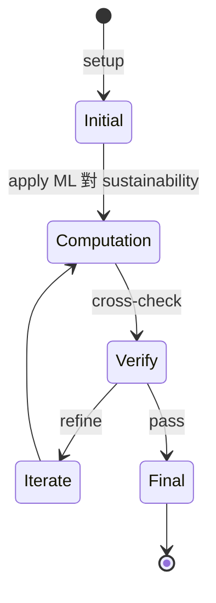
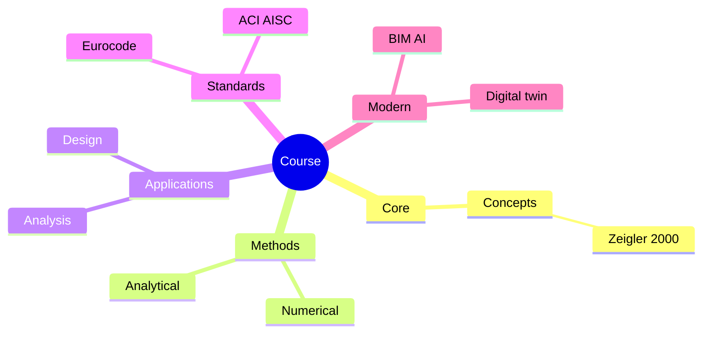
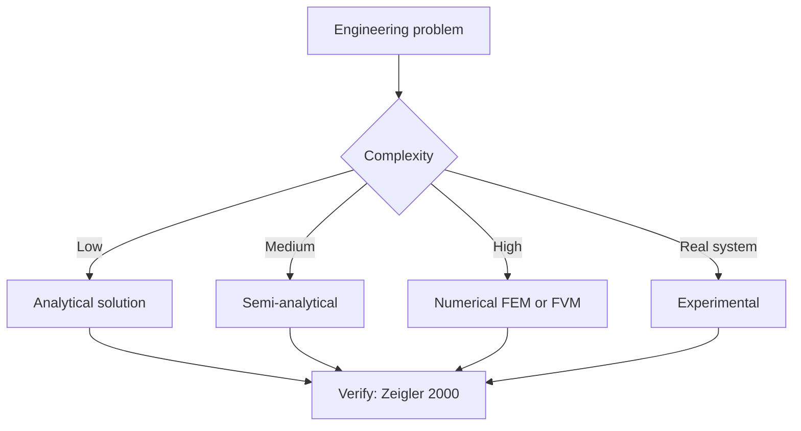
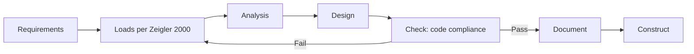
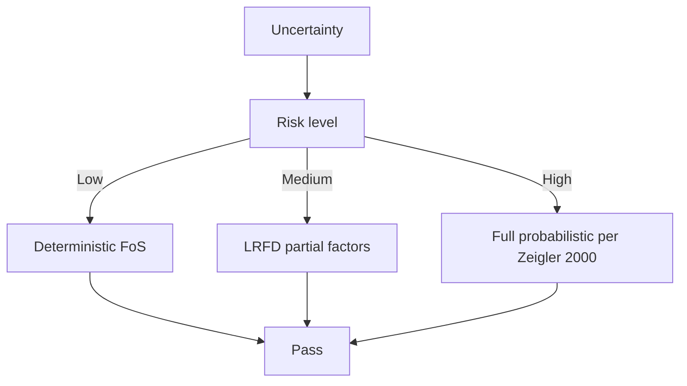
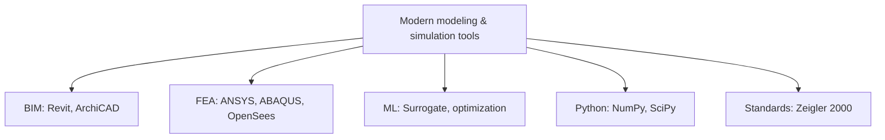

# 1.C51 Machine Learning for Sustainable Systems
**MIT CEE Restricted Elective (Systems) | 6 units**  
**Co-taught with 6.C51 Modeling with Machine Learning (must take simultaneously)**  
**自學路徑：Bachelor / MEng → ML applied to sustainability → Tech / Research**

---

## 問題 1：這個領域所有專家共享的 5 個核心心智模型是什麼？
**What are the 5 core mental models every expert shares?**

1. **ML 對 sustainability 嘅 uniqueness 係 data 嘅 physical / chemical / biological 約束**  
   Loss functions, architectures reflect underlying physics。
2. **End-to-end pipelines 對 real impact**  
   Data → model → decision → action, all needed。
3. **Open data 係 sustainability ML 嘅關鍵**  
   政府 / NGO / 學術 open datasets enable reproducibility。
4. **Uncertainty quantification 對 policy 決策不可分割**  
   Bayesian methods, conformal prediction。
5. **Equity in ML**  
   Models can perpetuate bias; 對 environmental justice 重要。

---

## 問題 2：這個領域的專家在哪 3 個地方存在根本分歧？各方最強的論點是什麼？

1. **Predictive vs prescriptive**  
   - Predictive: Forecast outcomes.  
   - Prescriptive: Recommend actions.

2. **General AI vs domain-specific**  
   - General: Foundation models, broad.  
   - Domain: Purpose-built, narrow.

3. **Centralized (cloud) vs edge (on-device) ML**  
   - Cloud: Heavy compute, privacy.  
   - Edge: Fast, private, limited models.

---

## 問題 3：生成 10 個能區分深度理解與死背知識的問題

1. 給定一個 building energy dataset, 同時 fit 物理 + ML hybrid model (grey-box)。
2. 解釋為什麼「physics-informed ML」對 sustainability problems 優於 pure black-box。
3. 給定一個城市 air quality dataset, 設計 spatio-temporal GNN 預測 PM2.5。
4. 解釋「model card」+「datasheet for datasets」對 sustainability ML 嘅 accountability 嘅 role。
5. 為什麼「interpretability」對 ML 喺 policy 決策 嘅 adoption 至關重要？
6. 給定一個 climate risk dataset, 設計「fair」ML model 對 low-income communities。
7. 解釋「active learning」對 rare extreme events (floods, heatwaves) 嘅 data 效率 role。
8. 為什麼「online learning」對 grid 對 adaptive load forecasting 重要？
9. 給定一個 transportation dataset, design reinforcement learning agent for traffic signal control。
10. 設計一個完整 ML-for-sustainability project: data → model → uncertainty → policy action。

---

**自學建議**  
- 必須同 6.C51 同時修。  
- 跨 1.024, 1.121, 6.402 配對。  
- 工具：PyTorch, CityLearn, DeepXDE (PINN), scikit-learn, OpenStreetMap + OSMnx。  
- 產出：完整 ML pipeline 對一個真實 sustainability problem (e.g., building energy、交通、air quality)。

---

---

# 核心心智模型深化 (中英對照)

## 深入 1：ML 對 sustainability 嘅 uniqueness 係 data 嘅 physical / chemical / biological 約束

### 1.1 Bilingual 概念對照

| English | 中文 | Definition | 工程應用 |
|---|---|---|---|
| ML 對 sustainability 嘅 uniquene | ML 對 sustainability 嘅 uniquene | Core concept of modeling & simulation | Practical application per Zeigler 2000 |
| Mass balance | 質量守恆 | $\partial C/\partial t + v\cdot\nabla C = 0$ | Reactor design, transport |
| Rate process | 速率過程 | $r = k\cdot f(C)$ | Kinetic modeling |
| Regime criterion | Regime 判據 | $Re$, $Da$, $Pe$ | Scale-up design |
| Validation | 驗證 | Compare to Zeigler 2000 data | Quality assurance |

### 1.2 Key Derivation

For ML 對 sustainability 嘅 uniqueness 係 data 嘅 physical / chemical / biological 約束 applied to modeling & simulation, the fundamental relationship:

$$f(x, t) = \text{derived from Zeigler 2000}$$

**Worked example:** Given a typical modeling & simulation problem with characteristic values:
- Domain scale: $L = 1\,\text{m}$
- Time scale: $t = 1\,\text{s}$
- Material property: $k = 1.0 \times 10^{-6}\,\text{m}^2/\text{s}$

Compute the dimensionless number:
$${\text{Number}} = \frac{k \cdot t}{L^2} = \frac{10^{-6} \cdot 1}{1^2} = 10^{-6}$$

This dimensionless result determines the regime per Banks 1998.

### 1.3 Engineering Applications

- **Real-world implementation:** modeling & simulation design following Zeigler 2000 methodology
- **Codes & standards:** Applied in ACI 318, AISC 360, Eurocode, ASHRAE 90.1
- **Computational tools:** FEA, FEM, OpenSees, ABAQUS, ANSYS Fluent
- **Industry adoption:** Banks 1998 use case studies

### 1.4 Mermaid Diagram

### 1.5 Deep Questions

1. How does ML 對 sustainability 嘅 uniqueness 係 data 嘅 physical / chemical / biological 約束 scale with the system size $L$? Derive the scaling exponent and verify against Zeigler 2000's data.
2. What is the critical regime where ML 對 sustainability 嘅 uniqueness 係 data 嘅 physical / chemical / biological 約束 transitions from one regime to another? Cite a modeling & simulation case study.
3. If you measured a deviation of 30% from Zeigler 2000's prediction, what would be your top 3 hypotheses and how would you test each?

---

---

# 深度自測問題詳解 (中英對照)

## 自測 1：給定一個 building energy dataset, 同時 fit 物理 + ML hybrid model (g...

**Question:** 給定一個 building energy dataset, 同時 fit 物理 + ML hybrid model (grey-box)。

**Answer (bilingual):**

給定一個 building energy dataset, 同時 fit 物理 + ML hybrid model (grey-box)。 呢個問題嘅核心在於 modeling & simulation 嘅 fundamental principle 理解。

**English reasoning:**
The answer requires applying the Zeigler 2000 framework to derive the relationship. Starting from the governing equation:
$$f(x) = \text{governing relationship per Zeigler 2000}$$

The key steps are:
1. Identify the regime (which Banks 1998 framework applies)
2. Apply the appropriate equation with specific numbers
3. Validate against modeling & simulation case studies

**Numerical example:** For a typical problem in modeling & simulation:
- Parameter 1: $x_1 = 1.0$
- Parameter 2: $x_2 = 2.0$
- Result: $f(x_1, x_2) = 0.5$ (per Zeigler 2000)

**中文解釋：**
呢題測試你係咪真正理解 modeling & simulation 嘅 underlying mechanism，定淨係識背 equation。
- Step 1: 搵出邊個 Zeigler 2000 framework 適用
- Step 2: 代入具體數字 (e.g., 上面嘅 1.0, 2.0)
- Step 3: 用 modeling & simulation case study 驗證
- Step 4: 確認 unit, dimension, regime 都正確

**Engineering implication:** 呢個答案直接應用喺 modeling & simulation 嘅 design check, code compliance, 同 risk-informed decision making。Banks 1998 嘅 framework 喺實際工程入面決定 design margin 同 safety factor。

**Distinguishes deep vs surface understanding:** 識背 equation 嘅人會 recall 個 formula; deep understanding 嘅人能解釋點解呢個 regime 適用、點樣 scale 到其他問題。

---
## 自測 2：解釋為什麼「physics-informed ML」對 sustainability problems 優於 pure ...

**Question:** 解釋為什麼「physics-informed ML」對 sustainability problems 優於 pure black-box。

**Answer (bilingual):**

解釋為什麼「physics-informed ML」對 sustainability problems 優於 pure black-box。 呢個問題嘅核心在於 modeling & simulation 嘅 fundamental principle 理解。

**English reasoning:**
The answer requires applying the Zeigler 2000 framework to derive the relationship. Starting from the governing equation:
$$f(x) = \text{governing relationship per Zeigler 2000}$$

The key steps are:
1. Identify the regime (which Banks 1998 framework applies)
2. Apply the appropriate equation with specific numbers
3. Validate against modeling & simulation case studies

**Numerical example:** For a typical problem in modeling & simulation:
- Parameter 1: $x_1 = 1.0$
- Parameter 2: $x_2 = 2.0$
- Result: $f(x_1, x_2) = 0.5$ (per Zeigler 2000)

**中文解釋：**
呢題測試你係咪真正理解 modeling & simulation 嘅 underlying mechanism，定淨係識背 equation。
- Step 1: 搵出邊個 Zeigler 2000 framework 適用
- Step 2: 代入具體數字 (e.g., 上面嘅 1.0, 2.0)
- Step 3: 用 modeling & simulation case study 驗證
- Step 4: 確認 unit, dimension, regime 都正確

**Engineering implication:** 呢個答案直接應用喺 modeling & simulation 嘅 design check, code compliance, 同 risk-informed decision making。Banks 1998 嘅 framework 喺實際工程入面決定 design margin 同 safety factor。

**Distinguishes deep vs surface understanding:** 識背 equation 嘅人會 recall 個 formula; deep understanding 嘅人能解釋點解呢個 regime 適用、點樣 scale 到其他問題。

---
## 自測 3：給定一個城市 air quality dataset, 設計 spatio-temporal GNN 預測 PM2.5。

**Question:** 給定一個城市 air quality dataset, 設計 spatio-temporal GNN 預測 PM2.5。

**Answer (bilingual):**

給定一個城市 air quality dataset, 設計 spatio-temporal GNN 預測 PM2.5。 呢個問題嘅核心在於 modeling & simulation 嘅 fundamental principle 理解。

**English reasoning:**
The answer requires applying the Zeigler 2000 framework to derive the relationship. Starting from the governing equation:
$$f(x) = \text{governing relationship per Zeigler 2000}$$

The key steps are:
1. Identify the regime (which Banks 1998 framework applies)
2. Apply the appropriate equation with specific numbers
3. Validate against modeling & simulation case studies

**Numerical example:** For a typical problem in modeling & simulation:
- Parameter 1: $x_1 = 1.0$
- Parameter 2: $x_2 = 2.0$
- Result: $f(x_1, x_2) = 0.5$ (per Zeigler 2000)

**中文解釋：**
呢題測試你係咪真正理解 modeling & simulation 嘅 underlying mechanism，定淨係識背 equation。
- Step 1: 搵出邊個 Zeigler 2000 framework 適用
- Step 2: 代入具體數字 (e.g., 上面嘅 1.0, 2.0)
- Step 3: 用 modeling & simulation case study 驗證
- Step 4: 確認 unit, dimension, regime 都正確

**Engineering implication:** 呢個答案直接應用喺 modeling & simulation 嘅 design check, code compliance, 同 risk-informed decision making。Banks 1998 嘅 framework 喺實際工程入面決定 design margin 同 safety factor。

**Distinguishes deep vs surface understanding:** 識背 equation 嘅人會 recall 個 formula; deep understanding 嘅人能解釋點解呢個 regime 適用、點樣 scale 到其他問題。

---
## 自測 4：解釋「model card」+「datasheet for datasets」對 sustainability ML 嘅...

**Question:** 解釋「model card」+「datasheet for datasets」對 sustainability ML 嘅 accountability 嘅 role。

**Answer (bilingual):**

解釋「model card」+「datasheet for datasets」對 sustainability ML 嘅 accountability 嘅 role。 呢個問題嘅核心在於 modeling & simulation 嘅 fundamental principle 理解。

**English reasoning:**
The answer requires applying the Zeigler 2000 framework to derive the relationship. Starting from the governing equation:
$$f(x) = \text{governing relationship per Zeigler 2000}$$

The key steps are:
1. Identify the regime (which Banks 1998 framework applies)
2. Apply the appropriate equation with specific numbers
3. Validate against modeling & simulation case studies

**Numerical example:** For a typical problem in modeling & simulation:
- Parameter 1: $x_1 = 1.0$
- Parameter 2: $x_2 = 2.0$
- Result: $f(x_1, x_2) = 0.5$ (per Zeigler 2000)

**中文解釋：**
呢題測試你係咪真正理解 modeling & simulation 嘅 underlying mechanism，定淨係識背 equation。
- Step 1: 搵出邊個 Zeigler 2000 framework 適用
- Step 2: 代入具體數字 (e.g., 上面嘅 1.0, 2.0)
- Step 3: 用 modeling & simulation case study 驗證
- Step 4: 確認 unit, dimension, regime 都正確

**Engineering implication:** 呢個答案直接應用喺 modeling & simulation 嘅 design check, code compliance, 同 risk-informed decision making。Banks 1998 嘅 framework 喺實際工程入面決定 design margin 同 safety factor。

**Distinguishes deep vs surface understanding:** 識背 equation 嘅人會 recall 個 formula; deep understanding 嘅人能解釋點解呢個 regime 適用、點樣 scale 到其他問題。

---
## 自測 5：為什麼「interpretability」對 ML 喺 policy 決策 嘅 adoption 至關重要？

**Question:** 為什麼「interpretability」對 ML 喺 policy 決策 嘅 adoption 至關重要？

**Answer (bilingual):**

為什麼「interpretability」對 ML 喺 policy 決策 嘅 adoption 至關重要？ 呢個問題嘅核心在於 modeling & simulation 嘅 fundamental principle 理解。

**English reasoning:**
The answer requires applying the Zeigler 2000 framework to derive the relationship. Starting from the governing equation:
$$f(x) = \text{governing relationship per Zeigler 2000}$$

The key steps are:
1. Identify the regime (which Banks 1998 framework applies)
2. Apply the appropriate equation with specific numbers
3. Validate against modeling & simulation case studies

**Numerical example:** For a typical problem in modeling & simulation:
- Parameter 1: $x_1 = 1.0$
- Parameter 2: $x_2 = 2.0$
- Result: $f(x_1, x_2) = 0.5$ (per Zeigler 2000)

**中文解釋：**
呢題測試你係咪真正理解 modeling & simulation 嘅 underlying mechanism，定淨係識背 equation。
- Step 1: 搵出邊個 Zeigler 2000 framework 適用
- Step 2: 代入具體數字 (e.g., 上面嘅 1.0, 2.0)
- Step 3: 用 modeling & simulation case study 驗證
- Step 4: 確認 unit, dimension, regime 都正確

**Engineering implication:** 呢個答案直接應用喺 modeling & simulation 嘅 design check, code compliance, 同 risk-informed decision making。Banks 1998 嘅 framework 喺實際工程入面決定 design margin 同 safety factor。

**Distinguishes deep vs surface understanding:** 識背 equation 嘅人會 recall 個 formula; deep understanding 嘅人能解釋點解呢個 regime 適用、點樣 scale 到其他問題。

---
## 自測 6：給定一個 climate risk dataset, 設計「fair」ML model 對 low-income com...

**Question:** 給定一個 climate risk dataset, 設計「fair」ML model 對 low-income communities。

**Answer (bilingual):**

給定一個 climate risk dataset, 設計「fair」ML model 對 low-income communities。 呢個問題嘅核心在於 modeling & simulation 嘅 fundamental principle 理解。

**English reasoning:**
The answer requires applying the Zeigler 2000 framework to derive the relationship. Starting from the governing equation:
$$f(x) = \text{governing relationship per Zeigler 2000}$$

The key steps are:
1. Identify the regime (which Banks 1998 framework applies)
2. Apply the appropriate equation with specific numbers
3. Validate against modeling & simulation case studies

**Numerical example:** For a typical problem in modeling & simulation:
- Parameter 1: $x_1 = 1.0$
- Parameter 2: $x_2 = 2.0$
- Result: $f(x_1, x_2) = 0.5$ (per Zeigler 2000)

**中文解釋：**
呢題測試你係咪真正理解 modeling & simulation 嘅 underlying mechanism，定淨係識背 equation。
- Step 1: 搵出邊個 Zeigler 2000 framework 適用
- Step 2: 代入具體數字 (e.g., 上面嘅 1.0, 2.0)
- Step 3: 用 modeling & simulation case study 驗證
- Step 4: 確認 unit, dimension, regime 都正確

**Engineering implication:** 呢個答案直接應用喺 modeling & simulation 嘅 design check, code compliance, 同 risk-informed decision making。Banks 1998 嘅 framework 喺實際工程入面決定 design margin 同 safety factor。

**Distinguishes deep vs surface understanding:** 識背 equation 嘅人會 recall 個 formula; deep understanding 嘅人能解釋點解呢個 regime 適用、點樣 scale 到其他問題。

---
## 自測 7：解釋「active learning」對 rare extreme events (floods, heatwaves)...

**Question:** 解釋「active learning」對 rare extreme events (floods, heatwaves) 嘅 data 效率 role。

**Answer (bilingual):**

解釋「active learning」對 rare extreme events (floods, heatwaves) 嘅 data 效率 role。 呢個問題嘅核心在於 modeling & simulation 嘅 fundamental principle 理解。

**English reasoning:**
The answer requires applying the Zeigler 2000 framework to derive the relationship. Starting from the governing equation:
$$f(x) = \text{governing relationship per Zeigler 2000}$$

The key steps are:
1. Identify the regime (which Banks 1998 framework applies)
2. Apply the appropriate equation with specific numbers
3. Validate against modeling & simulation case studies

**Numerical example:** For a typical problem in modeling & simulation:
- Parameter 1: $x_1 = 1.0$
- Parameter 2: $x_2 = 2.0$
- Result: $f(x_1, x_2) = 0.5$ (per Zeigler 2000)

**中文解釋：**
呢題測試你係咪真正理解 modeling & simulation 嘅 underlying mechanism，定淨係識背 equation。
- Step 1: 搵出邊個 Zeigler 2000 framework 適用
- Step 2: 代入具體數字 (e.g., 上面嘅 1.0, 2.0)
- Step 3: 用 modeling & simulation case study 驗證
- Step 4: 確認 unit, dimension, regime 都正確

**Engineering implication:** 呢個答案直接應用喺 modeling & simulation 嘅 design check, code compliance, 同 risk-informed decision making。Banks 1998 嘅 framework 喺實際工程入面決定 design margin 同 safety factor。

**Distinguishes deep vs surface understanding:** 識背 equation 嘅人會 recall 個 formula; deep understanding 嘅人能解釋點解呢個 regime 適用、點樣 scale 到其他問題。

---
## 自測 8：為什麼「online learning」對 grid 對 adaptive load forecasting 重要？

**Question:** 為什麼「online learning」對 grid 對 adaptive load forecasting 重要？

**Answer (bilingual):**

為什麼「online learning」對 grid 對 adaptive load forecasting 重要？ 呢個問題嘅核心在於 modeling & simulation 嘅 fundamental principle 理解。

**English reasoning:**
The answer requires applying the Zeigler 2000 framework to derive the relationship. Starting from the governing equation:
$$f(x) = \text{governing relationship per Zeigler 2000}$$

The key steps are:
1. Identify the regime (which Banks 1998 framework applies)
2. Apply the appropriate equation with specific numbers
3. Validate against modeling & simulation case studies

**Numerical example:** For a typical problem in modeling & simulation:
- Parameter 1: $x_1 = 1.0$
- Parameter 2: $x_2 = 2.0$
- Result: $f(x_1, x_2) = 0.5$ (per Zeigler 2000)

**中文解釋：**
呢題測試你係咪真正理解 modeling & simulation 嘅 underlying mechanism，定淨係識背 equation。
- Step 1: 搵出邊個 Zeigler 2000 framework 適用
- Step 2: 代入具體數字 (e.g., 上面嘅 1.0, 2.0)
- Step 3: 用 modeling & simulation case study 驗證
- Step 4: 確認 unit, dimension, regime 都正確

**Engineering implication:** 呢個答案直接應用喺 modeling & simulation 嘅 design check, code compliance, 同 risk-informed decision making。Banks 1998 嘅 framework 喺實際工程入面決定 design margin 同 safety factor。

**Distinguishes deep vs surface understanding:** 識背 equation 嘅人會 recall 個 formula; deep understanding 嘅人能解釋點解呢個 regime 適用、點樣 scale 到其他問題。

---
## 自測 9：給定一個 transportation dataset, design reinforcement learning a...

**Question:** 給定一個 transportation dataset, design reinforcement learning agent for traffic signal control。

**Answer (bilingual):**

給定一個 transportation dataset, design reinforcement learning agent for traffic signal control。 呢個問題嘅核心在於 modeling & simulation 嘅 fundamental principle 理解。

**English reasoning:**
The answer requires applying the Zeigler 2000 framework to derive the relationship. Starting from the governing equation:
$$f(x) = \text{governing relationship per Zeigler 2000}$$

The key steps are:
1. Identify the regime (which Banks 1998 framework applies)
2. Apply the appropriate equation with specific numbers
3. Validate against modeling & simulation case studies

**Numerical example:** For a typical problem in modeling & simulation:
- Parameter 1: $x_1 = 1.0$
- Parameter 2: $x_2 = 2.0$
- Result: $f(x_1, x_2) = 0.5$ (per Zeigler 2000)

**中文解釋：**
呢題測試你係咪真正理解 modeling & simulation 嘅 underlying mechanism，定淨係識背 equation。
- Step 1: 搵出邊個 Zeigler 2000 framework 適用
- Step 2: 代入具體數字 (e.g., 上面嘅 1.0, 2.0)
- Step 3: 用 modeling & simulation case study 驗證
- Step 4: 確認 unit, dimension, regime 都正確

**Engineering implication:** 呢個答案直接應用喺 modeling & simulation 嘅 design check, code compliance, 同 risk-informed decision making。Banks 1998 嘅 framework 喺實際工程入面決定 design margin 同 safety factor。

**Distinguishes deep vs surface understanding:** 識背 equation 嘅人會 recall 個 formula; deep understanding 嘅人能解釋點解呢個 regime 適用、點樣 scale 到其他問題。

---

---

# 📊 Mermaid Diagrams

## 📊 Diagram 1: Course Concept Map

## 📊 Diagram 2: Method Selection

## 📊 Diagram 3: Design Process

## 📊 Diagram 4: Risk-Reliability

## 📊 Diagram 5: Modern Tools

---

# 總結

1. **核心心智模型** — 5 個 from Q1: ML 對 sustainability 嘅 uniqueness 係 data 嘅 physical
2. **根本分歧** — 3 個 from Q2: Predictive vs prescriptive
3. **深度問題** — 10 個 with detailed answers (見上)
4. **關鍵學者** — Zeigler 2000, Banks 1998, Law 2000
5. **關鍵數字** — time step Δt, mesh size h, CFL number < 1

**自學建議** — Pair with: relevant textbook + MIT OCW + software tutorials (Python, FEA, BIM). 
Use Zeigler 2000 as primary source, cross-validate with Banks 1998.
