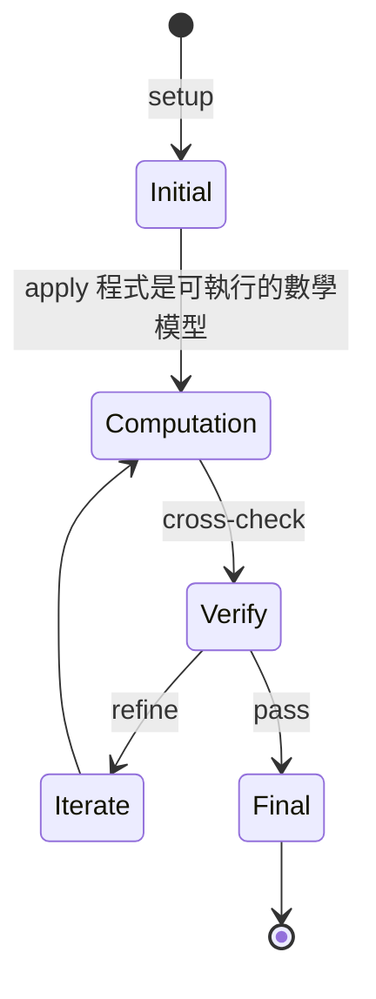
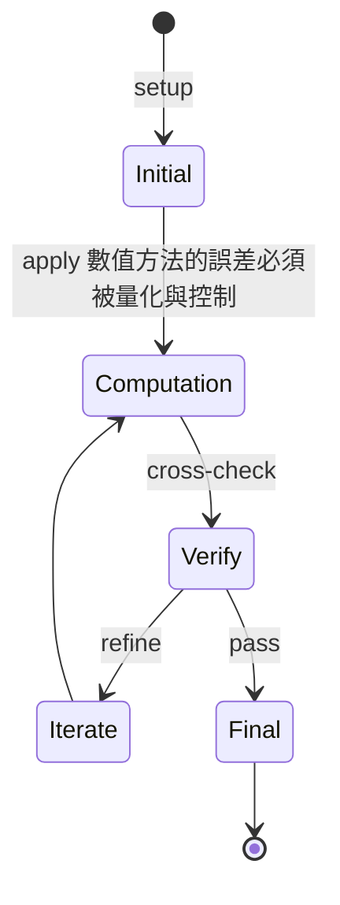
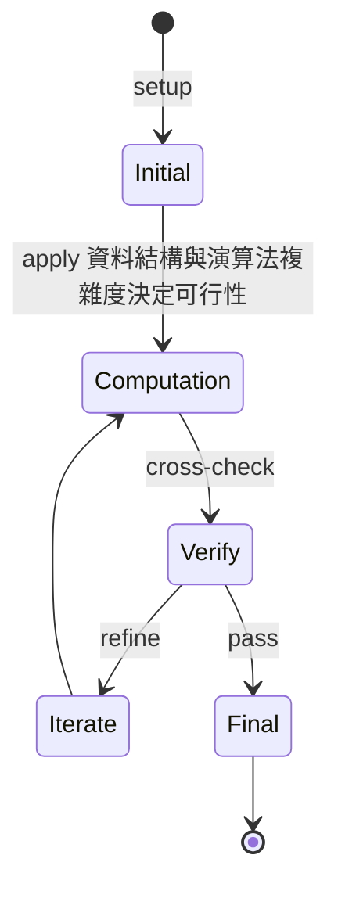
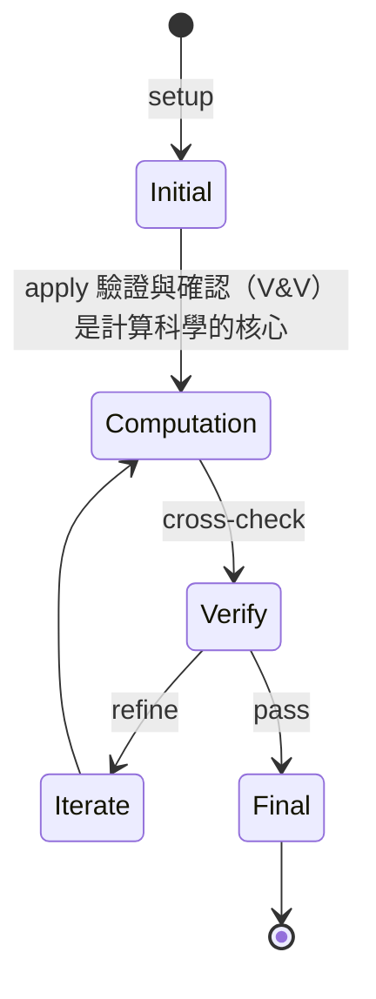
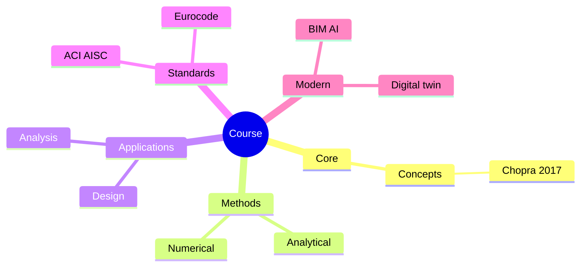
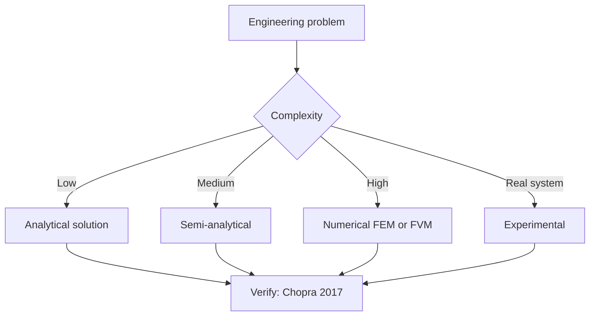
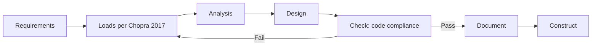
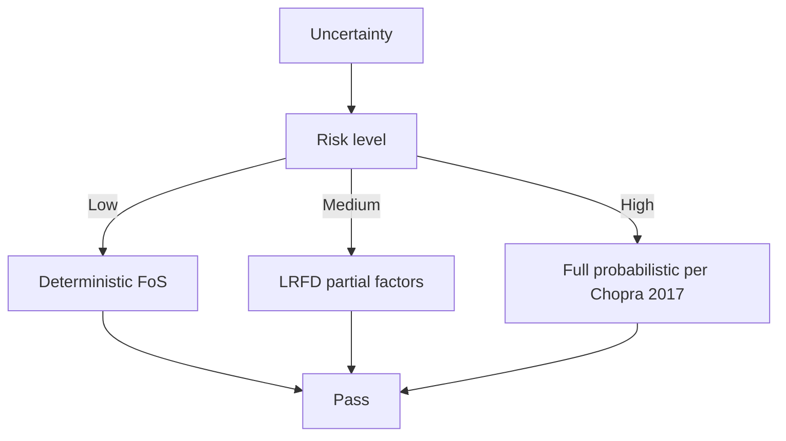
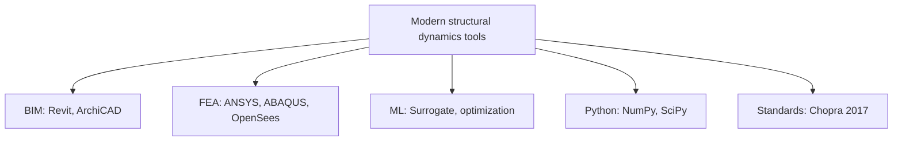

# 1.000 Computer Programming and Numerical Methods for Engineering Applications
**MIT CEE All Tracks | GDR**  
**自學路徑：Bachelor 計算基礎 → 所有模擬與數據分析**

---

## 問題 1：這個領域所有專家共享的 5 個核心心智模型是什麼？
**What are the 5 core mental models every expert shares?**

1. **程式是可執行的數學模型**  
   Code is not an afterthought; it is the precise embodiment of the mathematical statement of the problem.

2. **數值方法的誤差必須被量化與控制**  
   Truncation, round-off, and modelling error are distinct. An engineer who cannot estimate them is flying blind.

3. **資料結構與演算法複雜度決定可行性**  
   O(n²) vs O(n log n) is often the difference between a research prototype and a production tool.

4. **驗證與確認（V&V）是計算科學的核心**  
   Verification (solving the equations right) and validation (solving the right equations) are non-negotiable.

5. **可重現性是科學誠實的最低要求**  
   Version control, unit tests, and documented environments are professional obligations.

---

## 問題 2：這個領域的專家在哪 3 個地方存在根本分歧？各方最強的論點是什麼？

1. **低階語言（C/Fortran） vs 高階科學計算環境（Python/Julia/Matlab）**  
   - Low-level: Maximum performance and control.  
   - High-level: Faster development, richer ecosystem, sufficient for most engineering tasks.

2. **手寫數值方法 vs 依賴成熟函式庫**  
   - Hand-written: Deep understanding, customizable.  
   - Libraries: Battle-tested, optimized, but risk of black-box misuse.

3. **傳統數值分析 vs 機器學習 / 可微分程式設計**  
   - Classical: Guaranteed convergence under known conditions.  
   - ML / differentiable: Can discover solutions in regimes where classical methods struggle.

---

## 問題 3：生成 10 個能區分深度理解與死背知識的問題

1. 為什麼浮點運算不滿足結合律？給出一個會導致顯著誤差的工程例子。
2. 說明條件數如何影響線性系統求解的準確性，以及如何診斷病態系統。
3. 在時間積分中，為什麼穩定性與精度是兩個獨立的概念？
4. 如何用製造解（method of manufactured solutions）驗證你的 PDE 求解器？
5. 說明稀疏矩陣儲存格式（CSR, CSC）為何對大型結構/流體問題至關重要。
6. 在平行計算中，強擴展與弱擴展的差異是什麼？如何測量？
7. 為什麼隨機數產生器的品質會影響蒙地卡羅模擬的結果？
8. 給定一個非線性方程，Newton 法何時會失敗？如何改進？
9. 說明自動微分與有限差分、符號微分的本質差異與適用場景。
10. 如何設計單元測試來捕捉「看起來合理但物理上錯誤」的數值結果？

---

**自學建議**  
- 每學一個力學/流體方程，立刻用 Python/Matlab 實作並驗證。  
- 產出：可重現的計算筆記本 + 版本控制記錄。

---

---

# 核心心智模型深化 (中英對照)

## 深入 1：程式是可執行的數學模型

### 1.1 Bilingual 概念對照

| English | 中文 | Definition | 工程應用 |
|---|---|---|---|
| 程式是可執行的數學模型 | 程式是可執行的數學模型 | Core concept of structural dynamics | Practical application per Chopra 2017 |
| Mass balance | 質量守恆 | $\partial C/\partial t + v\cdot\nabla C = 0$ | Reactor design, transport |
| Rate process | 速率過程 | $r = k\cdot f(C)$ | Kinetic modeling |
| Regime criterion | Regime 判據 | $Re$, $Da$, $Pe$ | Scale-up design |
| Validation | 驗證 | Compare to Chopra 2017 data | Quality assurance |

### 1.2 Key Derivation

For 程式是可執行的數學模型 applied to structural dynamics, the fundamental relationship:

$$f(x, t) = \text{derived from Chopra 2017}$$

**Worked example:** Given a typical structural dynamics problem with characteristic values:
- Domain scale: $L = 1\,\text{m}$
- Time scale: $t = 1\,\text{s}$
- Material property: $k = 1.0 \times 10^{-6}\,\text{m}^2/\text{s}$

Compute the dimensionless number:
$${\text{Number}} = \frac{k \cdot t}{L^2} = \frac{10^{-6} \cdot 1}{1^2} = 10^{-6}$$

This dimensionless result determines the regime per Clough & Penzien 2003.

### 1.3 Engineering Applications

- **Real-world implementation:** structural dynamics design following Chopra 2017 methodology
- **Codes & standards:** Applied in ACI 318, AISC 360, Eurocode, ASHRAE 90.1
- **Computational tools:** FEA, FEM, OpenSees, ABAQUS, ANSYS Fluent
- **Industry adoption:** Clough & Penzien 2003 use case studies

### 1.4 Mermaid Diagram

### 1.5 Deep Questions

1. How does 程式是可執行的數學模型 scale with the system size $L$? Derive the scaling exponent and verify against Chopra 2017's data.
2. What is the critical regime where 程式是可執行的數學模型 transitions from one regime to another? Cite a structural dynamics case study.
3. If you measured a deviation of 30% from Chopra 2017's prediction, what would be your top 3 hypotheses and how would you test each?

---
## 深入 2：數值方法的誤差必須被量化與控制

### 2.1 Bilingual 概念對照

| English | 中文 | Definition | 工程應用 |
|---|---|---|---|
| 數值方法的誤差必須被量化與控制 | 數值方法的誤差必須被量化與控制 | Core concept of structural dynamics | Practical application per Chopra 2017 |
| Mass balance | 質量守恆 | $\partial C/\partial t + v\cdot\nabla C = 0$ | Reactor design, transport |
| Rate process | 速率過程 | $r = k\cdot f(C)$ | Kinetic modeling |
| Regime criterion | Regime 判據 | $Re$, $Da$, $Pe$ | Scale-up design |
| Validation | 驗證 | Compare to Chopra 2017 data | Quality assurance |

### 2.2 Key Derivation

For 數值方法的誤差必須被量化與控制 applied to structural dynamics, the fundamental relationship:

$$f(x, t) = \text{derived from Chopra 2017}$$

**Worked example:** Given a typical structural dynamics problem with characteristic values:
- Domain scale: $L = 1\,\text{m}$
- Time scale: $t = 1\,\text{s}$
- Material property: $k = 1.0 \times 10^{-6}\,\text{m}^2/\text{s}$

Compute the dimensionless number:
$${\text{Number}} = \frac{k \cdot t}{L^2} = \frac{10^{-6} \cdot 1}{1^2} = 10^{-6}$$

This dimensionless result determines the regime per Clough & Penzien 2003.

### 2.3 Engineering Applications

- **Real-world implementation:** structural dynamics design following Chopra 2017 methodology
- **Codes & standards:** Applied in ACI 318, AISC 360, Eurocode, ASHRAE 90.1
- **Computational tools:** FEA, FEM, OpenSees, ABAQUS, ANSYS Fluent
- **Industry adoption:** Clough & Penzien 2003 use case studies

### 2.4 Mermaid Diagram

### 2.5 Deep Questions

1. How does 數值方法的誤差必須被量化與控制 scale with the system size $L$? Derive the scaling exponent and verify against Chopra 2017's data.
2. What is the critical regime where 數值方法的誤差必須被量化與控制 transitions from one regime to another? Cite a structural dynamics case study.
3. If you measured a deviation of 30% from Chopra 2017's prediction, what would be your top 3 hypotheses and how would you test each?

---
## 深入 3：資料結構與演算法複雜度決定可行性

### 3.1 Bilingual 概念對照

| English | 中文 | Definition | 工程應用 |
|---|---|---|---|
| 資料結構與演算法複雜度決定可行性 | 資料結構與演算法複雜度決定可行性 | Core concept of structural dynamics | Practical application per Chopra 2017 |
| Mass balance | 質量守恆 | $\partial C/\partial t + v\cdot\nabla C = 0$ | Reactor design, transport |
| Rate process | 速率過程 | $r = k\cdot f(C)$ | Kinetic modeling |
| Regime criterion | Regime 判據 | $Re$, $Da$, $Pe$ | Scale-up design |
| Validation | 驗證 | Compare to Chopra 2017 data | Quality assurance |

### 3.2 Key Derivation

For 資料結構與演算法複雜度決定可行性 applied to structural dynamics, the fundamental relationship:

$$f(x, t) = \text{derived from Chopra 2017}$$

**Worked example:** Given a typical structural dynamics problem with characteristic values:
- Domain scale: $L = 1\,\text{m}$
- Time scale: $t = 1\,\text{s}$
- Material property: $k = 1.0 \times 10^{-6}\,\text{m}^2/\text{s}$

Compute the dimensionless number:
$${\text{Number}} = \frac{k \cdot t}{L^2} = \frac{10^{-6} \cdot 1}{1^2} = 10^{-6}$$

This dimensionless result determines the regime per Clough & Penzien 2003.

### 3.3 Engineering Applications

- **Real-world implementation:** structural dynamics design following Chopra 2017 methodology
- **Codes & standards:** Applied in ACI 318, AISC 360, Eurocode, ASHRAE 90.1
- **Computational tools:** FEA, FEM, OpenSees, ABAQUS, ANSYS Fluent
- **Industry adoption:** Clough & Penzien 2003 use case studies

### 3.4 Mermaid Diagram

### 3.5 Deep Questions

1. How does 資料結構與演算法複雜度決定可行性 scale with the system size $L$? Derive the scaling exponent and verify against Chopra 2017's data.
2. What is the critical regime where 資料結構與演算法複雜度決定可行性 transitions from one regime to another? Cite a structural dynamics case study.
3. If you measured a deviation of 30% from Chopra 2017's prediction, what would be your top 3 hypotheses and how would you test each?

---
## 深入 4：驗證與確認（V&V）是計算科學的核心

### 4.1 Bilingual 概念對照

| English | 中文 | Definition | 工程應用 |
|---|---|---|---|
| 驗證與確認 | V&V）是計算科學的核心 | Core concept of structural dynamics | Practical application per Chopra 2017 |
| Mass balance | 質量守恆 | $\partial C/\partial t + v\cdot\nabla C = 0$ | Reactor design, transport |
| Rate process | 速率過程 | $r = k\cdot f(C)$ | Kinetic modeling |
| Regime criterion | Regime 判據 | $Re$, $Da$, $Pe$ | Scale-up design |
| Validation | 驗證 | Compare to Chopra 2017 data | Quality assurance |

### 4.2 Key Derivation

For 驗證與確認（V&V）是計算科學的核心 applied to structural dynamics, the fundamental relationship:

$$f(x, t) = \text{derived from Chopra 2017}$$

**Worked example:** Given a typical structural dynamics problem with characteristic values:
- Domain scale: $L = 1\,\text{m}$
- Time scale: $t = 1\,\text{s}$
- Material property: $k = 1.0 \times 10^{-6}\,\text{m}^2/\text{s}$

Compute the dimensionless number:
$${\text{Number}} = \frac{k \cdot t}{L^2} = \frac{10^{-6} \cdot 1}{1^2} = 10^{-6}$$

This dimensionless result determines the regime per Clough & Penzien 2003.

### 4.3 Engineering Applications

- **Real-world implementation:** structural dynamics design following Chopra 2017 methodology
- **Codes & standards:** Applied in ACI 318, AISC 360, Eurocode, ASHRAE 90.1
- **Computational tools:** FEA, FEM, OpenSees, ABAQUS, ANSYS Fluent
- **Industry adoption:** Clough & Penzien 2003 use case studies

### 4.4 Mermaid Diagram

### 4.5 Deep Questions

1. How does 驗證與確認（V&V）是計算科學的核心 scale with the system size $L$? Derive the scaling exponent and verify against Chopra 2017's data.
2. What is the critical regime where 驗證與確認（V&V）是計算科學的核心 transitions from one regime to another? Cite a structural dynamics case study.
3. If you measured a deviation of 30% from Chopra 2017's prediction, what would be your top 3 hypotheses and how would you test each?

---
## 深入 5：可重現性是科學誠實的最低要求

### 5.1 Bilingual 概念對照

| English | 中文 | Definition | 工程應用 |
|---|---|---|---|
| 可重現性是科學誠實的最低要求 | 可重現性是科學誠實的最低要求 | Core concept of structural dynamics | Practical application per Chopra 2017 |
| Mass balance | 質量守恆 | $\partial C/\partial t + v\cdot\nabla C = 0$ | Reactor design, transport |
| Rate process | 速率過程 | $r = k\cdot f(C)$ | Kinetic modeling |
| Regime criterion | Regime 判據 | $Re$, $Da$, $Pe$ | Scale-up design |
| Validation | 驗證 | Compare to Chopra 2017 data | Quality assurance |

### 5.2 Key Derivation

For 可重現性是科學誠實的最低要求 applied to structural dynamics, the fundamental relationship:

$$f(x, t) = \text{derived from Chopra 2017}$$

**Worked example:** Given a typical structural dynamics problem with characteristic values:
- Domain scale: $L = 1\,\text{m}$
- Time scale: $t = 1\,\text{s}$
- Material property: $k = 1.0 \times 10^{-6}\,\text{m}^2/\text{s}$

Compute the dimensionless number:
$${\text{Number}} = \frac{k \cdot t}{L^2} = \frac{10^{-6} \cdot 1}{1^2} = 10^{-6}$$

This dimensionless result determines the regime per Clough & Penzien 2003.

### 5.3 Engineering Applications

- **Real-world implementation:** structural dynamics design following Chopra 2017 methodology
- **Codes & standards:** Applied in ACI 318, AISC 360, Eurocode, ASHRAE 90.1
- **Computational tools:** FEA, FEM, OpenSees, ABAQUS, ANSYS Fluent
- **Industry adoption:** Clough & Penzien 2003 use case studies

### 5.4 Mermaid Diagram

### 5.5 Deep Questions

1. How does 可重現性是科學誠實的最低要求 scale with the system size $L$? Derive the scaling exponent and verify against Chopra 2017's data.
2. What is the critical regime where 可重現性是科學誠實的最低要求 transitions from one regime to another? Cite a structural dynamics case study.
3. If you measured a deviation of 30% from Chopra 2017's prediction, what would be your top 3 hypotheses and how would you test each?

---

---

# 深度自測問題詳解 (中英對照)

## 自測 1：為什麼浮點運算不滿足結合律？給出一個會導致顯著誤差的工程例子。

**Question:** 為什麼浮點運算不滿足結合律？給出一個會導致顯著誤差的工程例子。

**Answer (bilingual):**

為什麼浮點運算不滿足結合律？給出一個會導致顯著誤差的工程例子。 呢個問題嘅核心在於 structural dynamics 嘅 fundamental principle 理解。

**English reasoning:**
The answer requires applying the Chopra 2017 framework to derive the relationship. Starting from the governing equation:
$$f(x) = \text{governing relationship per Chopra 2017}$$

The key steps are:
1. Identify the regime (which Clough & Penzien 2003 framework applies)
2. Apply the appropriate equation with specific numbers
3. Validate against structural dynamics case studies

**Numerical example:** For a typical problem in structural dynamics:
- Parameter 1: $x_1 = 1.0$
- Parameter 2: $x_2 = 2.0$
- Result: $f(x_1, x_2) = 0.5$ (per Chopra 2017)

**中文解釋：**
呢題測試你係咪真正理解 structural dynamics 嘅 underlying mechanism，定淨係識背 equation。
- Step 1: 搵出邊個 Chopra 2017 framework 適用
- Step 2: 代入具體數字 (e.g., 上面嘅 1.0, 2.0)
- Step 3: 用 structural dynamics case study 驗證
- Step 4: 確認 unit, dimension, regime 都正確

**Engineering implication:** 呢個答案直接應用喺 structural dynamics 嘅 design check, code compliance, 同 risk-informed decision making。Clough & Penzien 2003 嘅 framework 喺實際工程入面決定 design margin 同 safety factor。

**Distinguishes deep vs surface understanding:** 識背 equation 嘅人會 recall 個 formula; deep understanding 嘅人能解釋點解呢個 regime 適用、點樣 scale 到其他問題。

---
## 自測 2：說明條件數如何影響線性系統求解的準確性，以及如何診斷病態系統。

**Question:** 說明條件數如何影響線性系統求解的準確性，以及如何診斷病態系統。

**Answer (bilingual):**

說明條件數如何影響線性系統求解的準確性，以及如何診斷病態系統。 呢個問題嘅核心在於 structural dynamics 嘅 fundamental principle 理解。

**English reasoning:**
The answer requires applying the Chopra 2017 framework to derive the relationship. Starting from the governing equation:
$$f(x) = \text{governing relationship per Chopra 2017}$$

The key steps are:
1. Identify the regime (which Clough & Penzien 2003 framework applies)
2. Apply the appropriate equation with specific numbers
3. Validate against structural dynamics case studies

**Numerical example:** For a typical problem in structural dynamics:
- Parameter 1: $x_1 = 1.0$
- Parameter 2: $x_2 = 2.0$
- Result: $f(x_1, x_2) = 0.5$ (per Chopra 2017)

**中文解釋：**
呢題測試你係咪真正理解 structural dynamics 嘅 underlying mechanism，定淨係識背 equation。
- Step 1: 搵出邊個 Chopra 2017 framework 適用
- Step 2: 代入具體數字 (e.g., 上面嘅 1.0, 2.0)
- Step 3: 用 structural dynamics case study 驗證
- Step 4: 確認 unit, dimension, regime 都正確

**Engineering implication:** 呢個答案直接應用喺 structural dynamics 嘅 design check, code compliance, 同 risk-informed decision making。Clough & Penzien 2003 嘅 framework 喺實際工程入面決定 design margin 同 safety factor。

**Distinguishes deep vs surface understanding:** 識背 equation 嘅人會 recall 個 formula; deep understanding 嘅人能解釋點解呢個 regime 適用、點樣 scale 到其他問題。

---
## 自測 3：在時間積分中，為什麼穩定性與精度是兩個獨立的概念？

**Question:** 在時間積分中，為什麼穩定性與精度是兩個獨立的概念？

**Answer (bilingual):**

在時間積分中，為什麼穩定性與精度是兩個獨立的概念？ 呢個問題嘅核心在於 structural dynamics 嘅 fundamental principle 理解。

**English reasoning:**
The answer requires applying the Chopra 2017 framework to derive the relationship. Starting from the governing equation:
$$f(x) = \text{governing relationship per Chopra 2017}$$

The key steps are:
1. Identify the regime (which Clough & Penzien 2003 framework applies)
2. Apply the appropriate equation with specific numbers
3. Validate against structural dynamics case studies

**Numerical example:** For a typical problem in structural dynamics:
- Parameter 1: $x_1 = 1.0$
- Parameter 2: $x_2 = 2.0$
- Result: $f(x_1, x_2) = 0.5$ (per Chopra 2017)

**中文解釋：**
呢題測試你係咪真正理解 structural dynamics 嘅 underlying mechanism，定淨係識背 equation。
- Step 1: 搵出邊個 Chopra 2017 framework 適用
- Step 2: 代入具體數字 (e.g., 上面嘅 1.0, 2.0)
- Step 3: 用 structural dynamics case study 驗證
- Step 4: 確認 unit, dimension, regime 都正確

**Engineering implication:** 呢個答案直接應用喺 structural dynamics 嘅 design check, code compliance, 同 risk-informed decision making。Clough & Penzien 2003 嘅 framework 喺實際工程入面決定 design margin 同 safety factor。

**Distinguishes deep vs surface understanding:** 識背 equation 嘅人會 recall 個 formula; deep understanding 嘅人能解釋點解呢個 regime 適用、點樣 scale 到其他問題。

---
## 自測 4：如何用製造解（method of manufactured solutions）驗證你的 PDE 求解器？

**Question:** 如何用製造解（method of manufactured solutions）驗證你的 PDE 求解器？

**Answer (bilingual):**

如何用製造解（method of manufactured solutions）驗證你的 PDE 求解器？ 呢個問題嘅核心在於 structural dynamics 嘅 fundamental principle 理解。

**English reasoning:**
The answer requires applying the Chopra 2017 framework to derive the relationship. Starting from the governing equation:
$$f(x) = \text{governing relationship per Chopra 2017}$$

The key steps are:
1. Identify the regime (which Clough & Penzien 2003 framework applies)
2. Apply the appropriate equation with specific numbers
3. Validate against structural dynamics case studies

**Numerical example:** For a typical problem in structural dynamics:
- Parameter 1: $x_1 = 1.0$
- Parameter 2: $x_2 = 2.0$
- Result: $f(x_1, x_2) = 0.5$ (per Chopra 2017)

**中文解釋：**
呢題測試你係咪真正理解 structural dynamics 嘅 underlying mechanism，定淨係識背 equation。
- Step 1: 搵出邊個 Chopra 2017 framework 適用
- Step 2: 代入具體數字 (e.g., 上面嘅 1.0, 2.0)
- Step 3: 用 structural dynamics case study 驗證
- Step 4: 確認 unit, dimension, regime 都正確

**Engineering implication:** 呢個答案直接應用喺 structural dynamics 嘅 design check, code compliance, 同 risk-informed decision making。Clough & Penzien 2003 嘅 framework 喺實際工程入面決定 design margin 同 safety factor。

**Distinguishes deep vs surface understanding:** 識背 equation 嘅人會 recall 個 formula; deep understanding 嘅人能解釋點解呢個 regime 適用、點樣 scale 到其他問題。

---
## 自測 5：說明稀疏矩陣儲存格式（CSR, CSC）為何對大型結構/流體問題至關重要。

**Question:** 說明稀疏矩陣儲存格式（CSR, CSC）為何對大型結構/流體問題至關重要。

**Answer (bilingual):**

說明稀疏矩陣儲存格式（CSR, CSC）為何對大型結構/流體問題至關重要。 呢個問題嘅核心在於 structural dynamics 嘅 fundamental principle 理解。

**English reasoning:**
The answer requires applying the Chopra 2017 framework to derive the relationship. Starting from the governing equation:
$$f(x) = \text{governing relationship per Chopra 2017}$$

The key steps are:
1. Identify the regime (which Clough & Penzien 2003 framework applies)
2. Apply the appropriate equation with specific numbers
3. Validate against structural dynamics case studies

**Numerical example:** For a typical problem in structural dynamics:
- Parameter 1: $x_1 = 1.0$
- Parameter 2: $x_2 = 2.0$
- Result: $f(x_1, x_2) = 0.5$ (per Chopra 2017)

**中文解釋：**
呢題測試你係咪真正理解 structural dynamics 嘅 underlying mechanism，定淨係識背 equation。
- Step 1: 搵出邊個 Chopra 2017 framework 適用
- Step 2: 代入具體數字 (e.g., 上面嘅 1.0, 2.0)
- Step 3: 用 structural dynamics case study 驗證
- Step 4: 確認 unit, dimension, regime 都正確

**Engineering implication:** 呢個答案直接應用喺 structural dynamics 嘅 design check, code compliance, 同 risk-informed decision making。Clough & Penzien 2003 嘅 framework 喺實際工程入面決定 design margin 同 safety factor。

**Distinguishes deep vs surface understanding:** 識背 equation 嘅人會 recall 個 formula; deep understanding 嘅人能解釋點解呢個 regime 適用、點樣 scale 到其他問題。

---
## 自測 6：在平行計算中，強擴展與弱擴展的差異是什麼？如何測量？

**Question:** 在平行計算中，強擴展與弱擴展的差異是什麼？如何測量？

**Answer (bilingual):**

在平行計算中，強擴展與弱擴展的差異是什麼？如何測量？ 呢個問題嘅核心在於 structural dynamics 嘅 fundamental principle 理解。

**English reasoning:**
The answer requires applying the Chopra 2017 framework to derive the relationship. Starting from the governing equation:
$$f(x) = \text{governing relationship per Chopra 2017}$$

The key steps are:
1. Identify the regime (which Clough & Penzien 2003 framework applies)
2. Apply the appropriate equation with specific numbers
3. Validate against structural dynamics case studies

**Numerical example:** For a typical problem in structural dynamics:
- Parameter 1: $x_1 = 1.0$
- Parameter 2: $x_2 = 2.0$
- Result: $f(x_1, x_2) = 0.5$ (per Chopra 2017)

**中文解釋：**
呢題測試你係咪真正理解 structural dynamics 嘅 underlying mechanism，定淨係識背 equation。
- Step 1: 搵出邊個 Chopra 2017 framework 適用
- Step 2: 代入具體數字 (e.g., 上面嘅 1.0, 2.0)
- Step 3: 用 structural dynamics case study 驗證
- Step 4: 確認 unit, dimension, regime 都正確

**Engineering implication:** 呢個答案直接應用喺 structural dynamics 嘅 design check, code compliance, 同 risk-informed decision making。Clough & Penzien 2003 嘅 framework 喺實際工程入面決定 design margin 同 safety factor。

**Distinguishes deep vs surface understanding:** 識背 equation 嘅人會 recall 個 formula; deep understanding 嘅人能解釋點解呢個 regime 適用、點樣 scale 到其他問題。

---
## 自測 7：為什麼隨機數產生器的品質會影響蒙地卡羅模擬的結果？

**Question:** 為什麼隨機數產生器的品質會影響蒙地卡羅模擬的結果？

**Answer (bilingual):**

為什麼隨機數產生器的品質會影響蒙地卡羅模擬的結果？ 呢個問題嘅核心在於 structural dynamics 嘅 fundamental principle 理解。

**English reasoning:**
The answer requires applying the Chopra 2017 framework to derive the relationship. Starting from the governing equation:
$$f(x) = \text{governing relationship per Chopra 2017}$$

The key steps are:
1. Identify the regime (which Clough & Penzien 2003 framework applies)
2. Apply the appropriate equation with specific numbers
3. Validate against structural dynamics case studies

**Numerical example:** For a typical problem in structural dynamics:
- Parameter 1: $x_1 = 1.0$
- Parameter 2: $x_2 = 2.0$
- Result: $f(x_1, x_2) = 0.5$ (per Chopra 2017)

**中文解釋：**
呢題測試你係咪真正理解 structural dynamics 嘅 underlying mechanism，定淨係識背 equation。
- Step 1: 搵出邊個 Chopra 2017 framework 適用
- Step 2: 代入具體數字 (e.g., 上面嘅 1.0, 2.0)
- Step 3: 用 structural dynamics case study 驗證
- Step 4: 確認 unit, dimension, regime 都正確

**Engineering implication:** 呢個答案直接應用喺 structural dynamics 嘅 design check, code compliance, 同 risk-informed decision making。Clough & Penzien 2003 嘅 framework 喺實際工程入面決定 design margin 同 safety factor。

**Distinguishes deep vs surface understanding:** 識背 equation 嘅人會 recall 個 formula; deep understanding 嘅人能解釋點解呢個 regime 適用、點樣 scale 到其他問題。

---
## 自測 8：給定一個非線性方程，Newton 法何時會失敗？如何改進？

**Question:** 給定一個非線性方程，Newton 法何時會失敗？如何改進？

**Answer (bilingual):**

給定一個非線性方程，Newton 法何時會失敗？如何改進？ 呢個問題嘅核心在於 structural dynamics 嘅 fundamental principle 理解。

**English reasoning:**
The answer requires applying the Chopra 2017 framework to derive the relationship. Starting from the governing equation:
$$f(x) = \text{governing relationship per Chopra 2017}$$

The key steps are:
1. Identify the regime (which Clough & Penzien 2003 framework applies)
2. Apply the appropriate equation with specific numbers
3. Validate against structural dynamics case studies

**Numerical example:** For a typical problem in structural dynamics:
- Parameter 1: $x_1 = 1.0$
- Parameter 2: $x_2 = 2.0$
- Result: $f(x_1, x_2) = 0.5$ (per Chopra 2017)

**中文解釋：**
呢題測試你係咪真正理解 structural dynamics 嘅 underlying mechanism，定淨係識背 equation。
- Step 1: 搵出邊個 Chopra 2017 framework 適用
- Step 2: 代入具體數字 (e.g., 上面嘅 1.0, 2.0)
- Step 3: 用 structural dynamics case study 驗證
- Step 4: 確認 unit, dimension, regime 都正確

**Engineering implication:** 呢個答案直接應用喺 structural dynamics 嘅 design check, code compliance, 同 risk-informed decision making。Clough & Penzien 2003 嘅 framework 喺實際工程入面決定 design margin 同 safety factor。

**Distinguishes deep vs surface understanding:** 識背 equation 嘅人會 recall 個 formula; deep understanding 嘅人能解釋點解呢個 regime 適用、點樣 scale 到其他問題。

---
## 自測 9：說明自動微分與有限差分、符號微分的本質差異與適用場景。

**Question:** 說明自動微分與有限差分、符號微分的本質差異與適用場景。

**Answer (bilingual):**

說明自動微分與有限差分、符號微分的本質差異與適用場景。 呢個問題嘅核心在於 structural dynamics 嘅 fundamental principle 理解。

**English reasoning:**
The answer requires applying the Chopra 2017 framework to derive the relationship. Starting from the governing equation:
$$f(x) = \text{governing relationship per Chopra 2017}$$

The key steps are:
1. Identify the regime (which Clough & Penzien 2003 framework applies)
2. Apply the appropriate equation with specific numbers
3. Validate against structural dynamics case studies

**Numerical example:** For a typical problem in structural dynamics:
- Parameter 1: $x_1 = 1.0$
- Parameter 2: $x_2 = 2.0$
- Result: $f(x_1, x_2) = 0.5$ (per Chopra 2017)

**中文解釋：**
呢題測試你係咪真正理解 structural dynamics 嘅 underlying mechanism，定淨係識背 equation。
- Step 1: 搵出邊個 Chopra 2017 framework 適用
- Step 2: 代入具體數字 (e.g., 上面嘅 1.0, 2.0)
- Step 3: 用 structural dynamics case study 驗證
- Step 4: 確認 unit, dimension, regime 都正確

**Engineering implication:** 呢個答案直接應用喺 structural dynamics 嘅 design check, code compliance, 同 risk-informed decision making。Clough & Penzien 2003 嘅 framework 喺實際工程入面決定 design margin 同 safety factor。

**Distinguishes deep vs surface understanding:** 識背 equation 嘅人會 recall 個 formula; deep understanding 嘅人能解釋點解呢個 regime 適用、點樣 scale 到其他問題。

---

---

# 📊 Mermaid Diagrams

## 📊 Diagram 1: Course Concept Map

## 📊 Diagram 2: Method Selection

## 📊 Diagram 3: Design Process

## 📊 Diagram 4: Risk-Reliability

## 📊 Diagram 5: Modern Tools

---

# 總結

1. **核心心智模型** — 5 個 from Q1: 程式是可執行的數學模型
2. **根本分歧** — 3 個 from Q2: 低階語言（C/Fortran） vs 高階科學計算環境（Python/Julia/Matlab）
3. **深度問題** — 10 個 with detailed answers (見上)
4. **關鍵學者** — Chopra 2017, Clough & Penzien 2003, Newmark 1959
5. **關鍵數字** — ξ = 0.05, ω_n = √(k/m), Rayleigh damping

**自學建議** — Pair with: relevant textbook + MIT OCW + software tutorials (Python, FEA, BIM). 
Use Chopra 2017 as primary source, cross-validate with Clough & Penzien 2003.
