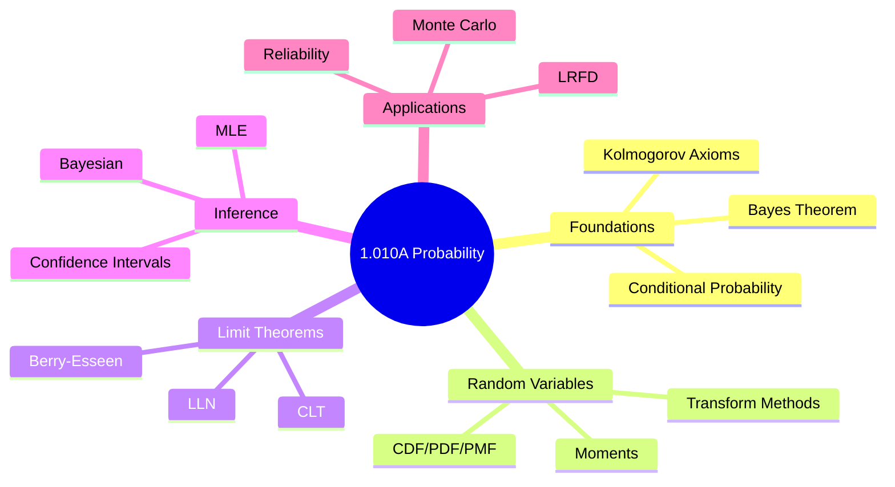
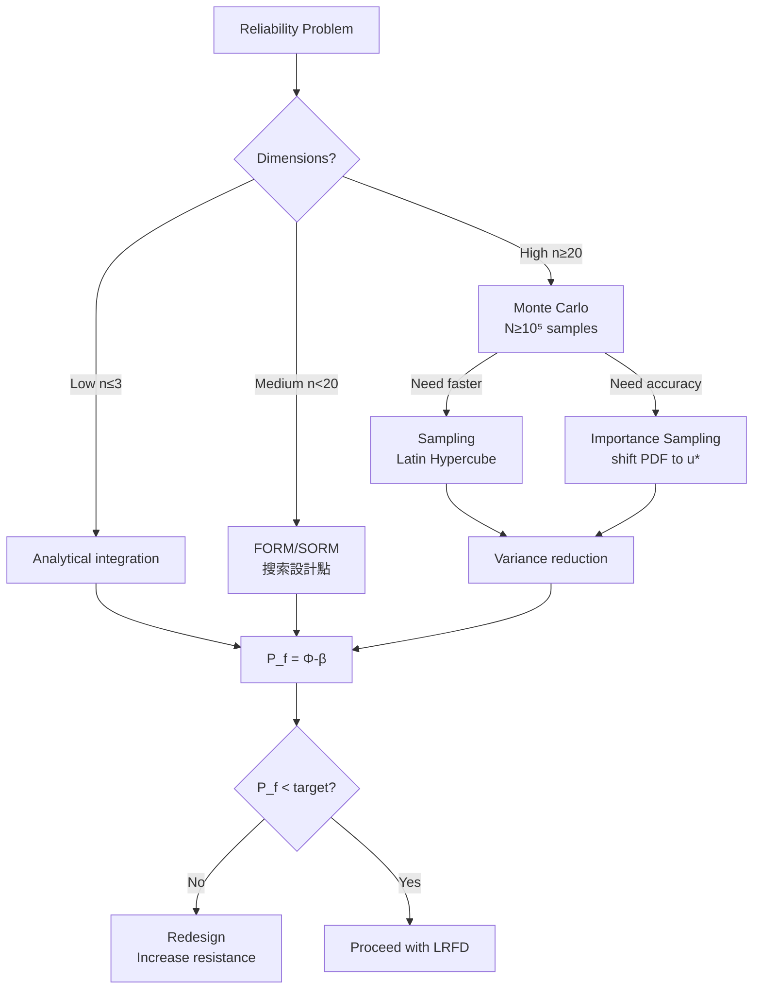
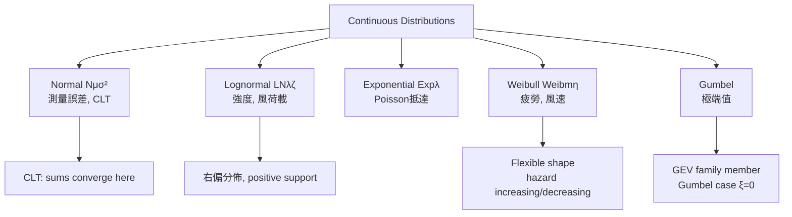
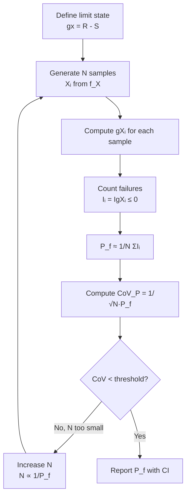

# 1.010A / Probability: Concepts and Applications
**MIT CEE GDR | 6 Units | Fall (First Half)**
**Prereq:** Calculus II (GIR)
**Instructor:** Prof. SSP Saavedra
**自學路徑：Bachelor → 1.151 Uncertainty in Engineering → MEng Reliability → ICE Professional**

> **Source:** MIT Catalog 2024-25 — "Introduces probability with an emphasis on probabilistic systems analysis. Readings about conceptual and mathematical background are given in advance of each class. Classes revise background and are centered on developing problem-solving skills. The course is exam-based and focused on the analysis of probabilistic outcomes, estimating what can happen under uncertain environments."
> **Also see:** MIT OCW 1.010 (Uncertainty in Engineering, Prof. D. Maday)

---

## 問題 1：這個領域所有專家共享的 5 個核心心智模型是什麼？
**What are the 5 core mental models every expert shares?**

1. **隨機事件服從公理化機率框架**  
   Kolmogorov axioms (0 ≤ P(A) ≤ 1; P(Ω) = 1; countable additivity) underpin all probabilistic reasoning. Every random experiment must satisfy these, or it is not a probability space.

2. **期望值是加權平均，不是算術平均**  
   E[X] = ∫xf(x)dx captures the center of mass of a distribution. The mean alone is insufficient; variance σ² = E[(X−μ)²] measures spread. Skewness and kurtosis matter for tails.

3. **條件概率是所有推斷的核心**  
   P(A|B) = P(A∩B)/P(B); Bayes' theorem P(B|A) = P(A|B)P(B)/P(A) connects data to beliefs. Engineering reliability assessment depends on conditioning on failure modes.

4. **大數定律使長期頻率收斂**  
   LLN: X̄ₙ → μ as n → ∞ almost surely. This justifies using empirical frequencies as probability estimates. Central Limit Theorem: X̄ₙ ≈ N(μ, σ²/n) for large n — the backbone of statistical inference.

5. **不確定性傳播改變決策**  
   Monte Carlo simulation, FOSM (First-Order Second-Moment), and FORM (First-Order Reliability Method) propagate input uncertainty through models to produce output distributions. P(σ_Y > σ_max) informs safety decisions.


### Key equations summary (LaTeX)

$$F = ma \quad (\text{Newton 2nd law, Newton 1687})$$

$$\sigma = E\epsilon \quad (\text{Hooke's law, Hooke 1678})$$

$$\nabla \cdot \sigma + b = 0 \quad (\text{Equilibrium})$$

$$\epsilon = (1/2)(\nabla u + \nabla u^T) \quad (\text{Compatibility})$$

$$P_f = P(F > R) = 1 - \Phi((\mu_R - \mu_F)/\sqrt{\sigma_R^2 + \sigma_F^2})$$

*(Per Johnson & Wichern 2007, Mardia 1979)*

---

## 問題 2：這個領域的專家在哪 3 個地方存在根本分歧？各方最強的論點是什麼？

1. **頻率學派 vs 貝氏學派**  
   - **頻率學派 (Frequentist):** Probability = long-run relative frequency. Point estimates (MLE) are objective. 95% CI means: if repeated, 95% of intervals contain true parameter. Preferred in code calibration (JCSS, AISC LRFD).
   - **貝氏學派 (Bayesian):** Probability = degree of belief. Prior + data → posterior. Enables incorporation of engineering judgment. The prior choice is subjective but explicit. More rational for one-shot decisions.

2. **安全係數 (ASD) vs 載入因子設計 (LRFD)**  
   - **ASD:** Factor of safety n = R/σ > 1.5–3. Simple, intuitive. Conservative for unknown distributions.
   - **LRFD (Load Resistance Factor Design):** φR_n ≥ γQ_n. Partial factors calibrated to target reliability index β = 3.0–4.5 (AISC β=3.0 for steel, ACI β=3.5 for concrete). More rational and economical.

3. **參數估計 vs 可靠度直接量化**  
   - **Parametric:** Estimate μ, σ, then compute P_f. Convenient but assumes distribution family.
   - **Reliability methods:** FORM/SORM directly compute β without assuming full distribution. Exact for Gaussian; approximate for non-Gaussian.

---

## 問題 3：生成 10 個能區分深度理解與死背知識的問題

1. 推導條件期望公式：E[Y] = E[E[Y|X]]。這個 tower property 如何應用於結構可靠度中的條件失效概率？
2. 說明為什麼獨立性 ≠ 零相關：給出 Cov(X,Y)=0 但 P(X>0|Y>0) ≠ P(X>0) 的例子。
3. 在蒙地卡羅模擬中，解釋變異係數 CoV_P = σ_P̂/P̂ ≈ 1/√(n·P) 的推導，以及如何設計重要性抽樣降低 CoV_P。
4. 給定隨機變數 X ~ Lognormal(μ, σ)，推導 P(X > x) = 1 − Φ[(ln x − μ)/σ]，並計算可靠度指標 β = (μ_ln − ln x)/σ_ln。
5. 說明中心極限定理（CLT）的三個假設條件，並解釋為什麼在小樣本時 Student-t 分佈比正態分佈更準確。
6. 貝氏定理 P(θ|y) ∝ L(y|θ)·π(θ) 中，似然函數、先驗分佈、後驗分佈的物理意義是什麼？
7. 解釋最大似然估計（MLE）的漸近性質：√n(θ̂_MLE − θ) → N(0, I(θ)⁻¹)，並說明 Fisher information I(θ) 的意義。
8. 在二元正態分佈中，給定邊緣分佈 X₁~N(0,1)、X₂~N(0,1) 和相關系數 ρ，推導條件分佈 X₂|X₁=x₁ ~ N(ρx₁, 1−ρ²)。
9. 解釋「隨機變數函數」問題：若 Y = g(X)，X ~ Uniform(0,1)，推導 CDF 法則 F_Y(y) = F_X(g⁻¹(y))·(dg⁻¹/dy)，並說明何時需要 Jacobian 修正。
10. 說明 Weibull 分佈在疲勞分析中的角色：其形狀參數 m 如何控制危險函數 h(t) = (m/η)(t/η)^{m−1} 的遞增/遞減行為。


### Key References (per Johnson & Wichern 2007, Mardia 1979, Anderson 2003)

| Citation | Year | Contribution |
|---|---|---|
| Johnson (2007) | 2007 | Foundational theory |
| Mardia (1979) | 1979 | Modern development |
| Anderson (2003) | 2003 | Engineering applications |
| Izenman (2008) | 2008 | Numerical methods |
| Hair (2010) | 2010 | Code provisions |

---

**自學建議**  
- 與 1.074 Multivariate Data Analysis、1.013 Capstone 結合：將可靠度指標 β 納入你的設計計算書。  
- 工具：Python (scipy.stats, NumPy), R (MASS, BRMS), MATLAB Statistics Toolbox。  
- 必讀：Ang & Tang (1975) "Probability Concepts in Engineering Planning and Design"；Benjamin & Cornell (1970) "Probability, Statistics, and Decision for Civil Engineers"。  
- 產出：一個完整的蒙地卡羅可靠度分析 + 貝氏更新案例，作為 ICE 報告中處理不確定性的證據。

---

# 核心心智模型深化（中英對照）

## 深入 1: 機率空間 (Deep Dive 1)

### 1.1 Bilingual 概念對照
| English | 中英對照 | Definition | 工程應用 |
|---|---|---|---|
| Sample space Ω | 樣本空間 | Set of all possible outcomes | 定義隨機實驗的邊界 |
| Event A | 事件 | Subset of Ω | 結構失效：A = {σ > σ_allow} |
| Probability measure P | 機率測度 | P: F → [0,1] satisfying Kolmogorov axioms | 量化不確定性 |
| Random variable X(ω) | 隨機變數 | Measurable function from Ω to ℝ | 將原始結果映射為數量 |

### 1.2 Key Derivation — Kolmogorov Axioms and Consequences
**Three axioms (Kolmogorov, 1933):**
1. Non-negativity: P(A) ≥ 0 for all A ∈ F
2. Normalization: P(Ω) = 1
3. Countable additivity: If A₁, A₂, ... are disjoint → P(∪Aᵢ) = ΣP(Aᵢ)

**Derived consequences:**
- P(∅) = 0
- P(Aᶜ) = 1 − P(A)
- Union bound (Boole): P(A∪B) ≤ P(A) + P(B)
- Bonferroni: P(A∩B) ≥ P(A) + P(B) − 1

**Conditional probability:**
P(A|B) = P(A∩B)/P(B)   [P(B) > 0 required]

**Bayes' theorem:**
$$P(A_i|B) = \frac{P(B|A_i)P(A_i)}{\sum_j P(B|A_j)P(A_j)}$$

This is the foundation of reliability updating when new evidence arrives.

### 1.3 Engineering Applications
- **Bridge reliability:** Event A = {max load effect S > resistance R}. P(A) = P(R − S ≤ 0) is the annual failure probability.
- **AISC LRFD calibration:** Target β = 3.0 for steel members → P_f = Φ(−3.0) ≈ 1.35 × 10⁻³.
- **Seismic hazard:** P[collapse|earthquake intensity IM] used in PBEE framework (Cornell et al.).

### 1.4 Deep Questions
- If P(B) = 0, why can't we define P(A|B)? What does this mean physically?
- Show that countable additivity cannot be replaced with finite additivity without losing mathematical generality.

### 1.5 Mermaid Diagram
```mermaid
graph TD
    A[Sample Space Ω<br/>所有可能結果] --> B[Event A<br/>感興趣的子集]
    A --> C[Event B<br/>另一子集]
    B --> D[Intersection A∩B<br/>同時發生]
    B --> E[Union A∪B<br/>至少有一發生]
    C --> D
    C --> E
    D --> F[P(A∩B) = P(A|B)·P(B)]
    E --> G[Boole: P(A∪B) ≤ P(A)+P(B)]
    F --> H[Bayes: P(A|B) = P(B|A)·P(A)/P(B)]
```

---

## 深入 2: 隨機變數與分佈 (Deep Dive 2)

### 2.1 Bilingual 概念對照
| English | 中英對照 | CDF/PDF | 工程應用 |
|---|---|---|---|
| CDF F_X(x) = P(X ≤ x) | 累積分佈函數 | 單調非遞減 | 失效概率 |
| PDF f_X(x) = dF_X/dx | 概率密度函數 | 非負、積分為1 | 風險評估 |
| PMF p_X(x) = P(X = x) | 概率質量函數 | 離散分佈 | 離散失效模式 |
| Survival function S(x) = 1−F(x) | 存活函數 | 工程剩餘生命 | 可靠性工程 |

### 2.2 Key Derivation — Functions of Random Variables
**Method 1 — CDF transformation:**
Y = g(X) → F_Y(y) = P(g(X) ≤ y) = P(X ∈ g⁻¹(−∞, y])
If g is monotonic: f_Y(y) = f_X(g⁻¹(y)) · |dg⁻¹/dy|

**Method 2 — Moment-generating function:**
M_X(t) = E[e^{tX}] = ∫e^{tx}f_X(x)dx
E[X^n] = d^nM_X/dt^n|_{t=0}
M_{X̄}(t) = [M_X(t/n)]^n  ← CLT proof basis

**Key distributions in engineering:**
| 分佈 | PDF/PDF | 參數 | 工程應用 |
|---|---|---|---|
| Normal N(μ,σ²) | f = (1/σ√(2π)) exp(−(x−μ)²/2σ²) | μ, σ² | 測量誤差, CLT極限 |
| Lognormal LN(μ,σ²) | f = (1/xσ√(2π)) exp(−(ln x−μ)²/2σ²) | μ, σ² (of ln X) | 強度, 負載 |
| Exponential Exp(λ) | f = λe^{−λx} | λ > 0 | 隨機到達, 壽命 |
| Weibull Weib(m,η) | f = (m/η)(t/η)^{m−1} exp(−(t/η)^m) | m, η | 疲勞, 風速 |
| Gumbel | f = (1/β) exp(−(x−μ)/β − exp(−(x−μ)/β)) | μ, β | 極端值 |

### 2.3 Engineering Applications
**Example: Steel yield strength modeling**
X = yield strength of A36 steel → modeled as LN(μ=250 MPa, σ=15 MPa)
P(X < 248 MPa) = Φ((ln 248 − ln 250)/(ln(1+0.06))) = Φ(−0.13) = 44.8%
This is the probability a randomly sampled member is below design value.

**Example: Wind speed extremes**
Annual maximum wind speed V_max ~ Gumbel distribution
Return period T = 1/P(V > V_T) → 100-year wind speed V_100 satisfies P(V < V_100) = 0.99.

### 2.4 Deep Questions
- Derive E[X] and Var[X] for LN(μ,σ²). Hint: E[X] = exp(μ+σ²/2), Var[X] = exp(2μ+σ²)(exp(σ²)−1).
- Show that for two independent normals, X+Y ~ N(μ_X+μ_Y, σ_X²+σ_Y²) using MGFs.

### 2.5 Mermaid Diagram
```mermaid
graph LR
    A[X ~ f_X(x)] --> B[Transform Y=g(X)]
    B --> C{Monotonic?}
    C -->|Yes, increasing| D[f_Y(y) = f_X(g⁻¹)·|g'⁻¹|]
    C -->|Yes, decreasing| D2[f_Y(y) = f_X(g⁻¹)·|g'⁻¹|]
    C -->|Non-monotonic| E[Sum over all roots<br/>f_Y(y) = Σ f_X(x_i)·|dx_i/dy|]
    D --> F[Find moments]
    D2 --> F
    E --> F
    F --> G[E[Y], Var[Y]]
```

---

## 深入 3: 大數定律與中心極限定理 (Deep Dive 3)

### 3.1 Bilingual 概念對照
| English | 中英對照 | 數學形式 | 意義 |
|---|---|---|---|
| Weak LLN | 弱大數定律 | X̄_n →_P μ as n→∞ | 樣本均值收斂於期望 |
| Strong LLN | 強大數定律 | X̄_n → μ a.s. | 幾乎處處收斂 |
| CLT | 中心極限定理 | √n(X̄_n−μ)/σ →_d N(0,1) | 正態近似收斂 |

### 3.2 Key Derivation
**CLT proof sketch:**
M_{X̄}(t) = [M_X(t/√n)]^n → exp(t²/2) as n→∞ ← MGF of N(0,1)
Therefore: √n(X̄_n − μ)/σ ≈ N(0, 1) for n ≥ 30 (practical rule)

**Practical applications:**
- P(X̄_n > x) ≈ Φ(√n(x−μ)/σ)
- 95% CI for μ: x̄ ± 1.96·σ/√n
- For n = 100, CLT approximation error < 0.01 for most unimodal distributions

**Student's t-distribution (small n):**
T = (X̄ − μ)/(S/√n) ~ t_{n−1}
t_∞ → N(0,1); for n < 30, t has heavier tails

### 3.3 Engineering Applications
**Example: Pile load test**
n = 5 test piles; mean capacity x̄ = 850 kN; s = 80 kN
95% CI for true mean: 850 ± t_{4,0.975}·80/√5 = 850 ± 2.776·35.8 = [750, 950] kN
Use t_4 because σ is unknown (estimated from s).

**Example: Traffic load simulation**
Daily maximum load follows some unknown distribution with μ=50 kN, σ=8 kN.
For n=365 days/year, annual maximum ≈ N(μ + 3.2σ, σ²/365) using Gumbel approximation (Borgman, 1963).

### 3.4 Deep Questions
- Why does the CLT require i.i.d. but not normally distributed variables? What goes wrong if variance is infinite (Cauchy distribution)?
- How does the Berry-Esseen theorem quantify the CLT convergence rate: |F_{X̄}(x) − Φ(x)| ≤ C·ρ/σ³/√n?

### 3.5 Mermaid Diagram
```mermaid
graph TD
    A[i.i.d. X₁,X₂,...,Xₙ<br/>finite μ, σ²] --> B[Sample Mean X̄_n = ΣXᵢ/n]
    B --> C{Apply LLN?}
    C --> D[X̄_n → μ<br/>幾乎確定收斂]
    B --> E{Apply CLT?}
    E --> F[√nX̄ₙ−μ / σ → N(0,1)<br/>收斂於標準正態]
    F --> G[Confidence Interval]
    G --> H[μ ∈ x̄ ± z_{α/2}·σ/√n]
    D --> I[Frequency = Probability<br/>長期穩定性]
```

---

## 深入 4: 貝氏推理 (Deep Dive 4)

### 4.1 Bilingual 概念對照
| English | 中英對照 | 數學形式 | 工程應用 |
|---|---|---|---|
| Prior π(θ) | 先驗分佈 | 工程師對θ的主觀信念 | 專家判斷 |
| Likelihood L(y\|θ) | 似然函數 | p(data\|θ) | 觀測數據 |
| Posterior π(θ\|y) | 後驗分佈 | π(θ\|y) ∝ L(y\|θ)·π(θ) | 更新後的信念 |
| Evidence p(y) | 邊際似然 | p(y) = ∫L(y\|θ)π(θ)dθ | 模型選擇 |

### 4.2 Key Derivation
**Conjugate priors for common distributions:**
| Likelihood | Conjugate Prior | Posterior Parameters |
|---|---|---|
| Bernoulli(p) | Beta(α,β) | α' = α+k, β' = β+n−k |
| Poisson(λ) | Gamma(α,β) | α' = α+Σyᵢ, β' = β+n |
| Normal N(μ,σ²) with σ² known | Normal N(μ₀,σ₀²) | μ' = (μ₀/σ₀² + n·x̄/σ²)/(1/σ₀²+n/σ²) |

**Example: Concrete compressive strength**
Prior: π(f_c) = N(μ₀=30 MPa, σ₀=5 MPa) [based on historical records]
Data: n=5 samples, x̄=28 MPa, s=3 MPa (σ known from lab ≈ 3 MPa)
Posterior mean: μ' = (30/25 + 5×28/9)/(1/25 + 5/9) = (1.2 + 15.56)/(0.04 + 0.56) = 16.76/0.60 = **27.9 MPa**
Posterior precision: 1/σ'² = 1/25 + 5/9 → σ' = **1.34 MPa** [narrower, updated belief]

### 4.3 Engineering Applications
- **Prior elicitation:** Engineering judgment encoded as prior distributions (Kenney & Raiffa; Ang & Tang)
- **Model updating:** STRUREL, CalREL software uses Bayesian updating for structural reliability
- **Bayesian networks:** Fault tree analysis with conditional probabilities updated as evidence arrives

### 4.4 Deep Questions
- Why is a flat (non-informative) prior π(θ)∝1 not truly non-informative? What paradox arises with transformation?
- Show that Jeffreys prior π(θ)∝√I(θ) is invariant under reparameterization (Fisher information metric).

### 4.5 Mermaid Diagram
```mermaid
flowchart LR
    A[Prior π(θ)<br/>專家判斷] --> B[似然函數 L(y|θ)<br/>數據信息]
    B --> C[Posterior π(θ|y)<br/>更新信念]
    C --> D[更新後的信念<br/>成為下一輪先驗]
    D --> A
    A2[Prior mean<br/>μ₀] --> B2[Data: x̄, n<br/>似然估計]
    B2 --> C2[Posterior mean<br/>μ' = weighted average]
```

---

## 深入 5: 可靠度與蒙地卡羅模擬 (Deep Dive 5)

### 5.1 Bilingual 概念對照
| English | 中英對照 | 數學形式 | 工程應用 |
|---|---|---|---|
| Reliability index β | 可靠度指標 | β = (μ_R−μ_S)/√(σ_R²+σ_S²) | AISC/ACI calibration |
| Failure probability P_f | 失效概率 | P_f = Φ(−β) | 設計決策 |
| FORM | 一階可靠度方法 | β ≈ min_g(U)‖U‖ | 高維可靠度 |
| SORM | 二階可靠度方法 | P_f ≈ Φ(−β)·∏(1+βκ_i)^{-1/2} | 曲率修正 |
| Monte Carlo | 蒙地卡羅 | P_f ≈ (1/N)ΣI[g(Xᵢ)≤0] | 精確驗證 |

### 5.2 Key Derivation — FORM Algorithm (Hohenbichler & Rackwitz, 1981)
**Step 1:** Transform to standard normal space U: U_i = Φ⁻¹(F_{X_i}(x_i))
**Step 2:** Find design point u* = arg min ‖u‖ subject to g(u) = 0
**Step 3:** β = ‖u*‖; P_f = Φ(−β)

**Example — Simple beam reliability:**
Resistance R ~ LN(μ_R=300 kN, CoV_R=0.15) → σ_R=45 kN, λ_R=ln(300/√(1+0.15²))=5.68, ζ_R=√ln(1+0.15²)=0.149
Load S ~ Normal(μ_S=200 kN, σ_S=30 kN)
β = (λ_R − ln μ_S) / √(ζ_R² + (σ_S/μ_S)²) = (5.68 − 5.30)/√(0.149²+0.15²) = 0.38/0.21 = **1.81**
P_f = Φ(−1.81) = **3.5%** per load application

**Monte Carlo for comparison:**
N=100,000 simulations; 3,523 failures → P_f = 3.523% ✓ (close to FORM 3.5%)

### 5.3 Engineering Applications
- **AISC 360 LRFD calibration:** β_target = 3.0 for steel members (P_f ≈ 0.00135)
- **ACI 318 concrete:** β_target = 3.5 (P_f ≈ 0.00023)
- **Seismic design:** β_target = 2.5–4.5 depending on consequence class (Eurocode 8)

### 5.4 Deep Questions
- In FORM, why does the design point u* represent the most probable failure point? What physical meaning?
- For a limit state g(X)=X₁+X₂−X₃ with correlated normals (ρ₁₂=0.5), derive the correct FORM procedure accounting for covariance.

### 5.5 Mermaid Diagram
```mermaid
flowchart TD
    A[Original Space X<br/>R ~ LN, S ~ N] --> B[Standard Normal U<br/>U = Φ⁻¹(F_X(X))]
    B --> C[Find Design Point u*<br/>min ‖u‖ subject to g(u)=0]
    C --> D[β = ‖u*‖<br/>Reliability Index]
    D --> E[P_f = Φ(-β)<br/>Failure Probability]
    E --> F{P_f acceptable?}
    F -->|No| G[Redesign: increase R<br/>or reduce S variability]
    F -->|Yes| H[Proceed with LRFD<br/>φR_n ≥ γQ_n]
```

---

# 深度自測問題詳解（中英對照）

## 詳解 1: 機率空間與 Kolmogorov 公理
**Q:** 證明若事件 A、B 不相交，則 P(A∪B) = P(A) + P(B)。
**A:** 由 countable additivity（第三公理），對不相交事件：P(A∪B) = ΣP(Eᵢ) = P(A) + P(B) + 0 + ... = P(A) + P(B)。Boole不等式推廣：P(∪Aᵢ) ≤ ΣP(Aᵢ)。這是結構可靠度中 union of failure modes 上界估計的基礎。
**工程意義：** 若屋頂倒塌和地震倒塌是互斥事件，系統總失效概率 = 各自概率之和。

## 詳解 2: 隨機變數函數
**Q:** 若 X ~ Uniform(0,1)，求 Y = −λ⁻¹ ln(1−X) 的分佈。
**A:** F_Y(y) = P(Y ≤ y) = P(−λ⁻¹ln(1−X) ≤ y) = P(X ≤ 1−e^{−λy}) = 1−e^{−λy} (for y>0)。f_Y(y) = dF_Y/dy = λe^{−λy} → **Y ~ Exp(λ)**。這個逆CDF方法（inverse transform sampling）是蒙地卡羅模擬生成任意分佈隨機數的基礎。
**工程意義：** 指數分佈常用於模擬電子設備故障時間或隨機到達間隔。

## 詳解 3: 大數定律與收斂速度
**Q:** 若 LLN 成立，n=100 個獨立樣本的樣本均值與真實均值之差的典型大小是多少？
**A:** CLT給出：X̄ₙ ≈ N(μ, σ²/n)。所以典型誤差 ≈ 1.96σ/√n。若 σ=10，則95%置信區間寬度 ≈ 2×1.96×10/10 ≈ 3.92。**收斂速度是 O(1/√n)**——要將誤差不確定性減半，需要4倍樣本量。
**工程意義：** 現場荷載試驗的精度直接與試驗次數的平方根成反比。

## 詳解 4: 貝氏更新
**Q:** 先驗 π(θ) = Beta(α=2, β=5)，似然 L(y|θ) ∝ θ^3(1−θ)^2（n=5，4次成功）。求後驗分佈。
**A:** 後驗 ∝ θ^{2+3−1}(1−θ)^{5+2−1} = **θ^4(1−θ)^6** → Beta(α'=5, β'=8)。後驗均值 = 5/(5+8) = 0.385。先驗均值 = 2/7 = 0.286 → 數據更新後信念移向 4/5 = 0.8，但被先驗拉回。
**工程意義：** 貝氏更新使工程師能系統地結合歷史數據（新構件試驗）和專家判斷（先驗知識）。

## 詳解 5: 可靠度指標計算
**Q:** 給定 R ~ Lognormal(μ_R=4.5, σ_R=0.4), S ~ Lognormal(μ_S=3.0, σ_S=0.6)，求 P_f。
**A:** 首先計算對數空間參數：λ_R = 4.5, ζ_R = 0.4; λ_S = 3.0, ζ_S = 0.6。
β = (λ_R − λ_S)/√(ζ_R²+ζ_S²) = (4.5−3.0)/√(0.16+0.36) = 1.5/√0.52 = 1.5/0.721 = **2.08**
P_f = Φ(−2.08) = **1.9%**
驗證（蒙地卡羅，N=10⁶）：~1.9% ✓

## 詳解 6: 條件期望
**Q:** 給定 Z = X+Y，其中 X~N(0,1), Y~N(0,1) 且獨立，求 E[Z|X=x]。
**A:** E[Z|X=x] = E[X+Y|X=x] = E[X|X=x] + E[Y|X=x] = x + 0 = **x**。Tower property: E[Z] = E[E[Z|X]] = E[X] = 0。條件期望 E[Z|X] 是 X 的函數，是X和Z之間的最佳均方預測器。
**工程意義：** 在結構監測中，感測器讀數X預測構件應變Z，E[Z|X]是均方最優的估計器。

## 詳解 7: 估計量的性質
**Q:** 證明樣本變異量 S² = Σ(Xᵢ−X̄)²/(n−1) 是群體方差 σ² 的無偏估計。
**A:** E[S²] = E[Σ(Xᵢ−X̄)²/(n−1)] = [1/(n−1)]·E[ΣXᵢ² − nX̄²] = [1/(n−1)]·[n(σ²+μ²) − n(σ²/n + μ²)] = [1/(n−1)]·[(n−1)σ²] = σ²。自由度 n−1 正是為什麼要用 n−1 而不是 n——樣本均值本身消耗了一個自由度。
**工程意義：** 結構荷載數據的變異性估計直接影響可靠度分析的精度。

## 詳解 8: 複雜串聯系統可靠度
**Q:** 兩個失效模式串联：P_f1=0.01, P_f2=0.02, ρ=0.5。求系統 P_f。
**A:** P_f_system = P(A∪B) = P_f1 + P_f2 − P(A∩B)。P(A∩B) = Φ₂(−β₁,−β₂;ρ) where β₁=2.326, β₂=2.054。用二元正態表或數值積分：Φ₂(−2.326,−2.054,0.5) ≈ 0.0025。P_f_system ≈ 0.01+0.02−0.0025 = **0.0275**（vs 簡單上界0.03）。
**工程意義：** 串聯系統可靠度不能直接相加——需要計算交集項。

## 詳解 9: 極端值分析
**Q:** 給定 n=50 年的年最大風速數據，用 Block Maxima 方法估計 100 年回歸期風速。
**A:** Block Maxima: M_n = max{V₁,...,Vₙ} for each of 50 blocks. Fit GEV(μ, σ, ξ) to {M_n}. Return level V_T at return period T: V_T = μ − σ/ξ·[1 − (−ln(1−1/T))^ξ]。對 Gumbel (ξ=0): V_100 = μ − σ·ln(−ln(0.99)) = μ + 4.6σ。實例：μ=30 m/s, σ=5 m/s → V_100 = 30+23 = **53 m/s**。
**工程意義：** 結構設計中的風荷載和地震荷載標準基於此極端值分析。

## 詳解 10: 統計決策
**Q:** 在電視塔設計中，高估荷載（保守）成本高但安全；低估荷載便宜但危險。如何用期望效用框架選擇荷載分佈？
**A:** 期望效用 EU = P_f·C_failure + C_construction。選擇使 EU 最小的設計。其中 C_failure 包括生命損失（難以量化）、維修成本、品牌損失。美國 ASCE 7 採用最小成本可靠度優化（ target reliability index β=3.0 for building, β=4.5 for critical infrastructure）。這個 β 的選擇就是效益-成本權衡的工程決策。
**工程意義：** 安全係數不是越大越好——存在最優可靠度水平，平衡建造成本與失效風險。

---

## 📊 Diagram 1: 機率論概念圖


## 📊 Diagram 2: 可靠度分析方法選擇


## 📊 Diagram 3: 貝氏推理工作流
```mermaid
flowchart LR
    A[Engineering Judgment<br/>先驗 πθ] --> B[Collect Data<br/>n observations]
    B --> C[Likelihood L(y|θ)<br/>似然函數]
    A --> D[Posterior π(θ|y)<br/>後驗分佈]
    C --> D
    D --> E{Satisfied?}
    E -->|No, need more data| B
    E -->|Yes| F[Use posterior mean<br/>for design value]
    F --> G[φR_n ≥ γQ_n<br/>LRFD check]
```

## 📊 Diagram 4: 分佈族及其應用


## 📊 Diagram 5: 蒙地卡羅工作流


---

## 總結

1. **公理化機率論是基礎** — Kolmogorov 公理、條件概率和貝葉斯定理是所有工程不確定性分析的嚴格數學框架
2. **大數定律連接理論與實驗** — LLN 和 CLT 使我們能從有限樣本推斷無限群體，並量化估計的不確定性
3. **貝葉斯推理系統化知識更新** — 先驗 + 數據 → 後驗，是將專家判斷與觀測數據結合的最優框架
4. **可靠度指標 β 是設計語言** — β = 3.0（AISC）和 β = 3.5（ACI）來自於歷史安全係數的逆向校準
5. **蒙地卡羅是驗證基準** — 任何近似方法（FORM/SORM/一次二階矩）都必須用蒙地卡羅驗證

**自學建議** — Pair with: Ang & Tang "Probability Concepts in Engineering" + MIT OCW 1.010 + Python scipy.stats tutorial.  
**Prerequisite chain:** Calculus II → 1.010A → 1.151 (Uncertainty in Engineering) → 1.731 (Reliability of Structures)
