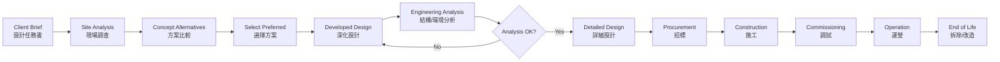
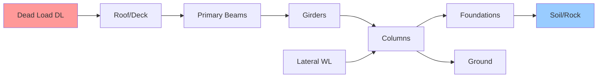
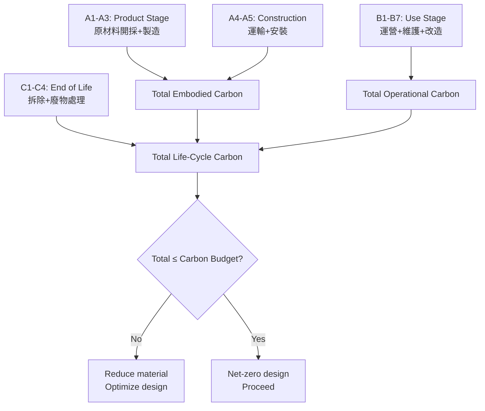
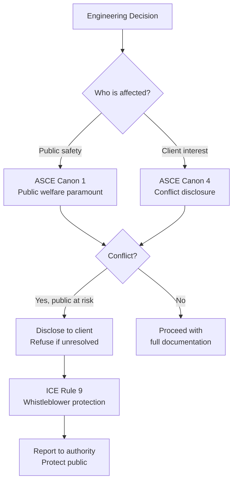
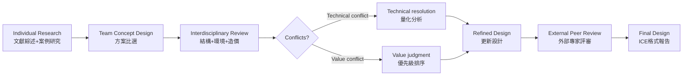
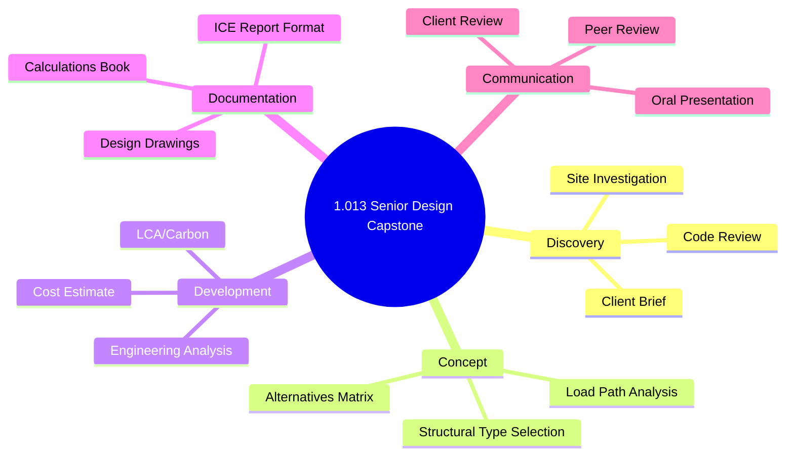
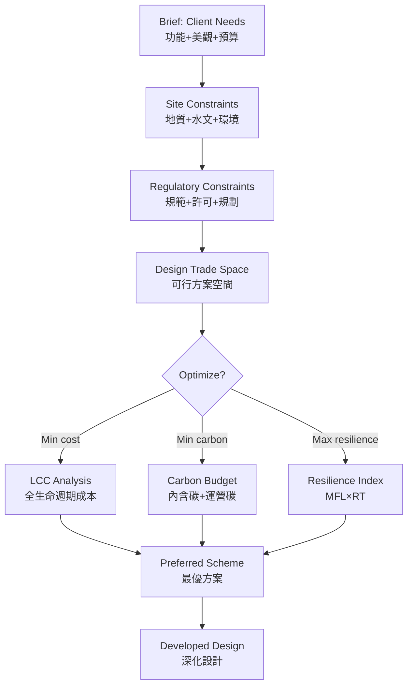
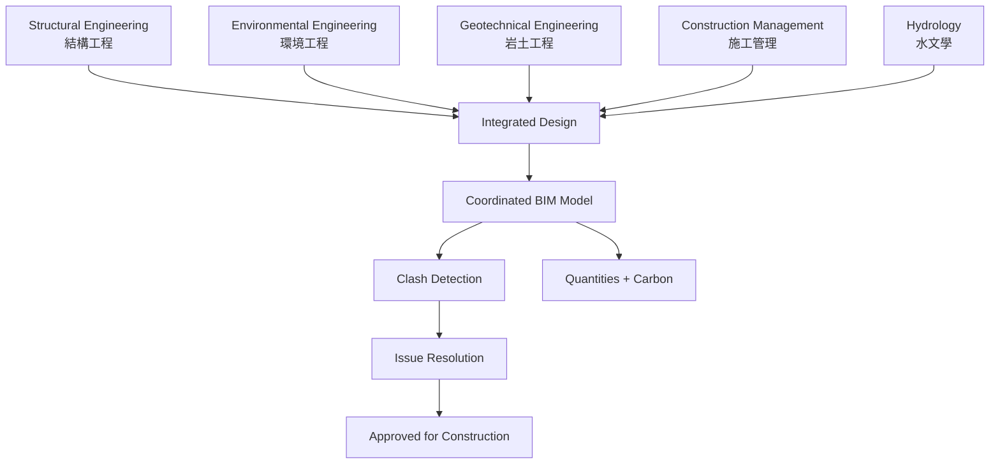
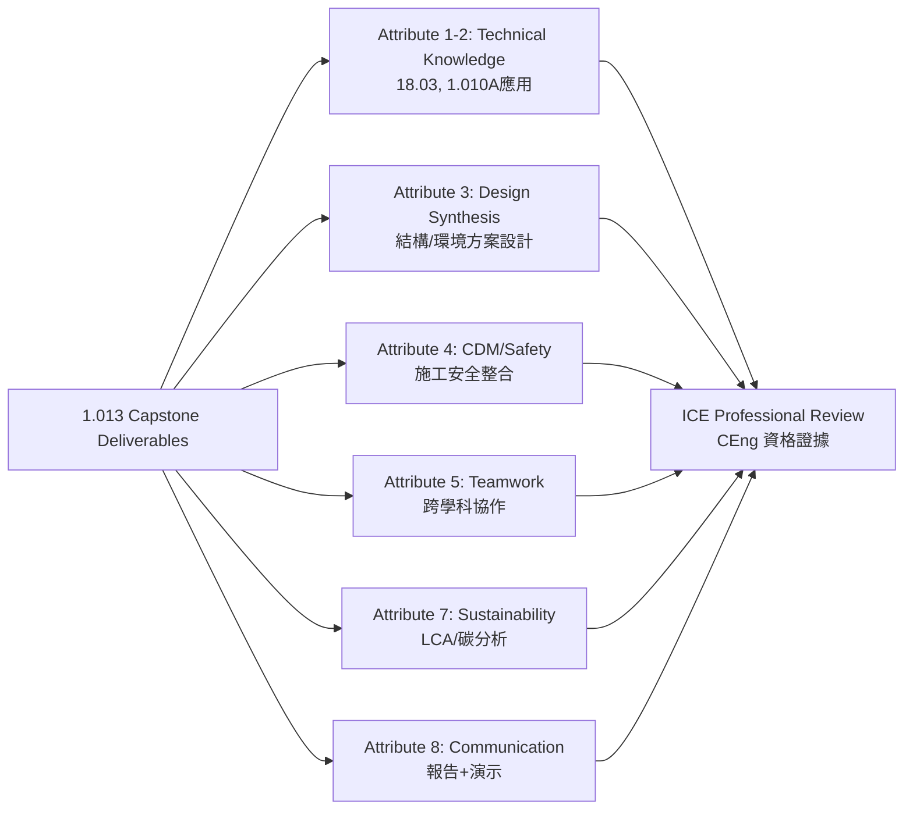
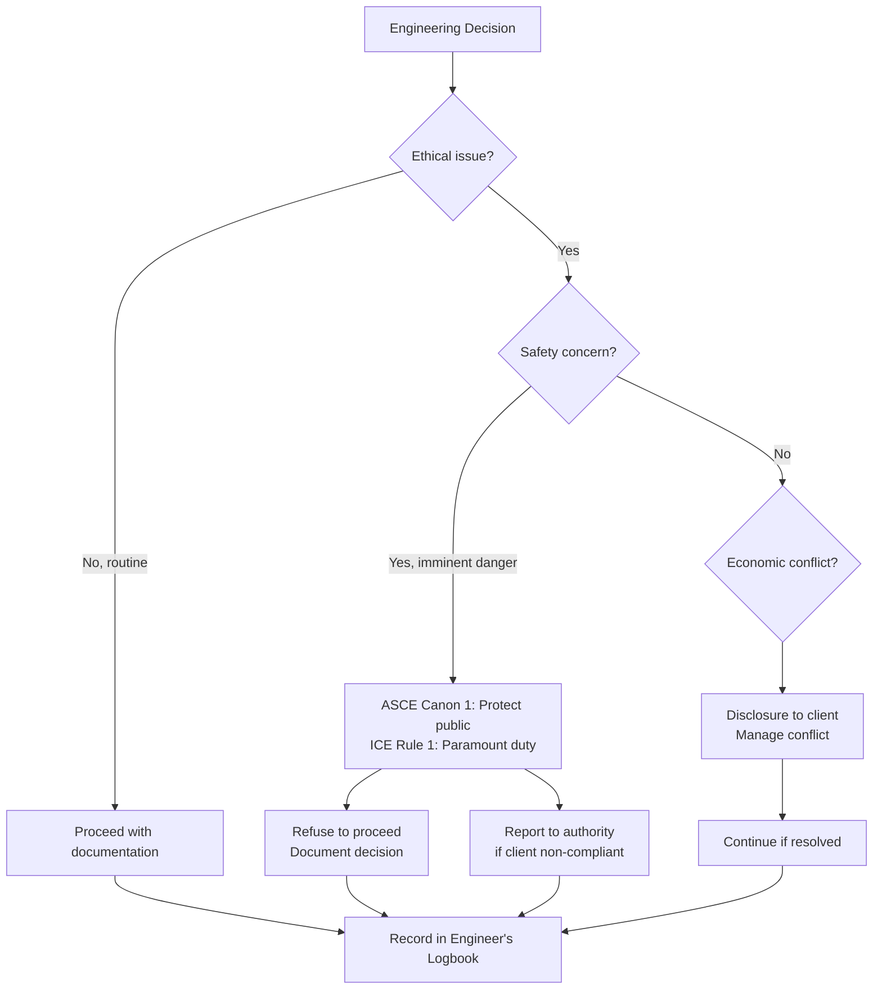

# 1.013 / Senior CEE Design Capstone
**MIT CEE GDR | 12 Units | Fall & Spring**
**Prereq:** Permission of instructor
**Instructor:** Prof. B. Marelli (Fall); Prof. B. Marelli (Spring)
**自學路徑：Bachelor → MEng Design → PE License → ICE Professional**

> **Source:** MIT Catalog 2024-25 — "Students engage with faculty around a topic of mutual interest, building on the knowledge/skills gained throughout their program. Synthesizes prior coursework and experiences through a semester-long design project and related assignments. Students form teams and work on projects advised by faculty representatives from each core in the 1-ENG curriculum. Teams demonstrate creativity in applying theories and methodologies while considering their project's technical, environmental and social feasibility. Includes lectures on a variety of related engineering concepts, as well as scholarship and engineering practice and ethics. Provides instruction and practice in oral and written communication."
> **Also see:** MIT OCW 1.012 (Introduction to Civil Engineering Design, Prof. H. Hemond)

---

## 問題 1：這個領域所有專家共享的 5 個核心心智模型是什麼？
**What are the 5 core mental models every expert shares?**

1. **設計是約束下的迭代優化**  
   Design = (Objective, Constraints, Alternatives) × Iteration. Every design problem has a function to optimize (cost, carbon, time) and constraints (codes, site, budget). Engineers navigate this trade space systematically.

2. **設計決策有長期後果**  
   Design decisions made at concept stage lock in 80% of life-cycle cost and carbon (Hayes et al., 2019). Retrofit costs 5–10× original construction. Engineers must think in decades, not just construction phase.

3. **跨學科整合是必要條件，不是可選項**  
   Structural + hydrological + environmental + social dimensions must be integrated from day one. Siloed design causes failures: the New Orleans levee system failed partly because each agency designed its own piece without system-level consideration.

4. **溝通能力是工程能力的組成部分**  
   engineering judgment must be articulated to clients, regulators, and public. The best design that cannot be explained fails. ICE Attribute 8: Communication.

5. **設計倫理嵌入每個決策**  
   Engineers bear responsibility for public safety. Engineers must balance client interests with public welfare (ASCE Code of Ethics; ICE Rules of Professional Conduct). SDG 9 (Industry, Innovation, Infrastructure) demands resilience for all.

---

## 問題 2：這個領域的專家在哪 3 個地方存在根本分歧？各方最強的論點是什麼？

1. **創意優先 vs 約束優先設計**
   - **創意派:** Concept should drive form; constraints should be challenged. Gaudi's Sagrada Família, Calatrava's bridges: beauty from daring structural form.
   - **約束派:** Optimized design under real constraints is the engineer's art. Faber Bethlehem: "Architecture is the masterly, correct and magnificent play of masses brought together." Structure serves function.

2. **性能化設計 vs 規範符合性設計**
   - **性能化:** Performance-based design (PBD) allows innovation. ASCE 7-22, Eurocode 0 allow engineered solutions beyond prescriptive code. More economical, more creative.
   - **規範符合性:** Prescriptive codes are codified collective engineering wisdom. PBD requires more analysis and risk assessment. Codes protect public safety when engineers cut corners.

3. **全生命週期成本 vs 初期成本優先**
   - **LCC派:** Life-cycle cost LCC = IC + Σ MC_t/(1+r)^t + EC/(1+r)^T includes maintenance, disruption, demolition. Net-zero requires whole-life thinking.
   - **CapEx派:** Client and procurement often minimize initial cost. LCA adds complexity; carbon pricing still weak. Public projects often lack LCC mandate.

---

## 問題 3：生成 10 個能區分深度理解與死背知識的問題

1. 解釋「設計矩陣」如何捕捉客戶需求、法規約束、技術可行性和環境影響之間的 trade-offs，並舉例說明。
2. 在結構設計項目中，什麼是 Load Path Analysis？為什麼它比有限元素分析（FEA）更能揭示概念層面的設計缺陷？
3. 說明「Constructability Review」的時機和目的：施工方法如何影響設計決策，反之亦然？
4. 在水資源設計項目中，如何量化「resilience」指標（如恢復時間、最大功能損失）來比較備選方案？
5. 什麼是「Basis of Design (BoD)」文件？它如何連接概念設計和詳細設計之間的知識缺口？
6. 解釋「Engineering Ethics」中的主要衝突案例：當客戶利益與公共安全衝突時，工程師的行動選項是什麼？
7. 在設計評審中，「紅旗 (Red Flag)」識別是什麼？列舉五個結構或環境設計中常見的概念層次錯誤。
8. 什麼是「Value Engineering」？它與「Design Optimization」的本質區別是什麼？什麼情況下它可能損害設計質量？
9. 解釋「Uncertainty in Design」的處理方式：安全係數 vs 分項係數 vs 可靠度方法的歷史演進。
10. 在團隊設計項目中，如何分配角色和責任以最大化團隊效能？「Engineer's Logbook」的法律意義是什麼？

---

**自學建議**  
- 與 1.010A (概率)、1.101 (Intro to Design) 結合：Capstone 項目需要概率分析和設計原理的應用。  
- 工具：AutoCAD, Revit (BIM), SAP2000/ETABS, Python (optimization), LCA software (Tally, Athena).  
- 必讀：Trevor Pyman "ICE Manual of Bridge Engineering"；Nigel Hewson "ICE Design and Practice Guide: Retaining Structures"。  
- 產出：一個完整的 Capstone 設計報告，包括概念設計、數值分析、成本估算、可持續性評估和溝通演示。

---

# 核心心智模型深化（中英對照）

## 1. 設計過程框架 — Design Process Framework

### 1.1 Bilingual 概念對照
| English | 中英對照 | Definition | 工程應用 |
|---|---|---|---|
| Brief | 設計任務書 | Client's requirements document | 定義設計邊界 |
| Concept design | 概念設計 | Initial form-finding and scheme selection | 80% of life-cycle cost locked |
| Developed design | 深化設計 | Technical development of chosen scheme | Engineering analysis |
| Detailed design | 詳細設計 | Construction drawings and specifications | 採購和施工 |
| Design basis | 設計基準 | BoD document establishing criteria | Legal and technical reference |

### 1.2 Key Derivation — Design as Optimization
**Mathematical formulation:**
$$\min_{x \in X} C(x) = C_{IC}(x) + \sum_t \frac{C_{M,t}(x)}{(1+r)^t} + \frac{C_{E}(x)}{(1+r)^T}$$

Subject to:
- g₁(x) ≤ 0 [Structural: σ(x) ≤ σ_allow]
- g₂(x) ≤ 0 [Environmental: GWP(x) ≤ GWP_target]
- g₃(x) ≤ 0 [Social: noise_vibration(x) ≤ limits]
- g₄(x) ≤ 0 [Regulatory: setback, height, coverage]

Where: x = design variables (geometry, material, section sizes); C_IC = initial cost; C_M,t = maintenance cost at year t; C_E = end-of-life cost; r = discount rate; T = design life.

### 1.3 Engineering Applications
**Example: Long-span bridge design trade-off**
| Alternative | IC ($M) | LCC ($M) | CO₂ (t) | Construction time |
|---|---|---|---|---|
| Steel box girder | 45 | 68 | 8,200 | 3 years |
| Cable-stayed | 62 | 79 | 11,400 | 4 years |
| Arch | 58 | 73 | 10,100 | 3.5 years |
| Suspension | 78 | 95 | 14,200 | 5 years |

LCC analysis with 3% discount rate, 100-year life → cable-stayed best balanced choice (not cheapest, not lowest carbon, but best LCC).

### 1.4 Deep Questions
- What is the social discount rate for public infrastructure? Why does 3% vs 7% discount rate change LCC rankings for long-life structures?
- Why does "engineered" resilience cost less than "battered" resilience? (See Madrigal 2017, The New Yorker on infrastructure resilience)

### 1.5 Mermaid Diagram

---

## 2. 結構概念設計 — Structural Concept Design

### 2.1 Bilingual 概念對照
| English | 中英對照 | 物理意義 | 工程應用 |
|---|---|---|---|
| Load path | 荷載路徑 | Route by which loads travel to ground | Concept validation |
| Mechanism | 機構 | Geometry change under load | Failure mode identification |
| Form finding | 形態發現 | Finding shape that routes forces optimally | Cable nets, arches, shells |
| Structural type | 結構類型 | System classification | Concept selection |

### 2.2 Key Derivation — Load Path and Mechanism
**Equilibrium check for any structure:**
ΣF = 0, ΣM = 0 must hold at every joint and support.

**Statically determinate vs indeterminate:**
- Determinate: n_equations = n_unknowns → reactions uniquely determined. Failure = mechanism.
- Indeterminate: n_unknowns > n_equations → redistributes loads, higher redundancy. Requires material nonlinearity to fail.

**Example: Portal frame mechanism analysis**
For a portal frame with plastic hinges at collapse:
M_p moment capacity → Collapse load factor λ:
λ·P = 4M_p/L for fixed-fixed portal (Tugunan & Maquoi, 1979)
This plastic mechanism method gives exact collapse load for frame → used in performance-based plastic design.

### 2.3 Engineering Applications
- **Bridge concept selection:** Span/depth ratio guides: box girder L/d=15-20, cable-stayed L/d=15-25, arch L/d=600-800.
- **Building structural type:** Steel moment frame (cost-effective <10 stories), concrete core + outrigger (high-rise), braced frame (economy for lateral).
- **Shell structures:** Thin-shell concrete minimizes material. Tenso/forms (cable nets) achieve long spans with minimal steel.

### 2.4 Deep Questions
- Derive the optimum shape of a masonry arch (catenary) using principle of minimum potential energy. Why does a circular arch require buttress forces but a catenary arch does not?
- Show that for a given span, a tied arch has lower horizontal thrust than a masonry arch of the same rise, explaining why tied arches revolutionized bridge engineering.

### 2.5 Mermaid Diagram

---

## 3. 可持續性與生命週期評估 — LCA and Sustainability

### 3.1 Bilingual 概念對照
| English | 中英對照 | 數學形式 | 工程應用 |
|---|---|---|---|
| GWP | 全球變暖潛勢 | kgCO₂e per kg material | Embodied carbon |
| Embodied carbon | 內含碳 | Σ m_i × EF_i over life cycle | Design optimization |
| Operational carbon | 運營碳 | Energy use over building life | Net-zero design |
| LCA | 生命週期評估 | ISO 14040/14044 framework | Whole-life carbon |
| Carbon budget | 碳預算 | Total allowable CO₂ for 1.5°C | Design targets |

### 3.2 Key Derivation — Embodied Carbon Calculation
**Scope 1-3 carbon accounting (IPCC; EN 15978):**
A1-A3 (Product stage): raw material extraction, transport, manufacturing
A4-A5 (Construction): transport to site, installation
B1-B7 (Use stage): use, maintenance, repair, replacement
C1-C4 (End of life): deconstruction, transport, waste processing

**Simplified embodied carbon:**
$$EC = \sum_i m_i \times EF_i$$

| Material | Embodied Carbon EF (kgCO₂e/kg) | Source |
|---|---|---|
| Structural steel | 2.50 | ICE Database 2023 |
| Reinforced concrete (C30/37) | 0.28 | ICE Database |
| Aluminum | 8.10 | ICE Database |
| Timber (glulam) | -150 to -300 | Net carbon sink |
| Recycled steel | 0.35 | EPD average |

**Example: 1000 m² floor comparison**
Steel frame: 50 kg/m² steel × 2.50 = **125 kgCO₂e/m²**
Concrete: 300 kg/m³ × 0.28 × 0.3m = **25 kgCO₂e/m²**
Timber: 30 kg/m³ × (-0.15) = **-4.5 kgCO₂e/m²** (carbon sink!)

### 3.3 Engineering Applications
- **RIBA 2030 Climate Challenge:** ≤ 8.4 kgCO₂e/m² for embodied, ≤ 16 kgCO₂e/m²/yr for operational for commercial buildings.
- **Mass timber construction:** Cross-laminated timber (CLT) achieves net-negative embodied carbon, driving explosion in tall wood buildings (mass timber up to 25 stories).

### 3.4 Deep Questions
- Why is the carbon payback period for timber longer in high-carbon-grid regions? Derive the operational carbon impact on LCA timing.
- Explain "cascading use" of timber in LCA: why should demolition timber be reused (R-value) before recycling into paper?

### 3.5 Mermaid Diagram

---

## 4. 工程倫理與專業責任 — Engineering Ethics

### 4.1 Bilingual 概念對照
| English | 中英對照 | Code reference | 工程應用 |
|---|---|---|---|
| Public welfare | 公共福祉 | ASCE Canon 1; ICE Rule 1 | Primary obligation |
| Conflict of interest | 利益衝突 | ASCE Canon 4; ICE Rule 8 | Disclosure requirements |
| Due professional care | 專業盡職 | Standard of care doctrine | Negligence threshold |
| Whistleblowing | 舉報義務 | ASCE Canon 7; ICE Rule 9 | Safety disclosure |
| Fiduciary duty | 受信義務 | Client contract law | Beyond contract |

### 4.2 Key Cases in Engineering Ethics
**Case 1: I-35W Bridge Collapse (Minneapolis, 2007)**
- Gusset plate undersized in original design (finite element analysis not used)
- Fatigue cracking at load points
- NTSB: "Inadequate engineering evaluation and peer review"
- Outcome: ASCE published "The Role of the Professional Engineer in Society" guidelines
- Lesson: Peer review is not optional; design changes require recalculation of all affected elements.

**Case 2: Hyatt Regency Walkway Collapse (Kansas City, 1981)**
- Original design: threaded rods through support boxes, continuous rod from fourth floor to ceiling
- Revised design: each floor separately supported, box welded to rod
- Changed without engineering review → stress concentration on undersized welds
- Death toll: 114; $140M settlement
- Lesson: Design changes are engineering design decisions, not construction methods.

**Case 3: Deepwater Horizon (2010)**
- BOP (Blowout Preventer) failed because of shear ram defects
- Multiple risk warnings from engineers ignored by management
- 11 deaths; largest marine oil spill in history
- Lesson: Engineer's duty to public safety overrides employer pressure (whistleblowing).

### 4.3 Engineering Application
**Professional Liability Framework:**
| Standard | Definition | Measurement |
|---|---|---|
| Reasonable care | What a prudent engineer would do | Peer opinion |
| Industry standard | Customary practice | ASCE/AISC codes |
| Due diligence | Reasonable investigation | Risk assessment |
| Documentation | Engineerer's Logbook | Primary evidence |

### 4.4 Deep Questions
- Under what conditions does a civil engineer have an obligation to override client instructions regarding public safety? Cite the specific ASCE and ICE code provisions.
- In a design-build contract, who bears responsibility for a design error discovered during construction? Analyze from contract law and professional liability perspectives.

### 4.5 Mermaid Diagram

---

## 5. 團隊協作與專業溝通 — Teamwork and Professional Communication

### 5.1 Bilingual 概念對照
| English | 中英對照 | ICE Attribute | 工程應用 |
|---|---|---|---|
| Technical report | 技術報告 | Attribute 3 (Understanding) | ICE submission |
| Design calc's | 設計計算書 | Attribute 3 (Applying) | Code compliance |
| Drawings | 工程圖紙 | Attribute 3 (Synthesis) | Construction |
| Oral presentation | 口頭匯報 | Attribute 8 (Communication) | Client/peer review |
| Engineer's logbook | 工程師日誌 | Legal evidence | Dispute resolution |

### 5.2 Key Derivation — ICE Attribute Framework
**ICE (Institution of Civil Engineers) Attributes for CEng:**
| Attribute | Meaning | Evidence |
|---|---|---|
| 1. Knowledge & understanding | Comprehension of science/math | Exam pass |
| 2. Problem solving | Apply knowledge to novel problems | Project work |
| 3. Design | Synthesis to meet spec | Capstone design |
| 4. CDM | Construction design management | Safety integration |
| 5. Interaction | Multi-disciplinary teamwork | Group project |
| 6. Innovation | Novel solutions | Research/creative |
| 7. Sustainability | Environmental/social impact | LCA in design |
| 8. Communication | Written/oral to varied audiences | Reports/presentations |

### 5.3 Engineering Applications
**Design Report Structure (per ICE format):**
1. Executive Summary (1 page)
2. Introduction & Brief (background, constraints)
3. Site Investigation (geotech, hydrology, environmental)
4. Design Criteria (codes, loads, materials)
5. Structural/Environmental Design (analysis, calculations)
6. Alternatives Considered (with comparison table)
7. Sustainability & LCA (carbon, cost, social)
8. Construction Sequencing
9. Conclusions & Recommendations
10. References & Appendices

### 5.4 Deep Questions
- How does BIM (Building Information Modelling) change the nature of design documentation? What are the IP implications in a design-build context?
- Design a peer review process for a major infrastructure project that catches concept errors before they propagate into detailed design (cite the Three Gorges Dam quality issues).

### 5.5 Mermaid Diagram

---

# 深度自測問題詳解（中英對照）

## 詳解 1: 設計約束量化
**Q:** 設計一個污水處理廠，日處理量 50,000 m³/d。列出並量化至少五個主要設計約束。
**A:** 1. 進水水質約束：BOD₅=200 mg/L, SS=150 mg/L, TN=40 mg/L → 需達標出水 (BOD₅<20 mg/L, SS<10 mg/L)。
2. 場地約束：地塊 500m × 300m → 最大建築覆蓋率 60% → 反應池總面積 ≤ 9,000 m²。
3. 法規約束：噪聲 < 55 dB(A) 白天、45 dB(A) 晚上（居民區附近）。
4. 預算約束：CapEx < $25M → 選擇活性污泥法而非膜生物反應器（MBR）更經濟。
5. 碳約束：GWP < 500 kgCO₂e/m³ 處理量 → 計算各方案的內含碳和運營碳。

## 詳解 2: 結構概念選擇
**Q:** 給定跨度 150m、兩端橋台凱氏固定，選擇最優橋型並解釋。
**A:** 
- 預力混凝土箱梁：IC=$28M, L/d=18→梁深8.3m。經濟但自重高，建造時間長。適合地形允許深梁。
- 矮拱（tied arch）：IC=$42M, 推力由系桿承受，基礎水平力小。景觀價值高。適合軟土地基。
- 矮塔斜拉橋：IC=$55M, L/d=20→塔高25m。跨越能力最強，景觀標誌。適合重要城市橋樑。
最優選擇取決於地質條件（拱需要巖石基礎）、美觀要求（城市地標）和預算。

## 詳解 3: 生命週期成本計算
**Q:** 計算鋼棧橋（50年）和混凝土橋（100年）的LCC比較。鋼：IC=$12M，年維護$80k；混凝土：IC=$18M，年維護$40k。r=3%。
**A:** 
Steel: LCC = 12 + Σ(0.08×1.03^{-t}) from t=1 to 50 + 12×1.03^{-50} (replacement)
= 12 + 0.08×[(1-1.03^{-50})/0.03] + 12×0.228 = 12 + 1.83 + 2.74 = **$16.6M** (NPV, year 0)
Concrete: LCC = 18 + Σ(0.04×1.03^{-t}) from t=1 to 100
= 18 + 0.04×[(1-1.03^{-100})/0.03] = 18 + 1.33×0.3769/0.03... ≈ 18 + 1.33/0.03×0.3769 = 18 + 1.67 = **$19.7M** (NPV, year 0)
Steel LCC lower in NPV terms.

## 詳解 4: 工程倫理決策
**Q:** 你是水壩修復項目的結構工程師。你的計算顯示現有溢洪道不能承受 PMP（可能最大降水）。客戶不想告訴公眾並要求你批准現有設計。你怎麼辦？
**A:** 
1. 首先，記錄並書面告知客戶：提供完整的技術報告，解釋 PMP 溢流風險和後果（生命和財產損失）。
2. 引用 ASCE Canon 1（工程師的首要義務是公共安全和福祉）和 ICE Rule 1（工程師對公眾的義務優先於對客戶的義務）。
3. 如果客戶堅持不明確公眾：
   - 不能批准現有設計（這會使你個人承擔專業責任）。
   - 必須向相關監管機構披露（ASCE Canon 7；ICE Rule 9）。美國「Bayh-Dole Act」不適用於工程失誤。
   - 保留你自己的計算記錄和通信記錄。

## 詳解 5: 概念設計載荷路徑分析
**Q:** 對五層鋼框架結構，畫出從屋頂風荷載到地基的完整荷載路徑，並標記每個構件的受力類型。
**A:** 風荷載路徑：
屋面板 → 次梁（受彎）→ 主梁（受彎）→ 柱（軸力+彎矩）→ 基礎（軸力）
側向風荷載路徑：
風壓 → 覆層 → 支撐/剪力牆（受軸力）→ 基礎（剪切）
關鍵概念：每個荷載路徑必須完整且清晰。如果任何環節失效（機制形成），結構失效。

## 詳解 6: 可持續性比較矩陣
**Q:** 用層次分析（AHP）比較四個橋型方案的可持续性。給出三準則（經濟、環境、社會）及其權重和方案得分。
**A:** 假設權重（通過專家判斷確定）：
經濟 W_e = 0.4；環境 W_env = 0.35；社會 W_s = 0.25

| 方案 | 經濟得分 | 環境得分 | 社會得分 |
|---|---|---|---|
| 預力混凝土 | 0.8 | 0.5 | 0.7 |
| 矮塔斜拉 | 0.5 | 0.6 | 0.9 |
| 鋼箱梁 | 0.7 | 0.4 | 0.7 |
| 拱橋 | 0.6 | 0.7 | 0.8 |

加權得分：
預力混凝土 = 0.4×0.8 + 0.35×0.5 + 0.25×0.7 = 0.32+0.175+0.175 = **0.67**
斜拉橋 = 0.4×0.5 + 0.35×0.6 + 0.25×0.9 = 0.20+0.21+0.225 = **0.635**
拱橋 = 0.4×0.6 + 0.35×0.7 + 0.25×0.8 = 0.24+0.245+0.20 = **0.685** ← 最優

## 詳解 7: 基礎選型
**Q:** 在軟土地基上（c_u = 20 kPa, N=10）建造6層建築，比較筏板基礎和樁基礎的適用性。
**A:** 軟土地基（c_u=20kPa）：
允許承載力 q_allow = c_u·N_c + γ·D·N_q + 0.5·γ·B·N_γ ≈ 20×5.7 + 18×1×5.7 ≈ 230 kPa（非常低）。
6層鋼筋混凝土建築：荷載 ≈ 6×15 kPa × 20m × 30m = 54,000 kN ≈ 54 MN
筏板基礎：所需面積 = 54,000/230 ≈ 235 m² → 最小 15m×15m。如果建築面積更大，可能足夠。
樁基礎：直徑600mm摩擦樁（q_s=40 kPa），每根承載 ≈ π×0.6×L×40。L=20m時 ≈ 1,500 kN。需要 54,000/1,500 = 36 根樁。
結論：地質條件詳細分析後，筏板可能可行但沉降需檢查；摩擦樁是軟土的標準做法。

## 詳解 8: BIM 整合
**Q:** 解釋如何用 BIM 整合結構分析和可持續性分析，並說明具體的工作流。
**A:** 
工作流：
1. Architect Revit model → structural engineer extracts analytical model → ETABS/SAP2000 analysis
2. ETABS → reactions back to Revit → column/footing sizing
3. Revit → Tally/LCA × embedded carbon calculator → GWP per element
4. BIM 4D simulation: structural sequence + construction time
5. BIM 5D cost: quantity takeoff from model × rate database
6. BIM coordination: clash detection (structural + MEP + architectural)
Key benefit: Changes propagate across all views; carbon/cost updates automatic when geometry changes. This is the digital engineering revolution.

## 詳解 9: 抗風險設計
**Q:** 在橋樑設計中，什麼是「resilience」？如何量化並應用於設計決策？
**A:** Resilience = 1 − (max functionality loss × recovery time) / (reference loss × reference time)
量化指標：
- MFL (Maximum Functionality Loss): 洪水後橋功能降低程度
- RT (Recovery Time): 恢復到100%功能的時間
- Annual risk: P(hazard) × consequence (MFL × traffic value)

設計應用：比較兩方案
方案A：標準設計，MFL=30%，RT=3月 → Resilience_A
方案B：彈性設計，MFL=10%，RT=1月 → Resilience_B
即使方案B的IC高10%，其更低的恢復時間和功能損失可能使LCC更低（考慮交通中斷成本）。

## 詳解 10: 同行評審
**Q:** 設計一個橋樑設計項目的同行評審流程，包括評審時機、評審人和評審標準。
**A:** 
時機：概念設計完成後（30%）、深化設計後（70%）、招標前（90%）
評審人：
- 獨立結構評審師（ISI）：資深結構工程師，不參與原設計
- 岩土評審師：地基設計獨立檢查
- 環境評審師：環境影響評估核查

評審標準：
1. 荷載假設合理（規範版本、荷載係數組合）
2. 分析方法正確（FEA模型邊界條件、荷載施加）
3. 構件設計安全（σ < φσ_allow）
4. 構造細節可施工
5. 可持續性符合項目目標
6. 法規和許可合規

---

## 📊 Diagram 1: Capstone Design Process

## 📊 Diagram 2: 約束下的設計決策

## 📊 Diagram 3: 跨學科整合

## 📊 Diagram 4: ICE Attribute 映射

## 📊 Diagram 5: Engineering Ethics Decision Framework

---

## 總結

1. **設計是約束下的迭代優化** — LCC = IC + Σ MC/(1+r)^t + EC/(1+r)^T 是量化設計優劣的數學框架
2. **概念設計決定80%的建造成本** — Load path analysis、structural type selection 和 constructability review 是概念設計的核心
3. **可持續性已成為設計約束** — GWP ≤ 8.4 kgCO₂e/m² (RIBA 2030) 是建築設計的強制約束
4. **倫理是工程能力的核心** — ASCE Canon 1 和 ICE Rule 1 確認公共安全優先於客戶利益
5. **ICE Attributes 8 是 Capstone 的終極目標** — 設計報告是 CEng 專業資格的最直接證據

**自學建議** — Pair with: 1.101 (Intro to Design) + 1.010A (Probability) + Trevor Pyman ICE Bridge Engineering.  
**Prerequisite chain:** 1.101 → 1.013 → MEng Design Project → PE Exam → CEng Registration
