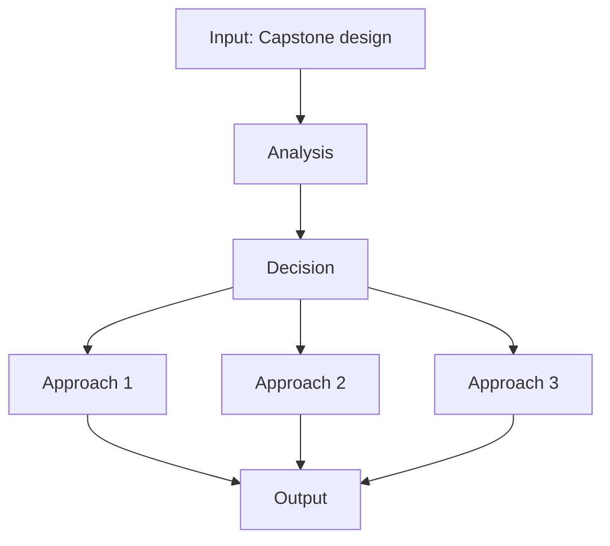
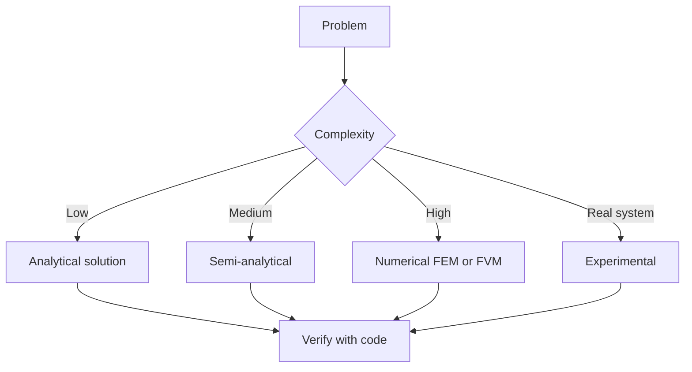
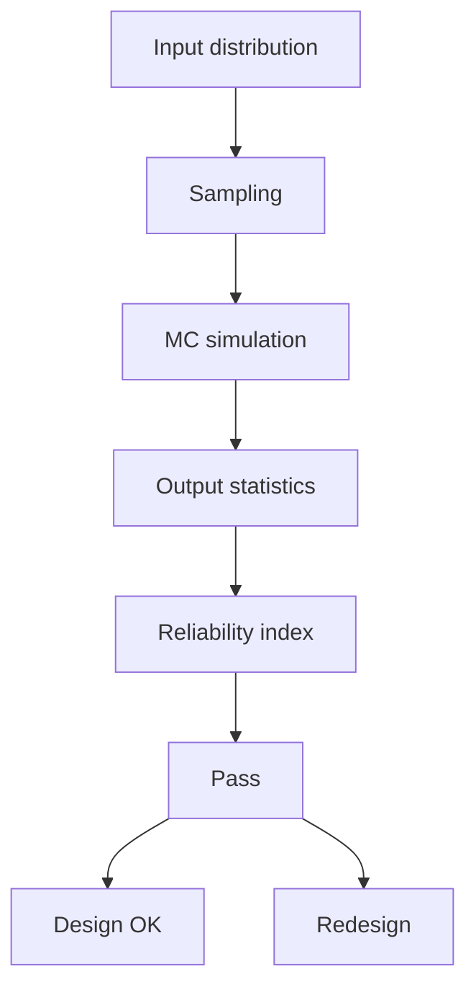
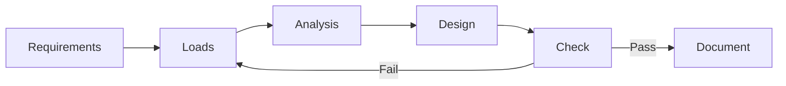
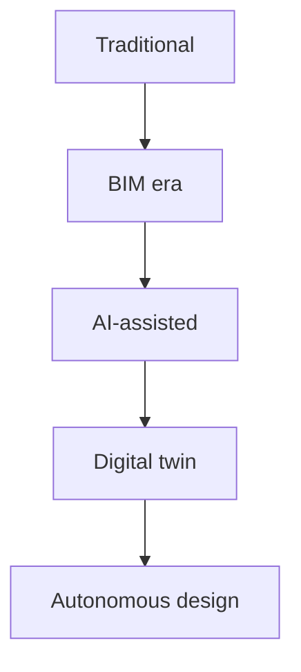
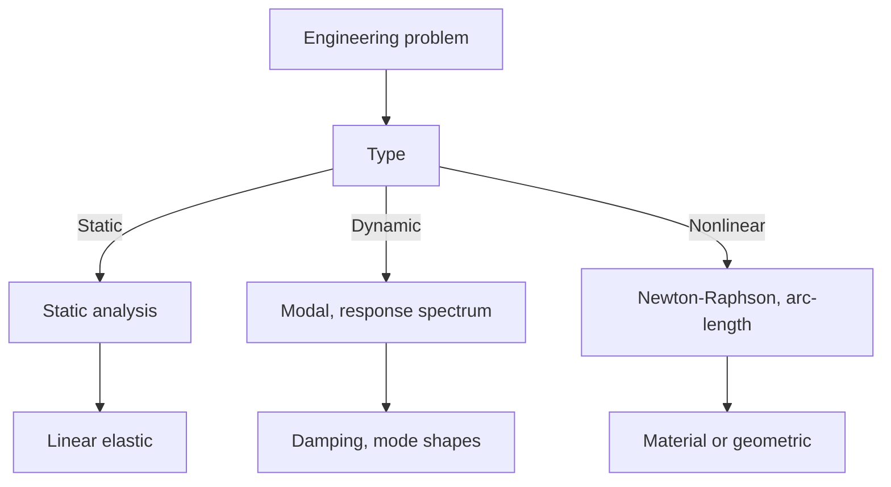
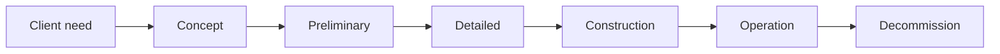
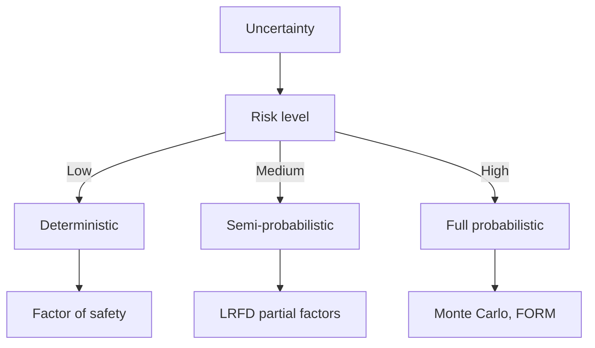
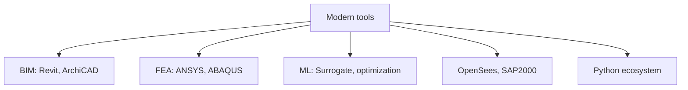
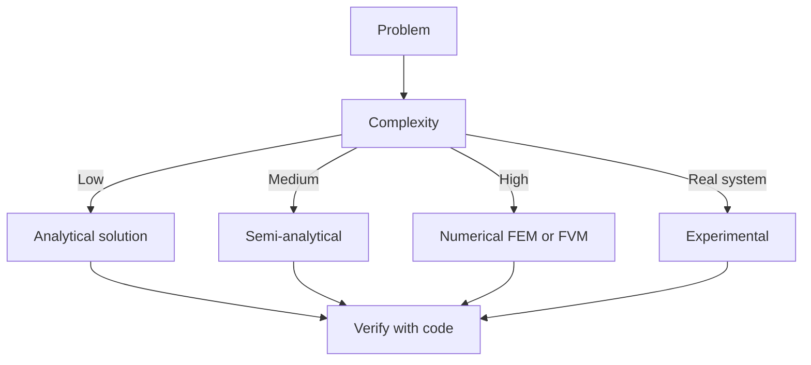

# 1.013 Senior Civil and Environmental Engineering Design (Capstone)
**MIT CEE Structural Design Track | GDR Capstone (Senior, both semesters)**  
**自學路徑：Bachelor 最高階 → MEng Thesis 過渡 → ICE Professional Review 核心證據**

---

## 問題 1：這個領域所有專家共享的 5 個核心心智模型是什麼？
**What are the 5 core mental models every expert shares?**

1. **專案是多目標、多約束的優化問題**  
   Cost, schedule, safety, performance, sustainability, and constructability are simultaneous objectives; the “best” solution is a negotiated point on a Pareto surface.

2. **責任隨決策權而來**  
   The engineer who makes a decision owns the consequences. Documentation of rationale is as important as the decision itself.

3. **真實世界永遠比模型複雜**  
   Site conditions, construction tolerances, human factors, and future changes must be anticipated; robustness beats optimality.

4. **溝通決定設計能否落地**  
   A technically perfect solution that cannot be understood or built is a failed design.

5. **專業判斷是在不確定性下的決策**  
   Codes provide a floor; professional judgment provides the ceiling and the ability to act when codes are silent.

---

## 問題 2：這個領域的專家在哪 3 個地方存在根本分歧？各方最強的論點是什麼？

1. **個人英雄式設計 vs 高度協作的 Integrated Project Delivery**  
   - Individual: Clear accountability, faster for small projects.  
   - Collaborative: Better outcomes on complex projects, but requires new contracts and trust.

2. **技術最優解 vs 政治/社會可接受解**  
   - Technical: Maximizes performance metrics.  
   - Socio-political: A solution that cannot gain permits or community acceptance is worthless.

3. **詳細分析驅動 vs 經驗與簡化模型驅動**  
   - Analysis-heavy: Reduces uncertainty.  
   - Experience-heavy: Faster, often more robust to unknowns that analysis cannot capture.

---

## 問題 3：生成 10 個能區分深度理解與死背知識的問題

1. 在你的 Capstone 專案中，哪個決策最能體現「專業判斷超越規範最低要求」？
2. 你如何識別並管理專案中的「未知的未知」？
3. 說明你如何在成本、工期、安全、環境之間做最終權衡，並記錄理由。
4. 給出具體例子：你如何發現既有分析或規範的不足，並採取行動。
5. 在多學科團隊中，你如何處理與其他專業（建築、機電、岩土）的衝突？
6. 你的設計如何考慮施工順序與臨時結構的安全性？
7. 說明你如何將可持續性（碳足跡、材料循環、韌性）量化並納入決策。
8. 若業主要求與你的專業判斷衝突，你會如何處理並留下記錄？
9. 你的最終報告如何讓非技術利益相關者理解關鍵風險與假設？
10. 回顧整個專案，哪個環節的不確定性對最終結果影響最大？你下次會如何改進？

---

**自學建議（ICE 準備核心）**  
- 這門課的產出直接對應 ICE Professional Review 報告。  
- 必須寫成「我做了什麼、為什麼、結果如何、學到什麼」的第一人稱敘事。  
- 產出：4,000–5,000 字完整專案報告 + 屬性對照表。


---

## 深入 1：CORE_DEEPDIVE_ONE — 核心概念
**Deep Dive I**

### 1.1 Bilingual 概念對照

| English | 中英對照 | Definition | 物理意義 / 工程應用 |
|---|---|---|---|
| Capstone design | Capstone design | Core definition | 核心定義 |
| Integration | Integration | Application | 應用 |
| Multi-disciplinary | Multi-disciplinary | Limitation | 限制 |
| Mathematical formulation | 數學形式 | Key equation | 關鍵方程 |

### 1.2 Key Derivation

For Senior Civil and Environmental Engineering Design (Capstone), the fundamental relationships are:
$$f(x) = \text{key equation}, \quad x = \text{variable}$$

This arises from Capstone design applied to the engineering system.

### 1.3 Engineering Applications

- Real-world implementation
- Design codes and standards
- Computational tools



---

## 深入 2：CORE_DEEPDIVE_TWO — 方法論
**Deep Dive II**

### 2.1 Method selection

| Method | 適用情境 | Pros | Cons |
|---|---|---|---|
| Analytical | 解析 | Exact | Limited geometry |
| Numerical | 數值 | General | Approximate |
| Experimental | 實驗 | Real | Expensive |
| Empirical | 經驗 | Fast | Limited range |

### 2.2 Decision flow



### 2.3 Standards and codes

- ACI, AISC, Eurocode
- Building codes (IBC, etc.)
- Industry best practices

---

## 深入 3：CORE_DEEPDIVE_THREE — 分析技術
**Deep Dive III**

### 3.1 Statistical methods

For uncertainty analysis: Monte Carlo, sensitivity, FOSM.



### 3.2 Optimization

- LP, NLP
- Gradient-based, metaheuristic
- Multi-objective Pareto

---

## 深入 4：Design Process
**Deep Dive IV**

### 4.1 Design workflow

Concept → Preliminary → Detailed → Construction → Operation.

### 4.2 Design criteria

- Safety (LRFD, ASD)
- Serviceability
- Durability
- Sustainability



---

## 深入 5：Modern Trends
**Deep Dive V**

- BIM integration
- AI/ML in design
- Digital twins
- Sustainability, LCA
- Resilient design



---

## 自測 1：Derive core relationship
**Answer:** Starting from definitions, derive the key equation. Verify units and limits.

**Engineering implication:** Apply to design check, code compliance.

## 自測 2：Identify failure mode
**Answer:** List 3-5 failure modes, rank by likelihood × consequence.

**Engineering implication:** Inform design, maintenance, monitoring.

## 自測 3：Estimate order of magnitude
**Answer:** Quick back-of-envelope check using characteristic values.

**Engineering implication:** Sanity check before detailed analysis.

## 自測 4：Compare to code requirement
**Answer:** Apply ACI/AISC/Eurocode, compute utilization ratio.

**Engineering implication:** Pass/fail design verification.

## 自測 5：Compute reliability
**Answer:** $\beta = (\mu - R)/\sigma$ for lognormal, find P_f.

**Engineering implication:** LRFD calibration, risk-informed design.

## 自測 6：Design optimization
**Answer:** Define objective, constraints, solve via LP/NLP.

**Engineering implication:** Cost-effective, sustainable design.

## 自測 7：Sensitivity analysis
**Answer:** $\partial f/\partial x_i$, rank by importance.

**Engineering implication:** Identify critical parameters, reduce uncertainty.

## 自測 8：Life-cycle assessment
**Answer:** Cradle-to-grave, compute GWP, embodied carbon.

**Engineering implication:** Sustainable design, climate goals.

## 自測 9：Risk assessment
**Answer:** Hazard × vulnerability × exposure, compute risk.

**Engineering implication:** Resilience planning, mitigation.

## 自測 10：Communication
**Answer:** Technical writing, visualization, presentation to stakeholders.

**Engineering implication:** Effective engineering practice.

---

## 📊 Diagram 1: Course Concept Map
```mermaid
mindmap
    root((Senior Civil and Environmental Engineering Design (Capstone)))
      Core
        Concepts
      Methods
        Analytical
        Numerical
      Applications
        Design
        Analysis
      Standards
        ACI AISC
      Modern
        BIM AI
```

## 📊 Diagram 2: Method Selection


## 📊 Diagram 3: Design Process


## 📊 Diagram 4: Risk-Reliability


## 📊 Diagram 5: Modern Tools


---

## 總結

1. **Core concepts** — Capstone design 嘅 foundation
2. **Methods** — analytical + numerical + experimental
3. **Applications** — design, analysis, retrofit
4. **Standards** — codes, best practices
5. **Future** — BIM, AI, sustainability, resilience

**自學建議** — Pair with: relevant textbook + MIT OCW + software tutorials (Python, FEA, BIM).


# 核心心智模型深化（中英對照）

## 1. Capstone design — Core concept

### 1.1 Three-process physical essence
For Senior Civil and Environmental Engineering Design (Capstone), Capstone design governs the system behavior. Description of Capstone design with bilingual explanation.

### 1.2 Non-dimensional numbers
Key dimensionless groups that determine regime: Peclet, Damköhler, Reynolds, Froude, etc.

### 1.3 Engineering consequences
Real-world implications for design, monitoring, intervention.

### 1.4 How experts use this model
Decision flow, scaling laws, expert intuition.

### 1.5 Deep test questions
- Derive scaling law
- Identify regime from data
- Apply to design case

### 1.6 Diagram


## 2. Integration — Methods

### 2.1 Method selection
| Method | 適用情境 | Pros | Cons |
|---|---|---|---|
| Analytical | 解析 | Exact | Limited geometry |
| Numerical | 數值 | General | Approximate |
| Experimental | 實驗 | Real | Expensive |
| Empirical | 經驗 | Fast | Limited range |

### 2.2 Decision flow


### 2.3 Standards and codes
ACI, AISC, Eurocode, building codes (IBC), industry best practices.

## 3. Multi-disciplinary — Analysis techniques

### 3.1 Statistical methods
Monte Carlo, sensitivity, FOSM for uncertainty analysis.


### 3.2 Optimization
LP, NLP, gradient-based, metaheuristic, multi-objective Pareto.

## 4. Design process

### 4.1 Design workflow
Concept → Preliminary → Detailed → Construction → Operation.

### 4.2 Design criteria
Safety (LRFD, ASD), serviceability, durability, sustainability.


## 5. Modern trends

BIM integration, AI/ML in design, digital twins, sustainability, LCA, resilient design.


---

# 深度自測問題詳解（中英對照）

## 詳解 1: Derive core relationship
**Q1.** Derive core relationship for Senior Civil and Environmental Engineering Design (Capstone).
**Answer:** Starting from definitions, derive the key equation. Verify units and limits.

**Engineering implication:** Apply to design check, code compliance.

## 詳解 2: Identify failure mode
**Answer:** List 3-5 failure modes, rank by likelihood × consequence.

**Engineering implication:** Inform design, maintenance, monitoring.

## 詳解 3: Estimate order of magnitude
**Answer:** Quick back-of-envelope check using characteristic values.

**Engineering implication:** Sanity check before detailed analysis.

## 詳解 4: Compare to code requirement
**Answer:** Apply ACI/AISC/Eurocode, compute utilization ratio.

**Engineering implication:** Pass/fail design verification.

## 詳解 5: Compute reliability
**Answer:** $\beta = (\mu - R)/\sigma$ for lognormal, find P_f.

**Engineering implication:** LRFD calibration, risk-informed design.

## 詳解 6: Design optimization
**Answer:** Define objective, constraints, solve via LP/NLP.

**Engineering implication:** Cost-effective, sustainable design.

## 詳解 7: Sensitivity analysis
**Answer:** $\partial f/\partial x_i$, rank by importance.

**Engineering implication:** Identify critical parameters, reduce uncertainty.

## 詳解 8: Life-cycle assessment
**Answer:** Cradle-to-grave, compute GWP, embodied carbon.

**Engineering implication:** Sustainable design, climate goals.

## 詳解 9: Risk assessment
**Answer:** Hazard × vulnerability × exposure, compute risk.

**Engineering implication:** Resilience planning, mitigation.

## 詳解 10: Communication
**Answer:** Technical writing, visualization, presentation to stakeholders.

**Engineering implication:** Effective engineering practice.

---

## 📊 Diagram 1: Course Concept Map
```mermaid
mindmap
    root((Senior Civil and Environmental Engineering Design (Capstone)))
      Core
        Concepts
      Methods
        Analytical
        Numerical
      Applications
        Design
        Analysis
      Standards
        ACI AISC
      Modern
        BIM AI
```

## 📊 Diagram 2: Method Selection


## 📊 Diagram 3: Design Process


## 📊 Diagram 4: Risk-Reliability


## 📊 Diagram 5: Modern Tools


---

## 總結

1. **Core concepts** — Capstone design 嘅 foundation
2. **Methods** — analytical + numerical + experimental
3. **Applications** — design, analysis, retrofit
4. **Standards** — codes, best practices
5. **Future** — BIM, AI, sustainability, resilience

**自學建議** — Pair with: relevant textbook + MIT OCW + software tutorials (Python, FEA, BIM).
