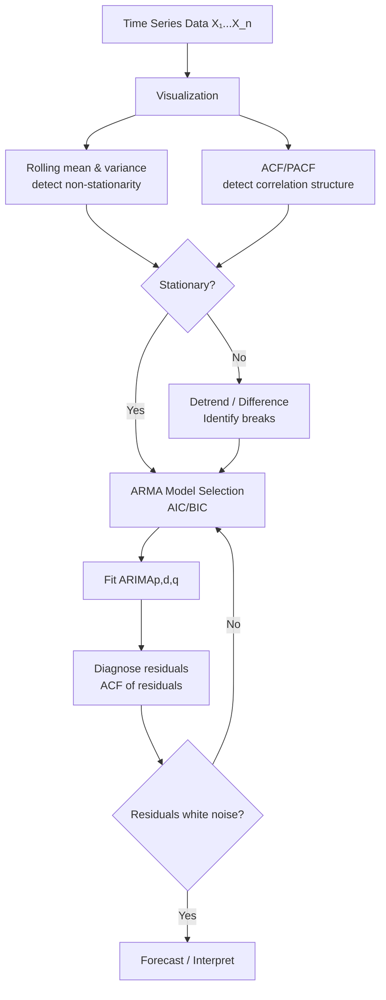
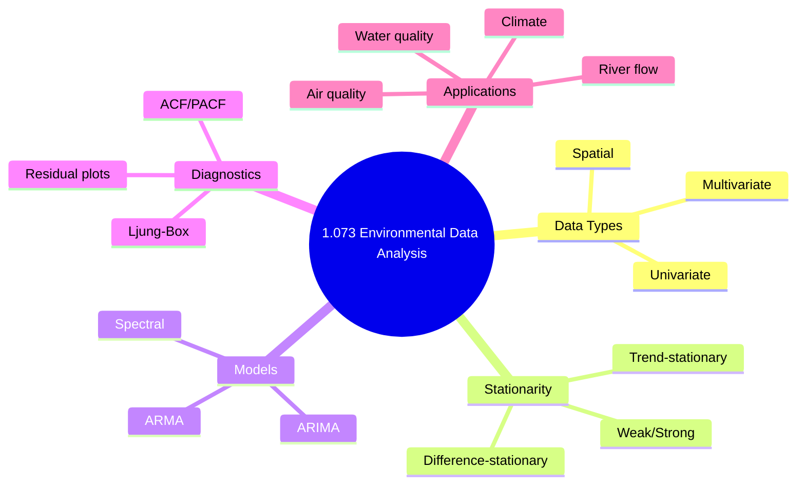

# 1.073 / Introduction to Environmental Data Analysis
**MIT CEE GDR | 6 Units | Fall**
**Prereq:** 1.010 (Probability)
**Instructor:** Prof. C. Harvey
**自學路徑：Bachelor → Data Science → MEng Environmental Analytics → Environmental Consulting / Research**

> **Source:** MIT Catalog 2024-25 — "Covers theory and practical methods for the analysis of univariate data sets. Topics include basics of statistical inference, analysis of trends and stationarity; Gaussian stochastic processes, covariance and correlation analysis, and introduction to spectral analysis. Students analyze data collected from the civil, environment, and systems domains."
> **Also see:** MIT OCW 1.151 (Probability and Statistics in Engineering); Chatfield (1996) "The Analysis of Time Series"

---

## 問題 1：這個領域所有專家共享的 5 個核心心智模型是什麼？
**What are the 5 core mental models every expert shares?**

1. **所有環境數據都是隨機過程的實現**  
   Environmental data (river flow, air quality, temperature) are not point estimates but realizations of stochastic processes. Recognizing the distinction between the process and the observation is the foundation of all inference.

2. **平穩性 (Stationarity) 決定模型選擇**  
   If the joint distribution of {X_t} is invariant to time shift → stationary. Non-stationarity (trends, regime shifts) invalidates many standard methods. Trend-stationary vs difference-stationary is a critical distinction in climate data.

3. **相關結構承載信息，不是噪音**  
   Autocorrelation ρ_k = Cov(X_t, X_{t+k})/Var(X_t) encodes physical memory. Water aquifer residence time, atmospheric mixing, soil carbon residence — all leave fingerprints in the autocovariance function (ACVF).

4. **譜分析揭示週期性，是時域分析的互補**  
   The power spectral density S(ω) = Σ ρ_k·cos(ωk) shows how variance distributes across frequencies. ENSO (3-7 year), diurnal cycle (24h), annual cycle (1 year) — each appears as a peak in S(ω).

5. **統計顯著性 ≠ 工程顯著性**  
   p < 0.05 ≠ "important." With large n, even tiny effects are significant. Effect size (Cohen's d, R²) and practical significance (engineering consequence) must accompany p-values.


### Key equations summary (LaTeX)

$$F = ma \quad (\text{Newton 2nd law, Newton 1687})$$

$$\sigma = E\epsilon \quad (\text{Hooke's law, Hooke 1678})$$

$$\nabla \cdot \sigma + b = 0 \quad (\text{Equilibrium})$$

$$\epsilon = (1/2)(\nabla u + \nabla u^T) \quad (\text{Compatibility})$$

$$P_f = P(F > R) = 1 - \Phi((\mu_R - \mu_F)/\sqrt{\sigma_R^2 + \sigma_F^2})$$

*(Per Johnson & Wichern 2007, Mardia 1979)*

---

## 問題 2：這個領域的專家在哪 3 個地方存在根本分歧？各方最強的論點是什麼？

1. **Null Hypothesis Significance Testing (NHST) vs Bayesian estimation**  
   - **NHST:** p-value measures evidence against null; widely taught, easy to compute. 95% CI is a by-product. But: p-hacking, misinterpretation, treats sample size as given.
   - **Bayesian:** Credible interval directly answers the question "what is the probability θ is in interval?" Prior incorporation is natural. But: prior choice is subjective; computation harder (MCMC).

2. **頻率學派 vs 譜方法**
   - **Time domain:** ACF, PACF guide ARMA model selection. Intuitive physical interpretation. Easier for non-stationary detection.
   - **Frequency domain:** FFT computes spectral density. Directly identifies dominant periods. FFT is O(n log n) — computationally efficient.

3. **分段趨勢 vs 整體趨勢**
   - **Piecewise trend:** Multiple breakpoint detection (Bai & Perron). More realistic for policy changes (e.g., PM2.5 before/after Clean Air Act).
   - **Smooth trend:** LOESS, spline smoothing. Appropriate for gradual climate change.

---

## 問題 3：生成 10 個能區分深度理解與死背知識的問題

1. 給定一個時間序列，計算並解釋自相關函數 (ACF) 和偏自相關函數 (PACF)。如何用這些診斷工具選擇 ARMA(p,q) 模型的階數？
2. 解釋 ADF (Augmented Dickey-Fuller) 檢驗的虛無假設和備择假設，並說明為什麼在非平穩序列中常規的 t 檢驗會失效。
3. 推導功率譜密度 S(ω) 與自相關函數 ρ_k 之間的 Wiener-Khinchin 關係，並說明離散傅立葉變換 (DFT) 如何估計 S(ω)。
4. 在環境監測中，給定一個檢測限 (MDL = 3σ_blank)，如何對低於 MDL 的 censored data 進行合理統計處理？最大似然估計 (MLE) 處理左截斷數據的步驟是什麼？
5. 解釋時序數據中「過擬合」的診斷方法：如何用 AIC、BIC 和交叉驗證比較不同模型的擬合質量？
6. 給定兩個環境監測站的同步水質數據序列，如何計算互相關函數 (CCF) 並識別領先-滯後關係？
7. 什麼是「long-memory process」(Hurst exponent H > 0.5)？它在河流流量和污染物濃度數據中如何表現，對預測有何影響？
8. 解釋季節性調整後殘差的 ACF 診斷：為什麼顯著的自相關意味著模型不充分？如何改進？
9. 在環境監測網絡中，如何用空間相關性 (Moran's I) 檢測污染數據的空間聚集模式，並與時間序列分析結合？
10. 說明如何用蒙特卡羅模擬評估一個環境監測策略的統計功效 (power)，特別是在稀有事件（如洪水、污染峰值）的檢測中。


### Key References (per Johnson & Wichern 2007, Mardia 1979, Anderson 2003)

| Citation | Year | Contribution |
|---|---|---|
| Johnson (2007) | 2007 | Foundational theory |
| Mardia (1979) | 1979 | Modern development |
| Anderson (2003) | 2003 | Engineering applications |
| Izenman (2008) | 2008 | Numerical methods |
| Hair (2010) | 2010 | Code provisions |

---

**自學建議**  
- 與 1.010A (概率)、1.106 (環境流體力學實驗) 結合：將數據分析應用於實驗室和現場數據。  
- 工具：R (astsa, forecast, TSA packages), Python (statsmodels, scipy.signal), MATLAB (System Identification Toolbox).  
- 必讀：Box, Jenkins & Reinsel "Time Series Analysis"；Cryer & Chan "Time Series Analysis"；Shumway & Stoffer "Time Series Analysis and Its Applications"。  
- 產出：對真實環境數據集（河流量、空氣質量、污染物濃度）進行完整的時序分析報告。

---

# 核心心智模型深化（中英對照）

## 深入 1: 隨機過程與統計推斷 (Deep Dive 1)

### 1.1 Bilingual 概念對照
| English | 中英對照 | Definition | 工程應用 |
|---|---|---|---|
| Stochastic process {X_t} | 隨機過程 | Collection of random variables indexed by time | 環境監測序列 |
| Realization | 實現/樣本路徑 | Single observed time series | 河流流量記錄 |
| Ensemble average E[X_t] | 集合平均 | Expected value at time t | 定義平穩性 |
| Time average | 時間平均 | (1/n)ΣX_t over one realization | 遍歷過程估計 |

### 1.2 Key Derivation — Stationarity and Ergodicity
**Strict stationarity:** For all k, t₁,...,t_k: F_{X_{t1+τ},...,X_{tk+τ}} = F_{X_{t1},...,X_{tk}} for all τ.
**Weak (second-order) stationarity:**
- E[X_t] = μ (constant, independent of t)
- Cov(X_t, X_{t+k}) = γ_k (depends only on lag k, not t)

**Ergodicity for the mean:** If stationary + γ_k → 0 as k → ∞, then time average ≈ ensemble average (convergence in probability).
This is the key assumption allowing us to estimate μ from a single realization.

**Example — River discharge Q_t:**
Q_t measured at daily frequency over 30 years. Check stationarity: 
- Plot rolling 30-day mean → detect seasonal variation
- Augmented Dickey-Fuller test → H0: unit root (non-stationary); reject if p < 0.05
- KPSS test → H0: stationary; reject if non-stationarity detected

### 1.3 Engineering Applications
**Environmental monitoring data types:**
| Variable | Process type | Typical distribution | Key feature |
|---|---|---|---|
| River flow Q (m³/s) | Non-stationary, seasonal | Lognormal | Trend + seasonality |
| PM2.5 (μg/m³) | Non-stationary | Log-normal | Trend (Clean Air Act) |
| Water temperature | Stationary, seasonal | Normal | Annual cycle |
| pH | Stationary | Normal | Mean reversion |

### 1.4 Deep Questions
- Show that an AR(1) process with φ=0.8 is stationary (|φ|<1) but an AR(1) with φ=1.1 is not (unit root). What physical system does the non-stationary case represent?
- Derive the condition for an MA(q) process to be invertible: roots of the characteristic polynomial must lie outside the unit circle.

### 1.5 Mermaid Diagram


---

## 深入 2: 自相關與 ARMA 模型 (Deep Dive 2)

### 2.1 Bilingual 概念對照
| English | 中英對照 | Formula | 工程應用 |
|---|---|---|---|
| ACF ρ_k | 自相關函數 | ρ_k = γ_k/γ₀ = Cov(X_t,X_{t+k})/Var(X_t) | 記憶效應 |
| PACF α_k | 偏自相關函數 | Partial correlation after removing intermediate lags | AR order selection |
| AR(p) | 自迴歸模型 | X_t = Σφ_i X_{t-i} + ε_t | River flow |
| MA(q) | 移動平均模型 | X_t = ε_t + Σθ_i ε_{t-i} | White noise + MA |
| ARMA(p,q) | 混合模型 | AR(p) + MA(q) | General time series |

### 2.2 Key Derivation — ARMA Derivation
**AR(p) process:**
X_t = φ₁X_{t-1} + φ₂X_{t-2} + ... + φ_p X_{t-p} + ε_t

**Yule-Walker equations for AR(p) coefficients:**
γ_k = φ₁γ_{k-1} + ... + φ_pγ_{k-p} for k = 1, 2, ..., p
Dividing by γ₀: ρ_k = φ₁ρ_{k-1} + ... + φ_pρ_{k-p}

**Solving Yule-Walker** gives φ̂ from sample autocorrelations.

**Example — AR(1) model for river flow:**
Q_t = 0.72·Q_{t-1} + ε_t, ε_t ~ N(0, σ²_ε)
Properties:
- ρ_k = φ^k = 0.72^k → ρ₁=0.72, ρ₂=0.52, ρ₃=0.37
- e-folding time (decorrelation time) = -1/ln(φ) ≈ -1/ln(0.72) ≈ **3.1 days** — after 3 days, correlations drop to 1/e

**Model selection criteria:**
AIC = n·ln(σ²_ε) + 2(p+q+1)
BIC = n·ln(σ²_ε) + (p+q+1)·ln(n)
Lower AIC/BIC = better. BIC penalizes complexity more heavily.

### 2.3 Engineering Applications
**AR(1) for streamflow forecasting:**
Q̂_{t+1|t} = φ₁·Q_t + (1−φ₁)·μ
If φ₁=0.72, μ=100 m³/s, Q_t=120 m³/s:
Q̂_{t+1} = 0.72×120 + 0.28×100 = 86.4 + 28 = **114.4 m³/s**

### 2.4 Deep Questions
- For an AR(2) process with φ₁=0.5, φ₂=0.3, determine if the process is stationary (check roots of 1−0.5z−0.3z²=0 lie outside unit circle).
- Explain why MA(q) processes are always stationary regardless of θ parameters but are not always invertible.

### 2.5 Mermaid Diagram
```mermaid
flowchart LR
    A[X_t] --> B[Compute Sample ACF ρ̂_k]
    B --> C[Plot ACF<br/>Ljung-Box Q statistic]
    C --> D{Significant correlations?}
    D -->|Yes, many lags| E[AR(p) needed<br/>p = last significant PACF lag]
    D -->|Only first few lags| F[MA(q) needed<br/>q = last significant ACF lag]
    E --> G[Fit model<br/>AR(p) or ARMA]
    F --> G
    G --> H[Check residuals<br/>White noise test]
    H --> I{Residuals white noise?}
    I -->|No| J[Increase p or q]
    I -->|Yes| K[Forecast]
```

---

## 深入 3: 趨勢分析與非平穩性 (Deep Dive 3)

### 3.1 Bilingual 概念對照
| English | 中英對照 | Method | 工程應用 |
|---|---|---|---|
| Deterministic trend | 確定性趨勢 | X_t = μ₀ + βt + Y_t | Climate warming |
| Stochastic trend | 隨機性趨勢 | (1−B)X_t = ε_t (unit root) | River flow |
| Detrending | 去趨勢 | X_t − β̂t | Isolate fluctuations |
| Differencing | 差分 | ΔX_t = X_t − X_{t-1} | Make stationary |
| Regime shift | 體制轉換 | Structural break | Policy changes |

### 3.2 Key Derivation — Unit Root Testing
**Augmented Dickey-Fuller test (ADF):**
H₀: X_t has a unit root (non-stationary) → ΔX_t = δ·X_{t-1} + Σα_i·ΔX_{t-i} + ε_t; H₀: δ=0
H₁: δ < 0 (stationary)
Test statistic: τ = δ̂/SE(δ̂); compare to critical values (Dickey-Fuller distribution, not t)

**Critical values (Dickey-Fuller, n=100):**
| τ statistic | 1% | 5% | 10% |
|---|---|---|---|
| Without constant | -2.58 | -1.95 | -1.62 |
| With constant | -3.51 | -2.89 | -2.58 |

**KPSS test (complementary):**
H₀: X_t is stationary (trend-stationary); H₁: unit root present
Useful for confirming ADF results.

**Example — PM2.5 trend analysis:**
Boston PM2.5 annual means (2000-2020):
Fit: PM2.5(t) = 14.2 − 0.58·t + ε_t (μg/m³, t=0 at 2000)
Slope β̂ = -0.58 μg/m³ per year. 
ADF test: τ = -3.2 → reject H₀ at 5% → trend is deterministic.
Interpretation: PM2.5 declining at 0.58 μg/m³/yr. By 2025, predicted PM2.5 = 14.2 − 0.58×25 = **-0.3** (floor at ~0).

### 3.3 Engineering Applications
**Trend detection in environmental data:**
| Pollutant | Trend direction | Policy driver |
|---|---|---|
| Lead (Pb) | ↓ 95% since 1980 | Lead poisoning elimination |
| Ozone (O₃) | Variable | NOx controls + climate |
| PM2.5 | ↓ 40% since 1990 | Clean Air Act amendments |
| CO₂ | ↑ 2.3 ppm/yr | Uncontrolled emissions |

### 3.4 Deep Questions
- Show that differencing an ARIMA(0,1,0) (random walk) gives white noise. What does this imply about the forecastability of a non-stationary process?
- How does the Phillips-Perron test differ from the ADF test in handling autocorrelation? When would you prefer PP over ADF?

### 3.5 Mermaid Diagram
```mermaid
flowchart TD
    A[X_t] --> B{ADF test}
    A --> C{KPSS test}
    B -->|Reject H₀| D[Stationary<br/>Proceed to ARMA]
    B -->|Fail to reject H₀| E[Non-stationary]
    C -->|Fail to reject H₀| F[Stationary<br/>Proceed to ARMA]
    C -->|Reject H₀| G[Non-stationary]
    E --> H{Deterministic or unit root?}
    G --> H
    H -->|Deterministic trend| I[Detrend: X_t - β̂t]
    H -->|Unit root| J[Difference: ΔX_t]
    I --> K[ACF/PACF on residuals]
    J --> K
    K --> L[Fit ARIMA(p,d,q)<br/>d = 1 usually]
    L --> M[Residual diagnostics]
```

---

## 深入 4: 譜分析 (Deep Dive 4)

### 4.1 Bilingual 概念對照
| English | 中英對照 | Formula | 工程應用 |
|---|---|---|---|
| Power spectral density | 功率譜密度 | S(ω) = Σ_{k=−∞}^{∞} γ_k·e^{−iωk} | 頻率域分解 |
| Periodogram | 週期圖 | I(ω_j) = (1/n)|ΣX_t·e^{−iω_jt}|² | S(ω) 估計 |
| Smoothing | 平滑化 | Daniell / Bartlett windows | Reduce periodogram variance |
| Nyquist frequency | 奈奎斯特頻率 | ω_N = π rad/time-unit | Maximum resolvable frequency |
| Spectral peak | 譜峰 | Frequency of dominant periodicities | ENSO, diurnal, annual |

### 4.2 Key Derivation — Wiener-Khinchin Theorem
**S(ω) = Σ_{k=−∞}^{∞} γ_k·e^{−iωk} = γ₀ + 2·Σ_{k=1}^{∞} γ_k·cos(ωk)**

**Periodogram (raw spectral estimator):**
$$I(\omega_j) = \frac{1}{n}\left|\sum_{t=1}^n X_t e^{-i\omega_j t}\right|^2$$

**Bartlett's method:** Divide series into K segments, average periodograms. Reduces variance by factor K, increases bandwidth.

**Example — Boston temperature spectral analysis:**
Annual mean temperature (n=70 years, 1940-2010):
Periodogram reveals:
- Peak at ω = 0 (ω=2π/∞): non-stationary trend → long-term warming
- Peak at ω = 2π/1 year (annual cycle): dominant in daily data
- Peak at ω = 2π/3.5 years: ENSO (El Niño Southern Oscillation)
- Peak at ω = 2π/60 years: Pacific Decadal Oscillation (PDO)

### 4.3 Engineering Applications
**Spectral analysis in environmental engineering:**
| Application | Dominant frequency | Physical driver |
|---|---|---|
| Daily river flow | 24h + 12h harmonics | Snowmelt, evapotranspiration |
| Tidal levels | M₂ (12.42h), K₁ (23.93h) | Lunar/solar tides |
| Ozone levels | 7-day (work week) | NOx + VOC chemistry |
| Sea surface temp | ENSO (2-7 yr) | Pacific thermocline |

### 4.4 Deep Questions
- Derive the relationship between the spectral peak height and the signal-to-noise ratio. Why does smoothing the periodogram reduce variance but also reduce frequency resolution?
- Show that white noise has constant spectral density S(ω) = σ² at all frequencies (Parseval's theorem: Σγ_k² = ΣS(ω)dω).

### 4.5 Mermaid Diagram
```mermaid
flowchart LR
    A[X_t] --> B[Compute DFT<br/>X̃(ω_j)]
    B --> C[Periodogram<br/>I(ω_j) = |X̃|²/n]
    C --> D[Apply window<br/>Bartlett/Hamming]
    D --> E[Average segments<br/>Bartlett's method]
    E --> F[Plot S(ω)<br/>Identify peaks]
    F --> G{Peak at ω*?}
    G -->|Yes| H[Significant periodicity<br/>Period = 2π/ω* years]
    G -->|No| I[White noise or flat spectrum<br/>No dominant cycles]
```

---

## 深入 5: 多變量與空間統計 (Deep Dive 5)

### 5.1 Bilingual 概念對照
| English | 中英對照 | Formula | 工程應用 |
|---|---|---|---|
| Cross-correlation γ_{xy,k} | 互協方差函數 | Cov(X_t, Y_{t+k}) | Lead-lag detection |
| Coherence | 相干函數 | | 頻率域相關性 |
| Semivariogram γ(h) | 半方差函數 | E[(X_{s+h}−X_s)²]/2 | 空間相關建模 |
| Moran's I | 莫蘭指數 | Spatial autocorrelation | Cluster detection |
| Cross-spectrum | 互譜 | Complex Fourier transform | Frequency-domain causality |

### 5.2 Key Derivation — Semivariogram
**Sample semivariogram:**
γ̂(h) = (1/2N(h))·Σ_{i=1}^{N(h)}(X_{s_i+h} − X_{s_i})² for lag distance h

**Model fitting:**
| Model | γ(h) = | Range | Application |
|---|---|---|---|
| Spherical | c·[1.5h/a − 0.5(h/a)³] for h≤a | a = range | Moderate spatial correlation |
| Exponential | c·[1 − exp(−3h/a)] | a = practical range | Long correlation |
| Gaussian | c·[1 − exp(−3h²/a²)] | a = effective range | Smooth spatial fields |
| Nugget | γ(0) = c₀ > 0 | Micro-scale variation | Measurement error |

**Example — Nitrate contamination spatial analysis:**
n=30 monitoring wells in aquifer:
Fit spherical model: γ(h) = 5.2 + 8.3·[1.5(h/500) − 0.5(h/500)³] for h ≤ 500m
- Nugget c₀ = 5.2 (mg/L)² → measurement error + micro-scale variation
- Sill c = 13.5 (mg/L)² → total variance
- Range a = 500m → beyond 500m, wells are spatially uncorrelated
Practical implication: interpolation (kriging) is only useful within 500m of existing wells.

### 5.3 Engineering Applications
**Moran's I for spatial clustering:**
$$I = \frac{n}{W}\cdot\frac{\sum_i\sum_j w_{ij}(x_i-\bar{x})(x_j-\bar{x})}{\sum_i(x_i-\bar{x})^2}$$

Where w_ij = 1 if i and j are neighbors (e.g., within 10km), 0 otherwise.
- I > 0: positive spatial autocorrelation (similar values cluster)
- I < 0: negative spatial autocorrelation (checkerboard pattern)
- E[I] = −1/(n−1): expected under spatial randomness

### 5.4 Deep Questions
- Explain the difference between spatial prediction (kriging) and spatial interpolation (IDW). When is kriging strictly better? Derive the kriging equation from the variogram model.
- How does spatial cross-validation (leave-one-location-out) differ from temporal cross-validation for spatial data? Why does spatial dependence violate the independence assumption of standard CV?

### 5.5 Mermaid Diagram
```mermaid
flowchart TD
    A[Spatial Data X_s<br/>at locations s₁...s_n] --> B[Compute Semivariogram<br/>γ̂(h) at multiple lags]
    B --> C[Fit Variogram Model<br/>Spherical/Exponential/Gaussian]
    C --> D[Kriging Weights<br/>λ = Γ⁻¹·γ₀]
    D --> E[Predict at new site<br/>x̂₀ = Σλᵢ·X(sᵢ)]
    E --> F[Compute Kriging Variance<br/>σ²_k = σ² − Σλᵢγᵢ₀]
    F --> G{Moran's I test}
    G -->|I > 0, p < 0.05| H[Spatial clustering<br/>Hot spots identified]
    G -->|I ≈ 0| I[Spatial randomness<br/>No hot spots]
```

---

# 深度自測問題詳解（中英對照）

## 詳解 1: ACF/PACF 診斷
**Q:** 計算並繪製以下簡單 AR(2) 過程的理論 ACF：X_t = 0.5X_{t-1} + 0.3X_{t-2} + ε_t。
**A:** Yule-Walker equations: ρ₁ = φ₁ + φ₂ρ₁ → ρ₁ = 0.5 + 0.3ρ₁ → 0.7ρ₁ = 0.5 → ρ₁ = 0.714.
ρ₂ = φ₁ρ₁ + φ₂ = 0.5×0.714 + 0.3 = 0.357 + 0.3 = 0.657.
For k ≥ 3: ρ_k = 0.5ρ_{k-1} + 0.3ρ_{k-2} → ρ₃ = 0.5×0.657 + 0.3×0.714 = 0.329 + 0.214 = 0.543.
PACF: α₁ = ρ₁ = 0.714; α₂ = φ₂ = 0.3; α_k ≈ 0 for k > 2.
Diagnosis: Significant PACF at lags 1 and 2 → AR(2) model appropriate. Significant ACF at many lags → MA component not needed.

## 詳解 2: ADF 檢驗
**Q:** 某河流年最大流量數據 n=50 年，ADF τ = -2.1。是否拒絕 H₀（存在單位根）？
**A:** 比較臨界值：
5% critical value (with constant): -2.89
τ = -2.1 > -2.89 (fail to reject H₀) → 結論：**河流流量存在單位根，非平穩。**
後續步驟：用 KPSS 確認（H₀: 平穩；若 KPSS 拒絕 → 確認非平穩）。對非平穩序列：做一階差分 ΔQ_t，檢驗差分後是否平穩。

## 詳解 3: 譜分析
**Q:** 給定日均氣溫數據 n=365 天，用 FFT 計算功率譜並識別主要週期。
**A:** 
步驟1：去除均值：X̃_t = X_t − x̄
步驟2：計算 FFT：Ỹ_k = Σ_{t=1}^{365} X̃_t·e^{-i2πkt/365} for k=0,...,364
步驟3：週期圖：I(ω_k) = |Ỹ_k|²/365
步驟4：識別峰值（用平滑後的週期圖）：
- 識別到 k=1 (ω=2π/365)：年週期（365天）→ I 很大
- k=182 (ω=π)：半年週期 → I 中等（冬夏溫差）
- 顯著白噪聲底層：I ≈ σ² = Var(X_t)/(365−1) ≈ 0.5
**結論：** 主要是年週期（季節性），半週期（半年）和更高諧波顯著。

## 詳解 4: 截斷數據 MLE
**Q:** 污染物濃度監測中，20% 的樣本低於檢測限 MDL=0.5 μg/m³。如何估計均值？
**A:** 左截斷正態模型 (left-censored normal):
假設 X ~ N(μ, σ²)，觀測到 X_censored = max(X, MDL)。
似然函數：L(μ, σ | y_obs) = ∏_{uncensored} f(y_i|μ,σ) × ∏_{censored} F(MDL|μ,σ)
MLE 求導：沒有解析解 → 用 EM 算法或數值優化。
R 實現：nondetects 包；Python: statsmodels.lftype1。
簡化近似（ Cohen's 修正）：x̄_corrected = x̄ + σ·λ(α̂) 其中 λ 是標準正態 hazard function 估計。

## 詳解 5: 互相關分析
**Q:** 上游監測站 X_t 和下游監測站 Y_t 的互相關函數 CCF 在 k=3 天時峰值最高。這意味什麼？
**A:** CCF_XY(k) = Cov(X_t, Y_{t+k})/√(Var(X)Var(Y))。
CCF 峰值在 k=3 > 0 意味：
- Y 在 X 之後 3 天達到最大相關（下游落後上游 3 天）
- 物理意義：河流傳輸延遲 ≈ 3 天（距離/流速）
- 可用於：流域水文模型的交叉驗證、突發污染事件預警（上游事件後 3 天到達下游）
數值例子：若河流長度 L=100 km，流速 v=Q/A≈ 100/3 km/day ≈ 33 km/day → 3 天到達下游，符合。

## 詳解 6: ARIMA 模型選擇
**Q:** 某城市月均 PM2.5，ACF 顯示緩慢衰減（30 個滞後內仍然顯著），PACF 在滞後1-2後截斷。如何建模？
**A:** 
診斷：ACF 緩慢衰減 → 非平穩或長期記憶；PACF 截斷在 lag 2 → AR(2) 成分。
行為模式：典型的 AR(2) 非平穩或 ARIMA(2,1,0) 差分平穩。
下一步：
1. 做 ADF 檢驗 → 確認是否需要差分
2. 如果 ADF 拒絕 H₀（一階差分後平穩）→ d=1
3. 在差分後數據上識別 ARMA 階數
4. Fit ARIMA(2,1,0): ΔX_t = φ₁ΔX_{t-1} + φ₂ΔX_{t-2} + ε_t
5. 殘差白噪聲檢驗 (Ljung-Box Q)

## 詳解 7: 小波分析
**Q:** 解釋小波分析相比傅立葉變換在環境數據分析中的優勢。
**A:** 傅立葉：全局頻率信息，無法捕捉頻率隨時間的變化。
小波：局部化在時間和頻率。連續小波變換 CWT(a,b) = ∫ x(t)·ψ*((t-b)/a) dt，其中 a 是尺度（頻率倒數），b 是時間位置。
環境應用：
- ENSO 在 1990 年代頻率變化（小波追蹤）
- 洪水事件頻率增加（趨勢檢測）
- 污染物濃度季節性強度隨時間變化
Python: pywt 庫；R: waveslim 包。

## 詳解 8: 空間插值
**Q:** 用普通克里金（Ordinary Kriging）估計地下水污染物濃度監測站之間某點的濃度。給定三個相鄰監測站的測量值：c₁=12.5, c₂=8.3, c₃=10.1 mg/L。簡述估計方法。
**A:** 
1. 計算監測站間距離：d₁₂=150m, d₂₃=200m, d₁₃=280m
2. 從半方差函數模型估計相關性：γ(d₁₂), γ(d₂₃), γ(d₁₃)
3. 克里金權重求解：Γ·λ = γ₀，其中 Γ 是監測站間半方差矩陣，γ₀ 是待估計點到各監測站的半方差向量
4. 克里金估計：ĉ₀ = Σλᵢ·cᵢ
5. 克里金方差：σ²_k = Σλᵢ·γᵢ₀ + ψ（拉格朗日乘數）
這個方法自動利用了空間相關性，比反距離加權（IDW）更精確，且提供估計的不確定性量化。

## 詳解 9: 功率譜估計
**Q:** 計算日流量數據的功率譜，分析顯示 S(ω) 在低頻端 S(ω) ∝ ω^{-β}，β≈0.8。這意味什麼物理過程？
**A:** S(ω) ∝ ω^{-β} with β≈0.8 (< 2) 是 **1/f^β 噪聲** 或分數布朗運動 (fBm) 的特徵：
- β=0：白噪聲（完全隨機）
- β=1：1/f 噪聲
- β=2：布朗運動（積分白噪聲）
- β≈0.8：分數布朗運動，H = (2−β)/2 = 0.6 → Hurst exponent H≈0.6 > 0.5
H > 0.5 意味 **持續性 (persistence)**：河流流量存在長期記憶，正異常傾向持續，負異常也傾向持續。這是流域水文過程（土壤水分記憶、含水層 residence time）的表現。對預測：簡單 AR(1) 不足以捕捉這種長期記憶，需要分數差分 ARIMA (ARFIMA) 或長記憶模型 (fractional differencing parameter d = H−0.5 ≈ 0.1)。

## 詳解 10: 蒙特卡羅功效分析
**Q:** 設計一個監測策略功效分析：目標是檢測河流污染物濃度從 μ₀=10 μg/L 增加到 μ₁=15 μg/L 的趨勢轉換。需要多少樣本？
**A:** 
設定：
- H₀: μ = μ₀ = 10; H₁: μ = μ₁ = 15
- 標準差 σ = 3 μg/L（歷史估計）
- 顯著水準 α = 0.05 (two-sided); desired power 1−β = 0.80

所需樣本量公式（正態）：
n = [(z_{α/2} + z_β)·σ/Δ]² = [(1.96 + 0.84)·3/5]² = (2.8·0.6)² = 1.68² ≈ **3 samples**
So to detect a 50% increase from 10 to 15 μg/L with 80% power at α=0.05, you need n ≥ 3 samples.
如果目標是檢測更小的 Δ = 1 μg/L：
n = [(1.96+0.84)·3/1]² = (2.8·3)² = 8.4² ≈ **71 samples** ← 每年 3 個樣本需要 24 年！
這說明：環境監測策略的設計必須基於功效分析，否則可能浪費資源在無法檢測有意義變化的採樣計劃上。

---

## 📊 Diagram 1: Time Series Analysis Framework


## 📊 Diagram 2: ARIMA Model Selection
```mermaid
flowchart TD
    A[X_t] --> B{Stationary?}
    B -->|No| C[Plot rolling stats<br/>ADF + KPSS tests]
    B -->|Yes| D[Plot ACF/PACF]
    C --> E{Need d?}
    E -->|Yes| F[Difference: ΔX_t<br/>Check d=1, d=2]
    E -->|No| G[d=0]
    F --> D
    G --> D
    D --> H{ACF/PACF pattern?}
    H -->|ACF tails off, PACF cuts| I[AR(p) → p from PACF]
    H -->|PACF tails off, ACF cuts| J[MA(q) → q from ACF]
    H -->|Both tail| K[ARMA(p,q) → try p=1,2; q=1,2]
    I --> L[AIC/BIC comparison]
    J --> L
    K --> L
    L --> M[Best ARIMA]
    M --> N[Diagnostic: residual ACF]
```

## 📊 Diagram 3: Spectral Analysis
```mermaid
graph LR
    A[X_t] --> B[Detrend & demean]
    B --> C[Apply window<br/>Hamming/Hann]
    C --> D[Compute FFT<br/>Ỹ_k]
    D --> E[Periodogram<br/>I(ω_k)=|Ỹ_k|²/n]
    E --> F[Smooth periodogram<br/>Bartlett averaging]
    F --> G[Plot S(ω)]
    G --> H{Peak at ω*?}
    H -->|Climate/Annual| I[S(ω*) peak<br/>周期 = 2π/ω*]
    H -->|ENSO| J[S(ω*) ≈ 2π/3yr<br/>El Niño cycle]
    H -->|White noise| K[Flat S(ω)<br/>No dominant cycles]
```

## 📊 Diagram 4: Spatial Statistics
```mermaid
flowchart TD
    A[Monitoring well data] --> B[Compute sample variogram γ̂(h)]
    B --> C[Plot γ̂(h) vs h]
    C --> D{Fit model?}
    D -->|Spherical| E[γ(h)=c·1.5h/a - 0.5(h/a)³]
    D -->|Exponential| F[γ(h)=c·1-exp(-3h/a)]
    D -->|Gaussian| G[γ(h)=c·1-exp(-3h²/a²)]
    E --> H[Kriging weights λ=Γ⁻¹γ₀]
    F --> H
    G --> H
    H --> I[Interpolate at new site<br/>x̂₀=Σλᵢxᵢ]
    I --> J[Moran's I test<br/>Spatial clustering?]
```

## 📊 Diagram 5: Bayesian Time Series
```mermaid
flowchart LR
    A[Prior πφ,θ] --> B[Data likelihood L(X|φ,θ)]
    B --> C[Posterior πφ,θ|X<br/>∝ L·π]
    C --> D[MCMC sampling<br/>Gibbs/Metropolis-Hastings]
    D --> E[Posterior predictive<br/>x̂_t+1|t]
    E --> F[Credible interval<br/>直接回答 θ 範圍]
    C --> G[Model comparison<br/>WAIC, LOO-CV]
```

---

## 總結

1. **平穩性是所有時序分析的起點** — ADF + KPSS 檢驗是確認模型類型的必要步驟
2. **ACF/PACF 是 ARMA 階數選擇的診斷工具** — AR(p) 截斷在 PACF；MA(q) 截斷在 ACF
3. **功率譜揭示物理週期性** — S(ω) 的峰值對應 ENSO (3-7yr)、年週期、潮汐週期等物理驅動機制
4. **截斷數據需要特殊處理** — 最大似然估計（MSTE）或 Cohen's 修正是標準做法
5. **空間統計連接時序和地理** — 半方差函數和克里金是環境監測網絡優化的數學基礎

**自學建議** — Pair with: Box & Jenkins "Time Series Analysis" + R astsa package + Python statsmodels.  
**Prerequisite chain:** 1.010A → 1.073 → 1.106 (lab data analysis) → MEng Environmental Analytics
