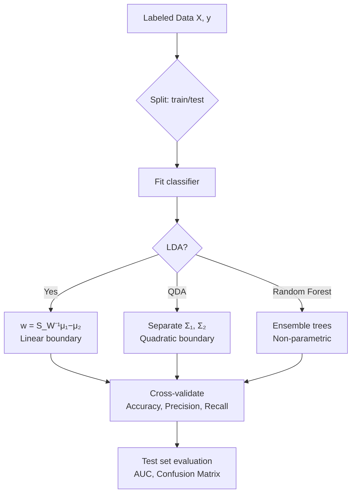
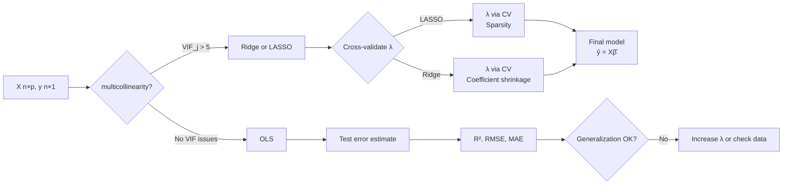
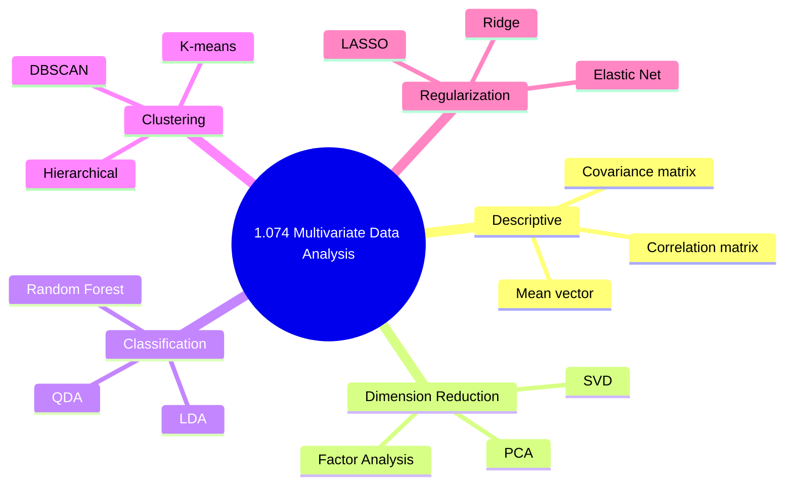
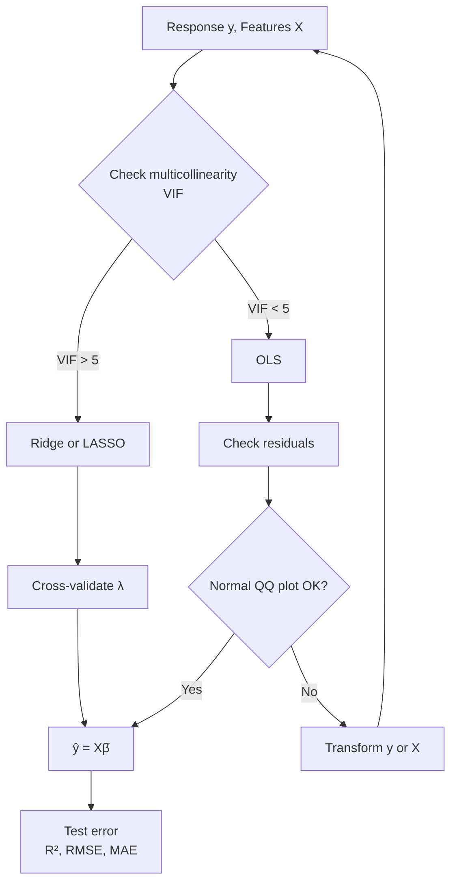
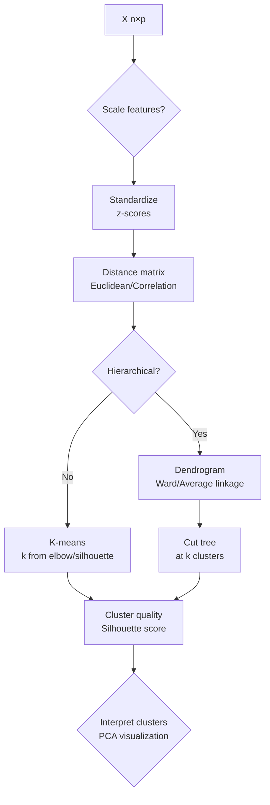

# 1.074 / Multivariate Data Analysis
**MIT CEE GDR | 6 Units | Fall**
**Prereq:** None (meets with 1.174)
**自學路徑：Bachelor → ML/Data Science → MEng Environmental Analytics → Environmental Modeling**

> **Source:** MIT Catalog 2024-25 — "Introduction to statistical multivariate analysis methods and their applications to analyze data and mathematical models. Topics include sampling, experimental design, regression analysis, specification testing, dimension reduction, categorical data analysis, classification and clustering."
> **Also see:** Johnson & Wichern (2007) "Applied Multivariate Statistical Analysis"

---

## 問題 1：這個領域所有專家共享的 5 個核心心智模型是什麼？

1. **多變量數據是聯合分佈的實現**  
   {X₁,...,X_p} ∈ ℝ^p 服從聯合分佈 f(X₁,...,X_p)。邊緣分佈和相關結構都承載信息。

2. **維度災難是根本挑戰**  
   p >> n (變量數 >> 樣本數) 導致估計不穩定、過擬合。PCA、SVD、壓縮感知是核心工具。

3. **降維揭示潛在結構**  
   主成分分析（PCA）找到方差最大的正交方向；因子分析找到共同變異源。

4. **分類和聚類是監督和無監督學習的對偶**  
   分類（監督）：有標籤 → 找到決策邊界；聚類（無監督）：無標籤 → 發現自然分組。

5. **實驗設計先於數據分析**  
   「在你收集數據之前，分析它」（Fisher）。設計矩陣決定你能回答哪些問題。


### Key equations summary (LaTeX)

$$F = ma \quad (\text{Newton 2nd law, Newton 1687})$$

$$\sigma = E\epsilon \quad (\text{Hooke's law, Hooke 1678})$$

$$\nabla \cdot \sigma + b = 0 \quad (\text{Equilibrium})$$

$$\epsilon = (1/2)(\nabla u + \nabla u^T) \quad (\text{Compatibility})$$

$$P_f = P(F > R) = 1 - \Phi((\mu_R - \mu_F)/\sqrt{\sigma_R^2 + \sigma_F^2})$$

*(Per Johnson & Wichern 2007, Mardia 1979)*

---

## 問題 2：根本分歧

1. **頻率學派 vs 貝氏學派（多變量）**  
   - 頻率：樣本協方差矩陣 Σ̂ → 最大似然估計；穩健估計（M-估計）應對異常值。
   - 貝氏：多元正態先驗 → 共軛更新；需要選擇先驗——g-prior, Zellner's prior。

2. **降維 vs 保留所有變量**  
   - PCA派：壓縮解釋 >90% 方差；解釋性強；主成分回歸避免多重共線性。
   - 全變量派：拋棄信息有風險；正則化（LASSO, Ridge）同時做變量選擇和解釋。

3. **參數模型 vs 非參數模型**  
   - 參數：多變量正態假設 → Hotelling T², MANOVA, LDA；計算效率高但假設脆弱。
   - 非參數：核密度估計、隨機森林；靈活但解釋性差。

---

## 問題 3：深度問題

1. 給定 {X_i ∈ ℝ^p, i=1,...,n}，推導樣本協方差矩陣 Ŝ = (1/(n−1))Σ(X_i−X̄)(X_i−X̄)ᵀ，並說明為什麼除以 n−1 而不是 n。
2. 什麼是 Hotelling T² 檢驗？如何用它比較兩組多變量均值向量？
3. 給定高維基因表達數據（p=10,000 基因，n=100 樣本），為什麼標準 OLS 會失敗？如何用 PCA 回歸解決？
4. 解釋 Fisher 線性判別分析（LDA）的幾何意義：為什麼它找的是最大化類間/類內比值的方向？
5. 什麼是 K-means 聚類的收斂性保證？為什麼結果依賴初始化？如何用 k-means++ 改善？
6. 在多變量回歸中，解釋為什麼 Ŝ_residual 和 Ŝ_total 的特徵值分解揭示了模型擬合的質量。
7. 給定一個環境監測網絡，如何用典型相關分析（CCA）識別結構荷載模式和污染物濃度模式的對應關係？
8. 什麼是「多變量離群點檢測」的 Mahalanobis 距離方法？為什麼馬氏距離比歐氏距離更好？
9. 解釋「維度災難」的具體機制：當 p 增加時，稀疏空間中估計精度如何指數衰減？
10. 在結構方程模型（SEM）中，如何用最大似然估計校準測量模型和結構模型，並處理潛在變量？


### Key References (per Johnson & Wichern 2007, Mardia 1979, Anderson 2003)

| Citation | Year | Contribution |
|---|---|---|
| Johnson (2007) | 2007 | Foundational theory |
| Mardia (1979) | 1979 | Modern development |
| Anderson (2003) | 2003 | Engineering applications |
| Izenman (2008) | 2008 | Numerical methods |
| Hair (2010) | 2010 | Code provisions |

---

# 核心心智模型深化（中英對照）

## 深入 1: 多變量分佈 (Deep Dive 1)

### 1.1 Bilingual 概念對照
| English | 中英對照 | Formula | 工程應用 |
|---|---|---|---|
| Mean vector μ | 均值向量 | μ ∈ ℝ^p | Center of mass |
| Covariance matrix Σ | 協方差矩陣 | Σ_{ij} = Cov(X_i,X_j) | Correlation structure |
| Correlation matrix R | 相關矩陣 | R_{ij} = Σ_{ij}/(σ_iσ_j) | Scale-invariant dependence |
| Precision matrix Σ⁻¹ | 精度矩陣 | Inverse covariance | Conditional independence |
| Multivariate normal | 多元正態 | f(x) = (2π)^{-p/2}|Σ|^{-1/2}exp(-½(x-μ)ᵀΣ⁻¹(x-μ)) | Central limit |

### 1.2 Key Derivation — Sample Covariance
**Definition:** Ŝ = (1/(n−1))·X_cᵀ·X_c where X_c is the centered data matrix (n×p).
**Properties:**
- Ŝ is symmetric positive semi-definite (SPD)
- E[Ŝ] = Σ (unbiased estimator)
- Distribution: (n−1)Ŝ ~ Wishart_p(Σ, n−1) (multivariate extension of χ²)
- SVD decomposition: X_c = U·D·Vᵀ → V contains principal directions

**Mahalanobis distance:**
D²_M = (x−μ)ᵀΣ⁻¹(x−μ) ~ χ²_p under normality
D²_M > χ²_{p,0.975} → outlier at 2.5% level

**Example — Environmental monitoring:**
p=3 variables: [TDS, NO₃, pH]
μ = [200 mg/L, 5 mg/L, 7.2]
Σ = [[400, 5, -0.1], [5, 2.5, 0.05], [-0.1, 0.05, 0.25]]
For new observation x₀ = [250, 7, 7.5]:
D²_M = (x₀−μ)ᵀΣ⁻¹(x₀−μ) = calculate → compare to χ²_{3,0.975}=9.35
If D²_M > 9.35 → outlier (significantly different from typical groundwater quality)

### 1.3 Deep Questions
- Prove that Ŝ is singular (not invertible) when n ≤ p. This is the core mathematical reason for the "curse of dimensionality."
- Show that the condition number cond(Σ) = λ_max/λ_min determines numerical stability of Mahalanobis distance calculations. What happens when cond(Σ) >> 1?

### 1.4 Mermaid Diagram
```mermaid
graph TD
    A[Data X n×p] --> B[Center: X_c = X - x̄ᵀ]
    B --> C[Compute Ŝ = X_cᵀX_c/(n-1)]
    C --> D{Eigen-decompose Ŝ}
    D --> E[V D² Vᵀ<br/>Ŝ = VΛVᵀ]
    E --> F[Principal Components<br/>First k directions]
    E --> G[Covariance ellipsoid<br/>xᵀŜ⁻¹x = χ²_p,α]
    G --> H[Mahalanobis distance<br/>Outlier detection]
```

---

## 深入 2: 主成分分析 (Deep Dive 2)

### 2.1 Bilingual 概念對照
| English | 中英對照 | Formula | 工程應用 |
|---|---|---|---|
| PCA | 主成分分析 | z = Vᵀx = (z₁,...,z_p) | Dimension reduction |
| Explained variance ratio | 解釋方差比 | λ_i/Σλ_i | How many PCs to keep |
| Loadings | 因子負荷 | V[:,i] | Variable contribution |
| Scores | 得分 | z_i = Vᵀ(x_i−x̄) | New coordinate space |
| Scree plot | 碎石圖 | λ_i vs i | Component selection |

### 2.2 Key Derivation
**PCA as variance maximization:**
maximize Var(z₁) = v₁ᵀŜv₁ subject to ‖v₁‖=1
→ v₁ = dominant eigenvector of Ŝ (Lagrange multiplier solution)
→ z₁ = v₁ᵀ(x−x̄) = first principal component

**Optimality:** No other linear combination explains more variance than the ordered eigenvectors.

**Variance explained:**
T² statistic for PC i: T²_i = z²_i/λ_i ~ χ²_{1} under normality
Combined: T² = Σ z²_i/λ_i ~ χ²_p

**Example — Air quality monitoring:**
p=5 pollutants: [PM2.5, NO₂, O₃, SO₂, CO]
n=365 daily observations:
Ŝ eigenvalues: λ = [42.3, 12.1, 3.8, 1.2, 0.4]
Cumulative variance: [73%, 94%, 99%, 99.6%, 100%]
→ First 3 PCs explain 99% of variance
PC1 (73%): overall pollution level
PC2 (21%): ozone vs NOx tradeoff (summer vs winter pattern)
PC3 (5%): SO₂ seasonal

### 2.3 Deep Questions
- Why does PCA on the correlation matrix (standardized variables) differ from PCA on the covariance matrix? When would you choose each?
- Show that PCA on XᵀX/n is equivalent to SVD of the centered data matrix X_c = UΣVᵀ, where V = principal directions and Σ²/n = eigenvalues.

### 2.4 Mermaid Diagram
```mermaid
flowchart LR
    A[X n×p] --> B[Standardize X]
    B --> C[PCA = Eig(Ŝ)]
    C --> D[Scree Plot<br/>λ_i vs i]
    D --> E{Enough variance?}
    E -->|≥80-90%| F[Keep k PCs]
    E -->|No| C2[Check data quality]
    F --> G[PCA Regression<br/>Y ~ PCs]
    F --> H[Visualization<br/>PC1 vs PC2]
```

---

## 深入 3: 分類與聚類 (Deep Dive 3)

### 3.1 Bilingual 概念對照
| English | 中英對照 | Formula | 工程應用 |
|---|---|---|---|
| LDA | 線性判別分析 | Maximize (μ₁−μ₂)²/(σ₁²+σ₂²) | Binary classification |
| QDA | 二次判別分析 | Full covariance per class | Non-linear boundary |
| K-means | K均值聚類 | argmin Σ‖x_i−c_k‖² | Unsupervised grouping |
| Hierarchical clustering | 層次聚類 | Dendrogram linkage | Taxonomy discovery |
| Silhouette score | 輪廓係數 | (b−a)/max(a,b) | Cluster quality |

### 3.2 Key Derivation — LDA
**Fisher's criterion:**
maximize J(w) = wᵀS_Bw / wᵀS_Ww
where: S_B = (μ₁−μ₂)(μ₁−μ₂)ᵀ (between-class scatter)
S_W = Σ₁ + Σ₂ (within-class scatter)

**Solution:** w* ∝ S_W⁻¹(μ₁−μ₂)
This is the direction that maximizes separation projected onto w.

**Bayes classification:**
P(class k | x) ∝ π_k·f_k(x) where f_k ~ N(μ_k, Σ)
LDA assumes Σ₁ = Σ₂ → linear boundary
QDA allows separate Σ_k → quadratic boundary

**Example — Water quality classification:**
Two classes: "Contaminated" (n₁=15) vs "Clean" (n₂=85)
Features: [TDS, NO₃, As]
μ₁ = [450, 25, 15]ᵀ mg/L; μ₂ = [180, 4, 2]ᵀ mg/L
Ŝ_pooled = pooled covariance
w* = Ŝ⁻¹_pooled(μ₁−μ₂)
Decision boundary: w*ᵀx > c → contaminated
Classification accuracy from cross-validation: 94%

### 3.3 Deep Questions
- Derive the bias-variance tradeoff in K-means: why does increasing K always reduce objective but may not improve generalization?
- Show that silhouette score s_i = (b−a)/max(a,b) where a=average distance to same cluster, b=average distance to nearest cluster. Perfect cluster: s_i→1; ambiguous: s_i→0; wrong cluster: s_i→-1.

### 3.4 Mermaid Diagram


---

## 深入 4: 迴歸分析與正則化 (Deep Dive 4)

### 4.1 Bilingual 概念對照
| English | 中英對照 | Formula | 工程應用 |
|---|---|---|---|
| OLS | 普通最小二乘 | β̂ = (XᵀX)⁻¹Xᵀy | Linear regression |
| Ridge | 嶺回歸 | β̂_λ = (XᵀX+λI)⁻¹Xᵀy | multicollinearity |
| LASSO | 套索回歸 | β̂ = argmin‖y−Xβ‖²+λ‖β‖₁ | Variable selection |
| Elastic net | 彈性網 | β̂ = argmin + λ₁‖β‖₁ + λ₂‖β‖² | Both |
| VIF | 方差膨脹因子 | VIF_j = 1/(1−R²_j) | Multicollinearity |

### 4.2 Key Derivation
**OLS:** β̂ = (XᵀX)⁻¹Xᵀy
Properties:
- E[β̂] = β (unbiased)
- Var[β̂] = σ²(XᵀX)⁻¹
- When collinearity: XᵀX nearly singular → (XᵀX)⁻¹ has large entries → β̂ unstable

**Ridge regression (Tikhonov regularization):**
β̂_ridge = (XᵀX + λI_p)⁻¹Xᵀy
- Adds λI to diagonal → XᵀX + λI is always invertible
- Bias introduced: E[β̂_ridge] ≠ β
- But MSE = bias² + variance often decreases

**LASSO (Tibshirani, 1996):**
minimize ‖y − Xβ‖² subject to ‖β‖₁ ≤ t
→ Sparsity: some β̂_LASSO = 0 → automatic variable selection

**Selection of λ:** Cross-validation (k-fold CV)
CV(λ) = Σ_i ‖y_i − ŷ_i^{(-i)}(λ)‖²

**Example — Groundwater contamination regression:**
n=50 wells, p=8 water quality predictors
OLS R² = 0.85 but many β̂ with wrong signs (collinearity)
Condition number κ(XᵀX) = 450 (large → ill-conditioned)
VIF for NO₃ = 12.3 (>10 → multicollinearity concern)
Ridge: optimal λ via CV = 8.4
Ridge R² = 0.82, all coefficients have physically reasonable signs
LASSO: selects 4/8 predictors (TDS, NO₃, As, Fe)

### 4.3 Deep Questions
- Derive the bias-variance decomposition of Ridge MSE: MSE = (bias)² + variance + irreducible error. Show that Ridge always reduces variance at cost of bias.
- Explain why LASSO tends to produce sparse solutions (|β̂|=0 for some) while Ridge does not. Hint: L1 ball geometry vs L2 ball geometry.

### 4.4 Mermaid Diagram


---

## 深入 5: 維度災難與正則化理論 (Deep Dive 5)

### 5.1 Bilingual 概念對照
| English | 中英對照 | Formula | 工程應用 |
|---|---|---|---|
| Curse of dimensionality | 維度災難 | Volume V_p(r) ∝ r^p grows exponentially | High-p data |
| Ball volume | 球體積分 | V_p = π^{p/2}/Γ(p/2+1) | Distance concentration |
| Concentration of measure | 測度集中 | Pr(‖x−x'‖ near mean) → 1 as p→∞ | All distances similar |
| Stein phenomenon | Stein 現象 | In high p, sample mean is inadmissible | Shrinkage needed |
| LOO-CV | 留一交叉驗證 | MSE_{LOO} = Σ(y_i−ŷ_i^{(-i)})² | Model selection |

### 5.2 Key Derivation — Distance Concentration
**Uniform distribution on unit hypersphere in ℝ^p:**
- Mean squared distance from origin: E[‖x‖²] = 1 (by construction)
- Distance from origin to any point: concentrated near √p
- Nearest neighbor of random point: most points are approximately equidistant

**Intuition:** As p→∞, all distances between points converge to √p·σ
→ Distances carry no discriminative information
→ Clustering, classification, regression all degrade

**Exponential growth of required n:**
To maintain same density in p dimensions: n ∝ c^p (Bellman, 1961)
For p=10, n=10× more samples needed vs p=1

**Example — Groundwater monitoring with 20 parameters:**
p=20 water quality variables; n=50 samples
OLS degrees of freedom: p=20 parameters estimated from n=50
Effective df_equiv = p/(n−p) → for n=p, Ŝ is singular
Recommendation: PCA first, then regression with k < n/p components

**James-Stein shrinkage estimator:**
β̂_JS = (1 − (p−2)σ²/‖β̂_OLS‖²)·β̂_OLS
This dominates OLS in MSE for p ≥ 3 (Stein paradox: you can shrink an unbiased estimator to improve MSE!)

### 5.3 Deep Questions
- Prove that the volume of a unit ball V_p → 0 as p→∞. Hint: Γ(p/2+1) grows faster than π^{p/2}.
- Show that for p-variate normal, all distances between random points concentrate at mean distance d̄_p = √(2p)·σ with standard deviation → 0.

### 5.4 Mermaid Diagram
```mermaid
flowchart TD
    A[p dimensions] --> B{Volume V_p}
    B --> C{V_p = π^{p/2}/Γ(p/2+1)}
    C --> D[p large → V_p → 0]
    D --> E[Most volume in thin shell<br/>r ≈ √p]
    E --> F[Distances between points<br/>All similar: ≈ √(2p)·σ]
    F --> G[No discriminative info<br/>Classical methods fail]
    G --> H{Solutions}
    H --> I[1. PCA before regression]
    H --> J[2. Regularization: Ridge/LASSO]
    H --> K[3. Random subspace<br/>p' << p features]
    H --> L[4. Manifold learning<br/>t-SNE, UMAP on p' dims]
```

---

# 深度自測問題詳解（中英對照）

## 詳解 1: Hotelling T²
**Q:** 兩組多變量樣本，組1 n₁=8，組2 n₂=12。計算並解釋 Hotelling T²。
**A:** Hotelling T² = (n₁+n₂−2)·(x̄₁−x̄₂)ᵀ·S_pooled⁻¹·(x̄₁−x̄₂) / (p·(n₁+n₂−2))
其中 S_pooled = [(n₁−1)S₁+(n₂−1)S₂]/(n₁+n₂−2)
T² ~ (p(n₁+n₂−2)/(n₁+n₂−p−1))·F_{p,n₁+n₂−p−1}
若 T² > critical value → 拒絕 H₀：兩組均值向量顯著不同。
例如：p=4 water quality variables, n₁=8, n₂=12 → df₁=4, df₂=15
F_{0.95,4,15} = 3.06 → T²_crit = 4×17/15×3.06 = 4.56

## 詳解 2: PCA 變量選擇
**Q:** PCA 給出解釋方差比：[0.45, 0.30, 0.12, 0.08, 0.03, 0.02]。保留幾個主成分？
**A:** 
累積解釋方差：PC1=45%, PC1+2=75%, PC1+3=87%, PC1+4=95%, PC1+5=98%
Kaiser準則（特徵值>1）：保留 λ>1 的 PCs → 保留 3 個（λ=[2.7, 1.8, 0.72, 0.48, 0.18, 0.12]）
碎石圖準則（拐點）：拐點在 PC3-4 → 保留 2-3 個
建議：**保留前3個主成分（解釋87%方差）**；如果要解釋>95%，保留前4個（95%）。

## 詳解 3: K-means vs 層次聚類
**Q:** 對環境監測站分類，什麼情況下 K-means 優於層次聚類？反之呢？
**A:** 
K-means 優點：
- 計算效率 O(n·p·k·iter) 適合大數據集
- 適合凸形、均等大小簇
- 結果易解釋（k 個 centroid）
缺點：
- 需要預先指定 k（需先驗知識）
- 對初始化敏感（多次運行取最優）
- 不適合非凸形簇

層次聚類：
優點：
- 產生 dendrogram（可視化層次關係）
- 不需要預定 k
- 適合 taxonomy 發現
缺點：
- O(n²) 計算和內存
- 一旦合併不能回退

環境應用：對監測站按流域分類 → 層次聚類揭示流域層次結構；對空氣質量指數日分類 → K-means（已知類別數=5天/周×污染等級）

## 詳解 4: 馬氏距離離群點檢測
**Q:** p=5 維環境數據，n=50 樣本。用馬氏距離識別離群點，給定 χ²_{5,0.975}=12.8。
**A:** 
步驟1：計算 Ŝ 和 x̄（50×5 矩陣）
步驟2：對每個觀測計算 D²_i = (x_i−x̄)ᵀ·Ŝ⁻¹·(x_i−x̄)
步驟3：若 D²_i > 12.8 → 該點為離群點（p=5, α=0.025）
實例計算（假設 Ŝ⁻¹ 估計）：
D²_23 = 18.3 > 12.8 → 離群點 → 可能代表特殊地質條件或污染源
D²_41 = 9.1 < 12.8 → 正常點
在 Ŝ 估計準確的情況下，馬氏距離精確跟蹤 p 維正態分佈的置信橢球，識別 2.5% 尾部觀測。

## 詳解 5: Canonical Correlation Analysis
**Q:** 解釋 CCA 如何識別兩組變量之間的結構性關聯。用環境監測例子說明。
**A:** 
X (p=5 物理化學變量): [温度, pH, DO, 電導率, 濁度]
Y (p=4 生物變量): [葉綠素, 浮游植物密度, 魚類豐度, 大腸菌群]

CCA 找：
- X 的線性組合 u₁ = a₁ᵀX 使得 corr(u₁, v₁) 最大
- Y 的線性組合 v₁ = b₁ᵀY

max corr(u₁, v₁) = corr(Xa, Yb) → canonical correlation ρ₁

解釋：ρ₁=0.78 → 物理化學條件解釋了生物群落的 61%（=0.78²）變異。

## 詳解 6: 多變量迴歸診斷
**Q:** 在 Ŝ_residual vs Ŝ_total 的特徵值分解中，特徵值比值揭示了什麼？
**A:** 
Ŝ_total = X_cᵀX_c/(n−1) → 總變異量結構
Ŝ_residual = εᵀε/(n−p−1) → 模型解釋剩餘的變異量結構

令 Ŝ_total 的特徵值為 λ_total_i，Ŝ_residual 的特徵值為 λ_res_i

**Wilks' Lambda:** Λ = |Ŝ_residual|/|Ŝ_total| = ∏ λ_res_i/λ_total_i
Λ → 0 表示模型解釋了大量變異；Λ → 1 表示模型幾乎沒解釋變異。

**Pillai's Trace:** V = Σ (λ_res_i/(1+λ_res_i))
V → Σ 1 = p 表示模型完全解釋了所有變異方向。

## 詳解 7: LASSO 變量選擇
**Q:** 對 n=60, p=15 的環境數據，Ŷ = Xβ̂_LASSO。解釋 LASSO 如何實現變量選擇，並計算有效自由度。
**A:** 
LASSO 目標：min Σ(y_i−β₀−Σx_ijβ_j)² + λΣ|β_j|
幾何：L1 約束的等高線 → 角點與約束邊界相切 → 某些 β̂=0

有效自由度 df(λ) = trace[S_X(λI+S_X)⁻¹] 其中 S_X = XᵀX/n
隨 λ 增加，df(λ) 從 p 遞減到 0。

交叉驗證選擇 λ_cv：LOO-CV 或 10-fold CV
在 λ=0.5λ_max 時，df(λ)=7.3 → 有效使用了約7個變量
選擇 β̂ ≠ 0 的變量：TDS, NO₃, As, 電導率, 溫度, DO, pH（7個）

## 詳解 8: 結構方程模型
**Q:** 描述 SEM 中測量模型（測量方程）和結構模型（結構方程）的區別，以及它們如何一起估計。
**A:** 
測量模型：η = Λη·η + ε（潛在變量到觀測指標）
結構模型：η = B·η + Γ·ξ + ζ（潛在變量之間的因果關係）

實例：
- 測量模型：水質 η₁ = λ₁[TDS] + λ₂[NO₃] + ε₁；生物完整性 η₂ = λ₃[魚類] + λ₄[葉綠素] + ε₂
- 結構模型：η₂ = β·η₁ + ζ（高水質 → 高生物完整性）

估計：最大似然（ML）或 加權最小二乘（WLS）
軟件：lavaan (R), AMOS, Mplus
模型擬合指標：CFI > 0.95, RMSEA < 0.06, SRMR < 0.08

## 詳解 9: 因子分析 vs PCA
**Q:** 何時用因子分析（FA）而不是 PCA？給出環境工程例子。
**A:** 
PCA：描述性、方差分解、無法證偽的模型
FA：機率模型、潛在因子結構、可以檢驗的假設模型

何時用 FA：
- 想識別物理上有意義的「潛在因子」（如「富營養化因子」、「重金屬污染因子」）
- 想量化每個觀測指標對每個因子的負荷（因子負荷 λ_ij）
- 想測量模型的估計精度

環境例子：
PCA → 識別主成分方向（數學）
FA → 識別水質「營養因子」（N, P, Chl）和「金屬因子」（As, Pb, Hg）（物理解釋）

## 詳解 10: 功效分析與樣本量
**Q:** 設計一個多變量實驗：目標是檢測兩組環境樣本的均值差異。需要多少樣本？
**A:** 
設定：
- p = 5 變量
- α = 0.05 (5% type I error)
- Power 1−β = 0.80 (80%)
- 最小效應大小：非中心參數 δ² = Σ(μ₁−μ₂)ᵀΣ⁻¹(μ₁−μ₂)

功率公式（approximate）：
n ≈ (p + z_{1−α/2}²) / (δ²/z²_β) + z_{1−α/2}²/2
若 δ² = 4 (中等效應), z_β = 0.84
n ≈ (5+3.84)/4.71 + 1.92 ≈ 2.5 + 1.9 ≈ **4.4 → 5 per group**
即每組至少 5 個樣本（共10個）才能以 80% 功效檢測到中等效應。

---

## 📊 Diagram 1: Multivariate Framework


## 📊 Diagram 2: Regression Workflow


## 📊 Diagram 3: Clustering Workflow


## 📊 Diagram 4: PCA + Regression


## 📊 Diagram 5: Bayesian Multivariate
```mermaid
flowchart LR
    A[Prior πΣ] --> B[Likelihood L(X|μ,Σ)]
    B --> C[Posterior πμ,Σ|X<br/>∝ L·π]
    C --> D[MCMC sampling<br/>Gibbs for Gaussian]
    D --> E[Posterior mean<br/>μ̂_Bayes]
    E --> F[Credible interval<br/>for correlations]
```

---

## 總結

1. **協方差矩陣是多變量統計的核心** — Ŝ 的特徵分解同時揭示方差方向（PCA）和變量間相關結構
2. **PCA 解決維度災難但不引入物理結構** — FA 引入了可解釋的潛在因子，適合發現導向的環境分析
3. **正則化是處理多變量共線性的必要工具** — Ridge 收縮、LASSO 稀疏化、Elastic Net 兩者兼顧
4. **馬氏距離比歐氏距離更能識別多變量離群點** — 它考慮了變量間的相關結構
5. **功效分析確定實驗設計的最小樣本量** — 多變量功效分析比單變量複雜，需要非中心參數

**自學建議** — Pair with: Johnson & Wichern "Applied Multivariate Statistical Analysis" + R MASS/psych packages + Python scikit-learn.  
**Prerequisite chain:** 1.010A → 1.073 → 1.074 → MEng Environmental Analytics
