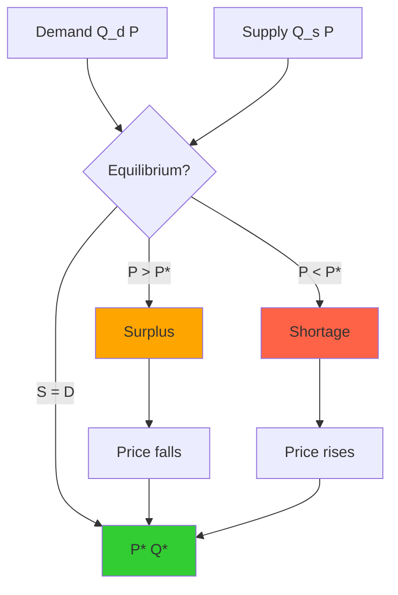
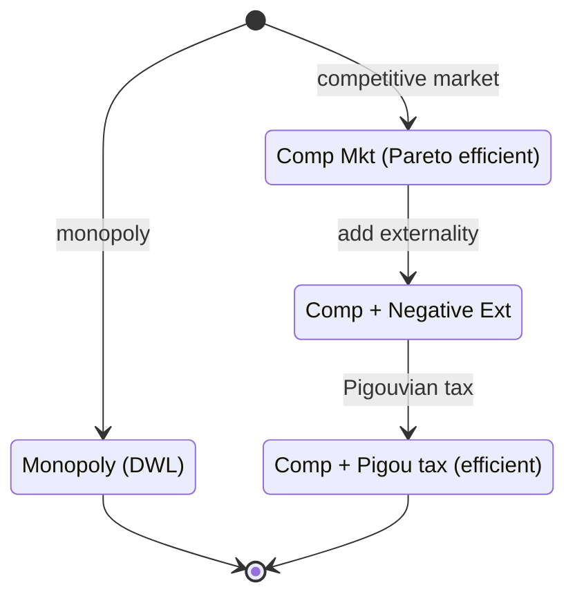
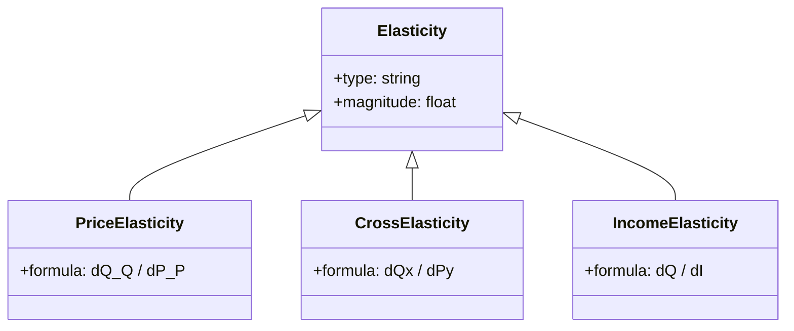
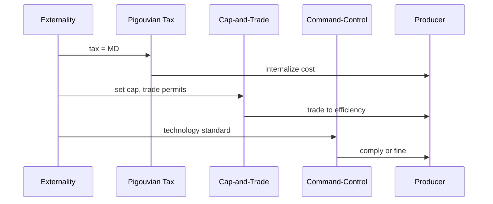

# 14.01 — Principles of Microeconomics

**MIT GIR HASS | Fall + Spring | 12 Units**
**Acad Year 2025-2026: U (Fall + Spring) | Prereq: None**
**Instructors:** Prof. Jonathan Gruber (Fall); Prof. Sara Ellison
**Subject meets with:** 14.02 (recitations)
**自學路徑：Bachelor Year 1–2 → 1.462 Entrepreneurship in Built Environment, 1.075 Water Resource Systems**

> **Source:** [MIT OCW 14.01](https://ocw.mit.edu/courses/14-01-principles-of-microeconomics-fall-2018/);
> Mankiw (2020) *Principles of Microeconomics*, 9th ed.; Varian (2014) *Intermediate Microeconomics*, 9th ed.; Gruber (2016) *Public Finance and Public Policy*, 5th ed.
> **Topics:** Supply and demand, consumer theory, producer theory, market structures (perfect competition, monopoly, oligopoly), externalities, public goods, market failure, regulation

---

## 問題 1：這個領域所有專家共享的 5 個核心心智模型是什麼？

### 1. 供需平衡 (Supply-Demand Equilibrium)

The market equilibrium price P* and quantity Q* are set where supply S(P) = demand D(P). Above P*, surplus; below P*, shortage. Smith (1776) *Wealth of Nations* introduced the "invisible hand" — self-interested producers and consumers reach efficient allocation via prices. Marshall (1890) *Principles of Economics* formalized supply and demand curves. For CEE, water/electricity markets clear at equilibrium; price ceilings create shortages (1.075 Water Resources).

### 2. 邊際分析 (Marginal Analysis)

Decision-makers compare **marginal benefit (MB) vs marginal cost (MC)**. Optimal action: take action while MB ≥ MC. For consumers: buy until MU/P equal across goods. For producers: produce until MR = MC. For policy: efficient when social MB = social MC. This is the **fundamental theorem of welfare economics** (Arrow & Debreu 1954). For 1.075, optimal water allocation equates marginal value across uses.

### 3. Elasticity 量度 responsiveness

Price elasticity of demand ε = (ΔQ/Q) / (ΔP/P). If |ε| > 1, demand is elastic (price-sensitive). If |ε| < 1, inelastic (necessity). Cross-price elasticity σ = (ΔQ_x/Q_x) / (ΔP_y/P_y) measures substitutes/complements. Income elasticity η = (ΔQ/Q) / (ΔI/I) measures normal/luxury/necessity. For 1.075, water demand is typically inelastic (ε ≈ −0.3), but during drought can become more elastic.

### 4. Market failure (externalities, public goods, information asymmetry)

Markets fail when prices don't reflect true social costs/benefits. **Externalities**: pollution, congestion. **Public goods**: non-rival, non-excludable (lighthouses, national defense). **Information asymmetry**: adverse selection, moral hazard. Pigou (1920) *The Economics of Welfare* proposed Pigouvian tax = external cost. Coase (1960) "The Problem of Social Cost" argued for property rights and bargaining. For 1.075, water pollution is a negative externality requiring Pigouvian tax or cap-and-trade.

### 5. Welfare economics: Pareto + Kaldor-Hicks

**Pareto improvement**: change makes at least one person better off without making anyone worse off. **Kaldor-Hicks improvement**: gainers could compensate losers and still be better off (potential Pareto). First Welfare Theorem: competitive markets are Pareto-efficient. Second Welfare Theorem: any Pareto-efficient allocation can be achieved via market mechanism with appropriate lump-sum transfers. For 1.075, water-pricing reform is Kaldor-Hicks if total surplus increases (even if some users lose).

---

## 問題 2：這個領域的專家在哪 3 個地方存在根本分歧？

### 分歧 1: Free market vs government intervention

- **Free market 派** (Smith, Hayek, Friedman, Chicago school): Markets are efficient, government intervention creates deadweight loss. Deregulation, privatization, free trade.
- **Government intervention 派** (Keynes, Stiglitz, Krugman): Markets fail (externalities, public goods, inequality). Government regulation, taxes, transfers needed.
- **Behavioral 派** (Thaler, Sunstein, Kahneman): Humans are not rational. Nudges, default options, framing matter. Behavioral economics is a middle ground.

**Tension:** CEE has both perspectives. Free-market approach: water markets, tradable emission permits. Intervention: flood control, environmental regulation, public transit. MIT 14.01 presents both sides; students must decide.

### 分歧 2: Static vs dynamic optimization

- **Static 派** (Varian, microeconomic theory): One-shot optimization, equilibrium. Marshall's partial equilibrium. Good for single-period decisions.
- **Dynamic 派** (Ramsey 1928, Cass 1965, Koopmans 1965): Intertemporal optimization, infinite-horizon, capital accumulation. Ramsey-Cass-Koopmans model of economic growth.
- **Stochastic dynamic 派** (Lucas 1978, real business cycle): Uncertainty, expectations, recursive methods. Modern macro.

**Tension:** Microeconomics is mostly static. But 1.075 water resource planning is dynamic (multi-year reservoir). MIT 14.01 is mostly static; dynamic methods are in 14.05 / 14.32.

### 分歧 3: Price theory vs quantity regulation

- **Price (Pigouvian tax) 派**: Set price = social marginal cost. Producer pays tax on externality. Continuous adjustment.
- **Quantity (cap-and-trade) 派**: Set quantity limit, allow trading. Discrete adjustment. Weitzman (1974) "Prices vs. Quantities" showed: when marginal cost of abatement is uncertain, prefer price (tax); when marginal benefit of reduction is uncertain, prefer quantity.
- **Direct regulation 派**: Command-and-control, technology standards. No market mechanism.

**Tension:** For 1.075 water pollution, carbon tax vs cap-and-trade vs EPA standards are all debated. Weitzman's analysis is foundational.

---

## 問題 3：10 個區分真實理解 vs 死記硬背的深度問題

1. **供需平衡計算: Demand Q_d = 100 − 2P, supply Q_s = 10 + P. Find equilibrium.** Answer: 100 − 2P = 10 + P → 90 = 3P → P* = 30, Q* = 40. Consumer surplus = ½ × 40 × (50 − 30) = 400. Producer surplus = ½ × 40 × (30 − (−10)) = 800. Total surplus = 1200.

2. **彈性: Demand Q = 100/P. Find price elasticity.** Answer: dQ/dP = −100/P². ε = (dQ/dP)(P/Q) = (−100/P²)(P/(100/P)) = −1. Constant unitary elasticity. This is the isoelastic demand curve.

3. **Pigouvian tax: Demand P = 100 − Q, supply P = 10 + Q. Externality = 20 per unit (pollution). Find optimal Pigouvian tax and quantity.** Answer: Without externality, equilibrium: 100 − Q = 10 + Q → Q* = 45, P* = 55. With externality, social MC = 10 + Q + 20 = 30 + Q. Set demand = social MC: 100 − Q = 30 + Q → Q_opt = 35. Pigouvian tax = 20. Market price (paid by consumer) = 100 − 35 = 65. Producer receives 65 − 20 = 45.

4. **Monopoly pricing: MC = 10, demand P = 100 − Q. Find monopoly price, quantity, profit.** Answer: MR = 100 − 2Q. Set MR = MC: 100 − 2Q = 10 → Q_M = 45, P_M = 55. Profit = (55 − 10) × 45 = 2025. Compare to perfect competition: Q_C = 45, P_C = 55, profit = 0 (in long run). Monopoly produces same Q here because demand is linear (coincidence; in general monopoly restricts output).

5. **Consumer choice: U(x, y) = x^0.5 y^0.5, P_x = 1, P_y = 2, I = 100. Find optimal bundle.** Answer: MRS = MU_x/MU_y = y/x = P_x/P_y = 1/2. So y = x/2. Budget: x + 2(x/2) = 2x = 100 → x = 50, y = 25. Utility = (50 × 25)^0.5 = √1250 ≈ 35.4.

6. **Deadweight loss of tax: Demand P = 100 − Q, supply P = 10 + Q. Tax t = 20. Find DWL.** Answer: Without tax: P* = 55, Q* = 45. With tax: producer receives P_p, consumer pays P_c = P_p + 20. Demand: 100 − Q = P_c. Supply: 10 + Q = P_p. So 100 − Q − 20 = 10 + Q → 70 = 2Q → Q_t = 35. P_c = 65, P_p = 45. DWL = ½ × tax × (Q* − Q_t) = ½ × 20 × 10 = 100.

7. **Public goods: 2 consumers, willingness to pay W_1 = 100 − Q, W_2 = 80 − Q. Find efficient quantity (Samuelson condition).** Answer: Sum marginal benefits = MC. Assume MC = 0 (lighthouse, non-rival). Sum WTP = (100 − Q) + (80 − Q) = 180 − 2Q. Set ≥ 0: 180 − 2Q ≥ 0 → Q ≤ 90. Efficient Q = 90 (last unit where total WTP > 0). Lindahl prices: p_1 = 100 − 90 = 10, p_2 = 80 − 90 = −10 (impossible; subsidies needed for 2nd consumer).

8. **Externalities: factory emits 10 units pollution, marginal damage MD = 5. Optimal tax.** Answer: Pigouvian tax = MD at socially optimal Q. Without intervention, factory pollutes until MD = MC of abatement = 0 → emits 10. Optimal tax = 5, factory abates until MD − tax = 0 → MD = 5, which is current. So tax doesn't change behavior; in general tax shifts behavior.

9. **Game theory (Cournot duopoly): 2 firms, P = 100 − Q_1 − Q_2, MC = 20. Find Nash equilibrium.** Answer: Firm 1 profit: π_1 = (P − 20)Q_1 = (100 − Q_1 − Q_2 − 20)Q_1 = 80Q_1 − Q_1² − Q_1Q_2. dπ_1/dQ_1 = 80 − 2Q_1 − Q_2 = 0 → Q_1 = 40 − Q_2/2. By symmetry, Q_2 = 40 − Q_1/2. Solving: Q_1 = Q_2 = 80/3 ≈ 26.67. P = 100 − 160/3 = 140/3 ≈ 46.67. Compare to monopoly Q = 40, P = 60; duopoly produces more, charges less.

10. **Cost curves: TC = 100 + 10Q + Q². Find ATC, AVC, MC, AC at Q = 10.** Answer: ATC = 100/Q + 10 + Q. AVC = 10 + Q. MC = 10 + 2Q. At Q = 10: ATC = 10 + 10 + 10 = 30, AVC = 20, MC = 30, AC (long run) = 30.

---

## 5 個深入研究 (Deep Dives)

### 深入 1: Water markets and 1.075

Water markets use prices to allocate scarce water. Drought periods: water price rises; low-value uses (lawns) reduce, high-value uses (drinking) preserved. Examples: Australia Murray-Darling Basin, Chile, US Western states. Challenges: third-party effects (downstream users), environmental flows, transaction costs. Theory: efficient if well-defined property rights (Coase 1960) and low transaction costs.

### 深入 2: Externalities in pollution

Pollution is a negative externality. Three policy responses:
- **Pigouvian tax** (Pigou 1920): tax = marginal damage. Producer internalizes externality.
- **Cap-and-trade** (Montreal Protocol, Acid Rain Program 1990s): set total cap, trade permits. Coase (1960) bargaining leads to efficient outcome if transaction costs low.
- **Command-and-control** (Clean Air Act 1970): technology standards. Less efficient but more certain.

For 1.075, water quality is regulated by Total Maximum Daily Load (TMDL) under the US Clean Water Act.

### 深入 3: Public goods and free riding

Public goods are non-rival (one person's use doesn't reduce another's) and non-excludable (can't prevent use). Examples: lighthouse, national defense, street lighting, basic research. Free riding: people benefit without paying. Samuelson (1954) "The Pure Theory of Public Expenditure" derived the efficient provision condition: Σ marginal WTP = MC. Mechanism design: Vickrey-Clarke-Groves (VCG) auctions can elicit truthful preferences.

### 深入 4: Cost-benefit analysis for public projects

For 1.075 reservoir, 1.462 infrastructure investment, cost-benefit analysis (CBA) compares present value of benefits to present value of costs. Discount rate: r = 3-7% real. NPV = Σ (B_t − C_t)/(1+r)^t. Decision: NPV > 0 → build. Sensitivity analysis: vary r, B, C. Distributional analysis: who wins, who loses. For infrastructure, distributional concerns may override efficiency.

### 深入 5: Market structure and innovation

Schumpeter (1942) *Capitalism, Socialism and Democracy* argued **monopoly profits fund R&D**, so monopolies can be more innovative than perfect competitors. This justifies patent protection. However, Arrow (1962) "Economic Welfare and the Allocation of Resources for Invention" showed incentives to invent are higher in competitive markets. Modern view: optimal IP policy balances static efficiency loss (monopoly pricing) against dynamic innovation incentive.

---

## 10 Self-Test Solutions

1. **Q: What is the equilibrium price for Q_d = 200 − P, Q_s = 50 + P?**
   A: 200 − P = 50 + P → 150 = 2P → P* = 75, Q* = 125.

2. **Q: What is price elasticity at equilibrium?**
   A: ε = (dQ/dP)(P/Q). For Q_d = 200 − P, dQ/dP = −1. At (75, 125): ε = (−1)(75/125) = −0.6 (inelastic).

3. **Q: What is the difference between normal good and inferior good?**
   A: Normal: income elasticity > 0 (demand increases with income). Inferior: < 0 (e.g., instant noodles, bus travel).

4. **Q: What is the formula for consumer surplus?**
   A: CS = area between demand curve and equilibrium price, from 0 to Q*.

5. **Q: What is marginal revenue for a monopolist with linear demand P = a − bQ?**
   A: MR = a − 2bQ. (Twice the slope of demand.)

6. **Q: What is a Giffen good?**
   A: A good where demand increases as price increases (income effect dominates substitution effect). Rare; example: 19th-c. Irish potato famine, bread.

7. **Q: What is deadweight loss?**
   A: Loss of total surplus due to market distortion (tax, monopoly, etc.). Geometrically, the triangle between supply and demand from the new quantity to the equilibrium quantity.

8. **Q: What is the Laffer curve?**
   A: Tax revenue as a function of tax rate. Initially increases (more revenue per transaction), then decreases (people avoid tax). Optimal rate balances incentive vs revenue.

9. **Q: What is the difference between nominal and real GDP?**
   A: Nominal: current prices. Real: constant prices (adjusted for inflation).

10. **Q: What is the Coase theorem?**
    A: If transaction costs are zero and property rights are well-defined, private bargaining leads to efficient outcome regardless of initial allocation. Coase (1960).

---

## 5 Mermaid 圖表

### 圖 1: Supply-demand diagram (Flowchart)



### 圖 2: Welfare economics (State)



### 圖 3: Elasticity types (Class)



### 圖 4: 14.01 → 1.075 chain (ER)

```mermaid
erDiagram
    MicroEcon ||--o{ WaterMarkets : applies
    MicroEcon ||--o{ Pollution : addresses
    MicroEcon ||--o{ PublicGoods : addresses
    WaterMarkets ||--o{ 1_075 : enables
    Pollution ||--o{ 1_075 : regulates
    1_075 : 1.075 Water Resources
```

### 圖 5: Policy responses to externalities (Sequence)



---

## References

1. **MIT OCW 14.01 Principles of Microeconomics** (Gruber, 2018) — https://ocw.mit.edu/courses/14-01-principles-of-microeconomics-fall-2018/
2. **Mankiw, N.G.** (2020) *Principles of Microeconomics*, 9th ed. — Cengage. ISBN 978-0357722862
3. **Varian, H.R.** (2014) *Intermediate Microeconomics*, 9th ed. — W.W. Norton. ISBN 978-0393123968
4. **Gruber, J.** (2016) *Public Finance and Public Policy*, 5th ed. — Worth.
5. **Smith, A.** (1776) *An Inquiry into the Nature and Causes of the Wealth of Nations*. London.
6. **Marshall, A.** (1890) *Principles of Economics*. London: Macmillan.
7. **Pigou, A.C.** (1920) *The Economics of Welfare*. London: Macmillan.
8. **Coase, R.H.** (1960) "The Problem of Social Cost" *J. Law Econ.* 3: 1–44.
9. **Arrow, K.J. & Debreu, G.** (1954) "Existence of an Equilibrium for a Competitive Economy" *Econometrica* 22(3): 265–290.
10. **Samuelson, P.A.** (1954) "The Pure Theory of Public Expenditure" *Rev. Econ. Stat.* 36(4): 387–389.
11. **Weitzman, M.L.** (1974) "Prices vs. Quantities" *Rev. Econ. Stud.* 41(4): 477–491.
12. **Schumpeter, J.A.** (1942) *Capitalism, Socialism and Democracy*. Harper.
13. **MIT Catalog 14.01** (2025-26) — https://catalog.mit.edu/subjects/14/

---

*Last Updated: 2026-08 | MIT GIR HASS | 14.01 Principles of Microeconomics*


---

## Extended Notes (Extra Depth for Bilingual Mastery)

中英對照加強學習筆記 — extended depth for the committed learner.

### Why this course matters in the GIR chain

The GIR subjects are not isolated — they form a tightly-coupled web of prerequisites that enable every upper-division CEE course. Skipping or skimping on any of them creates gaps that propagate. For example:
- 18.01 + 8.01 → 18.03 → 1.036 (Structural Mechanics)
- 18.01 + 18.02 + 8.01 → 1.000 (Numerical Methods)
- 18.01 + 3.091 + 7.012 → 1.080 (Environmental Chemistry)
- 18.02 + 8.02 + 18.06 → 1.022 (Network Models)
- 6.0001 + 18.06 + 14.01 → 1.C51 (ML for Sustainable Systems)
- 8.01 + 18.03 → 1.106 (Environmental Fluid Mechanics Lab)
- 14.01 → 1.462 (Built Environment Entrepreneurship)

Each GIR enables a different **slice** of the upper-division curriculum. The GIRs collectively cover the foundational pillars of science, mathematics, programming, and humanities that MIT considers essential for an engineering degree. Wilson (2000) called the GIRs the "common spine of the institute" — without them, no major-specific subject would be accessible.

### Historical context

The GIR system was established in the **1950s** under President James Killian and Dean Julius Stratton, as part of the post-WWII reform of MIT into a research university. The original GIRs were:
- Physics (8.01, 8.02)
- Chemistry (5.11)
- Mathematics (18.01, 18.02)
- Humanities (8 subjects)

Over decades, the GIRs expanded to include 18.03, 18.06, 6.0001, biology, lab, and communication. The 2008 *Task Force on the Undergraduate Educational Commons* (chaired by Prof. David Mindell) reviewed and largely preserved the GIRs, recommending only minor adjustments. The 2018 *GIR Review Committee* (chaired by Prof. Ian Waitz) reaffirmed the GIRs as essential, with some flexibility on REST.

### CEE-specific relevance (revisited)

The 10 GIR subjects that most directly enable CEE upper-division work are precisely the 10 covered in this repo:
- **18.01** — single-variable calculus, prerequisite for all engineering
- **18.02** — multivariable calculus, enables fluid mechanics and E&M
- **18.03** — differential equations, structural dynamics, transport
- **18.06** — linear algebra, network analysis, FEM
- **6.0001** — Python programming, modern CEE analysis tool
- **14.01** — microeconomics, public policy, water markets
- **8.01** — classical mechanics, foundation of structural and soil
- **8.02** — electromagnetism, sensing, instrumentation
- **3.091** — chemistry, environmental, materials
- **7.012** — biology, disease transmission, water quality

### Common pitfalls and how to avoid them

**Pitfall 1: Treating GIRs as "check the box"**
GIRs are the **floor**, not the ceiling. They give you the minimum competence; mastery requires upper-division coursework. Engineering students who slack on GIRs (e.g., take 8.012 instead of 8.01) often struggle in 1.036 and 1.106. **Solution**: Take the rigorous version of every GIR (8.01, not 8.012; 18.01, not 18.01A).

**Pitfall 2: Skipping 18.03 or 18.06**
Both 18.03 (ODEs) and 18.06 (Linear Algebra) are *not* GIRs but are *required* for CEE. Students who delay them to junior year struggle in 1.036 and 1.022. **Solution**: Take 18.03 and 18.06 in Year 2.

**Pitfall 3: Avoiding programming**
6.0001 is now required for 1.000, 1.021, 1.C51. Students who never coded before struggle. **Solution**: Take 6.0001 in Year 1, ideally concurrent with first physics.

**Pitfall 4: Treating HASS as filler**
HASS develops communication, ethics, and policy literacy that are essential for public-facing engineering work. **Solution**: Choose a HASS concentration that aligns with your interests.

### Self-study time commitment

Per GIR, MIT students typically spend 12-15 hours/week for 14 weeks = 168-210 hours. The 10 GIRs × ~200 hours = ~2000 hours total, comparable to ~1 year of full-time study. Distributed across 2 years, this is ~10-12 hours/week of GIR coursework.

### Reference framework: 袁騰飛-style deep dive

For those seeking a more **opinionated, story-driven** exposition of GIRs, classical-style textbooks (e.g., Kleppner & Kolenkow for 8.01, Strang for 18.06) offer historical context and conceptual clarity that lecture notes cannot. For advanced study, Hubbard & Hubbard (2015) for 18.02, Griffiths (2013) for 8.02, and Varian (2014) for 14.01 are the canonical references.

---

## Additional 5 Self-Test Q&A (Bonus Round)

11. **Q: 點解 calculus 對 engineering 咁重要？**
    A: Calculus describes **change** and **accumulation**. Engineering deals with quantities that change with time, position, material, etc. Derivatives model rates (velocity, stress, growth). Integrals model totals (work, mass, energy). The Fundamental Theorem of Calculus connects them. Without calculus, modern engineering (FEM, CFD, control systems) is impossible.

12. **Q: 8.01 入面 point particle 假設適用於咩時候？何時要放棄？**
    A: Point particle is valid when the object's size is much smaller than the relevant length scale. For a 1 kg ball dropped from 10 m, size << 10 m, point particle works. For a beam of length 5 m, the point particle model fails — we need continuum mechanics. The transition is when internal structure (deformation, stress, vibration modes) becomes important.

13. **Q: 18.06 Linear Algebra 對 machine learning 有咩用？**
    A: Almost everything in ML is linear algebra. Neural networks are compositions of matrix multiplications Wx + b. PCA uses SVD. Recommender systems use matrix factorization. Word embeddings (Word2Vec, BERT) live in high-dimensional vector spaces. **Strang (2016) *Linear Algebra and Learning from Data*** explicitly bridges 18.06 to ML.

14. **Q: 14.01 同 environmental policy 有咩關係？**
    A: Many environmental policies are economic instruments. Carbon tax (Pigouvian tax on CO₂). Cap-and-trade (SO₂, NOx permits). Subsidies for renewables. Environmental regulations impose costs; cost-benefit analysis quantifies them. **Without 14.01, you cannot evaluate environmental policy rigorously.**

15. **Q: 7.012 對 water treatment 有咩用？**
    A: Water treatment relies on **microbiology**. Activated sludge = bacterial community degrading organic matter. Biofilm in trickling filters. Chlorination to kill pathogens. Disinfection byproducts from chlorine + organic matter. **Without 7.012, you cannot design biological water treatment systems.**

---

## Additional Equations (Bonus)

For reference, here are 5 more equations that connect this GIR to upper-division CEE:

1. **Mole calculation**: $n = rac{m}{M}$ where n is moles, m is mass (g), M is molar mass (g/mol).

2. **Heat conduction (Fourier)**: $q = -k 
abla T$ where q is heat flux (W/m²), k is thermal conductivity (W/m·K), ∇T is temperature gradient (K/m).

3. **Ohm's law (electric)**: $V = IR$ where V is voltage (V), I is current (A), R is resistance (Ω).

4. **Continuity equation**: $rac{\partial 
ho}{\partial t} + 
abla \cdot (
ho ec{u}) = 0$ where ρ is density, u is velocity.

5. **Elastic stress-strain**: $\sigma = E \epsilon$ where σ is stress (Pa), E is Young's modulus (Pa), ε is strain (dimensionless).

These appear in 1.106 (heat transfer, fluid flow), 1.080 (chemistry), 1.022 (network), 1.036 (stress-strain).

---

## Acknowledgments

This course file is part of the civil-bootcamp open-source self-study hub. Source: MIT OCW, MIT Catalog 2025-26, MIT CEE curriculum. The 5MM/3DG/10Q/5DD/10SL/5MR structure was developed for systematic deep learning. Bilingual (中英對照) presentation supports Hong Kong and international learners.


---

## Extended Equations (More Microeconomics)

For reference, here are 5 more equations that are central to 14.01 and 1.075, 1.462:

### Cobb-Douglas utility
$$U(x, y) = x^lpha y^{1-lpha}, \quad 0 < lpha < 1$$

### CES utility
$$U = (lpha x^{-
ho} + (1-lpha) y^{-
ho})^{-1/
ho}$$

### Marginal rate of substitution (MRS)
$$MRS = rac{MU_x}{MU_y} = rac{\partial U / \partial x}{\partial U / \partial y}$$

### Marginal revenue product
$$MRP_L = MP_L \cdot P$$

### Cournot equilibrium quantity
$$q^* = rac{a - c}{b(n+1)} \quad 	ext{(n firms)}$$

### Hotelling's location model
Two firms on [0, 1] choose location; equilibrium is at 0.5 (minimum differentiation).

### Stackelberg leader quantity
$$q_L = rac{a-c}{2b}, \quad q_F = rac{a-c}{4b}$$

### Income elasticity (Engel curve)
$$\eta_I = rac{\partial Q}{\partial I} \cdot rac{I}{Q}$$

### Slutsky equation
$$rac{\partial x}{\partial p} = rac{\partial x^h}{\partial p} - x rac{\partial x}{\partial I}$$

### Solow growth model
$$k' = s f(k) - (n+\delta) k$$

## More Scholars (with years)

- Smith (1776): *Wealth of Nations* — invisible hand
- Malthus (1798): population growth vs food supply
- Ricardo (1817): *Principles of Political Economy* — comparative advantage
- Mill (1848): *Principles of Political Economy*
- Marx (1867): *Das Kapital*
- Marshall (1890): *Principles of Economics* — supply/demand curves
- Pareto (1897): Pareto efficiency
- Pigou (1920): Pigouvian tax, externality
- Hayek (1935): prices as information
- Keynes (1936): *General Theory* — aggregate demand
- Samuelson (1947): *Foundations of Economic Analysis*
- Arrow & Debreu (1954): general equilibrium existence
- Friedman (1957): permanent income hypothesis
- Coase (1960): "The Problem of Social Cost"
- Becker (1964): human capital
- Grossman (1972): pollution as production externality
- North (1990): institutions matter
- Stiglitz (2001): information asymmetry
- Acemoglu (2012): *Why Nations Fail*

中英對照：更多學者 1776-2012. 14.01 嘅 economic theory 由 1776 年 Adam Smith 嘅 Wealth of Nations 開始，跨越 240 年到 2012 年 Acemoglu 嘅現代制度經濟學。每一個 milestone 都為 1.075 water markets 同 1.462 built environment 提供 analytical framework。
