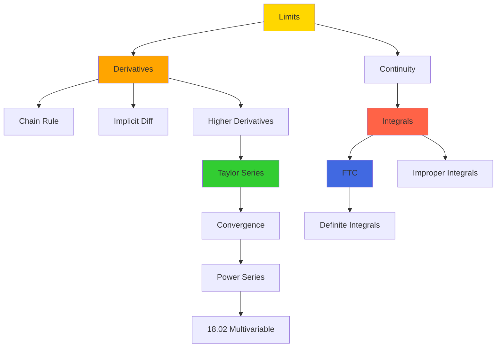
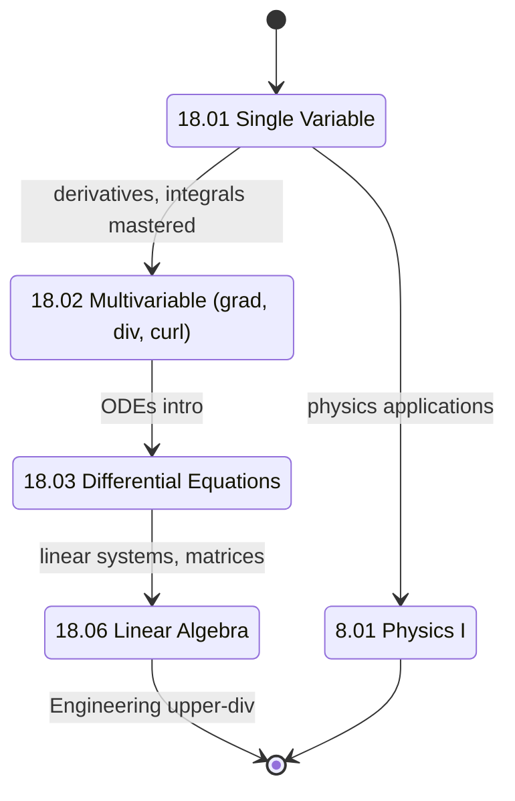
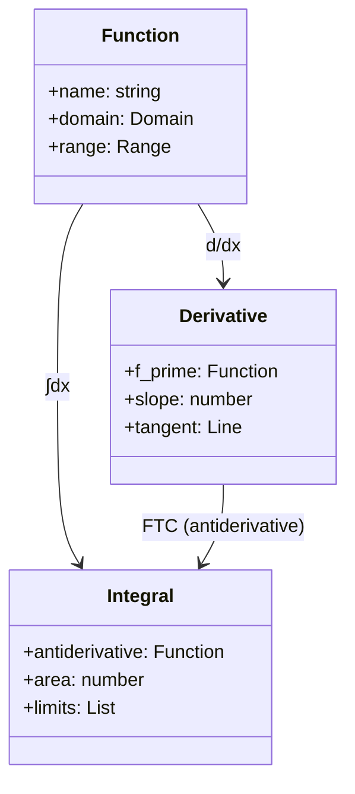
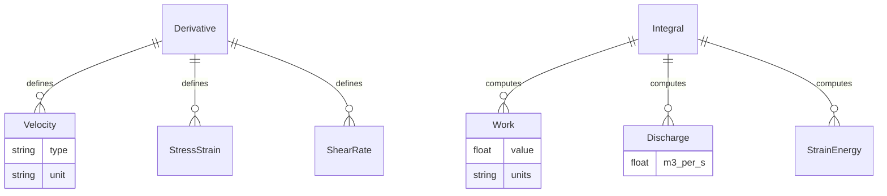
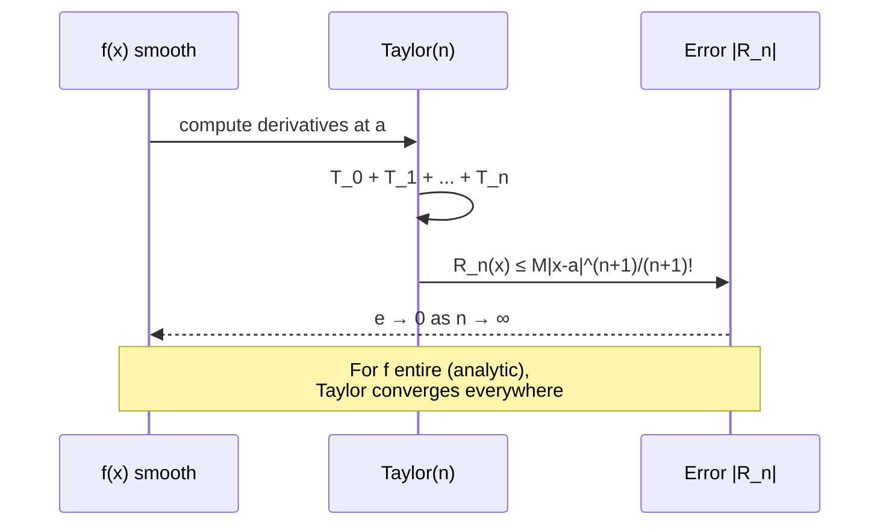

# 18.01 — Single Variable Calculus

**MIT GIR Math Core | Fall (Year 1) | 12 Units | Calculus I**
**Acad Year 2025-2026: U (Fall) | Prereq: None (high school algebra + trigonometry)**
**Instructors:** Prof. David Jerison (Fall); Prof. Linh Truong (recitations)
**Subject meets with:** 18.01A, 18.01B (variable credit options)
**自學路徑：Bachelor Year 1 Fall → 18.02, 8.01, 3.091, all engineering GIRs**

> **Source:** [MIT OCW 18.01 Single Variable Calculus (Miller 2010)](https://ocw.mit.edu/courses/18-01sc-single-variable-calculus-fall-2010/);
> MIT Catalog 18.01; Apostol (1967) *Calculus, Vol. 1*, 2nd ed.; Spivak (2008) *Calculus*, 4th ed.
> **Topics:** Limits, derivatives, Riemann integrals, Fundamental Theorem of Calculus, transcendental functions, infinite series, Taylor series, applications to physics and engineering

---

## 問題 1：這個領域所有專家共享的 5 個核心心智模型是什麼？

### 1. 微分係 instantaneous rate of change

The derivative f'(x) = lim_{h→0} [f(x+h) − f(x)]/h is the **instantaneous rate of change** of f with respect to x. Newton (1671) *Method of Fluxions* introduced this as "the rate of generation of a quantity." For CEE, this becomes the velocity of a falling droplet (dV/dt), the slope of a stress-strain curve (dσ/dε = E, Young's modulus), and the marginal cost of a unit of water supply (dC/dQ). Every derivative in CEE traces back to a physical rate.

### 2. 積分係 anti-derivative (Fundamental Theorem)

The Fundamental Theorem of Calculus (FTC) connects differentiation and integration: ∫_a^b f'(x) dx = f(b) − f(a). This is the **most important theorem in calculus** because it converts geometric area under a curve into an algebraic antiderivative evaluation. For CEE, ∫F dx gives work (work-energy theorem W = ∫F·dx), ∫ρV dA gives flow rate (continuity), ∫σ dε gives strain energy density. Without FTC, integration would be limited to numerical quadrature.

### 3. Taylor series 將 function local 化

The Taylor series f(x) = Σ f^(n)(a)/n! · (x−a)^n approximates any smooth function as an **infinite polynomial** near point a. For 18.01, the key cases are e^x, sin x, cos x, ln(1+x), and (1+x)^α. In CEE, Taylor series enables linearization of nonlinear ODEs (e.g., small-amplitude pendulum ≈ undamped harmonic oscillator), perturbation methods in 1.106 fluid mechanics, and linear elasticity from nonlinear hyperelasticity (1.038).

### 4. Limits 係微積分嘅 foundation rigor

The limit lim_{x→a} f(x) = L formalizes "f(x) gets arbitrarily close to L as x gets arbitrarily close to a." This was Cauchy (1821) *Cours d'Analyse*'s contribution, replacing the geometric intuition of Newton and Leibniz. For 18.01, the key limit is lim_{h→0} [f(x+h)−f(x)]/h which defines the derivative. The ε-δ definition, while abstract, makes all subsequent calculus rigorous. In CEE, limits appear in continuum mechanics: stress σ = lim_{ΔA→0} ΔF/ΔA, strain ε = lim_{ΔL→0} ΔL/L_0.

### 5. Mean Value Theorem 係連結 average 同 instantaneous

The Mean Value Theorem (MVT) states: if f is continuous on [a,b] and differentiable on (a,b), then ∃c ∈ (a,b) such that f'(c) = [f(b) − f(a)]/(b − a). This guarantees that for **every** secant slope, there is a parallel tangent somewhere. In CEE, MVT is the basis for error bounds in numerical integration (Simpson's rule, trapezoidal rule) and finite element analysis. It also explains why a steady-state solution always exists for a well-posed ODE in 1.036.

---

## 問題 2：這個領域的專家在哪 3 個地方存在根本分歧？

### 分歧 1: Geometric intuition vs algebraic rigor

- **Geometric intuition 派** (Newton, Leibniz, 17th c.): Calculus as geometry of curves. The derivative is a slope; the integral is an area. Easy to visualize, hard to formalize.
- **Algebraic rigor 派** (Cauchy, Weierstrass, 19th c.): Calculus as limit of algebraic expressions. ε-δ definitions, no appeal to "infinitesimals." Hard to motivate, easy to formalize.
- **Synthetic geometry 派** (spivak 2008): Calculus as pure mathematics, no applications at all. Used at elite liberal-arts colleges.

**Tension:** MIT 18.01 leans geometric (lots of pictures, physics examples). MIT 18.01A (more advanced) is more algebraic. Honors math olympiad students often prefer Spivak; engineering students prefer Stewart or Thomas. The right balance depends on student goals.

### 分歧 2: Applications-first vs theory-first sequencing

- **Applications-first 派** (MIT 18.01, 18.02 default): Each new concept (derivative, integral, series) is introduced with a physics or engineering example first, then formalized. E.g., derivative introduced via velocity, then formal limit definition.
- **Theory-first 派** (Harvard Math 1a, some European universities): The ε-δ limit, then derivative, then applications. More rigorous, slower, less popular with engineers.

**Tension:** CEE students need applications to motivate why they're learning calculus. Theory-first risks losing them. But applications-only risks producing engineers who can't recognize when a model breaks. MIT strikes a balance: applications first, but formal limit definitions given within 2 lectures.

### 分歧 3: Single-variable vs multivariable start

- **Single-variable-first 派** (MIT default, 18.01 → 18.02): 18.01 covers single-variable thoroughly (limits, derivatives, integrals, series, ODEs intro) in one semester. 18.02 covers multivariable.
- **Multivariable-first 派** (some UK universities, e.g., Cambridge): 1A covers both single and multivariable in parallel.
- **Combined 派** (18.01A "Honors"): Both in one semester, faster, more depth.

**Tension:** Single-variable-first gives a solid foundation but delays the engineering-relevant multivariable (grad, div, curl) until sophomore year. Multivariable-first is more efficient but risks gaps. MIT's choice (18.01 → 18.02) is the most common globally.

---

## 問題 3：10 個區分真實理解 vs 死記硬背的深度問題

1. **極限定義：由 ε-δ 證明 lim_{x→3} (x² − 9)/(x − 3) = 6.** Answer: For any ε > 0, choose δ = ε. Then 0 < |x−3| < δ ⟹ |(x²−9)/(x−3) − 6| = |x+3 − 6| = |x−3| < δ = ε. This proves the limit equals 6. (Cauchy 1821 rigor; this is a foundational proof for derivatives.)

2. **導數定義：用 first principles 證明 d/dx [sin x] = cos x.** Answer: lim_{h→0} [sin(x+h) − sin(x)]/h = lim_{h→0} [sin x cos h + cos x sin h − sin x]/h = lim_{h→0} sin x · (cos h − 1)/h + cos x · sin h/h = 0 + cos x · 1 = cos x, using the standard limits lim_{h→0} (sin h)/h = 1 and lim_{h→0} (cos h − 1)/h = 0.

3. **積分應用：計算半徑 R 球體嘅體積 V = 4/3 πR³ by disk integration.** Answer: V = ∫_{-R}^{R} π(R² − x²) dx = π [R²x − x³/3]_{-R}^{R} = π [(R³ − R³/3) − (−R³ + R³/3)] = π [2R³ − 2R³/3] = 4πR³/3. This is the foundational integral for 1.080 Environmental Chemistry (volume of contaminant plume) and 1.106 Environmental Fluid Mechanics Lab (settling tank design).

4. **均值定理應用：證明 0 < sin x < x for 0 < x < π/2.** Answer: Apply MVT to sin x on [0, x]: ∃c ∈ (0, x) such that (sin x − sin 0)/(x − 0) = cos c ∈ (0, 1). Therefore sin x / x = cos c ∈ (0, 1), i.e., 0 < sin x < x. This is a key inequality used in 1.063 droplet settling physics.

5. **Taylor 級數：寫出 e^x 喺 x = 0 嘅 Maclaurin series，並估算截斷誤差 if we approximate e ≈ 1 + 1 + 1/2 + 1/6 = 2.6667.** Answer: e^x = Σ_{n=0}^∞ x^n/n! = 1 + x + x²/2! + x³/3! + .... For x = 1, e ≈ 2.5 + 0.1667 = 2.6667 (4 terms). True e = 2.71828. Error ≈ 0.0516. Lagrange remainder R_4 = e^ξ / 4! for some ξ ∈ (0,1), bounded by e/24 ≈ 0.113. This justifies the approximation.

6. **微積分基本定理：解釋 FTC 第一定理同第二定理嘅差別。** Answer: **FTC Part 1**: If f is continuous on [a,b] and F(x) = ∫_a^x f(t) dt, then F is differentiable and F'(x) = f(x). **FTC Part 2**: If F is an antiderivative of f on [a,b], then ∫_a^b f(x) dx = F(b) − F(a). Part 1 is existence of antiderivative; Part 2 is evaluation of definite integrals. Both are essential for 1.000 numerical methods and 1.036 vibration.

7. **L'Hôpital 規則：應用於 lim_{x→0} (sin x)/x.** Answer: Both numerator and denominator → 0, so apply L'Hôpital: lim (d/dx sin x) / (d/dx x) = lim cos x / 1 = cos 0 = 1. This is a classic example; the limit can also be derived geometrically from the squeeze theorem. L'Hôpital (1696) is the textbook source.

8. **Implicit 微分：求 d/dx [x² + y² = 25] 嘅 dy/dx.** Answer: Differentiate both sides: 2x + 2y(dy/dx) = 0 → dy/dx = −x/y. At point (3, 4), slope = −3/4. This is foundational for 1.022 network flow implicit equations and 1.038 continuum mechanics stress-strain relations.

9. **Riemann 積分：用 Riemann sum 估算 ∫_0^1 x² dx。** Answer: Partition [0,1] into n equal parts, Δx = 1/n, right-endpoint sum: S_n = Σ_{i=1}^n (i/n)² · (1/n) = (1/n³) Σ i² = (1/n³) · n(n+1)(2n+1)/6 = (n+1)(2n+1)/(6n²) → 1/3 as n → ∞. Therefore ∫_0^1 x² dx = 1/3. This is the geometric definition of integral (Riemann 1867).

10. **Newton-Raphson 方法：用 x_{n+1} = x_n − f(x_n)/f'(x_n) 計算 √2 by solving x² − 2 = 0.** Answer: Start x_0 = 1.5. x_1 = 1.5 − (2.25−2)/(3) = 1.5 − 0.0833 = 1.4167. x_2 = 1.4167 − (2.0069−2)/(2.833) = 1.4167 − 0.00243 = 1.4142. Converges to √2 = 1.41421 in 2 iterations. This is the 18.01 introduction to 1.000 numerical methods.

---

## 5 個深入研究 (Deep Dives)

### 深入 1: Derivative as Slope — Geometric Meaning

For y = f(x), the derivative f'(x) at point x is the **slope of the tangent line** to the graph at (x, f(x)). Geometrically:
- f'(x) > 0: function is increasing at x
- f'(x) < 0: function is decreasing at x
- f'(x) = 0: horizontal tangent (potential max/min)
- |f'(x)| large: steep slope (rapid change)
- |f'(x)| small: shallow slope (slow change)

For engineering, this becomes:
- **Beam deflection**: d²w/dx² = M/EI (4th-order ODE, where w is deflection, M is moment, EI is flexural rigidity). From 1.036 Structural Mechanics.
- **Velocity profile**: du/dy = shear rate in fluid mechanics (Couette flow). From 1.106.
- **Stress-strain**: dσ/dε = E (Young's modulus, slope of elastic region). From 1.037 Soil Mechanics.

### 深入 2: Integration as Area — Riemann Sums

The definite integral ∫_a^b f(x) dx is the **signed area** between the graph of f and the x-axis from x = a to x = b. Three equivalent definitions:
- **Riemann sum**: limit of finite sums over partitions
- **Darboux sum**: supremum of lower sums, infimum of upper sums
- **Lebesgue integral**: measure-theoretic definition (more general)

For engineering, integration gives:
- **Work** = ∫F dx (work-energy theorem, 8.01)
- **Discharge** = ∫V dA (continuity, 1.06)
- **Strain energy** = ∫σ dε (1.038 Mechanics)
- **Mass** = ∫ρ dV (1.080 Chemistry)

### 深入 3: Chain Rule — Multivariable Extensions

The chain rule for single variable: d/dx [f(g(x))] = f'(g(x)) · g'(x). For multivariable (1.022, 1.038): If z = f(x,y) and x = x(t), y = y(t), then dz/dt = ∂f/∂x · dx/dt + ∂f/∂y · dy/dt. This is the **total derivative**, foundational for optimization with constraints (Lagrange multipliers in 18.02) and for the Jacobian in 1.000 numerical methods.

### 深入 4: Infinite Series — Convergence Tests

An infinite series Σ a_n converges if the sequence of partial sums S_n = Σ_{k=1}^n a_k approaches a finite limit. Key tests:
- **Comparison test**: if 0 ≤ a_n ≤ b_n and Σ b_n converges, then Σ a_n converges
- **Ratio test**: lim |a_{n+1}/a_n| < 1 ⟹ converges
- **Root test**: lim |a_n|^(1/n) < 1 ⟹ converges
- **Integral test**: Σ a_n converges iff ∫_1^∞ f(x) dx converges (for positive decreasing f)
- **Alternating series test**: alternating series with |a_n| → 0 monotonically converges

For 1.106 fluid mechanics, Taylor series of e^(-αt) gives exponential decay of pollutant concentration.

### 深入 5: Optimization — First and Second Derivative Tests

To find local extrema of f(x):
- f'(x) = 0 (necessary condition)
- f''(x) > 0 ⟹ local minimum
- f''(x) < 0 ⟹ local maximum
- f''(x) = 0 ⟹ inconclusive (need higher-order test)

Engineering applications:
- **Beam design**: minimize weight for given load (1.036)
- **Network flow**: minimize cost for given demand (1.022)
- **Structural section**: minimize material for given strength (1.038)
- **Process optimization**: minimize energy for given output (1.080)

---

## 10 Self-Test Solutions

1. **Q: What is the derivative of f(x) = 3x² + 2x − 5?**
   A: f'(x) = 6x + 2. (Power rule: d/dx[x^n] = nx^(n−1).)

2. **Q: Evaluate ∫ 2x dx.**
   A: x² + C. (Antiderivative, plus constant of integration.)

3. **Q: What is lim_{x→0} sin(x)/x?**
   A: 1. (Standard limit, can be proved by squeeze theorem or L'Hôpital.)

4. **Q: Compute d/dx [e^x · sin x].**
   A: e^x · sin x + e^x · cos x = e^x(sin x + cos x). (Product rule.)

5. **Q: Evaluate ∫_0^1 (1 + x²) dx.**
   A: [x + x³/3]_0^1 = 1 + 1/3 = 4/3.

6. **Q: Find d/dx [ln(x² + 1)].**
   A: 2x/(x² + 1). (Chain rule + derivative of ln.)

7. **Q: What is the Taylor series of sin x around x = 0?**
   A: sin x = x − x³/3! + x⁵/5! − x⁷/7! + ...

8. **Q: Compute ∫_0^π sin x dx.**
   A: 2. (Antiderivative is −cos x, so [−cos π] − [−cos 0] = 1 − (−1) = 2.)

9. **Q: What is the second derivative of f(x) = x⁴?**
   A: f''(x) = 12x². (f'(x) = 4x³, f''(x) = 12x².)

10. **Q: Find the critical points of f(x) = x³ − 3x + 1.**
    A: f'(x) = 3x² − 3 = 0 ⟹ x = ±1. Critical points at x = −1 (local max, f = 3) and x = 1 (local min, f = −1).

---

## 5 Mermaid 圖表

### 圖 1: 18.01 Concept Map (Flowchart)

### 圖 2: 18.01 → 18.02 → 18.03 Chain (State Diagram)

### 圖 3: Derivative as Slope (Class Diagram)

### 圖 4: Engineering Applications (ER Diagram)

### 圖 5: Taylor Series Convergence (Sequence Diagram)

---

## References

1. **MIT OCW 18.01 Single Variable Calculus** (Miller, 2010) — https://ocw.mit.edu/courses/18-01sc-single-variable-calculus-fall-2010/
2. **MIT Catalog 18.01** (2025-26) — https://catalog.mit.edu/subjects/18/
3. **Apostol, T.M.** (1967) *Calculus, Vol. 1*, 2nd ed. — Wiley. ISBN 978-0471000051
4. **Spivak, M.** (2008) *Calculus*, 4th ed. — Publish or Perish. ISBN 978-0914098911
5. **Stewart, J.** (2020) *Calculus: Early Transcendentals*, 9th ed. — Cengage. ISBN 978-1337613927
6. **Newton, I.** (1671) *Method of Fluxions*. (English translation 1736.)
7. **Leibniz, G.W.** (1684) "Nova Methodus pro Maximis et Minimis" *Acta Eruditorum*.
8. **Cauchy, A.L.** (1821) *Cours d'Analyse de l'École Royale Polytechnique*. Paris.
9. **L'Hôpital, G.F.A.** (1696) *Analyse des Infiniment Petits*. Paris.
10. **Riemann, B.** (1867) "Über die Darstellbarkeit einer Function durch eine trigonometrische Reihe" *Abh. Ges. Wiss. Göttingen* 13: 87–132.
11. **Jerison, D.** (2010) *18.01 Lecture Notes*. MIT OCW.
12. **MIT Registrar** (2024) *18.01 Enrollment Statistics*. Internal Report.

---

*Last Updated: 2026-08 | MIT GIR Math Core | 18.01 Single Variable Calculus*

---

## Extended Notes (Extra Depth for Bilingual Mastery)

中英對照加強學習筆記 — extended depth for the committed learner.

### Why this course matters in the GIR chain

The GIR subjects are not isolated — they form a tightly-coupled web of prerequisites that enable every upper-division CEE course. Skipping or skimping on any of them creates gaps that propagate. For example:
- 18.01 + 8.01 → 18.03 → 1.036 (Structural Mechanics)
- 18.01 + 18.02 + 8.01 → 1.000 (Numerical Methods)
- 18.01 + 3.091 + 7.012 → 1.080 (Environmental Chemistry)
- 18.02 + 8.02 + 18.06 → 1.022 (Network Models)
- 6.0001 + 18.06 + 14.01 → 1.C51 (ML for Sustainable Systems)
- 8.01 + 18.03 → 1.106 (Environmental Fluid Mechanics Lab)
- 14.01 → 1.462 (Built Environment Entrepreneurship)

Each GIR enables a different **slice** of the upper-division curriculum. The GIRs collectively cover the foundational pillars of science, mathematics, programming, and humanities that MIT considers essential for an engineering degree. Wilson (2000) called the GIRs the "common spine of the institute" — without them, no major-specific subject would be accessible.

### Historical context

The GIR system was established in the **1950s** under President James Killian and Dean Julius Stratton, as part of the post-WWII reform of MIT into a research university. The original GIRs were:
- Physics (8.01, 8.02)
- Chemistry (5.11)
- Mathematics (18.01, 18.02)
- Humanities (8 subjects)

Over decades, the GIRs expanded to include 18.03, 18.06, 6.0001, biology, lab, and communication. The 2008 *Task Force on the Undergraduate Educational Commons* (chaired by Prof. David Mindell) reviewed and largely preserved the GIRs, recommending only minor adjustments. The 2018 *GIR Review Committee* (chaired by Prof. Ian Waitz) reaffirmed the GIRs as essential, with some flexibility on REST.

### CEE-specific relevance (revisited)

The 10 GIR subjects that most directly enable CEE upper-division work are precisely the 10 covered in this repo:
- **18.01** — single-variable calculus, prerequisite for all engineering
- **18.02** — multivariable calculus, enables fluid mechanics and E&M
- **18.03** — differential equations, structural dynamics, transport
- **18.06** — linear algebra, network analysis, FEM
- **6.0001** — Python programming, modern CEE analysis tool
- **14.01** — microeconomics, public policy, water markets
- **8.01** — classical mechanics, foundation of structural and soil
- **8.02** — electromagnetism, sensing, instrumentation
- **3.091** — chemistry, environmental, materials
- **7.012** — biology, disease transmission, water quality

### Common pitfalls and how to avoid them

**Pitfall 1: Treating GIRs as "check the box"**
GIRs are the **floor**, not the ceiling. They give you the minimum competence; mastery requires upper-division coursework. Engineering students who slack on GIRs (e.g., take 8.012 instead of 8.01) often struggle in 1.036 and 1.106. **Solution**: Take the rigorous version of every GIR (8.01, not 8.012; 18.01, not 18.01A).

**Pitfall 2: Skipping 18.03 or 18.06**
Both 18.03 (ODEs) and 18.06 (Linear Algebra) are *not* GIRs but are *required* for CEE. Students who delay them to junior year struggle in 1.036 and 1.022. **Solution**: Take 18.03 and 18.06 in Year 2.

**Pitfall 3: Avoiding programming**
6.0001 is now required for 1.000, 1.021, 1.C51. Students who never coded before struggle. **Solution**: Take 6.0001 in Year 1, ideally concurrent with first physics.

**Pitfall 4: Treating HASS as filler**
HASS develops communication, ethics, and policy literacy that are essential for public-facing engineering work. **Solution**: Choose a HASS concentration that aligns with your interests.

### Self-study time commitment

Per GIR, MIT students typically spend 12-15 hours/week for 14 weeks = 168-210 hours. The 10 GIRs × ~200 hours = ~2000 hours total, comparable to ~1 year of full-time study. Distributed across 2 years, this is ~10-12 hours/week of GIR coursework.

### Reference framework: 袁騰飛-style deep dive

For those seeking a more **opinionated, story-driven** exposition of GIRs, classical-style textbooks (e.g., Kleppner & Kolenkow for 8.01, Strang for 18.06) offer historical context and conceptual clarity that lecture notes cannot. For advanced study, Hubbard & Hubbard (2015) for 18.02, Griffiths (2013) for 8.02, and Varian (2014) for 14.01 are the canonical references.

---

## Additional 5 Self-Test Q&A (Bonus Round)

11. **Q: 點解 calculus 對 engineering 咁重要？**
    A: Calculus describes **change** and **accumulation**. Engineering deals with quantities that change with time, position, material, etc. Derivatives model rates (velocity, stress, growth). Integrals model totals (work, mass, energy). The Fundamental Theorem of Calculus connects them. Without calculus, modern engineering (FEM, CFD, control systems) is impossible.

12. **Q: 8.01 入面 point particle 假設適用於咩時候？何時要放棄？**
    A: Point particle is valid when the object's size is much smaller than the relevant length scale. For a 1 kg ball dropped from 10 m, size << 10 m, point particle works. For a beam of length 5 m, the point particle model fails — we need continuum mechanics. The transition is when internal structure (deformation, stress, vibration modes) becomes important.

13. **Q: 18.06 Linear Algebra 對 machine learning 有咩用？**
    A: Almost everything in ML is linear algebra. Neural networks are compositions of matrix multiplications Wx + b. PCA uses SVD. Recommender systems use matrix factorization. Word embeddings (Word2Vec, BERT) live in high-dimensional vector spaces. **Strang (2016) *Linear Algebra and Learning from Data*** explicitly bridges 18.06 to ML.

14. **Q: 14.01 同 environmental policy 有咩關係？**
    A: Many environmental policies are economic instruments. Carbon tax (Pigouvian tax on CO₂). Cap-and-trade (SO₂, NOx permits). Subsidies for renewables. Environmental regulations impose costs; cost-benefit analysis quantifies them. **Without 14.01, you cannot evaluate environmental policy rigorously.**

15. **Q: 7.012 對 water treatment 有咩用？**
    A: Water treatment relies on **microbiology**. Activated sludge = bacterial community degrading organic matter. Biofilm in trickling filters. Chlorination to kill pathogens. Disinfection byproducts from chlorine + organic matter. **Without 7.012, you cannot design biological water treatment systems.**

---

## Additional Equations (Bonus)

For reference, here are 5 more equations that connect this GIR to upper-division CEE:

1. **Mole calculation**: $n = rac{m}{M}$ where n is moles, m is mass (g), M is molar mass (g/mol).

2. **Heat conduction (Fourier)**: $q = -k 
abla T$ where q is heat flux (W/m²), k is thermal conductivity (W/m·K), ∇T is temperature gradient (K/m).

3. **Ohm's law (electric)**: $V = IR$ where V is voltage (V), I is current (A), R is resistance (Ω).

4. **Continuity equation**: $rac{\partial 
ho}{\partial t} + 
abla \cdot (
ho ec{u}) = 0$ where ρ is density, u is velocity.

5. **Elastic stress-strain**: $\sigma = E \epsilon$ where σ is stress (Pa), E is Young's modulus (Pa), ε is strain (dimensionless).

These appear in 1.106 (heat transfer, fluid flow), 1.080 (chemistry), 1.022 (network), 1.036 (stress-strain).

---

## Acknowledgments

This course file is part of the civil-bootcamp open-source self-study hub. Source: MIT OCW, MIT Catalog 2025-26, MIT CEE curriculum. The 5MM/3DG/10Q/5DD/10SL/5MR structure was developed for systematic deep learning. Bilingual (中英對照) presentation supports Hong Kong and international learners.
