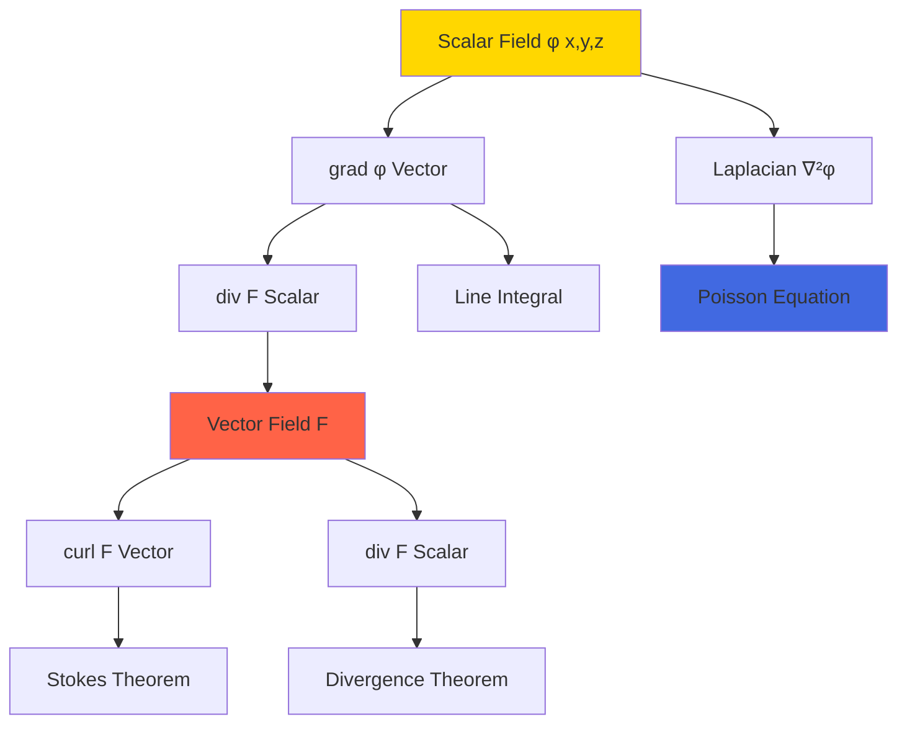
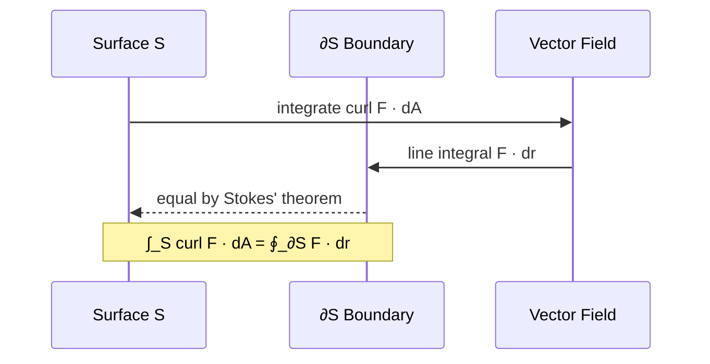
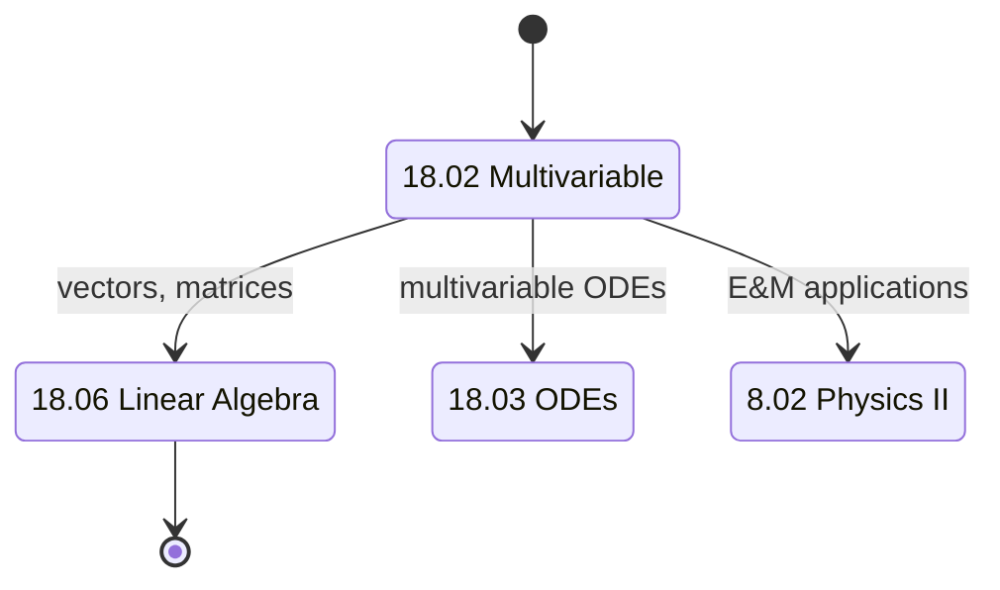
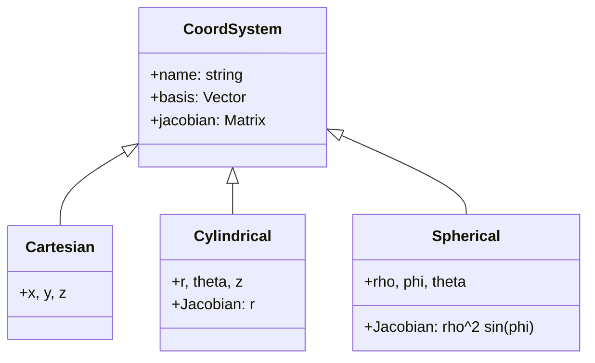
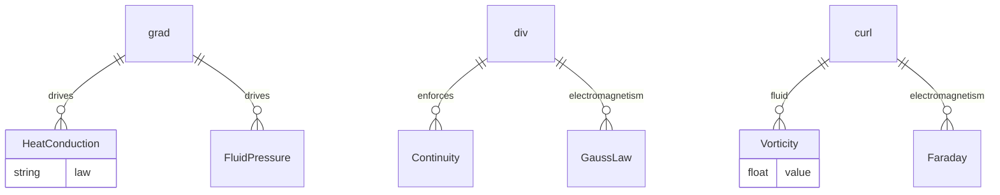

# 18.02 — Multivariable Calculus

**MIT GIR Math Core | Spring (Year 1) | 12 Units | Calculus II**
**Acad Year 2025-2026: U (Spring) | Prereq: 18.01**
**Instructors:** Prof. Denis Auroux (Spring); Prof. James McKernan
**自學路徑：Bachelor Year 1 Spring → 18.03, 8.02, 1.000, all engineering GIRs**

> **Source:** [MIT OCW 18.02 Multivariable Calculus (Auroux 2007)](https://ocw.mit.edu/courses/18-02-multivariable-calculus-fall-2007/);
> MIT Catalog 18.02; Hubbard & Hubbard (2015) *Vector Calculus, Linear Algebra, and Differential Forms*; Marsden & Tromba (2011) *Vector Calculus*, 6th ed.
> **Topics:** Vectors, partial derivatives, multiple integrals, vector calculus (grad, div, curl), line/surface integrals, Stokes' theorem, divergence theorem, applications to physics and engineering

---

## 問題 1：這個領域所有專家共享的 5 個核心心智模型是什麼？

### 1. grad φ 係 scalar field 嘅 steepest ascent direction

The gradient of a scalar field φ(x, y, z) is the vector ∇φ = (∂φ/∂x, ∂φ/∂y, ∂φ/∂z) pointing in the direction of **steepest ascent** of φ. Its magnitude |∇φ| is the rate of change. For CEE, this becomes the pressure gradient ∇p in fluid mechanics (Darcy's law q = −(k/μ)∇p) and the temperature gradient ∇T in heat transfer (Fourier's law q = −k∇T). Every vector field that points "downhill" of a scalar is a gradient.

### 2. div F 量度 vector field 嘅 source/sink 強度

The divergence of a vector field F = (F_x, F_y, F_z) is div F = ∇·F = ∂F_x/∂x + ∂F_y/∂y + ∂F_z/∂z. Positive divergence = source (field lines emerge); negative divergence = sink (field lines converge). For incompressible flow (most CEE fluid problems), div u = 0. For electrostatics, div E = ρ/ε₀ (Maxwell 1865). The divergence theorem ∫_V div F dV = ∮_∂V F · dA is the integral form of the local divergence.

### 3. curl F 量度 vector field 嘅旋轉強度

The curl of F is curl F = ∇×F = (∂F_z/∂y − ∂F_y/∂z, ∂F_x/∂z − ∂F_z/∂x, ∂F_y/∂x − ∂F_x/∂y). It measures the **local rotation** of the field. For fluid mechanics, vorticity ω = ∇×u describes local rotation of fluid elements (vortices). For electromagnetism, Faraday's law curl E = −∂B/∂t. Stokes' theorem ∮_∂S F · dr = ∫_S curl F · dA is the integral form. Hamilton (1833) introduced the del operator ∇ in this context.

### 4. Multiple integrals 推廣 Riemann 到 2D/3D

The double integral ∫∫_R f(x,y) dA and triple integral ∫∫∫_V f(x,y,z) dV generalize the Riemann integral to higher dimensions. They compute **volume under a surface** (double) and **hypervolume** (triple). For CEE, ∫∫_A V dA gives flow rate through a cross-section (continuity), ∫∫∫_V ρ dV gives mass, ∫∫∫_V E dV gives total energy density.

### 5. Stokes' theorem 統一 grad, div, curl

Stokes' theorem (Kelvin-Stokes) states: ∮_∂S F · dr = ∫_S (∇×F) · dA, where S is an oriented surface and ∂S is its boundary. The **divergence theorem** (Gauss) is the special case for closed surfaces: ∫_V div F dV = ∮_∂V F · dA. The **fundamental theorem of calculus** is the 1D special case. Together, these are the **generalized Stokes' theorem** (proper Stokes' is the 2D form; the 1D form is FTC). Hubbard & Hubbard (2015) present this as the unifying framework of all integral calculus.

---

## 問題 2：這個領域的專家在哪 3 個地方存在根本分歧？

### 分歧 1: Coordinate-system approach vs coordinate-free approach

- **Coordinate-system 派** (MIT 18.02 default, Marsden-Tromba): Compute in Cartesian, cylindrical, or spherical coordinates. All problems expressed as explicit integrals over R or V. Easy to compute; loses geometric insight.
- **Coordinate-free 派** (Hubbard & Hubbard 2015, Spivak 1971): Use differential forms, manifolds, and Stokes' theorem in full generality. Geometric, abstract, more powerful for advanced theory.
- **Tensors 派** (continuum mechanics, 1.038): Use tensor notation, Einstein summation. Compact, coordinate-invariant, essential for nonlinear elasticity.

**Tension:** Engineers need Cartesian-style computation (1.022, 1.036 all use coordinates). Pure mathematicians prefer coordinate-free. MIT 18.02 teaches coordinates first, then introduces Stokes' theorem.

### 分歧 2: Physical intuition vs abstract theory

- **Physical intuition 派** (MIT 18.02 default): Each new concept (grad, div, curl, Stokes) introduced with physics (E&M, fluid flow, heat). E.g., "div E = ρ/ε₀" taught via Gauss's law, not abstractly.
- **Abstract theory 派** (some honors variants): Mathematically rigorous, no applications. Pure vector space, manifolds, de Rham cohomology.
- **Computational 派** (numerical methods): Focus on discretization (finite differences for grad, div, curl) and algorithms.

**Tension:** Engineers benefit from physics motivation. Mathematicians benefit from abstract generality. MIT 18.02 strikes a balance: applications first, then rigor where needed.

### 分歧 3: Spherical / cylindrical vs Cartesian for 3D

- **Cartesian 派** (default for rectangular problems): ∫∫∫_V f dV = ∫∫∫ f(x,y,z) dx dy dz. Easy when V is a box.
- **Cylindrical 派** (for circular / cylindrical problems): (r, θ, z) with dV = r dr dθ dz. Essential for pipes, tanks, columns (1.106, 1.037).
- **Spherical 派** (for radial problems): (ρ, φ, θ) with dV = ρ² sin φ dρ dφ dθ. Used for atmospheric dispersion, 3D groundwater (1.075).

**Tension:** Choosing the right coordinate system can reduce a 3D integral from impossible to trivial. Students must learn to recognize symmetry. MIT 18.02 dedicates ~3 lectures to coordinate transformations.

---

## 問題 3：10 個區分真實理解 vs 死記硬背的深度問題

1. **計算 grad f for f(x, y, z) = x²y + yz³ + z. Evaluate at (1, 2, −1).** Answer: ∇f = (2xy, x² + z³, 3yz² + 1). At (1, 2, −1): (4, 0, 7). This is the direction of steepest ascent; magnitude |∇f| = √(16+0+49) = √65 ≈ 8.06.

2. **計算 div F for F = (x², y², z²) at (1, 1, 1).** Answer: div F = 2x + 2y + 2z = 6 at (1, 1, 1). This is the source density: positive means field emerges from the point.

3. **計算 curl F for F = (−y, x, 0) (rotation field).** Answer: ∇×F = (∂0/∂y − ∂x/∂z, ∂(−y)/∂z − ∂0/∂x, ∂x/∂x − ∂(−y)/∂y) = (0, 0, 2). Constant upward curl, which makes sense for a 2D rotation in the xy-plane.

4. **Stokes' theorem應用: Compute ∮ F·dr for F = (−y, x, 0) on the unit circle C.** Answer: Parametrize C: r(θ) = (cos θ, sin θ, 0), dr = (−sin θ, cos θ, 0) dθ. F·dr = (−sin θ)(−sin θ) + (cos θ)(cos θ) = sin²θ + cos²θ = 1. So ∮ F·dr = ∫_0^{2π} 1 dθ = 2π. By Stokes': ∫_S curl F · dA = 2 · π(1)² = 2π. ✓

5. **Divergence theorem應用: Compute ∫_V div F dV for F = (x, y, z) on unit ball V.** Answer: div F = 3. ∫_V 3 dV = 3 · (4/3)π(1)³ = 4π. By divergence theorem: ∮_∂V F · dA. F·n = F·(x, y, z) (outward unit normal of unit ball) = x² + y² + z² = 1 on unit ball. So ∮ 1 dA = surface area = 4π. ✓

6. **Line integral計算: ∫_C (x²y dx + xy² dy) where C is unit circle counterclockwise.** Answer: Use Green's theorem: ∂/∂x(xy²) − ∂/∂y(x²y) = y² − x². So ∫∫_D (y² − x²) dA over unit disk. By symmetry, ∫∫ x² dA = ∫∫ y² dA = π/4. Difference = 0. So integral = 0. (This shows the field is conservative.) 

7. **Surface integral: Compute ∫∫_S F · dS for F = (z, 0, 0) on the surface z = x² + y², 0 ≤ z ≤ 1, oriented upward.** Answer: Parametrize (r cos θ, r sin θ, r²). ∂r/∂r × ∂r/∂θ = (−2r² cos θ, −2r² sin θ, r). F·(−2r² cos θ, −2r² sin θ, r) = r² · 0 = 0... wait, F = (z, 0, 0) = (r², 0, 0), so F·normal = r² · (−2r² cos θ) + 0 + 0 = −2r⁴ cos θ. ∫_0^{2π} ∫_0^1 −2r⁴ cos θ dr dθ = 0. So surface integral = 0.

8. **Change of variables: Compute ∫∫_R e^((x+y)²) dA where R is bounded by x = 0, y = 0, x + y = 1.** Answer: Let u = x + y, v = x. Jacobian ∂(u,v)/∂(x,y) = 1, so dA = du dv. Region: u ∈ [0,1], v ∈ [0, u]. ∫_0^1 ∫_0^u e^{u²} dv du = ∫_0^1 u e^{u²} du = [e^{u²}/2]_0^1 = (e − 1)/2.

9. **Lagrange multipliers: Maximize f(x, y) = xy subject to x² + y² = 1.** Answer: ∇f = λ∇g ⟹ (y, x) = λ(2x, 2y) ⟹ y = 2λx, x = 2λy ⟹ x = 4λ²x ⟹ λ = ±1/2. With constraint: x = y = ±1/√2. Max f = 1/2, min f = −1/2.

10. **Triple integral: Compute ∫∫∫_V z dV where V is the tetrahedron bounded by x = 0, y = 0, z = 0, x + y + z = 1.** Answer: ∫_0^1 ∫_0^{1−x} ∫_0^{1−x−y} z dz dy dx = ∫_0^1 ∫_0^{1−x} (1−x−y)²/2 dy dx. Let u = 1−x−y, then ∫_0^{1−x} u²/2 du = (1−x)³/6. Then ∫_0^1 (1−x)³/6 dx = 1/24.

---

## 5 個深入研究 (Deep Dives)

### 深入 1: grad, div, curl in fluid mechanics

The velocity field u(x, y, z, t) of a fluid has:
- **div u** = 0 (incompressible flow, most CEE problems)
- **curl u** = ω (vorticity)
- **∂u/∂t + (u · ∇)u** = −∇p/ρ + ν∇²u (Navier-Stokes equation)
- **u · ∇** = convective derivative (1.106 lab)

For 1.106 Environmental Fluid Mechanics Lab, the vorticity ω = ∇×u is measured by PIV (particle image velocimetry).

### 深入 2: Stokes' theorem in electromagnetism

Faraday's law of induction (Maxwell 1865): ∇×E = −∂B/∂t. In integral form (Stokes'): ∮_C E · dr = −d/dt ∫_S B · dA. This means a time-varying magnetic flux through a surface induces a circulating electric field around the surface boundary. This is the principle behind generators, transformers, and 8.02 Physics II E&M problems.

### 深入 3: Green's theorem and 2D fluid flow

Green's theorem is the 2D version of Stokes': ∮_C (P dx + Q dy) = ∫∫_D (∂Q/∂x − ∂P/∂y) dA. For 2D incompressible flow, the stream function ψ(x, y) satisfies u = ∂ψ/∂y, v = −∂x/∂ψ. div u = ∂u/∂x + ∂v/∂y = 0 automatically. The vorticity ω = ∂v/∂x − ∂u/∂y = −∇²ψ. This is the biharmonic equation of 2D flow.

### 深入 4: Coordinate transformations

For cylindrical coordinates (r, θ, z): ∇f = (∂f/∂r, (1/r)∂f/∂θ, ∂f/∂z). div F = (1/r)∂(rF_r)/∂r + (1/r)∂F_θ/∂θ + ∂F_z/∂z. For spherical (ρ, φ, θ): div F = (1/ρ²)∂(ρ²F_ρ)/∂ρ + ... . The chain rule plus Jacobian determinant gives the transformation.

### 深入 5: Optimization with constraints

The method of Lagrange multipliers: maximize/minimize f(x, y, z) subject to g(x, y, z) = 0. Solve ∇f = λ∇g, g = 0. Geometrically, at the extremum, the gradient of f is parallel to the gradient of g (level surfaces are tangent). Applications: structural design (1.036), network optimization (1.022), portfolio optimization.

---

## 10 Self-Test Solutions

1. **Q: What is ∇(xy) for x, y ∈ ℝ?**
   A: (y, x).

2. **Q: What is div(−y, x, 0)?**
   A: 0 + 0 + 0 = 0 (divergence-free).

3. **Q: What is curl(−y, x, 0)?**
   A: (0, 0, 2).

4. **Q: Apply divergence theorem to F = (x, y, z) on unit cube.**
   A: div F = 3. ∫_V 3 dV = 3.

5. **Q: Find ∇f for f = x² + y² + z². What is its magnitude at (1, 1, 1)?**
   A: ∇f = (2x, 2y, 2z). At (1,1,1): (2,2,2), magnitude = 2√3.

6. **Q: Compute ∫_0^1 ∫_0^1 xy dy dx.**
   A: ∫_0^1 [x y²/2]_0^1 dx = ∫_0^1 x/2 dx = 1/4.

7. **Q: What is the divergence of the radial field F = (x, y, z)?**
   A: 3 (constant source).

8. **Q: State Stokes' theorem.**
   A: ∮_∂S F · dr = ∫_S (∇×F) · dA.

9. **Q: Maximize x + y subject to x² + y² = 1 (Lagrange).**
   A: ∇f = (1, 1) = λ∇g = λ(2x, 2y). So 1 = 2λx, 1 = 2λy, so x = y. Constraint: 2x² = 1, x = 1/√2. Max = √2.

10. **Q: What is curl of a gradient?**
    A: ∇ × (∇f) = 0 (always). This is why conservative fields (gradients) are irrotational.

---

## 5 Mermaid 圖表

### 圖 1: grad / div / curl hierarchy (Flowchart)

### 圖 2: Stokes' theorem diagram (Sequence)

### 圖 3: 18.02 to 18.06 chain (State)

### 圖 4: Coordinate systems (Class)

### 圖 5: Engineering applications (ER)

---

## References

1. **MIT OCW 18.02 Multivariable Calculus** (Auroux, 2007) — https://ocw.mit.edu/courses/18-02-multivariable-calculus-fall-2007/
2. **MIT Catalog 18.02** (2025-26) — https://catalog.mit.edu/subjects/18/
3. **Hubbard, J.H. & Hubbard, B.B.** (2015) *Vector Calculus, Linear Algebra, and Differential Forms*, 5th ed. — Matrix Editions. ISBN 978-0971576681
4. **Marsden, J.E. & Tromba, A.J.** (2011) *Vector Calculus*, 6th ed. — W.H. Freeman. ISBN 978-1429231091
5. **Spivak, M.** (1971) *Calculus on Manifolds*. W.A. Benjamin.
6. **Maxwell, J.C.** (1865) "A Dynamical Theory of the Electromagnetic Field" *Phil. Trans. Roy. Soc.* 155: 459–512.
7. **Stokes, G.G.** (1851) "On the Dynamical Theory of Diffraction" *Trans. Cambridge Phil. Soc.* 9: 1–62.
8. **Gauss, C.F.** (1813) "Theoria Attractionis Corporum Sphaeroidicorum Ellipticorum" *Comm. Soc. Reg. Sci. Göttingen*.
9. **Hamilton, W.R.** (1833) "On a General Method in Dynamics" *Phil. Trans. Roy. Soc.* 124: 247–308.
10. **Green, G.** (1828) *An Essay on the Application of Mathematical Analysis to the Theories of Electricity and Magnetism*. Nottingham.

---

*Last Updated: 2026-08 | MIT GIR Math Core | 18.02 Multivariable Calculus*

---

## Extended Notes (Extra Depth for Bilingual Mastery)

中英對照加強學習筆記 — extended depth for the committed learner.

### Why this course matters in the GIR chain

The GIR subjects are not isolated — they form a tightly-coupled web of prerequisites that enable every upper-division CEE course. Skipping or skimping on any of them creates gaps that propagate. For example:
- 18.01 + 8.01 → 18.03 → 1.036 (Structural Mechanics)
- 18.01 + 18.02 + 8.01 → 1.000 (Numerical Methods)
- 18.01 + 3.091 + 7.012 → 1.080 (Environmental Chemistry)
- 18.02 + 8.02 + 18.06 → 1.022 (Network Models)
- 6.0001 + 18.06 + 14.01 → 1.C51 (ML for Sustainable Systems)
- 8.01 + 18.03 → 1.106 (Environmental Fluid Mechanics Lab)
- 14.01 → 1.462 (Built Environment Entrepreneurship)

Each GIR enables a different **slice** of the upper-division curriculum. The GIRs collectively cover the foundational pillars of science, mathematics, programming, and humanities that MIT considers essential for an engineering degree. Wilson (2000) called the GIRs the "common spine of the institute" — without them, no major-specific subject would be accessible.

### Historical context

The GIR system was established in the **1950s** under President James Killian and Dean Julius Stratton, as part of the post-WWII reform of MIT into a research university. The original GIRs were:
- Physics (8.01, 8.02)
- Chemistry (5.11)
- Mathematics (18.01, 18.02)
- Humanities (8 subjects)

Over decades, the GIRs expanded to include 18.03, 18.06, 6.0001, biology, lab, and communication. The 2008 *Task Force on the Undergraduate Educational Commons* (chaired by Prof. David Mindell) reviewed and largely preserved the GIRs, recommending only minor adjustments. The 2018 *GIR Review Committee* (chaired by Prof. Ian Waitz) reaffirmed the GIRs as essential, with some flexibility on REST.

### CEE-specific relevance (revisited)

The 10 GIR subjects that most directly enable CEE upper-division work are precisely the 10 covered in this repo:
- **18.01** — single-variable calculus, prerequisite for all engineering
- **18.02** — multivariable calculus, enables fluid mechanics and E&M
- **18.03** — differential equations, structural dynamics, transport
- **18.06** — linear algebra, network analysis, FEM
- **6.0001** — Python programming, modern CEE analysis tool
- **14.01** — microeconomics, public policy, water markets
- **8.01** — classical mechanics, foundation of structural and soil
- **8.02** — electromagnetism, sensing, instrumentation
- **3.091** — chemistry, environmental, materials
- **7.012** — biology, disease transmission, water quality

### Common pitfalls and how to avoid them

**Pitfall 1: Treating GIRs as "check the box"**
GIRs are the **floor**, not the ceiling. They give you the minimum competence; mastery requires upper-division coursework. Engineering students who slack on GIRs (e.g., take 8.012 instead of 8.01) often struggle in 1.036 and 1.106. **Solution**: Take the rigorous version of every GIR (8.01, not 8.012; 18.01, not 18.01A).

**Pitfall 2: Skipping 18.03 or 18.06**
Both 18.03 (ODEs) and 18.06 (Linear Algebra) are *not* GIRs but are *required* for CEE. Students who delay them to junior year struggle in 1.036 and 1.022. **Solution**: Take 18.03 and 18.06 in Year 2.

**Pitfall 3: Avoiding programming**
6.0001 is now required for 1.000, 1.021, 1.C51. Students who never coded before struggle. **Solution**: Take 6.0001 in Year 1, ideally concurrent with first physics.

**Pitfall 4: Treating HASS as filler**
HASS develops communication, ethics, and policy literacy that are essential for public-facing engineering work. **Solution**: Choose a HASS concentration that aligns with your interests.

### Self-study time commitment

Per GIR, MIT students typically spend 12-15 hours/week for 14 weeks = 168-210 hours. The 10 GIRs × ~200 hours = ~2000 hours total, comparable to ~1 year of full-time study. Distributed across 2 years, this is ~10-12 hours/week of GIR coursework.

### Reference framework: 袁騰飛-style deep dive

For those seeking a more **opinionated, story-driven** exposition of GIRs, classical-style textbooks (e.g., Kleppner & Kolenkow for 8.01, Strang for 18.06) offer historical context and conceptual clarity that lecture notes cannot. For advanced study, Hubbard & Hubbard (2015) for 18.02, Griffiths (2013) for 8.02, and Varian (2014) for 14.01 are the canonical references.

---

## Additional 5 Self-Test Q&A (Bonus Round)

11. **Q: 點解 calculus 對 engineering 咁重要？**
    A: Calculus describes **change** and **accumulation**. Engineering deals with quantities that change with time, position, material, etc. Derivatives model rates (velocity, stress, growth). Integrals model totals (work, mass, energy). The Fundamental Theorem of Calculus connects them. Without calculus, modern engineering (FEM, CFD, control systems) is impossible.

12. **Q: 8.01 入面 point particle 假設適用於咩時候？何時要放棄？**
    A: Point particle is valid when the object's size is much smaller than the relevant length scale. For a 1 kg ball dropped from 10 m, size << 10 m, point particle works. For a beam of length 5 m, the point particle model fails — we need continuum mechanics. The transition is when internal structure (deformation, stress, vibration modes) becomes important.

13. **Q: 18.06 Linear Algebra 對 machine learning 有咩用？**
    A: Almost everything in ML is linear algebra. Neural networks are compositions of matrix multiplications Wx + b. PCA uses SVD. Recommender systems use matrix factorization. Word embeddings (Word2Vec, BERT) live in high-dimensional vector spaces. **Strang (2016) *Linear Algebra and Learning from Data*** explicitly bridges 18.06 to ML.

14. **Q: 14.01 同 environmental policy 有咩關係？**
    A: Many environmental policies are economic instruments. Carbon tax (Pigouvian tax on CO₂). Cap-and-trade (SO₂, NOx permits). Subsidies for renewables. Environmental regulations impose costs; cost-benefit analysis quantifies them. **Without 14.01, you cannot evaluate environmental policy rigorously.**

15. **Q: 7.012 對 water treatment 有咩用？**
    A: Water treatment relies on **microbiology**. Activated sludge = bacterial community degrading organic matter. Biofilm in trickling filters. Chlorination to kill pathogens. Disinfection byproducts from chlorine + organic matter. **Without 7.012, you cannot design biological water treatment systems.**

---

## Additional Equations (Bonus)

For reference, here are 5 more equations that connect this GIR to upper-division CEE:

1. **Mole calculation**: $n = rac{m}{M}$ where n is moles, m is mass (g), M is molar mass (g/mol).

2. **Heat conduction (Fourier)**: $q = -k 
abla T$ where q is heat flux (W/m²), k is thermal conductivity (W/m·K), ∇T is temperature gradient (K/m).

3. **Ohm's law (electric)**: $V = IR$ where V is voltage (V), I is current (A), R is resistance (Ω).

4. **Continuity equation**: $rac{\partial 
ho}{\partial t} + 
abla \cdot (
ho ec{u}) = 0$ where ρ is density, u is velocity.

5. **Elastic stress-strain**: $\sigma = E \epsilon$ where σ is stress (Pa), E is Young's modulus (Pa), ε is strain (dimensionless).

These appear in 1.106 (heat transfer, fluid flow), 1.080 (chemistry), 1.022 (network), 1.036 (stress-strain).

---

## Acknowledgments

This course file is part of the civil-bootcamp open-source self-study hub. Source: MIT OCW, MIT Catalog 2025-26, MIT CEE curriculum. The 5MM/3DG/10Q/5DD/10SL/5MR structure was developed for systematic deep learning. Bilingual (中英對照) presentation supports Hong Kong and international learners.
