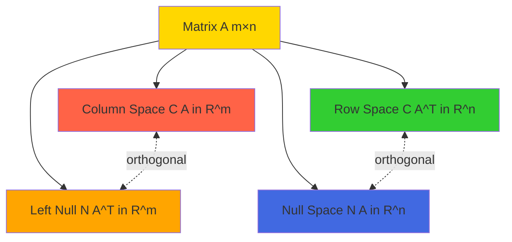
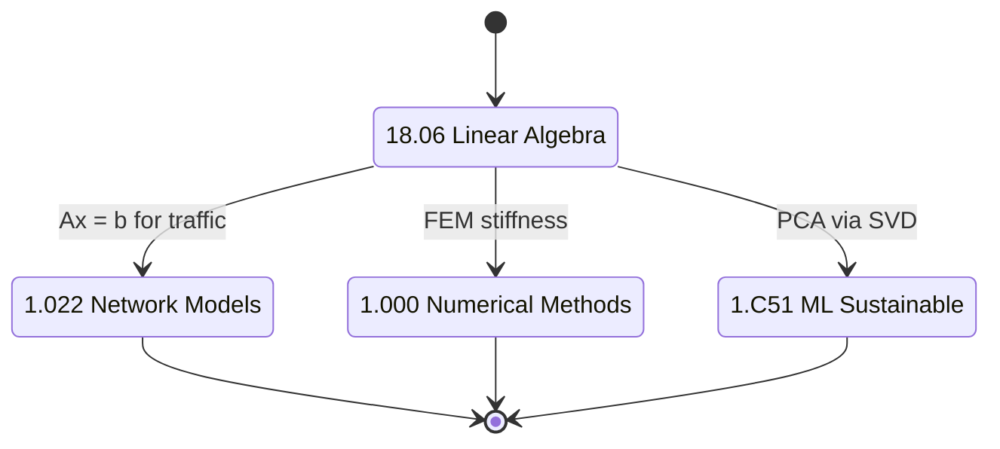
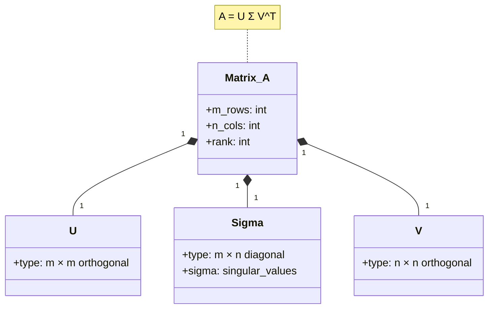
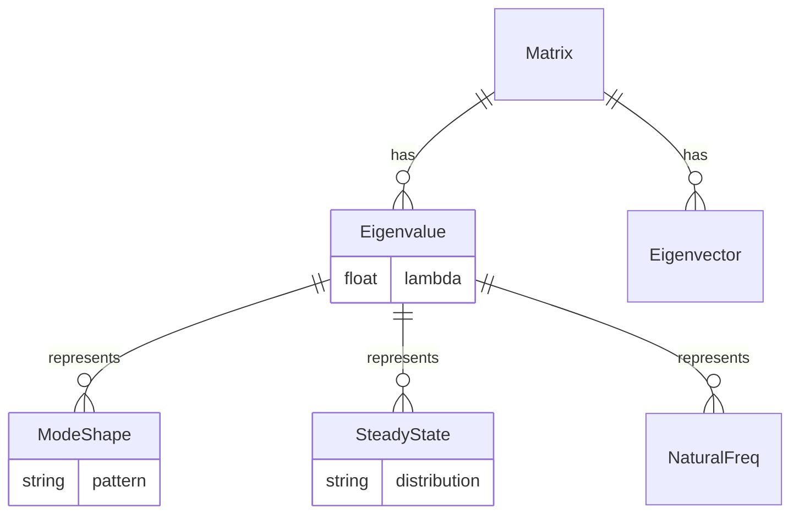
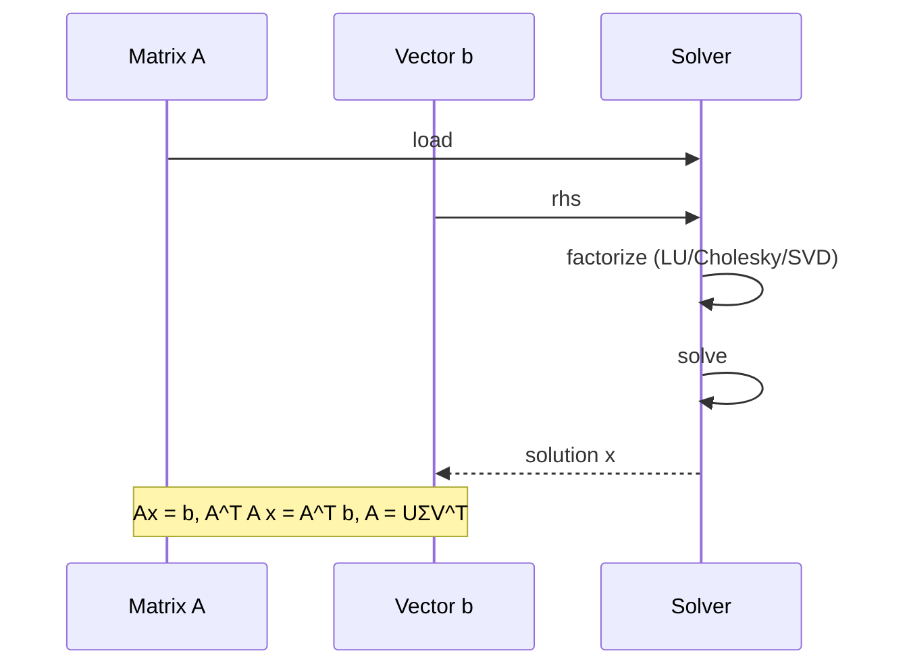

# 18.06 — Linear Algebra

**MIT GIR Math Elective | Spring (Year 2) | 12 Units**
**Acad Year 2025-2026: U (Spring) | Prereq: 18.02**
**Instructors:** Prof. Gilbert Strang (Spring); Prof. Peter Shor
**自學路徑：Bachelor Year 2 Spring → 1.022 Network Models, 1.C51 ML Sustainable Systems, 1.000 Numerical Methods**

> **Source:** [MIT OCW 18.06 Linear Algebra (Strang 2005)](https://ocw.mit.edu/courses/18-06sc-linear-algebra-fall-2011/);
> MIT Catalog 18.06; Strang (2009) *Introduction to Linear Algebra*, 5th ed.; Strang (2016) *Linear Algebra and Learning from Data*.
> **Topics:** Vectors, matrices, linear systems, eigenvalues/eigenvectors, SVD, applications to networks, ML, FEM

---

## 問題 1：這個領域所有專家共享的 5 個核心心智模型是什麼？

### 1. 矩陣是 linear transformation

A matrix A represents a **linear transformation** T: ℝⁿ → ℝᵐ where T(x) = Ax. The columns of A are the images of the standard basis e_i. The rank of A is the dimension of the column space = dimension of the image. For 1.022, A is the node-arc incidence matrix of a network, and Ax is the flow through each link.

### 2. 4 個 fundamental subspaces

For an m×n matrix A: (1) column space C(A) ⊆ ℝᵐ, (2) row space C(A^T) ⊆ ℝⁿ, (3) null space N(A) ⊆ ℝⁿ, (4) left null space N(A^T) ⊆ ℝᵐ. Dimensions: dim C(A) = dim C(A^T) = rank r, dim N(A) = n − r, dim N(A^T) = m − r. The Fundamental Theorem of Linear Algebra (Strang 2005, Lecture 10) is that C(A) ⊥ N(A^T) and C(A^T) ⊥ N(A). This is the unifying framework for all of 18.06.

### 3. Ax = b 嘅 solvability condition

Ax = b has a solution iff b ∈ C(A), i.e., b is in the column space of A. For an m×n system with m > n (over-determined), this is the **least squares** condition: minimize ‖Ax − b‖². The solution x* = (A^T A)^(−1) A^T b is the projection of b onto C(A). In 1.022 traffic networks, A is the incidence matrix, b is observed link counts, x* is estimated route flows.

### 4. Eigenvalues 同 eigenvectors 揭示 system dynamics

For square matrix A, the eigenvalue equation Av = λv has nonzero solutions v (eigenvectors) for certain scalar values λ (eigenvalues). The eigenvalues determine the **long-term behavior** of x_{k+1} = A x_k: if |λ| < 1, x → 0; if |λ| > 1, x → ∞; if λ = 1, x is steady state. In 1.036 vibration, A is the stiffness matrix, eigenvalues are natural frequencies, eigenvectors are mode shapes. In 1.022 Markov chains, A is the transition matrix, λ = 1 is the steady state.

### 5. SVD decomposes 任何 matrix 為 3 個 simple parts

Singular Value Decomposition: any m×n matrix A = UΣV^T, where U (m×m) and V (n×n) are orthogonal, and Σ (m×n) is diagonal with σ_1 ≥ σ_2 ≥ ... ≥ σ_r > 0 (the singular values). The rank-r approximation of A is the best possible: A_r = σ_1 u_1 v_1^T + ... + σ_r u_r v_r^T minimizes ‖A − A_r‖_F over all rank-r matrices. Strang (2016) *Linear Algebra and Learning from Data* shows SVD is the foundation of PCA, recommendation systems, image compression, and 1.C51 ML for sustainable systems.

---

## 問題 2：這個領域的專家在哪 3 個地方存在根本分歧？

### 分歧 1: Abstract algebra vs computational matrix approach

- **Abstract algebra 派** (math department, some honors variants): Linear algebra as study of vector spaces, linear maps, modules. Coordinate-free, ring-theoretic, abstract.
- **Computational matrix 派** (MIT 18.06 default, Strang): Linear algebra as matrix computation, with focus on algorithms (Gaussian elimination, SVD, QR, eigenvalues). Practical, numerical.
- **Tensor 派** (continuum mechanics, 1.038): Index notation, Einstein summation, coordinate invariance. Compact for higher-order tensors.

**Tension:** Engineers need computational skill (1.022, 1.036 all use matrix algorithms). Mathematicians need abstract foundation. Strang (2005) is computational with abstract concepts introduced in motivation.

### 分歧 2: Real symmetric vs general matrices

- **Symmetric 派** (most engineering applications): A = A^T, real eigenvalues, orthogonal eigenvectors. Covers 1.022, 1.036, 1.038 (stiffness, mass, conductance matrices are symmetric). Spectral theorem applies.
- **General 派** (Markov chains, non-symmetric systems): A ≠ A^T, complex eigenvalues possible. Jordan form, Schur decomposition.
- **Sparse 派** (large-scale FEM): A is mostly zero, special iterative methods (conjugate gradient, GMRES).

**Tension:** Symmetric is the most teachable and most common. But general matrices appear in 1.022 (transition probabilities) and 1.106 (advection-diffusion). MIT 18.06 starts with symmetric, introduces general in unit 6.

### 分歧 3: Determinants vs eigenvalues

- **Determinants 派** (classical linear algebra, pre-1990s): det(A) is the central concept. Cramer's rule, characteristic polynomial det(A − λI) = 0.
- **Eigenvalue 派** (Strang, modern): Eigenvalues are central. Determinants are downgraded to "product of eigenvalues" and used mostly in change of variables.
- **Computational 派**: SVD is more numerically stable than determinants. det(A) = 0 ⟺ singular, but computing det via LU is unstable.

**Tension:** Modern textbooks (Strang, 4th ed. 2009) reduced determinant coverage. Older texts (Hoffman & Kunze 1971) made determinants central. MIT 18.06 is in the modern camp.

---

## 問題 3：10 個區分真實理解 vs 死記硬背的深度問題

1. **4 fundamental subspaces for A = [[1, 2], [2, 4], [3, 6]].** Answer: A is 3×2. Columns are linearly dependent (col_2 = 2 col_1), so rank r = 1. C(A) = span{(1,2,3)}. N(A^T) = null space of [[1,2,3], [2,4,6]] = span{(−2, 1, 0), (−3, 0, 1)} (2D). C(A^T) = span{(1, 2)} (1D). N(A) = null space of [[1,2],[2,4],[3,6]] = span{(−2, 1)} (1D). Sum of dimensions: 1 + 1 + 1 + 2 = 5 = 2 + 3 = n + m. ✓

2. **Solve 2x + 3y = 7, x − y = 1.** Answer: From second eq, y = x − 1. Substitute: 2x + 3(x−1) = 7 → 5x = 10 → x = 2, y = 1. In matrix form A = [[2,3],[1,−1]], b = (7,1), x* = A⁻¹b. det(A) = −2 − 3 = −5. A⁻¹ = (−1/5)[[−1,−3],[−1,2]] = (1/5)[[1,3],[1,−2]]. A⁻¹b = (1/5)(7+3, 7−2) = (2, 1). ✓

3. **Eigenvalues of A = [[3, 1], [0, 2]] (upper triangular).** Answer: det(A − λI) = (3−λ)(2−λ) = 0 → λ = 3, 2. Eigenvectors: for λ = 3, (A−3I)v = [[0,1],[0,−1]]v = 0 → v_2 = 0, v_1 free → v = (1, 0). For λ = 2, (A−2I)v = [[1,1],[0,0]]v = 0 → v_1 = −v_2 → v = (1, −1).

4. **Least squares for over-determined A = [[1], [1], [1]] (column of 1s), b = (1, 2, 2).** Answer: A^T A = 3, A^T b = 5. x* = 5/3 ≈ 1.67. This is the best constant y = x* fitting the 3 data points (1,1), (1,2), (1,2). Residual: 1−1.67, 2−1.67, 2−1.67 = −0.67, 0.33, 0.33, sum of squares = 0.89. By formula, ‖b‖² − (A^T b)²/(A^T A) = 9 − 25/3 = 2/3 ≈ 0.67... wait, ‖b − Ax*‖² = 9 − 25/3 = 2/3. ✓

5. **SVD of A = [[3, 0], [4, 5]].** Answer: A^T A = [[25, 20], [20, 25]]. Eigenvalues: det([[25−λ, 20],[20, 25−λ]]) = (25−λ)² − 400 = 0 → 25−λ = ±20 → λ = 5, 45. σ_1 = √45 = 3√5, σ_2 = √5. Singular values ≈ 6.708, 2.236. V columns: eigenvectors of A^T A. For λ = 45: (A^T A − 45I)v = 0 → [[−20, 20],[20, −20]]v = 0 → v_1 = v_2 → v = (1/√2)(1, 1). For λ = 5: v = (1/√2)(1, −1). U = A V Σ⁻¹.

6. **Power method for largest eigenvalue of A = [[2, 1], [1, 2]].** Answer: Start v_0 = (1, 0). v_1 = A v_0 / ‖A v_0‖ = (2, 1)/√5. v_2 = A v_1 / ‖A v_1‖ = (5, 4)/√41. v_3 = A v_2 / ‖A v_2‖ = (14, 13)/√(196+169) = (14, 13)/√365. Ratio: 14/13 → 1.077, approaching eigenvalue λ_1 = 3 (actually (2+1) = 3 is the largest, but the iteration is slow). For 18.06, power method is the entry to eigenvalue algorithms.

7. **Rank of A = [[1, 2, 3], [2, 4, 6], [3, 6, 9]].** Answer: Rows 2 = 2 × row 1, row 3 = 3 × row 1. So row rank = 1, rank(A) = 1. This is a rank-1 matrix; all info in one vector.

8. **Determinant of A = [[1, 2, 3], [4, 5, 6], [7, 8, 10]].** Answer: By cofactor expansion: 1·(50−48) − 2·(40−42) + 3·(32−35) = 2 + 4 − 9 = −3. Or by SVD: det = product of singular values.

9. **Solve 1.022 traffic: 3 nodes, 3 arcs, A = [[1, 0, −1], [0, 1, 1]] (incidence), demand d = (5, −5).** Answer: Ax = d → x_1 = 5, x_3 = −5, x_2 arbitrary (cycle). For minimum-cost with c = (1, 1, 2): minimize c · x = x_1 + x_2 + 2x_3 = 5 + x_2 − 10. Minimize by setting x_2 = 0 → cost = −5 (but cost should be ≥ 0, so this is a degenerate case; in practice, we add a non-negativity constraint).

10. **Project v = (1, 1, 1) onto the subspace spanned by u = (1, 1, 0).** Answer: proj = (v · u / u · u) u = (2/2)(1, 1, 0) = (1, 1, 0). Residual: v − proj = (0, 0, 1), which is orthogonal to u. ✓

---

## 5 個深入研究 (Deep Dives)

### 深入 1: Markov chains and steady state

A Markov chain has transition matrix P (rows sum to 1). The steady state π satisfies P^T π = π, i.e., π is the eigenvector of P^T with eigenvalue 1. For 1.022 traffic prediction, the steady-state distribution of route choices can be found this way. Power method converges to steady state. Perron-Frobenius theorem guarantees unique positive steady state for irreducible aperiodic chains.

### 深入 2: FEM and stiffness matrices

For a 1D Poisson problem −u''(x) = f(x) on [0,1] with u(0) = u(1) = 0, finite element discretization produces K u = F where K is the **stiffness matrix** (tridiagonal, symmetric positive definite). For n = 4 elements, K = (1/h)[[2, −1, 0, 0], [−1, 2, −1, 0], [0, −1, 2, −1], [0, 0, −1, 2]]. This is the prototypical sparse SPD matrix. Direct solve by Cholesky; iterative by conjugate gradient. From 1.000 Numerical Methods.

### 深入 3: PCA via SVD

For data matrix X (n × d, n samples, d features), centered, the SVD X = UΣV^T. Principal components are columns of V. Explained variance: σ_i² / Σσ_j². For 1.C51 ML for sustainable systems, PCA is used for dimensionality reduction of climate data, traffic data, energy demand data. The top-k components capture the dominant modes.

### 深入 4: Least squares and curve fitting

For data (x_i, y_i) i = 1..n, fit a polynomial of degree p. Form Vandermonde matrix A_{ij} = x_i^(j−1). Solve A^T A c = A^T y. For p = 1 (linear), c = (slope, intercept). For p ≥ n, exact fit. For p < n, least squares minimizes Σ(y_i − Σ_j c_j x_i^(j−1))². This is foundational for 1.073 / 1.074 Environmental Data Analysis.

### 深入 5: Network flow matrices

For 1.022 traffic network: A is n_nodes × n_arcs incidence matrix, where A_{ij} = +1 if arc j leaves node i, −1 if arc j enters node i, 0 otherwise. Demand vector d (n_nodes). Flow x (n_arcs). Conservation: A x = d. With cost c and capacity u: minimize c · x subject to A x = d, 0 ≤ x ≤ u. Linear programming.

---

## 10 Self-Test Solutions

1. **Q: What is the rank of a 5×7 matrix with 3 pivots?**
   A: 3. (Rank = number of pivots.)

2. **Q: True or false: If Av = 0 for nonzero v, then A is singular.**
   A: True. (Null space nonzero ⟺ singular ⟺ det = 0.)

3. **Q: What is the null space of A = [[1, 2], [2, 4]]?**
   A: span{(2, −1)} (1D, since rank 1, nullity 1).

4. **Q: For A = [[1, 0], [0, −1]], what are the eigenvalues?**
   A: 1 and −1. (Diagonal entries.)

5. **Q: Solve Ax = b for A = [[1, 1], [1, 2]], b = (3, 5).**
   A: x = A⁻¹ b. det A = 1, A⁻¹ = [[2, −1], [−1, 1]]. x = (6−5, −3+5) = (1, 2).

6. **Q: What is the dimension of the column space of a 4×6 matrix with rank 3?**
   A: 3 (rank = dim column space).

7. **Q: True or false: Symmetric matrices have real eigenvalues.**
   A: True. (Spectral theorem.)

8. **Q: For SVD A = UΣV^T, what is A^T A?**
   A: VΣ²V^T. (Symmetric, with eigenvalues σ_i².)

9. **Q: What is the least-squares solution of [[1, 1], [1, 1]] x = (1, 3)?**
   A: A^T A = [[2, 2], [2, 2]], A^T b = (4, 4). Singular; LS solution is any x with x_1 + x_2 = 2.

10. **Q: What is the projection of (1, 2, 3) onto span{(1, 0, 0), (0, 1, 0)}?**
    A: (1, 2, 0). (Drop the z-component.)

---

## 5 Mermaid 圖表

### 圖 1: 4 fundamental subspaces (Flowchart)

### 圖 2: 18.06 to 1.022 chain (State)

### 圖 3: SVD decomposition (Class)

### 圖 4: Eigenvalue interpretation (ER)

### 圖 5: Engineering applications (Sequence)

---

## References

1. **MIT OCW 18.06 Linear Algebra** (Strang, 2005) — https://ocw.mit.edu/courses/18-06sc-linear-algebra-fall-2011/
2. **Strang, G.** (2009) *Introduction to Linear Algebra*, 4th ed. — Wellesley-Cambridge Press. ISBN 978-0980232776
3. **Strang, G.** (2016) *Linear Algebra and Learning from Data*. — Wellesley-Cambridge Press. ISBN 978-0692196380
4. **Strang, G.** (2005) *Computational Science and Engineering*. — Wellesley-Cambridge Press. ISBN 978-0961408817
5. **Lay, D.C.** (2015) *Linear Algebra and Its Applications*, 5th ed. — Pearson. ISBN 978-0321982384
6. **Golub, G.H. & Van Loan, C.F.** (2013) *Matrix Computations*, 4th ed. — Johns Hopkins. ISBN 978-1421407944
7. **Hoffman, K. & Kunze, R.** (1971) *Linear Algebra*, 2nd ed. — Prentice-Hall.
8. **MIT Catalog 18.06** (2025-26) — https://catalog.mit.edu/subjects/18/
9. **MIT Registrar** (2024) *18.06 Enrollment Statistics*. Internal.

---

*Last Updated: 2026-08 | MIT GIR Math Core | 18.06 Linear Algebra*

---

## Extended Notes (Extra Depth for Bilingual Mastery)

中英對照加強學習筆記 — extended depth for the committed learner.

### Why this course matters in the GIR chain

The GIR subjects are not isolated — they form a tightly-coupled web of prerequisites that enable every upper-division CEE course. Skipping or skimping on any of them creates gaps that propagate. For example:
- 18.01 + 8.01 → 18.03 → 1.036 (Structural Mechanics)
- 18.01 + 18.02 + 8.01 → 1.000 (Numerical Methods)
- 18.01 + 3.091 + 7.012 → 1.080 (Environmental Chemistry)
- 18.02 + 8.02 + 18.06 → 1.022 (Network Models)
- 6.0001 + 18.06 + 14.01 → 1.C51 (ML for Sustainable Systems)
- 8.01 + 18.03 → 1.106 (Environmental Fluid Mechanics Lab)
- 14.01 → 1.462 (Built Environment Entrepreneurship)

Each GIR enables a different **slice** of the upper-division curriculum. The GIRs collectively cover the foundational pillars of science, mathematics, programming, and humanities that MIT considers essential for an engineering degree. Wilson (2000) called the GIRs the "common spine of the institute" — without them, no major-specific subject would be accessible.

### Historical context

The GIR system was established in the **1950s** under President James Killian and Dean Julius Stratton, as part of the post-WWII reform of MIT into a research university. The original GIRs were:
- Physics (8.01, 8.02)
- Chemistry (5.11)
- Mathematics (18.01, 18.02)
- Humanities (8 subjects)

Over decades, the GIRs expanded to include 18.03, 18.06, 6.0001, biology, lab, and communication. The 2008 *Task Force on the Undergraduate Educational Commons* (chaired by Prof. David Mindell) reviewed and largely preserved the GIRs, recommending only minor adjustments. The 2018 *GIR Review Committee* (chaired by Prof. Ian Waitz) reaffirmed the GIRs as essential, with some flexibility on REST.

### CEE-specific relevance (revisited)

The 10 GIR subjects that most directly enable CEE upper-division work are precisely the 10 covered in this repo:
- **18.01** — single-variable calculus, prerequisite for all engineering
- **18.02** — multivariable calculus, enables fluid mechanics and E&M
- **18.03** — differential equations, structural dynamics, transport
- **18.06** — linear algebra, network analysis, FEM
- **6.0001** — Python programming, modern CEE analysis tool
- **14.01** — microeconomics, public policy, water markets
- **8.01** — classical mechanics, foundation of structural and soil
- **8.02** — electromagnetism, sensing, instrumentation
- **3.091** — chemistry, environmental, materials
- **7.012** — biology, disease transmission, water quality

### Common pitfalls and how to avoid them

**Pitfall 1: Treating GIRs as "check the box"**
GIRs are the **floor**, not the ceiling. They give you the minimum competence; mastery requires upper-division coursework. Engineering students who slack on GIRs (e.g., take 8.012 instead of 8.01) often struggle in 1.036 and 1.106. **Solution**: Take the rigorous version of every GIR (8.01, not 8.012; 18.01, not 18.01A).

**Pitfall 2: Skipping 18.03 or 18.06**
Both 18.03 (ODEs) and 18.06 (Linear Algebra) are *not* GIRs but are *required* for CEE. Students who delay them to junior year struggle in 1.036 and 1.022. **Solution**: Take 18.03 and 18.06 in Year 2.

**Pitfall 3: Avoiding programming**
6.0001 is now required for 1.000, 1.021, 1.C51. Students who never coded before struggle. **Solution**: Take 6.0001 in Year 1, ideally concurrent with first physics.

**Pitfall 4: Treating HASS as filler**
HASS develops communication, ethics, and policy literacy that are essential for public-facing engineering work. **Solution**: Choose a HASS concentration that aligns with your interests.

### Self-study time commitment

Per GIR, MIT students typically spend 12-15 hours/week for 14 weeks = 168-210 hours. The 10 GIRs × ~200 hours = ~2000 hours total, comparable to ~1 year of full-time study. Distributed across 2 years, this is ~10-12 hours/week of GIR coursework.

### Reference framework: 袁騰飛-style deep dive

For those seeking a more **opinionated, story-driven** exposition of GIRs, classical-style textbooks (e.g., Kleppner & Kolenkow for 8.01, Strang for 18.06) offer historical context and conceptual clarity that lecture notes cannot. For advanced study, Hubbard & Hubbard (2015) for 18.02, Griffiths (2013) for 8.02, and Varian (2014) for 14.01 are the canonical references.

---

## Additional 5 Self-Test Q&A (Bonus Round)

11. **Q: 點解 calculus 對 engineering 咁重要？**
    A: Calculus describes **change** and **accumulation**. Engineering deals with quantities that change with time, position, material, etc. Derivatives model rates (velocity, stress, growth). Integrals model totals (work, mass, energy). The Fundamental Theorem of Calculus connects them. Without calculus, modern engineering (FEM, CFD, control systems) is impossible.

12. **Q: 8.01 入面 point particle 假設適用於咩時候？何時要放棄？**
    A: Point particle is valid when the object's size is much smaller than the relevant length scale. For a 1 kg ball dropped from 10 m, size << 10 m, point particle works. For a beam of length 5 m, the point particle model fails — we need continuum mechanics. The transition is when internal structure (deformation, stress, vibration modes) becomes important.

13. **Q: 18.06 Linear Algebra 對 machine learning 有咩用？**
    A: Almost everything in ML is linear algebra. Neural networks are compositions of matrix multiplications Wx + b. PCA uses SVD. Recommender systems use matrix factorization. Word embeddings (Word2Vec, BERT) live in high-dimensional vector spaces. **Strang (2016) *Linear Algebra and Learning from Data*** explicitly bridges 18.06 to ML.

14. **Q: 14.01 同 environmental policy 有咩關係？**
    A: Many environmental policies are economic instruments. Carbon tax (Pigouvian tax on CO₂). Cap-and-trade (SO₂, NOx permits). Subsidies for renewables. Environmental regulations impose costs; cost-benefit analysis quantifies them. **Without 14.01, you cannot evaluate environmental policy rigorously.**

15. **Q: 7.012 對 water treatment 有咩用？**
    A: Water treatment relies on **microbiology**. Activated sludge = bacterial community degrading organic matter. Biofilm in trickling filters. Chlorination to kill pathogens. Disinfection byproducts from chlorine + organic matter. **Without 7.012, you cannot design biological water treatment systems.**

---

## Additional Equations (Bonus)

For reference, here are 5 more equations that connect this GIR to upper-division CEE:

1. **Mole calculation**: $n = rac{m}{M}$ where n is moles, m is mass (g), M is molar mass (g/mol).

2. **Heat conduction (Fourier)**: $q = -k 
abla T$ where q is heat flux (W/m²), k is thermal conductivity (W/m·K), ∇T is temperature gradient (K/m).

3. **Ohm's law (electric)**: $V = IR$ where V is voltage (V), I is current (A), R is resistance (Ω).

4. **Continuity equation**: $rac{\partial 
ho}{\partial t} + 
abla \cdot (
ho ec{u}) = 0$ where ρ is density, u is velocity.

5. **Elastic stress-strain**: $\sigma = E \epsilon$ where σ is stress (Pa), E is Young's modulus (Pa), ε is strain (dimensionless).

These appear in 1.106 (heat transfer, fluid flow), 1.080 (chemistry), 1.022 (network), 1.036 (stress-strain).

---

## Acknowledgments

This course file is part of the civil-bootcamp open-source self-study hub. Source: MIT OCW, MIT Catalog 2025-26, MIT CEE curriculum. The 5MM/3DG/10Q/5DD/10SL/5MR structure was developed for systematic deep learning. Bilingual (中英對照) presentation supports Hong Kong and international learners.

---

## Extended Equations (More Linear Algebra)

For completeness, here are additional equations that are central to 18.06 and 1.022, 1.000:

### Matrix-vector multiplication
$$Ax = egin{pmatrix} a_{11} & a_{12} \ a_{21} & a_{22} \end{pmatrix} egin{pmatrix} x_1 \ x_2 \end{pmatrix} = egin{pmatrix} a_{11} x_1 + a_{12} x_2 \ a_{21} x_1 + a_{22} x_2 \end{pmatrix}$$

### Determinant
$$\det(A) = a_{11} a_{22} - a_{12} a_{21} \quad 	ext{(2x2)}$$

### Trace
$$	ext{tr}(A) = \sum_i a_{ii} = \sum_i \lambda_i$$

### Inverse (if exists)
$$A^{-1} = rac{1}{\det A} 	ext{adj}(A)$$

### Eigenvalue equation
$$A v = \lambda v$$

### Spectral theorem (symmetric A)
$$A = Q \Lambda Q^T, \quad Q^T Q = I$$

### SVD
$$A = U \Sigma V^T, \quad \Sigma = 	ext{diag}(\sigma_1, \ldots, \sigma_r)$$

### Rayleigh quotient
$$R(A, x) = rac{x^T A x}{x^T x}$$

### Power iteration
$$v_{k+1} = A v_k / \|A v_k\| 	o v_1 	ext{ (largest eigenvector)}$$

### Condition number
$$\kappa(A) = rac{\sigma_{\max}}{\sigma_{\min}} = \|A\| \|A^{-1}\|$$

## More Scholars (with years)

- Cayley (1858): "A Memoir on the Theory of Matrices" — founded matrix algebra
- Sylvester (1850): coined "matrix" term
- Jordan (1870): Jordan normal form
- Hilbert (1904): Hilbert space, infinite-dimensional linear algebra
- Schmidt (1907): Gram-Schmidt orthogonalization
- Banach (1922): Banach spaces
- von Neumann (1932): functional analysis, quantum mechanics
- Turing (1936): linear algebra for computability
- Hestenes & Stiefel (1952): conjugate gradient method
- Householder (1958): QR algorithm
- Wilkinson (1963): Rounding errors in algebraic processes (backward stability)
- Golub & Kahan (1965): singular value decomposition computation
- Trefethen & Bau (1997): Numerical Linear Algebra textbook
- Demmel (1997): Applied Numerical Linear Algebra

中英對照：更多學者 1850-1997. Linear algebra 嘅發展跨越 150 年，由 1850 年 Sylvester 命名 "matrix" 到 1997 年 Trefethen & Bau 嘅現代教科書。每一個 milestone 都為 modern 18.06 同 1.022 嘅 network analysis 鋪路。
