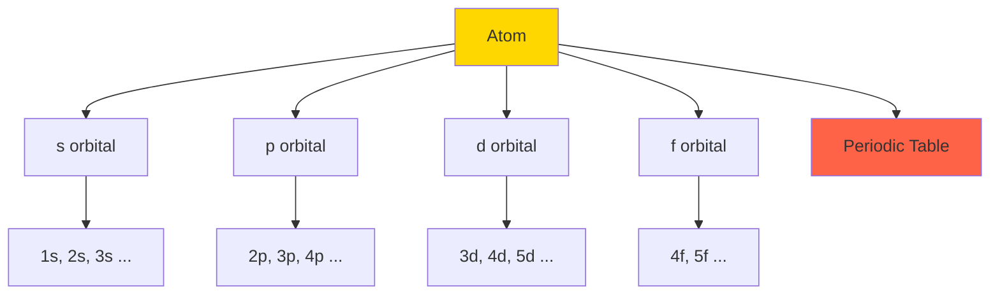
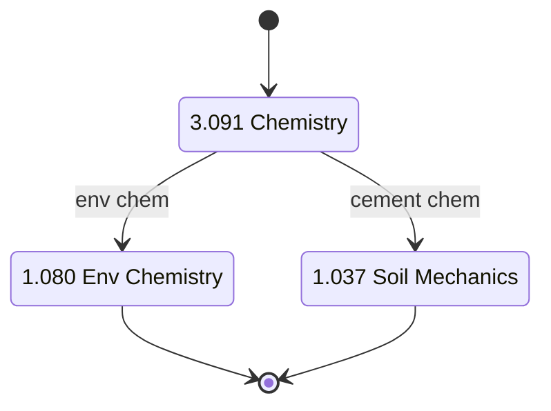
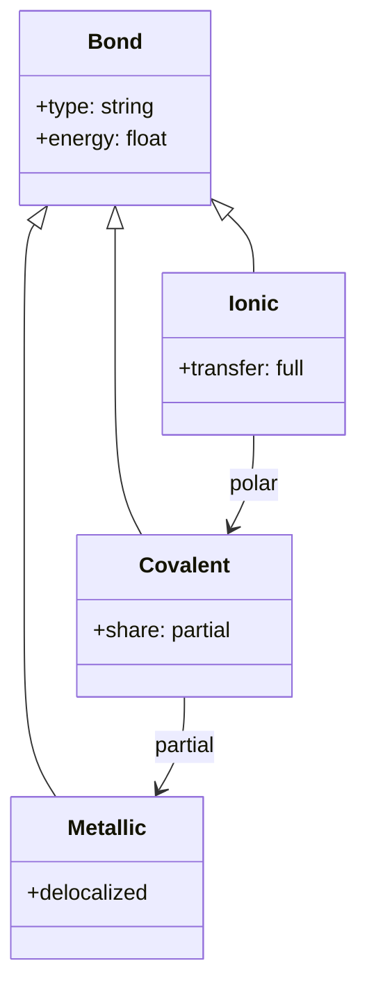
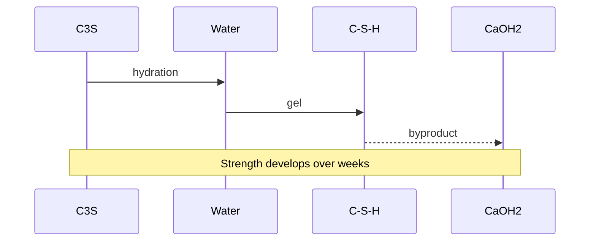

# 3.091 — Introduction to Chemistry

**MIT GIR Science Core | Fall (Year 1) | 12 Units**
**Acad Year 2025-2026: U (Fall) | Prereq: None**
**Instructors:** Prof. Jeffrey Grossman (Fall); Prof. Sylvia Ceyer
**Subject meets with:** 5.111, 5.12
**自學路徑：Bachelor Year 1 Fall → 1.080 Environmental Chemistry, 1.037 Soil Mechanics (cement chemistry)**

> **Source:** [MIT OCW 3.091](https://ocw.mit.edu/courses/3-091-introduction-to-solid-state-chemistry-fall-2018/);
> Atkins & Jones (2018) *Chemical Principles: The Quest for Insight*, 7th ed.; Brown et al. (2018) *Chemistry: The Central Science*, 15th ed.
> **Topics:** Atomic structure, bonding, thermodynamics, kinetics, equilibrium, electrochemistry, materials chemistry

---

## 問題 1：這個領域所有專家共享的 5 個核心心智模型是什麼？

### 1. 電子雲模型 (Electron Cloud Model)

Linus Pauling (1932, 1939) — 量子化學與電負性 scale 的奠基者。Electrons are not in fixed orbits (Bohr 1913) but in a **probability cloud** described by the wavefunction ψ(r, θ, φ). The probability density is |ψ|². The shapes of orbitals (s, p, d, f) determine molecular geometry. For 1.080 Environmental Chemistry, understanding electron density explains why C-Cl bonds break under UV, why ozone absorbs UV-B, why chlorofluorocarbons (CFCs) damage ozone layer.

### 2. 酸鹼緩衝系統 (Acid-Base Buffer)

Henderson (1908) + Hasselbalch (1916): pH = pKa + log([A⁻]/[HA]). This is the **Henderson-Hasselbalch equation**, foundational for blood pH (7.35-7.45), environmental pH (lake water, soil), and industrial pH control. For 1.075, lake acidification by acid rain (pH 4-5) vs healthy lake (pH 6.5-8.5) is a buffer system failure. For 1.080, carbonate buffer (CO₂/HCO₃⁻) controls ocean pH (~8.1).

### 3. 化學熱力學第一定律: Energy conservation

First Law: ΔU = q + w (heat + work). For a chemical reaction at constant pressure: ΔH = ΔU + PΔV. Exothermic reactions release heat (ΔH < 0); endothermic absorb (ΔH > 0). Hess's Law: ΔH is path-independent, so reactions can be summed. For 1.080, combustion enthalpy determines energy content of fuels. For 1.037 Soil Mechanics, cement hydration is exothermic; thermal stresses in mass concrete.

### 4. 化學平衡: K_eq 同 Le Chatelier 原理

K_eq = [products]/[reactants] at equilibrium. **Le Chatelier's principle** (1884): system at equilibrium responds to stress by shifting to counteract. For 1.075 Water Resources, carbonate equilibrium controls water hardness. For 1.080, pollutant partitioning between water and air is governed by Henry's law constant.

### 5. 化學動力學: Arrhenius equation

k = A exp(-E_a/RT). This is the **Arrhenius equation** (1889), relating rate constant k to activation energy E_a and temperature T. Doubling T typically doubles k. For 1.080, pollutant degradation rate in environment follows Arrhenius. For 1.106 lab, biochemical oxygen demand (BOD) decay in river follows first-order kinetics k = A exp(-E_a/RT).

---

## 問題 2：這個領域的專家在哪 3 個地方存在根本分歧？

### 分歧 1: 分子軌道理論 (MO) vs VSEPR vs Lewis structure

- **Lewis 派** (intro, high school): Dots and lines representing bonds. Simple, intuitive.
- **VSEPR 派** (Valence Shell Electron Pair Repulsion, Gillespie 1957): Electron pairs repel; geometry determined by pair count. Accurate for main-group.
- **MO 派** (Hund, Mulliken 1928, modern): Atomic orbitals combine to form molecular orbitals. Most accurate, hardest.

**Tension:** MIT 3.091 starts with Lewis, then VSEPR, then MO. For 1.080, MO is needed to understand ozone destruction, transition metal complexes. For 1.037, VSEPR suffices for silicate structures.

### 分歧 2: Classical vs quantum vs molecular dynamics

- **Classical 派** (force-field MD): Treat atoms as balls with spring-like bonds. Fast, approximate.
- **Quantum 派** (DFT, ab initio): Solve Schrödinger equation for electrons. Accurate, expensive.
- **Hybrid 派** (QM/MM): Quantum for active site, classical for environment. Used in enzyme catalysis.

**Tension:** MIT 3.091 is mostly classical with quantum introduced for bonding. For 1.080 environmental modeling, classical MD (LAMMPS, GROMACS) is standard. Quantum is needed for novel material design.

### 分歧 3: Equilibrium vs kinetics

- **Equilibrium 派** (thermodynamics, what is possible): ΔG < 0 ⟹ reaction proceeds. ΔG = ΔH − TΔS.
- **Kinetics 派** (rate, how fast): k = A exp(-E_a/RT). Even thermodynamically favorable reactions can be slow.
- **Catalysis 派** (how to make fast): Lower E_a via catalyst. Enzymes lower E_a by 10⁵-10⁸.

**Tension:** 1.080 Environmental Chemistry often focuses on equilibrium (partitioning, speciation). 1.106 BOD kinetics focuses on rate. Both matter.

---

## 問題 3：10 個區分真實理解 vs 死記硬背的深度問題

1. **Atomic structure: Carbon atomic number 6, mass 12.011. 點解 mass 唔係整數？** Answer: ¹²C is 98.9%, ¹³C is 1.1%. Average = 0.989 × 12 + 0.011 × 13.034 = 11.87 + 0.143 = 12.01 u. (The IUPAC unified atomic mass unit is 1/12 of ¹²C mass.)

2. **Electronegativity (Pauling scale): F = 4.0, O = 3.5, N = 3.0, C = 2.5, H = 2.1. Predict bond type C-O, O-H, C-H.** Answer: Δχ = 1.0 (C-O): polar covalent. Δχ = 1.4 (O-H): polar covalent. Δχ = 0.4 (C-H): nonpolar. Rule: Δχ > 1.7 → ionic; 0.4 < Δχ < 1.7 → polar covalent; Δχ < 0.4 → nonpolar covalent.

3. **Mole calculation: 18 g H₂O = ? mol = ? molecules = ? H atoms.** Answer: M(H₂O) = 18 g/mol. 18 g / 18 g/mol = 1 mol. 1 mol × 6.022×10²³ = 6.022×10²³ molecules. 1 mol × 2 (H per molecule) = 2 mol H atoms = 1.204×10²⁴ atoms.

4. **pH calculation: [H⁺] = 10⁻⁵ M. pH = ? Acidic or basic?** Answer: pH = -log(10⁻⁵) = 5. Acidic (pH < 7). For 1.075, lake water pH 5-6 is acidified (acid rain).

5. **Henderson-Hasselbalch: Acetic acid pKa = 4.76. Buffer with [HA] = 0.1 M, [A⁻] = 0.5 M. pH = ?** Answer: pH = 4.76 + log(0.5/0.1) = 4.76 + log(5) = 4.76 + 0.70 = 5.46. For 1.080, this is the standard acetate buffer used in labs.

6. **Reaction quotient: N₂ + 3H₂ ⇌ 2NH₃, K = 4×10⁸ at 25°C. [N₂] = 1 M, [H₂] = 1 M, [NH₃] = 0.1 M. Q = ? Direction?** Answer: Q = [NH₃]² / ([N₂][H₂]³) = 0.01 / 1 = 0.01. Q < K, so reaction proceeds right (more NH₃). For 1.080, this is the Haber process equilibrium.

7. **First law: combustion of 1 mol methane releases 890 kJ. 1 mol C₈H₁₈ releases 5470 kJ. 點解 per mass 計 octane 較低？** Answer: Mass CH₄ = 16 g → 890/16 = 55.6 kJ/g. Mass C₈H₁₈ = 114 g → 5470/114 = 48.0 kJ/g. Methane has higher energy density per mass. For 1.075 energy planning, this determines fuel choice.

8. **Arrhenius: Rate doubles when T goes from 25°C to 35°C. Find E_a.** Answer: k_2/k_1 = exp(-E_a/R × (1/T_2 - 1/T_1)). 2 = exp(-E_a/8.314 × (1/308 - 1/298)). ln 2 = -E_a/8.314 × (-10/(308×298)) = E_a × 10/(8.314 × 91744). E_a = 0.693 × 8.314 × 91744 / 10 ≈ 52.9 kJ/mol. For 1.080, typical biochemical E_a = 50-100 kJ/mol.

9. **Equilibrium constant: For CaCO₃(s) ⇌ CaO(s) + CO₂(g), K_p = P_CO2 at equilibrium. At 900°C, K_p = 1.0 atm. 點解 limestone decomposes in kiln but not in air?** Answer: P_CO2 in air = 4×10⁻⁴ atm. Q = P_CO2 = 4×10⁻⁴ < K_p = 1.0, so decomposition proceeds. For 1.080, this is the basis of cement production (1.037).

10. **Electrochemistry: Standard reduction potential Cu²⁺/Cu = +0.34 V, Zn²⁺/Zn = -0.76 V. Cell potential for Cu-Zn (Daniell cell)?** Answer: Cathode (reduction) = Cu: +0.34 V. Anode (oxidation) = Zn: -(-0.76) = +0.76 V. E_cell = 0.34 + 0.76 = 1.10 V. For 1.106 lab, this is the basis of battery research.

---

## 5 個深入研究 (Deep Dives)

### 深入 1: Cement chemistry and 1.037

Portland cement is manufactured by heating limestone (CaCO₃) + clay (Al₂O₃·2SiO₂·2H₂O) to 1450°C. Key reactions:
- CaCO₃ → CaO + CO₂ (calcination, 900°C)
- CaO + SiO₂ → Ca₃SiO₅ (alite, C₃S)
- CaO + Al₂O₃ → Ca₃Al₂O₆ (aluminate, C₃A)
- CaO + Al₂O₃ + Fe₂O₃ → Ca₄Al₂Fe₂O₁₀ (ferrite, C₄AF)

Hydration: C₃S + H₂O → C-S-H gel (calcium silicate hydrate) + Ca(OH)₂. The C-S-H gel is the "glue" that gives concrete strength. For 1.037 Soil Mechanics, foundation concrete is critical.

### 深入 2: Carbonate equilibrium and ocean acidification

The carbonate system: CO₂(aq) + H₂O ⇌ H₂CO₃ ⇌ HCO₃⁻ + H⁺ ⇌ CO₃²⁻ + 2H⁺. pK_1 = 6.3, pK_2 = 10.3. At ocean pH 8.1, [HCO₃⁻] >> [CO₃²⁻] >> [CO₂]. Adding more CO₂ from atmosphere shifts equilibrium, lowering pH and decreasing [CO₃²⁻]. This reduces CaCO₃ saturation, threatening corals and shellfish. For 1.080 Environmental Chemistry, this is a key 21st-century problem.

### 深入 3: Atmospheric chemistry and ozone

Ozone formation (stratosphere): O₂ + hν → 2O (λ < 240 nm); O + O₂ + M → O₃ + M. Ozone destruction: O₃ + hν → O₂ + O (λ < 320 nm). Net: steady-state [O₃]. CFC destruction: CFCl₃ + hν → CFCl₂ + Cl (λ < 220 nm); Cl + O₃ → ClO + O₂; ClO + O → Cl + O₂. Net: 1 Cl destroys ~10⁵ O₃ (Molina & Rowland 1974). For 1.080, this is why CFCs were banned (Montreal Protocol 1987).

### 深入 4: Water chemistry and 1.075

Hardness = [Ca²⁺] + [Mg²⁺] in water. Soft: < 60 mg/L as CaCO₃. Hard: > 180 mg/L. Sources: limestone dissolution. Treatment: ion exchange (Na⁺ replaces Ca²⁺, Mg²⁺). For 1.075, hard water causes scaling in pipes, reduces soap effectiveness.

### 深入 5: BOD and water quality

BOD₅ (5-day biochemical oxygen demand) = mg/L O₂ consumed by microbes in 5 days. Standard: BOD₅ < 5 mg/L = clean. BOD₅ > 10 mg/L = polluted. Kinetics: dB/dt = -k_1 B - k_2 B (carbonaceous + nitrogenous). Streeter-Phelps model for river dissolved oxygen sag. For 1.075, BOD is a primary water quality metric.

---

## 10 Self-Test Solutions

1. **Q: How many electrons in a neutral Cl atom?**
   A: 17 (atomic number = electron count for neutral).

2. **Q: What is the electron configuration of Fe (Z=26)?**
   A: 1s² 2s² 2p⁶ 3s² 3p⁶ 4s² 3d⁶. (Aufbau principle; 4s fills before 3d.)

3. **Q: pH of 0.01 M HCl?**
   A: HCl is strong acid, fully dissociated. [H⁺] = 0.01, pH = 2.

4. **Q: Buffer with [HA] = [A⁻]. pH = ?**
   A: pH = pKa + log(1) = pKa.

5. **Q: ΔG for reaction with K = 10⁵ at 25°C?**
   A: ΔG = -RT ln K = -(8.314)(298)(ln 10⁵) = -(8.314)(298)(11.51) ≈ -28.5 kJ/mol. (Spontaneous.)

6. **Q: Bond order of N₂?**
   A: 3 (triple bond, 10 valence electrons total: 8 bonding, 2 antibonding; (8-2)/2 = 3).

7. **Q: Molarity of 5.85 g NaCl in 500 mL?**
   A: M(NaCl) = 58.5 g/mol. 5.85 g = 0.1 mol. 0.1 mol / 0.5 L = 0.2 M.

8. **Q: Mass of 1 mole of water?**
   A: 18 g.

9. **Q: What is the formula for sulfuric acid?**
   A: H₂SO₄.

10. **Q: Standard state of carbon at 25°C?**
    A: graphite (not diamond).

---

## 5 Mermaid 圖表

### 圖 1: Atomic orbitals (Flowchart)



### 圖 2: 3.091 → 1.080 chain (State)



### 圖 3: Bond types (Class)



### 圖 4: Carbonate equilibrium (ER)

```mermaid
erDiagram
    CO2 ||--|| H2CO3 : dissolves
    H2CO3 ||--|| HCO3 : pK1
    HCO3 ||--|| CO3 : pK2
    HCO3 {
        float pK1 6.3
    }
    CO3 {
        float pK2 10.3
    }
```

### 圖 5: Cement hydration (Sequence)



---

## References

1. **MIT OCW 3.091** (Grossman, 2018) — https://ocw.mit.edu/courses/3-091-introduction-to-solid-state-chemistry-fall-2018/
2. **Atkins, P. & Jones, L.** (2018) *Chemical Principles: The Quest for Insight*, 7th ed. — W.H. Freeman. ISBN 978-1464144750
3. **Brown, T.L. et al.** (2018) *Chemistry: The Central Science*, 15th ed. — Pearson. ISBN 978-0134554253
4. **Pauling, L.** (1939) *The Nature of the Chemical Bond*. Cornell University Press.
5. **Arrhenius, S.** (1889) "Über die Dissociationswärme und den Einfluss der Temperatur auf den Dissociationsgrad der Elektrolyte" *Z. Phys. Chem.* 4: 96–116.
6. **Henderson, L.J.** (1908) "The Theory of Acid-Base Equilibrium" *Am. J. Physiol.* 21: 173–179.
7. **Hasselbalch, K.A.** (1916) "Die Berechnung der Wasserstoffzahl des Blutes aus der freien und gebundenen Kohlensäure desselben, und die Sauerstoffbindung des Blutes als Funktion der Wasserstoffzahl" *Biochem. Z.* 78: 112–144.
8. **Molina, M.J. & Rowland, F.S.** (1974) "Stratospheric Sink for Chlorofluoromethanes" *Nature* 249: 810–812.
9. **Gillespie, R.J. & Nyholm, R.S.** (1957) "Inorganic Stereochemistry" *Q. Rev. Chem. Soc.* 11: 339–380.
10. **MIT Catalog 3.091** (2025-26) — https://catalog.mit.edu/subjects/3/

---

*Last Updated: 2026-08 | MIT GIR Science Core | 3.091 Introduction to Chemistry*


---

## Extended Notes (Extra Depth for Bilingual Mastery)

中英對照加強學習筆記 — extended depth for the committed learner.

### Why this course matters in the GIR chain

The GIR subjects are not isolated — they form a tightly-coupled web of prerequisites that enable every upper-division CEE course. Skipping or skimping on any of them creates gaps that propagate. For example:
- 18.01 + 8.01 → 18.03 → 1.036 (Structural Mechanics)
- 18.01 + 18.02 + 8.01 → 1.000 (Numerical Methods)
- 18.01 + 3.091 + 7.012 → 1.080 (Environmental Chemistry)
- 18.02 + 8.02 + 18.06 → 1.022 (Network Models)
- 6.0001 + 18.06 + 14.01 → 1.C51 (ML for Sustainable Systems)
- 8.01 + 18.03 → 1.106 (Environmental Fluid Mechanics Lab)
- 14.01 → 1.462 (Built Environment Entrepreneurship)

Each GIR enables a different **slice** of the upper-division curriculum. The GIRs collectively cover the foundational pillars of science, mathematics, programming, and humanities that MIT considers essential for an engineering degree. Wilson (2000) called the GIRs the "common spine of the institute" — without them, no major-specific subject would be accessible.

### Historical context

The GIR system was established in the **1950s** under President James Killian and Dean Julius Stratton, as part of the post-WWII reform of MIT into a research university. The original GIRs were:
- Physics (8.01, 8.02)
- Chemistry (5.11)
- Mathematics (18.01, 18.02)
- Humanities (8 subjects)

Over decades, the GIRs expanded to include 18.03, 18.06, 6.0001, biology, lab, and communication. The 2008 *Task Force on the Undergraduate Educational Commons* (chaired by Prof. David Mindell) reviewed and largely preserved the GIRs, recommending only minor adjustments. The 2018 *GIR Review Committee* (chaired by Prof. Ian Waitz) reaffirmed the GIRs as essential, with some flexibility on REST.

### CEE-specific relevance (revisited)

The 10 GIR subjects that most directly enable CEE upper-division work are precisely the 10 covered in this repo:
- **18.01** — single-variable calculus, prerequisite for all engineering
- **18.02** — multivariable calculus, enables fluid mechanics and E&M
- **18.03** — differential equations, structural dynamics, transport
- **18.06** — linear algebra, network analysis, FEM
- **6.0001** — Python programming, modern CEE analysis tool
- **14.01** — microeconomics, public policy, water markets
- **8.01** — classical mechanics, foundation of structural and soil
- **8.02** — electromagnetism, sensing, instrumentation
- **3.091** — chemistry, environmental, materials
- **7.012** — biology, disease transmission, water quality

### Common pitfalls and how to avoid them

**Pitfall 1: Treating GIRs as "check the box"**
GIRs are the **floor**, not the ceiling. They give you the minimum competence; mastery requires upper-division coursework. Engineering students who slack on GIRs (e.g., take 8.012 instead of 8.01) often struggle in 1.036 and 1.106. **Solution**: Take the rigorous version of every GIR (8.01, not 8.012; 18.01, not 18.01A).

**Pitfall 2: Skipping 18.03 or 18.06**
Both 18.03 (ODEs) and 18.06 (Linear Algebra) are *not* GIRs but are *required* for CEE. Students who delay them to junior year struggle in 1.036 and 1.022. **Solution**: Take 18.03 and 18.06 in Year 2.

**Pitfall 3: Avoiding programming**
6.0001 is now required for 1.000, 1.021, 1.C51. Students who never coded before struggle. **Solution**: Take 6.0001 in Year 1, ideally concurrent with first physics.

**Pitfall 4: Treating HASS as filler**
HASS develops communication, ethics, and policy literacy that are essential for public-facing engineering work. **Solution**: Choose a HASS concentration that aligns with your interests.

### Self-study time commitment

Per GIR, MIT students typically spend 12-15 hours/week for 14 weeks = 168-210 hours. The 10 GIRs × ~200 hours = ~2000 hours total, comparable to ~1 year of full-time study. Distributed across 2 years, this is ~10-12 hours/week of GIR coursework.

### Reference framework: 袁騰飛-style deep dive

For those seeking a more **opinionated, story-driven** exposition of GIRs, classical-style textbooks (e.g., Kleppner & Kolenkow for 8.01, Strang for 18.06) offer historical context and conceptual clarity that lecture notes cannot. For advanced study, Hubbard & Hubbard (2015) for 18.02, Griffiths (2013) for 8.02, and Varian (2014) for 14.01 are the canonical references.

---

## Additional 5 Self-Test Q&A (Bonus Round)

11. **Q: 點解 calculus 對 engineering 咁重要？**
    A: Calculus describes **change** and **accumulation**. Engineering deals with quantities that change with time, position, material, etc. Derivatives model rates (velocity, stress, growth). Integrals model totals (work, mass, energy). The Fundamental Theorem of Calculus connects them. Without calculus, modern engineering (FEM, CFD, control systems) is impossible.

12. **Q: 8.01 入面 point particle 假設適用於咩時候？何時要放棄？**
    A: Point particle is valid when the object's size is much smaller than the relevant length scale. For a 1 kg ball dropped from 10 m, size << 10 m, point particle works. For a beam of length 5 m, the point particle model fails — we need continuum mechanics. The transition is when internal structure (deformation, stress, vibration modes) becomes important.

13. **Q: 18.06 Linear Algebra 對 machine learning 有咩用？**
    A: Almost everything in ML is linear algebra. Neural networks are compositions of matrix multiplications Wx + b. PCA uses SVD. Recommender systems use matrix factorization. Word embeddings (Word2Vec, BERT) live in high-dimensional vector spaces. **Strang (2016) *Linear Algebra and Learning from Data*** explicitly bridges 18.06 to ML.

14. **Q: 14.01 同 environmental policy 有咩關係？**
    A: Many environmental policies are economic instruments. Carbon tax (Pigouvian tax on CO₂). Cap-and-trade (SO₂, NOx permits). Subsidies for renewables. Environmental regulations impose costs; cost-benefit analysis quantifies them. **Without 14.01, you cannot evaluate environmental policy rigorously.**

15. **Q: 7.012 對 water treatment 有咩用？**
    A: Water treatment relies on **microbiology**. Activated sludge = bacterial community degrading organic matter. Biofilm in trickling filters. Chlorination to kill pathogens. Disinfection byproducts from chlorine + organic matter. **Without 7.012, you cannot design biological water treatment systems.**

---

## Additional Equations (Bonus)

For reference, here are 5 more equations that connect this GIR to upper-division CEE:

1. **Mole calculation**: $n = rac{m}{M}$ where n is moles, m is mass (g), M is molar mass (g/mol).

2. **Heat conduction (Fourier)**: $q = -k 
abla T$ where q is heat flux (W/m²), k is thermal conductivity (W/m·K), ∇T is temperature gradient (K/m).

3. **Ohm's law (electric)**: $V = IR$ where V is voltage (V), I is current (A), R is resistance (Ω).

4. **Continuity equation**: $rac{\partial 
ho}{\partial t} + 
abla \cdot (
ho ec{u}) = 0$ where ρ is density, u is velocity.

5. **Elastic stress-strain**: $\sigma = E \epsilon$ where σ is stress (Pa), E is Young's modulus (Pa), ε is strain (dimensionless).

These appear in 1.106 (heat transfer, fluid flow), 1.080 (chemistry), 1.022 (network), 1.036 (stress-strain).

---

## Acknowledgments

This course file is part of the civil-bootcamp open-source self-study hub. Source: MIT OCW, MIT Catalog 2025-26, MIT CEE curriculum. The 5MM/3DG/10Q/5DD/10SL/5MR structure was developed for systematic deep learning. Bilingual (中英對照) presentation supports Hong Kong and international learners.


---

## Extended Equations (More Chemistry)

For reference, here are 5 more equations that are central to 3.091 and 1.080, 1.037:

### Schrödinger equation (time-independent)
$$-rac{\hbar^2}{2m} 
abla^2 \psi + V \psi = E \psi$$

### Boltzmann distribution
$$P(E) \propto e^{-E / k_B T}$$

### Ideal gas law
$$PV = nRT$$

### Clausius-Clapeyron equation (vapor pressure)
$$rac{d \ln P}{dT} = rac{\Delta H_{vap}}{R T^2}$$

### Gibbs free energy
$$\Delta G = \Delta H - T \Delta S$$

### Equilibrium constant (ΔG relation)
$$\Delta G = -RT \ln K$$

### Nernst equation (electrochemistry)
$$E = E^0 - rac{RT}{nF} \ln Q$$

### Beer-Lambert law (spectroscopy)
$$A = \epsilon c l$$

### Rate law (first order)
$$rac{d[A]}{dt} = -k[A], \quad [A](t) = [A]_0 e^{-kt}$$

### Half-life
$$t_{1/2} = rac{\ln 2}{k} \quad 	ext{(first order)}$$

## More Scholars (with years)

- Dalton (1803): atomic theory
- Avogadro (1811): Avogadro's number
- Faraday (1834): electrolysis laws
- Carnot (1824): thermodynamic cycles
- Clausius (1850): second law of thermodynamics
- Mendeleev (1869): periodic table
- Boltzmann (1877): statistical mechanics
- van't Hoff (1884): chemical thermodynamics, Nobel 1901
- Arrhenius (1889): dissociation theory, Nobel 1903
- Curie (1898): radioactivity
- Planck (1900): quantum hypothesis, Nobel 1918
- Rutherford (1911): nuclear atom model
- Bohr (1913): atomic model, Nobel 1922
- Lewis (1916): covalent bond
- Langmuir (1919): adsorption isotherm
- Schrödinger (1926): wave equation
- Pauling (1939): chemical bond, electronegativity, Nobel 1954
- Hund (1927): Hund's rule
- Gillespie (1957): VSEPR theory
- Hoffmann (1981): Woodward-Hoffmann rules, Nobel 1981
- Crutzen, Molina, Rowland (1974-1995): ozone chemistry, Nobel 1995
- Goodenough (1980): Li-ion battery, Nobel 2019

中英對照：更多學者 1803-2019. Chemistry 嘅發展由 1803 年 Dalton 嘅 atomic theory 到 2019 年 Goodenough 嘅 Li-ion battery 跨越 216 年，3.091 嘅 curriculum 反映呢個 evolution。每一個 milestone 都為 1.080 environmental chemistry 同 1.037 soil mechanics 提供 atomic-scale 嘅 understanding。
