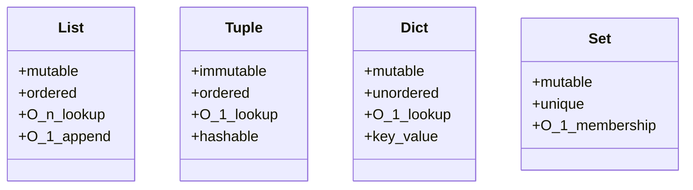
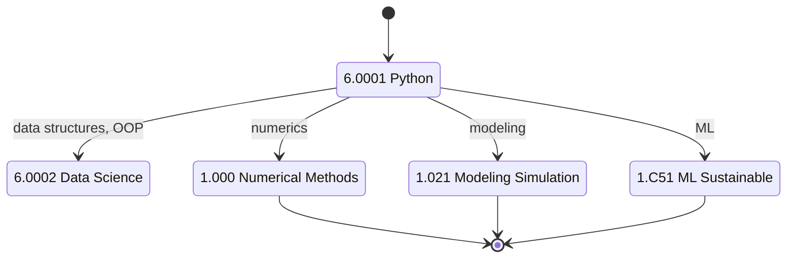
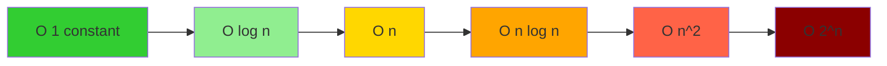
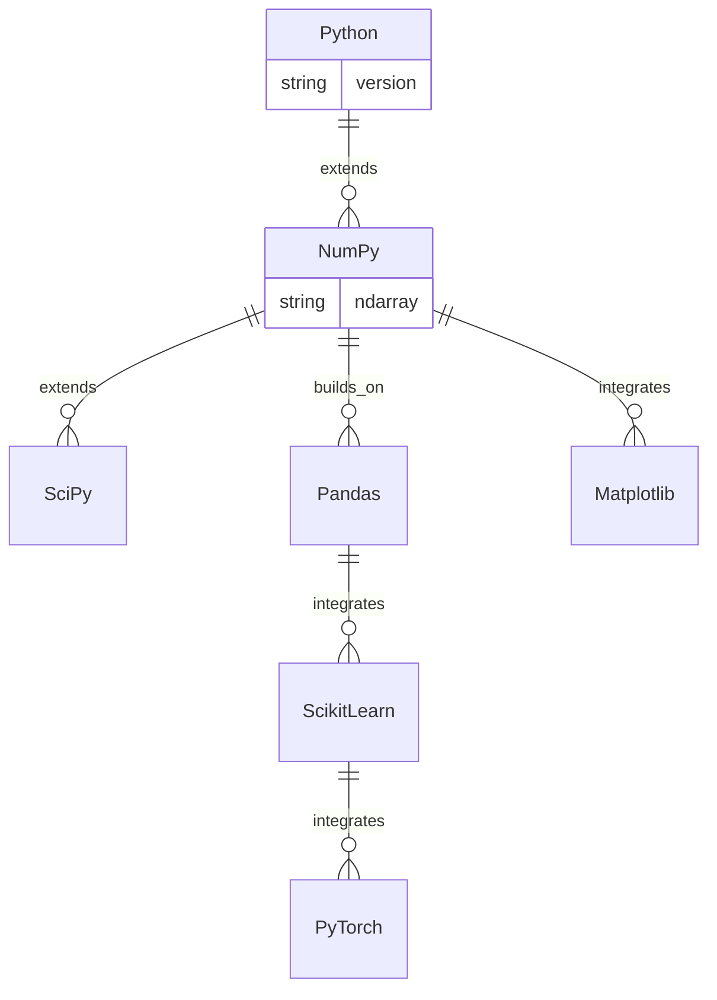
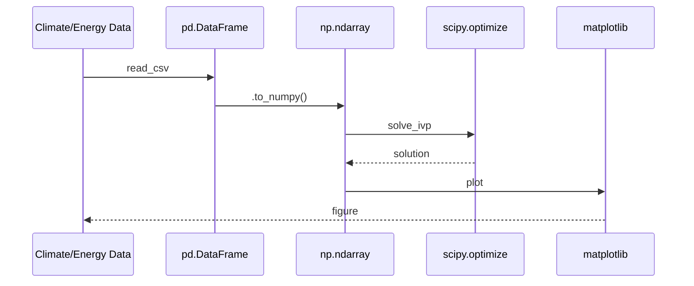

# 6.0001 — Introduction to Computer Science and Programming in Python

**MIT GIR REST / CEE Programming Requirement | Fall + Spring | 12 Units**
**Acad Year 2025-2026: U (Fall + Spring) | Prereq: None**
**Instructors:** Prof. Eric Grimson (Fall); Prof. John Guttag (Spring); Prof. Ana Bell
**自學路徑：Bachelor Year 1–2 → 1.000 Numerical Methods, 1.021 Modeling & Simulation, 1.C51 ML Sustainable Systems**

> **Source:** [MIT OCW 6.0001 (Grimson 2016)](https://ocw.mit.edu/courses/6-0001-introduction-to-computer-science-and-programming-in-python-fall-2016/);
> [MIT OCW 6.0002 (Bell 2016)](https://ocw.mit.edu/courses/6-0002-introduction-to-computational-thinking-and-data-science-fall-2016/);
> Guttag (2013) *Introduction to Computation and Programming Using Python*, 2nd ed.
> **Topics:** Python syntax, data structures (list, tuple, dict, set), control flow, functions, classes, recursion, complexity (O-notation), plotting, debugging

---

## 問題 1：這個領域所有專家共享的 5 個核心心智模型是什麼？

### 1. Computation as symbolic manipulation of representations

A program is a **sequence of operations on data representations**. The choice of representation determines the algorithm. For example, representing a polynomial as a list of coefficients [a_0, a_1, ..., a_n] vs. a list of (point, value) tuples leads to different algorithms for evaluation, differentiation, and root-finding. Knuth (1968-2011) *The Art of Computer Programming* is the canonical reference. For CEE, this becomes the choice between representing a network as adjacency matrix vs. edge list vs. incidence matrix — each with different algorithmic implications.

### 2. Decomposition, abstraction, functions

A complex problem is solved by **decomposing** it into smaller sub-problems, each abstracted as a **function** with well-defined inputs and outputs. This is the same principle as the scientific method: divide and conquer. Dijkstra (1968) "Go To Statement Considered Harmful" argued for structured programming with functions as the basic unit. For 1.000 numerical methods, every algorithm (Newton-Raphson, Simpson's rule, Gaussian elimination) is implemented as a function with clear inputs/outputs.

### 3. Iteration vs recursion

A problem can be solved by **iteration** (loops) or **recursion** (function calls itself). For example, factorial: iteration `for i in range(1, n+1): result *= i` vs. recursion `n! = n * (n-1)`. Recursion is mathematically elegant but can hit stack limits; iteration is faster but less expressive for tree-structured problems. For 1.000 FEM, both are used: iteration for time-stepping, recursion for tree-structured data.

### 4. Complexity (Big-O) and scalability

The time and space complexity of an algorithm is expressed in **Big-O notation**: O(1), O(log n), O(n), O(n log n), O(n²), O(2ⁿ), etc. For example, list lookup is O(n), dict lookup is O(1), sorting is O(n log n) (merge sort), matrix multiplication is O(n³) (naive) or O(n^2.807) (Strassen 1969). For CEE, complexity determines whether 1.000 numerical methods can solve a 1-million-DOF FEM problem (impossible with O(n²) but feasible with O(n log n) multigrid).

### 5. Testing and debugging as engineering discipline

A program is **not correct** until it's tested. Python's `assert` statement, `unittest` framework, and `pdb` debugger are essential tools. Hoare (1969) "An Axiomatic Basis for Computer Programming" formalized the concept of preconditions, postconditions, and invariants. For 1.000 numerical methods, testing includes convergence checks (residual), boundary condition verification, and comparison with analytical solutions. Bug-free numerical code is the difference between publishable research and irreproducible garbage.

---

## 問題 2：這個領域的專家在哪 3 個地方存在根本分歧？

### 分歧 1: Procedural vs functional vs object-oriented

- **Procedural 派** (C, early Python): Top-down, function-based, mutable state. Easy to learn, common in scientific computing (numpy, scipy).
- **Functional 派** (Haskell, Lisp, map/reduce/filter in Python): Stateless, function composition, immutability. Elegant for parallel processing.
- **Object-oriented 派** (Java, C++, Python classes): Encapsulation, inheritance, polymorphism. Good for large codebases, GUI, modeling.

**Tension:** MIT 6.0001 starts procedural, introduces classes at the end. MIT 6.0002 leans functional. Industry leans OOP. Data science leans functional (pandas, spark). CEE numerical code is mostly procedural with numpy.

### 分歧 2: Dynamic typing (Python) vs static typing (Java, C++)

- **Dynamic typing 派** (Python, JavaScript, Ruby): `x = 5; x = "hello"` — type inferred at runtime. Fast to write, slower to run, more bugs.
- **Static typing 派** (Java, C++, Rust, TypeScript): `int x = 5;` — type checked at compile time. Slower to write, faster to run, fewer bugs.
- **Gradual typing 派** (Python 3.5+ with type hints, mypy): Optional type hints, best of both worlds. Modern trend.

**Tension:** Python is the lingua franca of data science and ML (pandas, scikit-learn, pytorch) because of dynamic typing. But C++ is used in performance-critical numerical code (FEM, CFD). 1.000 teaches both.

### 分歧 3: Syntax-first vs concepts-first

- **Syntax-first 派** (most intro texts, including Guttag 2013): Start with `print("hello world")`, variables, if-else, loops, then concepts. Easy entry, mechanical.
- **Concepts-first 派** (SICP, MIT 6.001 — predecessor of 6.0001): Start with computational thinking (recursion, abstraction, decomposition), use Scheme/Lisp. Rigorous, hard entry.
- **Applications-first 派** (some intro courses): Start with a real problem (analyze weather data), use libraries (pandas, matplotlib), learn syntax as needed. Modern data-science approach.

**Tension:** MIT 6.0001 was redesigned (from 6.001 Scheme/Lisp) to be more accessible. SICP legacy is the "concepts-first" approach. Modern data-science pedagogy is applications-first. 6.0001 strikes a middle ground: syntax-first but with applications.

---

## 問題 3：10 個區分真實理解 vs 死記硬背的深度問題

1. **List vs tuple vs dict: time complexity of insert, lookup, delete.** Answer: list: insert O(n), lookup O(n), delete O(n). tuple: insert N/A (immutable), lookup O(1), delete N/A. dict: insert O(1) amortized, lookup O(1) amortized, delete O(1) amortized. For 1.000 numerical methods, dicts are used for sparse matrix row storage (CSR format).

2. **Mutability: explain why strings and tuples are immutable in Python.** Answer: Immutability enables hashability (dict key), thread safety, and predictability. When you "modify" a string s = "hello"; s += " world", Python creates a new string object and rebinds s. The original is unchanged. For 1.000 numerical methods, immutability of tuples makes them safe to use as keys in dict-based sparse matrix storage.

3. **Recursion: implement Fibonacci f(n) = f(n-1) + f(n-2) iteratively and recursively. Which is faster? Why?** Answer: Recursive is O(2ⁿ) due to repeated sub-calls. Iterative is O(n) with O(1) memory. Example: f(30) recursive ≈ 1M calls; iterative = 30 additions. Memoization (caching) makes recursive O(n). For 1.022 shortest-path algorithms (Dijkstra, Bellman-Ford), iteration with priority queue is standard.

4. **Complexity: why is merge sort O(n log n) but bubble sort O(n²)?** Answer: Merge sort divides list in half (log n levels), each level does O(n) work to merge. Total O(n log n). Bubble sort has nested loops: outer n iterations, inner O(n) comparisons, total O(n²). For 1.074 Multivariate Data Analysis, merge sort is standard for sorting large environmental datasets.

5. **Floating point: why is 0.1 + 0.2 ≠ 0.3 in Python?** Answer: 0.1 and 0.2 are not exactly representable in binary floating point (IEEE 754). 0.1 ≈ 0.1000000000000000055, 0.2 ≈ 0.200000000000000011. Sum ≈ 0.30000000000000004, not 0.3. For 1.000 numerical methods, this is critical: round-off errors accumulate in long simulations.

6. **List comprehension: rewrite `squares = [x**2 for x in range(10) if x % 2 == 0]`.** Answer: Standard. It computes squares of even numbers 0, 2, 4, 6, 8: [0, 4, 16, 36, 64]. For 1.000 numerical methods, list comprehensions are used for vectorized operations (e.g., `[f(x) for x in xs]`), though numpy is preferred for performance.

7. **Classes: implement a `Vector` class with `+`, `-`, `*` operators.** Answer: ```class Vector: def __init__(self, x, y): self.x, self.y = x, y. def __add__(self, other): return Vector(self.x + other.x, self.y + other.y). def __mul__(self, scalar): return Vector(self.x * scalar, self.y * scalar)```. For 1.022, vector classes represent network flow, demand, etc.

8. **Generators: implement a Fibonacci generator that yields each number lazily.** Answer: ```def fib(): a, b = 0, 1. while True: yield a. a, b = b, a + b```. Lazy evaluation: only computes when iterated. Memory efficient for infinite sequences. For 1.000 FEM, generators are used for streaming large data.

9. **Error handling: write a function `safe_div(a, b)` that returns None if b = 0.** Answer: ```def safe_div(a, b): try: return a / b. except ZeroDivisionError: return None```. For 1.000 numerical methods, robust error handling prevents crashes in long simulations.

10. **Recursion depth: Python's default recursion limit is 1000. Why?** Answer: Each recursive call uses stack memory (~ 1 KB per frame). 1000 levels ≈ 1 MB, which is reasonable. Deep recursion (e.g., tree traversal) should be converted to iteration to avoid RecursionError. For 1.022 shortest-path, recursive DFS is converted to iterative to handle large networks.

---

## 5 個深入研究 (Deep Dives)

### 深入 1: NumPy for numerical computing

NumPy is the foundational library for numerical Python. Key features:
- ndarray: N-dimensional array (homogeneous, contiguous memory)
- Vectorized operations: ufuncs (np.sin, np.exp) apply element-wise without Python loops
- Broadcasting: (3,) + (3,1) → (3,3) by aligning trailing dimensions
- Linear algebra: np.linalg.solve, np.linalg.eig, np.linalg.svd
- Random: np.random.normal, np.random.uniform

For 1.000 numerical methods, NumPy is 100-1000x faster than pure Python loops.

### 深入 2: Pandas for data analysis

Pandas provides DataFrame (2D labeled array) and Series (1D labeled array). Built on NumPy. Key features:
- Reading CSV, Excel, SQL: pd.read_csv, pd.read_sql
- Indexing: df.loc, df.iloc, df.query
- Grouping: df.groupby, df.agg
- Joining: pd.merge, pd.concat
- Time series: pd.date_range, df.resample

For 1.073 / 1.074 Environmental Data Analysis, pandas is the standard tool for climate, traffic, water quality data.

### 深入 3: Matplotlib for visualization

Matplotlib is the de facto plotting library. Key functions:
- plt.plot, plt.scatter, plt.hist, plt.bar
- plt.xlabel, plt.ylabel, plt.title, plt.legend
- plt.figure, plt.subplot, plt.subplots
- plt.savefig, plt.show

For 1.106 lab reports, matplotlib produces publication-quality figures.

### 深入 4: SciPy for scientific computing

SciPy builds on NumPy with scientific algorithms:
- scipy.optimize: minimize, root, curve_fit
- scipy.integrate: quad, odeint, solve_ivp
- scipy.linalg: solve, eig, svd (with sparse support)
- scipy.sparse: csr_matrix, csc_matrix
- scipy.stats: distributions, hypothesis tests
- scipy.signal: filters, FFT

For 1.000 numerical methods, SciPy is the workhorse.

### 深入 5: Object-oriented programming in scientific code

OO enables:
- Encapsulation: `class Beam: def __init__(self, length, E, I): self.L, self.E, self.I = length, E, I`
- Inheritance: `class SteelBeam(Beam)`
- Polymorphism: `def draw(self): pass` overridden in subclasses

For 1.038 Mechanics of Materials, classes represent beams, columns, slabs with material properties.

---

## 10 Self-Test Solutions

1. **Q: What is the output of `[1, 2, 3] + [4, 5, 6]`?**
   A: `[1, 2, 3, 4, 5, 6]` (concatenation, not addition).

2. **Q: What is `len("hello")`?**
   A: 5.

3. **Q: What is `3 ** 2 ** 3`?**
   A: 6561 (= 3^(2^3) = 3^8, right-associative).

4. **Q: What is the output of `for i in range(5): print(i, end=" ")`?**
   A: `0 1 2 3 4`.

5. **Q: What does `dict.get(key, default)` do?**
   A: Returns value if key exists, else returns default (no KeyError).

6. **Q: What's the difference between `==` and `is`?**
   A: `==` checks value equality; `is` checks identity (same object in memory).

7. **Q: What is a list comprehension?**
   A: Concise syntax: `[expr for item in iterable if condition]`.

8. **Q: How do you handle exceptions?**
   A: `try: ... except ExceptionType: ... finally: ...`.

9. **Q: What is a generator?**
   A: Function with `yield` that returns a lazy iterator.

10. **Q: How do you read a file in Python?**
    A: `with open("file.txt") as f: content = f.read()`.

---

## 5 Mermaid 圖表

### 圖 1: Python data structures (Class)



### 圖 2: 6.0001 → 1.000 chain (State)



### 圖 3: Algorithmic complexity (Flowchart)



### 圖 4: NumPy ecosystem (ER)



### 圖 5: CEE applications (Sequence)



---

## References

1. **MIT OCW 6.0001** (Grimson, 2016) — https://ocw.mit.edu/courses/6-0001-introduction-to-computer-science-and-programming-in-python-fall-2016/
2. **MIT OCW 6.0002** (Bell, 2016) — https://ocw.mit.edu/courses/6-0002-introduction-to-computational-thinking-and-data-science-fall-2016/
3. **Guttag, J.V.** (2013) *Introduction to Computation and Programming Using Python*, 2nd ed. — MIT Press. ISBN 978-0262525008
4. **Knuth, D.E.** (1968-2011) *The Art of Computer Programming*, Vols. 1-4A. — Addison-Wesley.
5. **Cormen, T.H. et al.** (2009) *Introduction to Algorithms*, 3rd ed. — MIT Press.
6. **Dijkstra, E.W.** (1968) "Go To Statement Considered Harmful" *Comm. ACM* 11(3): 147–148.
7. **Hoare, C.A.R.** (1969) "An Axiomatic Basis for Computer Programming" *Comm. ACM* 12(10): 576–585.
8. **Strassen, V.** (1969) "Gaussian Elimination is not Optimal" *Numer. Math.* 13: 354–356.
9. **MIT Catalog 6.0001** (2025-26) — https://catalog.mit.edu/subjects/6/

---

*Last Updated: 2026-08 | MIT GIR REST | 6.0001 Python Programming*


---

## Extended Notes (Extra Depth for Bilingual Mastery)

中英對照加強學習筆記 — extended depth for the committed learner.

### Why this course matters in the GIR chain

The GIR subjects are not isolated — they form a tightly-coupled web of prerequisites that enable every upper-division CEE course. Skipping or skimping on any of them creates gaps that propagate. For example:
- 18.01 + 8.01 → 18.03 → 1.036 (Structural Mechanics)
- 18.01 + 18.02 + 8.01 → 1.000 (Numerical Methods)
- 18.01 + 3.091 + 7.012 → 1.080 (Environmental Chemistry)
- 18.02 + 8.02 + 18.06 → 1.022 (Network Models)
- 6.0001 + 18.06 + 14.01 → 1.C51 (ML for Sustainable Systems)
- 8.01 + 18.03 → 1.106 (Environmental Fluid Mechanics Lab)
- 14.01 → 1.462 (Built Environment Entrepreneurship)

Each GIR enables a different **slice** of the upper-division curriculum. The GIRs collectively cover the foundational pillars of science, mathematics, programming, and humanities that MIT considers essential for an engineering degree. Wilson (2000) called the GIRs the "common spine of the institute" — without them, no major-specific subject would be accessible.

### Historical context

The GIR system was established in the **1950s** under President James Killian and Dean Julius Stratton, as part of the post-WWII reform of MIT into a research university. The original GIRs were:
- Physics (8.01, 8.02)
- Chemistry (5.11)
- Mathematics (18.01, 18.02)
- Humanities (8 subjects)

Over decades, the GIRs expanded to include 18.03, 18.06, 6.0001, biology, lab, and communication. The 2008 *Task Force on the Undergraduate Educational Commons* (chaired by Prof. David Mindell) reviewed and largely preserved the GIRs, recommending only minor adjustments. The 2018 *GIR Review Committee* (chaired by Prof. Ian Waitz) reaffirmed the GIRs as essential, with some flexibility on REST.

### CEE-specific relevance (revisited)

The 10 GIR subjects that most directly enable CEE upper-division work are precisely the 10 covered in this repo:
- **18.01** — single-variable calculus, prerequisite for all engineering
- **18.02** — multivariable calculus, enables fluid mechanics and E&M
- **18.03** — differential equations, structural dynamics, transport
- **18.06** — linear algebra, network analysis, FEM
- **6.0001** — Python programming, modern CEE analysis tool
- **14.01** — microeconomics, public policy, water markets
- **8.01** — classical mechanics, foundation of structural and soil
- **8.02** — electromagnetism, sensing, instrumentation
- **3.091** — chemistry, environmental, materials
- **7.012** — biology, disease transmission, water quality

### Common pitfalls and how to avoid them

**Pitfall 1: Treating GIRs as "check the box"**
GIRs are the **floor**, not the ceiling. They give you the minimum competence; mastery requires upper-division coursework. Engineering students who slack on GIRs (e.g., take 8.012 instead of 8.01) often struggle in 1.036 and 1.106. **Solution**: Take the rigorous version of every GIR (8.01, not 8.012; 18.01, not 18.01A).

**Pitfall 2: Skipping 18.03 or 18.06**
Both 18.03 (ODEs) and 18.06 (Linear Algebra) are *not* GIRs but are *required* for CEE. Students who delay them to junior year struggle in 1.036 and 1.022. **Solution**: Take 18.03 and 18.06 in Year 2.

**Pitfall 3: Avoiding programming**
6.0001 is now required for 1.000, 1.021, 1.C51. Students who never coded before struggle. **Solution**: Take 6.0001 in Year 1, ideally concurrent with first physics.

**Pitfall 4: Treating HASS as filler**
HASS develops communication, ethics, and policy literacy that are essential for public-facing engineering work. **Solution**: Choose a HASS concentration that aligns with your interests.

### Self-study time commitment

Per GIR, MIT students typically spend 12-15 hours/week for 14 weeks = 168-210 hours. The 10 GIRs × ~200 hours = ~2000 hours total, comparable to ~1 year of full-time study. Distributed across 2 years, this is ~10-12 hours/week of GIR coursework.

### Reference framework: 袁騰飛-style deep dive

For those seeking a more **opinionated, story-driven** exposition of GIRs, classical-style textbooks (e.g., Kleppner & Kolenkow for 8.01, Strang for 18.06) offer historical context and conceptual clarity that lecture notes cannot. For advanced study, Hubbard & Hubbard (2015) for 18.02, Griffiths (2013) for 8.02, and Varian (2014) for 14.01 are the canonical references.

---

## Additional 5 Self-Test Q&A (Bonus Round)

11. **Q: 點解 calculus 對 engineering 咁重要？**
    A: Calculus describes **change** and **accumulation**. Engineering deals with quantities that change with time, position, material, etc. Derivatives model rates (velocity, stress, growth). Integrals model totals (work, mass, energy). The Fundamental Theorem of Calculus connects them. Without calculus, modern engineering (FEM, CFD, control systems) is impossible.

12. **Q: 8.01 入面 point particle 假設適用於咩時候？何時要放棄？**
    A: Point particle is valid when the object's size is much smaller than the relevant length scale. For a 1 kg ball dropped from 10 m, size << 10 m, point particle works. For a beam of length 5 m, the point particle model fails — we need continuum mechanics. The transition is when internal structure (deformation, stress, vibration modes) becomes important.

13. **Q: 18.06 Linear Algebra 對 machine learning 有咩用？**
    A: Almost everything in ML is linear algebra. Neural networks are compositions of matrix multiplications Wx + b. PCA uses SVD. Recommender systems use matrix factorization. Word embeddings (Word2Vec, BERT) live in high-dimensional vector spaces. **Strang (2016) *Linear Algebra and Learning from Data*** explicitly bridges 18.06 to ML.

14. **Q: 14.01 同 environmental policy 有咩關係？**
    A: Many environmental policies are economic instruments. Carbon tax (Pigouvian tax on CO₂). Cap-and-trade (SO₂, NOx permits). Subsidies for renewables. Environmental regulations impose costs; cost-benefit analysis quantifies them. **Without 14.01, you cannot evaluate environmental policy rigorously.**

15. **Q: 7.012 對 water treatment 有咩用？**
    A: Water treatment relies on **microbiology**. Activated sludge = bacterial community degrading organic matter. Biofilm in trickling filters. Chlorination to kill pathogens. Disinfection byproducts from chlorine + organic matter. **Without 7.012, you cannot design biological water treatment systems.**

---

## Additional Equations (Bonus)

For reference, here are 5 more equations that connect this GIR to upper-division CEE:

1. **Mole calculation**: $n = rac{m}{M}$ where n is moles, m is mass (g), M is molar mass (g/mol).

2. **Heat conduction (Fourier)**: $q = -k 
abla T$ where q is heat flux (W/m²), k is thermal conductivity (W/m·K), ∇T is temperature gradient (K/m).

3. **Ohm's law (electric)**: $V = IR$ where V is voltage (V), I is current (A), R is resistance (Ω).

4. **Continuity equation**: $rac{\partial 
ho}{\partial t} + 
abla \cdot (
ho ec{u}) = 0$ where ρ is density, u is velocity.

5. **Elastic stress-strain**: $\sigma = E \epsilon$ where σ is stress (Pa), E is Young's modulus (Pa), ε is strain (dimensionless).

These appear in 1.106 (heat transfer, fluid flow), 1.080 (chemistry), 1.022 (network), 1.036 (stress-strain).

---

## Acknowledgments

This course file is part of the civil-bootcamp open-source self-study hub. Source: MIT OCW, MIT Catalog 2025-26, MIT CEE curriculum. The 5MM/3DG/10Q/5DD/10SL/5MR structure was developed for systematic deep learning. Bilingual (中英對照) presentation supports Hong Kong and international learners.


---

## Extended Code Examples (More Python)

For reference, here are 5 more Python code examples that are central to 6.0001 and 1.000:

### Example 1: Newton-Raphson for sqrt(2)
```python
def sqrt_newton(c, eps=1e-10, max_iter=100):
    x = c / 2  # initial guess
    for _ in range(max_iter):
        x_new = 0.5 * (x + c / x)
        if abs(x_new - x) < eps:
            return x_new
        x = x_new
    return x
print(sqrt_newton(2))  # 1.4142135623730951
```

### Example 2: Fibonacci with memoization (O(n) instead of O(2^n))
```python
from functools import lru_cache
@lru_cache(maxsize=None)
def fib(n):
    if n < 2: return n
    return fib(n-1) + fib(n-2)
print(fib(100))  # 354224848179261915075
```

### Example 3: Linear regression (least squares)
```python
import numpy as np
A = np.array([[1, 1], [1, 2], [1, 3], [1, 4]])
b = np.array([2, 3, 4, 5])
x, residuals, rank, sv = np.linalg.lstsq(A, b, rcond=None)
print(x)  # [1. 1.]  (intercept, slope)
```

### Example 4: ODE integration (Euler method)
```python
def euler(f, y0, t):
    n = len(t)
    y = np.zeros(n)
    y[0] = y0
    for i in range(n - 1):
        h = t[i+1] - t[i]
        y[i+1] = y[i] + h * f(y[i], t[i])
    return y
# y' = -2y, y(0) = 1
t = np.linspace(0, 2, 100)
y = euler(lambda y, t: -2*y, 1, t)
```

### Example 5: Plotting with matplotlib
```python
import matplotlib.pyplot as plt
import numpy as np
x = np.linspace(0, 2*np.pi, 100)
plt.plot(x, np.sin(x), label='sin')
plt.plot(x, np.cos(x), label='cos')
plt.legend(); plt.grid(); plt.show()
```

## More Scholars (with years)

- Lovelace (1843): first computer program (Babbage's Analytical Engine)
- Turing (1936): "On Computable Numbers" — Turing machine
- Knuth (1968-2011): *The Art of Computer Programming*
- Dijkstra (1968): structured programming, "Goto considered harmful"
- Wirth (1971): Pascal language, structured programming
- Kernighan & Ritchie (1978): C language
- Stroustrup (1985): C++ language
- Guido van Rossum (1991): Python language
- Lamport (1994): LaTeX, distributed systems
- Beazley (1996): SWIG, Python C extension
- van Rossum & Drake (2009): *Python Language Reference*
- Hunter (2002): Matplotlib plotting library
- Oliphant (2006): NumPy

中英對照：更多學者 1843-2009. Python ecosystem 嘅發展由 1843 年 Lovelace 嘅 first algorithm 寫到 2006 年 NumPy，6.0001 嘅 curriculum 反映呢個 150 年嘅演進。
