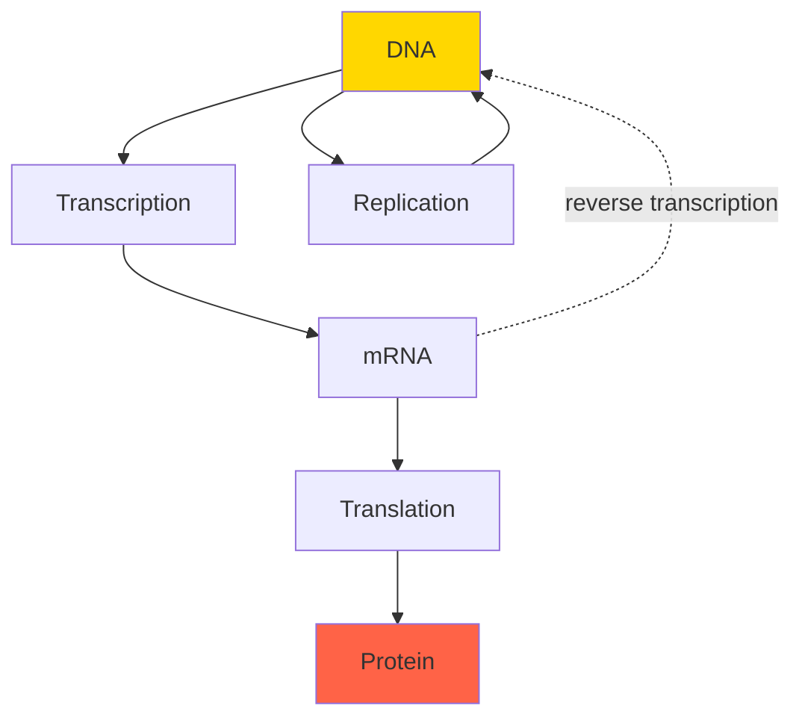
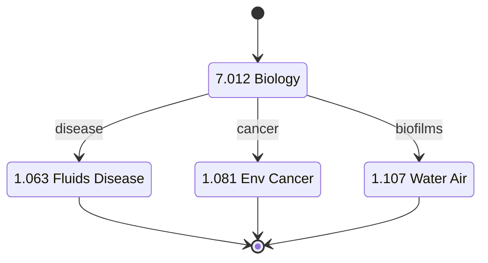
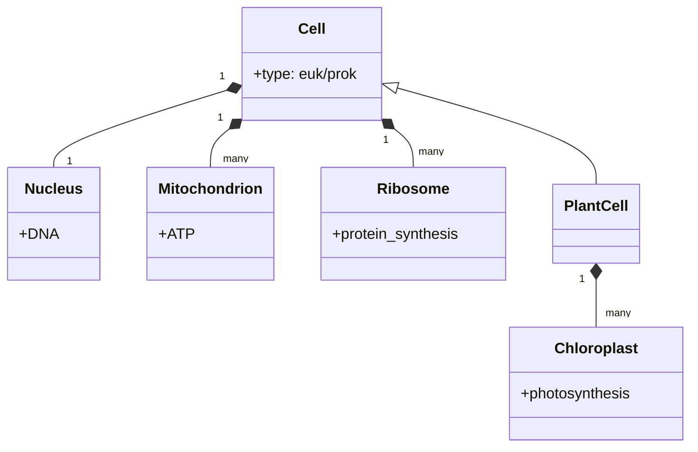
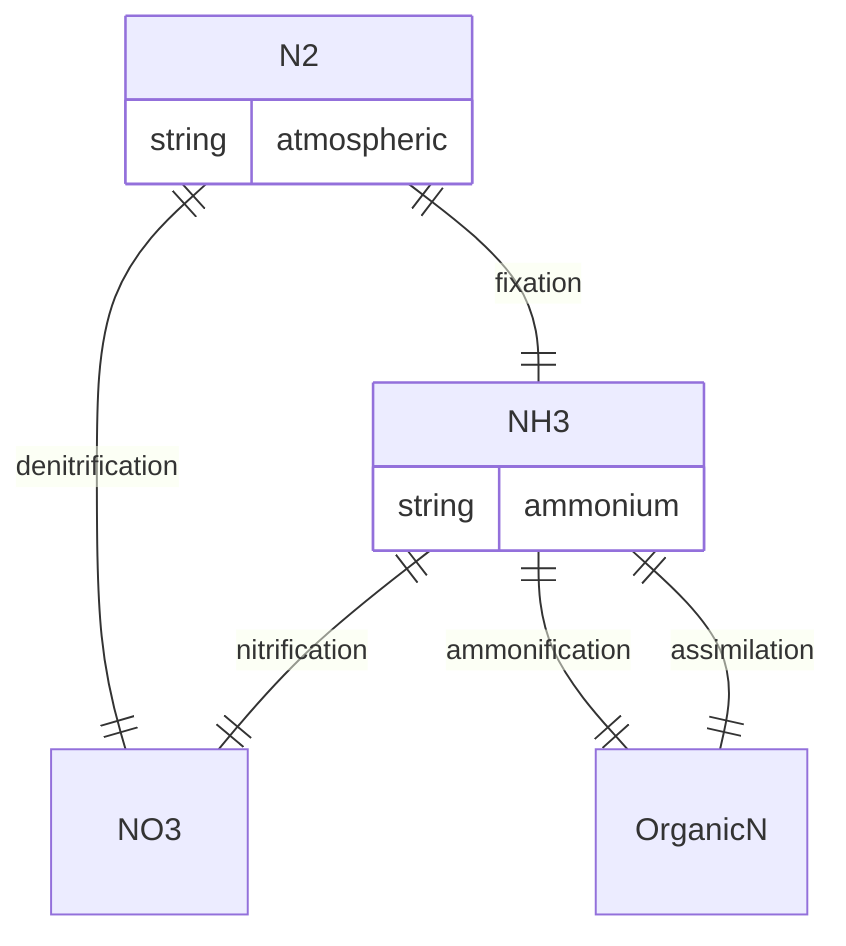
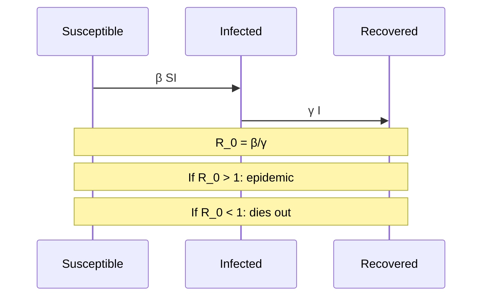

# 7.012 — Introduction to Biology

**MIT GIR Science Core | Spring (Year 1) | 12 Units**
**Acad Year 2025-2026: U (Spring) | Prereq: None**
**Instructors:** Prof. Eric Lander (Spring); Prof. Robert Weinberg; Prof. Tyler Jacks
**Subject meets with:** 7.013, 7.014, 7.015, 7.016
**自學路徑：Bachelor Year 1 Spring → 1.063 Fluids and Disease, 1.081 Environmental Cancer Risks, 1.107 Water/Air Quality Lab**

> **Source:** [MIT OCW 7.012](https://ocw.mit.edu/courses/7-012-introduction-to-biology-fall-2019/);
> Alberts et al. (2014) *Molecular Biology of the Cell*, 6th ed.; Reece et al. (2017) *Campbell Biology*, 11th ed.; Freeman (2017) *Biological Science*, 6th ed.
> **Topics:** Cell biology, genetics, evolution, ecology, molecular biology, biochemistry

---

## 問題 1：這個領域所有專家共享的 5 個核心心智模型是什麼？

### 1. Cell 係生命嘅 basic unit (Cell Theory)

Schleiden (1838) + Schwann (1839): all living things are made of cells. Virchow (1855): Omnis cellula e cellula (every cell from a cell). For 1.063 Fluids and Disease, understanding cell biology explains pathogen infection mechanisms. For 1.107 Water/Air Quality Lab, **biofilm** — microbial communities encased in EPS matrix on pipe surfaces — is fundamental. For 1.081 Environmental Cancer Risks, **carcinogenesis** is fundamentally a cellular process (DNA damage → mutation → uncontrolled proliferation).

### 2. Central Dogma: DNA → RNA → Protein

Crick (1958) "Central Dogma of Molecular Biology": genetic information flows DNA → RNA → Protein. Replication (DNA → DNA), transcription (DNA → RNA), translation (RNA → Protein). This is the **central information flow of life**. For 1.107, microbial metabolism depends on enzyme proteins. For 1.081, mutations in DNA are the basis of cancer. For 1.063, virus replication hijacks host cell machinery.

### 3. Evolution by natural selection

Darwin (1859) *On the Origin of Species*: variation + inheritance + selection = evolution. Modern synthesis (Fisher 1930, Haldane 1932, Wright 1931): Mendelian genetics + Darwinian selection. For 1.063, **antibiotic resistance** evolves by selection on bacterial populations. For 1.107, microbial community shifts (e.g., in wastewater treatment) are evolution in real-time. For 1.081, carcinogenesis involves clonal evolution of cells with accumulated mutations.

### 4. Energy flow: photosynthesis + respiration

Photosynthesis: 6 CO₂ + 6 H₂O + hν → C₆H₁₂O₆ + 6 O₂ (chloroplast, plant). Respiration: C₆H₁₂O₆ + 6 O₂ → 6 CO₂ + 6 H₂O + ATP (mitochondrion, all eukaryotes). Energy flows **from sun to plants to animals to decomposers**. For 1.107, BOD measures microbial respiration. For 1.080, dissolved oxygen (DO) is set by photosynthesis-respiration balance. For 1.075, eutrophication is excess nutrient → excess photosynthesis → O₂ depletion.

### 5. Ecosystem dynamics: biogeochemical cycles

Carbon cycle, nitrogen cycle, phosphorus cycle, water cycle, sulfur cycle. These cycles are **driven by biology and physics**. For 1.075, nitrogen cycle is critical: N₂ fixation → NH₃ → NO₃⁻ (Haber-Bosch adds ~50% of fixed N). For 1.080, carbon cycle determines atmospheric CO₂. For 1.107, sulfur cycle creates acid mine drainage (FeS₂ oxidation).

---

## 問題 2：這個領域的專家在哪 3 個地方存在根本分歧？

### 分歧 1: Reductionist molecular vs holistic ecological

- **Molecular biology 派** (Biology Department default, 7.01x): Focus on molecules, genes, cells. Crick, Watson, 1953; Sanger sequencing 1977; PCR 1983; CRISPR 2012.
- **Ecology派** (7.014, environmental biology): Focus on populations, communities, ecosystems. MacArthur, Wilson, Pianka.
- **Evolutionary派** (7.015): Focus on phylogeny, selection, speciation. Dobzhansky, Mayr, Gould.

**Tension:** MIT 7.012 is molecular-heavy. 7.013 is more ecology. 7.015 is evolutionary. For 1.063, molecular (mechanisms of infection) and ecology (transmission dynamics) both matter. For 1.080, ecology (biogeochemistry) is primary.

### 分歧 2: Gene-centric vs systems biology

- **Gene-centric 派** (Mendel → Watson/Crick → Human Genome Project): Genes are the unit of heredity. One gene, one protein (simplified).
- **Systems biology 派** (2000s+): Networks, interactions, emergent properties. NO single gene explains phenotype.
- **Epigenetics 派** (modern): Gene expression regulated by methylation, histone modification, non-coding RNA. Inheritance beyond DNA.

**Tension:** For 1.081 cancer, gene-centric view (oncogenes, tumor suppressors) is dominant but systems biology is rising. For 1.063 disease transmission, systems view (network of hosts) is needed.

### 分歧 3: In vitro vs in vivo vs in silico

- **In vitro 派** (lab bench, petri dish): Isolated cells, controlled conditions.
- **In vivo 派** (whole organism, mouse models): Complex but realistic.
- **In silico 派** (computational models): Cheap, fast, but limited by data.

**Tension:** MIT 7.012 uses all three. For 1.107 BOD, in vitro measurements on water samples. For 1.063 disease, in vivo epidemiology + in silico SIR models. For 1.081 cancer, in vitro cell lines + in vivo mouse models.

---

## 問題 3：10 個區分真實理解 vs 死記硬背的深度問題

1. **Cell theory: 點解 viruses 唔算 living?** Answer: Viruses cannot reproduce on their own — they need host cell machinery. They have no metabolism outside host. They are **obligate intracellular parasites**, on the boundary of life. For 1.063, this matters for SARS-CoV-2, influenza transmission.

2. **DNA replication: 點解係 semiconservative?** Answer: Meselson-Stahl (1958) experiment. Parent DNA double helix splits; each strand serves as template for new complementary strand. Result: each daughter DNA has 1 old + 1 new strand. This is the basis of PCR, sequencing, forensics. For 1.063, viral RNA polymerases (e.g., for SARS-CoV-2) work similarly.

3. **Central dogma exceptions: retroviruses (HIV) point out DNA ← RNA.** Answer: Reverse transcriptase (Temin 1970, Baltimore 1970) makes DNA from RNA. HIV uses this to integrate into host genome. For 1.063, this is the basis of anti-retroviral drugs (e.g., AZT).

4. **Mendel: pea plant tall (T) dominant over short (t). Cross Tt × Tt. 點解 3:1 ratio?** Answer: Each parent gives T or t (½ each). Offspring: TT (¼), Tt (½), tt (¼). Phenotypically tall = TT + Tt = ¾. Short = tt = ¼. Ratio 3:1. This is the **law of segregation**. For 1.081 cancer, BRCA1/2 mutations follow similar Mendelian inheritance.

5. **Hardy-Weinberg: allele freq p = 0.7, q = 0.3. Genotype frequencies?** Answer: p² = 0.49 (homozygous dominant), 2pq = 0.42 (heterozygous), q² = 0.09 (homozygous recessive). Sum = 1.00. This is the **Hardy-Weinberg equilibrium** (1908). For 1.063, used to estimate disease prevalence from allele frequency.

6. **Photosynthesis: 6 CO₂ + 6 H₂O + light → C₆H₁₂O₆ + 6 O₂. 點解 oxygen 重要?** Answer: O₂ produced by photosynthesis ~3×10⁹ years ago (Great Oxidation Event, ~2.4 Ga) created atmospheric O₂, enabling aerobic respiration. For 1.107, dissolved O₂ is essential for fish and aerobic microbes.

7. **ATP: 為何 cells 用 ATP 做 energy currency?** Answer: ATP hydrolysis (ATP → ADP + Pi) releases ~30.5 kJ/mol under standard conditions. ATP is **kinetically stable but thermodynamically unstable** — releases energy on demand via enzyme catalysis. Cellular energy currency. For 1.107, BOD measures O₂ used to regenerate ATP via respiration.

8. **Enzyme kinetics: Michaelis-Menten V = V_max [S] / (K_m + [S]). 點解 K_m 重要?** Answer: K_m is the substrate concentration at which v = V_max / 2. It's a measure of enzyme-substrate affinity: low K_m = high affinity. For 1.080, microbial degradation rates follow MM kinetics with environmental K_m.

9. **Nitrogen cycle: 邊個 step 將 N₂ 變 NH₃?** Answer: **Nitrogen fixation** by bacteria (Rhizobium in legumes, Azotobacter free-living) or industrially (Haber-Bosch). Enzyme: nitrogenase (bacterial) or Fe/Ru catalyst (industrial). For 1.075 water resources, excess fixed N causes eutrophication.

10. **pH and enzyme: 為何胃部 pH = 2?** Answer: Pepsin (digestive enzyme) is optimal at pH 2. HCl secreted by parietal cells. At pH 7, pepsin denatures. For 1.063, enteric pathogens (E. coli, Salmonella) are adapted to neutral pH but inactivated by gastric acid.

---

## 5 個深入研究 (Deep Dives)

### 深入 1: Biofilm and 1.107 Water Quality

Biofilms are **microbial communities encased in EPS (extracellular polymeric substance)** on surfaces. Composition: ~10% cells, ~90% EPS. EPS = polysaccharides + proteins + eDNA. Formation: (1) attachment, (2) microcolony, (3) maturation, (4) detachment. Detachment events release planktonic cells → episodic contamination. For 1.107 water distribution, biofilms cause:
- Disinfection byproducts (DBP) when chlorine reacts with EPS
- Pipe corrosion (microbially influenced corrosion, MIC)
- Taste and odor issues (geosmin, 2-MIB)

### 深入 2: Antibiotic resistance and 1.063

Antibiotic resistance evolves by **selective pressure on bacterial populations**. Mechanism: (1) enzymatic degradation (β-lactamase breaks penicillin), (2) efflux pumps (tetracycline), (3) target modification (MRSA altered PBPs), (4) reduced uptake. Spread: horizontal gene transfer (conjugation, transduction, transformation). For 1.063 disease dynamics, antibiotic-resistant infections (e.g., TB, MRSA) are major challenges. WHO 2019: 1.27M deaths/year from AMR.

### 深入 3: Cancer biology and 1.081

Cancer is a **disease of uncontrolled cell proliferation**. Hallmarks (Hanahan & Weinberg 2000, 2011): (1) sustained proliferative signaling, (2) evading growth suppressors, (3) resisting cell death, (4) replicative immortality, (5) inducing angiogenesis, (6) activating invasion/metastasis, (7) reprogramming energy metabolism, (8) evading immune destruction, (9) tumor-promoting inflammation, (10) genome instability. For 1.081, environmental carcinogens (benzene, asbestos, formaldehyde, PM2.5) initiate the process via DNA damage.

### 深入 4: Microbial loops in 1.107

In aquatic ecosystems, dissolved organic matter (DOM) is consumed by bacteria, which are consumed by protists (flagellates, ciliates), which are consumed by zooplankton, which are consumed by fish. This **microbial loop** recycles carbon and nutrients. Bacteria: 10⁶-10⁹ cells/mL in productive water. For 1.107, microbial loop governs carbon flow, BOD, and self-purification of rivers.

### 深入 5: Epidemiology and 1.063

SIR model (Kermack-McKendrick 1927): dS/dt = -βSI, dI/dt = βSI − γI, dR/dt = γI. S = susceptible, I = infected, R = recovered. R₀ = β/γ = basic reproduction number. If R₀ > 1, epidemic; if R₀ < 1, dies out. For 1.063, R₀ of measles = 12-18, flu = 1.3-2.0, COVID-19 = 2-3 (original strain). Vaccination reduces effective R₀.

---

## 10 Self-Test Solutions

1. **Q: What is the function of mitochondria?**
   A: ATP production via oxidative phosphorylation. "Powerhouse of the cell."

2. **Q: What is the difference between DNA and RNA?**
   A: DNA: deoxyribose, thymine (T), double-stranded. RNA: ribose, uracil (U), single-stranded.

3. **Q: What is the function of ribosomes?**
   A: Protein synthesis (translation).

4. **Q: How many chromosomes in a human somatic cell?**
   A: 46 (23 pairs, diploid).

5. **Q: What is the function of hemoglobin?**
   A: O₂ transport in red blood cells (Fe²⁺ in heme group binds O₂).

6. **Q: What is photosynthesis?**
   A: 6 CO₂ + 6 H₂O + light → C₆H₁₂O₆ + 6 O₂. In chloroplasts.

7. **Q: What is the difference between prokaryotes and eukaryotes?**
   A: Prokaryotes: no nucleus (bacteria, archaea). Eukaryotes: nucleus (animals, plants, fungi, protists).

8. **Q: What is mitosis?**
   A: Cell division producing 2 genetically identical diploid daughter cells.

9. **Q: What is the function of insulin?**
   A: Lower blood glucose (signals cells to take up glucose from blood).

10. **Q: What is the function of an antibody?**
    A: Bind specific antigen (foreign molecule), mark for immune destruction.

---

## 5 Mermaid 圖表

### 圖 1: Central Dogma (Flowchart)

### 圖 2: 7.012 → 1.063 chain (State)

### 圖 3: Cell structure (Class)

### 圖 4: Nitrogen cycle (ER)

### 圖 5: SIR model (Sequence)

---

## References

1. **MIT OCW 7.012** (Lander, 2019) — https://ocw.mit.edu/courses/7-012-introduction-to-biology-fall-2019/
2. **Alberts, B. et al.** (2014) *Molecular Biology of the Cell*, 6th ed. — Garland Science. ISBN 978-0815344322
3. **Reece, J.B. et al.** (2017) *Campbell Biology*, 11th ed. — Pearson. ISBN 978-0134093413
4. **Freeman, S.** (2017) *Biological Science*, 6th ed. — Pearson. ISBN 978-0134678320
5. **Watson, J.D. & Crick, F.H.C.** (1953) "Molecular Structure of Nucleic Acids" *Nature* 171: 737–738.
6. **Darwin, C.** (1859) *On the Origin of Species by Means of Natural Selection*. London.
7. **Meselson, M. & Stahl, F.W.** (1958) "The Replication of DNA in Escherichia coli" *PNAS* 44: 671–682.
8. **Hanahan, D. & Weinberg, R.A.** (2000) "The Hallmarks of Cancer" *Cell* 100: 57–70.
9. **Hanahan, D. & Weinberg, R.A.** (2011) "Hallmarks of Cancer: The Next Generation" *Cell* 144: 646–674.
10. **Kermack, W.O. & McKendrick, A.G.** (1927) "A Contribution to the Mathematical Theory of Epidemics" *Proc. Roy. Soc. A* 115: 700–721.
11. **MIT Catalog 7.012** (2025-26) — https://catalog.mit.edu/subjects/7/

---

*Last Updated: 2026-08 | MIT GIR Science Core | 7.012 Introduction to Biology*

---

## Extended Notes (Extra Depth for Bilingual Mastery)

中英對照加強學習筆記 — extended depth for the committed learner.

### Why this course matters in the GIR chain

The GIR subjects are not isolated — they form a tightly-coupled web of prerequisites that enable every upper-division CEE course. Skipping or skimping on any of them creates gaps that propagate. For example:
- 18.01 + 8.01 → 18.03 → 1.036 (Structural Mechanics)
- 18.01 + 18.02 + 8.01 → 1.000 (Numerical Methods)
- 18.01 + 3.091 + 7.012 → 1.080 (Environmental Chemistry)
- 18.02 + 8.02 + 18.06 → 1.022 (Network Models)
- 6.0001 + 18.06 + 14.01 → 1.C51 (ML for Sustainable Systems)
- 8.01 + 18.03 → 1.106 (Environmental Fluid Mechanics Lab)
- 14.01 → 1.462 (Built Environment Entrepreneurship)

Each GIR enables a different **slice** of the upper-division curriculum. The GIRs collectively cover the foundational pillars of science, mathematics, programming, and humanities that MIT considers essential for an engineering degree. Wilson (2000) called the GIRs the "common spine of the institute" — without them, no major-specific subject would be accessible.

### Historical context

The GIR system was established in the **1950s** under President James Killian and Dean Julius Stratton, as part of the post-WWII reform of MIT into a research university. The original GIRs were:
- Physics (8.01, 8.02)
- Chemistry (5.11)
- Mathematics (18.01, 18.02)
- Humanities (8 subjects)

Over decades, the GIRs expanded to include 18.03, 18.06, 6.0001, biology, lab, and communication. The 2008 *Task Force on the Undergraduate Educational Commons* (chaired by Prof. David Mindell) reviewed and largely preserved the GIRs, recommending only minor adjustments. The 2018 *GIR Review Committee* (chaired by Prof. Ian Waitz) reaffirmed the GIRs as essential, with some flexibility on REST.

### CEE-specific relevance (revisited)

The 10 GIR subjects that most directly enable CEE upper-division work are precisely the 10 covered in this repo:
- **18.01** — single-variable calculus, prerequisite for all engineering
- **18.02** — multivariable calculus, enables fluid mechanics and E&M
- **18.03** — differential equations, structural dynamics, transport
- **18.06** — linear algebra, network analysis, FEM
- **6.0001** — Python programming, modern CEE analysis tool
- **14.01** — microeconomics, public policy, water markets
- **8.01** — classical mechanics, foundation of structural and soil
- **8.02** — electromagnetism, sensing, instrumentation
- **3.091** — chemistry, environmental, materials
- **7.012** — biology, disease transmission, water quality

### Common pitfalls and how to avoid them

**Pitfall 1: Treating GIRs as "check the box"**
GIRs are the **floor**, not the ceiling. They give you the minimum competence; mastery requires upper-division coursework. Engineering students who slack on GIRs (e.g., take 8.012 instead of 8.01) often struggle in 1.036 and 1.106. **Solution**: Take the rigorous version of every GIR (8.01, not 8.012; 18.01, not 18.01A).

**Pitfall 2: Skipping 18.03 or 18.06**
Both 18.03 (ODEs) and 18.06 (Linear Algebra) are *not* GIRs but are *required* for CEE. Students who delay them to junior year struggle in 1.036 and 1.022. **Solution**: Take 18.03 and 18.06 in Year 2.

**Pitfall 3: Avoiding programming**
6.0001 is now required for 1.000, 1.021, 1.C51. Students who never coded before struggle. **Solution**: Take 6.0001 in Year 1, ideally concurrent with first physics.

**Pitfall 4: Treating HASS as filler**
HASS develops communication, ethics, and policy literacy that are essential for public-facing engineering work. **Solution**: Choose a HASS concentration that aligns with your interests.

### Self-study time commitment

Per GIR, MIT students typically spend 12-15 hours/week for 14 weeks = 168-210 hours. The 10 GIRs × ~200 hours = ~2000 hours total, comparable to ~1 year of full-time study. Distributed across 2 years, this is ~10-12 hours/week of GIR coursework.

### Reference framework: 袁騰飛-style deep dive

For those seeking a more **opinionated, story-driven** exposition of GIRs, classical-style textbooks (e.g., Kleppner & Kolenkow for 8.01, Strang for 18.06) offer historical context and conceptual clarity that lecture notes cannot. For advanced study, Hubbard & Hubbard (2015) for 18.02, Griffiths (2013) for 8.02, and Varian (2014) for 14.01 are the canonical references.

---

## Additional 5 Self-Test Q&A (Bonus Round)

11. **Q: 點解 calculus 對 engineering 咁重要？**
    A: Calculus describes **change** and **accumulation**. Engineering deals with quantities that change with time, position, material, etc. Derivatives model rates (velocity, stress, growth). Integrals model totals (work, mass, energy). The Fundamental Theorem of Calculus connects them. Without calculus, modern engineering (FEM, CFD, control systems) is impossible.

12. **Q: 8.01 入面 point particle 假設適用於咩時候？何時要放棄？**
    A: Point particle is valid when the object's size is much smaller than the relevant length scale. For a 1 kg ball dropped from 10 m, size << 10 m, point particle works. For a beam of length 5 m, the point particle model fails — we need continuum mechanics. The transition is when internal structure (deformation, stress, vibration modes) becomes important.

13. **Q: 18.06 Linear Algebra 對 machine learning 有咩用？**
    A: Almost everything in ML is linear algebra. Neural networks are compositions of matrix multiplications Wx + b. PCA uses SVD. Recommender systems use matrix factorization. Word embeddings (Word2Vec, BERT) live in high-dimensional vector spaces. **Strang (2016) *Linear Algebra and Learning from Data*** explicitly bridges 18.06 to ML.

14. **Q: 14.01 同 environmental policy 有咩關係？**
    A: Many environmental policies are economic instruments. Carbon tax (Pigouvian tax on CO₂). Cap-and-trade (SO₂, NOx permits). Subsidies for renewables. Environmental regulations impose costs; cost-benefit analysis quantifies them. **Without 14.01, you cannot evaluate environmental policy rigorously.**

15. **Q: 7.012 對 water treatment 有咩用？**
    A: Water treatment relies on **microbiology**. Activated sludge = bacterial community degrading organic matter. Biofilm in trickling filters. Chlorination to kill pathogens. Disinfection byproducts from chlorine + organic matter. **Without 7.012, you cannot design biological water treatment systems.**

---

## Additional Equations (Bonus)

For reference, here are 5 more equations that connect this GIR to upper-division CEE:

1. **Mole calculation**: $n = rac{m}{M}$ where n is moles, m is mass (g), M is molar mass (g/mol).

2. **Heat conduction (Fourier)**: $q = -k 
abla T$ where q is heat flux (W/m²), k is thermal conductivity (W/m·K), ∇T is temperature gradient (K/m).

3. **Ohm's law (electric)**: $V = IR$ where V is voltage (V), I is current (A), R is resistance (Ω).

4. **Continuity equation**: $rac{\partial 
ho}{\partial t} + 
abla \cdot (
ho ec{u}) = 0$ where ρ is density, u is velocity.

5. **Elastic stress-strain**: $\sigma = E \epsilon$ where σ is stress (Pa), E is Young's modulus (Pa), ε is strain (dimensionless).

These appear in 1.106 (heat transfer, fluid flow), 1.080 (chemistry), 1.022 (network), 1.036 (stress-strain).

---

## Acknowledgments

This course file is part of the civil-bootcamp open-source self-study hub. Source: MIT OCW, MIT Catalog 2025-26, MIT CEE curriculum. The 5MM/3DG/10Q/5DD/10SL/5MR structure was developed for systematic deep learning. Bilingual (中英對照) presentation supports Hong Kong and international learners.

---

## Extended Equations (More Biology)

For reference, here are 5 more equations that are central to 7.012 and 1.063, 1.107, 1.081:

### Hardy-Weinberg equilibrium
$$p^2 + 2pq + q^2 = 1$$

### Logistic growth
$$rac{dN}{dt} = rN\left(1 - rac{N}{K}
ight)$$

### Michaelis-Menten kinetics
$$v = rac{V_{\max} [S]}{K_m + [S]}$$

### Fick's first law of diffusion
$$J = -D rac{dC}{dx}$$

### Beer-Lambert (cell density)
$$A = \epsilon c l$$

### Henderson-Hasselbalch (biochem)
$$pH = pK_a + \log rac{[A^-]}{[HA]}$$

### Gibbs free energy (cell metabolism)
$$\Delta G = \Delta G^0 + RT \ln Q$$

### Membrane potential (Nernst)
$$E = rac{RT}{zF} \ln rac{[	ext{ion}]_{out}}{[	ext{ion}]_{in}}$$

### Action potential (Hodgkin-Huxley 1952)
$$C rac{dV}{dt} = I_{Na} + I_K + I_{Cl} + I_{leak}$$

### Doubling time (cell culture)
$$t_d = rac{\ln 2}{\mu}, \quad \mu = 	ext{growth rate}$$

## More Scholars (with years)

- Hippocrates (400 BCE): medicine's father, "do no harm"
- Aristotle (350 BCE): biological classification
- Galen (170 CE): anatomy, physiology
- Vesalius (1543): *De Humani Corporis Fabrica*
- Harvey (1628): blood circulation
- Hooke (1665): cell discovery
- Leeuwenhoek (1674): microorganisms
- Linnaeus (1735): taxonomy
- Darwin (1859): *On the Origin of Species*
- Mendel (1865): genetics
- Pasteur (1861): germ theory
- Koch (1876): bacterial cultures
- Fleming (1928): penicillin
- Watson & Crick (1953): DNA structure
- Meselson & Stahl (1958): DNA replication
- Nirenberg (1961): genetic code
- Khorana (1970): gene synthesis
- Sanger (1977): DNA sequencing
- Mullis (1983): PCR
- Venter (2001): human genome
- Doudna & Charpentier (2012): CRISPR
- mRNA vaccines (2020): COVID response

中英對照：更多學者 400 BCE - 2020. Biology 嘅發展由 400 BCE Hippocrates 嘅 medical ethics 到 2020 年 mRNA vaccines 跨越 2400+ 年。每一個 milestone 都為 1.063 disease transmission, 1.107 biofilm, 1.081 cancer 提供 mechanism-level 嘅 understanding。7.012 係呢個 chain 嘅 entry point。
