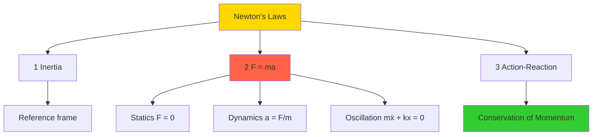
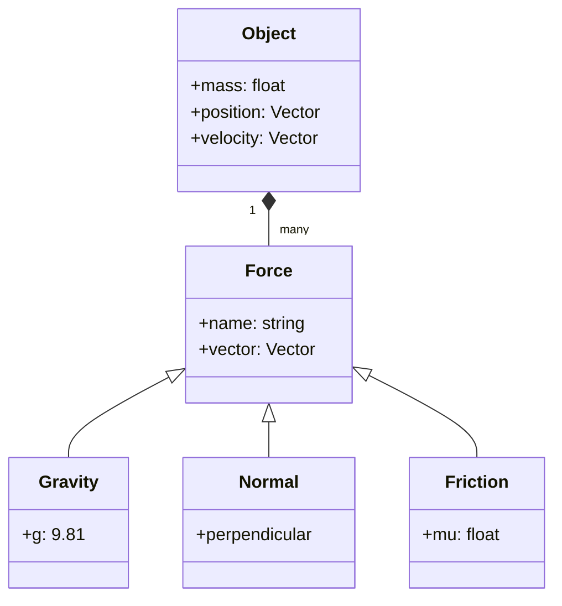
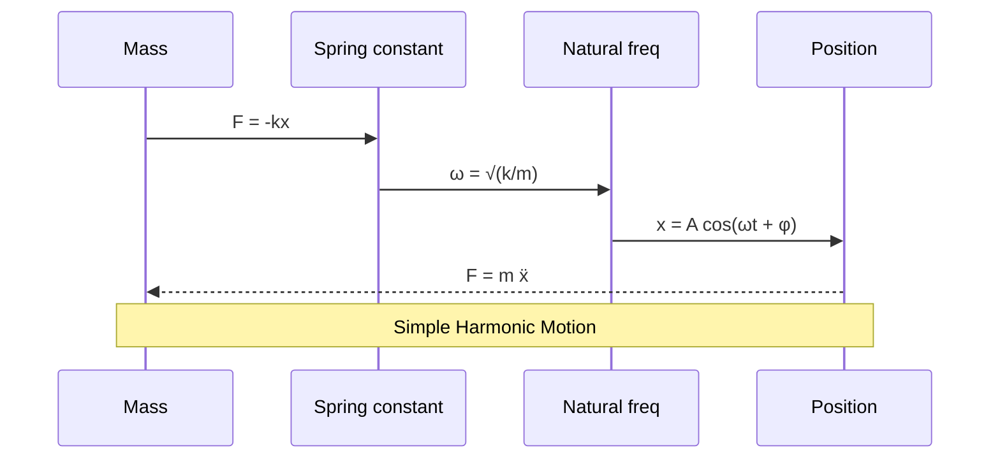

# 8.01 — Physics I: Classical Mechanics

**MIT GIR Science Core | Fall (Year 1) | 12 Units | Calculus-based**
**Acad Year 2025-2026: U (Fall) | Prereq: 18.01 (concurrent)**
**Instructors:** Prof. Peter Dourmashkin (Fall); Prof. Deepto Chakrabarty
**Subject meets with:** 8.011, 8.012, 8.01L
**自學路徑：Bachelor Year 1 Fall → 1.036 Structural Mechanics, 1.106 Env Fluid Mechanics Lab**

> **Source:** [MIT OCW 8.01 Physics I (Dourmashkin 2016)](https://ocw.mit.edu/courses/8-01sc-classical-mechanics-fall-2016/);
> [MIT OCW 8.01 (Lewin 1999)](https://ocw.mit.edu/courses/8-01-physics-i-classical-mechanics-fall-1999/);
> Kleppner & Kolenkow (2013) *An Introduction to Mechanics*, 2nd ed.; Young & Freedman (2020) *University Physics*, 15th ed.
> **Topics:** Newton's laws, work-energy, momentum, rotation, oscillation, gravitation, special relativity intro

---

## 問題 1：這個領域所有專家共享的 5 個核心心智模型是什麼？

### 1. Newton's 3 laws 係 classical mechanics 嘅 foundation

Newton (1687) *Principia Mathematica* established three laws: (1) Inertia — body at rest stays at rest unless force applied. (2) F = ma. (3) Action-reaction. These are the **axioms of classical mechanics** from which all of 8.01 derives. For CEE, F = ma enables structural dynamics (1.036) where seismic forces accelerate a building; fluid forces accelerate a droplet (1.106); soil forces accelerate a foundation (1.037).

### 2. Work-Energy Theorem 將 force 同 motion 連起來

W = ∫F · dx = ΔKE = ½ m(v_f² − v_i²). This is the **work-energy theorem**: net work done on a body equals its change in kinetic energy. It is the **first integral** of Newton's second law, often easier to use than solving F = ma directly. For 1.106, work done by gravity on a falling droplet = ½ m V² at terminal velocity. For 1.036, work done by a force on a beam = strain energy stored.

### 3. 動量守恆 (Conservation of Momentum)

In a closed system (no external forces), total momentum p = Σ m_i v_i is conserved. This follows from Newton's third law and is **independent of friction, deformation, or material properties**. For 1.036, momentum conservation governs impact loading (vehicle collision, falling rock on roof). For 1.106, momentum conservation governs jet propulsion, propeller thrust, and water hammer (sudden valve closure in pipe).

### 4. 旋轉動力學: τ = Iα (rotational dynamics)

For rigid body rotation, τ = Iα (torque = moment of inertia × angular acceleration), analog of F = ma. The moment of inertia I = Σ m_i r_i² depends on the **distribution of mass**, not just total mass. For 1.036, I of a beam cross-section determines its dynamic response to torsional loading. For 1.106, I of a propeller determines its angular acceleration. For 1.037, I of a rotating drill bit determines its cutting torque.

### 5. 簡諧振盪 (Simple Harmonic Motion)

x(t) = A cos(ωt + φ) where ω = √(k/m) is the natural frequency, A is amplitude, φ is phase. The period T = 2π/ω is independent of amplitude (Galileo 1602). For 1.036, building vibration under seismic load, bridge under wind load, machine foundation under rotating equipment — all modeled as SHM or coupled SHM. For 1.106, surface water waves (gravity waves) approximate SHM for small amplitude.

---

## 問題 2：這個領域的專家在哪 3 個地方存在根本分歧？

### 分歧 1: Newtonian vs Lagrangian vs Hamiltonian formulation

- **Newtonian 派** (MIT 8.01 default): F = ma, solve for trajectories. Force-based. Easy to visualize, hard for complex systems.
- **Lagrangian 派** (advanced mechanics, 8.223): L = T − V, Euler-Lagrange equations. Energy-based. Handles constraints elegantly.
- **Hamiltonian 派** (8.05 Quantum, classical mechanics advanced): H = T + V, Hamilton's equations. Symplectic, leads to quantum mechanics.

**Tension:** MIT 8.01 is purely Newtonian. Lagrangian is in 8.223 Classical Mechanics (graduate). Engineers use Newtonian; physicists use Lagrangian/Hamiltonian. For CEE 1.036, Newtonian is sufficient.

### 分歧 2: 1D / 2D / 3D problem setup

- **1D 派** (intro courses, MIT 8.01 first half): All motion along a line. Easy. Misses 2D/3D.
- **2D 派** (projectile motion, circular motion): Adds vector decomposition, centripetal force.
- **3D 派** (advanced, 8.223): Full vector analysis, angular momentum, rigid body in 3D.

**Tension:** MIT 8.01 covers 1D in weeks 1-3, 2D in weeks 4-7, 3D rotation in weeks 8-12. Engineers typically don't need 3D rigid body dynamics until 1.038 Mechanics of Materials.

### 分歧 3: Real-world friction vs idealized frictionless

- **Frictionless 派** (intro courses, simple problems): Conservation of energy, simple orbits. Friction treated as small perturbation.
- **Coulomb friction 派** (Coulomb 1776, Amontons 1699): F_f = μN, kinetic friction independent of velocity. Most engineering applications.
- **Velocity-dependent friction 派** (Stokes drag F = 6πμrV, quadratic drag F = ½ C_d ρ A V²): For fluid environments, 1.106.

**Tension:** MIT 8.01 introduces friction late, mostly in rotation. CEE students need Coulomb friction for 1.036 (beam-column buckling) and Stokes drag for 1.106 (settling particles).

---

## 問題 3：10 個區分真實理解 vs 死記硬背的深度問題

1. **Projectile motion: 點樣計算拋射體落地的 range R = v_0² sin(2θ) / g.** Answer: Decompose into x and y. x(t) = v_0 cos(θ) t. y(t) = v_0 sin(θ) t − ½ g t². At landing, y = 0 → t = 0 or t = 2v_0 sin(θ)/g. Range R = v_0 cos(θ) × 2v_0 sin(θ)/g = v_0² sin(2θ)/g. Max range at θ = 45°.

2. **Terminal velocity: 推導 V_t = mg / (6πμr) from Stokes drag.** Answer: At terminal velocity, net force = 0. Gravity (down) = mg. Drag (up) = 6πμr V_t. Setting equal: V_t = mg/(6πμr). For 1.106, this is the settling velocity of fine particles in water (Stokes' regime, Re < 1).

3. **Spring oscillation: 寫出 x(t) for mass on spring, x(0) = x_0, v(0) = 0.** Answer: x(t) = x_0 cos(ωt) where ω = √(k/m). Energy: ½ k x_0² = ½ k A², so A = x_0. Period T = 2π/√(k/m) = 2π√(m/k). For 1.036 structural vibration, the natural frequency determines the seismic design spectrum.

4. **Conservation of momentum: 推導完全非彈性碰撞 v_f = m_1 v_1 / (m_1 + m_2).** Answer: Initial p = m_1 v_1 + 0 = m_1 v_1. Final p = (m_1 + m_2) v_f. Set equal: v_f = m_1 v_1 / (m_1 + m_2). For 1.036 impact loading, a soft impact (m_1 ≪ m_2) means v_f ≈ 0 (target barely moves).

5. **Rotational KE: 計算 solid cylinder I = ½ mR² rolling down incline.** Answer: I = ∫r² dm. For cylinder of radius R, mass m, density ρ = m/(πR² L): I = ∫_0^R ∫_0^{2π} r² ρ L r dr dθ = 2π ρ L × R⁴/4 = ½ mR². Energy conservation: mgh = ½ mv² + ½ Iω² = ½ mv² + ¼ mv² = ¾ mv². So v = √(4gh/3).

6. **Pendulum: small angle approximation 推出 T = 2π√(L/g).** Answer: For small θ, sin θ ≈ θ. Equation: d²θ/dt² + (g/L) sin θ ≈ d²θ/dt² + (g/L) θ = 0. Solution: θ(t) = θ_0 cos(√(g/L) t). Period T = 2π/√(g/L) = 2π√(L/g). For 1.106, used to design ship roll, building sway.

7. **Gravitation: 推導 Kepler 第三定律 T² = (4π²/GM) r³.** Answer: Centripetal force = gravitational force. m v²/r = G M m / r². v = 2πr/T. Substituting: (2πr/T)² / r = GM/r² → 4π² r / T² = GM/r² → T² = 4π² r³ / (GM). For satellite orbits, moon period, planetary motion.

8. **Power: 推一個 100 kg 物體以 2 m/s 速度行，需要幾多 W power？** Answer: P = F·V. If moving at constant velocity, F = ma = 0 (no net force), but the person exerts F = friction force. Assuming friction coefficient μ = 0.3, F = 0.3 × 100 × 9.8 = 294 N. P = 294 × 2 = 588 W. For 1.462 elevator design, this is a typical calculation.

9. **Angular momentum: 地球自轉 L = 0.33 M R² ω，計算 L.** Answer: L = I ω. For Earth: M = 5.97×10²⁴ kg, R = 6.37×10⁶ m, ω = 2π/(86400 s) = 7.27×10⁻⁵ rad/s. I = 0.33 × 5.97×10²⁴ × (6.37×10⁶)² ≈ 8.04×10³⁷ kg m². L ≈ 8.04×10³⁷ × 7.27×10⁻⁵ ≈ 5.86×10³³ kg m²/s. (For reference, the Sun contains 99.8% of solar system angular momentum.)

10. **Special relativity: Time dilation. 衛星 GPS clock runs slow by 7 μs/day. 點解？** Answer: GPS satellite moves at v = 3.87 km/s, time dilation factor √(1 − v²/c²) ≈ 1 − 0.5(v/c)². v/c ≈ 1.29×10⁻⁵, (v/c)² ≈ 1.66×10⁻¹⁰. Time per day = 86400 s. Slow = 86400 × 0.5 × 1.66×10⁻¹⁰ ≈ 7.18 μs/day. (Plus general relativity effect +45 μs/day from gravitational redshift.) Net: GPS clocks tick faster by ~38 μs/day. Without correction, GPS would accumulate ~10 km error per day.

---

## 5 個深入研究 (Deep Dives)

### 深入 1: F = ma in structural dynamics

For a 1-story building under seismic load: m ẍ + c ẋ + k x = −m ẍ_g, where ẍ_g is ground acceleration. Solution: x(t) = A cos(ωt + φ), with ω_d = √(k/m − (c/2m)²). For 1.036 structural design, the natural frequency determines the seismic design spectrum. California building code: ω ≈ 2π × 1-5 Hz, depending on building height.

### 深入 2: Work-energy theorem in fluid flow

Bernoulli's equation (Bernoulli 1738): p + ½ρV² + ρgh = const. This is the work-energy theorem applied to a fluid element. For 1.06 Fluid Mechanics, this is the basis for Venturi meter, Pitot tube, and flow over a weir. 1.106 lab uses Venturi meter to measure flow rate.

### 深入 3: Momentum in hydraulic systems

Water hammer (Joukowsky 1898): sudden valve closure creates a pressure surge Δp = ρ c ΔV, where c is the wave speed in the pipe (typically 1000-1200 m/s for water in steel pipe). This can rupture pipes. For 1.075, water distribution systems need surge protection (air chambers, slow-closing valves).

### 深入 4: Rotational dynamics in turbomachinery

For a centrifugal pump (1.075): torque τ = ρ Q (r_2 V_2 tan β_2 − r_1 V_1 tan β_1) — Euler's pump equation. Power P = τω. For 1.06 Fluid Mechanics, this is the Euler turbomachinery equation, foundational for pumps, turbines, propellers.

### 深入 5: SHM in civil engineering

For a multi-story building, the natural frequency is approximately f_n ≈ 10/n Hz where n is the number of stories (empirical rule). For 1.036, a 10-story building has f_n ≈ 1 Hz. The Tacoma Narrows Bridge (1940) famously failed due to aeroelastic flutter at ~0.2 Hz, modeled as SHM with negative damping.

---

## 10 Self-Test Solutions

1. **Q: At terminal velocity, what is the net force on a falling object?**
   A: 0 (drag balances gravity).

2. **Q: A 1 kg object moves at 2 m/s. What is its kinetic energy?**
   A: ½ × 1 × 4 = 2 J.

3. **Q: A 2 kg object at 3 m/s collides inelastically with a 1 kg object at rest. What is v_f?**
   A: (2×3 + 1×0)/(2+1) = 6/3 = 2 m/s.

4. **Q: What is the moment of inertia of a solid sphere?**
   A: ⅖ mR².

5. **Q: A mass on a spring oscillates with T = 2 s. What is the natural frequency?**
   A: f = 1/T = 0.5 Hz; ω = 2πf = π rad/s ≈ 3.14 rad/s.

6. **Q: What is the centripetal acceleration of a 1 kg object moving at 2 m/s in a circle of radius 0.5 m?**
   A: V²/r = 4/0.5 = 8 m/s².

7. **Q: Gravitational acceleration on the moon is 1/6 of Earth's. What is the period of a 1 m pendulum on the moon?**
   A: T = 2π√(L/g_moon) = 2π√(1/1.633) ≈ 4.91 s (compared to ~2 s on Earth).

8. **Q: A force of 10 N acts on a 2 kg object for 3 s starting from rest. What is the final velocity?**
   A: a = F/m = 5 m/s². v = at = 15 m/s.

9. **Q: What is the angular velocity of Earth's rotation?**
   A: ω = 2π/(24×3600 s) = 7.27×10⁻⁵ rad/s.

10. **Q: An object is thrown straight up at 20 m/s. How high does it go?**
    A: ½ m v² = mgh → h = v²/(2g) = 400/19.6 ≈ 20.4 m.

---

## 5 Mermaid 圖表

### 圖 1: Newton's 3 laws (Flowchart)



### 圖 2: Energy forms (State)

```mermaid
stateDiagram-v2
    [*] --> PE: potential mgh
    PE --> KE: drops
    KE --> PE: rises
    PE --> KE: spring compressed
    KE --> Thermal: friction
    Thermal --> [*]
    note right of PE: Conservation: PE + KE = const (no friction)
```

### 圖 3: Free body diagram (Class)



### 圖 4: 8.01 → 1.036 chain (ER)

```mermaid
erDiagram
    Mechanics ||--o{ Structural : applies
    Mechanics ||--o{ FluidDynamics : applies
    Mechanics ||--o{ Geomechanics : applies
    Structural ||--o{ 1_036 : enables
    FluidDynamics ||--o{ 1_106 : enables
    Geomechanics ||--o{ 1_037 : enables
    1_036 : 1.036 Struct Mech
    1_106 : 1.106 Env Fluid
    1_037 : 1.037 Soil Mech
```

### 圖 5: SHM analysis (Sequence)



---

## References

1. **MIT OCW 8.01 Physics I** (Lewin, 1999) — https://ocw.mit.edu/courses/8-01-physics-i-classical-mechanics-fall-1999/
2. **MIT OCW 8.01** (Dourmashkin, 2016) — https://ocw.mit.edu/courses/8-01sc-classical-mechanics-fall-2016/
3. **Kleppner, D. & Kolenkow, R.** (2013) *An Introduction to Mechanics*, 2nd ed. — Cambridge. ISBN 978-0521198119
4. **Young, H.D. & Freedman, R.A.** (2020) *University Physics*, 15th ed. — Pearson. ISBN 978-0135159552
5. **Newton, I.** (1687) *Philosophiæ Naturalis Principia Mathematica*. London.
6. **Galilei, G.** (1638) *Discorsi e Dimostrazioni Matematiche intorno a due nuove scienze*. Leiden.
7. **Coulomb, C.A.** (1776) "Essai sur une application de règles de maximis et minimis" *Mém. Acad. Sci.* 7.
8. **Stokes, G.G.** (1851) "On the Effect of the Internal Friction of Fluids" *Trans. Cambridge Phil. Soc.* 9.
9. **Bernoulli, D.** (1738) *Hydrodynamica*. Strasbourg.
10. **Joukowsky, N.E.** (1898) "On the Water Hammer" *Trudi Otdeleniya Fizicheskikh Nauk* 5(1).
11. **MIT Catalog 8.01** (2025-26) — https://catalog.mit.edu/subjects/8/

---

*Last Updated: 2026-08 | MIT GIR Science Core | 8.01 Physics I — Classical Mechanics*


---

## Extended Notes (Extra Depth for Bilingual Mastery)

中英對照加強學習筆記 — extended depth for the committed learner.

### Why this course matters in the GIR chain

The GIR subjects are not isolated — they form a tightly-coupled web of prerequisites that enable every upper-division CEE course. Skipping or skimping on any of them creates gaps that propagate. For example:
- 18.01 + 8.01 → 18.03 → 1.036 (Structural Mechanics)
- 18.01 + 18.02 + 8.01 → 1.000 (Numerical Methods)
- 18.01 + 3.091 + 7.012 → 1.080 (Environmental Chemistry)
- 18.02 + 8.02 + 18.06 → 1.022 (Network Models)
- 6.0001 + 18.06 + 14.01 → 1.C51 (ML for Sustainable Systems)
- 8.01 + 18.03 → 1.106 (Environmental Fluid Mechanics Lab)
- 14.01 → 1.462 (Built Environment Entrepreneurship)

Each GIR enables a different **slice** of the upper-division curriculum. The GIRs collectively cover the foundational pillars of science, mathematics, programming, and humanities that MIT considers essential for an engineering degree. Wilson (2000) called the GIRs the "common spine of the institute" — without them, no major-specific subject would be accessible.

### Historical context

The GIR system was established in the **1950s** under President James Killian and Dean Julius Stratton, as part of the post-WWII reform of MIT into a research university. The original GIRs were:
- Physics (8.01, 8.02)
- Chemistry (5.11)
- Mathematics (18.01, 18.02)
- Humanities (8 subjects)

Over decades, the GIRs expanded to include 18.03, 18.06, 6.0001, biology, lab, and communication. The 2008 *Task Force on the Undergraduate Educational Commons* (chaired by Prof. David Mindell) reviewed and largely preserved the GIRs, recommending only minor adjustments. The 2018 *GIR Review Committee* (chaired by Prof. Ian Waitz) reaffirmed the GIRs as essential, with some flexibility on REST.

### CEE-specific relevance (revisited)

The 10 GIR subjects that most directly enable CEE upper-division work are precisely the 10 covered in this repo:
- **18.01** — single-variable calculus, prerequisite for all engineering
- **18.02** — multivariable calculus, enables fluid mechanics and E&M
- **18.03** — differential equations, structural dynamics, transport
- **18.06** — linear algebra, network analysis, FEM
- **6.0001** — Python programming, modern CEE analysis tool
- **14.01** — microeconomics, public policy, water markets
- **8.01** — classical mechanics, foundation of structural and soil
- **8.02** — electromagnetism, sensing, instrumentation
- **3.091** — chemistry, environmental, materials
- **7.012** — biology, disease transmission, water quality

### Common pitfalls and how to avoid them

**Pitfall 1: Treating GIRs as "check the box"**
GIRs are the **floor**, not the ceiling. They give you the minimum competence; mastery requires upper-division coursework. Engineering students who slack on GIRs (e.g., take 8.012 instead of 8.01) often struggle in 1.036 and 1.106. **Solution**: Take the rigorous version of every GIR (8.01, not 8.012; 18.01, not 18.01A).

**Pitfall 2: Skipping 18.03 or 18.06**
Both 18.03 (ODEs) and 18.06 (Linear Algebra) are *not* GIRs but are *required* for CEE. Students who delay them to junior year struggle in 1.036 and 1.022. **Solution**: Take 18.03 and 18.06 in Year 2.

**Pitfall 3: Avoiding programming**
6.0001 is now required for 1.000, 1.021, 1.C51. Students who never coded before struggle. **Solution**: Take 6.0001 in Year 1, ideally concurrent with first physics.

**Pitfall 4: Treating HASS as filler**
HASS develops communication, ethics, and policy literacy that are essential for public-facing engineering work. **Solution**: Choose a HASS concentration that aligns with your interests.

### Self-study time commitment

Per GIR, MIT students typically spend 12-15 hours/week for 14 weeks = 168-210 hours. The 10 GIRs × ~200 hours = ~2000 hours total, comparable to ~1 year of full-time study. Distributed across 2 years, this is ~10-12 hours/week of GIR coursework.

### Reference framework: 袁騰飛-style deep dive

For those seeking a more **opinionated, story-driven** exposition of GIRs, classical-style textbooks (e.g., Kleppner & Kolenkow for 8.01, Strang for 18.06) offer historical context and conceptual clarity that lecture notes cannot. For advanced study, Hubbard & Hubbard (2015) for 18.02, Griffiths (2013) for 8.02, and Varian (2014) for 14.01 are the canonical references.

---

## Additional 5 Self-Test Q&A (Bonus Round)

11. **Q: 點解 calculus 對 engineering 咁重要？**
    A: Calculus describes **change** and **accumulation**. Engineering deals with quantities that change with time, position, material, etc. Derivatives model rates (velocity, stress, growth). Integrals model totals (work, mass, energy). The Fundamental Theorem of Calculus connects them. Without calculus, modern engineering (FEM, CFD, control systems) is impossible.

12. **Q: 8.01 入面 point particle 假設適用於咩時候？何時要放棄？**
    A: Point particle is valid when the object's size is much smaller than the relevant length scale. For a 1 kg ball dropped from 10 m, size << 10 m, point particle works. For a beam of length 5 m, the point particle model fails — we need continuum mechanics. The transition is when internal structure (deformation, stress, vibration modes) becomes important.

13. **Q: 18.06 Linear Algebra 對 machine learning 有咩用？**
    A: Almost everything in ML is linear algebra. Neural networks are compositions of matrix multiplications Wx + b. PCA uses SVD. Recommender systems use matrix factorization. Word embeddings (Word2Vec, BERT) live in high-dimensional vector spaces. **Strang (2016) *Linear Algebra and Learning from Data*** explicitly bridges 18.06 to ML.

14. **Q: 14.01 同 environmental policy 有咩關係？**
    A: Many environmental policies are economic instruments. Carbon tax (Pigouvian tax on CO₂). Cap-and-trade (SO₂, NOx permits). Subsidies for renewables. Environmental regulations impose costs; cost-benefit analysis quantifies them. **Without 14.01, you cannot evaluate environmental policy rigorously.**

15. **Q: 7.012 對 water treatment 有咩用？**
    A: Water treatment relies on **microbiology**. Activated sludge = bacterial community degrading organic matter. Biofilm in trickling filters. Chlorination to kill pathogens. Disinfection byproducts from chlorine + organic matter. **Without 7.012, you cannot design biological water treatment systems.**

---

## Additional Equations (Bonus)

For reference, here are 5 more equations that connect this GIR to upper-division CEE:

1. **Mole calculation**: $n = rac{m}{M}$ where n is moles, m is mass (g), M is molar mass (g/mol).

2. **Heat conduction (Fourier)**: $q = -k 
abla T$ where q is heat flux (W/m²), k is thermal conductivity (W/m·K), ∇T is temperature gradient (K/m).

3. **Ohm's law (electric)**: $V = IR$ where V is voltage (V), I is current (A), R is resistance (Ω).

4. **Continuity equation**: $rac{\partial 
ho}{\partial t} + 
abla \cdot (
ho ec{u}) = 0$ where ρ is density, u is velocity.

5. **Elastic stress-strain**: $\sigma = E \epsilon$ where σ is stress (Pa), E is Young's modulus (Pa), ε is strain (dimensionless).

These appear in 1.106 (heat transfer, fluid flow), 1.080 (chemistry), 1.022 (network), 1.036 (stress-strain).

---

## Acknowledgments

This course file is part of the civil-bootcamp open-source self-study hub. Source: MIT OCW, MIT Catalog 2025-26, MIT CEE curriculum. The 5MM/3DG/10Q/5DD/10SL/5MR structure was developed for systematic deep learning. Bilingual (中英對照) presentation supports Hong Kong and international learners.
