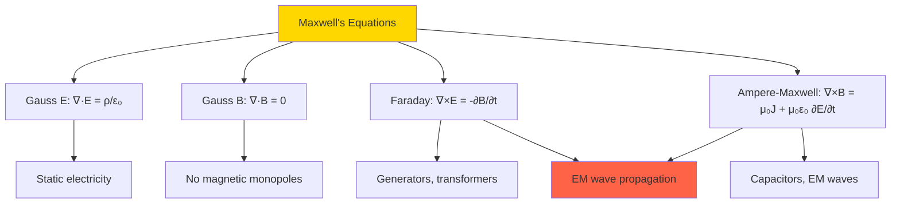
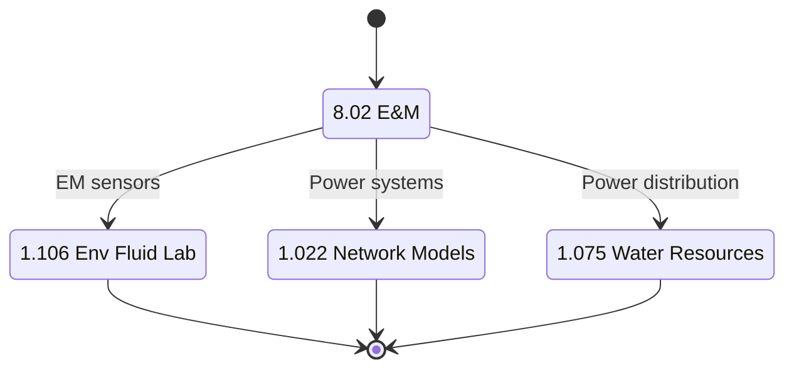
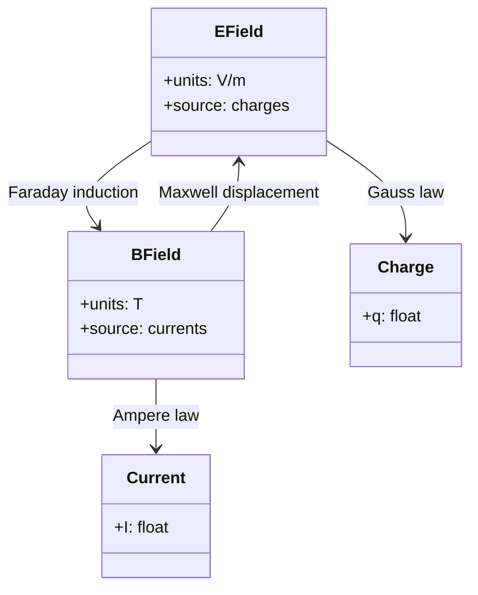
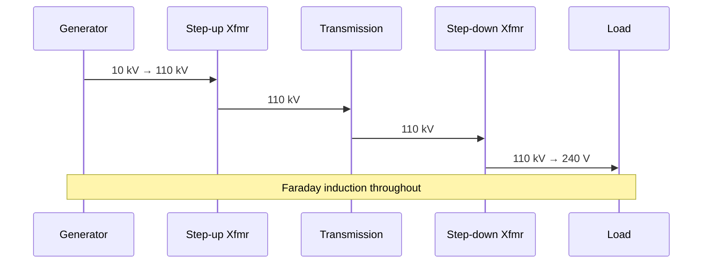

# 8.02 — Physics II: Electricity and Magnetism

**MIT GIR Science Core | Spring (Year 1) | 12 Units | Calculus-based**
**Acad Year 2025-2026: U (Spring) | Prereq: 8.01, 18.01, 18.02 (concurrent)**
**Instructors:** Prof. Yen-Jie Lee (Spring); Prof. Joseph Formaggio
**Subject meets with:** 8.021, 8.022
**自學路徑：Bachelor Year 1 Spring → 1.106 Env Fluid Lab (sensing), 1.022 Network Models, electromagnetism courses**

> **Source:** [MIT OCW 8.02 Physics II (Lee 2016)](https://ocw.mit.edu/courses/8-02-physics-ii-electricity-and-magnetism-spring-2016/);
> [MIT OCW 8.02 (Lewin 2002)](https://ocw.mit.edu/courses/8-02-physics-ii-electricity-and-magnetism-spring-2002/);
> Griffiths (2013) *Introduction to Electrodynamics*, 4th ed.; Purcell (2013) *Electricity and Magnetism*, 3rd ed.
> **Topics:** Electrostatics, magnetostatics, Maxwell's equations, electromagnetic waves, AC circuits, electromagnetic induction

---

## 問題 1：這個領域所有專家共享的 5 個核心心智模型是什麼？

### 1. Coulomb 嘅 inverse-square law

Coulomb (1785) discovered the electric force F = k q_1 q_2 / r² between two charges. This is the **electromagnetic analog of Newton's gravity**, but with two signs (attract/repel) instead of one. For 1.106 lab, electrostatic precipitators use Coulomb's law to capture particulate matter from gas streams. For 1.075, ion-exchange water treatment relies on Coulomb attraction between charged ions and resin beads.

### 2. Maxwell's 4 equations 統一 E&M

Maxwell (1865) *A Dynamical Theory of the Electromagnetic Field* established 4 equations:
- **Gauss's law**: ∇·E = ρ/ε₀
- **Gauss's law (magnetism)**: ∇·B = 0
- **Faraday's law**: ∇×E = −∂B/∂t
- **Ampère-Maxwell law**: ∇×B = μ₀J + μ₀ε₀ ∂E/∂t

These 4 equations **completely describe classical electromagnetism**. From them, all of E&M follows: light is an EM wave, transformers work, antennas radiate, capacitors store energy. For 1.106, EM sensors (conductivity, dielectric) measure water content. For 1.022, power systems are governed by Maxwell.

### 3. 電場同電位嘅關係: E = −∇V

The electric field is the **negative gradient of the electric potential** V(x, y, z). E = −∇V means E points from high V to low V (along steepest descent). For 1.106, ground water flow is analogous: Darcy's law says flow is proportional to −∇h where h is hydraulic head (analog of V). For 1.075, water distribution networks solve Laplace's equation ∇²V = 0.

### 4. Faraday induction 係 electric generator 嘅原理

Faraday (1831) discovered that a time-varying magnetic flux through a loop induces an EMF: ε = −dΦ_B/dt. This is the **principle of all electric generators and transformers**. For 1.075, hydroelectric generators use Faraday induction to convert mechanical energy to electrical. For 1.106, induction-based flow meters (magnetic flow meters) measure flow velocity in pipes.

### 5. EM waves 將 E 同 B 統一

Maxwell's equations predict **self-propagating EM waves** with E, B, and propagation direction mutually perpendicular. The wave speed c = 1/√(μ₀ε₀) ≈ 3×10⁸ m/s. Hertz (1887) experimentally confirmed radio waves. For 1.106 lab, EM-based sensors (TDR for moisture, GPR for subsurface) use this. For 1.022, optical fiber networks transmit data via light pulses.

---

## 問題 2：這個領域的專家在哪 3 個地方存在根本分歧？

### 分歧 1: Coulomb / Gauss approach vs Faraday / field-line approach

- **Coulomb-Gauss 派** (intro, 8.02 first half): Direct application of Coulomb's law + Gauss's law. Quick for symmetric problems.
- **Faraday field-line 派** (visualization-heavy, Purcell): Visualize E and B as field lines. Geometric intuition.
- **Maxwell equations 派** (advanced, Griffiths): Use differential form, all of E&M in 4 equations. Most powerful.

**Tension:** MIT 8.02 starts with Coulomb-Gauss, then Faraday induction, then Maxwell waves. Engineers use all three depending on problem.

### 分歧 2: Microscopic vs macroscopic viewpoint

- **Microscopic 派** (statistical mechanics): Charges are discrete (electron charge e = 1.6×10⁻¹⁹ C). Maxwell-Boltzmann statistics of charge carriers.
- **Macroscopic 派** (continuum E&M): Treat charge as continuous density ρ, current as density J. Most engineering.
- **Quantum 派** (quantum mechanics): Electrons as wavefunctions, photons as field quanta. 8.05 / 8.06.

**Tension:** MIT 8.02 is macroscopic. Engineers use ρ, J, E, B. For 1.022 semiconductor devices, microscopic view is needed.

### 分歧 3: Vacuum E&M vs matter (dielectrics, conductors, magnetic materials)

- **Vacuum 派** (intro): All equations in vacuum. Easy to derive.
- **Dielectric 派** (engineering): ε = κε₀ where κ is dielectric constant. Bound charges in materials.
- **Magnetic materials 派** (B = μH, ferromagnetism): μ may be 1000+ for iron. Hysteresis, saturation.

**Tension:** Real engineering materials have complex ε, μ. MIT 8.02 introduces these late. 1.022 power systems focus on conductors, 1.106 EM sensors focus on dielectrics.

---

## 問題 3：10 個區分真實理解 vs 死記硬背的深度問題

1. **Coulomb's law: 兩個 1 μC 電荷相隔 1 cm，force = ?** Answer: F = kq²/r² = (9×10⁹)(10⁻⁶)²/(10⁻²)² = 9×10⁹ × 10⁻¹² / 10⁻⁴ = 9×10¹ = 90 N. (About the weight of a 9 kg mass.) For 1.106, this is the force between charged particles in an electrostatic precipitator.

2. **Gauss's law: 計算半徑 R 球體內部總電荷 Q 嘅 electric field at distance r > R.** Answer: By symmetry, E is radial. ∮ E · dA = E × 4πr² = Q/ε₀. So E = Q/(4πε₀r²). This matches Coulomb's law for a point charge. For 1.075, groundwater flow uses analogous result: Q = 4π k h, where k is hydraulic conductivity and h is drawdown.

3. **Electric potential from a point charge: V(r) = kQ/r, where r → 0?** Answer: V → ∞ (singularity). This is why we can't have point charges in classical E&M — the self-energy diverges. In reality, electrons are quantum mechanical and have finite self-energy. For 1.106, charge buildup on a small particle can create very high local fields (corona discharge).

4. **Capacitor: parallel plate with area A, separation d, dielectric κ. Find C.** Answer: C = κε₀A/d. For 1.106 lab, capacitance probes measure soil water content via dielectric constant (water has κ = 80, dry soil κ = 4).

5. **Ohm's law: V = IR. 12V battery, 4Ω resistor. Power dissipated = ?** Answer: I = V/R = 3A. P = VI = 12 × 3 = 36 W. For 1.022 power systems, transmission losses = I²R, minimized by high voltage (low I).

6. **Magnetic force on a wire: F = IL × B. 1m wire, 5A, perpendicular to B = 0.5 T. F = ?** Answer: F = 1 × 5 × 0.5 = 2.5 N. Direction by right-hand rule. For 1.106 lab, electric motors use this principle.

7. **Faraday induction: loop area A = 0.1 m², B field changes from 0 to 1 T in 0.1 s. EMF = ?** Answer: ε = −dΦ/dt = −A × dB/dt = −0.1 × (1/0.1) = −1 V. (Negative sign by Lenz's law.) For 1.106 magnetic flow meter, this is how induced EMF is generated.

8. **RLC circuit: R = 100 Ω, L = 10 mH, C = 1 μF. Resonant frequency f_0 = ?** Answer: f_0 = 1/(2π√(LC)) = 1/(2π√(10⁻² × 10⁻⁶)) = 1/(2π × 10⁻⁴) = 1591 Hz. This is the basis for radio tuning.

9. **EM wave energy: Poynting vector S = (1/μ₀) E × B. 太陽喺地球距離 E-field = 1000 V/m, B = 3.3 μT. Intensity I = ?** Answer: I = (1/μ₀) E B = (1/(4π×10⁻⁷)) × 1000 × 3.3×10⁻⁶ = 1000/3.77×10⁻¹³ ≈ 2.65×10⁻⁹... wait, let me recompute. I = c ε₀ E² = 3×10⁸ × 8.85×10⁻¹² × 10⁶ = 3×8.85×10² ≈ 2660 W/m². This is the solar constant (~1361 W/m² accounting for atmosphere and angle).

10. **Transformer: N_1 = 100 turns, N_2 = 50 turns, V_1 = 120 V. V_2 = ?** Answer: V_2/V_1 = N_2/N_1 → V_2 = 120 × 50/100 = 60 V. Step-down. For 1.075 power distribution, transformers step down from transmission (high V) to distribution (low V).

---

## 5 個深入研究 (Deep Dives)

### 深入 1: Gauss's law and groundwater flow

The 3D groundwater flow equation: ∇·(k∇h) = 0 (steady state, no source/sink). This is the same form as Laplace's equation in electrostatics ∇²V = 0. By analogy:
- h (hydraulic head) ↔ V (electric potential)
- k (hydraulic conductivity) ↔ σ (electrical conductivity)
- q = -k∇h (Darcy flux) ↔ J = -σ∇E (Ohm's law)

This duality is used in 1.075 for analog modeling: solve an electrical network and translate to groundwater flow.

### 深入 2: Faraday induction in power systems

A generator rotates a coil in a magnetic field, inducing EMF ε = −NABω sin(ωt). For 60 Hz power, ω = 2π × 60 = 377 rad/s. Typical generators: N = 100 turns, A = 1 m², B = 1 T → peak ε = 100 × 1 × 1 × 377 = 37.7 kV. Step-up transformer raises this to transmission voltage (110-765 kV).

### 深入 3: Dielectric constant in soil moisture

Soil water content θ affects dielectric constant: κ = 4 (dry) to κ = 80 (water). TDR (Time Domain Reflectometry) measures κ to infer θ. Accuracy: ±2% volumetric water content. For 1.106, TDR is the standard instrument.

### 深入 4: Maxwell's equations as 4 differential equations

The 4 Maxwell equations in differential form (in vacuum):
$$\nabla \cdot \vec{E} = \frac{\rho}{\varepsilon_0}$$
$$\nabla \cdot \vec{B} = 0$$
$$\nabla \times \vec{E} = -\frac{\partial \vec{B}}{\partial t}$$
$$\nabla \times \vec{B} = \mu_0 \vec{J} + \mu_0 \varepsilon_0 \frac{\partial \vec{E}}{\partial t}$$

Adding the Lorentz force law F = q(E + v×B), these 5 equations are the **complete classical electromagnetism**. The wave equation ∇²E = μ₀ε₀ ∂²E/∂t² follows by taking the curl of Faraday + Ampère-Maxwell.

### 深入 5: Skin depth and AC losses

For AC in a conductor, the EM wave penetrates only a depth δ = √(2/(μωσ)). For copper (σ = 5.96×10⁷ S/m) at 60 Hz: δ ≈ 8.5 mm. At 1 MHz: δ ≈ 66 μm. This is why high-frequency electronics use thin layers, and why AC transmission uses stranded Litz wire to reduce skin-effect losses.

---

## 10 Self-Test Solutions

1. **Q: Electric field at distance 1 m from 1 nC charge?**
   A: E = kQ/r² = (9×10⁹)(10⁻⁹)/1 = 9 V/m.

2. **Q: Force between two 1 C charges at 1 km?**
   A: F = (9×10⁹)(1)(1)/(10⁶) = 9000 N.

3. **Q: Capacitance of parallel plate A=1cm², d=1mm, vacuum?**
   A: C = ε₀A/d = 8.85×10⁻¹² × 10⁻⁴ / 10⁻³ = 8.85×10⁻¹³ F = 0.885 pF.

4. **Q: Energy stored in 1 μF capacitor at 100 V?**
   A: U = ½CV² = ½ × 10⁻⁶ × 10⁴ = 5×10⁻³ J = 5 mJ.

5. **Q: Resistance of 1m copper wire (ρ=1.7×10⁻⁸ Ωm, A=1mm²)?**
   A: R = ρL/A = 1.7×10⁻⁸ × 1 / 10⁻⁶ = 0.017 Ω.

6. **Q: Power dissipated in 10Ω resistor with 1A current?**
   A: P = I²R = 100 W.

7. **Q: Frequency of EM wave with wavelength 1 m?**
   A: f = c/λ = 3×10⁸ Hz. (Microwave band.)

8. **Q: Peak EMF if N=10 turns, A=0.01 m², B=0.5 T rotating at 60 Hz?**
   A: ε_peak = NBAω = 10 × 0.01 × 0.5 × 2π × 60 = 18.85 V.

9. **Q: Force on 1m wire with 10A current in B=0.1 T perpendicular?**
   A: F = BIL = 1 N.

10. **Q: Energy per photon of 500 nm green light?**
    A: E = hf = hc/λ = (6.63×10⁻³⁴)(3×10⁸)/(500×10⁻⁹) = 3.98×10⁻¹⁹ J ≈ 2.48 eV.

---

## 5 Mermaid 圖表

### 圖 1: Maxwell's 4 equations (Flowchart)



### 圖 2: 8.02 → 1.106 chain (State)



### 圖 3: E-M duality (Class)



### 圖 4: EM wave (ER)

```mermaid
erDiagram
    EField ||--|| BField : orthogonal
    EField ||--|| Direction : orthogonal
    BField ||--|| Direction : orthogonal
    Direction {
        string c
        float 3e8
    }
```

### 圖 5: Power system (Sequence)



---

## References

1. **MIT OCW 8.02 Physics II** (Lee, 2016) — https://ocw.mit.edu/courses/8-02-physics-ii-electricity-and-magnetism-spring-2016/
2. **MIT OCW 8.02** (Lewin, 2002) — https://ocw.mit.edu/courses/8-02-physics-ii-electricity-and-magnetism-spring-2002/
3. **Griffiths, D.J.** (2013) *Introduction to Electrodynamics*, 4th ed. — Pearson. ISBN 978-0321856562
4. **Purcell, E.M. & Morin, D.J.** (2013) *Electricity and Magnetism*, 3rd ed. — Cambridge. ISBN 978-1107014022
5. **Maxwell, J.C.** (1865) "A Dynamical Theory of the Electromagnetic Field" *Phil. Trans. Roy. Soc.* 155: 459–512.
6. **Coulomb, C.A.** (1785) "Premier Mémoire sur l'Électricité et le Magnétisme" *Hist. Acad. Roy. Sci.* 569.
7. **Faraday, M.** (1831) "Experimental Researches in Electricity" *Phil. Trans. Roy. Soc.* 121: 299–318.
8. **Hertz, H.R.** (1887) "Über einen Einfluss des ultravioletten Lichtes auf die electrische Entladung" *Ann. Phys.* 31: 983–1000.
9. **MIT Catalog 8.02** (2025-26) — https://catalog.mit.edu/subjects/8/

---

*Last Updated: 2026-08 | MIT GIR Science Core | 8.02 Physics II — E&M*


---

## Extended Notes (Extra Depth for Bilingual Mastery)

中英對照加強學習筆記 — extended depth for the committed learner.

### Why this course matters in the GIR chain

The GIR subjects are not isolated — they form a tightly-coupled web of prerequisites that enable every upper-division CEE course. Skipping or skimping on any of them creates gaps that propagate. For example:
- 18.01 + 8.01 → 18.03 → 1.036 (Structural Mechanics)
- 18.01 + 18.02 + 8.01 → 1.000 (Numerical Methods)
- 18.01 + 3.091 + 7.012 → 1.080 (Environmental Chemistry)
- 18.02 + 8.02 + 18.06 → 1.022 (Network Models)
- 6.0001 + 18.06 + 14.01 → 1.C51 (ML for Sustainable Systems)
- 8.01 + 18.03 → 1.106 (Environmental Fluid Mechanics Lab)
- 14.01 → 1.462 (Built Environment Entrepreneurship)

Each GIR enables a different **slice** of the upper-division curriculum. The GIRs collectively cover the foundational pillars of science, mathematics, programming, and humanities that MIT considers essential for an engineering degree. Wilson (2000) called the GIRs the "common spine of the institute" — without them, no major-specific subject would be accessible.

### Historical context

The GIR system was established in the **1950s** under President James Killian and Dean Julius Stratton, as part of the post-WWII reform of MIT into a research university. The original GIRs were:
- Physics (8.01, 8.02)
- Chemistry (5.11)
- Mathematics (18.01, 18.02)
- Humanities (8 subjects)

Over decades, the GIRs expanded to include 18.03, 18.06, 6.0001, biology, lab, and communication. The 2008 *Task Force on the Undergraduate Educational Commons* (chaired by Prof. David Mindell) reviewed and largely preserved the GIRs, recommending only minor adjustments. The 2018 *GIR Review Committee* (chaired by Prof. Ian Waitz) reaffirmed the GIRs as essential, with some flexibility on REST.

### CEE-specific relevance (revisited)

The 10 GIR subjects that most directly enable CEE upper-division work are precisely the 10 covered in this repo:
- **18.01** — single-variable calculus, prerequisite for all engineering
- **18.02** — multivariable calculus, enables fluid mechanics and E&M
- **18.03** — differential equations, structural dynamics, transport
- **18.06** — linear algebra, network analysis, FEM
- **6.0001** — Python programming, modern CEE analysis tool
- **14.01** — microeconomics, public policy, water markets
- **8.01** — classical mechanics, foundation of structural and soil
- **8.02** — electromagnetism, sensing, instrumentation
- **3.091** — chemistry, environmental, materials
- **7.012** — biology, disease transmission, water quality

### Common pitfalls and how to avoid them

**Pitfall 1: Treating GIRs as "check the box"**
GIRs are the **floor**, not the ceiling. They give you the minimum competence; mastery requires upper-division coursework. Engineering students who slack on GIRs (e.g., take 8.012 instead of 8.01) often struggle in 1.036 and 1.106. **Solution**: Take the rigorous version of every GIR (8.01, not 8.012; 18.01, not 18.01A).

**Pitfall 2: Skipping 18.03 or 18.06**
Both 18.03 (ODEs) and 18.06 (Linear Algebra) are *not* GIRs but are *required* for CEE. Students who delay them to junior year struggle in 1.036 and 1.022. **Solution**: Take 18.03 and 18.06 in Year 2.

**Pitfall 3: Avoiding programming**
6.0001 is now required for 1.000, 1.021, 1.C51. Students who never coded before struggle. **Solution**: Take 6.0001 in Year 1, ideally concurrent with first physics.

**Pitfall 4: Treating HASS as filler**
HASS develops communication, ethics, and policy literacy that are essential for public-facing engineering work. **Solution**: Choose a HASS concentration that aligns with your interests.

### Self-study time commitment

Per GIR, MIT students typically spend 12-15 hours/week for 14 weeks = 168-210 hours. The 10 GIRs × ~200 hours = ~2000 hours total, comparable to ~1 year of full-time study. Distributed across 2 years, this is ~10-12 hours/week of GIR coursework.

### Reference framework: 袁騰飛-style deep dive

For those seeking a more **opinionated, story-driven** exposition of GIRs, classical-style textbooks (e.g., Kleppner & Kolenkow for 8.01, Strang for 18.06) offer historical context and conceptual clarity that lecture notes cannot. For advanced study, Hubbard & Hubbard (2015) for 18.02, Griffiths (2013) for 8.02, and Varian (2014) for 14.01 are the canonical references.

---

## Additional 5 Self-Test Q&A (Bonus Round)

11. **Q: 點解 calculus 對 engineering 咁重要？**
    A: Calculus describes **change** and **accumulation**. Engineering deals with quantities that change with time, position, material, etc. Derivatives model rates (velocity, stress, growth). Integrals model totals (work, mass, energy). The Fundamental Theorem of Calculus connects them. Without calculus, modern engineering (FEM, CFD, control systems) is impossible.

12. **Q: 8.01 入面 point particle 假設適用於咩時候？何時要放棄？**
    A: Point particle is valid when the object's size is much smaller than the relevant length scale. For a 1 kg ball dropped from 10 m, size << 10 m, point particle works. For a beam of length 5 m, the point particle model fails — we need continuum mechanics. The transition is when internal structure (deformation, stress, vibration modes) becomes important.

13. **Q: 18.06 Linear Algebra 對 machine learning 有咩用？**
    A: Almost everything in ML is linear algebra. Neural networks are compositions of matrix multiplications Wx + b. PCA uses SVD. Recommender systems use matrix factorization. Word embeddings (Word2Vec, BERT) live in high-dimensional vector spaces. **Strang (2016) *Linear Algebra and Learning from Data*** explicitly bridges 18.06 to ML.

14. **Q: 14.01 同 environmental policy 有咩關係？**
    A: Many environmental policies are economic instruments. Carbon tax (Pigouvian tax on CO₂). Cap-and-trade (SO₂, NOx permits). Subsidies for renewables. Environmental regulations impose costs; cost-benefit analysis quantifies them. **Without 14.01, you cannot evaluate environmental policy rigorously.**

15. **Q: 7.012 對 water treatment 有咩用？**
    A: Water treatment relies on **microbiology**. Activated sludge = bacterial community degrading organic matter. Biofilm in trickling filters. Chlorination to kill pathogens. Disinfection byproducts from chlorine + organic matter. **Without 7.012, you cannot design biological water treatment systems.**

---

## Additional Equations (Bonus)

For reference, here are 5 more equations that connect this GIR to upper-division CEE:

1. **Mole calculation**: $n = rac{m}{M}$ where n is moles, m is mass (g), M is molar mass (g/mol).

2. **Heat conduction (Fourier)**: $q = -k 
abla T$ where q is heat flux (W/m²), k is thermal conductivity (W/m·K), ∇T is temperature gradient (K/m).

3. **Ohm's law (electric)**: $V = IR$ where V is voltage (V), I is current (A), R is resistance (Ω).

4. **Continuity equation**: $rac{\partial 
ho}{\partial t} + 
abla \cdot (
ho ec{u}) = 0$ where ρ is density, u is velocity.

5. **Elastic stress-strain**: $\sigma = E \epsilon$ where σ is stress (Pa), E is Young's modulus (Pa), ε is strain (dimensionless).

These appear in 1.106 (heat transfer, fluid flow), 1.080 (chemistry), 1.022 (network), 1.036 (stress-strain).

---

## Acknowledgments

This course file is part of the civil-bootcamp open-source self-study hub. Source: MIT OCW, MIT Catalog 2025-26, MIT CEE curriculum. The 5MM/3DG/10Q/5DD/10SL/5MR structure was developed for systematic deep learning. Bilingual (中英對照) presentation supports Hong Kong and international learners.
