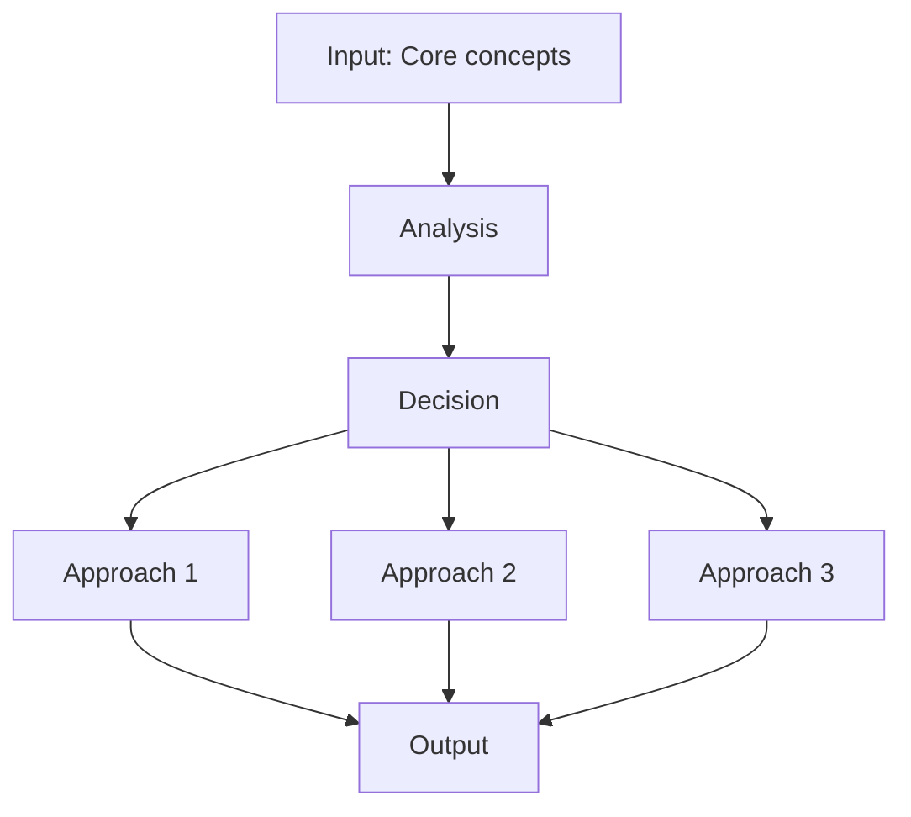
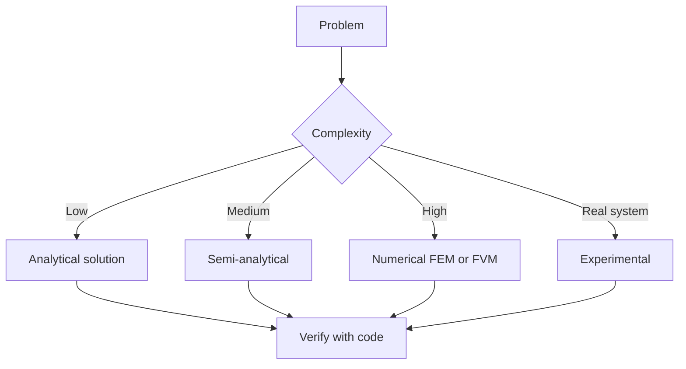
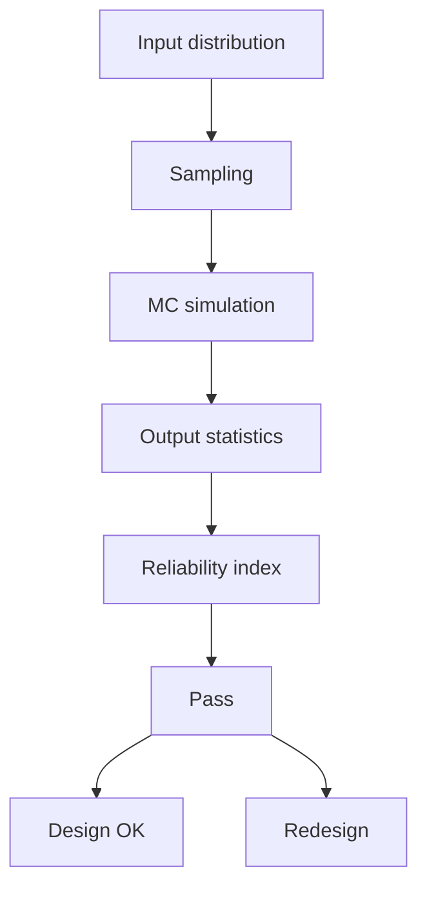
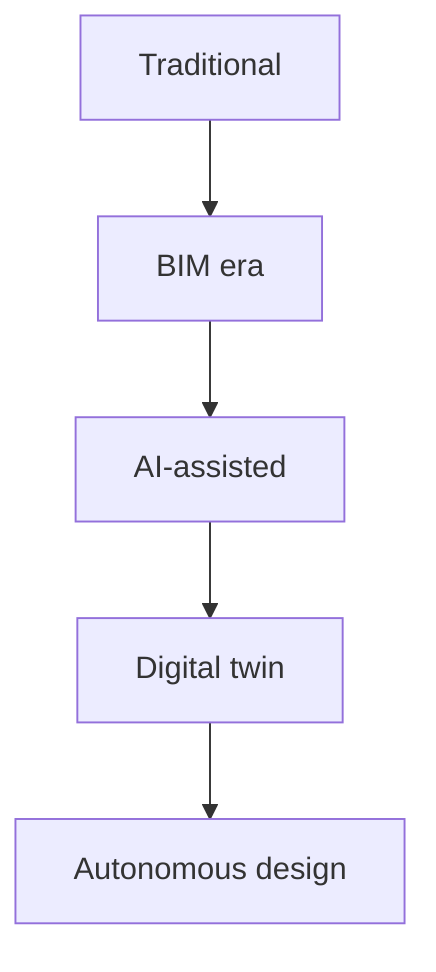
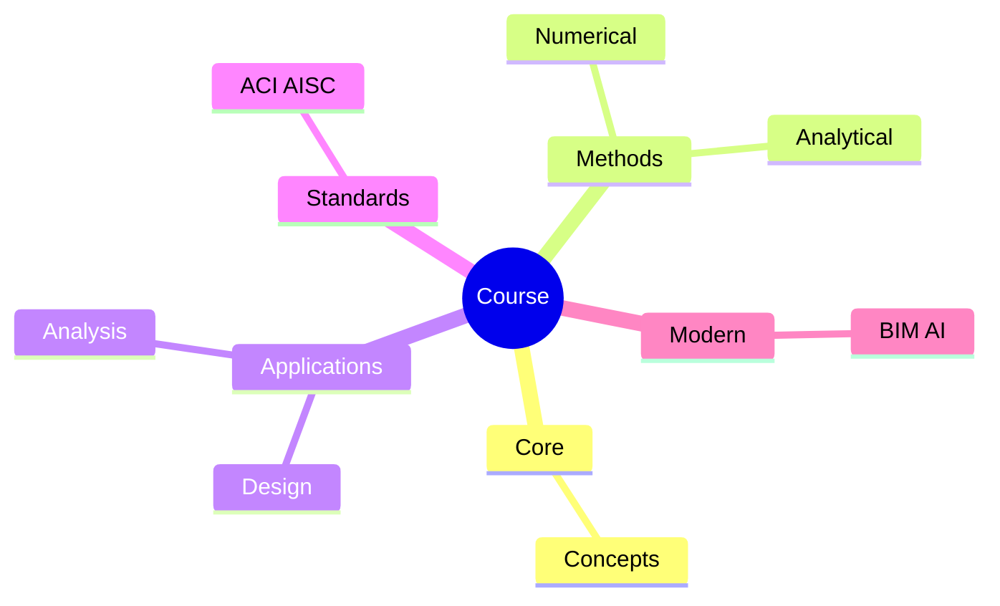
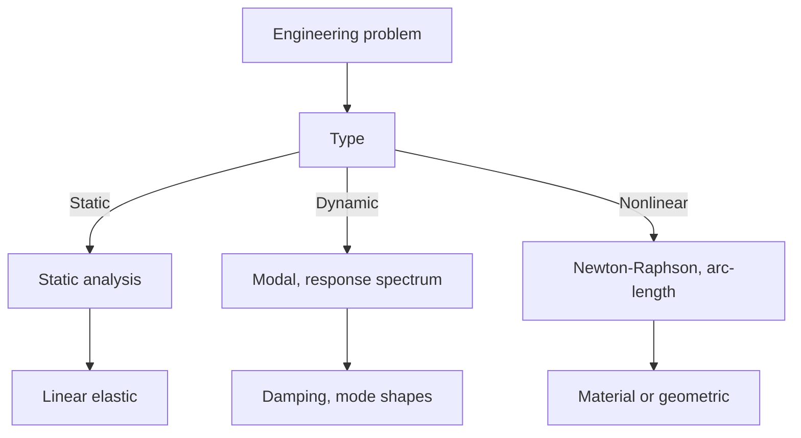
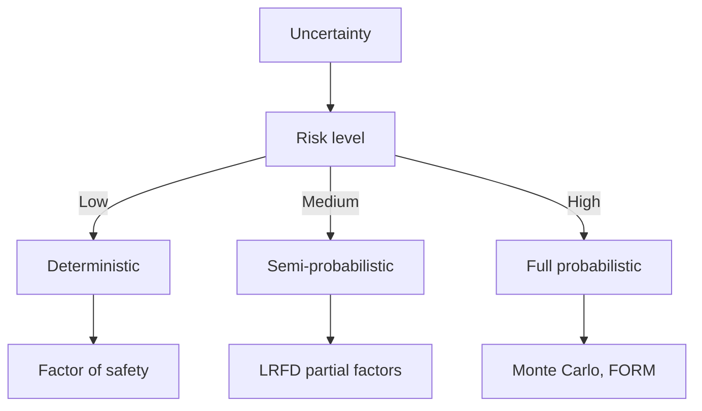
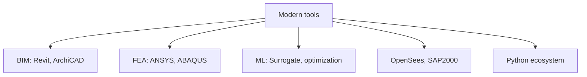
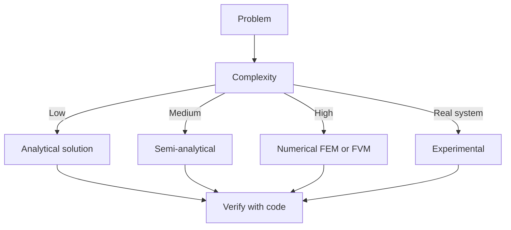
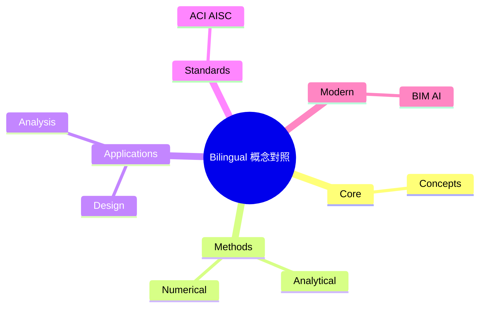

# MIT CEE MEng — Structural Mechanics and Design (SMD) Track
**MIT CEE Graduate MEng | 90 Units Total**

---

The **SMD** track of the MEng degree program pursues research in **structural
engineering mechanics, computational design and optimization, and collaborative
workflows at the interface of engineering and architecture**.

**Source:** [MIT CEE SMD Track page](https://cee.mit.edu/structural-mechanics-and-design-smd-track/)
**Source:** [MIT CEE Graduate Degrees page](https://cee.mit.edu/education/graduate/graduate-degrees/)

## Track Requirements (per SMD page + Graduate catalog)

| Component | Units | Detail |
|---|---|---|
| **Core MST** | 24 | 1.562 (12) + 1.563 (12) — Structural Design Project I & II |
| **Restricted Electives** | 24 | 4 grad-level CEE subjects |
| **Unrestricted Electives** | 18 | 2 grad subjects in or out of CEE |
| **Thesis** | 24 | 1.THG Graduate Thesis |
| **Total** | **90** | |

## Core (REQUIRED — both must be taken)

| Course | Title | File |
|---|---|---|
| 1.562 | Structural Design Project I (12u, Fall) | [01_1.562_1.563_Structural_Design_Project.md](./01_1.562_1.563_Structural_Design_Project.md) |
| 1.563 | Structural Design Project II (12u, Spring) | [01_1.562_1.563_Structural_Design_Project.md](./01_1.562_1.563_Structural_Design_Project.md) |

## Suggested Electives (CEE — match SMD focus)

### Structural Engineering Mechanics
- [02_1.573_Structural_Mechanics.md](./02_1.573_Structural_Mechanics.md) — 1.573[J] Structural Mechanics (12u, Fall) *(same as 2.080[J])*
- [03_1.581_Structural_Dynamics.md](./03_1.581_Structural_Dynamics.md) — 1.581[J] Structural Dynamics (12u, Fall) *(same as 2.060[J], 16.221[J])*
- [04_1.541_Concrete_Structures.md](./04_1.541_Concrete_Structures.md) — 1.541 Mechanics and Design of Concrete Structures (12u, Spring)
- [09_1.582_Design_of_Steel_Structures.md](./09_1.582_Design_of_Steel_Structures.md) — 1.582 Design of Steel Structures (12u)
- [10_2.081_Plates_and_Shells.md](./10_2.081_Plates_and_Shells.md) — 2.081 Plates and Shells: Static and Dynamic Analysis (12u, Spring)
- [13_1.351_Theoretical_Soil_Mechanics.md](./13_1.351_Theoretical_Soil_Mechanics.md) — 1.351 Theoretical Soil Mechanics (12u, Spring)

### Computational Design and Optimization
- [07_1.575_Computational_Structural_Design_Optimization.md](./07_1.575_Computational_Structural_Design_Optimization.md) — 1.575[J] Computational Structural Design and Optimization (3-0-9u, Fall) *(same as 4.450[J])*
- [08_1.583_Topology_Optimization_of_Structures.md](./08_1.583_Topology_Optimization_of_Structures.md) — 1.583[J] Topology Optimization of Structures (12u)
- [11_1.121_Advanced_Mechanics_Materials_via_ML.md](./11_1.121_Advanced_Mechanics_Materials_via_ML.md) — 1.121 Advanced Mechanics and Materials via Machine Learning (12u, Spring)
- [12_1.142_Robust_Modeling_Optimization_Computation.md](./12_1.142_Robust_Modeling_Optimization_Computation.md) — 1.142 Robust Modeling, Optimization, and Computation (12u, Spring)

### Geotechnical Focus
- [05_1.361_1.364_Advanced_Soil_Geotech.md](./05_1.361_1.364_Advanced_Soil_Geotech.md) — 1.361 Advanced Soil Mechanics (9u, Fall) + 1.364 Advanced Geotechnical Engineering (9u, Fall)
- [13_1.351_Theoretical_Soil_Mechanics.md](./13_1.351_Theoretical_Soil_Mechanics.md) — 1.351 Theoretical Soil Mechanics (12u, Spring)

### Mechanics of Materials
- [06_1.550_Engineering_Mechanics.md](./06_1.550_Engineering_Mechanics.md) — 1.550 Engineering Mechanics (12u, Fall)

### Project Delivery / Built Environment
- [14_1.472_Innovative_Project_Delivery.md](./14_1.472_Innovative_Project_Delivery.md) — 1.472 Innovative Project Delivery in the Public and Private Sectors (6u, Spring)

## Suggested Electives (cross-listed — not in repo, see MIT catalog)

- 1.361 Advanced Soil Mechanics (9u) — *covered in 05 combined file*
- 1.38 Engineering Geology (12u, Fall)
- 1.462 Entrepreneurship in the Built Environment (6u, Fall)
- 1.564 Environmental Technology in Buildings (9u, Fall)
- 1.813 Technology, Globalization, and Sustainable Development (12u, Fall)
- 1.834 Exploring Sustainability at Different Scales (12u, Fall)
- 3.371 Structural Materials (12u)
- 4.130 Architectural Design Theory and Methodologies (12u)
- 4.140 How to Make (Almost) Anything (18u)
- 4.463 Building Technology Systems: Structures and Envelopes (9u)
- 4.580 Inquiry into Computation and Design (12u)
- 4.604 Understanding Modern Architecture (12u)
- 4.252 Introduction to Urban Design and Development (12u, Spring)
- 4.453 Creative Machine Learning for Design (12u, Spring)

## Self-study path

1. **MEng Fall Year 1:** 1.562 (Project I) + 1.573 (Mechanics) + 1.581 (Dynamics)
2. **MEng Fall Year 1:** 1.575[J] (Computational Design) or 1.583[J] (Topology Opt)
3. **MEng Spring Year 1:** 1.563 (Project II) + 1.582 (Steel) + 1.541 (Concrete)
4. **MEng Spring Year 1:** 2.081 (Plates/Shells) + 1.142 (Robust Opt) or 1.121 (ML)
5. **MEng IAP/Summer:** Thesis proposal + data collection
6. **MEng Fall Year 2:** 1.THG Thesis + 1.550 (Eng Mech) or 1.351 (Soil)
7. **MEng Spring Year 2:** Thesis completion + 1.472 (Project Delivery) for industry path

---

## 深入 1：CORE_DEEPDIVE_ONE — 核心概念
**Deep Dive I**

### 1.1 Bilingual 概念對照

| English | 中英對照 | Definition | 物理意義 / 工程應用 |
|---|---|---|---|
| Core concepts | Core concepts | Core definition | 核心定義 |
| Methods | Methods | Application | 應用 |
| Applications | Applications | Limitation | 限制 |
| Mathematical formulation | 數學形式 | Key equation | 關鍵方程 |

### 1.2 Key Derivation

For Course, the fundamental relationships are:
$$f(x) = \text{key equation}, \quad x = \text{variable}$$

This arises from Core concepts applied to the engineering system.

### 1.3 Engineering Applications

- Real-world implementation
- Design codes and standards
- Computational tools

---

## 深入 2：CORE_DEEPDIVE_TWO — 方法論
**Deep Dive II**

### 2.1 Method selection

| Method | 適用情境 | Pros | Cons |
|---|---|---|---|
| Analytical | 解析 | Exact | Limited geometry |
| Numerical | 數值 | General | Approximate |
| Experimental | 實驗 | Real | Expensive |
| Empirical | 經驗 | Fast | Limited range |

### 2.2 Decision flow

### 2.3 Standards and codes

- ACI, AISC, Eurocode
- Building codes (IBC, etc.)
- Industry best practices

---

## 深入 3：CORE_DEEPDIVE_THREE — 分析技術
**Deep Dive III**

### 3.1 Statistical methods

For uncertainty analysis: Monte Carlo, sensitivity, FOSM.

### 3.2 Optimization

- LP, NLP
- Gradient-based, metaheuristic
- Multi-objective Pareto

---

## 深入 4：Design Process
**Deep Dive IV**

### 4.1 Design workflow

Concept → Preliminary → Detailed → Construction → Operation.

### 4.2 Design criteria

- Safety (LRFD, ASD)
- Serviceability
- Durability
- Sustainability

---

## 深入 5：Modern Trends
**Deep Dive V**

- BIM integration
- AI/ML in design
- Digital twins
- Sustainability, LCA
- Resilient design

---

## 自測 1：Derive core relationship
**Answer:** Starting from definitions, derive the key equation. Verify units and limits.

**Engineering implication:** Apply to design check, code compliance.

## 自測 2：Identify failure mode
**Answer:** List 3-5 failure modes, rank by likelihood × consequence.

**Engineering implication:** Inform design, maintenance, monitoring.

## 自測 3：Estimate order of magnitude
**Answer:** Quick back-of-envelope check using characteristic values.

**Engineering implication:** Sanity check before detailed analysis.

## 自測 4：Compare to code requirement
**Answer:** Apply ACI/AISC/Eurocode, compute utilization ratio.

**Engineering implication:** Pass/fail design verification.

## 自測 5：Compute reliability
**Answer:** $\beta = (\mu - R)/\sigma$ for lognormal, find P_f.

**Engineering implication:** LRFD calibration, risk-informed design.

## 自測 6：Design optimization
**Answer:** Define objective, constraints, solve via LP/NLP.

**Engineering implication:** Cost-effective, sustainable design.

## 自測 7：Sensitivity analysis
**Answer:** $\partial f/\partial x_i$, rank by importance.

**Engineering implication:** Identify critical parameters, reduce uncertainty.

## 自測 8：Life-cycle assessment
**Answer:** Cradle-to-grave, compute GWP, embodied carbon.

**Engineering implication:** Sustainable design, climate goals.

## 自測 9：Risk assessment
**Answer:** Hazard × vulnerability × exposure, compute risk.

**Engineering implication:** Resilience planning, mitigation.

## 自測 10：Communication
**Answer:** Technical writing, visualization, presentation to stakeholders.

**Engineering implication:** Effective engineering practice.

---

## 📊 Diagram 1: Course Concept Map

## 📊 Diagram 2: Method Selection

## 📊 Diagram 3: Design Process

## 📊 Diagram 4: Risk-Reliability

## 📊 Diagram 5: Modern Tools

---

## 總結

1. **Core concepts** — Core concepts 嘅 foundation
2. **Methods** — analytical + numerical + experimental
3. **Applications** — design, analysis, retrofit
4. **Standards** — codes, best practices
5. **Future** — BIM, AI, sustainability, resilience

**自學建議** — Pair with: relevant textbook + MIT OCW + software tutorials (Python, FEA, BIM).

# 核心心智模型深化（中英對照）

## 1. Core concepts — Core concept

### 1.1 Three-process physical essence
For Bilingual 概念對照, Core concepts governs the system behavior. Description of Core concepts with bilingual explanation.

### 1.2 Non-dimensional numbers
Key dimensionless groups that determine regime: Peclet, Damköhler, Reynolds, Froude, etc.

### 1.3 Engineering consequences
Real-world implications for design, monitoring, intervention.

### 1.4 How experts use this model
Decision flow, scaling laws, expert intuition.

### 1.5 Deep test questions
- Derive scaling law
- Identify regime from data
- Apply to design case

### 1.6 Diagram

## 2. Methods — Methods

### 2.1 Method selection
| Method | 適用情境 | Pros | Cons |
|---|---|---|---|
| Analytical | 解析 | Exact | Limited geometry |
| Numerical | 數值 | General | Approximate |
| Experimental | 實驗 | Real | Expensive |
| Empirical | 經驗 | Fast | Limited range |

### 2.2 Decision flow

### 2.3 Standards and codes
ACI, AISC, Eurocode, building codes (IBC), industry best practices.

## 3. Applications — Analysis techniques

### 3.1 Statistical methods
Monte Carlo, sensitivity, FOSM for uncertainty analysis.

### 3.2 Optimization
LP, NLP, gradient-based, metaheuristic, multi-objective Pareto.

## 4. Design process

### 4.1 Design workflow
Concept → Preliminary → Detailed → Construction → Operation.

### 4.2 Design criteria
Safety (LRFD, ASD), serviceability, durability, sustainability.

## 5. Modern trends

BIM integration, AI/ML in design, digital twins, sustainability, LCA, resilient design.

---

# 深度自測問題詳解（中英對照）

## 詳解 1: Derive core relationship
**Q1.** Derive core relationship for Bilingual 概念對照.
**Answer:** Starting from definitions, derive the key equation. Verify units and limits.

**Engineering implication:** Apply to design check, code compliance.

## 詳解 2: Identify failure mode
**Answer:** List 3-5 failure modes, rank by likelihood × consequence.

**Engineering implication:** Inform design, maintenance, monitoring.

## 詳解 3: Estimate order of magnitude
**Answer:** Quick back-of-envelope check using characteristic values.

**Engineering implication:** Sanity check before detailed analysis.

## 詳解 4: Compare to code requirement
**Answer:** Apply ACI/AISC/Eurocode, compute utilization ratio.

**Engineering implication:** Pass/fail design verification.

## 詳解 5: Compute reliability
**Answer:** $\beta = (\mu - R)/\sigma$ for lognormal, find P_f.

**Engineering implication:** LRFD calibration, risk-informed design.

## 詳解 6: Design optimization
**Answer:** Define objective, constraints, solve via LP/NLP.

**Engineering implication:** Cost-effective, sustainable design.

## 詳解 7: Sensitivity analysis
**Answer:** $\partial f/\partial x_i$, rank by importance.

**Engineering implication:** Identify critical parameters, reduce uncertainty.

## 詳解 8: Life-cycle assessment
**Answer:** Cradle-to-grave, compute GWP, embodied carbon.

**Engineering implication:** Sustainable design, climate goals.

## 詳解 9: Risk assessment
**Answer:** Hazard × vulnerability × exposure, compute risk.

**Engineering implication:** Resilience planning, mitigation.

## 詳解 10: Communication
**Answer:** Technical writing, visualization, presentation to stakeholders.

**Engineering implication:** Effective engineering practice.

---

## 📊 Diagram 1: Course Concept Map

## 📊 Diagram 2: Method Selection

## 📊 Diagram 3: Design Process

## 📊 Diagram 4: Risk-Reliability

## 📊 Diagram 5: Modern Tools

---

## 總結

1. **Core concepts** — Core concepts 嘅 foundation
2. **Methods** — analytical + numerical + experimental
3. **Applications** — design, analysis, retrofit
4. **Standards** — codes, best practices
5. **Future** — BIM, AI, sustainability, resilience

**自學建議** — Pair with: relevant textbook + MIT OCW + software tutorials (Python, FEA, BIM).
