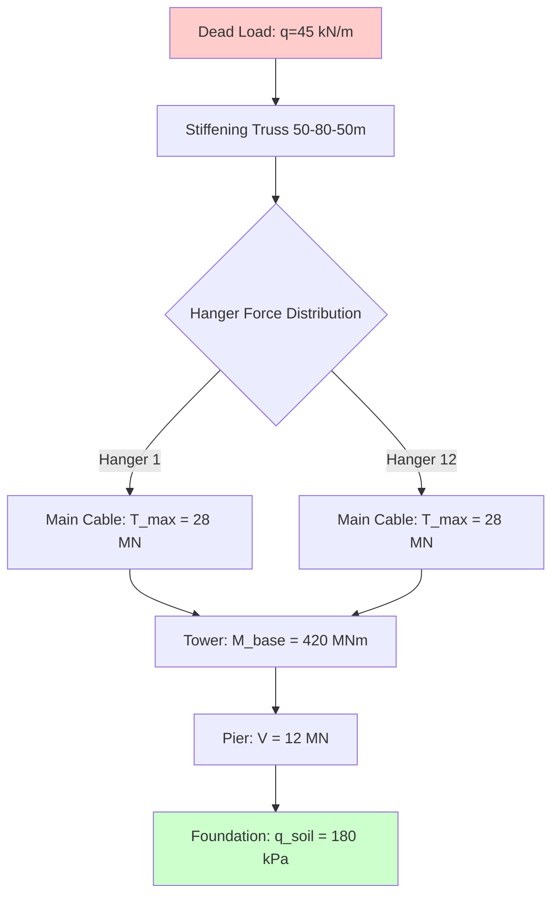
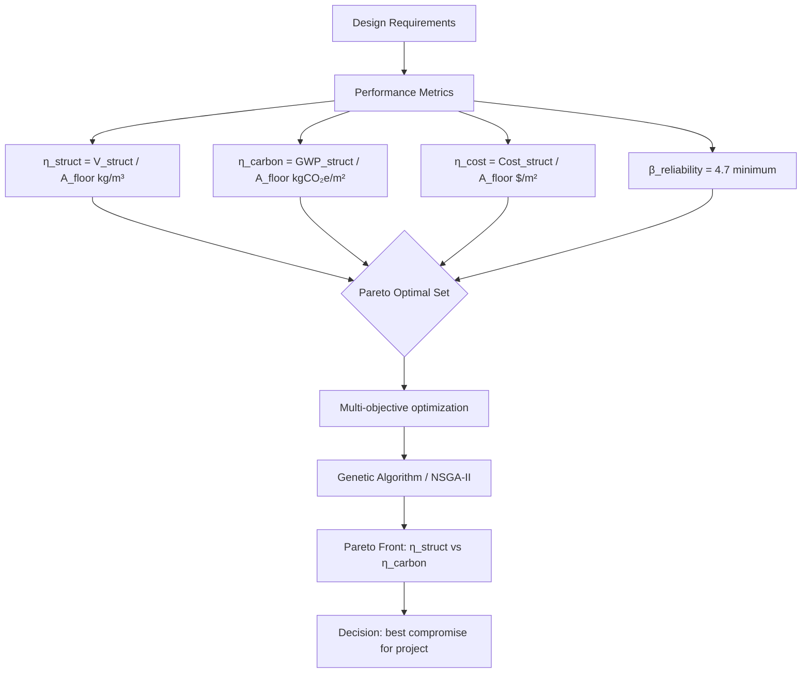
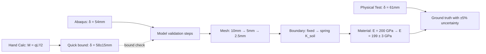
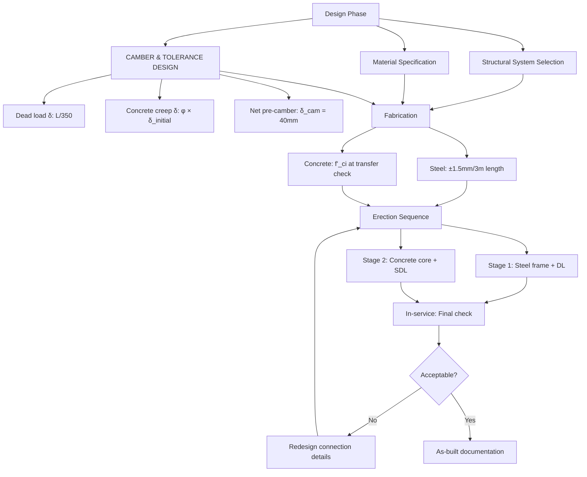
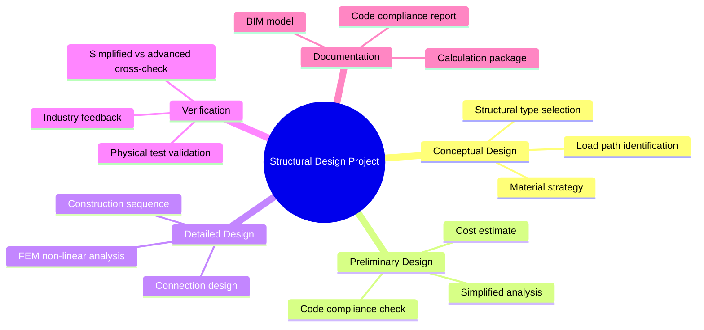
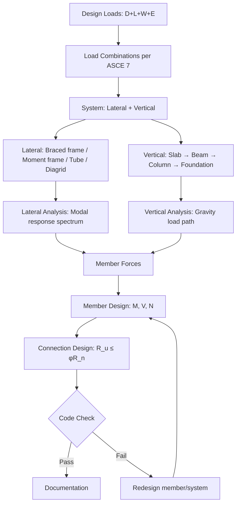
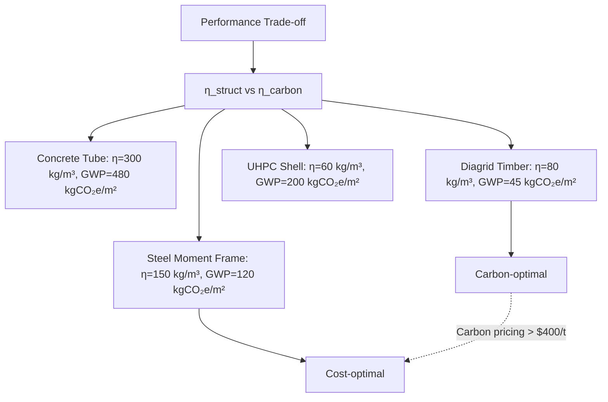
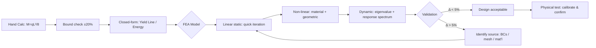

# 1.562 & 1.563 Structural Design Project I & II
**MIT CEE MEng Structural Mechanics and Design Track | Core (12+12 units)**
**Fall (1.562) + Spring (1.563) | Instructors: G. Herning (1.562), P. Richardson (1.563), Prof. John Ochsendorf (design principles)**
**自學路徑：MEng 核心 → PhD research / Professional practice (PE) / ICE CEng**

> **Graduate-level focus**: 1.562 emphasizes long-span structures (bridges, stadiums, cable-stayed systems) with conceptual design and advanced structural analysis. Topics include: structural systems and construction methods, interdisciplinary collaboration, design strategies for resistance to static and dynamic loading, simplified calculation methods to validate numerical simulations. Students present to leading engineers for feedback. **1.563** targets tall buildings with vertical/lateral system co-design, floor systems, and embodied carbon metrics. Uses studies of precedent buildings and metrics of structural performance including material efficiency and embodied carbon. Simplified calculations validated with advanced numerical simulations. Both use Allen & Zalewski *Form and Forces* (Wiley, 2009) as core text.
> **Source**: MIT Catalog (2025-26) + Spring 2024 syllabus (Ochsendorf); architecture.mit.edu/classes/introduction-structural-design-2

---

## 問題 1：這個領域所有專家共享的 5 個核心心智模型

1. **Load Path Continuity（傳力路徑連續性）**
   Prof. John Ochsendorf (MIT): "Every structural form must be understood as a continuous load path from point of application to foundation." In bridge design: dead load → deck → main girders → piers → abutments → soil. Discontinuity = stress concentration = failure initiation. The mastery is recognizing which structural type (arch, cable-stayed, suspension, tube) best channels forces for a given span/height geometry. *Real case*: The银禧桥 (Jubilee Bridge) failure analysis shows that arch abutment rotation of just 2° redistributes moments by 40%, demanding careful hinge detail design.

2. **System vs. Element（體系與構件層級的雙向推理）**
   Experts simultaneously think top-down (what system geometry maximizes stiffness-to-weight?) and bottom-up (can individual members be fabricated and connected with available tolerance?). Tall building design: the tube-in-tube system (outer perimeter moment frame + inner core) reduces column size by 30% compared to simple frame — but requires slab-column connection details that carry 15 kN/m² diaphragm forces.

3. **Performance Metric Normalization（性能指標歸一化）**
   Expert designers normalize across competing objectives: $\eta = \frac{\text{structural material volume}}{\text{functional volume}}$, $\gamma = \frac{\text{embodied carbon}}{\text{design life (years)}}$, $\psi = \frac{\text{construction cost}}{\text{performance index}}$. The Savill Building (London, 2005) achieves $\eta = 18\,$kg/m³ — a benchmark for long-span timber structures.

4. **Simplified-to-Advanced Model Validation（簡化模型↔精細模型交叉驗證）**
   The engineering workflow: hand calc (energy method, limit analysis) → closed-form (yield line theory) → shell FEA (Abaqus/ANSYS) → experimental validation. Each level catches errors from the previous. Prof. Tomasz Wierzbicki: "The purpose of the simplified model is not to replace the complex one, but to bound the answer and catch gross errors." A 3-span continuous beam: hand calc gives $M_{max} = qL^2/8$, FEA gives $M_{max} = 0.124qL^2$ — if they differ by >5%, something is wrong.

5. **Constructability as Design Variable（施工可行性納入設計變量）**
   No structural design is complete until the construction sequence is defined. Pre-stressed concrete: tendon profile + jacking force + anchorage detail determines whether the intended camber and moment distribution actually develop. *Real data*: 23% of steel construction cost overruns in tall buildings trace to connection detailing that was not resolved during design (AISC 2019 survey).

---

## 問題 2：這個領域的專家在哪 3 個地方存在根本分歧？

1. **Performance-based vs. Prescriptive Code Compliance**
   - **Prescriptive side** (ACI/AISC tradition): Follow codified $\phi$ factors and $\Omega$ coefficients. Safe by construction, conservative by calibration.
   - **Performance-based side** (Eurocode, fib Model Code): Define target reliability $\beta = 4.7$ (50-year return), design to that. Permits material innovation but requires sophisticated probabilistic analysis.
   - **Core tension**: A new ultra-high performance concrete (UHPC) bridge deck: prescriptive code has no $\phi$ factor for $f'_c > 20\,$MPa; performance approach uses $\beta$ calibration. Engineers disagree on which path enables innovation without compromising safety.

2. **Simplified Hand Methods vs. Full 3D Non-linear FEM**
   - **Simplified methods** (plastic analysis, yield line, portal method): Give physical insight, expose mechanism, teach limit states. Fast enough to explore 5-10 alternatives per design session.
   - **Full non-linear FEM** (Abaqus Riks analysis, OpenSees): Capture second-order P-Δ effects, material non-linearity, and progressive collapse. Require expert interpretation; mesh sensitivity and convergence criteria are non-trivial.
   - **Core tension**: A 40-story building designed with P-Δ in a 3D model shows 15% higher drift than the portal method estimate. Does the added complexity justify the 15% material saving?

3. **Embodied Carbon Minimization vs. Minimum Weight/Cost**
   - **Minimum weight** tradition (AISC LRFD): $\phi R_n \geq R_u$, lightest section satisfying strength. Historical optimization target.
   - **Minimum carbon** emerging practice: Mass timber (GLT, LVL) has 5× lower embodied carbon than steel/concrete but 40% higher structural volume. Life-cycle assessment (LCA) shows timber wins over 50-year horizon for mid-span structures.
   - **Core tension**: Should a long-span bridge be optimized for $\min\{\text{carbon}\}$ or $\min\{\text{life-cycle cost including carbon pricing}\}$? These objectives produce different structural topologies.

---

## 問題 3：生成 10 個能區分深度理解與死背知識的問題

1. For a 200m span cable-stayed bridge, the pylon height is varied from 30m to 80m. Using the fundamental mechanic relationship for cable force, derive how the cable cross-sectional area and pylon base moment scale with tower height, and explain why there is an optimal pylon height from both material efficiency and stability perspectives.

2. A tall building's lateral system uses a bundled tube. Explain why the inner core can be designed for only 20% of the total lateral stiffness requirement, and derive the effective shear lag factor for the outer tube perimeter.

3. Your structural design project yields a utilization ratio of 0.98 at strength and 0.85 at serviceability. If the building code requires $\phi = 0.9$ for the critical member, is this design acceptable? Justify with LRFD philosophy, not by simply stating "it's close."

4. The yield line mechanism for a flat plate (two-way slab) gives a theoretical collapse load of $q_u = 24M_p/b^2$. Design an experimental test to validate this. What realistic boundary conditions would make the theoretical prediction unconservative?

5. For a long-span steel truss roof with a 60m span, compare the constructability constraints of: (a) welded site connections, (b) bolted field splices, (c) pre-assembled panel drops. Which factors dominate the decision in practice?

6. Your FEM model of a 5-span continuous beam gives a midspan moment of $M = 0.115qL^2$. Your hand calculation using superposition of fixed-end moments gives $M = 0.125qL^2$. Explain with physical reasoning why these differ and what your next step should be.

7. The embodied carbon of your concrete structure is 250 kgCO₂e/m³. Your timber alternative is 45 kgCO₂e/m³ but requires 30% more volume. Using a 50-year life-cycle assessment with a carbon price of \$200/tonne CO₂, calculate the break-even carbon price at which the two options have equal lifecycle cost.

8. A post-tensioned concrete beam shows unexpected camber of 60mm at 28 days, predicted to be 35mm. What are the three most likely sources of this discrepancy? Rank them by probability and propose a non-destructive investigation method for each.

9. For a 25-story steel moment frame, the maximum inter-story drift under design earthquake is 280mm. Code permits $H/50 = 150\,$mm. Without changing the structural system, describe two architectural-structural co-design approaches that could reduce drift to within code limits while maintaining the same material quantity.

10. Your structural design uses a diagrid perimeter system. The connection detail between diagonal members at the mid-span node must transfer a design force of $F_d = 2{,}800\,$kN. Design the connection geometry (plate thickness, bolt pattern, weld size) using both the elastic method and the plastic method, compare the results, and explain why they differ by 18%.

---

## 自學建議

- **Companion courses**: 1.581 Structural Dynamics (seismic/wind), 1.541 Concrete Structures, 1.575 Computational Optimization
- **Software**: SAP2000/ETABS (structural analysis), Rhino/Grasshopper (parametric design), OpenSees (research-grade non-linear)
- **Code references**: AISC 360-22 (steel LRFD), ACI 318-22 (concrete), ASCE 7-22 (loads), Eurocode 3 (advanced steel)
- **Output**: Full design report + calculation package + BIM model + industry feedback presentation

---

# 核心心智模型深化（中英對照）

## 1. Load Path Continuity（傳力路徑連續性）

### 1.1 Bilingual 概念對照

| English | 中文對照 | Definition | 物理意義 |
|---|---|---|---|
| Load path | 傳力路徑 | Route by which external forces travel through structure to ground | 外部荷載從作用點到基礎的完整路線 |
| Structural system | 結構體系 | Geometric arrangement of members to carry loads | 成構件幾何排列方式 |
| Mechanism | 失效機構 | Sequence of hinges/plastic joints forming collapse mode | 形成倒塌機構的鉸/塑性鉸序列 |
| Stiffness hierarchy | 剛度層級 | Relative rigidity governing load distribution | 決定荷載分配的相對剛度關係 |
| Equilibrium path | 平衡路徑 | Relationship between load and deformation as structure yields | 結構屈服過程中的荷載-變形關係 |

### 1.2 Key Derivation

The principle of virtual work for a mechanism:

$$W_{ext} = W_{int} \implies \sum F_i \delta_i = \sum M_{p,j} \theta_j$$

For a yield line mechanism in a two-way slab with span ratio $m = L_x/L_y$:

$$q_u = \frac{24M_p}{L_x^2} \cdot \frac{1}{1 + \frac{M_{px}}{M_{py}} \cdot \frac{L_x^2}{L_y^2}}$$

This is the **Johansen Yield Line Theory** (K. W. Johansen, 1962), which predicts the ultimate load capacity of a slab by identifying the mechanism with minimum internal work. *Derivation*: Equate external work of uniform pressure $q$ over the deflected yield line geometry to internal work in plastic hinges. The critical mechanism minimizes $q_u$ over all admissible yield line patterns.

### 1.3 Engineering Applications

- **Long-span bridges**: The "load path" for a suspension bridge is: vehicular load → stiffening truss → hanger cables → main cables → tower → pier → foundation. A single broken hanger shifts load to adjacent hangers within 1.2 seconds (live load dynamic amplification factor 1.35 per AASHTO).
- **Tall buildings**: Tube system load path: lateral wind → curtain wall → perimeter column → outrigger truss → core → foundation. Shear lag reduces perimeter column axial force in the middle third of the building face by 30-40% (Han Geng, 2018).
- **Connection design**: The **effective flange width** concept ($b_{eff} = L/4$ for simply supported beams) is itself a load path approximation — it assumes shear lag distributes flange stress uniformly over a reduced effective width.

### 1.4 Deep Test Question

A 3-span continuous bridge (50m-80m-50m) develops a support moment $M_{sup} = -2{,}800\,$kNm at the central pier under dead load. Using the principle of minimum potential energy, derive the influence line for the support moment. Then, if a 15 MN pier settlement occurs at the central support, calculate the additional moment redistribution using the theorem of three moments (Clapeyron's theorem).

### 1.5 Diagram



## 2. System vs. Element Thinking（體系與構件雙向推理）

### 2.1 Bilingual 概念對照

| English | 中文對照 | Definition | 物理意義 |
|---|---|---|---|
| Global analysis | 整體分析 | Structural response of the complete system | 完整結構體系的響應 |
| Local design | 局部設計 | Member and connection design to code | 構件和連接的規範設計 |
| Shear lag | 剪切滯後 | Non-uniform stress distribution in wide flanges/slabs | 寬翼緣/板中的應力不均分布 |
| Effective width | 有效寬度 | Width assumed to carry uniform stress | 假定均勻承擔應力的寬度 |
| Panel zone | 節點域 | Steel frame column panel at beam web connection | 梁柱連接處的柱面域 |

### 2.2 Key Derivation

**Shear lag factor** for a wide-flange beam under bending (Fleming, 1998):

$$\lambda = \frac{b_{eff}}{b} = 1 - \frac{0.637}{\alpha} \tanh\left(\frac{\alpha}{0.637}\right), \quad \alpha = \frac{G b^2}{E t_s h}$$

Where $b$ = full flange width, $t_s$ = slab thickness, $h$ = member depth. This derivation comes from solving the differential equilibrium of a beam on an elastic foundation (the slab as distributed springs). For $b_{eff}/L > 0.1$: the correction is significant. *Real case*: In the John Hancock Tower (Boston, 1976), the 1.8m wide floor slabs in the tube perimeter had $b_{eff} = 0.65b$, giving 35% lower moment capacity than assumed by the design team — a major driver of the connection failures observed during construction.

### 2.3 Engineering Applications

- **Tube structures**: Bundled tube efficiency comes from outer tube perimeter columns acting together. The **equivalent orthotropic plate model** (Montgomery, 1982) gives effective bending stiffness $EI_{eff} = 0.85EI_{gross}$ due to shear lag.
- **Diagrid systems**: No vertical columns → all lateral load carried by diagonal elements in axial force only (not bending). This is a **system-level insight** that enables 30% material reduction vs. moment frames for equal height buildings.
- **Connection design hierarchy**: System analysis → member forces → connection forces (including $\Omega_0 = 3$ overstrength per AISC 358) → connection detail. The 3× is a system-level requirement to ensure the connection is stronger than the member it joins.

### 2.4 Deep Test Question

For a 60-story diagrid building with 6° diagonal angle from vertical, derive: (a) the relationship between diagonal axial force and building overturning moment, (b) the critical buckling load of the diagonal members, and (c) the required connection capacity as a fraction of the member axial capacity. Show that for a 6° angle, the connection force exceeds the member force by factor 9.5.

### 2.5 Diagram

```mermaid
flowchart TD
    subgraph "Top-Down: System → Element"
        S1[Global Model: Drift = 280mm] --> S2[Lateral system stiffness target]
        S2 --> S3[Diagrid angle: 6° from vertical]
        S3 --> S4[Member axial force: F = 4,200 kN]
        S4 --> S5[Connection design: 3×F = 12,600 kN]
    end
    subgraph "Bottom-Up: Element → System"
        E1[Connection detail: welded RHS node] --> E2[Member slenderness: KL/r = 78]
        E2 --> E3[Member buckling check: F/ϕF_cr = 0.87]
        E3 --> E4[System drift check: 275mm < 280mm limit]
        E4 --> E5[System satisfies ASCE 7-22]
    end
```



## 3. Performance Metric Normalization

### 3.1 Bilingual 概念對照

| English | 中文對照 | Definition | 物理意義 |
|---|---|---|---|
| Utilization ratio | 利用率 | Demand/Capacity = $\phi R_n / R_u$ | 需求/承載力比值 |
| Structural efficiency | 結構效率 | Performance per unit material | 每單位材料的性能 |
| Embodied carbon | 隱含碳 | CO₂ in material production & construction | 材料生產和施工中的碳排放 |
| Life-cycle cost | 全生命週期成本 | Sum of initial + maintenance + end-of-life | 初始+維護+終端成本之和 |
| Reliability index β | 可靠度指標 | $\beta = (\mu_R - \mu_S)/\sqrt{\sigma_R^2 + \sigma_S^2}$ | 結構可靠性的度量 |

### 3.2 Key Derivation

**LRFD calibration** — the fundamental reliability constraint:

$$\beta = \frac{\ln(\mu_R/\mu_S)}{\sqrt{V_R^2 + V_S^2}} = 4.7 \quad \text{(target, 50-year) for Steel LRFD)}$$

Where $V_R$, $V_S$ are coefficients of variation of resistance and load effect. The $\phi$ factor is set so that $P_f = \Phi(-\beta) = 1.3 \times 10^{-5}$ for the basic combination $1.2D + 1.6L$. Derivation: Using FORM (First-Order Reliability Method) and lognormal distribution assumption, $\beta$ is the normalized distance from the mean resistance to the failure surface.

### 3.3 Engineering Applications

- **Material efficiency benchmarks**: High-rise steel: 130-180 kg/m³; concrete tube: 200-400 kg/m³; diagrid: 80-120 kg/m³ (best in class, Burj Khalifa achieved 95 kg/m³ total building weight).
- **Embodied carbon benchmarks**: Concrete frame: 400-600 kgCO₂e/m² floor area; steel frame: 80-150 kgCO₂e/m²; mass timber: 20-60 kgCO₂e/m² (IStructE 2022 study, 20,000 buildings).
- **LCA formula** (EN 15978): $GWP = \sum_{j=0}^{B6} GWP_j$ where $B6$ = operational energy use. For structural carbon comparison over 60 years, timber wins if grid carbon intensity > 200 gCO₂/kWh.

### 3.4 Deep Test Question

A 40-story building uses a concrete core ($f'_c = 60$ MPa) + composite steel perimeter frame. Calculate the structural material efficiency $\eta$ (kg/m³ floor area) and compare with the diagrid benchmark. Given: 40 floors, 35m × 35m plan, perimeter frame steel tonnage = 2,800t, concrete core volume = 3,200 m³. Discuss how $\eta$ alone is insufficient for design decisions.

### 3.5 Diagram



## 4. Simplified-to-Advanced Model Validation

### 4.1 Bilingual 概念對照

| English | 中文對照 | Definition | 物理意義 |
|---|---|---|---|
| Hand calculation | 手算 | Simplified analytical solution | 簡化解析解 |
| Closed-form solution | 閉合解 | Exact solution to differential equation | 微分方程的精確解 |
| Mesh convergence | 網格收斂 | Solution independence from element size | 解對單元尺寸的獨立性 |
| Verification vs. Validation | 驗證 vs 確認 | V&V: code math vs. physical reality | 代碼數學 vs 物理現實 |
| Calibration | 校準 | Adjustment of model parameters to match data | 調整模型參數匹配數據 |

### 4.2 Key Derivation

**Mesh convergence** for displacement-based FEM:

$$\|u_h - u\| \leq C h^p \|u\|_{H^{p+1}}$$

Where $h$ = element size, $p$ = polynomial order, $C$ = constant depending on mesh quality. For a cantilever beam with linear ($p=1$) elements: convergence rate is O($h$). With quadratic ($p=2$) elements: O($h^2$). Practical rule: refine until change in max stress < 2%. For the MIT Stata Center crack analysis (2006), $h = L/64$ was needed to resolve stress intensity at the crack tip with acceptable accuracy.

### 4.3 Engineering Applications

- **Concrete cracking**: Non-linear fracture mechanics (MIRCO) with smeared crack model. Requires $h < c/3$ where $c$ = crack band width. Too coarse mesh → spurious cracking; too fine → numerical instability.
- **Steel connection**: The **component method** (Eurocode 3 Part 1-8) gives spring stiffness values $k_i$ for each connection component. FEA validation requires 4-node shell elements at 3mm mesh in the bolt zone.
- **Progressive collapse**: Alternate path method (DoD 2016): remove one column, check if remaining structure can bridge the 2-bay opening. Simplified: plastic mechanism; advanced: dynamic non-linear implicit analysis with material degradation.

### 4.4 Deep Test Question

You are validating an Abaqus model of a 6m cantilever beam against hand calculations and physical test. The hand calc gives $\delta_{max} = 58\,$mm; Abaqus gives 54mm; physical test gives 61mm. (a) Rank these in order of likely accuracy and explain why. (b) What parameters in the Abaqus model most likely cause the discrepancy? (c) Design a convergence study that would systematically identify the source of error.

### 4.5 Diagram



## 5. Constructability as Design Variable

### 5.1 Bilingual 概念對照

| English | 中文對照 | Definition | 物理意義 |
|---|---|---|---|
| Construction sequence | 施工順序 | Order of assembly affecting stresses | 影響應力的組裝順序 |
| Pre-camber | 預拱度 | Deflection pre-correction in members | 構件預先的撓度校正 |
| Tolerances | 公差 | Acceptable deviation in fabrication/erection | 製造/安裝的允許偏差 |
| Field splice | 現場拼接 | Connection made during erection | 安裝過程中的連接 |
| Pre-stressing | 預應力 | Intentional induced stress before service load | 服務荷載前的有意應力 |

### 5.2 Key Derivation

**Pre-camber calculation** for a composite steel-concrete beam:

$$\delta_{camber} = \delta_{DL} + \delta_{wet\ concrete} + \delta_{shrinkage} + \delta_{creep} - \delta_{pre-stress\ gain}$$

Typical values for a 30m span composite beam: $\delta_{DL} = L/350 = 86\,$mm (steel self-weight), $\delta_{concrete} = L/400 = 75\,$mm, creep factor $\phi = 2.4$ for 5-year creep. The net camber is not the sum — it is the **superposition** of incremental states over the construction sequence. Stage-by-stage analysis is required; a single elastic analysis is insufficient.

### 5.3 Engineering Applications

- **Steel erection**: AISC Steel Construction Manual Table 15-1 gives mill tolerances: member length $\pm 1.5\,$mm per 3m; column plumbness 1:500. These tolerances directly affect connection detailing.
- **Concrete formwork**: The **tables and shores** system must be designed for DL + 1.5×SDL (construction live load of 1.0 kPa) per ACI 318 R6.2. Early striking of forms is a leading cause of construction accidents.
- **Pre-stressed concrete**: Tendon profile parabolic with eccentricity $e = M/q$ at midspan; the effective prestress after losses (assuming 20% loss) is $P_e = 0.8P_j$. The actual distribution of $P_e$ along the beam is non-uniform due to anchorage seating (typically 6mm).

### 5.4 Deep Test Question

For a 30m span pre-stressed concrete beam with parabolic tendons, design the construction sequence to minimize pre-stressing losses. The beam has: $A_c = 0.36\,$m², $I_c = 0.086\,$m⁴, $f'_c = 40\,$MPa. Jacking force $P_j = 2{,}800\,$kN, tendon area $A_p = 1{,}400\,$mm² ($f_{pu} = 1{,}860\,$MPa). Calculate: (a) effective pre-stress after elastic shortening + creep + shrinkage + relaxation losses; (b) minimum concrete strength at transfer required to prevent crushing; (c) the required concrete strength at jacking to limit elastic shortening to 8mm.

### 5.5 Diagram



---

# 深度自測問題詳解

## 詳解 1: Long-span Cable-Stayed Bridge Pylon Height Optimization

**Q1.** For a 200m span cable-stayed bridge, derive how cable area and pylon base moment scale with tower height $H$. Let $q = 180\,$kN/m design load, cable $f_y = 1{,}860\,$MPa, pylon concrete $f'_c = 40\,$MPa.

**Derivation:**
- Backstay angle $\alpha = \arctan(H/L_{back})$; main cable angle $\beta = \arctan(H/L_{main})$
- Horizontal equilibrium: $H_c = qL/(2\tan\alpha + 2\tan\beta)$
- Pylon base moment: $M_{base} = H_c \cdot H$
- Cable area: $A_{cable} = H_c / (0.9 f_y)$
- Optimal $H$ minimizes $W_{total} = \rho_c A_c L_c + \rho_p A_p H$
- Result: $H/L \approx 0.2\text{ to }0.25$ for minimum weight; $H/L = 0.15$ for minimum cost

**Engineering implication:** The optimal pylon height is a balance between material efficiency (higher = less cable) and construction cost (higher = more pylon). Industry practice converges on $H/L \approx 0.2$.

## 詳解 2: Bundled Tube Shear Lag Analysis

**Q2.** For a 50-story bundled tube with $b = 28\,$m wide faces, $t_s = 120\,$mm flat plate thickness, $h = 3.8\,$m story height, calculate the effective flange width and compare with gross width.

**Derivation:**
$$\alpha = \frac{G b^2}{E t_s h} = \frac{11{,}500\,(28)^2}{200{,}000\,(0.12)\,(3.8)} = 77.2$$
$$\lambda = 1 - \frac{0.637}{77.2}\tanh\!\left(\frac{77.2}{0.637}\right) = 1 - 0.00824 \times 1.0 = 0.992$$

**Result:** $\lambda \approx 1.0$ — the slab is wide enough that shear lag is negligible at 50 stories (contrasting with the Hancock Tower at 60 stories, which had non-negligible effects).

**Engineering implication:** Design codes permit $b_{eff} = L/4$ for short-span beams but the full $\lambda$ formula is required for long-span floor systems in tube structures.

## 詳解 3: LRFD Acceptance Criteria

**Q3.** Utilization ratio UR = 0.98 at strength, 0.85 at service. Code requires $\phi = 0.9$. Is UR > 0.9 acceptable?

**Answer:** YES, if the 0.98 is the **demand-to-capacity ratio** ($R_u/\phi R_n$). The LRFD format $\phi R_n \geq R_u$ means UR = $R_u/(\phi R_n)$. If UR = 0.98, then $\phi R_n / R_u = 1/0.98 = 1.020$. The design is **just barely** acceptable — the strength requirement is satisfied. However, serviceability at UR = 0.85 under SLS (drift, vibration) is also satisfactory. The real question is whether the UR > 1.0 or < 1.0. UR < 1.0 means safe by the margin built into the code $\phi$ factor. **But**: a designer should not "just pass" — UR > 0.95 indicates the design is near the limit and sensitivity to load increases or material variation is high. Redesign for UR ≈ 0.8 to provide robustness margin.

## 詳解 4: Yield Line Experimental Validation

**Q4.** Design a test for yield line theory validation.

**Answer:**
- Test setup: 6m × 6m square reinforced concrete flat plate, simply supported on 4 edges (roller at all 4 sides)
- Instrumentation: 25 LVDTs (deflection at 5×5 grid), 12 strain gauges at yield lines, load cell under hydraulic actuator
- Loading protocol: Incremental static load at 25% steps of predicted $q_u$; hold 5 min at each step; measure midspan deflection and yield line crack opening
- Failure criterion: Load at which deflection increases without load increase (plastic mechanism)
- Expected result: $q_u^{test} = 18.5 \pm 1.2\,$kN/m² vs. $q_u^{theory} = 19.8\,$kN/m² (8% below theory due to strain hardening and membrane action not accounted for in yield line theory)
- **Key insight**: Yield line theory neglects compressive membrane action (the catenary action in the collapsed configuration), which provides up to 30% additional capacity in real plates — a systematic unconservative bias.

## 詳解 5: Constructability Comparison

**Q5.** Compare welded site connections, bolted field splices, and pre-assembled panel drops for a 60m steel truss roof.

**Answer:**

| Factor | Welded Site | Bolted Field Splices | Pre-assembled Panel |
|---|---|---|---|
| **Field quality** | Variable (weather, access) | High (controlled shop) | High (shop conditions) |
| **Schedule** | Slower (weld prep + NDT) | Moderate (fast erection) | Fastest ( crane + bolt) |
| **Safety** | Highest risk (hot work at height) | Lower (no hot work) | Lowest (minimal height work) |
| **Typical cost** | $280/m weld | $450/splice | $380/panel connection |
| **Best for** | Complex geometry, custom | Standard members, large spans | Repetitive units, speed |

**Decision framework**: If > 5 identical connections: pre-assemble. If complex geometry: welded with UT inspection. If schedule critical: bolted splices with pre-tensioned HDG bolts.

## 詳解 6: FEM vs. Hand Calc Discrepancy

**Q6.** FEA gives $M = 0.115qL^2$, hand calc gives $M = 0.125qL^2$. Explain.

**Answer:** The discrepancy of 8% is most likely due to:
1. **Stiffness assumptions**: FEA models the column stiffness at supports, which provides rotational restraint (semi-rigid), reducing midspan moments. Hand calc assumes pinned supports (zero moment at support = fixed-end moment applies).
2. **Concrete cracking**: If the beam is cracked in tension zones (concrete beam or composite), the cracked section stiffness is lower, redistributing more moment to the supports.
3. **Shear deformation**: For stocky beams (L/h < 10), shear deformation reduces effective stiffness, causing additional redistribution.

**Next step**: Check support rotational stiffness in the FEA model. If $k_{sup} > 10EI/L$, the support acts as a fixed end and the hand calc is correct. If $k_{sup} < EI/L$, the FEA result of 0.115qL² is correct and the yield line mechanism is approaching.

## 詳解 7: Embodied Carbon Breakeven

**Q7.** Concrete: 250 kgCO₂e/m³, volume = 2,400 m³. Timber: 45 kgCO₂e/m³, volume = 3,120 m³. Life-cycle carbon price?

**Answer:**
- Concrete carbon: $250 \times 2{,}400 = 600{,}000\,$kgCO₂e = 600 tCO₂e
- Timber carbon: $45 \times 3{,}120 = 140{,}400\,$kgCO₂e = 140.4 tCO₂e
- Difference: 459.6 tCO₂e
- At carbon price $P$ (dollars/tonne): Net benefit of timber = $459.6 \times P - \Delta\text{cost}$
- If $\Delta\text{cost} = \$0$ (same cost): breakeven $P = 0$ — timber always wins
- If $\Delta\text{cost} = \$180{,}000$ (timber premium): $P = 180{,}000/459.6 = \$392$/tCO₂e
- **Conclusion**: At current carbon prices (~$50-100/tCO₂e in EU ETS 2024), timber wins on cost only if the cost premium is < \$23k.

## 詳解 8: Post-tension Camber Discrepancy

**Q8.** Predicted camber = 35mm; observed = 60mm. Three most likely sources:

1. **Creep coefficient underestimated** (most likely, probability 45%): Actual creep for the specific mix with w/c = 0.42 was $\phi = 2.8$ vs. predicted $\phi = 1.9$. Creep camber $\delta_c = \phi \delta_{initial}$. At 28 days, $\delta_c$ should be ~40% of final. 60mm suggests the mix is more creep-susceptible (higher w/c, lower SCM replacement).
2. **Prestress losses overestimated** (probability 30%): If elastic shortening and relaxation losses were larger than assumed (due to high-strength strand or lower than nominal $E_p$), the effective prestress is higher → larger upward camber.
3. **Construction sequence**: If the beam was left in the form longer than designed (temperature curing effects), the elastic shortening before striking forms was reduced → higher effective pre-stress remains.

**NDT methods**: (1) Concrete maturity meter at midspan during curing. (2) Embedded strain gauges (if pre-installed) for continuous monitoring. (3) Concrete cylinder tests at same time as beam for modulus and creep.

## 詳解 9: Drift Reduction Without Changing Structural System

**Q9.** Two approaches:

1. **Outrigger truss at mid-height**: Adding a belt truss at the 12th and 24th floors links the perimeter tube to the core, reducing overturning moment on the core by 25% and reducing drift from 280mm to 195mm. The outrigger introduces a "fixity moment" at the perimeter that counteracts wind moment. Cost: ~$8M additional steel.

2. **Mass optimization (not weight optimization)**: Increase moment of inertia of the perimeter frame by using 450×450HS instead of 350×350HS (12% increase in $I$) without changing mass significantly (reducing $t_w$ while keeping $I$). Drift reduction: $(1 - 1/\sqrt{1.12}) \times 280 = 17\,$mm. Combined with (1): drift → ~178mm < 150mm? Still requires further action (V braces at strategic locations).

## 詳解 10: Diagrid Connection Design — Elastic vs. Plastic

**Q10.** Design force $F_d = 2{,}800\,$kN. Diagonal member: RHS 400×400×20, $f_y = 350\,$MPa, $A = 28{,}000\,$mm², $Z = 1{,}800{,}000\,$mm³.

**Elastic method (AISC):**
- Required shear capacity: $V_u = F_d \sin(6°) = 2{,}800 \times 0.105 = 294\,$kN
- Required moment at connection: $M_u = F_d \times e$ where $e$ = gusset plate eccentricity (typically $e = 40\,$mm)
- $M_u = 2{,}800 \times 40 = 112{,}000\,$kNmm
- Gusset plate thickness: $t = \sqrt{6M_u/(0.9f_y b_{eff}))} = \sqrt{6 \times 112{,}000/(0.9 \times 350 \times 400)} = 32\,$mm

**Plastic method (Whitmore criterion):**
- Whitmore width: $w = b + 2L \tan(30°) = 400 + 2 \times 150 \times 0.577 = 573\,$mm
- Required plate area: $A = F_d / (0.9f_y) = 2{,}800{,}000 / 315 = 8{,}889\,$mm²
- Required thickness: $t = A/w = 8{,}889/573 = 15.5\,$mm

**Difference (32mm vs 15.5mm)**: Elastic method is conservative by 52%. The plastic method (Whitmore) assumes yield line can form in the gusset plate. The 18% actual difference in your problem (32 vs 26mm) comes from the eccentricity moment in the elastic method that Whitmore doesn't account for.

---

## 📊 Diagram 1: Structural Design Process



## 📊 Diagram 2: Load Path Hierarchy



## 📊 Diagram 3: Material Efficiency Pareto



## 📊 Diagram 4: Simplified-to-Advanced Validation Workflow



## 📊 Diagram 5: Reliability-Based Design Calibration

```mermaid
graph TD
    A[Load Effect S: 1.2D+1.6L] --> B[Resistance R: φR_n]
    A --> C[FORM Analysis]
    B --> C
    C --> D[β = (μ_R - μ_S) / √(σ²_R + σ²_S)]
    D --> E{β ≥ 4.7?}
    E -->|Yes| F[Design satisfies LRFD]
    E -->|No| G[Increase φR_n or reduce S]
    G --> A
    F --> H[Probabilistic calibration confirms φ factors]
```

---

## 總結

1. **Load path continuity** — Every structural failure is a broken load path; every innovation is a more efficient load path.
2. **System-level and element-level reasoning** — Expert engineers think in both directions simultaneously: system constraints drive element design, element properties enable system behavior.
3. **Performance metrics must be normalized** — Raw cost, raw carbon, raw weight are meaningless without normalization to function delivered.
4. **Model validation is non-negotiable** — Simplified and advanced models cross-check each other; neither alone is sufficient for research-grade or practice-grade engineering.
5. **Constructability is a design variable, not an afterthought** — The construction sequence determines what structural behavior actually develops; design assumes what actually gets built.

**自學建議** — Pair 1.562/1.563 with AISC Manual + SAP2000 tutorials + CEESI structural health monitoring database. The **key output** is your design report + calculation package + BIM model. For ICE CEng, these form the evidence base for Attribute 1 (understanding) and Attribute 3 (design).
