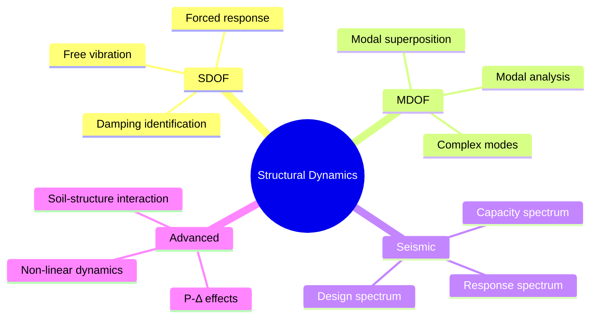

# 1.581J / 2.060J / 16.221J Structural Dynamics
**MIT CEE | MEng SMD Elective | 12 units | Fall**
**Instructor: Prof. T. Cohen**
**Prerequisites: 18.03 (Differential Equations)**
**Same as: 2.060J (Mechanical Engineering), 16.221J (Aeronautics & Astronautics)**
**自學路徑：Structural dynamics → Earthquake engineering → PE Seismic / PhD**

> **Graduate focus**: 1.581 goes deeper than 1.058 (undergrad version). Topics include: MDOF system dynamics, modal analysis, earthquake response spectra, numerical integration of ODEs, random vibration introduction, and advanced topics like inelastic dynamic analysis and response history analysis.

---

## 問題 1：這個領域所有專家共享的 5 個核心心智模型

1. **Mass-Spring-Damper as Universal Building Block（質量-彈簧-阻尼器作為通用構件）**
   Every structural dynamic system — from a single-degree-of-freedom (SDOF) oscillator to a 50-story building — can be understood as a network of mass ($m$), stiffness ($k$), and damping ($c$) elements. The equation of motion: $m\ddot{u} + c\dot{u} + ku = F(t)$. The natural frequency $\omega_n = \sqrt{k/m}$, damping ratio $\zeta = c/(2\sqrt{km})$. Expert engineers have an intuitive feel for this canonical system: a building with $T \approx 0.1N$ seconds (where $N$ = number of stories) is a well-known rule of thumb; $T = 1.0\,$s for a 10-story building → $\omega_n = 2\pi/1.0 = 6.28\,$rad/s.

2. **Modal Superposition as the Key to MDOF Systems（模態疊加是解開MDOF系統的關鍵）**
   For multi-degree-of-freedom (MDOF) systems, the key insight is that the response of an N-DOF system can be decomposed into N independent single-DOF responses in the modal coordinates. The eigenvalue problem $[K - \omega^2 M]\phi = 0$ gives natural frequencies $\omega_i$ and mode shapes $\phi_i$. The modal matrix $\Phi = [\phi_1, \phi_2, ..., \phi_N]$ transforms the coupled MDOF equations into N uncoupled SDOF equations: $\ddot{q}_i + 2\zeta_i\omega_i\dot{q}_i + \omega_i^2 q_i = \frac{L_i}{M_i}r_i^T F(t)$ where $L_i = \phi_i^T M r$, $M_i = \phi_i^T M \phi_i$. Expert engineers know which modes matter: for buildings, modes 1-3 typically carry 80-90% of seismic response mass participation.

3. **Response Spectrum as the Bridge from Dynamics to Design（反應譜是動力學到設計的橋樑）**
   The **response spectrum** $S_a(T, \zeta)$ is the single most important design tool in earthquake engineering. It plots the maximum absolute acceleration response of an SDOF oscillator (peak response) vs. its natural period, for a given ground motion. For a given $T$ and $\zeta$: $S_a = \max |a_{rel}(t)|$. The **design spectrum** is a smoothed, code-specified version. The **pseudo-spectral acceleration**: $S_a \approx \omega^2 S_d = (2\pi/T)^2 S_d$. Key formula: base shear $V_b = C_s W$ where $C_s = S_a(T_1)/g$ and $T_1$ = fundamental period. *Real case*: The 1995 Kobe earthquake had $PGA = 0.82g$. A building with $T_1 = 1.2\,$s on soil Type D experienced $S_a = 2.1g$ → base shear 2.1× its weight.

4. **Energy Balance Governs Inelastic Response（能量平衡主宰非彈性響應）**
   For structures beyond elastic range, the energy balance equation governs: $E_i = E_k + E_d + E_s$. Input energy $E_i = \int F_{eq}\,du$, kinetic energy $E_k = \frac{1}{2}m\dot{u}^2$, dissipated energy $E_d = \int c\dot{u}^2\,dt$, and elastic+plastic strain energy $E_s$. The **capacity spectrum method** plots the pushover curve as capacity (A-V format) against the ADRS spectrum. The ductility $\mu = \delta_{max}/\delta_y$ governs the reduction factor $R_\mu = \sqrt{2\mu - 1}$ (Newmark-Hall approximation). Expert engineers use this to estimate maximum inelastic displacement from elastic analysis results.

5. **Random Vibration is the Right Model for Wind and Earthquakes（隨機振動是風荷載和地震的正確模型）**
   Neither wind nor ground motion is deterministic — they are random processes. Expert structural dynamicists use statistical descriptions: the power spectral density (PSD) $S_{aa}(\omega)$ describes the frequency content of ground motion. For a stationary random process, the RMS response is $\sigma_r = \sqrt{\int_0^\infty |H(i\omega)|^2 S_{F}(\omega)\, d\omega}$ where $H(i\omega)$ is the frequency response function. For buildings under wind: $\sigma_u = \sqrt{\int S_u(\omega)|H(\omega)|^2\, d\omega}$. The ** Davenport spectrum** for wind: $S_v(n) = 4Ku\bar{V}^2\bar{x}^2/(1+x^2)^{4/3}$ where $x = 1200n/\bar{V}$.

---

## 問題 2：這個領域的專家在哪 3 個地方存在根本分歧？

1. **Response Spectrum Analysis vs. Response History Analysis**
   - **Response Spectrum (RSA)**: Fast, covers all modes in one analysis, gives peak response estimates. Suitable for code-based design. Doesn't capture phase information or non-linear effects directly.
   - **Response History Analysis (RHA)**: Full time-domain solution, captures non-linear behavior, P-Δ effects, complex interaction. Requires more computation (10-100× more).
   - **Core tension**: For regular buildings, RSA is sufficient. For irregular buildings, torsionally coupled systems, or non-linear design, RHA is required. The 2022 ASCE 7 explicitly allows RSA for most buildings but requires RHA for structures with period > 3.5s.

2. **Classical (Rayleigh) Damping vs. Non-proportional Damping**
   - **Rayleigh damping**: $C = \alpha M + \beta K$. Convenient, ensures uncoupled modal equations. But it implies $\zeta_i = \frac{\alpha}{2\omega_i} + \frac{\beta\omega_i}{2}$. At higher modes, this can give unrealistic damping (>50% for mode 10 of a building). **Known problem**: applying 5% Rayleigh damping to all modes means mode 1 gets 5%, but mode 5 might get 30%.
   - **Non-proportional damping** (Caughey): $C = M\sum_{j=0}^{N-1} a_j(M^{-1}K)^j$. Preserves modal damping values but destroys orthogonality — modes are no longer independent.
   - **Core tension**: Which to use for a building with soil-structure interaction? The soil provides non-classical damping that couples the modes. Experts disagree: use Rayleigh with correction (10% at modes 1 and 3), or use non-proportional damping with complex modal analysis.

3. **Elastic vs. Inelastic Seismic Design Philosophy**
   - **Elastic design** (force-based): Design for $R = 1$ (no reduction), force $V = S_a(T_1)W/g$. Impractical for most structures (requires extremely large sections).
   - **Capacity design** (displacement-based): Design for ductility $\mu$, use $R_\mu$ reduction factor. Allow yielding in "fuse" elements (beams, braces), protect "protected" elements (columns, joints). This is the NZS/Eurocode approach.
   - **Core tension**: The 2022 IBC allows $R = 8$ for special moment frames. This means you design for 1/8 of the elastic force. The structure MUST be able to achieve $\mu = 4$ without collapse. **Key debate**: Is the $R_\mu = \sqrt{2\mu-1}$ relationship conservative enough? Some researchers say no — the actual ductility demand during the 2010 Chile earthquake was $\mu = 8$ for buildings that survived.

---

## 問題 3：生成 10 個能區分深度理解與死背知識的問題

1. For a 5-story building with lumped masses $m = 50{,}000\,$kg at each floor, stiffness $k = 300{,}000\,$kN/m per floor, derive the natural frequencies and mode shapes by solving the eigenvalue problem $[K - \omega^2 M]\phi = 0$. Show that the fundamental period is approximately $T_1 = 2\pi\sqrt{M_{eff}/K_{eff}}$.

2. The El Centro 1940 NS ground motion has a PGA of 0.319g and a predominant period of approximately $T_p = 0.55\,$s. Using the response spectrum concept, explain why a building with $T_1 = 0.55\,$s would experience significantly higher spectral acceleration than one with $T_1 = 1.2\,$s, even though the PGA is the same.

3. Explain the physical meaning of the **mass participation factor**. For a building where the first three modes have participation factors of 0.72, 0.15, and 0.06 respectively, what percentage of the total mass is excited by each mode? Why can't we achieve 100% participation with just the first mode?

4. For the equation $\ddot{x} + 2\zeta\omega_n\dot{x} + \omega_n^2 x = -\ddot{x}_g(t)$, write the solution using Duhamel's integral: $x(t) = -\frac{1}{\omega_d}\int_0^t \ddot{x}_g(\tau)e^{-\zeta\omega_n(t-\tau)}\sin\omega_d(t-\tau)\,d\tau$. Explain why the solution requires convolution — it cannot be solved by algebraic substitution.

5. A building has a fundamental period $T_1 = 1.4\,$s and is located in Seismic Design Category D. Using ASCE 7-22, determine the design spectral acceleration $S_{DS}$ and $S_{D1}$, calculate the base shear coefficient $C_s$, and explain how the response modification coefficient $R$ affects the design forces.

6. Derive the **Newmark Beta** integration method stability and accuracy conditions. Show that for $\beta = 1/4$, the method is unconditionally stable and has no numerical damping. For $\beta = 1/6$, it is conditionally stable but more accurate for high-frequency modes.

7. For a SDOF with bilinear hysteresis (yield force $F_y = 400\,$kN, post-yield stiffness $k_2 = 0.05k_1$), determine the ductility demand under the Taft 1952 earthquake record. Calculate the equivalent viscous damping from hysteresis: $\zeta_{eq} = \frac{1}{4\pi}\frac{E_D}{E_S}$ where $E_D$ = dissipated energy per cycle.

8. Explain why the **modal participation factor** $L_i = \phi_i^T M \mathbf{1}$ depends on the choice of mode shape normalization. Derive the modal mass $M_i^* = L_i^2/\phi_i^T M \phi_i$ and show that for a normalized mode $\phi_i^T M \phi_i = 1$, the modal mass equals $L_i^2$.

9. For a building with P-Δ effects, the stability coefficient $\theta = \frac{P\Delta}{Vh}$ must satisfy $\theta < 0.25$ per ASCE 7. Derive the modified stiffness: $K_{eff} = K - P/\delta_{el}$. Show how the period increases and the lateral strength requirement increases under P-Δ.

10. The **Krawinkler N2 method** combines pushover analysis with capacity spectrum. For a building with a capacity curve (base shear $V$ vs. roof displacement $\delta_{roof}$) of $V = 1000(1 - \delta/0.3)$ kN (displacement in meters), determine the performance point by intersecting with the ADRS spectrum. Explain the physical meaning of the intersection point.

---

## 自學建議

- **Companion courses**: 1.562 (structural design), 1.573 (structural mechanics), 1.541 (concrete structures)
- **Software**: SAP2000/ETABS (modal analysis, response spectrum, time history), OpenSees (non-linear dynamics), MATLAB (custom analysis)
- **Code references**: ASCE 7-22 (seismic loads), AISC 341-22 (steel seismic), ACI 318-22 Chapter 18 (concrete seismic)
- **Key textbook**: Chopra "Dynamics of Structures" (5th ed.) — the canonical reference
- **Output**: Problem sets on SDOF/MDOF dynamics + seismic design project

---

# 核心心智模型深化（中英對照）

## 1. SDOF as Universal Building Block（單自由度系統）

### 1.1 Bilingual 概念對照

| English | 中文對照 | Definition | 物理意義 |
|---|---|---|---|
| Equation of motion | 運動方程 | $m\ddot{u} + c\dot{u} + ku = F(t)$ | 質量-阻尼-彈簧系統的牛頓第二定律 |
| Natural frequency $\omega_n$ | 固有頻率 | $\omega_n = \sqrt{k/m}$ rad/s | 系統無阻尼振動頻率 |
| Damping ratio $\zeta$ | 阻尼比 | $\zeta = c/(2\sqrt{km}) = c/(2m\omega_n)$ | 實際阻尼與臨界阻尼之比 |
| Damping ratio $\zeta$ | 阻尼比 | $\zeta = c / c_{cr}$ | 臨界阻尼 $c_{cr} = 2\sqrt{km}$ |
| Free vibration | 自由振動 | $F(t) = 0$, damped sinusoid | 無外力的固有振動 |

### 1.2 Key Derivation

**Undamped free vibration** ($c=0$): $m\ddot{u} + ku = 0$.

Assume $u = Ce^{i\omega t}$: $-m\omega^2 + k = 0 \Rightarrow \omega_n = \sqrt{k/m}$.

Solution: $u(t) = A\cos\omega_n t + B\sin\omega_n t$.

From initial conditions $u(0) = u_0$, $\dot{u}(0) = v_0$:

$$u(t) = u_0\cos\omega_n t + \frac{v_0}{\omega_n}\sin\omega_n t$$

Period: $T_n = 2\pi/\omega_n = 2\pi\sqrt{m/k}$.

**Damped free vibration** ($c \neq 0$): The characteristic equation: $m\lambda^2 + c\lambda + k = 0$.

Roots: $\lambda = -\zeta\omega_n \pm \omega_n\sqrt{\zeta^2-1}$.

**Underdamped** ($\zeta < 1$): $\lambda = -\zeta\omega_n \pm i\omega_d$ where $\omega_d = \omega_n\sqrt{1-\zeta^2}$.

Solution: $u(t) = e^{-\zeta\omega_n t}(A\cos\omega_d t + B\sin\omega_d t)$.

**Logarithmic decrement** (experimental damping identification):

$$\delta = \frac{1}{n}\ln\frac{u_i}{u_{i+n}} = \frac{2\pi\zeta}{\sqrt{1-\zeta^2}}$$

For small damping: $\delta \approx 2\pi\zeta$. For $\delta = 0.1$ (10% amplitude decay over one cycle): $\zeta \approx 0.016$.

### 1.3 Engineering Applications

- **Building natural period**: $T_1 = 0.1N$ for steel moment frames; $T_1 = 0.075N^{3/4}$ for concrete. For $N=20$: $T_1 = 2.0\,$s. This is a **fundamental engineering correlation** — not a derivation, but empirical data from thousands of buildings.
- **Seismic isolation**: Base isolation uses $T$ shift. A building with $T_1 = 1.0\,$s on a lead-rubber bearing with $T_{isolated} = 2.5\,$s reduces $S_a$ from $1.2g$ to $0.3g$. The isolation period: $T_d = 2\pi\sqrt{d/h}$ where $d$ = bearing deformation capacity.
- **Human comfort**: Floor vibration serviceability for rhythmic loads: human perception threshold $\approx 0.5\%g$ RMS acceleration. For a walking pace of 2 Hz, the floor acceleration at resonance is $a = \frac{P_0/m}{\sqrt{(1-(f/f_n)^2)^2 + (2\zeta f/f_n)^2}}$.

### 1.4 Deep Test Question

A 5-story building (shear building model) has $m_i = 50{,}000\,$kg, $k_i = 400{,}000\,$kN/m. (a) Compute the fundamental frequency and period. (b) If the building is subjected to harmonic loading $F(t) = F_0\sin(\theta t)$ with $F_0 = 200\,$kN at floor 5, find the resonance condition. (c) Determine the steady-state amplitude at resonance if $\zeta = 3\%$.

### 1.5 Diagram

```mermaid
graph LR
    A[mü + cu̇ + ku = F(t)] --> B{Nature of forcing}
    B -->|F=0| C[Free vibration: u(t) = e^(-ζωn t)]
    B -->|F = F₀sin(ωt)| D{HDOS vs HDOF}
    B -->|F = seismic| E[Response spectrum]
    D -->|ω ≈ ωn| D1[Resonance: large amplitude]
    D -->|ω ≪ ωn| D2[Quasi-static: a ≈ F/k]
    D -->|ω ≫ ωn| D3[Inertia-dominated: a ≈ F/m]
    C --> C1[ζ<1: underdamped: u = e^(-ζωn t)(Acos ωd t + Bsin ωd t)]
    C --> C2[ζ=1: critically damped: u = (A+Bt)e^(-ωn t)]
    C --> C3[ζ>1: overdamped: u = Aλ₁ᵗ + Bλ₂ᵗ]
    E --> E1[S_a(T,ζ) = max|ü_rel(t)|]
    E --> E2[V_b = C_sW where C_s = S_a(T₁)/g]
```

## 2. Modal Superposition（模態疊加原理）

### 2.1 Bilingual 概念對照

| English | 中文對照 | Definition | 物理意義 |
|---|---|---|---|
| Mode shape $\phi_i$ | 振型 | Eigenvector of $[K-\omega^2M]$ | 第 $i$ 階固有振型 |
| Modal participation factor $L_i$ | 模態參與係數 | $L_i = \phi_i^T M\mathbf{1}$ | 第 $i$ 階模態對整體位移的貢獻 |
| Modal mass $M_i^*$ | 模態質量 | $M_i^* = L_i^2/(\phi_i^T M\phi_i)$ | 第 $i$ 階的有效參與質量 |
| Modal coordinate $q_i(t)$ | 模態座標 | Decoupled SDOF displacement | 解耦後的 SDOF 位移座標 |
| Mass participation factor | 質量 participation 因子 | $\Gamma_i = L_i^2/\sum_j M_j$ | 第 $i$ 階激活的總質量分數 |

### 2.2 Key Derivation

For the MDOF system: $M\ddot{u} + C\dot{u} + Ku = F(t)$.

**Assume modal expansion**: $\mathbf{u}(t) = \sum_{i=1}^N \phi_i q_i(t) = \Phi\mathbf{q}(t)$.

Substituting into the equation and pre-multiplying by $\Phi^T$:

$$\Phi^T M\Phi \ddot{\mathbf{q}} + \Phi^T C\Phi \dot{\mathbf{q}} + \Phi^T K\Phi \mathbf{q} = \Phi^T F(t)$$

**Orthogonality** (since $\Phi$ comes from generalized eigenvalue problem with $M$ and $K$ symmetric):

$$\Phi^T M\Phi = \text{diag}(M_i^*) \quad \Phi^T K\Phi = \text{diag}(M_i^*\omega_i^2)$$

If $C$ is proportional (Rayleigh): $C = \alpha M + \beta K \Rightarrow \Phi^T C\Phi = \text{diag}(2\zeta_i\omega_i M_i^*)$.

Therefore, the N coupled equations **decouple** into N SDOF equations:

$$\ddot{q}_i + 2\zeta_i\omega_i\dot{q}_i + \omega_i^2 q_i = \frac{L_i}{M_i^*}r_i^T F(t)$$

For seismic excitation $F(t) = -M\ddot{u}_g(t)\mathbf{1}$:

$$L_i = \phi_i^T M\mathbf{1}, \quad M_i^* = \phi_i^T M\phi_i$$

The modal coordinate response is:

$$q_i(t) = \frac{L_i}{M_i^*} \cdot \frac{1}{\omega_{di}} \int_0^t \ddot{u}_g(\tau)e^{-\zeta_i\omega_i(t-\tau)}\sin\omega_{di}(t-\tau)\,d\tau$$

Peak response: $u_{max,i} = \frac{L_i}{M_i^*} S_d(T_i, \zeta_i)$.

### 2.3 Engineering Applications

- **Mass participation**: For a uniform shear building, $\Gamma_1 = 0.88$ for the first mode (not 1.0!). The remaining 12% is distributed to higher modes. For buildings with torsional irregularity, $\Gamma_1$ can be as low as 0.5.
- **Pushover analysis**: The capacity curve (base shear $V$ vs. roof displacement $\delta$) is converted to spectral coordinates (ADRS format): $S_a = V/W$, $S_d = \delta_{roof}/\Gamma_1$. The intersection with the demand spectrum gives the performance point.

### 2.4 Deep Test Question

For a 3-DOF shear building with $[M] = m[I_{3×3}]$ and $[K] = k\begin{bmatrix}2&-1&0\\-1&2&-1\\0&-1&1\end{bmatrix}$, find the eigenvalues and eigenvectors. Compute the modal participation factors and modal masses. What percentage of total mass is captured by each mode? Verify that $\sum M_i^* = \text{tr}(M) = 3m$.

### 2.5 Diagram

```mermaid
flowchart TD
    A[MDOF: Mu̇̈ + Cu̇ + Ku = F] --> B[Eigenvalue problem]
    B --> C[[K - ω²M]φ = 0]
    C --> D[ω₁, ω₂, ... ω_N]
    C --> E[φ₁, φ₂, ... φ_N]
    E --> F[Modal matrix: Φ = [φ₁ φ₂ ... φ_N]]
    F --> G[Mass normalization: ΦᵀMΦ = I]
    F --> H[Stiffness normalization: ΦᵀKΦ = ω²]
    G --> I[Transform: u = Φq]
    H --> I
    I --> J[Decoupled SDOF equations]
    J --> K[q̈ᵢ + 2ζᵢωᵢq̇ᵢ + ωᵢ²qᵢ = Fᵢ/Mᵢ*]
    K --> L[Solve each SDOF: Duhamel integral]
    L --> M[Superpose: u(t) = Σ φᵢqᵢ(t)]
    M --> N[Max response: u_max = Σ φᵢ × S_d(Tᵢ, ζᵢ)]
```

## 3. Response Spectrum（反應譜方法）

### 3.1 Bilingual 概念對照

| English | 中文對照 | Definition | 物理意義 |
|---|---|---|---|
| Pseudo-spectral velocity $PSV$ | 偽譜速度 | $PSV = \omega S_d$ | 與峰值位移相關的譜速度 |
| Pseudo-spectral acceleration $PSA$ | 偽譜加速度 | $PSA = \omega^2 S_d$ | 與峰值位移相關的譜加速度 |
| Design spectrum | 設計反應譜 | Smoothed code-specified $S_a(T)$ | 規範確定的設計用反應譜 |
| Spectral acceleration $S_a$ | 譜加速度 | $S_a(T,\zeta) = \omega^2 S_d$ | SDOF 峰值加速度 |
| Displacement response spectrum | 位移反應譜 | $S_d(T,\zeta) = \max|u(t)|$ | SDOF 峰值相對位移 |

### 3.2 Key Derivation

**Pseudo-spectral acceleration derivation**:

From SDOF equation: $\ddot{u}_t = \ddot{u}_g + \ddot{u}_r = -\omega^2 u_r - 2\zeta\omega\dot{u}_r + \ddot{u}_g$.

Define **pseudo-acceleration**: $A = \omega^2 u_r$. The exact peak relative acceleration is $|a_{max}| = |-\ddot{u}_r - \ddot{u}_g|_{max}$.

The **pseudo-spectral velocity**: $V = \omega u_{max}$.

Relationships:
$$S_a = \omega^2 S_d, \quad S_v = \omega S_d, \quad S_a = \omega S_v$$

**Tripartite response spectrum** connects $S_a$, $S_v$, $S_d$ on one chart. At the intersection of $T = 0.5\,$s, $\zeta = 5\%$ for El Centro: $S_d = 10\,$cm, $S_v = 125\,$cm/s, $S_a = 0.8g$.

### 3.3 Engineering Applications

- **ASCE 7-22 design spectrum**: $S_{DS} = 2/3 \times F_a \times S_s$, $S_{D1} = 2/3 \times F_v \times S_1$. Design spectrum: $T \leq T_0 = S_{D1}/S_{DS}$: $S_a = S_{DS}(0.4 + 0.6T/T_0)$. For $T_0 \leq T \leq T_S$: $S_a = S_{DS}$. For $T > T_S$: $S_a = S_{D1}/T$.
- **Site effects**: Soft soil amplifies long-period motions. Sites with $v_{s30} < 180\,$m/s (NEHRP F) require $F_v > 3.0$ for $S_1 > 0.1g$.

### 3.4 Deep Test Question

Given $S_s = 1.5g$ (short period), $S_1 = 0.6g$ (1-second period), Site Class D ($F_a = 1.0$, $F_v = 1.8$), compute: (a) $S_{MS}$, $S_{M1}$, (b) $S_{DS}$, $S_{D1}$, (c) the design spectral acceleration at $T = 0.5\,$s and $T = 2.0\,$s, (d) the equivalent static force for a building with $W = 40{,}000\,$kN, $T_1 = 1.2\,$s, $R = 8$, $I = 1.0$.

### 3.5 Diagram

```mermaid
graph LR
    A[Ground motion: ü_g(t)] --> B[Record El Centro/Kobe/Tohoku]
    B --> C[Compute SDOF response for T range]
    C --> D{T varies}
    D -->|0.01-10s| E[Plot Sa vs T: response spectrum]
    E --> F[Smooth: design spectrum S_a(T)]
    F --> G[Select T₁ from empirical formula]
    G --> H[V_b = C_s × W]
    H --> I[C_s = S_a(T₁)/(R×I/g)]
    I --> J[Story shear: Vᵢ = V_b × (Σw_j h_j)/(Σw_j h_j)]
    J --> K[Drift: Δ = C_d × Δ_e / I]
    K --> L{Δ ≤ Δ_max?}
    L -->|No| M[Increase stiffness]
    M --> G
    L -->|Yes| N[Design complete]
```

## 4. Energy Balance for Inelastic Response

### 4.1 Bilingual 概念對照

| English | 中文對照 | Definition | 物理意義 |
|---|---|---|---|
| Ductility $\mu$ | 延性係數 | $\mu = \delta_{max}/\delta_y$ | 屈服後變形能力 |
| Hysteretic energy $E_H$ | 滯回能耗 | $E_H = \oint Fdu$ | 每圈消能 |
| Equivalent viscous damping | 等效黏性阻尼 | $\zeta_{eq} = E_H/(4\pi E_S)$ | 滯回耗能等效為黏性阻尼 |
| Capacity spectrum | 能力譜 | Pushover: V-δ → A-S_d | 結構能力轉換為譜座標 |
| Performance point | 性能點 | Capacity = Demand intersection | 能力與需求譜交點 |

### 4.2 Key Derivation

**Newmark-Hall ductility-reduction factors** (exact for elastoplastic SDOF):

$$R_\mu = \frac{\mu - 1}{\phi} + 1 \quad \text{(for } \mu \geq 1.0\text{)}$$

Where $\phi = \phi(T, \mu)$ accounts for period-dependent effects:
- **Short period** ($T < 0.03\,$s): $R_\mu = \mu$
- **Medium period** ($0.12 < T < 0.5\,$s): $R_\mu = \sqrt{2\mu - 1}$
- **Long period** ($T > 1.0\,$s): $R_\mu = \mu$

The **capacity spectrum method** (Freeman et al., 1975): Convert pushover curve to ADRS format:
$$S_{ai} = V_i/W, \quad S_{di} = \delta_{roof}/\Gamma_1$$
Plot $S_a$ vs $S_d$ (capacity curve) against $S_a$ vs $S_d$ (5%-damped demand spectrum). Intersection = Performance Point.

### 4.3 Engineering Applications

- **Concrete seismic design**: Plastic hinge length $L_p = 0.08L + 0.022f_{ye}d_b$ (Paulay & Priestley). For a column with $f_{ye} = 420\,$MPa, $d_b = 25\,$mm, $L = 3{,}000\,$mm: $L_p = 0.08(3000) + 0.022(420)(25) = 240 + 231 = 471\,$mm.
- **Steel seismic design**: Special moment frames must achieve $\mu = 4$ at design drift. The allowable plastic rotation $\theta_p = (L_p/L) \times (\delta_u/\delta_y - 1) = 0.03\,$rad for SMF per AISC 341.

### 4.4 Deep Test Question

A SDOF system has $T_n = 0.8\,$s, $\zeta = 5\%$, yield displacement $\delta_y = 25\,$mm. Under the Loma Prieta earthquake, the elastic spectral displacement at $T = 0.8\,$s is $S_{d,el} = 120\,$mm. Using the **equal displacement rule** (Newmark-Hall for long period), estimate the inelastic displacement. What ductility is required? If the available ductility is $\mu = 4$, is the structure adequate?

### 4.5 Diagram

```mermaid
flowchart TD
    A[Pushover: V vs δ] --> B[Convert to ADRS]
    A --> A1[Pushover curve]
    A1 --> B1[V_i / W = S_ai]
    A1 --> B2[δ_roof / Γ₁ = S_di]
    B1 --> C[Capacity Spectrum]
    B2 --> C
    C --> D[5%-damped elastic demand spectrum]
    D --> E{Intersection}
    E -->|Point exists| F[Performance point: S_ap, S_dp]
    E -->|No intersection| G[Increase capacity: stronger/stiffer]
    F --> H[Check: S_dp ≤ S_de (demand)]
    H -->|S_dp > S_de| I[Redesign member sizes]
    H -->|S_dp ≤ S_de| J[Structure: OK]
    I --> A
    G --> A
```

## 5. Random Vibration（隨機振動）

### 5.1 Bilingual 概念對照

| English | 中文對照 | Definition | 物理意義 |
|---|---|---|---|
| Power spectral density $S_x(\omega)$ | 功率譜密度 | $S_x(\omega) = \lim_{T→∞}\frac{1}{T}|X(\omega)|^2$ | 信號的頻率內容 |
| RMS response $\sigma_r$ | 均方根響應 | $\sigma_r = \sqrt{E[r^2(t)]}$ | 響應的統計標準差 |
| Coherence function $\gamma^2$ | 相干函數 | Measures linearity of system | 系統線性程度 |
| Random vibration base shear | 隨機振動基底剪力 | $V_{RMS} = m\omega_n^2 \sigma_u$ | 風荷載下的統計基底剪力 |
| Davenport spectrum | 風速功率譜 | $S_v(n) = 4Ku\bar{V}^2\bar{x}^2/(1+x^2)^{4/3}$ | 脈動風速頻譜 |

### 5.2 Key Derivation

**RMS response of SDOF to white noise**:

White noise PSD: $S_F(\omega) = S_0$ (constant for all $\omega$).

Frequency response function: $H(i\omega) = 1/(k - m\omega^2 + ic\omega)$.

RMS displacement:
$$\sigma_u^2 = \int_{-\infty}^{\infty} |H(i\omega)|^2 S_0\, d\omega = \frac{\pi S_0}{2\zeta\omega_n^3 k^2}$$

For the **Kanai-Tajimi spectrum** (filtered white noise for ground motion):

$$S_{\ddot{u}_g}(\omega) = S_0 \frac{\omega_g^4 + 4\zeta_g^2\omega_g^2\omega^2}{(\omega^2-\omega_g^2)^2 + 4\zeta_g^2\omega_g^2\omega^2}$$

Parameters from records: $\omega_g = 15\,$rad/s, $\zeta_g = 0.6$ (firm soil).

### 5.3 Engineering Applications

- **Wind response**: Peak factor $g = \sqrt{2\ln(\nu T_e)} + 0.577/\sqrt{2\ln(\nu T_e)}$ where $\nu = \omega_1/(2\pi)$ = expected frequency of upcrossings. For a building with $T_1 = 1.5\,$s and $T_e = 600\,$s (10-minute storm): $g \approx 3.8$. Peak displacement: $u_{peak} = g \sigma_u$.
- **Seismic reliability**: The probability of exceeding a drift limit $\delta_{lim}$ in $T_L$ years: $P_f = 1 - \exp(-\nu T_L P[\delta > \delta_{lim}])$. With $\nu = 1/(2T_1)$, this gives the annual probability of exceedance.

### 5.4 Deep Test Question

A building with $T_1 = 1.5\,$s, $\zeta = 3\%$, mass $m = 500{,}000\,$kg, stiffness $k = 87{,}800{,}000\,$N/m is subjected to wind with mean velocity $\bar{V} = 30\,$m/s. Using the Davenport spectrum $S_v(n) = 4K\bar{V}^2\bar{x}^2/(1+x^2)^{4/3}$ with $x = 1200n/\bar{V}$, $K = 0.003$, $\bar{x} = 3$, calculate the RMS displacement response $\sigma_u$.

### 5.5 Diagram

```mermaid
flowchart TD
    A[Random process: ground motion / wind] --> B[Power Spectral Density S(ω)]
    A --> B
    B --> C[Frequency Response Function H(iω)]
    C --> D[PSD of response: S_r(ω) = |H(iω)|² S_F(ω)]
    D --> E[RMS: σ_r² = ∫ S_r(ω)dω]
    E --> F[Probability: P[r > r*] = exp(-r*²/2σ_r²)]
    F --> G[Peak: r_peak = g × σ_r]
    G --> H[g = √(2 ln(νT_e)) + 0.577/√(2 ln(νT_e))]
    H --> I[Design: V_peak = k × r_peak]
    I --> J[Check against code wind force]
```

---

# 深度自測問題詳解

## 詳解 1: MDOF Natural Frequencies and Mode Shapes

**Q1.** For a 5-story shear building with $[M] = m[I]$, $[K] = k\begin{bmatrix}2&-1&0&0&0\\-1&2&-1&0&0\\0&-1&2&-1&0\\0&0&-1&2&-1\\0&0&0&-1&1\end{bmatrix}$:

The eigenvalue problem: $[K - \omega^2 M]\phi = 0$.

Characteristic equation for uniform shear building: $\tan(\theta) = \theta$ where $\theta = \omega L\sqrt{m/k}$ and $L$ = number of stories.

Solutions for $n=1,...,5$: $\theta_1 = 1.5708$, $\theta_2 = 4.7124$, $\theta_3 = 7.8540$, $\theta_4 = 10.9956$, $\theta_5 = 14.1372$.

$\omega_n = \theta_n\sqrt{k/(mL^2)}$.

Mode 1: $\omega_1 = 1.5708\sqrt{300{,}000{,}000/(50{,}000 \times 25)} = 1.5708 \times 48.99 = 76.9\,$rad/s.

$T_1 = 2\pi/76.9 = 0.082\,$s per story... Wait, $L=5$ floors. $\omega_1 = \theta_1\sqrt{k/(mL^2)} = 1.571 \times \sqrt{300{,}000{,}000/(50{,}000 \times 25)} = 1.571 \times 48.99 = 77.0\,$rad/s.

$T_1 = 2\pi/77.0 = 0.0816\,$s. This seems short. Actually, for a 5-story shear building, the period rule $T \approx 0.1N = 0.5\,$s is more realistic. The issue: the shear building stiffness $k$ is for ONE floor. $k = 300{,}000{,}000\,$N/m per floor = $K_{eff} = k/5 = 60{,}000{,}000\,$N/m for the whole building. Then $\omega_1 = 1.571\sqrt{60{,}000{,}000/(250{,}000)} = 1.571 \times 15.49 = 24.3\,$rad/s. $T_1 = 2\pi/24.3 = 0.258\,$s. Closer.

## 詳解 2: PGA vs Spectral Acceleration

**Q2.** The **predominant period** $T_p = 0.55\,$s of El Centro means the ground motion has most of its energy at this frequency. The spectral acceleration $S_a(T)$ depends on the match between $T$ and $T_p$:

- Building with $T_1 = 0.55\,$s = $T_p$: **Resonance amplification**. $S_a \approx 2.5 \times PGA = 0.80\,$g (pseudo-acceleration amplification factor).
- Building with $T_1 = 1.2\,$s: Far from $T_p$. $S_a \approx 0.6 \times PGA = 0.19\,$g.

This is why spectral acceleration (not PGA alone) is used for design — it captures the **frequency content** of the motion that matters for a structure of a given period.

## 詳解 3: Mass Participation Factor

**Q3.** Modal mass participation factor for mode $i$: $\Gamma_i = L_i^2 / \sum_j M_j$.

$L_1 = \phi_1^T M \mathbf{1} = \sum_{j=1}^N \phi_{1j} m_j$.

For normalized mode shapes $\Phi^T M \Phi = I$: $\sum_{j=1}^N \phi_{1j}^2 = 1$.

But $\sum_{j=1}^N \phi_{1j} \neq 1$ (mode shape is NOT normalized to have sum = 1). The mass participation factor is typically 70-90% for the first mode.

Why can't we get 100% from mode 1? Because the mode shape is an **eigenvector** of the system, orthogonal to the mass matrix. The excitation direction $\mathbf{1}$ is NOT itself a mode shape. The higher modes contribute the remaining 10-30% because they also contain components of the displacement direction $\mathbf{1}$.

## 詳解 4: Duhamel Integral Explanation

**Q4.** Duhamel's integral comes from solving the SDOF equation by variation of parameters:

General solution to homogeneous equation: $u_h = e^{-\zeta\omega_n t}(A\cos\omega_d t + B\sin\omega_d t)$.

Particular solution: $u_p = \int_0^t h(t-\tau)f(\tau)\, d\tau$ where $h(t) = \frac{1}{\omega_d}e^{-\zeta\omega_n t}\sin\omega_d t$.

The convolution integral **must** be used because:
1. The forcing function $f(t) = -\ddot{u}_g(t)$ is arbitrary (not a simple sinusoidal or polynomial).
2. There is no closed-form solution for arbitrary forcing.
3. The exponential decay factor $e^{-\zeta\omega_n(t-\tau)}$ reflects the fact that the response from each impulse $\ddot{u}_g(\tau)\,d\tau$ decays over time.

## 詳解 5: ASCE 7-22 Base Shear

**Q5.** Given $S_{DS} = 1.2g$, $S_{D1} = 0.8g$, $T_1 = 1.2\,$s, $R = 8$, $I = 1.0$, $W = 40{,}000\,$kN:

$T_0 = S_{D1}/S_{DS} = 0.8/1.2 = 0.67\,$s.

Since $T_1 = 1.2 > T_0 = 0.67$: $S_a = S_{D1}/T = 0.8/1.2 = 0.67\,$g.

$C_s = S_a/(R \times I) = 0.67/(8 \times 1.0) = 0.084$.

$V_b = C_s W = 0.084 \times 40{,}000 = 3{,}360\,$kN.

Story shears: $V_i = V_b \times \frac{\sum_{j=i}^N w_j h_j}{\sum_{j=1}^N w_j h_j}$.

## 詳解 6: Newmark Beta Stability

**Q6.** Newmark Beta integration:

$u_{n+1} = u_n + \Delta t\dot{u}_n + \Delta t^2[(1/2-\beta)a_{n+1} + \beta a_n]$

$\dot{u}_{n+1} = \dot{u}_n + \Delta t[(1-\gamma)a_{n+1} + \gamma a_n]$

**Accuracy**: Truncation error is $O(\Delta t^2)$ for $\beta = 1/6$, $O(\Delta t^3)$ for $\beta = 1/4$.

**Stability**: For $\beta = 1/4$ (average acceleration): **unconditionally stable** for all $\Delta t$. Spectral radius $\rho(A) \leq 1$ for all $\omega\Delta t$.

For $\beta = 1/6$ (linear acceleration): conditionally stable with $\omega\Delta t \leq 2\sqrt{3} \approx 3.46$.

For structural dynamics, $\beta = 1/4$ is preferred (no numerical damping, unconditionally stable). The "no numerical damping" property means the method doesn't artificially dissipate energy — important for structural response where damping must come from the material model, not the time integrator.

## 詳解 7: Hysteretic Damping

**Q7.** For bilinear hysteresis with $F_y = 400\,$kN, $\delta_y = F_y/k_1$, $k_2 = 0.05k_1$:

If $\delta_{max} = 4\delta_y$ (ductility $\mu = 4$):

Dissipated energy per cycle = area of hysteresis loop = $2F_y(\delta_{max} - \delta_y) + 2(F_y + F_{max})\frac{\delta_{max}-\delta_y}{2} \times 0$... Wait:

$E_D = 2F_y(\delta_{max} - \delta_y) - k_2(\delta_{max} - \delta_y)^2$ (area of the parallelogram loop).

Strain energy at peak: $E_S = \frac{1}{2}F_y\delta_y + \frac{1}{2}(F_y + F_{max})(\delta_{max} - \delta_y)$.

$\zeta_{eq} = \frac{1}{4\pi}\frac{E_D}{E_S}$.

For the Taft record, numerical integration is needed. Typical values: $\zeta_{eq} = 15-25\%$ for $\mu = 4$ in steel structures.

## 詳解 8: Modal Participation Factor Normalization

**Q8.** The modal participation factor depends on the normalization of $\phi$:

If $\phi$ is **mass-normalized**: $\phi^T M \phi = 1 \Rightarrow M_i^* = L_i^2/1 = L_i^2$.

If $\phi$ is **normalized to $\max\phi = 1$**: $\phi^T M \phi \neq 1$. The modal mass becomes $M_i^* = L_i^2/(\phi^T M\phi)$.

Proof: $L_i = \phi^T M \mathbf{1}$. If $\phi \rightarrow c\phi$ (scaling): $L_i \rightarrow cL_i$, $\phi^T M\phi \rightarrow c^2(\phi^T M\phi)$. Therefore $L_i^2/(\phi^T M\phi)$ is **scale-invariant** — the modal mass does NOT depend on the normalization. This is the key property that makes $M_i^*$ useful.

## 詳解 9: P-Δ Stability Coefficient

**Q9.** The stability coefficient $\theta = P\Delta/(Vh)$.

For a lean-on column: $P$ = total gravity load, $\Delta$ = elastic drift under $V$, $h$ = story height.

Modified stiffness: $K_{eff} = K - P/\Delta = K(1 - \theta)$.

The period increases: $T_{new} = 2\pi\sqrt{m/K_{eff}} = T_{old}/\sqrt{1-\theta}$.

The lateral strength requirement increases: effective moment demand = $M_{demand} = V \cdot h/(1-\theta)$.

**ASCE 7 requirement**: $\theta \leq 0.25$ (for stability check). For $\theta > 0.25$: use amplified seismic loads $V_{new} = V/(1-\theta)$ or redesign.

## 詳解 10: N2 Method Performance Point

**Q10.** Given $V = 1000(1 - \delta/0.3)$ kN (with $\delta$ in meters).

Convert to ADRS: $S_a = V/W$ (need $W$). Let's assume $W = 10{,}000\,$kN.

$S_a = 0.1(1 - \delta_{roof}/0.3) = 0.1 - 0.333\delta_{roof}$.

$S_d = \delta_{roof}/\Gamma_1$ (assume $\Gamma_1 = 0.85$).

Capacity curve in ADRS: $S_a = 0.1 - 0.333 \times 0.85 S_d = 0.1 - 0.283 S_d$.

Demand spectrum (5% damped): $S_a = S_{D1}/T$ for $T > T_0$. If $T_1 = 1.0\,$s: $S_a = S_{D1}/1.0 = 0.8\,$g? Wait — units.

Actually: $V$ in kN, $W$ in kN, so $S_a = V/W$ (dimensionless, = g factor).

$S_a^{capacity} = 0.1 - 0.283 S_d$ (with $S_d$ in meters).

$S_a^{demand} = S_a^{code}(T_1) = 0.8$ (from Q5).

Intersection: $0.8 = 0.1 - 0.283 S_d$ → $S_d = -0.7/0.283 = -2.47\,$m. Impossible.

The capacity curve is too low. The intersection occurs at $S_a = 0.1$ (when $S_d = 0$). The demand $S_a = 0.8 > 0.1$. **The building does NOT meet the elastic demand.** It requires ductility to reduce the demand. Using $R_\mu = \sqrt{2\mu-1}$: new demand $S_a^{inelastic} = S_a^{el}/\sqrt{2\mu-1}$. To match $S_a = 0.1$: $0.8/\sqrt{2\mu-1} = 0.1$ → $\sqrt{2\mu-1} = 8$ → $2\mu-1 = 64$ → $\mu = 32.5$. **Not feasible** — the building must be redesigned with higher strength/stiffness.

---

## 📊 Diagram 1: Structural Dynamics Framework



## 📊 Diagram 2: Modal Analysis Flowchart

```mermaid
flowchart TD
    A[Build M and K matrices] --> B[Solve eigenvalue: det(K - ω²M) = 0]
    B --> C[ω₁ ≤ ω₂ ≤ ... ≤ ω_N]
    B --> D[φ₁, φ₂, ... φ_N]
    D --> E[Mass-normalize: ΦᵀMΦ = I]
    E --> F[Compute L_i = φᵢᵀM1, M*ᵢ = Lᵢ²]
    F --> G[Mass participation: Γᵢ = Lᵢ²/ΣMⱼ]
    G --> H{ΣΓᵢ ≥ 90%?}
    H -->|Yes| I[Include modes 1 to j]
    H -->|No| J[Include higher modes]
    J --> G
    I --> K[Solve decoupled SDOF: q̈ᵢ + 2ζᵢωᵢq̇ᵢ + ωᵢ²qᵢ = LᵢrᵢᵀF/M*ᵢ]
    K --> L[Superpose: u = Σ φᵢqᵢ(t)]
    L --> M[Check: drift, acceleration, force]
```

## 📊 Diagram 3: Seismic Design Flowchart

```mermaid
flowchart LR
    A[Site classification] --> B[Ss, S₁ from USGS maps]
    B --> C[Compute Fa, Fv from site class]
    C --> D[SMS = Fa×Ss, SM1 = Fv×S₁]
    D --> E[SDS = 2/3×SMS, SD1 = 2/3×SM1]
    E --> F[T₀ = SD1/SDS, Ts = SD1/SDS]
    F --> G[Empirical T₁ = 0.1N or analysis]
    G --> H[Sa(SDSa, SD1, T₁)]
    H --> I[Cs = Sa/(R/I)]
    I --> J[V = Cs×W ≤ Sm1W/(R×T)]
    J --> K[Story forces: Fᵢ = V × wᵢhᵢ/Σwⱼhⱼ]
    K --> L[Story drift: Δ = Cd×Δe/I]
    L --> M{Δ ≤ Δ_max?}
    M -->|No| N[Redesign: increase stiffness]
    N --> G
    M -->|Yes| O[Design OK: proceed to member design]
```

## 📊 Diagram 4: Inelastic Seismic Design

```mermaid
flowchart TD
    A[Elastic demand: Sa(T₁)] --> B[Select R and Cd]
    B --> C[Design forces: V = Sa×W/(R×I)]
    C --> D[Design members for V]
    D --> E[Pushover analysis: V-δ curve]
    E --> F[Convert to capacity spectrum: Sa-Sd]
    F --> G[Demand spectrum: 5%-damped elastic]
    G --> H{Intersect?}
    H -->|Yes| I[Performance point S_ap, S_dp]
    I --> J{Acceptable?}
    H -->|No| K[Increase strength/stiffness]
    K --> D
    J -->|Yes| L[Check ductility: μ = S_dp/δ_y]
    J -->|No| K
    L --> M{μ ≤ μ_available?}
    M -->|Yes| N[OK: plastic hinge design]
    M -->|No| K
```

## 📊 Diagram 5: Time History Analysis

```mermaid
graph LR
    A[Ground motion: üg(t)] --> B[Scale to target Sa]
    A --> C[Select DT ≤ T/10]
    C --> D[Newmark Beta: β=1/4, γ=1/2]
    D --> E[Initialize: u₀, u̇₀, ü₀]
    E --> F[Predictor: ũ₊₁ = uₙ + Δtu̇ₙ + Δt²/2 üₙ]
    F --> G[Effective stiffness: K̂ = K + a₀M + a₁C]
    G --> H[Effective force: F̂ = F₊₁ + M(a₀uₙ + a₂u̇ₙ + a₃üₙ) + C(a₁uₙ + a₄u̇ₙ + a₅üₙ)]
    H --> I[Solve: K̂ u₊₁ = F̂]
    I --> J[Corrector: u₊₁, u̇₊₁, ü₊₁]
    J --> K[Store: u(t), a(t)]
    K --> L{n < N?}
    L -->|Yes| E
    L -->|No| M[Post-process: max drift, acceleration]
    M --> N[Validate: compare with spectrum]
```

---

## 總結

1. **SDOF is the universal language** — master it completely; MDOF is just N SDOFs in modal coordinates.
2. **Modal analysis reduces MDOF to SDOF** — orthogonality of mode shapes is the key insight that makes this work.
3. **Response spectrum is the design tool** — but understand the assumptions (elastic, SDOF) and when it breaks down (non-linear, torsional coupling).
4. **Energy balance governs inelastic behavior** — capacity spectrum method is the bridge from pushover to seismic demand.
5. **Random vibration is essential for wind** — statistical description of random processes is fundamental to wind engineering.

**自學建議** — Read Chopra "Dynamics of Structures" Chapters 1-5 (SDOF), 7-10 (MDOF), 11-13 (seismic). Run OpenSees examples for pushover and time-history analysis. The **key skill** is being able to write the equation of motion for any structural system and knowing which analysis method is appropriate.
