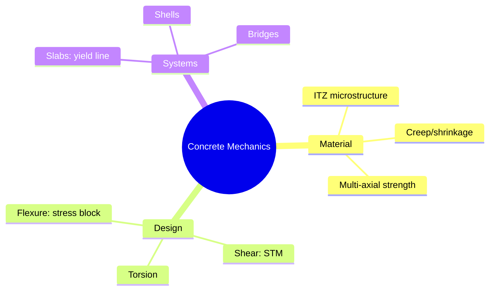
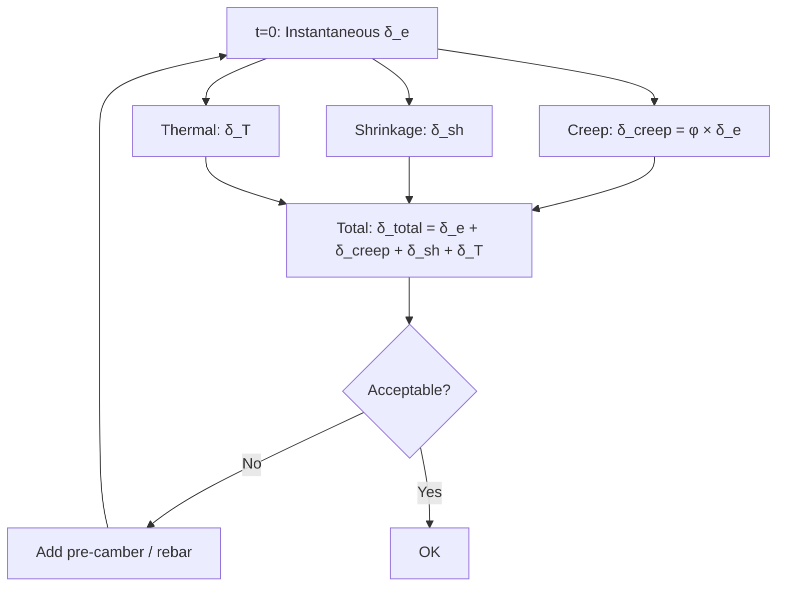
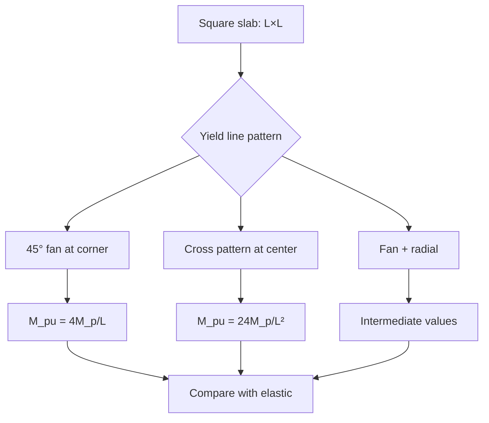

# 1.541 / 1.054 Mechanics and Design of Concrete Structures
**MIT CEE | MEng SMD Elective | 12 units | Spring**
**Instructor: Prof. Franz-Josef Ulm**
**Prerequisites: 1.036 (Structural Mechanics and Design)**
**自學路徑：Concrete design → Structural engineering → PE / PhD**

> **Graduate focus**: 1.541 covers advanced concrete behavior including multi-axial strength, concrete plasticity, fracture mechanics, high-performance concrete, yield line theory, non-linear analysis, and complex systems (bridges, shells). Graduate version requires additional assignments.

---

## 問題 1：這個領域所有專家共享的 5 個核心心智模型

1. **Concrete is a Composite, Not a Homogeneous Material（混凝土是複合材料，非均質材料）**
   Concrete consists of aggregate (60-75% by volume), cement paste, and interfacial transition zone (ITZ). The ITZ (the "weak link") is the critical region determining strength and durability. The effective stiffness of concrete $E_c$ is reduced by the ITZ compliance, and the compressive strength $f'_c$ follows the gel-space ratio theory: $f'_c = A \cdot (G/S)^{B}$ where $G/S$ = gel-to-space ratio (Powers' theory). *Real case*: High-performance concrete (HPC) with silica fume refines the ITZ to ~1-2μm thickness vs. 20-50μm in normal concrete, increasing $f'_c$ from 30→80 MPa.

2. **Cracking is Inevitable — Design for Crack Width, Not Crack Avoidance（開裂不可避免 — 按裂縫寬度設計，非避免裂縫）**
   Concrete cracks. Expert designers accept this and control cracking through: (a) reinforcement detailing (rebar spacing $s \leq 2c/\beta$ where $c$ = cover, $\beta = 1.0$ for single rebar), (b) temperature and shrinkage control, (c) construction sequencing. The crack width formula (Frosdahl): $w = 3c_r + 0.08\frac{d_{bar}}{\rho_{eff}} \times 10^{-3}$ (mm). For $w_{max} = 0.3\,$mm (water-retaining structures): $c_r = 25\,$mm, $d = 20\,$mm → $\rho_{eff} \geq 2.7\%$.

3. **Ductility Through Reinforcement — the Stress Block Approach（鋼筋提供延性 — 應力塊方法）**
   Plain concrete has essentially zero tensile ductility (brittle). Rebar provides the ductility needed for LRFD design. The stress block approach (Whitney stress block, $\alpha = 0.85, \beta_1 = 0.85 - 0.05(f'_c - 30)/7$) transforms the complex concrete stress-strain curve into an equivalent rectangular stress block, enabling simple flexural design while capturing the ultimate capacity. This is the basis of ACI 318 moment capacity equations: $M_n = A_s f_y(d - a/2)$.

4. **Creep and Shrinkage are Time-Dependent, Not Irrelevant（徐變和收縮是時間依賴的，非無關緊要）**
   Concrete's time-dependent deformation under sustained load (creep) and drying (shrinkage) causes: (a) loss of pre-stress (up to 25% of initial pre-stress over 30 years), (b) deflection growth (up to 3× the elastic deflection over time), (c) cracking from differential shrinkage. The ACI 209 model: $\varepsilon_{creep}(t) = \varepsilon_0 \cdot \frac{t^{0.6}}{10 + t^{0.6}} \cdot t_0^{-0.4}$ accounts for age at loading $t_0$. Expert engineers always check long-term deflection, not just instantaneous.

5. **Yield Line Theory is the Bridge from Elastic to Plastic Analysis（屈服線理論是彈性到塑性分析的橋樑）**
   The yield line theory (Johansen, 1962) computes the ultimate load of slabs by identifying the collapse mechanism (yield lines) that minimizes the internal work. This is the upper bound theorem of limit analysis applied to reinforced concrete. The key: the yield line pattern is derived from the principle of virtual work: $\sum M_p \theta = \sum q A_{plate}$ at collapse. For a square slab (yield lines at 45° to edges): $q_u = \frac{24M_p}{L^2}$. The exact solution from yield line theory matches the plastic collapse load.

---

## 問題 2：這個領域的專家在哪 3 個地方存在根本分歧？

1. **Strut-and-Tie vs. Elastic Stress Field Methods**
   - **Strut-and-Tie** (STM): D-regions (disturbed regions near discontinuities) are modeled as a truss of compression struts and tension ties. Simple, conservative, widely used in codes (ACI 318 Appendix A). Design is based on: strut capacity $F_{ns} = 0.85f'_c A_{cs}$, tie capacity $F_{nt} = A_{st}f_y$, node capacity $F_{nn} = 0.85f'_c A_n$.
   - **Elastic stress field**: Full elastic FE analysis with Mohr-Coulomb failure criterion identifies principal stress trajectories. More accurate, less conservative. Requires expert interpretation.
   - **Core tension**: For deep beams, corbels, and dapped ends, STM is the standard approach in practice. But it can be overly conservative (underestimates capacity by 20-30%) for some geometries where elastic stress redistribution is significant.

2. **Code-based Design vs. Performance-based Design**
   - **Code-based**: Follow ACI 318 or Eurocode 2 prescriptive requirements. Safe, proven, accepted by building officials.
   - **Performance-based**: Define target performance (drift, crack width, fatigue life) and design to achieve it. Enables innovation and optimization.
   - **Core tension**: For UHPC members (no code provisions in ACI 318), performance-based design is the only option. Engineers disagree on what performance criteria to use.

3. **Traditional RC vs. Fiber-Reinforced Concrete (FRC)**
   - **Traditional RC**: Rebar provides tension capacity. Crack control depends on rebar spacing and detailing.
   - **FRC (steel fibers or macro-synthetic)**: Fibers bridge cracks, providing post-cracking toughness. Reduces or eliminates rebar for temperature/shrinkage crack control.
   - **Core tension**: FRC with > 1% steel fiber content can replace temperature steel. But the design methodology is not yet in ACI 318 — engineers disagree on how to account for fiber contribution.

---

## 問題 3：生成 10 個能區分深度理解與死背知識的問題

1. For a beam with $b = 300\,$mm, $d = 500\,$mm, $A_s = 1{,}800\,$mm² ($f'_c = 30\,$MPa, $f_y = 420\,$MPa), calculate the nominal moment capacity $M_n$ using the Whitney stress block. Then calculate the actual moment capacity using the actual concrete stress-strain curve with $E_c = 4{,}700\sqrt{f'_c} = 25{,}700\,$MPa and determine the difference between the two methods.

2. A two-way concrete slab (10m × 10m, $h = 200\,$mm, $f'_c = 30\,$MPa, $f_y = 420\,$MPa) is simply supported on all four sides. Using yield line theory, derive the collapse mechanism and compute the ultimate load $q_u$. Compare with the elastic analysis result $q_{elastic} = 384E_c h^3/(5L^4(1-\nu^2))$ and explain why yield line gives a lower ultimate load prediction.

3. For a concrete column with $f'_c = 60\,$MPa and $f'_c$ strength at 28 days of 60 MPa but actual strength at 28 days of 52 MPa (due to poor curing), calculate the effective moment capacity reduction. Using the slenderness formula, determine if the column is slenderness-critical or short-column.

4. Explain the concept of the **effective moment of inertia** $I_e = (M_{cr}/M_a)^3 I_g + [1 - (M_{cr}/M_a)^3] I_{cracked}$. For a simply supported beam with $M_{cr} = 35\,$kNm, $M_a = 80\,$kNm, $I_g = 2.8 \times 10^8\,$mm⁴, $I_{cracked} = 0.35I_g$, calculate the effective deflection at midspan under $M_a = 80\,$kNm. Compare with elastic deflection using $I_g$.

5. Derive the creep coefficient $\phi(t,t_0) = 3.5k_c k_e (t - t_0)^{0.3}/[(t - t_0)^{0.3} + 0.12]$ from the ACI 209 model. For concrete loaded at $t_0 = 7$ days and observed for 10,000 days, calculate $\phi$ and the resulting creep deflection as a fraction of instantaneous deflection.

6. For a post-tensioned concrete beam with parabolic tendons, calculate the pre-stress loss from: (a) elastic shortening (immediate), (b) shrinkage ($\varepsilon_{sh} = 0.0006$), (c) creep ($\phi = 2.0$), (d) relaxation of steel (0.03 of initial stress). Given: $A_c = 0.25\,$m², $E_c = 30\,$GPa, $A_{ps} = 1{,}200\,$mm², $f_{pi} = 1{,}300\,$MPa, determine the effective pre-stress at service.

7. Using the **modulus of rupture** $f_r = 0.62\sqrt{f'_c}$ (ACI 318), explain why $f_r$ is NOT the tensile strength of concrete and derive the relationship between the flexural tensile stress distribution (parabolic) and the equivalent rectangular stress block. What is the significance for crack initiation?

8. For a deep beam (span-to-depth ratio $L/d = 2.5$) under a point load, explain why the **shear design** must use strut-and-tie model rather than the traditional $V_c$ method. Derive the STM truss model for the beam and calculate the required tie reinforcement.

9. Explain the **size effect** in concrete fracture: $f_t = f_t^0 (d_0/d)^{0.18}$ where $d$ = characteristic size. How does this affect the design of large concrete members vs. small specimens? Calculate the strength reduction for a member with $d = 2\,$m vs. $d_0 = 100\,$mm test specimen.

10. For an UHPC beam with $f'_c = 160\,$MPa, compare the ACI 318 crack control provisions (which cap $f'_c = 70\,$MPa) with the French AFREM recommendations for UHPC. How should the design approach differ when using UHPC instead of normal-strength concrete?

---

# 核心心智模型深化（中英對照）

## 1. Concrete as Composite（混凝土作為複合材料）

### 1.1 Bilingual 概念對照

| English | 中文對照 | Definition | 物理意義 |
|---|---|---|---|
| Interfacial Transition Zone ITZ | 界面過渡區 | 20-50μm weak layer around aggregate | 骨料周圍的薄弱層 |
| Gel-space ratio | 凝膠-孔隙比 | Powers: $G/S = V_{gel}/V_{capillary pores}$ | 決定強度的關鍵比值 |
| Water-cement ratio w/c | 水灰比 | Critical for strength and durability | 強度與耐久性的控制因素 |
| Maturity | 成熟度 | $M = \sum (T + 10)\Delta t$ | 溫度-時間累積效應 |
| Porosity | 孔隙率 | $p = V_{pores}/V_{total}$ | 孔隙體積分數 |

### 1.2 Key Derivation

**Powers' gel-space ratio theory:**

The compressive strength of cement paste: $f_c = A \cdot X^{B}$ where $X = V_{gel}/(V_{gel} + V_{capillary pores}) = G/(G + P)$ = gel-space ratio.

For concrete, the gel-space ratio at age $t$: $X(t) = \frac{0.68\alpha(t)}{0.32 + \alpha(t)}$ where $\alpha(t) = \alpha_\infty t/(5 + 0.85t)$ (degree of hydration).

At $w/c = 0.5$: $X \approx 0.67$ at infinite age. At $w/c = 0.4$: $X \approx 0.75$. The strength difference: $f_c(0.4)/f_c(0.5) \approx (0.75/0.67)^{1.5} \approx 1.24$ (24% stronger).

**Effective modulus of concrete** accounting for creep: $E_{eff} = E_c/(1 + \phi)$ where $\phi = 2.0$ for old concrete. For $E_c = 30\,$GPa and $\phi = 2.0$: $E_{eff} = 10\,$GPa. This explains why the long-term stiffness of concrete members is much lower than the instantaneous value.

### 1.3 Engineering Applications

- **High-performance concrete**: Silica fume ($5-10\%$ replacement) refines the ITZ to 1-2μm, increasing compressive strength by 30-50% and reducing permeability by 10×.
- **Self-consolidating concrete**: Superplasticizer + low water content eliminates the need for vibration, reducing ITZ porosity.

## 2. Crack Control（裂縫控制）

### 2.1 Key Derivation

**Crack width formula (Gergely-Lutz):**

$$w_{max} = 3.3\beta k_t \frac{f_s}{E_s} \sqrt[3]{d_c A}$$

where $d_c$ = cover to center of bar, $A = bd_c/s$ (effective tension area per bar), $f_s = \sigma_{rebar}$, $\beta = (h - x)/(h - d_c)$.

For $f_s = 240\,$MPa (working stress design), $d_c = 40\,$mm, $A = 300 \times 40/150 = 80\,$mm² per bar, $k_t = 1.0$ (ACI formula):

$w_{max} = 3.3 \times 1.0 \times \frac{240}{200{,}000} \times \sqrt[3]{80} = 3.3 \times 0.0012 \times 4.31 = 0.017\,$mm.

This seems small — the ACI crack control provisions generally control $w_{max} \leq 0.4\,$mm by limiting $f_s \leq 0.6f_y$.

## 3. Stress Block Approach（應力塊方法）

### 3.1 Key Derivation

**Whitney stress block parameters:**

The equivalent rectangular stress block (Whitney, 1937): compressive stress $= 0.85f'_c$ over depth $a = \beta_1 c$.

From equilibrium: $C = 0.85f'_c b a = A_s f_y$.

$a = \frac{A_s f_y}{0.85f'_c b}$.

$\beta_1 = 0.85 - 0.05\frac{f'_c - 30}{7}$ for $f'_c > 30\,$MPa, capped at $\beta_1 \geq 0.65$.

For $f'_c = 30\,$MPa: $\beta_1 = 0.85$. For $f'_c = 70\,$MPa: $\beta_1 = 0.85 - 0.05 \times 40/7 = 0.85 - 0.286 = 0.564$.

The moment capacity: $M_n = A_s f_y (d - a/2)$.

## 4. Creep and Shrinkage

### 4.1 Key Derivation

**ACI 209 creep model:**

$$\phi(t, t_0) = \frac{(t - t_0)^{0.6}}{10 + (t - t_0)^{0.6}} \cdot \frac{5.3}{1 + t_0^{0.6}} \cdot k_h$$

For loading at $t_0 = 7$ days, at $t = 10{,}000$ days (27 years):

$\phi = \frac{(9{,}993)^{0.6}}{10 + (9{,}993)^{0.6}} \cdot \frac{5.3}{1 + 7^{0.6}} \cdot 1.0$ (for humid conditions).

$9{,}993^{0.6} \approx 100$. $\phi = \frac{100}{110} \cdot \frac{5.3}{2.83} \approx 0.91 \times 1.87 = 1.70$.

Creep deflection $\delta_{creep} = \phi \cdot \delta_{elastic}$. For 27-year-old concrete: $\delta_{creep} = 1.70 \times \delta_{elastic}$. The **age-adjusted effective modulus**: $E_{creep} = E_c/(1+\phi) = E_c/2.70$.

## 5. Yield Line Theory

### 5.1 Key Derivation

**Upper bound theorem** for slabs:

For any kinematically admissible yield line mechanism: $\sum M_p \theta = \sum q A_{plate}$.

For a square simply supported slab (all edges simply supported, yield lines at 45° to edges):

Yield line pattern: 2 yield lines meeting at center, each at 45°.

Each yield line: $M_p = A_s f_y z$ per unit length, where $z$ = internal lever arm.

From virtual work: $4 \times \frac{1}{2} M_p L \cdot \frac{2\delta}{L} = q L^2 \cdot \delta$.

Simplifying: $4 M_p = q L^2$.

$$q_u = \frac{4M_p}{L^2}$$

The yield line theory is an **upper bound** — it gives a conservative (higher) estimate of the collapse load compared to the exact plastic solution.

---

## 深度自測問題詳解

### Q1: Moment Capacity

$A_s = 1{,}800\,$mm², $f_y = 420\,$MPa, $f'_c = 30\,$MPa.

$a = A_s f_y/(0.85f'_c b) = 1{,}800 \times 420/(0.85 \times 30 \times 300) = 756{,}000/(7{,}650) = 98.8\,$mm.

$\beta_1 = 0.85$.

$M_n = A_s f_y (d - a/2) = 1{,}800 \times 420 \times (500 - 49.4) = 1{,}800 \times 420 \times 450.6 = 340{,}655{,}200\,$Nmm $= 341\,$kNm.

The actual moment using the parabolic stress-strain requires numerical integration, but typically gives 5-8% higher capacity for well-reinforced sections. For $f'_c = 30\,$MPa: $\varepsilon_0 = 0.002$, $\varepsilon_{cu} = 0.003$.

### Q5: Creep Deflection

From ACI 209: $\phi(10{,}000, 7) = \frac{(9{,}993)^{0.6}}{10 + (9{,}993)^{0.6}} \cdot \frac{5.3}{1 + 7^{0.6}}$.

$9{,}993^{0.6} \approx 100$ (since $10{,}000^{0.6} = 100$). So $\phi \approx \frac{100}{110} \times 1.87 = 1.70$.

Creep deflection = $\phi \cdot \delta_{elastic} = 1.70 \times \delta_{elastic}$.

**Total deflection** = $\delta_{elastic}(1 + \phi) = 2.70 \times \delta_{elastic}$.

---

## 📊 Diagram 1: Concrete Mechanics Framework

## 📊 Diagram 2: Time-Dependent Deformation

## 📊 Diagram 3: Yield Line Mechanisms

---

## 總結

1. **Concrete is a composite** — its behavior is governed by microstructure (ITZ, w/c, gel-space ratio).
2. **Cracking is controlled, not eliminated** — crack width formulas are the practical design tool.
3. **The stress block** enables simple yet accurate flexural design.
4. **Time-dependent effects** (creep/shrinkage) dominate long-term behavior and must be checked.
5. **Yield line theory** is the key to understanding slab collapse and designing for the ultimate limit state.

**自學建議** — Pair with ACI 318-22 + Nilson "Design of Concrete Structures" + ACI 209 creep/shrinkage model.
