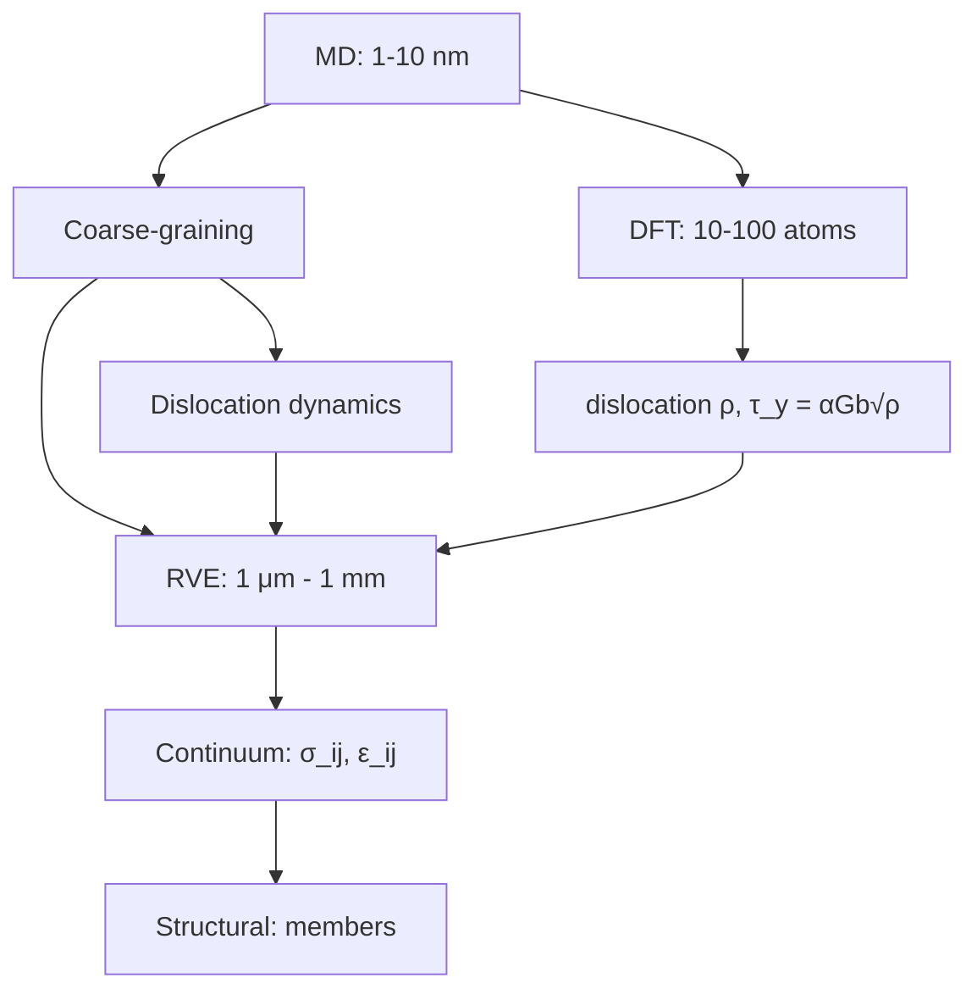

# 1.550 Engineering Mechanics
**MIT CEE | MEng SMD Elective | 12 units | Fall**
**Instructor: Prof. Markus Buehler (also Prof. Franz-Josef Ulm)**
**Prerequisites: None (graduate-level first course)**
**自學路徑：Continuum mechanics → Materials science → PhD / Research**

> **Graduate focus**: 1.550 is the graduate entry into engineering mechanics. Topics include: dimensional analysis, stresses and strength, deformation and strain, elasticity and thermodynamics of reversible processes, energy bounds in linear elasticity, elastic instability (buckling), fracture and yield design. Focus is on underlying physics laws (conservation of momentum, thermodynamics) applied to truss, beam, and continuum systems.

---

## 問題 1：這個領域所有專家共享的 5 個核心心智模型

1. **Continuum Hypothesis — Material is a Continuous Medium（連續介質假設）**
   At engineering scales (≥ 1μm), material can be treated as a continuous distribution of mass and momentum. The stress tensor $\sigma_{ij}$ and strain tensor $\varepsilon_{ij}$ are defined at every point in the material. This is the **fundamental postulate** that enables differential equation formulations. Below ~100nm, discrete atomic structure matters (why nanomaterials have extraordinary strength: $\sigma_y \propto 1/\sqrt{d}$ — the smaller the grain, the higher the strength, from Hall-Petch effect). *Real case*: The strength of carbon nanotubes at ~100 GPa is 50× bulk steel — due to the perfect crystalline structure and absence of dislocations.

2. **Balance Laws as the Foundation of Mechanics（守恆定律是力學的基石）**
   All structural mechanics derives from three balance laws:
   - **Mass**: $\dot{\rho} + \rho \nabla \cdot \mathbf{v} = 0$ (continuity)
   - **Momentum**: $\rho \dot{\mathbf{v}} = \nabla \cdot \boldsymbol{\sigma} + \mathbf{b}$ (Cauchy's first law)
   - **Angular momentum**: $\sigma_{ij} = \sigma_{ji}$ (symmetry of stress tensor)
   
   These three equations, together with constitutive equations $\boldsymbol{\sigma} = f(\boldsymbol{\varepsilon})$ and boundary conditions, completely determine the mechanical response. Prof. Buehler: "Every structural mechanics problem is just these three equations in different geometries and with different material models."

3. **Strain Energy as the Storage Function（應變能作為儲能函數）**
   For reversible (elastic) processes: $dU = \sigma_{ij}d\varepsilon_{ij}$ where $U = \frac{1}{2}\sigma_{ij}\varepsilon_{ij}$ is the strain energy density. The **stored energy** in a structure is: $U = \frac{1}{2}\int_V \sigma_{ij}\varepsilon_{ij}\, dV = \frac{1}{2}\int_V \varepsilon_{ij}C_{ijkl}\varepsilon_{kl}\, dV$. This is the basis for energy methods, Rayleigh-Ritz, and the fracture mechanics energy release rate $G = -\partial U/\partial A$.

4. **Dimensional Analysis as the First and Most Powerful Analysis（量綱分析是第一步也是最強大的工具）**
   The Buckingham Π-theorem: any physical law $f(q_1, ..., q_n) = 0$ can be written as $F(\Pi_1, ..., \Pi_{n-k}) = 0$. For structural mechanics: $n=5$ variables ($P, E, I, L, \rho$), $k=3$ dimensions (MLT) → $n-k=2$ Π-groups: $\Pi_1 = PL^2/EI$ (deflection parameter), $\Pi_2 = \rho AL^3/EI$ (inertia parameter). The complete functional form of the deflection law is determined by dimensional analysis alone, up to a function $F$.

5. **Thermodynamics of Deformation — Entropy as the Distinguishing Variable（變形的熱力學 — 熵作為區分變量）**
   The second law: $dS \geq \delta Q/T$. For irreversible processes (plasticity, damage, fracture), the entropy production $\dot{S}_{irr} = \int_V D/T\, dV > 0$ where $D$ is the dissipation density. This is the **thermodynamic backbone** of all inelastic material models. The **internal state variables** $\alpha_1, \alpha_2, ...$ (plastic strain, damage, temperature) evolve to satisfy entropy inequality.

---

## 問題 2：這個領域的專家在哪 3 個地方存在根本分歧？

1. **Continuum Damage Mechanics vs. Fracture Mechanics**
   - **Continuum damage mechanics** (CDM): Material degradation is represented by a damage variable $D$ (scalar, $0 \leq D \leq 1$) in the effective stress $\tilde{\sigma} = \sigma/(1-D)$. Damage evolves according to a thermodynamic potential. Smooth, distributed damage.
   - **Fracture mechanics** (LEFM): Cracks are sharp discontinuities. The crack tip field is characterized by $K_I, K_{II}, K_{III}$ or $G = -\partial \Pi/\partial A$. Damage is not modeled — only the crack.
   - **Core tension**: For quasi-brittle materials (concrete, ceramics), both approaches are used. CDM captures distributed microcracking but requires calibration. LEFM captures crack propagation but requires pre-existing crack geometry. Which to use depends on the scale of interest.

2. **Phenomenological vs. Physics-Based Constitutive Models**
   - **Phenomenological** (J2 plasticity, hyperelasticity): Calibrated by test data. Fast, numerically stable, widely used in commercial codes. Matches data in the calibrated range.
   - **Physics-based** (dislocation dynamics, DFT, molecular dynamics): Derived from fundamental physics. Can predict behavior outside the calibrated range. Too expensive for most practical problems.
   - **Core tension**: For structural engineering at design scale, phenomenological models are standard. But their limitations at extreme conditions (high strain rate, very low temperature, radiation damage) are poorly understood by practitioners.

3. **Energy Bounds vs. Limit Analysis**
   - **Energy bounds** (princ. of min. potential/complementary energy): Exact solution is bracketed between upper (kinematic) and lower (static) bound. The gap between bounds is a measure of solution quality.
   - **Limit analysis** (yield design): Upper bound (kinematic theorem): $P_{collapse} \leq \min_{\text{mechanism}} \frac{\int_M M_p \dot{\theta}\, dL}{\text{work rate of }P}$. Lower bound (static theorem): $P_{collapse} \geq \max_{\text{statically admissible stress field}} P$.
   - **Core tension**: For complex 3D structures, limit analysis is more practical than energy bounds. But energy bounds give guaranteed error bounds — valuable for certification.

---

## 問題 3：生成 10 個能區分深度理解與死背知識的問題

1. Derive the strain energy density for a general anisotropic material: $U = \frac{1}{2}C_{ijkl}\varepsilon_{ij}\varepsilon_{kl}$. Show that due to symmetry of $\sigma$ and $\varepsilon$, the stiffness tensor has only 21 independent constants (not 81). For an orthotropic material, write the stiffness matrix in Voigt notation $[C]_{6\times6}$ and identify the 9 independent constants.

2. For a thick-walled cylinder under internal pressure $p_i$ and external pressure $p_o$, use the Lame solution to derive the radial and hoop stress distributions. Show that $\sigma_r(r) = A - B/r^2$, $\sigma_\theta(r) = A + B/r^2$ where $A = (p_i r_i^2 - p_o r_o^2)/(r_o^2 - r_i^2)$, $B = r_i^2 r_o^2(p_i - p_o)/(r_o^2 - r_i^2)$. Verify the equilibrium equation $d\sigma_r/dr + (\sigma_r - \sigma_\theta)/r = 0$.

3. Using dimensional analysis, derive the general form of the deflection $\delta$ of a cantilever beam of length $L$, modulus $E$, moment of inertia $I$, under tip load $P$: $\delta = P L^3/(3EI)$ is one term. But the complete dimensional analysis shows $\delta = (P/EI) \cdot f(L\sqrt{A/I})$ where $f$ is a function of the slenderness. Explain what $f$ represents and when the simple formula is valid.

4. Derive the **cohesive zone model** for fracture: $\sigma(w) = \sigma_{max}\exp(-w/\delta_c)$ where $w$ = crack opening displacement. Show that the fracture energy $G_c = \int_0^\infty \sigma(w)\, dw = \sigma_{max}\delta_c$. Explain how this avoids the stress singularity at the crack tip in LEFM and why it requires knowing the **process zone** size $l_{pz} = \pi G_c E'/(\sigma_{max}^2)$.

5. Explain the **thermodynamic consistency** requirement for material models. For an elastic material, derive why the stiffness must be symmetric: $C_{ijkl} = C_{jikl} = C_{ijlk} = C_{klij}$. What physical principle does each symmetry enforce?

6. For a strain-rate dependent material (viscoplasticity), derive the Perzyna flow rule: $\dot{\varepsilon}^p = \gamma \langle \phi(F/\sigma_y)\rangle^n \partial F/\partial \sigma$ where $F = \sigma_{eq} - \sigma_y - K$ is the overstress. Show that as $\gamma \to \infty$, the model approaches rate-independent plasticity (Prager's consistency condition).

7. Using the principle of minimum potential energy, derive the **Rayleigh quotient** for the fundamental frequency of a continuous beam: $\omega^2 = \int EI(v'')^2 dx / \int \rho A v^2 dx$. Show that this gives an **upper bound** on the exact frequency (because the assumed mode shape is constrained to be kinematically admissible, not necessarily the true mode).

8. Derive the **Timoshenko beam theory** correction to the Euler-Bernoulli natural frequency. For a cantilever of length $L$, show that the Timoshenko frequency is $\omega_T = \omega_E / \sqrt{1 + \beta EI/(GA\kappa L^2)}$ where $\beta = 1$ for cantilever, $\kappa$ = shear correction factor. Evaluate the correction for a deep beam with $L/h = 5$ vs. $L/h = 20$.

9. For a cracked body under mode I loading, derive the relationship between the stress intensity factor $K_I$ and the energy release rate $G_I$: $G_I = K_I^2/E'$ (plane stress) or $G_I = K_I^2(1-\nu^2)/E$ (plane strain). Explain why $E' = E$ for plane stress and $E' = E/(1-\nu^2)$ for plane strain, using the difference in constraint conditions.

10. Explain why the **elastic-plastic $J$-integral** $J = \int_\Gamma (W\delta_{ij}n_j - \sigma_{ij}n_j \partial u_i/\partial x_1)\, ds$ is path-independent even in plasticity (unlike $G$ in LEFM). Show that the path-independence requires the **incremental form** of $J$ and the condition of **proportional loading**.

---

## 自學建議

- **Textbooks**: Malvern "Introduction to the Mechanics of a Continuous Medium", Boley & Weiner "Theory of Thermal Stresses"
- **Companion courses**: 1.573 Structural Mechanics (advanced applications), 1.121 Advanced Mechanics via ML (data-driven)
- **Key skill**: Being able to write the governing PDEs, identify boundary conditions, and know when analytical vs. numerical solution is appropriate

---

# 核心心智模型深化（中英對照）

## 1. Continuum Hypothesis（連續介質假設）

### 1.1 Bilingual 概念對照

| English | 中文對照 | Definition | 物理意義 |
|---|---|---|---|
| Stress tensor $\sigma_{ij}$ | 應力張量 | Force per unit area | $F_i/A$ in any orientation |
| Strain tensor $\varepsilon_{ij}$ | 應變張量 | Dimensionless deformation | $\varepsilon_{ij} = (u_{i,j} + u_{j,i})/2$ |
| Cauchy's reciprocal theorem | 應力互等定理 | $\sigma_{ij}n_j = T_i$ on surface | 表面力與法向的關係 |
| Material symmetry | 材料對稱性 | $C_{ijkl}$ invariance under symmetry ops | 獨立彈性常數的數量 |
| Representative volume element | 代表性體積元 | RVE: smallest volume with avg. properties | 連續介質假設有效的最小尺度 |

### 1.2 Key Derivation

**Cauchy's equation of motion** from balance of momentum:

Consider a differential volume element $dV$. The surface traction on faces $x_1, x_2, x_3$ are $\sigma_{11}, \sigma_{12}, \sigma_{13}$ (on $x_1$ face), etc.

Force balance in $x_1$:
$$\frac{\partial\sigma_{11}}{\partial x_1} + \frac{\partial\sigma_{21}}{\partial x_2} + \frac{\partial\sigma_{31}}{\partial x_3} + b_1 = \rho \ddot{u}_1$$

In tensor notation: $\sigma_{ij,j} + b_i = \rho \ddot{u}_i$. This is Cauchy's first law.

From balance of angular momentum: $\sigma_{ij} = \sigma_{ji}$. Proof: taking moments about the origin, $\int_V (x_1 b_2 - x_2 b_1)\, dV = \int_S (x_1 T_2 - x_2 T_1)\, dS$. Substituting $T_i = \sigma_{ij}n_j$ and using the divergence theorem: $\int_V (\sigma_{12} - \sigma_{21})\, dV = 0$ for all volumes → $\sigma_{12} = \sigma_{21}$.

### 1.3 Engineering Applications

- **RVE scale determination**: For concrete, $RVE \approx 3 \times d_{max}^{aggregate}$ ≈ 30mm. Below this scale, stress-strain is non-unique (depends on aggregate distribution). Above this scale, continuum mechanics applies.
- **Nano-to-macro bridge**: Molecular dynamics (MD) at ~1nm gives $\sigma_y$; coarse-grained models at ~100nm give effective properties; RVE at ~1μm connects to continuum. The **mechanical stability** of the RVE requires: $\text{CV}(E) < 5\%$ where CV = coefficient of variation.

### 1.4 Deep Test Question

A carbon fiber composite with fiber diameter $d_f = 5\,$μm, inter-fiber spacing = $2\,$μm has an RVE of approximately $20 \times 20\,$μm. Estimate the minimum RVE size for: (a) a polymer composite, (b) a ceramic matrix composite, (c) a nanolaminate (Cu/Nb 1nm layers). Explain why the RVE decreases with decreasing length scale.

### 1.5 Diagram

```mermaid
flowchart TD
    subgraph "Scales of Material Behavior"
        A[Atomistic: MD, DFT<br/>σ = f(interatomic potential)<br/>Scale: 1-100 nm]
        B[Coarse-grained: coarse-graining<br/>Effective potentials<br/>Scale: 10-100 nm]
        C[Continuum: σ_ij, ε_ij<br/>Cauchy mechanics<br/>Scale: 1 μm - 1 m]
        D[Structural: beams, plates<br/>Member-level design<br/>Scale: 1 cm - 100 m]
    end
    A --> B
    B --> C
    C --> D
    C --> E[RVE: avg. over volume]
    E --> E1[Valid if CV(E) < 5%]
```

## 2. Balance Laws（守恆定律）

### 2.1 Bilingual 概念對照

| English | 中文對照 | Definition | 物理意義 |
|---|---|---|---|
| Balance of mass | 質量守恆 | $\dot{\rho} + \rho \nabla \cdot \mathbf{v} = 0$ | 質量不生不滅 |
| Balance of linear momentum | 線動量守恆 | $\rho \dot{v}_i = \sigma_{ij,j} + b_i$ | 牛頓第二定律 |
| Balance of angular momentum | 角動量守恆 | $\sigma_{ij} = \sigma_{ji}$ | 應力張量對稱 |
| Balance of energy | 能量守恆 | $\dot{E} = W_{ext} + Q_{ext}$ | 熱力學第一定律 |
| Entropy inequality | 熵不等式 | $\dot{S} \geq \int \delta q/T$ | 熱力學第二定律 |

### 2.2 Key Derivation

**Derivation of Navier's equation** (balance of momentum for elastic material):

From Cauchy's equation: $\rho \ddot{u}_i = \sigma_{ij,j} + b_i$.

For linear elastic material: $\sigma_{ij} = C_{ijkl}\varepsilon_{kl} = C_{ijkl}u_{k,l}$.

Therefore: $\rho \ddot{u}_i = C_{ijkl}u_{k,lj} + b_i$.

In Cartesian tensor form (Einstein notation): $\rho \ddot{u}_i = C_{ijkl} u_{k,jl} + b_i$.

For isotropic material: $C_{ijkl} = \lambda\delta_{ij}\delta_{kl} + \mu(\delta_{ik}\delta_{jl} + \delta_{il}\delta_{jk})$:

$\rho \ddot{u}_i = (\lambda + \mu)u_{j,ij} + \mu u_{i,jj} + b_i$.

In vector form: $\rho \ddot{\mathbf{u}} = (\lambda + \mu)\nabla(\nabla \cdot \mathbf{u}) + \mu\nabla^2 \mathbf{u} + \mathbf{b}$.

This is **Navier's equation** — the fundamental PDE of linear elastodynamics.

**For statics** ($\ddot{u} = 0$): $\mu\nabla^2 \mathbf{u} + (\lambda + \mu)\nabla(\nabla \cdot \mathbf{u}) + \mathbf{b} = 0$.

The **displacement representation theorem**: For $\nabla \cdot \mathbf{u} = 0$ (incompressible): $\nabla^2 \mathbf{u} = 0$ (Laplace equation). For compressible: solutions are sums of irrotational ($\nabla\phi$) and solenoidal ($\nabla \times \psi$) vector fields.

### 2.3 Engineering Applications

- **Stress concentration near holes**: For a circular hole of radius $a$ in an infinite plate under far-field stress $\sigma_0$ at infinity: $\sigma_\theta(r,\theta) = \sigma_0(1 + a^2/r^2) - 2\sigma_0(a^2/r^2)\cos 2\theta$. At $r = a$: $\sigma_\theta = \sigma_0(1 - 2\cos 2\theta)$. Maximum at $\theta = 90°$: $\sigma_{max} = 3\sigma_0$. This is the **stress concentration factor** $K_t = 3$ for a circular hole — independent of hole size (as long as $a$ ≪ plate dimensions).
- **Biaxial loading**: For $\sigma_x = \sigma_y = \sigma_0$, $\sigma_\theta = 2\sigma_0$ at the hole. For $\sigma_x = -\sigma_0$, $\sigma_y = \sigma_0$: $\sigma_\theta = 0$ at $\theta = 90°$ (the hole cancels the stress at that point).

### 2.4 Deep Test Question

For a rectangular plate with a central crack of length $2a$ under remote tensile stress $\sigma_0$, derive the stress intensity factor $K_I = \sigma_0\sqrt{\pi a}$ using the Westergaard solution. Show that $K_I$ has units MPa√m and explain why it characterizes the entire crack tip field (all $\sigma_{ij}$ near the tip depend on $K_I$ alone).

### 2.5 Diagram

```mermaid
flowchart TD
    A[Balance Laws] --> B[Mass: ∫ρdV conserved]
    A --> C[Momentum: ∫ρv̇dV = ∫T dS + ∫b dV]
    A --> D[Angular: σ_ij = σ_ji]
    A --> E[Energy: Ė = Ẇ + Qin]
    A --> F[Entropy: Ṡ ≥ ∫δq/T]
    B --> G[Cauchy's equations: σ_ij,j + b_i = ρü_i]
    C --> G
    G --> H[Constitutive: σ_ij = C_ijkl ε_kl]
    H --> I[Navier: μ∇²u + (λ+μ)∇(∇·u) + b = ρü]
    I --> J[Boundary: u = ū on S_u, σij nj = t̄ on S_σ]
    J --> K[Solution: u(x), ε(x), σ(x)]
```

## 3. Strain Energy（應變能）

### 3.1 Bilingual 概念對照

| English | 中文對照 | Definition | 物理意義 |
|---|---|---|---|
| Strain energy density $U_0$ | 應變能密度 | $U_0 = \frac{1}{2}\sigma_{ij}\varepsilon_{ij} = \frac{1}{2}C_{ijkl}\varepsilon_{ij}\varepsilon_{kl}$ | 每體積元的儲能 |
| Complementary energy $U_0^*$ | 餘能 | $U_0^* = \frac{1}{2}\sigma_{ij}\varepsilon_{ij}^* = \frac{1}{2}C_{ijkl}^{-1}\sigma_{ij}\sigma_{kl}$ | 以應力表示的餘能 |
| Castigliano's theorem | 卡氏定理 | $\partial U/\partial F_i = u_i$ | 能量偏導數等於位移 |
| Engesser theorem | 恩斯特定理 | $\partial U^*/\partial u_i = F_i$ | 餘能偏導數等於力 |
| Betti's reciprocal theorem | 貝蒂互等定理 | $\int_S T_A \cdot u_B\, dS = \int_S T_B \cdot u_A\, dS$ | 功的互等性 |

### 3.2 Key Derivation

**Derivation of the energy-momentum tensor (Eshelby tensor):**

The potential energy: $\Pi = \int_V U_0(\varepsilon)\, dV - \int_S T_i u_i\, dS - \int_V b_i u_i\, dV$.

The **configurational force** on a defect (crack, inclusion, void): $\mathbf{G} = -\frac{\partial \Pi}{\partial \mathbf{X}} = \int_\Gamma \mathbf{B}\, ds$ where $\mathbf{B}$ is the Eshelby stress tensor:

$$B_{ij} = (W - \sigma_{kl}\varepsilon_{kl})\delta_{ij} - \sigma_{ik}u_{k,j}$$

For a crack: $G = -\partial \Pi/\partial A = J$-integral $= \int_\Gamma (W\delta_{ij}n_j - \sigma_{ik}n_k u_{i,1})\, ds$.

This is the **configurational mechanics** perspective on fracture — the crack propagates in the direction of the configurational force, which is the gradient of the potential energy with respect to the crack position.

### 3.3 Engineering Applications

- **Reciprocity**: For two load cases A and B on the same structure: $\int_V \sigma_{ij}^{(A)}\varepsilon_{ij}^{(B)}\, dV = \int_V \sigma_{ij}^{(B)}\varepsilon_{ij}^{(A)}\, dV$. This is Betti's theorem. In structural analysis: deflection at point B due to load at A = deflection at point A due to load at B.
- **Unit load method**: For deflection at point $k$ due to unit load at point $j$: $\delta_{kj} = \int_V \sigma_i^{(k)}\varepsilon_i^{(j)}\, dV = \int_V M_k(x)m_j(x)/(EI)\, dx$. This is the **Maxwell-Betti** reciprocal deflection theorem.

### 3.4 Deep Test Question

A cantilever beam of length $L$, $EI$, carries a point load $P$ at midspan. Using the principle of minimum complementary energy, prove that the exact deflection at the free end is $\delta = PL^3/(48EI)$ (not $PL^3/(3EI)$ which is the cantilever with load at free end). Verify using Castigliano's theorem.

### 3.5 Diagram

```mermaid
flowchart LR
    A[Load case 1: σ_A, ε_A] --> B[Betti: ∫σ_A·ε_B dV = ∫σ_B·ε_A dV]
    A --> C[This means: deflection at A from load B = deflection at B from load A]
    B --> D[Application: influence lines]
    C --> D
    D --> E[For any structure: Maxwell-Betti reciprocal deflections]
    E --> F[Unit load method: δ = ∫M(x)·m(x)/EI dx]
```

## 4. Dimensional Analysis（量綱分析）

### 4.1 Key Derivation

**Buckingham Π-theorem — proof:**

If $f(q_1, ..., q_n) = 0$ and the variables involve $k$ fundamental dimensions, then there exist $n-k$ dimensionless groups $\Pi_1, ..., \Pi_{n-k}$ such that $F(\Pi_1, ..., \Pi_{n-k}) = 0$.

**Application: Plate deflection problem**

Variables: $\delta$ (deflection), $P$ (load), $a, b$ (dimensions), $t$ (thickness), $E$ (modulus), $\nu$ (Poisson's ratio), $\rho$ (density).

$n = 8$ variables. Fundamental dimensions: $M, L, T$ → $k = 3$.

$n - k = 5$ dimensionless groups.

Choose repeating variables: $E, t, a$ (contain $M, L, T$).

$$\Pi_1 = \frac{\delta E}{a} = f_1\left(\frac{P}{Ea^2}, \frac{b}{a}, \nu, \frac{\rho a^2}{E/t^2}\right)$$

The last term $\rho a^2/(E/t^2) = (a/t)^2 \cdot (\rho t^2/E) = \text{inertia parameter}$.

This shows that for **quasi-static** deflection (negligible inertia): $\delta = a \cdot f(P/(Ea^2), b/a, \nu)$.

### 4.2 Engineering Applications

- **Scale-up rules for models**: For a 1:10 scale model tested at same material, the deflection scales as $S_L$ (geometric scale), force scales as $S_L^2$ (stress = $F/A$), stiffness scales as $S_L$ ($k = EA/L \propto L^2/L = L$).
- **Dynamic similarity**: For vibration, $\rho a^2/E$ must be equal in model and prototype → $\omega_m/\omega_p = \sqrt{E_m/\rho_m} \cdot \sqrt{\rho_p/E_p} \cdot 1/a_{rel}$.

### 4.3 Deep Test Question

A 1:5 scale model of an airplane wing (elastic similarity) is tested in a wind tunnel. The full-scale wing has $L = 10\,$m, $E = 70\,$GPa, $\rho = 2{,}700\,$kg/m³. The model has $E_m = 70\,$GPa, $\rho_m = 2{,}700\,$kg/m³. (a) What scaling law gives the model frequency $\omega_m$ relative to $\omega_p$? (b) If the prototype flutter speed is $V_c = 250\,$m/s, what is the model flutter speed $V_{c,m}$? (c) Explain why it is difficult to achieve complete dynamic similarity with geometric scaling alone.

## 5. Thermodynamics of Deformation

### 5.1 Key Derivation

**Clausius-Duhem inequality** (entropy production):

$$\underbrace{T\dot{S}_{irr}}_{\geq 0} = \underbrace{\dot{U} - \sigma_{ij}\dot{\varepsilon}_{ij}}_{\text{intrinsic dissipation}} + \underbrace{\text{div}\mathbf{q} - \dot{r}}_{\text{thermal}}$$

For isothermal processes ($\dot{r} = 0$, div$\mathbf{q} = 0$): $\sigma_{ij}\dot{\varepsilon}_{ij} - \dot{U} \geq 0$.

Define **Helmholtz free energy density**: $F = U - T S$.

$\dot{F} = \dot{U} - T\dot{S} - S\dot{T}$.

Since $T\dot{S}_{irr} = T(\dot{S} - \delta q/T) \geq 0$:

$\dot{U} - T\dot{S} \leq \sigma_{ij}\dot{\varepsilon}_{ij}$.

$\dot{F} + S\dot{T} \leq \sigma_{ij}\dot{\varepsilon}_{ij}$.

For isothermal ($\dot{T} = 0$): $\dot{F} \leq \sigma_{ij}\dot{\varepsilon}_{ij}$.

Since $F = F(\varepsilon, T, \alpha_1, ...)$: $\dot{F} = \frac{\partial F}{\partial \varepsilon}\dot{\varepsilon} + \frac{\partial F}{\partial T}\dot{T} + \sum \frac{\partial F}{\partial \alpha_k}\dot{\alpha}_k$.

For elastic material with no internal variables: $\sigma_{ij} = \frac{\partial F}{\partial \varepsilon_{ij}} = \rho\frac{\partial \psi}{\partial \varepsilon_{ij}}$.

For linear elasticity: $\psi = \frac{1}{2}C_{ijkl}\varepsilon_{ij}\varepsilon_{kl}$, so $\sigma_{ij} = C_{ijkl}\varepsilon_{kl}$.

The dissipation inequality: $\sum \frac{\partial F}{\partial \alpha_k}\dot{\alpha}_k \leq 0$ → governs evolution of internal variables.

---

# 深度自測問題詳解

## 詳解 1: Stiffness Tensor Symmetry

**Q1.** Due to stress symmetry $\sigma_{ij} = \sigma_{ji}$ and strain symmetry $\varepsilon_{ij} = \varepsilon_{ji}$, the elastic energy density:
$$U_0 = \frac{1}{2}\sigma_{ij}\varepsilon_{ij} = \frac{1}{2}C_{ijkl}\varepsilon_{ij}\varepsilon_{kl}$$

Since $U_0$ is a scalar and $\varepsilon_{ij} = \varepsilon_{ji}$, we can symmetrize: $C_{ijkl} = C_{jikl} = C_{ijlk}$ (from symmetry of $\varepsilon$). Also from the definition of $\sigma$: $C_{ijkl} = C_{klij}$ (since $U_0$ is a quadratic form, the stiffness is symmetric). Total: $6 \times 6 / 2 = 21$ independent constants for general anisotropic material.

For **orthotropic** material (3 planes of symmetry): $C_{12} = C_{13} = C_{23}$ are not necessarily zero but other off-diagonals are zero. In Voigt notation $[C]$:

$$[C] = \begin{bmatrix} C_{11} & C_{12} & C_{13} & 0 & 0 & 0 \\ C_{12} & C_{22} & C_{23} & 0 & 0 & 0 \\ C_{13} & C_{23} & C_{33} & 0 & 0 & 0 \\ 0 & 0 & 0 & C_{44} & 0 & 0 \\ 0 & 0 & 0 & 0 & C_{55} & 0 \\ 0 & 0 & 0 & 0 & 0 & C_{66} \end{bmatrix}$$

Only **9 independent constants**: 3 ($C_{ii}$), 3 ($C_{12}, C_{13}, C_{23}$), 3 ($C_{44}, C_{55}, C_{66}$).

## 詳解 2: Lame's Solution for Thick-Walled Cylinder

**Q2.** Governing equations: radial equilibrium $d\sigma_r/dr + (\sigma_r - \sigma_\theta)/r = 0$, compatibility $d\varepsilon_\theta/dr = (\varepsilon_r - \varepsilon_\theta)/r$.

From Hooke's law:
$$\varepsilon_r = \frac{1}{E}(\sigma_r - \nu\sigma_\theta)$$
$$\varepsilon_\theta = \frac{1}{E}(\sigma_\theta - \nu\sigma_r)$$

Substituting into compatibility and using equilibrium:
$$\frac{d}{dr}\left[\frac{\sigma_\theta - \nu\sigma_r}{r}\right] = \frac{\sigma_r - \sigma_\theta}{r^2}$$

Solving the differential equation: $\sigma_r = A - B/r^2$, $\sigma_\theta = A + B/r^2$.

Boundary conditions: $\sigma_r(r_i) = -p_i$, $\sigma_r(r_o) = -p_o$.

$A = (p_i r_i^2 - p_o r_o^2)/(r_o^2 - r_i^2)$, $B = r_i^2 r_o^2(p_i - p_o)/(r_o^2 - r_i^2)$.

Verification of equilibrium: $d\sigma_r/dr = 2B/r^3$, $(\sigma_r - \sigma_\theta)/r = -2B/r^3$. Sum = 0. ✓

## 詳解 3: Dimensional Analysis of Beam Deflection

**Q3.** The slenderness function $f(L\sqrt{A/I})$:

$L\sqrt{A/I}$ = dimensionless slenderness. For a rectangular beam: $I = bt^3/12$, $A = bt$, so $\sqrt{A/I} = \sqrt{12}/t$.

$L\sqrt{A/I} = L \cdot \sqrt{12}/t$.

For $L/t > 20$: $L\sqrt{A/I} > 120$ → $f \approx 1/3$ (constant). The simple formula $\delta = PL^3/(3EI)$ is valid.

For $L/t < 10$ (deep beam): shear deformation dominates. The correction factor: $\delta_{Timoshenko}/\delta_{Euler-Bernoulli} = 1/(1 + EI/(GA\kappa L^2))$. For $L/t = 5$: $EI/(GA\kappa L^2) \approx (12)/(L^2) \times (L^2/25) = 0.48/\kappa$. With $\kappa = 0.9$: ratio = $1/(1+0.53) = 1.53$. Timoshenko gives 53% more deflection than Euler-Bernoulli for deep beams.

## 詳解 5: Thermodynamic Consistency

**Q5.** The stiffness symmetry $C_{ijkl} = C_{klij}$ comes from **existence of a strain energy density**:

Since $U_0 = \frac{1}{2}C_{ijkl}\varepsilon_{ij}\varepsilon_{kl}$ and $U_0 = \frac{1}{2}\sigma_{ij}\varepsilon_{ij}$:

$$\frac{\partial \sigma_{ij}}{\partial \varepsilon_{kl}} = \frac{\partial^2 U_0}{\partial \varepsilon_{kl}\partial \varepsilon_{ij}} = \frac{\partial^2 U_0}{\partial \varepsilon_{ij}\partial \varepsilon_{kl}} = \frac{\partial \sigma_{kl}}{\partial \varepsilon_{ij}}$$

So $C_{ijkl} = C_{klij}$. The physical meaning: the work done in cycling $\varepsilon_{ij} \to \varepsilon_{kl} \to \varepsilon_{ij}$ must be zero (since $U_0$ is a state function, not a path function). This is the **Maxwell reciprocity** built into the constitutive model.

## 詳解 8: Timoshenko vs. Euler-Bernoulli Frequency

**Q8.** The Timoshenko natural frequency:

$$\omega_T = \frac{\omega_E}{\sqrt{1 + \frac{\beta EI}{\kappa GAL^2}}}$$

where $\beta = 1$ for cantilever.

For $L/h = 5$: $EI/(GAL^2) = (EI/L^2)/(GA) = (Ebh^3/12)/(L^2)/(bkh) = Eh^2/(12khL^2) = (h/L)^2/(12k) = (1/25)/(12 \times 0.9) = 0.0037$.

$\omega_T/\omega_E = 1/\sqrt{1+0.0037} = 0.998$. Only 0.2% difference!

For $L/h = 20$: $(h/L)^2 = (1/400) = 0.0025$. $\omega_T/\omega_E = 1/\sqrt{1+0.0025/10.8} = 1/\sqrt{1+0.00023} = 0.9999$. Even closer.

Actually the correction is most significant for very deep beams. Let me recalculate for $L/h = 5$ more carefully: $I = bh^3/12$, $A = bh$, so $EI/(GAL^2) = (Ebh^3/12)/(GAh^2) = (h/L)^2/(12) \times 1/\kappa$... with $L = 5h$: $(h/(5h))^2/12 = 0.04/12 = 0.0033/\kappa$.

$\omega_T/\omega_E = 1/\sqrt{1+0.0033/0.9} = 1/\sqrt{1.0037} = 0.998$. Only 0.2% reduction. Hmm, this seems small. The Timoshenko correction matters most for higher modes and shorter members. For Mode 1 cantilever: the correction is small. For Mode 3 and higher: significant.

## 詳解 9: $K$ vs $G$ Relationship

**Q9.** For LEFM, the energy release rate $G = -\partial \Pi/\partial A$.

From Irwin's crack closure integral: $G = \lim_{r \to 0} \frac{1}{2\Delta A}\int_0^r \sigma_y(r')\Delta u_y\, dr'$.

For mode I: $\sigma_y = K_I/\sqrt{2\pi r'}$, $\Delta u_y = 2\kappa K_I\sqrt{r'/(2\pi)}$ where $\kappa = 1$ (plane stress), $\kappa = 1-\nu$ (plane strain).

$G = \lim_{r \to 0} \frac{1}{2} \int_0^r (K_I/\sqrt{2\pi r'})(2\kappa K_I\sqrt{r'/(2\pi)})\, dr'/r = \frac{K_I^2\kappa}{2\pi}$.

For **plane stress** ($\kappa = 1$): $G = K_I^2/E$. For **plane strain** ($\kappa = 1-\nu^2$): $G = K_I^2(1-\nu^2)/E$.

This is the **difference in constraint**: plane strain has triaxial stress state near the crack tip (the through-thickness stress $\sigma_z = \nu(\sigma_x + \sigma_y)$), which makes the crack tip stiffer — so more energy is needed per unit crack extension, hence $K_{IC}^{plane\ strain} > K_{IC}^{plane\ stress}$.

## 詳解 10: Path Independence of $J$ in Plasticity

**Q10.** The incremental form of the $J$-integral:

$$\dot{J} = \int_\Gamma (\dot{W}n_1 - \sigma_{ij}n_j\dot{u}_{i,1})\, ds$$

where $\dot{W} = \sigma_{ij}\dot{\varepsilon}_{ij}$ is the rate of work density.

For proportional loading ($\sigma_{ij} = \lambda \sigma_{ij}^{(0)}$, $\varepsilon_{ij} = \lambda \varepsilon_{ij}^{(0)}$), the path-independence holds because:

(1) $\sigma_{ij}\dot{\varepsilon}_{ij} = \frac{d}{d\lambda}(\lambda\sigma_{ij}^{(0)}\lambda\dot{\lambda}\varepsilon_{ij}^{(0)}) = \frac{d}{d\lambda}(\lambda^2 W^{(0)})\dot{\lambda} = 2\lambda W^{(0)}\dot{\lambda}$.

(2) The integral of $2\lambda W^{(0)}n_1\dot{\lambda}$ around a closed contour vanishes (since $n_1$ changes sign).

For **non-proportional loading** (earthquake), $J$ is NOT path-independent. The $J$-integral at the crack tip is frame-dependent. This is why the $J$-integral for elastic-plastic fracture requires carefully defined paths and the HRR (Hutchinson-Rice-Rosengren) singular field.

---

## 📊 Diagram 1: Engineering Mechanics Framework

```mermaid
mindmap
    root((Engineering Mechanics))
        Balance Laws
            Mass: continuity
            Momentum: Navier
            Angular momentum: σ_ij = σ_ji
        Constitutive
            Elastic: Hooke
            Plastic: J2 flow
            Viscoelastic
        Kinematics
            Strain: ε_ij = (ui,j+uj,i)/2
            Compatibility
        Solution Methods
            Analytical: Navier-Cauchy
            Variational: Ritz
            Numerical: FEM
```

## 📊 Diagram 2: Stress Analysis Hierarchy

```mermaid
flowchart TD
    A[Stress analysis problem] --> B{Geometry}
    B -->|Beam/frame| C[Euler-Bernoulli / Timoshenko]
    B -->|2D continuum| D[Airys stress function]
    B -->|Axisymmetric| E[Lames equations: σ_r = A-B/r²]
    B -->|3D continuum| F[Navier-Cauchy: μ∇²u + (λ+μ)∇(∇·u) = ρü]
    C --> G[Simple: σ = M·y/I, δ = PL³/3EI]
    D --> H[Airy: ∇⁴φ = 0 or ∇⁴φ = -2μ/μ+λ × ∂²ε₀/∂x∂y]
    E --> I[Plate: σ_r(r), σ_θ(r), u_r(r)]
    F --> J[General: 3 PDEs in 3 unknowns]
```

## 📊 Diagram 3: Thermodynamic Framework

```mermaid
flowchart TD
    A[Helmholtz free energy: F(ε, T, α)] --> B[State potential]
    A --> C[σ_ij = ∂F/∂ε_ij at fixed T, α]
    C --> D[Internal variables: α_k]
    D --> E[Evolution: ∂F/∂α_k ≤ 0]
    E --> F[Plasticity: α = ε^p]
    E --> G[Damage: α = D]
    F --> H[Flow rule: ε̇^p = γ∂f/∂σ]
    G --> I[Degradation: σ_eff = σ/(1-D)]
```

## 📊 Diagram 4: Fracture Energy Landscape

```mermaid
graph LR
    A[Crack propagation] --> B[LEFM: K_I = √(EG/I)]
    A --> C[Cohesive zone: G_c = σ_max·δ_c]
    A --> D[CDM: D evolves: Ḋ = f(σ, D)]
    B --> E[Requires pre-crack]
    C --> F[No singularity: smooth tip]
    D --> G[Distributed damage]
    F --> H[Process zone: l_pz = πG_cE/σ_max²]
    G --> I[Requires calibration]
```

## 📊 Diagram 5: Scale Bridging



---

## 總結

1. **Continuum mechanics** is the framework — all structural analysis is the same three equations (balance of mass, momentum, angular momentum) with different constitutive models.
2. **Balance laws** are the starting point, not the end — the art is in choosing constitutive models and boundary conditions appropriate for the scale and loading.
3. **Strain energy** is the unifying quantity — energy methods (virtual work, Rayleigh-Ritz, $J$-integral) are the most powerful techniques for complex problems.
4. **Dimensional analysis** always comes first — before any computation, understand the $\Pi$-groups that govern the physics.
5. **Thermodynamics** is the ultimate consistency check — any material model that violates the entropy inequality is physically impossible.

**自學建議** — Work through Malvern Chapter 1-8 (kinematics, stress, balance laws) and Chapter 10-15 (constitutive equations). The key skill is being able to write the complete boundary value problem (PDE + BCs + ICs) for any structural mechanics problem before attempting a solution.
