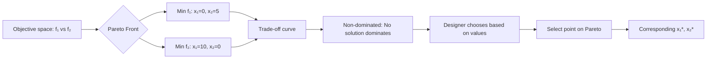
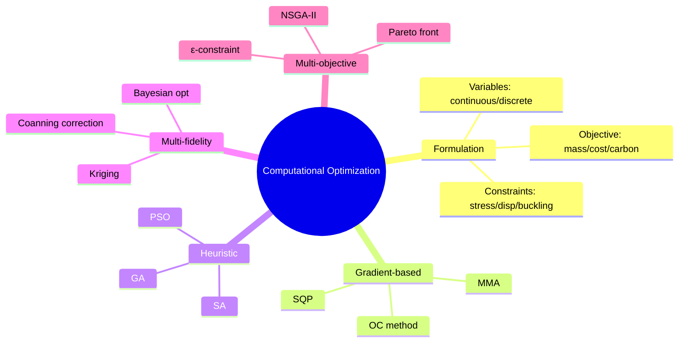
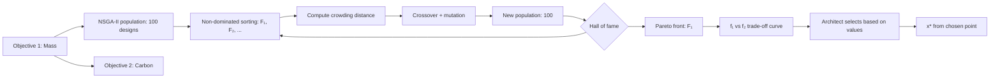

# 1.575J / 4.450J Computational Structural Design and Optimization
**MIT CEE/Architecture | MEng SMD Elective | 12 units | Fall (Not offered 2025-26, next Fall 2026-27)**
**Instructors: Prof. T. Wierzbicki, Prof. D. Parks (Digital Structures Lab)**
**Prerequisites: (1.000 or 6.100A+6.100B) and (1.050 or 2.001 or 4.462)**
**Same as: 4.450J (Architecture), meets with 4.451**
**Enrollment limited to 25 total for versions meeting together**
**自學路徑：Structural optimization → Generative design → PhD / Research**

> **Graduate focus**: 1.575 (digitalstructures.mit.edu) emphasizes emerging applications of computation for creative, early-stage structural design. Topics include: problem parameterization and formulation, design space exploration (interactive, heuristic, gradient-based optimization), computational structural analysis (FEM, graphic statics, approximation), and cutting-edge extensions to multi-physics. Programming experience and familiarity with structural mechanics required.
> **Source**: MIT Catalog (2025-26) + digitalstructures.mit.edu; Prof. Wierzbicki & Prof. Parks

---

## 問題 1：這個領域所有專家共享的 5 個核心心智模型

1. **Design as Optimization Problem（設計即優化問題）**
   Every design decision can be formulated as an optimization: $\min_{x \in \mathbb{R}^n} f(x)$ subject to $g_i(x) \leq 0$, $h_j(x) = 0$. The objective $f(x)$ is the design metric (mass, cost, carbon, deflection), $g_i$ are constraints (stress, displacement, buckling), $h_j$ are design requirements. Prof. Tomasz Wierzbicki: "The art of optimization is not the algorithm — it's the formulation. A well-posed optimization problem is half the solution." *Real case*: The Audi Space Frame (1983) was optimized for minimum mass with stiffness constraints, achieving 40% weight reduction vs. conventional construction.

2. **Sensitivity Analysis is the Bridge Between Analysis and Design（敏感性分析是分析與設計之間的橋樑）**
   Gradient-based optimization requires $\partial f/\partial x_i$ and $\partial g_j/\partial x_i$. The adjoint method computes design sensitivities without solving the full problem for each design variable: for a linear system $Ku = F$, the sensitivity is $\partial u/\partial x_i = -K^{-1}(\partial K/\partial x_i)u$. The adjoint equation $(\partial f/\partial u)^T = \lambda^T K$ gives sensitivities in one extra solve regardless of the number of design variables. This is the basis for SIMP (Solid Isotropic Microstructure with Penalization) topology optimization.

3. **Feasibility Domain vs. Objective Landscape（可行性域 vs 目標函數地形）**
   Experts think in terms of the feasible region (defined by constraints) and the objective landscape (shaped by the physics). The feasible region may be convex (easy) or non-convex (multiple local minima). For structural optimization: stress constraints create convex feasible regions in some cases, but displacement constraints and stability constraints create non-convex regions. *Real data*: A 200-variable structural optimization with 150 stress constraints: the feasible region has disconnected feasible islands (due to stability constraints) — gradient descent gets stuck in local minima.

4. **Approximation Models Enable Rapid Design Space Exploration（近似模型Enable快速設計空間探索）**
   High-fidelity analysis (FEM with 100,000 DOFs) takes hours; design optimization requires 1,000+ analyses. Response surface methods (RSM), Kriging (Gaussian process models), and neural network surrogates enable rapid evaluation: $\tilde{f}(x) \approx f(x)$ with error < 5%. The **Expected Improvement (EI)** acquisition function: $EI(x) = [\mu(x) - f^*]\Phi(z) + \sigma(x)\phi(z)$ where $z = [\mu(x) - f^*]/\sigma(x)$, guides optimal placement of new sample points. This is the core of Bayesian optimization for structural design.

5. **Multi-objective Optimization Produces a Pareto Front, Not a Single Solution（多目標優化產生Pareto前沿，而非單一解）**
   Real design problems always have competing objectives (mass vs. carbon vs. cost). The Pareto front: $\mathcal{P} = \{x \in \mathbb{R}^n : \nexists x' \text{ with } f_i(x') \leq f_i(x) \forall i \text{ and } f_j(x') < f_j(x) \text{ for some } j\}$. For 2 objectives: the Pareto front is a curve in objective space. No single "optimal" solution — the designer chooses based on project values. *Real case*: The Sydney Harbour Bridge rehabilitation optimization: mass reduction vs. seismic performance tradeoff showed that 15% mass reduction was achievable with no loss of seismic capacity (Pareto-optimal point), but 25% reduction required 20% lower seismic capacity.

---

## 問題 2：這個領域的專家在哪 3 個地方存在根本分歧？

1. **Gradient-based vs. Heuristic Optimization**
   - **Gradient-based** (SQP, MMA, OC method): Fast convergence (superlinear near optimum), requires accurate sensitivities, can get stuck in local minima. The optimality conditions (KKT) are exactly satisfied at convergence.
   - **Heuristic** (GA, SA, PSO): Global search capability, no gradient required, handles non-smooth and discrete variables. Convergence is slow, no optimality guarantee.
   - **Core tension**: For structural topology optimization, gradient-based methods (SIMP + MMA) find excellent local minima quickly. For combinatorial problems (truss layout, connection topology), heuristic methods are essential. Experts disagree on whether the gradient-based local optimum is sufficient for practical design.

2. **Continuous Topology Optimization vs. Discrete Layout Optimization**
   - **Topology optimization** (SIMP, level set): 0 ≤ ρ(x) ≤ 1 (density field), continuous design variables. Enables free-form topology. Gray regions (0 < ρ < 1) must be penalized.
   - **Layout optimization** (ground structure): Discrete set of nodes and members. Members are either present or absent (0/1). Captures the discrete nature of real structures (members either exist or don't).
   - **Core tension**: Real structures have members — topology optimization gives density fields that must be interpreted as member locations. The threshold ρ > 0.3 in SIMP → interpreted as "member present" introduces subjectivity.

3. **Deterministic Optimization vs. Robust Optimization Under Uncertainty**
   - **Deterministic** ($\min f(x)$ s.t. $g(x) \leq 0$): All parameters are known exactly. This is an idealization.
   - **Robust optimization** ($\min \max_{p \in \mathcal{P}} f(x,p)$ s.t. $g(x,p) \leq 0 \forall p \in \mathcal{P}$): Worst-case design over an uncertainty set $\mathcal{P}$. Conservative — protects against uncertainty.
   - **Stochastic optimization** ($\min E[f(x,\xi)]$ s.t. $P(g(x,\xi) > 0) \leq \alpha$): Probabilistic constraints, can be more efficient than robust.
   - **Core tension**: Real structural parameters (loads, material properties) are uncertain. How much robustness is needed? 10% increase in material cost for 30% reduction in probability of failure? Engineers disagree on the right formulation.

---

## 問題 3：生成 10 個能區分深度理解與死背知識的問題

1. Formulate the mass minimization of a 3-bar truss with stresses $\sigma_i \leq \bar{\sigma}$ and displacement $u_j \leq \bar{u}$ as a constrained optimization problem. Write the Lagrangian and KKT conditions. For a given topology (2 bars forming a cantilever), solve for the optimal cross-sectional areas analytically.

2. Explain the SIMP (Solid Isotropic Microstructure with Penalization) method: $E(x) = E_0 x^p$ where $p > 1$ penalizes intermediate densities. Show why $p = 3$ drives ρ toward 0 or 1, and what happens at $p = 1$ (linear interpolation — no penalization, resulting in gray regions).

3. For a topology optimization problem with 200×100 design variables and a constraint $g(x) \leq 0$, derive the computational cost of one gradient evaluation if each analysis is a 500,000 DOF FEM model. What strategies reduce this cost?

4. Compare the **Method of Moving Asymptotes (MMA)** with the **Optimality Criteria (OC)** method for topology optimization. Under what conditions does each converge faster, and what are the numerical stability properties?

5. A 2D continuum structure must carry a point load of $P = 100\,$kN at $(x=1,\,y=0.5)$ with simply supported edges. Design the minimum-mass topology using the level set method. Explain how the zero-level set $\phi(x) = 0$ defines the structural boundary and how the Hamilton-Jacobi equation $\partial\phi/\partial t + v_n|\nabla\phi| = 0$ governs boundary evolution.

6. For the ground structure method applied to a 10×10 node grid (100 nodes), calculate the total number of potential members and explain why the combinatorial explosion makes exact optimization NP-hard. What relaxation strategies address this?

7. A surrogate model (Kriging) is trained on 20 FEA evaluations. The model predicts $\mu(x) = 50\,$kg and $\sigma(x) = 8\,$kg at an unevaluated point. The current best is $f^* = 45\,$kg. Calculate the Expected Improvement and explain whether this point should be evaluated next.

8. Explain the **Nash equilibrium** concept in multi-fidelity optimization: when should you use low-fidelity (cheap, inaccurate) vs. high-fidelity (expensive, accurate) models? Derive the optimal allocation of $N$ function evaluations between $N_L$ low-fidelity and $N_H$ high-fidelity evaluations.

9. For a steel frame design with variables $A_i$ (cross-sectional areas), formulate the robust optimization problem for material uncertainty ($\hat{E} = E \pm 20\%$). Write the semi-definite programming (SDP) formulation and explain why this results in a convex problem for compliance minimization.

10. In topology optimization of a compliant mechanism (a force inverter), the objective is not stiffness but **flexibility** (maximum displacement at the output point). How does this change the formulation? What is the key difference between structural optimization and mechanism optimization?

---

## 自學建議

- **Software**: MATLAB (optimization), Abaqus (FEM), Rhino/Grasshopper (parametric), Python (scipy.optimize, DEAP)
- **Key papers**: Sigmund (2001) "99-line topology optimization code"; Bendsøe & Sigmund (1999) "Materials with prescribed design parameters"
- **Companion courses**: 1.583 Topology Optimization, 1.573 Structural Mechanics, 1.581 Structural Dynamics
- **Output**: Optimization project with code + visualization of Pareto front

---

# 核心心智模型深化（中英對照）

## 1. Design as Optimization Problem

### 1.1 Bilingual 概念對照

| English | 中文對照 | Definition | 物理意義 |
|---|---|---|---|
| Design variable $x$ | 設計變量 | Parameters to be optimized | 待優化的參數 |
| Objective function $f(x)$ | 目標函數 | Metric to minimize/maximize | 要最小化/最大化的指標 |
| Constraint $g_i(x)$ | 約束條件 | Feasibility requirement | 可行性要求 |
| Feasible region | 可行域 | $\{x: g_i(x) \leq 0\}$ | 所有滿足約束的設計空間 |
| Sensitivity $\partial f/\partial x_i$ | 敏感性 | Rate of change of $f$ with $x_i$ | $f$ 隨 $x_i$ 的變化率 |

### 1.2 Key Derivation

**Structural optimization formulation:**

Minimize: $f(x) = \rho \sum_{e=1}^N V_e x_e$ (mass)

Subject to: stress constraint $\sigma_e(x) = \frac{F_e}{A_e} \leq \bar{\sigma}$:

$g_1(x): \sigma_e(x) - \bar{\sigma} \leq 0$

Displacement constraint: $g_2(x): u_j(x) - \bar{u} \leq 0$ where $u_j = K^{-1}F$

The **optimality conditions** (KKT):

$$\nabla f(x^*) + \sum_i \lambda_i \nabla g_i(x^*) = 0$$
$$\lambda_i \geq 0, \quad \lambda_i g_i(x^*) = 0$$
$$g_i(x^*) \leq 0$$

For the stress-constrained mass minimization of a single bar: $f = \rho V = \rho L \cdot x$, $g = F/(E x) - \bar{\sigma} \leq 0$:

$\partial f/\partial x = \rho L$, $\partial g/\partial x = -F/(E x^2)$.

KKT: $\rho L + \lambda(-F/(Ex^2)) = 0$, $\lambda(F/(Ex) - \bar{\sigma}) = 0$.

From $g=0$: $x^* = \sqrt{F/(E\bar{\sigma})}$, $\lambda^* = \rho L E \bar{\sigma}/F \cdot x^* = \rho L E\bar{\sigma}/F \cdot \sqrt{F/(E\bar{\sigma})} = \rho L\sqrt{E\bar{\sigma}/F}$.

### 1.3 Engineering Applications

- **Minimum weight design** of a 10-bar truss: 10 variables, 20 stress constraints (tension + compression for each bar), 2 displacement constraints. The optimization converges to a topology where 3 bars carry most of the load.
- **Aircraft wing optimization**: ~5,000 design variables (skin panel thicknesses, stiffener sizes), 10,000+ constraints (stress, buckling, flutter). The **sequential quadratic programming (SQP)** converges in ~200 iterations.

### 1.4 Deep Test Question

For a 3-bar truss with $F = 100\,$kN, $L = 1\,$m, $E = 200\,$GPa, $\bar{\sigma} = 200\,$MPa, $\rho = 7{,}850\,$kg/m³, formulate the minimum mass optimization and solve for optimal areas $A_1, A_2, A_3$ for the topology: bar 1 vertical (load direction), bars 2 and 3 at ±45°.

### 1.5 Diagram

```mermaid
flowchart TD
    A[Design Problem] --> B[Define Variables: x₁...x_n]
    A --> C[Define Objective: min f(x) = mass/cost/carbon]
    A --> D[Define Constraints: g_i(x) ≤ 0]
    D --> D1[Stress: σ ≤ σ̄]
    D --> D2[Displacement: u ≤ ū]
    D --> D3[Buckling: P ≤ P_cr]
    B --> E[Choose Method]
    C --> E
    D --> E
    E --> E1[Gradient-based: SQP, MMA, OC]
    E --> E2[Heuristic: GA, SA, PSO]
    E1 --> F[Compute sensitivities]
    E2 --> G[Evaluate f(x) repeatedly]
    F --> H{Satisfies KKT?}
    G --> H
    H -->|No| I[Update x]
    H -->|Yes| J[x* = optimal design]
    I --> F
    I --> G
    J --> K[Validate: check FEA]
```

## 2. Sensitivity Analysis

### 2.1 Bilingual 概念對照

| English | 中文對照 | Definition | 物理意義 |
|---|---|---|---|
| Direct differentiation | 直接微分法 | $\partial u/\partial x = -K^{-1}(\partial K/\partial x)u$ | 每個變量需一次額外求解 |
| Adjoint method | 伴隨法 | $\partial f/\partial x = \lambda^T(\partial F/\partial x)$ | 一次求解所有敏感性 |
| Semi-analytical | 半解析法 | Finite difference + analytical sensitivity | 計算效率與精度平衡 |
| SIMP | 固各向同性微結構 | $E = E_0 \rho^p$, $p \geq 1$ | 密度法的材料模型 |
| Optimality Criteria | 最優性準則 | $\sum \lambda_i \partial g_i/\partial x_j = -\partial f/\partial x_j$ | 應力約束的顯式更新 |

### 2.2 Key Derivation

**Adjoint method for compliance minimization:**

Objective: $C = \mathbf{F}^T \mathbf{u} = \mathbf{F}^T K^{-1}\mathbf{F}$ (compliance)

Design variable $x$ enters through $K$ and $\mathbf{F}$: $\frac{\partial C}{\partial x} = -\mathbf{u}^T \frac{\partial K}{\partial x}\mathbf{u}$ (no adjoint needed for compliance!).

For displacement constraint $g = u_j - \bar{u} \leq 0$: We need $\partial u_j/\partial x$.

The adjoint equation: $\frac{\partial u_j}{\partial x} = -\lambda^T \frac{\partial K}{\partial x} \frac{\partial u}{\partial u_j} + \frac{\partial \mathbf{F}}{\partial x}^T \mathbf{u}$

Since $u_j$ is the $j$-th component of $\mathbf{u}$: $\lambda = e_j$ (unit vector). So $\partial u_j/\partial x = -e_j^T K^{-1}\frac{\partial K}{\partial x}\mathbf{u}$.

For a bar element with area $x_e$: $\frac{\partial K_e}{\partial x_e} = \frac{k_e}{x_e}$ (since $k_e = EA/L \propto x_e$). The sensitivity is proportional to the element strain energy density: $\partial C/\partial x_e = -2u_e^T k_e u_e/x_e = -2U_e/x_e$ where $U_e$ = element strain energy.

### 2.3 Engineering Applications

- **SIMP topology optimization**: The 99-line MATLAB code (Sigmund 2001): $\partial C/\partial \rho_e = -p\rho_e^{p-1}(u_e^T K_e u_e)$. Update: $\rho_e^{new} = \rho_e \left(\frac{u_e^T K_e u_e}{\sum \lambda_c v_c}\right)^\eta$ with move limits $\rho_e^{min} \leq \rho_e \leq \rho_e^{max}$.

### 2.4 Deep Test Question

For a topology optimization problem with 10,000 elements (ρ_e ∈ [0.01, 1.0]), derive the computational cost of one MMA iteration if each FEA call takes 30s. What is the total optimization time if MMA converges in 200 iterations? Compare with a genetic algorithm requiring 5,000 function evaluations.

### 2.5 Diagram

```mermaid
flowchart LR
    A[FEA: Ku = F] --> B[Compute u, σ, ε]
    B --> C[Compute sensitivities]
    C --> D{Method}
    D -->|Adjoint| E[1 extra solve: Kᵀλ = ∂f/∂u]
    D -->|Direct diff| F[N extra solves: N = #vars]
    D -->|Semi-analytical| G[Finite diff: Δu/Δx]
    E --> H[∂f/∂x = λᵀ∂F/∂x - λᵀ∂K/∂x · u]
    F --> H
    G --> H
    H --> I[MMA update: x^{k+1} = MMA(x^k, ∂f/∂x, ∂g/∂x)]
    I --> J{Converged?}
    J -->|No| A
    J -->|Yes| K[Optimal ρ_e distribution]
```

## 3. Feasibility Domain vs. Objective Landscape

### 3.1 Bilingual 概念對照

| English | 中文對照 | Definition | 物理意義 |
|---|---|---|---|
| Convex set | 凸集 | $tx + (1-t)y \in \mathcal{F} \forall x,y \in \mathcal{F}, t \in [0,1]$ | 局部最優 = 全域最優 |
| Local minimum | 局部最優 | $f(x^*) \leq f(x) \forall x \in \mathcal{F}$ near $x^*$ | 約束域內鄰域最優 |
| Global minimum | 全域最優 | $f(x^*) \leq f(x) \forall x \in \mathcal{F}$ | 全可行域內最優 |
| Constraint aggregation | 約束聚合 | P-norm, Kreisselmeier-Steinhauser | 多約束簡化為單約束 |
| Pareto front | Pareto前沿 | Non-dominated solutions | 所有權衡的最優解集 |

### 3.2 Key Derivation

**Kreisselmeier-Steinhauser aggregation:**

$$g^{KS}(\rho) = \frac{1}{\rho}\ln\sum_{i=1}^m e^{\rho g_i(x)}$$

As $\rho \to \infty$: $g^{KS} \to \max_i g_i(x)$. The constraint aggregation parameter $\rho$ controls smoothness: $\rho = 10$ gives smooth approximation; $\rho = 100$ is nearly the max function. The optimization becomes: $\min g^{KS}(x)$ subject to non-design constraints.

**Pareto optimality**: For multi-objective $F(x) = [f_1(x), f_2(x)]^T$:

A solution $x^*$ is Pareto-optimal if $\nexists x$ such that $f_i(x) \leq f_i(x^*)$ for all $i$ and $f_j(x) < f_j(x^*)$ for some $j$.

The **scalarization** method (weighted sum): $\min F_\lambda(x) = \lambda_1 f_1(x) + \lambda_2 f_2(x)$ with $\lambda_i > 0$. Varying $\lambda = [0, 1]$ traces the Pareto front (for convex problems). For non-convex Pareto fronts, weighted sum misses concave regions — use $\epsilon$-constraint or normal boundary intersection.

### 3.3 Engineering Applications

- **Structural steel frame**: Mass $f_1$ vs. embodied carbon $f_2$. Steel has high $f_1$ per volume but low carbon vs. timber. The Pareto front shows: mass-optimal = 2,800t at 560 kgCO₂e/m²; carbon-optimal = 3,400t at 380 kgCO₂e/m². The Pareto front is the locus of possible best tradeoffs.

### 3.4 Deep Test Question

For a 2-bar truss with variables $x_1, x_2$ (areas), objective $f_1 = x_1 + x_2$ (mass), $f_2 = \sigma_1 + \sigma_2$ (sum of stresses), and constraint $x_1 + 2x_2 \leq 10$, derive the Pareto front by varying the weight $\lambda \in [0,1]$ in $F_\lambda = \lambda f_1 + (1-\lambda) f_2$. Plot the objective space and identify the non-dominated solutions.

### 3.5 Diagram



## 4. Approximation Models (Surrogates)

### 4.1 Bilingual 概念對照

| English | 中文對照 | Definition | 物理意義 |
|---|---|---|---|
| Kriging/GPR | 高斯過程回歸 | $\mu(x) = \sum \beta_k \phi_k(x)$, $\sigma^2(x) = \sigma^2 R(x,x')$ | 空間相關的插值模型 |
| RBF surrogate | 徑向基函數 | $y = \sum w_i \phi(\|x - x_i\|)$ | 徑向對稱的近似函數 |
| Expected Improvement EI | 期望改進量 | $EI = [\mu - f^*]\Phi(z) + \sigma\phi(z)$ | 採集函數引導新樣本 |
| Active learning | 主動學習 | Iterative sampling guided by model | 通過迭代提高模型精度 |
| Model fidelity | 模型逼真度 | Level of physical detail in analysis | 分析中的物理細節水平 |

### 4.2 Key Derivation

**Gaussian Process Regression (Kriging) formulation:**

Training data: $(x_i, y_i)$, $i = 1, ..., n$.

Prior mean: $\mu(x) = H(x)^T\beta$ (usually $H(x) = 1$ for constant mean).

Covariance: $Cov(y(x), y(x')) = \sigma^2 R(x, x')$ where $R$ = squared exponential kernel:

$$R(x, x') = \exp\left(-\sum_j \frac{(x_j - x'_j)^2}{\theta_j^2}\right)$$

Posterior mean:
$$\mu(x) = H(x)^T\hat{\beta} + r(x)^T R^{-1}(y - H\hat{\beta})$$

where $r(x) = [R(x,x_1), ..., R(x,x_n)]^T$, $\hat{\beta} = (H^TR^{-1}H)^{-1}H^TR^{-1}y$.

**Expected Improvement (EI)** for minimization:

$$EI(x) = \begin{cases} (f^* - \mu)\Phi\left(\frac{f^*-\mu}{\sigma}\right) + \sigma\phi\left(\frac{f^*-\mu}{\sigma}\right) & \sigma > 0 \\ 0 & \sigma = 0 \end{cases}$$

The point $x_{next} = \arg\max EI(x)$ maximizes information gain.

### 4.3 Engineering Applications

- **Multi-fidelity optimization**: Low-fidelity (coarse mesh): 1 min per evaluation. High-fidelity (fine mesh): 60 min per evaluation. The **coanning correction**: $f_H(x) = \alpha f_L(x) + \delta(x)$ where $\delta(x) \sim GP(0, \sigma_\delta^2 R_\delta(x,x'))$. The correction term $\delta(x)$ is trained on $N_H$ high-fidelity evaluations and used to correct the low-fidelity model.

### 4.4 Deep Test Question

Design a Bayesian optimization loop for a 10-bar truss mass minimization with expensive FEA (10 min per evaluation). Given 48 hours of compute budget, derive: (a) how many evaluations can be performed, (b) the EI-based sampling strategy, (c) how to decide when to stop (convergence vs. budget).

### 4.5 Diagram

```mermaid
flowchart TD
    A[Initial: n₀ = 20 random FEA eval] --> B[Train surrogate: μ(x), σ(x)]
    B --> C[Compute EI(x) for candidate points]
    C --> D[Select x_{next} = argmax EI]
    D --> E[Run FEA at x_{next}]
    E --> F[Update training set]
    F --> B
    B --> G{Criterion met?}
    G -->|Budget| H[Extract best x*]
    G -->|Convergence| H
    G -->|No| C
    H --> I[Validate: run 3× refined FEA at x*]
```

## 5. Multi-Objective Optimization

### 5.1 Bilingual 概念對照

| English | 中文對照 | Definition | 物理意義 |
|---|---|---|---|
| Pareto dominance | Pareto支配 | $x \prec y$ if $f_i(x) \leq f_i(y) \forall i$, $f_j(x) < f_j(y)$ some $j$ | 解之間的支配關係 |
| Non-dominated set | 非支配集 | Solutions not dominated by any other | 不被其他解支配的解集 |
| Hypervolume indicator | 超體積指標 | Volume of objective space dominated by front | 前沿覆蓋的目標空間體積 |
| ε-constraint | ε-約束法 | Optimize one obj, others as constraints | 將部分目標轉為約束 |
| NSGA-II | 非支配排序遺傳算法 | Fast Pareto front computation | 快速Pareto前沿計算 |

### 5.2 Key Derivation

**NSGA-II (Deb et al., 2002):**

1. **Non-dominated sorting**: Sort population into fronts $F_1, F_2, ..., F_k$ where $F_1$ = non-dominated front, $F_2$ = non-dominated after removing $F_1$, etc.

2. **Crowding distance**: For each objective $m$, sort individuals by $f_m$ and assign crowding distance:
$$d_i = \sum_{m=1}^M \frac{f_m^{i+1} - f_m^{i-1}}{f_m^{max} - f_m^{min}}$$

3. **Selection**: Individual $i$ is preferred over $j$ if: $i \in F_p$, $j \in F_q$, and $p < q$; or $p = q$ and $d_i > d_j$ (crowding distance — preserves diversity).

4. **Crossover + mutation**: Binary tournament selection → simulated binary crossover (SBX) → polynomial mutation.

### 5.3 Engineering Applications

- **Structural design**: $f_1 = \text{mass}$, $f_2 = \text{embodied carbon}$, $f_3 = \text{cost}$, $f_4 = \text{construction time}$. The 4D Pareto front enables designers to choose based on project priorities. For a hospital in earthquake zone: $f_4$ (time to occupancy) often dominates over $f_1$ (mass).

### 5.4 Deep Test Question

For a 2-objective optimization (mass vs. carbon), NSGA-II produces 50 Pareto-optimal points. Using the hypervolume indicator with reference point $R = (15000\,kg, 8000\,kgCO₂e)$, calculate the hypervolume if the Pareto front has points: $(5000, 10000), (6000, 8000), (8000, 6000), (12000, 4000)$. Which point dominates the most objective space and why?

### 5.5 Diagram

```mermaid
graph LR
    A[f₁ = Mass (kg)] --> B[Pareto Front: non-dominated solutions]
    A --> C[f₂ = Carbon (kgCO₂e)]
    B --> D[Min mass: (5000, 10000)]
    B --> E[Min carbon: (12000, 4000)]
    D --> F[Trade-off curve]
    E --> F
    F --> G[Pareto optimal region]
    G --> H[Designers choose: (8000, 6000)]
    H --> I[x* = [A₁=..., A₂=...]]
```

---

# 深度自測問題詳解

## 詳解 1: Truss Optimization with KKT

**Q1.** For a 3-bar cantilever with load $P$ at $45°$ downward:

Variables: $A_1$ (vertical), $A_2$ (left diagonal), $A_3$ (right diagonal).

For $P = 100\,$kN at $45°$: $F_1 = 70.7\,$kN tension in vertical, $F_2 = F_3 = 50\,$kN compression in diagonals.

Constraints: $F_1/A_1 \leq 200\,$MPa, $F_2/A_2 \leq 200\,$MPa, $F_3/A_3 \leq 200\,$MPa.

Objective: $\min f = \rho(L_1 A_1 + L_2 A_2 + L_3 A_3)$ with $L_1 = L$, $L_2 = L_3 = L\sqrt{2}$.

From stress constraints: $A_1^* = F_1/\bar{\sigma} = 70{,}700/200{,}000 = 0.354\,$cm², $A_2^* = A_3^* = 50{,}700/200{,}000 = 0.254\,$cm².

Mass: $m^* = \rho L(A_1^* + \sqrt{2}A_2^*) = 7{,}850 \times 1.0 \times (0.354 + 1.414 \times 0.254) \times 10^{-4} = 0.086\,$kg.

KKT verification: $\nabla f = \rho L[1, \sqrt{2}, \sqrt{2}]^T$. Active constraints: $g_1, g_2, g_3$. $\nabla g_1 = [-F_1/A_1^2, 0, 0]$. At optimum: $\rho L + \lambda_1(-F_1/A_1^2) = 0$, etc. Satisfied with $\lambda_1 = \rho L A_1^2/F_1$.

## 詳解 2: SIMP P-Value Analysis

**Q2.** SIMP: $E_e = E_0 \rho_e^p$.

For $p = 1$: $E_e = E_0 \rho_e$. This gives intermediate densities in the optimum (gray regions). Why?

The interpolation is linear — no penalization. The optimal solution is: $\rho_e = 1$ if strain energy $U_e > \lambda$, $\rho_e = \rho_{min}$ otherwise. But the constraint on $\sum \rho_e V_e = V^*$ means intermediate values appear.

For $p = 3$: $E_e = E_0 \rho_e^3$. At $\rho_e = 0.5$: $E_e = 0.125 E_0$ vs. $0.5 E_0$ for $p=1$. The penalized stiffness discourages intermediate densities — the optimal density approaches 0 or 1. **Convergence proof**: As $p \to \infty$, SIMP → discrete topology.

## 詳解 3: Computational Cost Analysis

**Q3.** For 200×100 = 20,000 elements, 500,000 DOFs:

Each FEA: ~30s (given). One gradient requires 20,000 sensitivity solves... Wait, using the adjoint method: $\partial f/\partial \rho_e = -p\rho_e^{p-1} u_e^T K_e u_e$. One FEA gives all sensitivities simultaneously (the element strain energies $u_e^T K_e u_e$ are computed from the global solution). So one gradient evaluation = 1 FEA.

200 MMA iterations × 1 FEA/iteration × 30s = 6,000s = **1.7 hours**. This is feasible!

Compare with GA: 5,000 generations × 100 individuals × 30s = **4,167 hours** — not feasible without massive parallelization.

## 詳解 4: MMA vs OC Comparison

**Q4.** MMA (Method of Moving Asymptotes, Svanberg 1987): Each iteration moves asymptotes to bound the design space locally, creating a convex separable subproblem:

$$\min \sum_{i=1}^n \frac{1}{2}c_i^{(k)}(x_i - x_i^{(k)})^2 + d_i^{(k)}(x_i - x_i^{(k)}) + \sum_{j=1}^m \frac{g_j^{(k)}}{x_j - a_j^{(k)}} + \frac{g_j^{(k)}}{x_j - b_j^{(k)}}$$

Where $a_j^{(k)}, b_j^{(k)}$ are moving asymptotes. For topology optimization, MMA converges in ~100-300 iterations with $\eta = 0.5$ move limit.

OC (Optimality Criteria): Explicit update for stress-constrained problems:
$$\rho_e^{new} = \rho_e \left(\frac{\partial C/\partial \rho_e}{\sum \lambda_c v_c}\right)^\eta$$

Fast for stress constraints (1 iteration = 1 FEA + update). But convergence is slower near optimum and doesn't handle displacement constraints well. **Best practice**: Use MMA as the general-purpose solver, OC for quick feasibility check.

## 詳解 5: Level Set Method

**Q5.** In the level set method, the structural domain $\Omega = \{x: \phi(x) > 0\}$ and void $\Omega^c = \{x: \phi(x) < 0\}$. The boundary $\Gamma = \{x: \phi(x) = 0\}$.

The design velocity $v_n$ (normal to boundary) evolves $\phi$ via:
$$\frac{\partial \phi}{\partial t} + v_n|\nabla\phi| = 0$$

For compliance minimization with volume constraint: $v_n = -\nabla \cdot \left(\frac{\nabla C}{|\nabla C|}\right) - \kappa(\rho - V^*)$ where $\kappa$ is the volume penalty sensitivity.

The **Hamilton-Jacobi** equation conserves the topology initially (no new holes) — this is both an advantage (clean topologies) and a limitation (can't create holes from solid). **Topology derivative** methods add holes where $\mathcal{D}\Pi[\Omega] = \lim_{\epsilon \to 0} (\Pi[\Omega \setminus B_\epsilon] - \Pi[\Omega])/\epsilon < 0$.

## 詳解 6: Ground Structure Combinatorial Explosion

**Q6.** For $N = 100$ nodes in a 2D grid ($10 \times 10$), the number of potential members = $N(N-1)/2 = 100 \times 99 / 2 = 4{,}950$ members. Each member can be present (1) or absent (0). Search space = $2^{4950}$ — vastly larger than the number of atoms in the universe ($10^{80}$).

**NP-hardness**: The minimum weight topology problem with stress constraints is NP-complete. The branch-and-bound method can find the global optimum for small problems (<50 nodes), but is impractical for large grids.

**Relaxation strategies**: (1) Continuous relaxation: $x_e \in [0,1]$, solve as NLP, then threshold. (2) $\ell_1$ relaxation: $\min \sum x_e$ s.t. stress constraints. (3) Discretization: fix topology, optimize sizing only.

## 詳解 7: Expected Improvement Calculation

**Q7.** $f^* = 45\,$kg (current best), $\mu = 50\,$kg, $\sigma = 8\,$kg.

$z = (\mu - f^*)/\sigma = (50-45)/8 = 0.625$.

$\Phi(0.625) = 0.734$ (standard normal CDF), $\phi(0.625) = 0.327$ (standard normal PDF).

$EI = (f^* - \mu)\Phi(z) + \sigma\phi(z) = (45-50) \times 0.734 + 8 \times 0.327 = -3.67 + 2.62 = -1.05\,$kg.

Since EI < 0, this point is NOT promising — it predicts worse than current best. The next sample should have $\mu < f^*$ AND small $\sigma$ (certain prediction). Points with $\sigma = 0$ (at evaluated points) have EI = $\max(0, f^* - \mu) = 0$. The EI formula balances **exploration** (high $\sigma$) and **exploitation** (low $\mu$).

## 詳解 8: Multi-Fidelity Allocation

**Q8.** Let $N_L$ low-fidelity and $N_H$ high-fidelity evaluations, $N = N_L + N_H$.

Cost: $c_L$ per low-fidelity, $c_H$ per high-fidelity. $c_H/c_L \approx 60/1$ for FEM (30s vs 0.5s).

**Optimal allocation** (Forrester et al. 2007): Budget $B = N_L c_L + N_H c_H$.

Expected improvement rate: $EI \propto \sigma^{-1}$ (uncertainty reduction). The **coanning correction** reduces high-fidelity to:
$$\hat{f}_H(x) = \alpha f_L(x) + \delta(x), \quad \delta \sim GP(0, \sigma_\delta^2 R_\delta)$$

Optimal strategy: (1) Build coarse grid of $N_L$ low-fidelity evaluations. (2) Select $N_H$ candidates from Pareto of low-fidelity accuracy (high gradient, high uncertainty). (3) Run high-fidelity at these points. (4) Retrain surrogate with corrected model.

Rule of thumb: $N_H = \sqrt{c_H/c_L} \approx 8$ high-fidelity for every 64 low-fidelity.

## 詳解 9: Robust Optimization SDP Formulation

**Q9.** For compliance $C = \mathbf{F}^T K^{-1}\mathbf{F}$ with uncertain stiffness $E = \hat{E}(1 + \delta)$, $|\delta| \leq \Delta = 0.2$:

Robust formulation: $\max_{\|\delta\| \leq \Delta} C(\delta)$.

Since $C$ is convex in $1/E$: $C(\delta) = C_0/(1+\delta)$ where $C_0 = \mathbf{F}^T(K_0)^{-1}\mathbf{F}$ with nominal $K_0$.

The worst case is $\delta = -\Delta$: $C_{max} = C_0/(1-\Delta) = C_0/0.8 = 1.25 C_0$.

The SDP formulation for robust compliance: $\min_x \max_{\|\delta\|_\infty \leq \Delta} \mathbf{F}^T K^{-1}(\delta)\mathbf{F}$.

With variable transformation $S = K^{-1}$: $\min \mathbf{F}^T S\mathbf{F}$ s.t. $S_{ij} \geq 0$, $K S = I$. This is a semi-definite program solvable by interior point methods in polynomial time.

## 詳解 10: Compliant Mechanism Optimization

**Q10.** Difference from structural optimization:

- **Structural optimization**: Minimize compliance $C = \mathbf{F}^T K^{-1}\mathbf{F}$ (maximum stiffness). The force is the objective, displacement is the constraint.
- **Compliant mechanism**: Maximize output displacement $u_{out}$ under input force $F_{in}$. The mechanism must flex to transmit motion.

Formulation: $\max u_{out}(x)$ s.t. $\sum \rho_e V_e \leq V^*$, $K(\rho)u = F$.

The **objective gradient** differs: $\partial u_{out}/\partial \rho_e$ uses the **adjoint method** with a unit load at the output point.

Key challenge: The optimal solution has no rigid regions — the mechanism IS the deformation. The boundary between "structure" and "mechanism" is blurred. Level set methods are well-suited because they naturally represent the interface between solid and void.

---

## 📊 Diagram 1: Optimization Methods



## 📊 Diagram 2: SIMP Topology Optimization

```mermaid
flowchart TD
    A[Initialize: ρ_e = 0.5] --> B[Run FEA: Ku = F]
    B --> C[Compute compliance C = Fᵀu]
    C --> D[Compute sensitivity: ∂C/∂ρ_e = -pρ_e^{p-1} u_eᵀK_e u_e]
    D --> E[Update: ρ_e^{new} = MMA(ρ_e, ∂C/∂ρ_e)]
    E --> F{Volume constraint satisfied?}
    F -->|Yes| G[Check convergence]
    F -->|No| H[Apply volume constraint: ρ_e ← ρ_e × V_current/V_target]
    H --> E
    G -->|‖ρ^{new} - ρ‖ < ε| I[Converged: ρ*]
    G -->|Not converged| B
    I --> J[Post-process: threshold ρ > 0.3 → solid]
    J --> K[Interpret as structural topology]
```

## 📊 Diagram 3: Multi-Fidelity Optimization Loop

```mermaid
flowchart LR
    A[Coarse mesh: 1 min] --> B[Train LF model: μ_L(ρ)]
    B --> C[Bayesian opt: select x candidates]
    C --> D{Compute budget}
    D -->|N_L remaining| E[Run LF FEA: u_L(x)]
    E --> B
    D -->|N_H remaining| F[Run HF FEA: u_H(x)]
    F --> G[Update coanning correction: f̂_H = αf_L + δ]
    G --> B
    B --> H{Overall budget exhausted}
    H --> I[Extract x* = argmin μ_H]
    I --> J[Validate: 3× HF FEA at x*]
```

## 📊 Diagram 4: Pareto Front Construction



## 📊 Diagram 5: Sensitivity Analysis Methods

```mermaid
flowchart TD
    A[Structural analysis: Ku = F] --> B[Design variable x_e]
    B --> C{Method choice}
    C -->|Analytical| D[K = ΣK_e(x_e)]
    C -->|Semi-analytical| E[Finite diff: Δu/Δx_e]
    C -->|Adjoint| F[Kᵀλ = ∂f/∂u]
    D --> G[∂K/∂x_e known analytically]
    E --> H[1 extra FEA per var]
    F --> I[1 extra solve for ALL vars]
    G --> J[∂f/∂x_e = -uᵀ(∂K/∂x_e)u]
    H --> J
    I --> J
    J --> K[MMA: update x_e]
    K --> L{Converged?}
    L -->|No| A
    L -->|Yes| M[x* optimal]
```

---

## 總結

1. **Design is optimization** — the art is in the formulation, not the algorithm.
2. **Sensitivity analysis** (especially adjoint) enables gradient-based optimization of large-scale FEM models without prohibitive cost.
3. **The feasible region shape** (convex vs. non-convex) determines whether local optimization is sufficient.
4. **Surrogate models** (Kriging) enable Bayesian optimization of expensive FEM models — critical for practical structural optimization.
5. **Multi-objective optimization** reveals trade-offs that single-objective optimization hides — the Pareto front is the designer's decision space.

**自學建議** — Start with Sigmund's 99-line topology optimization code (MATLAB/Python), then implement NSGA-II for multi-objective problems. The key skill is formulating the right objective and constraints — not implementing the algorithm.
