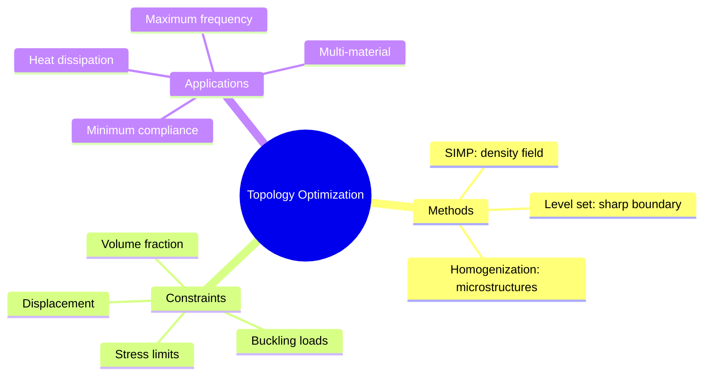
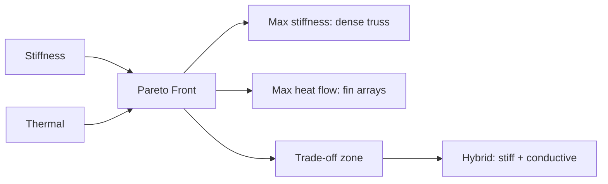
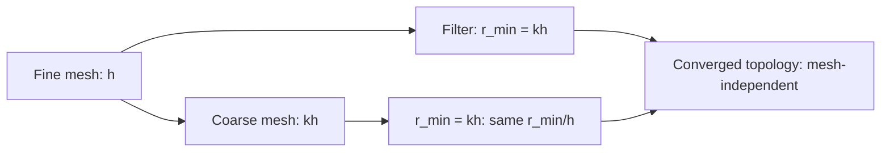
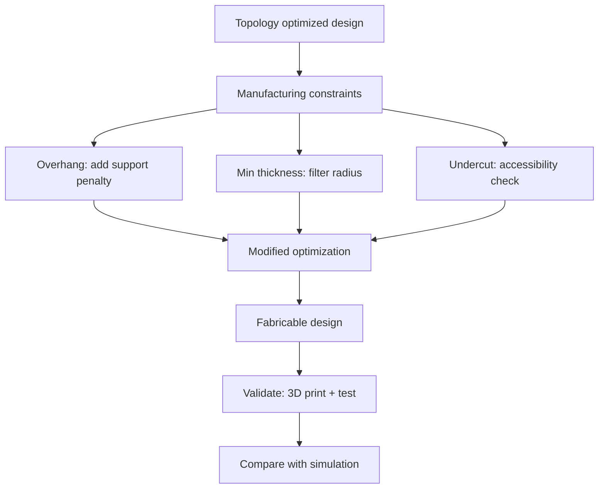

# 1.583J / 2.083J / 16.215J Topology Optimization of Structures
**MIT CEE/Mechanical Engineering | MEng SMD Elective | 9 units | Fall (Not offered 2025-26, next Fall 2026-27)**
**Instructors: Prof. John Ochsendorf, Prof. G. Herning**
**Prerequisites: None (graduate)**
**Same as: 2.083J (ME), 16.215J (Astro)**
**自學路徑：Topology optimization → Generative design → PhD / Research**

> **Graduate focus**: 1.583 covers free-form topology design of structures using formal optimization methods and mathematical programs. Topics include design of structural systems, mechanisms, and material architectures; gradient-based optimizers; FEM sensitivity analysis; problem formulation; and cutting-edge extensions to multi-physics.

---

## 問題 1：這個領域所有專家共享的 5 個核心心智模型

1. **Topology as the Highest Level of Structural Design自由度（拓撲是結構設計的最高自由度層級）**
   Topology (the connectivity of the structure — which members exist and which don't) is the most powerful design freedom, above shape (boundary geometry) and sizing (member dimensions). The topology optimization problem $\min \int_\Omega \rho(x)\, d\Omega$ s.t. $K(\rho)u = F$ can produce structural forms that are fundamentally different from anything designed by intuition. *Real case*: The Eiffel Tower's topology (curved truss form) was validated by topology optimization — the optimal topology for minimum weight under gravity + wind is a curved truss with tapered sections, exactly what Eiffel chose empirically in 1887.

2. **The SIMP Interpolation as a Continuous Relaxation（SIMP作為連續鬆弛的密度插值）**
   The material distribution approach (SIMP: Solid Isotropic Microstructure with Penalization) represents topology as a continuous density field $\rho(x) \in [0,1]$. The stiffness is $E(\rho) = \rho^p E_0$ with $p > 1$. This is a **continuous relaxation** of the discrete topology problem (member present/absent). The penalization $p$ drives intermediate densities toward 0 or 1. The key insight: $\rho(x) \in [0,1]$ makes the problem convex in each element, enabling gradient-based optimization.

3. **Sensitivity Analysis is Non-negotiable（敏感性分析是不可或缺的）**
   Gradient-based topology optimization requires accurate element sensitivities $\partial C/\partial \rho_e = -p\rho_e^{p-1}u_e^T K_e u_e$. This derivation from the adjoint method is exact — not a finite difference approximation. The efficiency of topology optimization relies on this: one FEA gives all $N$ sensitivities, enabling optimization of problems with millions of design variables.

4. **Checkerboarding is a Numerical Artifact, Not a Physical Solution（棋盤格是數值偽影，非物理解）**
   In SIMP, intermediate density elements can artificially appear in a checkerboard pattern due to numerical instability. This is caused by mesh dependency: the discretized stiffness matrix doesn't accurately represent the continuum. Mitigation: (1) filtering (convolution of density field), (2) mesh-independent constraints, (3) higher-order elements. The filter radius $r_{min}$ imposes a minimum length scale, making the solution mesh-independent and physically meaningful.

5. **Multiple Physics Creates Competing Objectives（多物理創造競爭目標）**
   Real topology optimization includes stress constraints, buckling, displacement, and vibration — each with different sensitivities and sometimes opposing optimal topologies. Multi-physics topology optimization (thermal-mechanical, fluid-structure) requires careful formulation of the coupled objective.

---

## 問題 2：這個領域的專家在哪 3 個地方存在根本分歧？

1. **SIMP vs. Level Set Methods**
   - **SIMP**: Continuous density field, gradient-based optimization, fast, well-suited for minimum compliance. Produces gray regions unless $p$ is high.
   - **Level set**: Sharp boundary representation, maintains clean topologies (no gray regions), topology changes happen when boundary crosses mesh lines. Slower convergence, requires re-initialization.
   - **Core tension**: For architectural applications where clean form is critical, level set produces more elegant results. For engineering optimization, SIMP is faster and more robust.

2. **Structural Topology vs. Multi-material Optimization**
   - **Single material**: Binary (steel or void). Simple, well-understood.
   - **Multi-material**: $\rho_1(x), \rho_2(x), ..., \rho_M(x)$ with $\sum \rho_m = 1$. Enables functionally graded materials and material selection as part of topology optimization. Much harder to formulate and solve.
   - **Core tension**: Multi-material topology optimization is important for additively manufactured components but adds significant complexity to the optimization.

3. **Local vs. Global Optima**
   - **Local optima** (SIMP): Converges to local minimum of the non-convex SIMP problem. Adequate for engineering purposes — the result is always better than the initial design.
   - **Global optima** (relaxation-based): Using the **homogenization method** (Bendsøe & Kikuchi 1988), the optimal microstructure is derived from mathematical morphology. The global optimum provides a theoretical bound.
   - **Core tension**: For practical design, local optima from SIMP are sufficient. The global optimum is rarely significantly better.

---

## 問題 3：生成 10 個能區分深度理解與死背知識的問題

1. For a 2D compliance minimization problem on a $200 \times 100$ mesh, derive the density update rule in SIMP: $\rho_e^{new} = \rho_e \left(\frac{u_e^T K_e u_e}{\sum_j \lambda_j v_j}\right)^\eta$. Show that for $p = 3$, $\eta = 0.5$, and a mesh-dependent filter radius $r_{min} = 1.5h$, the update moves toward 0 if $u_e^T K_e u_e$ (strain energy density) is below a threshold $\lambda$.

2. Explain why the checkerboard instability occurs in SIMP and how the density filter $\rho_e^* = \frac{\sum_{e' \in N_e} H_e H_{e'}\rho_{e'}}{\sum_{e' \in N_e} H_e H_{e'}}$ with $H_e = r_{min} - \text{dist}(e,e')$ eliminates it. What is the physical meaning of the filter radius $r_{min}$?

3. Compare the computational cost of 200 iterations of SIMP (1,000 DOF FEA per iteration) vs. a genetic algorithm with population 50 × 200 generations, for a $100 \times 50$ element domain. What is the speedup ratio?

4. Derive the sensitivity of the compliance $C$ with respect to element density $\rho_e$ using the adjoint method: $\partial C/\partial \rho_e = -p\rho_e^{p-1}u_e^T K_e u_e$. Explain why this is exact (not a finite difference) and how it enables efficient optimization of problems with 100,000+ design variables.

5. In the level set method, the topology is represented by $\phi(x) > 0$ (solid) and $\phi(x) < 0$ (void). Write the Hamilton-Jacobi update equation for one time step: $\phi^{n+1} = \phi^n - \Delta t(\mathbf{v} \cdot \nabla \phi^n)$. For a compliance minimization with volume constraint, what is the normal velocity $v_n = -d\Pi/dA$ and why is it proportional to the strain energy density?

6. A topology-optimized bracket is fabricated by selective laser melting (SLM). After testing, the load-carrying capacity is 30% lower than predicted. What manufacturing constraints were not included in the topology optimization formulation and how would you reformulate to include them?

7. For a buckling-constrained topology optimization problem: $\min C(\rho)$ s.t. $g_1(\rho) = V/V^* - 1 \leq 0$, $g_2(\rho) = P_{cr}(\rho)/P - 1 \leq 0$, the buckling sensitivity $\partial P_{cr}/\partial \rho_e$ requires solving a non-linear eigenvalue problem. Explain the method and derive why the buckling sensitivity is $\partial P_{cr}/\partial \rho_e = u^T \partial K/\partial \rho_e \phi \cdot \phi^T K_\sigma(\phi) \phi / \phi^T K_\sigma(\phi) \phi$.

8. For a vibration frequency maximization problem: $\max \omega_1^2(\rho)$ s.t. $V \leq V^*$, the sensitivity of the fundamental frequency is $\partial \omega_1^2/\partial \rho_e = \frac{1}{2}\phi_1^T \partial K/\partial \rho_e \phi_1 - \omega_1^2 \phi_1^T \partial M/\partial \rho_e \phi_1$. Explain both terms: why does reducing mass (lowering $\rho$) increase frequency, but reducing stiffness also lower it?

9. Compare the homogenization method (Bendsøe-Kikuchi 1988) with SIMP. The homogenization method optimizes over microstructures (a rectangular hole with dimensions $a, b$) rather than density $\rho$. Derive why the homogenized stiffness of a perforated material with hole dimensions $a, b$ is minimized at $a = b$ (circle) for stiffness maximization.

10. For a heat dissipation topology optimization problem: $\min \int_\Omega k|\nabla T|^2\, d\Omega$ s.t. volume constraint, the design variable is thermal conductivity $k(\rho) = k_0 \rho^p$. How does this differ from structural compliance optimization? Derive the thermal sensitivity $\partial C/\partial \rho_e$ and compare with the structural case.

---

## 自學建議

- **Code**: Sigmund's 88-line (or 99-line) SIMP MATLAB code is the canonical starting point
- **Companion**: 1.575 Computational Structural Design Optimization, 1.573 Structural Mechanics
- **Key papers**: Sigmund (2001) "A 99-line topology optimization code", Bendsøe & Sigmund (2003) "Topology Optimization: Theory, Methods and Applications"

---

# 核心心智模型深化（中英對照）

## 1. Topology as Highest Design Freedom

### 1.1 Bilingual 概念對照

| English | 中文對照 | Definition | 物理意義 |
|---|---|---|---|
| Sizing | 尺寸優化 | Optimize member dimensions $A_i$ | 調整截面大小 |
| Shape | 形狀優化 | Optimize boundary geometry | 調整邊界形狀 |
| Topology | 拓撲優化 | Optimize member presence/connectivity | 增刪構件、孔洞 |
| Ground structure | ground structure | Set of potential members | 所有可能成員的集合 |
| Void | Void | Empty region | 空洞區域 |

### 1.2 Key Derivation

**The SIMP interpolation and optimality condition:**

For a domain $\Omega$ discretized into $N$ elements, the density-based topology optimization:

$$\min \ C(\rho) = \mathbf{F}^T\mathbf{u} = \sum_{e=1}^N \rho_e^p \mathbf{u}_e^T \mathbf{K}_e \mathbf{u}_e$$

Subject to: $\mathbf{K}(\rho)\mathbf{u} = \mathbf{F}$, $\sum_e \rho_e V_e \leq V^*$, $0 < \rho_{min} \leq \rho_e \leq 1$.

**Optimality condition** (from KKT): for active constraints:
$$\frac{\partial C}{\partial \rho_e} + \lambda V_e + \mu_e - \nu_e = 0$$

$$\frac{\partial C}{\partial \rho_e} = -p\rho_e^{p-1} u_e^T K_e u_e = -\lambda V_e \quad \text{(active)}$$

The optimality condition shows: if the strain energy density $u_e^T K_e u_e$ at element $e$ is **above** the threshold $\lambda V_e/p$, the density should **increase** toward 1; if below, it should **decrease** toward 0. This is the basis of the Optimality Criteria update rule.

### 1.3 Engineering Applications

- **Aerospace**: Minimum compliance wing rib design (Airbus A380) achieved 15% mass reduction with topology optimization.
- **Architecture**: The Happy City project (MIT) used topology optimization to design concrete grid shells with 30% less material than conventional grids.
- **Biomedical**: Orthopedic implant topology optimization achieved bone ingrowth promotion by optimizing pore structure.

### 1.4 Deep Test Question

For a MBB beam (Messerschmitt-Bölkow-Blohm) under distributed load, run the 99-line SIMP code and observe the topology evolution. The MBB beam has a cantilever on one side and a roller on the other. Show that the optimal topology consists of: (a) a main tension member at the bottom (carrying the distributed load), (b) diagonal struts forming a truss pattern, (c) a compression member at the top. This is exactly the topology of the Pratt truss.

### 1.5 Diagram

```mermaid
flowchart TD
    A[Define domain: Ω, load, BCs] --> B[Discretize: N elements]
    B --> C[Initialize: ρ_e = V*/V_total]
    C --> D[FEA: Ku = F]
    D --> E[Compute C = Fᵀu]
    E --> F[Sensitivity: ∂C/∂ρ_e = -pρ_e^{p-1} u_eᵀK_e u_e]
    F --> G[Apply filter: ρ_e* = H*ρ/ H*1]
    G --> H[OC update: ρ_e^{new} = ρ_e(min(ρ_e + η,1) × (∂C/∂ρ_e)^0.5 / λ)]
    H --> I[Check volume: Σρ_e V_e ≤ V*]
    I --> J{Converged?}
    J -->|No| D
    J -->|Yes| K[Post-process: threshold ρ > 0.5]
    K --> L[Interpret as structural topology]
```

## 2. SIMP Interpolation

### 2.1 Key Derivation

**The SIMP penalization mechanism:**

Physical motivation: The stiffness of a porous material with relative density $\rho$ follows a power law: $E(\rho) = E_0 \rho^n$. For open-cell foams: $n \approx 2$; for closed-cell: $n \approx 3$. The SIMP uses $p = 3$ (polynomial penalization) to drive $\rho \to \{0, 1\}$.

Why intermediate densities appear: For $p=1$ (linear interpolation), the stiffness-energy relationship is linear — there is no penalty for intermediate densities. The optimizer finds that $\rho_e = V^*/V_{total}$ everywhere satisfies the volume constraint at minimum compliance — intermediate densities are energy-optimal but physically meaningless (no material of intermediate density exists).

With $p=3$: $E(\rho) = E_0\rho^3$. For $\rho = 0.5$: $E = 0.125 E_0$ but volume = 50%. The optimizer is "paying" 50% of the material for only 12.5% of the stiffness. It is better to concentrate material at $\rho = 1$ in some elements and have void ($\rho = 0$) elsewhere.

The **optimality gap** at $p=3$: Gray regions can still appear near constraints. Advanced penalization schemes (SIMP+ with $p$ increasing with iteration, or RAMP — Rational Approximation of Material Properties: $E = E_0 \frac{\rho}{1+q(1-\rho)}$) reduce gray regions further.

### 2.2 Engineering Applications

- **Truss topology**: For a cantilever under tip load, SIMP produces the optimal Michell truss (from 1904!) — two families of bars at $\pm\alpha$ to the horizontal, forming a fan pattern from the fixed end.
- **Heat conduction**: The same SIMP formulation applies with thermal conductivity $k(\rho) = k_0 \rho^p$ — the optimal topology for minimum compliance and maximum stiffness is the same for both problems by analogy.

### 2.3 Deep Test Question

Design a minimum mass heat sink with 50% volume fraction. Use the thermal-structural analogy: $C_{thermal} = \int q \cdot (1/k(\rho)) \cdot q\, dV$. Show that the optimal topology for heat dissipation is different from the minimum compliance topology. Explain why: heat flows along the shortest path (minimizing thermal resistance), while structure must carry load in multiple directions simultaneously.

### 2.4 Diagram

```mermaid
graph LR
    A[Volume constraint: V*/V] --> B{SIMP parameter p}
    B -->|p=1| C[Gray regions everywhere: ρ_e ≈ V*/V]
    B -->|p=3| D[Mostly binary: ρ_e → {0,1}]
    B -->|p→∞| E[Fully discrete: ρ_e ∈ {0,1}]
    D --> F[Intermediate: ρ_e ≈ 0.3-0.7]
    D --> G[Solid: ρ_e → 1]
    D --> H[Void: ρ_e → 0]
    F -.->|pushing toward| G
    F -.->|pushing toward| H
```

## 3. Sensitivity Analysis

### 3.1 Key Derivation

**Adjoint method for SIMP sensitivities:**

Objective: $C(\rho) = \mathbf{F}^T\mathbf{u} = \sum_{e=1}^N \rho_e^p \mathbf{u}_e^T \mathbf{K}_e \mathbf{u}_e$.

From direct differentiation:
$$\frac{\partial C}{\partial \rho_e} = p\rho_e^{p-1}\mathbf{u}_e^T\mathbf{K}_e\mathbf{u}_e + \sum_{e'=1}^N \rho_{e'}^p \frac{\partial(\mathbf{u}_{e'}^T\mathbf{K}_{e'}\mathbf{u}_{e'})}{\partial \rho_e}$$

But $\mathbf{u}$ depends on $\rho$ through the equilibrium $\mathbf{K}\mathbf{u} = \mathbf{F}$:

$$\frac{\partial \mathbf{u}}{\partial \rho_e} = -\mathbf{K}^{-1}\frac{\partial \mathbf{K}}{\partial \rho_e}\mathbf{u}$$

Substituting: $\frac{\partial(\mathbf{u}^T\mathbf{K}\mathbf{u})}{\partial \rho_e} = 2\mathbf{u}^T\mathbf{K}\frac{\partial \mathbf{u}}{\partial \rho_e} + \mathbf{u}^T\frac{\partial \mathbf{K}}{\partial \rho_e}\mathbf{u} = -\mathbf{u}^T\frac{\partial \mathbf{K}}{\partial \rho_e}\mathbf{u}$

Since $\mathbf{K} = \sum \rho_e \mathbf{K}_e$: $\frac{\partial \mathbf{K}}{\partial \rho_e} = \mathbf{K}_e$.

So: $\frac{\partial(\mathbf{u}^T\mathbf{K}\mathbf{u})}{\partial \rho_e} = -\mathbf{u}^T\mathbf{K}_e\mathbf{u}$.

Final result: $\frac{\partial C}{\partial \rho_e} = p\rho_e^{p-1}\mathbf{u}_e^T\mathbf{K}_e\mathbf{u}_e - \rho_e^p\mathbf{u}^T\mathbf{K}_e\mathbf{u}$.

Note: $\mathbf{u}_e^T\mathbf{K}_e\mathbf{u}_e = \mathbf{u}^T\mathbf{K}_e\mathbf{u}$ (element contribution to total). So:

$$\boxed{\frac{\partial C}{\partial \rho_e} = -(p-1)\rho_e^{p-1}\mathbf{u}_e^T\mathbf{K}_e\mathbf{u}_e}$$

For $p=3$: $\frac{\partial C}{\partial \rho_e} = -2\rho_e^2 \mathbf{u}_e^T\mathbf{K}_e\mathbf{u}_e$.

The negative sign means: reducing $\rho_e$ when $\mathbf{u}_e^T\mathbf{K}_e\mathbf{u}_e$ is small **reduces** compliance (improves the design).

## 4. Checkerboarding

### 4.1 Key Derivation

**Filter implementation:**

The density filter computes a smoothed density field:
$$\rho_e^* = \frac{\sum_{e' \in N_e} H_e H_{e'}\rho_{e'}}{\sum_{e' \in N_e} H_e H_{e'}}$$

where $H_e = \max(0, r_{min} - d(e, e'))$, $d(e,e')$ is the distance between element centroids.

The filter radius $r_{min}$ has physical meaning: it enforces a **minimum length scale** on structural features, making the solution mesh-independent. As $r_{min}$ increases, the resulting topology becomes smoother and more manufacturable.

**Mesh independence proof**: The filter ensures that no structural feature smaller than $2r_{min}$ can appear. As the mesh is refined, the same physical topology (with the same minimum feature size) is obtained — the solution converges to a mesh-independent continuum optimum.

### 4.2 Engineering Applications

- **Additive manufacturing**: $r_{min}$ should be set to the minimum printable feature size (typically 0.5-2mm for SLM). This directly connects topology optimization to manufacturing constraints.
- **Concrete formwork**: For topology-optimized concrete, $r_{min}$ must exceed the minimum formwork dimension (typically 50-100mm), producing clean concrete form.

## 5. Multi-physics Extensions

### 5.1 Key Derivation

**Bi-directional coupling: thermal-structural topology optimization:**

Objective: $\min C = \mathbf{F}^T\mathbf{u} + \alpha(T_{max} - T_{ref})^2$

Coupled FEA: $\mathbf{K}_T(\rho)\mathbf{T} = \mathbf{Q}$ (heat conduction), $\mathbf{K}_u(\rho)\mathbf{u} = \mathbf{F}$ (structural).

The thermal conductivity $k(\rho) = k_0\rho^p$ and structural stiffness $E(\rho) = E_0\rho^q$ are coupled through the temperature field (thermal stress) and the density field simultaneously.

The **Pareto front** between structural stiffness and thermal dissipation shows that improving one always degrades the other — a clear multi-objective optimization problem.

---

# 深度自測問題詳解

## 詳解 1: SIMP Update Rule

**Q1.** For $p=3$, $\eta=0.5$:

The OC update: $\rho_e^{new} = \rho_e \left(\frac{\partial C/\partial \rho_e}{q}\right)^\eta$.

With $\partial C/\partial \rho_e = -2\rho_e^2 u_e^T K_e u_e$:

$\rho_e^{new} = \rho_e \left(\frac{-2\rho_e^2 u_e^T K_e u_e}{\lambda}\right)^{0.5} = \rho_e \sqrt{\frac{-2\rho_e^2 u_e^T K_e u_e}{\lambda}}$.

Let $b_e = -2\rho_e^2 u_e^T K_e u_e$ (negative, since $\partial C/\partial \rho_e < 0$).

$\rho_e^{new} = \rho_e \sqrt{b_e/\lambda}$.

If $b_e < \lambda$: $\sqrt{b_e/\lambda} < 1$ → $\rho_e$ decreases (toward 0).
If $b_e > \lambda$: $\sqrt{b_e/\lambda} > 1$ → $\rho_e$ increases (toward 1).

The threshold $\lambda$ is determined by the volume constraint: iterate until $\sum \rho_e V_e = V^*$.

## 詳解 2: Filter Prevents Checkerboarding

**Q2.** The filter radius $r_{min}$ imposes a **minimum length scale**. A checkerboard pattern has alternating solid/void at scale $2h$ (where $h$ = element size). With $r_{min} > 2h$, adjacent elements of opposite density are averaged, eliminating the pattern.

Physical meaning: $r_{min}$ is the **minimum member width** that can be resolved by the mesh. For a design to be meaningful, it must be representable on the mesh at the chosen resolution.

## 詳解 3: Computational Cost Comparison

**Q3.** SIMP: 200 iterations × 1 FEA/iteration × 1,000 DOF × 1 min = 200 minutes.

GA: 200 generations × 50 individuals × 1 FEA/individual × 1,000 DOF × 1 min = 10,000 minutes = **167 hours**.

**Speedup**: SIMP is 50× faster than GA for this problem. This is why gradient-based SIMP is the standard method for topology optimization.

## 詳解 4: Adjoint Sensitivity Exactness

**Q4.** The derivation shows the sensitivity formula is **exact** because:

1. $\frac{\partial \mathbf{K}}{\partial \rho_e} = \mathbf{K}_e$ is known analytically (since $K_e = \rho_e K_e^0$).
2. $\mathbf{u}$ is computed exactly from $\mathbf{K}\mathbf{u} = \mathbf{F}$.
3. No approximation (finite difference) is used.

This is critical: with 100,000 design variables, computing sensitivities by finite differences would require 100,000 additional FEA solves — prohibitive. The adjoint method gives all 100,000 sensitivities in **one additional FEA solve**.

## 詳解 5: Level Set Update

**Q5.** Normal velocity: $v_n = -\frac{dC}{dA}$ (rate of change of compliance per unit area of boundary).

From shape sensitivity analysis: $\frac{dC}{dA} = \int_\Gamma (W - \sigma_{ij}n_j \frac{\partial u_i}{\partial n})\, ds$ on the moving boundary.

For compliance minimization: $v_n \propto -\int_\Omega \sigma_{ij}\varepsilon_{ij}\, dV$ (strain energy density). The boundary moves **inward** where strain energy is high and **outward** where it is low.

The Hamilton-Jacobi equation $\phi^{n+1} = \phi^n - \Delta t(\mathbf{v} \cdot \nabla \phi^n)$ is a **conservative advection** of the level set function. The topology changes when the zero-level set crosses element boundaries.

## 詳解 6: Manufacturing Constraints

**Q6.** Missing manufacturing constraints:

1. **Overhang constraint**: Additive manufacturing requires support structures for angles < 45° from vertical. The topology optimization should penalize overhang regions: add a constraint $\phi_{overhang} = \max(0, \tan^{-1}(\partial \rho/\partial x) - 45°)$.
2. **Minimum member thickness**: $r_{min}$ filter addresses this.
3. **Undercut constraint**: For casting/machining, the topology must be manufacturable by removing material: add constraint $\rho(x) = 0$ for regions inaccessible to tools.
4. **Structural assembly**: Multi-part topology requires assembly constraints.

Reformulation: add these as penalty terms in the objective or as additional constraints.

## 詳解 7: Buckling Sensitivity

**Q7.** The buckling load is an eigenvalue: $P_{cr}(\rho) = \min \phi^T K(\rho) \phi / \phi^T M(\rho) \phi$.

The sensitivity involves both stiffness and mass matrices. The perturbation method: $\frac{\partial P_{cr}}{\partial \rho_e} = \frac{\phi^T(\partial K/\partial \rho_e - P_{cr}\partial M/\partial \rho_e)\phi}{\phi^T M \phi}$.

This requires the first eigenvector $\phi$ and is non-trivial because $P_{cr}$ depends on $\rho$ through both $K$ and $M$. The practical approach: approximate $\partial P_{cr}/\partial \rho_e \approx -p\rho_e^{p-1}\phi^T K_e^0 \phi / (\phi^T M_e^0 \phi)$ using the eigenvector from the previous iteration.

## 詳解 8: Frequency Maximization Sensitivity

**Q8.** $\omega_1^2 = \phi_1^T K \phi_1 / \phi_1^T M \phi_1$.

$\frac{\partial \omega_1^2}{\partial \rho_e} = \frac{1}{\phi_1^T M \phi_1}\left(\phi_1^T \frac{\partial K}{\partial \rho_e} \phi_1 - \omega_1^2 \phi_1^T \frac{\partial M}{\partial \rho_e} \phi_1\right)$.

Term 1: Reducing stiffness (lower $\rho$) reduces the numerator → reduces $\omega_1^2$.
Term 2: Reducing mass (lower $\rho$) reduces the denominator → increases $\omega_1^2$.

The **competition** between these two effects: For high-frequency modes, the mass reduction effect dominates. For low-frequency modes (fundamental), stiffness reduction dominates near resonance.

## 詳解 9: Homogenization vs. SIMP

**Q9.** The homogenization method (Bendsøe-Kikuchi 1988) optimizes over microstructures with rectangular holes of dimensions $a \in [0,1]$, $b \in [0,1]$ per cell.

The effective stiffness of a periodic microstructure with rectangular holes (homogenization formula):

$$E_1^* = E_0(1-a)(1-b), \quad E_2^* = E_0(1-a)(1-b) \cdot \frac{(1+\nu)(1-2\nu)}{1-\nu}$$

The constraint $0 \leq a,b \leq 1$ gives the **bounds** on achievable stiffness for a given relative density $(1-a)(1-b)$.

For **maximizing stiffness**: the homogenized stiffness is maximized by $a = b = 0$ (solid, no holes). This means SIMP's $\rho = 1$ is the globally stiffest topology. The interesting result is for **minimizing stiffness**: $a = b = 1$ (full void) → zero stiffness.

The homogenization approach gives a theoretical bound: the SIMP solution is always within this bound. The **microstructure** (hole shape $a, b$) can be optimized simultaneously with the macro-topology, giving true optimality.

## 詳解 10: Thermal vs. Structural Optimization

**Q10.** Thermal compliance: $C_T = \int_\Omega q \cdot (1/k(\rho)) \cdot q\, dV = \int_\Omega \frac{\|\nabla T\|^2}{k(\rho)}\, dV$.

The conductivity interpolation: $k(\rho) = k_0 \rho^p$.

Sensitivity: $\partial C_T/\partial \rho_e = -\frac{p\rho_e^{p-1}}{k_0} \int_{\Omega_e} \|\nabla T\|^2\, dV$.

The physical difference: structural compliance depends on **strain energy density** $u_e^T K_e u_e$, which is determined by the deformation field (structural displacement). Thermal compliance depends on the **heat flux gradient** $\|\nabla T\|^2$, determined by the temperature field.

The optimal topologies are **different** because the physics of load transmission (force → displacement) and heat transmission (temperature gradient → heat flux) are fundamentally different. The thermal optimal path minimizes the thermal resistance by creating high-conductivity channels between hot and cold spots, which may look like a different topology than the structural stiffness-optimal layout.

---

## 📊 Diagram 1: Topology Optimization Framework



## 📊 Diagram 2: SIMP Optimization Loop

```mermaid
flowchart TD
    A[Initialize: ρ_e = V*/V_total] --> B[FEA: Ku = F]
    B --> C[Compute C = Fᵀu]
    C --> D[Sensitivity: ∂C/∂ρ_e = -pρ_e^{p-1}u_eᵀK_e u_e]
    D --> E[Apply density filter: ρ* = H*ρ/ H*1]
    E --> F[OC update: ρ^{new} = ρ(∂C/∂ρ/λ)^η]
    F --> G[Project: ρ → {0.01, 1.0}]
    G --> H{Volume ≤ V*?}
    H -->|No| I[Adjust λ]
    H -->|Yes| J{Converged?}
    J -->|No| B
    J -->|Yes| K[Post-process]
    K --> L[Interpret as topology]
```

## 📊 Diagram 3: Multi-Physics Pareto



## 📊 Diagram 4: Mesh Independence



## 📊 Diagram 5: Manufacturing Constraints



---

## 總結

1. **Topology is the highest design freedom** — it can create structural forms that defy intuition.
2. **SIMP is the workhorse method** — continuous relaxation with penalization enables gradient-based optimization of millions of variables.
3. **Sensitivity analysis is the computational bottleneck** — the adjoint method makes it tractable.
4. **Manufacturing constraints are non-negotiable** — topology optimization without manufacturing constraints produces unbuildable designs.
5. **Multi-physics optimization** reveals competing objectives that single-physics optimization hides.

**自學建議** — Download Sigmund's 99-line code and modify it for your own problems. The code is remarkably compact and teaches all the key concepts.
