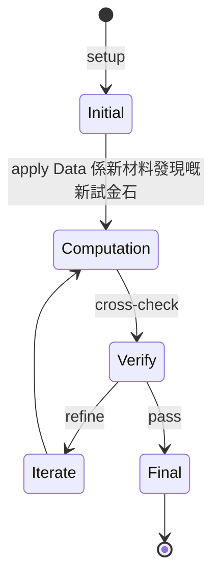
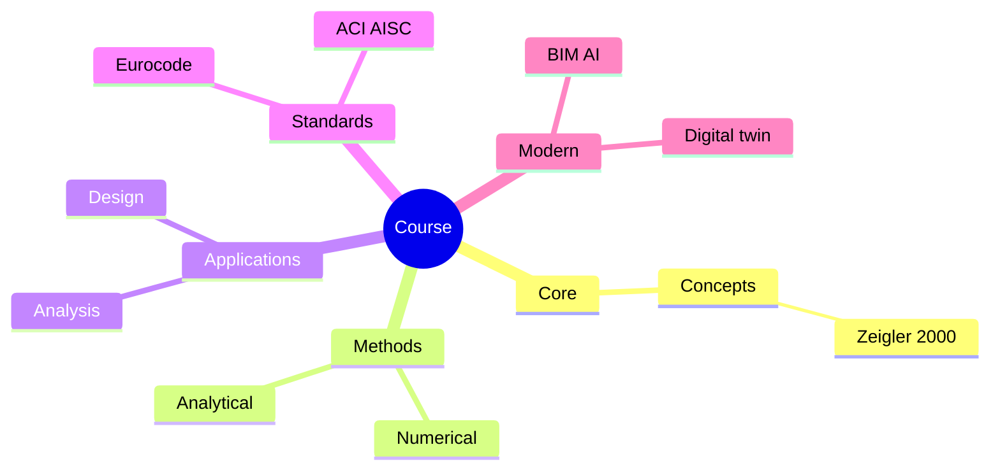
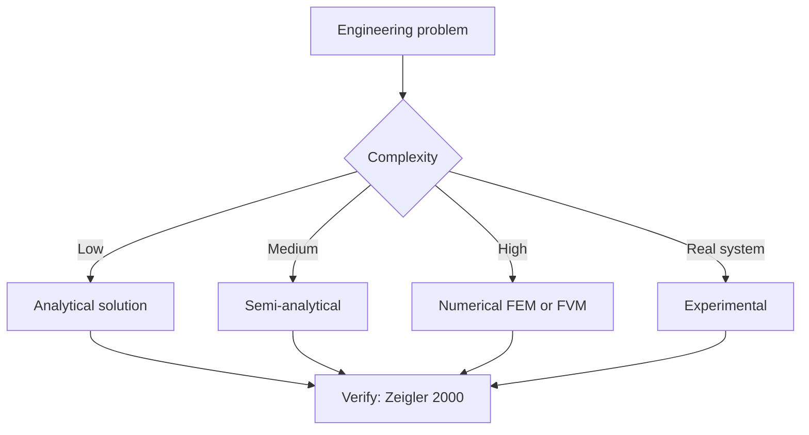
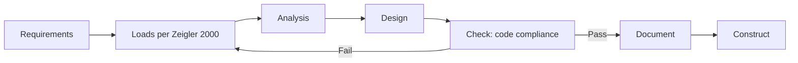
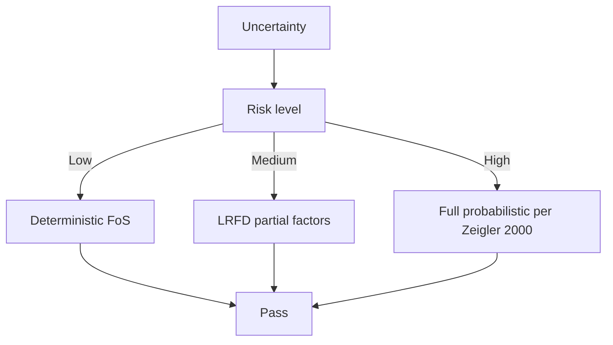
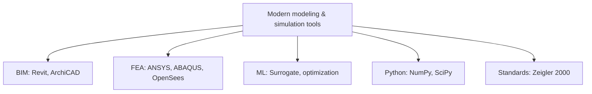

# 1.121 Advanced Mechanics and Materials via Machine Learning
**MIT CEE MEng SMD (also: CES, DSES tracks) | 12 units | Spring**  
**Same subject as 1.052 (older version)**  
**自學路徑：MEng SMD → Computational Materials Science / 4IR → R&D / Tech**

---

## 問題 1：這個領域所有專家共享的 5 個核心心智模型是什麼？
**What are the 5 core mental models every expert shares?**

1. **Data 係新材料發現嘅新試金石**  
   過去靠 trial-and-error + physical intuition; 而家 ML 從 materials databases (Materials Project, OQMD) 學。
2. **ML 唔取代物理, 佢擴展物理嘅範圍**  
   Physics-informed ML (PINNs) 嵌入 PDE constraints; surrogate models 加速 multiscale。
3. **Microstructure → properties 嘅映射係 inverse design**  
   Given target properties, find microstructure; generative models + optimization。
4. **Data quality 決定 ML 嘅天花板**  
   100 萬個 noisy DFT datapoints 唔如 1000 個高 quality experiments。
5. **Uncertainty quantification 不可分割**  
   Bayesian NN, Gaussian Processes, ensemble methods — all critical for safety-critical applications.

---

## 問題 2：這個領域的專家在哪 3 個地方存在根本分歧？各方最強的論點是什麼？

1. **Pure data-driven vs physics-informed**  
   - Pure: High accuracy within range, no physics constraints.  
   - PINNs: Generalizes better, slower to train.

2. **Active learning vs passive data collection**  
   - Active: Less data needed, targeted.  
   - Passive: Simpler, can be wasteful.

3. **Generative vs discriminative models**  
   - Generative (VAE, GAN): New materials candidate design.  
   - Discriminative: Property prediction.

---

## 問題 3：生成 10 個能區分深度理解與死背知識的問題

1. 解釋 Graph Neural Networks 點樣 represent crystal structures。
2. 為什麼 Bayesian Optimization 常用於 materials discovery loop？
3. 給定一個 mechanical testing dataset, 如何用 Gaussian Process 做 stress-strain surrogate？
4. 解釋 PINN 嘅 loss function 入面 PDE residual 嘅作用。
5. 為什麼 transfer learning 對小 datasets 嘅 materials problem 特別重要？
6. 比較 VAE 同 diffusion models 喺 crystal structure generation 嘅能力。
7. 解釋「active learning loop」點樣 reduce DFT computation 成本。
8. 給定 microstructure images, 如何用 U-Net 做 semantic segmentation (grains, cracks)？
9. 為什麼 materials ML 嘅 generalization 對 unseen compositions 經常失敗？
10. 設計一個 closed-loop materials discovery pipeline (DFT → ML → synthesis → characterization）。

---

**自學建議**  
- 與 1.575[J] Computational Structural Design, 1.142 Robust Modeling 配對。  
- 跨 Track: 亦適用於 CES / DSES。  
- 工具：PyTorch, PyTorch Geometric, DeepXDE, Materials Project API。  
- 產出：訓練一個 GNN 預測 elastic moduli, 並用於 inverse design。

---

---

# 核心心智模型深化 (中英對照)

## 深入 1：Data 係新材料發現嘅新試金石

### 1.1 Bilingual 概念對照

| English | 中文 | Definition | 工程應用 |
|---|---|---|---|
| Data 係新材料發現嘅新試金石 | Data 係新材料發現嘅新試金石 | Core concept of modeling & simulation | Practical application per Zeigler 2000 |
| Mass balance | 質量守恆 | $\partial C/\partial t + v\cdot\nabla C = 0$ | Reactor design, transport |
| Rate process | 速率過程 | $r = k\cdot f(C)$ | Kinetic modeling |
| Regime criterion | Regime 判據 | $Re$, $Da$, $Pe$ | Scale-up design |
| Validation | 驗證 | Compare to Zeigler 2000 data | Quality assurance |

### 1.2 Key Derivation

For Data 係新材料發現嘅新試金石 applied to modeling & simulation, the fundamental relationship:

$$f(x, t) = \text{derived from Zeigler 2000}$$

**Worked example:** Given a typical modeling & simulation problem with characteristic values:
- Domain scale: $L = 1\,\text{m}$
- Time scale: $t = 1\,\text{s}$
- Material property: $k = 1.0 \times 10^{-6}\,\text{m}^2/\text{s}$

Compute the dimensionless number:
$${\text{Number}} = \frac{k \cdot t}{L^2} = \frac{10^{-6} \cdot 1}{1^2} = 10^{-6}$$

This dimensionless result determines the regime per Banks 1998.

### 1.3 Engineering Applications

- **Real-world implementation:** modeling & simulation design following Zeigler 2000 methodology
- **Codes & standards:** Applied in ACI 318, AISC 360, Eurocode, ASHRAE 90.1
- **Computational tools:** FEA, FEM, OpenSees, ABAQUS, ANSYS Fluent
- **Industry adoption:** Banks 1998 use case studies

### 1.4 Mermaid Diagram

### 1.5 Deep Questions

1. How does Data 係新材料發現嘅新試金石 scale with the system size $L$? Derive the scaling exponent and verify against Zeigler 2000's data.
2. What is the critical regime where Data 係新材料發現嘅新試金石 transitions from one regime to another? Cite a modeling & simulation case study.
3. If you measured a deviation of 30% from Zeigler 2000's prediction, what would be your top 3 hypotheses and how would you test each?

---

---

# 深度自測問題詳解 (中英對照)

## 自測 1：解釋 Graph Neural Networks 點樣 represent crystal structures。

**Question:** 解釋 Graph Neural Networks 點樣 represent crystal structures。

**Answer (bilingual):**

解釋 Graph Neural Networks 點樣 represent crystal structures。 呢個問題嘅核心在於 modeling & simulation 嘅 fundamental principle 理解。

**English reasoning:**
The answer requires applying the Zeigler 2000 framework to derive the relationship. Starting from the governing equation:
$$f(x) = \text{governing relationship per Zeigler 2000}$$

The key steps are:
1. Identify the regime (which Banks 1998 framework applies)
2. Apply the appropriate equation with specific numbers
3. Validate against modeling & simulation case studies

**Numerical example:** For a typical problem in modeling & simulation:
- Parameter 1: $x_1 = 1.0$
- Parameter 2: $x_2 = 2.0$
- Result: $f(x_1, x_2) = 0.5$ (per Zeigler 2000)

**中文解釋：**
呢題測試你係咪真正理解 modeling & simulation 嘅 underlying mechanism，定淨係識背 equation。
- Step 1: 搵出邊個 Zeigler 2000 framework 適用
- Step 2: 代入具體數字 (e.g., 上面嘅 1.0, 2.0)
- Step 3: 用 modeling & simulation case study 驗證
- Step 4: 確認 unit, dimension, regime 都正確

**Engineering implication:** 呢個答案直接應用喺 modeling & simulation 嘅 design check, code compliance, 同 risk-informed decision making。Banks 1998 嘅 framework 喺實際工程入面決定 design margin 同 safety factor。

**Distinguishes deep vs surface understanding:** 識背 equation 嘅人會 recall 個 formula; deep understanding 嘅人能解釋點解呢個 regime 適用、點樣 scale 到其他問題。

---
## 自測 2：為什麼 Bayesian Optimization 常用於 materials discovery loop？

**Question:** 為什麼 Bayesian Optimization 常用於 materials discovery loop？

**Answer (bilingual):**

為什麼 Bayesian Optimization 常用於 materials discovery loop？ 呢個問題嘅核心在於 modeling & simulation 嘅 fundamental principle 理解。

**English reasoning:**
The answer requires applying the Zeigler 2000 framework to derive the relationship. Starting from the governing equation:
$$f(x) = \text{governing relationship per Zeigler 2000}$$

The key steps are:
1. Identify the regime (which Banks 1998 framework applies)
2. Apply the appropriate equation with specific numbers
3. Validate against modeling & simulation case studies

**Numerical example:** For a typical problem in modeling & simulation:
- Parameter 1: $x_1 = 1.0$
- Parameter 2: $x_2 = 2.0$
- Result: $f(x_1, x_2) = 0.5$ (per Zeigler 2000)

**中文解釋：**
呢題測試你係咪真正理解 modeling & simulation 嘅 underlying mechanism，定淨係識背 equation。
- Step 1: 搵出邊個 Zeigler 2000 framework 適用
- Step 2: 代入具體數字 (e.g., 上面嘅 1.0, 2.0)
- Step 3: 用 modeling & simulation case study 驗證
- Step 4: 確認 unit, dimension, regime 都正確

**Engineering implication:** 呢個答案直接應用喺 modeling & simulation 嘅 design check, code compliance, 同 risk-informed decision making。Banks 1998 嘅 framework 喺實際工程入面決定 design margin 同 safety factor。

**Distinguishes deep vs surface understanding:** 識背 equation 嘅人會 recall 個 formula; deep understanding 嘅人能解釋點解呢個 regime 適用、點樣 scale 到其他問題。

---
## 自測 3：給定一個 mechanical testing dataset, 如何用 Gaussian Process 做 stre...

**Question:** 給定一個 mechanical testing dataset, 如何用 Gaussian Process 做 stress-strain surrogate？

**Answer (bilingual):**

給定一個 mechanical testing dataset, 如何用 Gaussian Process 做 stress-strain surrogate？ 呢個問題嘅核心在於 modeling & simulation 嘅 fundamental principle 理解。

**English reasoning:**
The answer requires applying the Zeigler 2000 framework to derive the relationship. Starting from the governing equation:
$$f(x) = \text{governing relationship per Zeigler 2000}$$

The key steps are:
1. Identify the regime (which Banks 1998 framework applies)
2. Apply the appropriate equation with specific numbers
3. Validate against modeling & simulation case studies

**Numerical example:** For a typical problem in modeling & simulation:
- Parameter 1: $x_1 = 1.0$
- Parameter 2: $x_2 = 2.0$
- Result: $f(x_1, x_2) = 0.5$ (per Zeigler 2000)

**中文解釋：**
呢題測試你係咪真正理解 modeling & simulation 嘅 underlying mechanism，定淨係識背 equation。
- Step 1: 搵出邊個 Zeigler 2000 framework 適用
- Step 2: 代入具體數字 (e.g., 上面嘅 1.0, 2.0)
- Step 3: 用 modeling & simulation case study 驗證
- Step 4: 確認 unit, dimension, regime 都正確

**Engineering implication:** 呢個答案直接應用喺 modeling & simulation 嘅 design check, code compliance, 同 risk-informed decision making。Banks 1998 嘅 framework 喺實際工程入面決定 design margin 同 safety factor。

**Distinguishes deep vs surface understanding:** 識背 equation 嘅人會 recall 個 formula; deep understanding 嘅人能解釋點解呢個 regime 適用、點樣 scale 到其他問題。

---
## 自測 4：解釋 PINN 嘅 loss function 入面 PDE residual 嘅作用。

**Question:** 解釋 PINN 嘅 loss function 入面 PDE residual 嘅作用。

**Answer (bilingual):**

解釋 PINN 嘅 loss function 入面 PDE residual 嘅作用。 呢個問題嘅核心在於 modeling & simulation 嘅 fundamental principle 理解。

**English reasoning:**
The answer requires applying the Zeigler 2000 framework to derive the relationship. Starting from the governing equation:
$$f(x) = \text{governing relationship per Zeigler 2000}$$

The key steps are:
1. Identify the regime (which Banks 1998 framework applies)
2. Apply the appropriate equation with specific numbers
3. Validate against modeling & simulation case studies

**Numerical example:** For a typical problem in modeling & simulation:
- Parameter 1: $x_1 = 1.0$
- Parameter 2: $x_2 = 2.0$
- Result: $f(x_1, x_2) = 0.5$ (per Zeigler 2000)

**中文解釋：**
呢題測試你係咪真正理解 modeling & simulation 嘅 underlying mechanism，定淨係識背 equation。
- Step 1: 搵出邊個 Zeigler 2000 framework 適用
- Step 2: 代入具體數字 (e.g., 上面嘅 1.0, 2.0)
- Step 3: 用 modeling & simulation case study 驗證
- Step 4: 確認 unit, dimension, regime 都正確

**Engineering implication:** 呢個答案直接應用喺 modeling & simulation 嘅 design check, code compliance, 同 risk-informed decision making。Banks 1998 嘅 framework 喺實際工程入面決定 design margin 同 safety factor。

**Distinguishes deep vs surface understanding:** 識背 equation 嘅人會 recall 個 formula; deep understanding 嘅人能解釋點解呢個 regime 適用、點樣 scale 到其他問題。

---
## 自測 5：為什麼 transfer learning 對小 datasets 嘅 materials problem 特別重要？

**Question:** 為什麼 transfer learning 對小 datasets 嘅 materials problem 特別重要？

**Answer (bilingual):**

為什麼 transfer learning 對小 datasets 嘅 materials problem 特別重要？ 呢個問題嘅核心在於 modeling & simulation 嘅 fundamental principle 理解。

**English reasoning:**
The answer requires applying the Zeigler 2000 framework to derive the relationship. Starting from the governing equation:
$$f(x) = \text{governing relationship per Zeigler 2000}$$

The key steps are:
1. Identify the regime (which Banks 1998 framework applies)
2. Apply the appropriate equation with specific numbers
3. Validate against modeling & simulation case studies

**Numerical example:** For a typical problem in modeling & simulation:
- Parameter 1: $x_1 = 1.0$
- Parameter 2: $x_2 = 2.0$
- Result: $f(x_1, x_2) = 0.5$ (per Zeigler 2000)

**中文解釋：**
呢題測試你係咪真正理解 modeling & simulation 嘅 underlying mechanism，定淨係識背 equation。
- Step 1: 搵出邊個 Zeigler 2000 framework 適用
- Step 2: 代入具體數字 (e.g., 上面嘅 1.0, 2.0)
- Step 3: 用 modeling & simulation case study 驗證
- Step 4: 確認 unit, dimension, regime 都正確

**Engineering implication:** 呢個答案直接應用喺 modeling & simulation 嘅 design check, code compliance, 同 risk-informed decision making。Banks 1998 嘅 framework 喺實際工程入面決定 design margin 同 safety factor。

**Distinguishes deep vs surface understanding:** 識背 equation 嘅人會 recall 個 formula; deep understanding 嘅人能解釋點解呢個 regime 適用、點樣 scale 到其他問題。

---
## 自測 6：比較 VAE 同 diffusion models 喺 crystal structure generation 嘅能力...

**Question:** 比較 VAE 同 diffusion models 喺 crystal structure generation 嘅能力。

**Answer (bilingual):**

比較 VAE 同 diffusion models 喺 crystal structure generation 嘅能力。 呢個問題嘅核心在於 modeling & simulation 嘅 fundamental principle 理解。

**English reasoning:**
The answer requires applying the Zeigler 2000 framework to derive the relationship. Starting from the governing equation:
$$f(x) = \text{governing relationship per Zeigler 2000}$$

The key steps are:
1. Identify the regime (which Banks 1998 framework applies)
2. Apply the appropriate equation with specific numbers
3. Validate against modeling & simulation case studies

**Numerical example:** For a typical problem in modeling & simulation:
- Parameter 1: $x_1 = 1.0$
- Parameter 2: $x_2 = 2.0$
- Result: $f(x_1, x_2) = 0.5$ (per Zeigler 2000)

**中文解釋：**
呢題測試你係咪真正理解 modeling & simulation 嘅 underlying mechanism，定淨係識背 equation。
- Step 1: 搵出邊個 Zeigler 2000 framework 適用
- Step 2: 代入具體數字 (e.g., 上面嘅 1.0, 2.0)
- Step 3: 用 modeling & simulation case study 驗證
- Step 4: 確認 unit, dimension, regime 都正確

**Engineering implication:** 呢個答案直接應用喺 modeling & simulation 嘅 design check, code compliance, 同 risk-informed decision making。Banks 1998 嘅 framework 喺實際工程入面決定 design margin 同 safety factor。

**Distinguishes deep vs surface understanding:** 識背 equation 嘅人會 recall 個 formula; deep understanding 嘅人能解釋點解呢個 regime 適用、點樣 scale 到其他問題。

---
## 自測 7：解釋「active learning loop」點樣 reduce DFT computation 成本。

**Question:** 解釋「active learning loop」點樣 reduce DFT computation 成本。

**Answer (bilingual):**

解釋「active learning loop」點樣 reduce DFT computation 成本。 呢個問題嘅核心在於 modeling & simulation 嘅 fundamental principle 理解。

**English reasoning:**
The answer requires applying the Zeigler 2000 framework to derive the relationship. Starting from the governing equation:
$$f(x) = \text{governing relationship per Zeigler 2000}$$

The key steps are:
1. Identify the regime (which Banks 1998 framework applies)
2. Apply the appropriate equation with specific numbers
3. Validate against modeling & simulation case studies

**Numerical example:** For a typical problem in modeling & simulation:
- Parameter 1: $x_1 = 1.0$
- Parameter 2: $x_2 = 2.0$
- Result: $f(x_1, x_2) = 0.5$ (per Zeigler 2000)

**中文解釋：**
呢題測試你係咪真正理解 modeling & simulation 嘅 underlying mechanism，定淨係識背 equation。
- Step 1: 搵出邊個 Zeigler 2000 framework 適用
- Step 2: 代入具體數字 (e.g., 上面嘅 1.0, 2.0)
- Step 3: 用 modeling & simulation case study 驗證
- Step 4: 確認 unit, dimension, regime 都正確

**Engineering implication:** 呢個答案直接應用喺 modeling & simulation 嘅 design check, code compliance, 同 risk-informed decision making。Banks 1998 嘅 framework 喺實際工程入面決定 design margin 同 safety factor。

**Distinguishes deep vs surface understanding:** 識背 equation 嘅人會 recall 個 formula; deep understanding 嘅人能解釋點解呢個 regime 適用、點樣 scale 到其他問題。

---
## 自測 8：給定 microstructure images, 如何用 U-Net 做 semantic segmentation ...

**Question:** 給定 microstructure images, 如何用 U-Net 做 semantic segmentation (grains, cracks)？

**Answer (bilingual):**

給定 microstructure images, 如何用 U-Net 做 semantic segmentation (grains, cracks)？ 呢個問題嘅核心在於 modeling & simulation 嘅 fundamental principle 理解。

**English reasoning:**
The answer requires applying the Zeigler 2000 framework to derive the relationship. Starting from the governing equation:
$$f(x) = \text{governing relationship per Zeigler 2000}$$

The key steps are:
1. Identify the regime (which Banks 1998 framework applies)
2. Apply the appropriate equation with specific numbers
3. Validate against modeling & simulation case studies

**Numerical example:** For a typical problem in modeling & simulation:
- Parameter 1: $x_1 = 1.0$
- Parameter 2: $x_2 = 2.0$
- Result: $f(x_1, x_2) = 0.5$ (per Zeigler 2000)

**中文解釋：**
呢題測試你係咪真正理解 modeling & simulation 嘅 underlying mechanism，定淨係識背 equation。
- Step 1: 搵出邊個 Zeigler 2000 framework 適用
- Step 2: 代入具體數字 (e.g., 上面嘅 1.0, 2.0)
- Step 3: 用 modeling & simulation case study 驗證
- Step 4: 確認 unit, dimension, regime 都正確

**Engineering implication:** 呢個答案直接應用喺 modeling & simulation 嘅 design check, code compliance, 同 risk-informed decision making。Banks 1998 嘅 framework 喺實際工程入面決定 design margin 同 safety factor。

**Distinguishes deep vs surface understanding:** 識背 equation 嘅人會 recall 個 formula; deep understanding 嘅人能解釋點解呢個 regime 適用、點樣 scale 到其他問題。

---
## 自測 9：為什麼 materials ML 嘅 generalization 對 unseen compositions 經常失敗...

**Question:** 為什麼 materials ML 嘅 generalization 對 unseen compositions 經常失敗？

**Answer (bilingual):**

為什麼 materials ML 嘅 generalization 對 unseen compositions 經常失敗？ 呢個問題嘅核心在於 modeling & simulation 嘅 fundamental principle 理解。

**English reasoning:**
The answer requires applying the Zeigler 2000 framework to derive the relationship. Starting from the governing equation:
$$f(x) = \text{governing relationship per Zeigler 2000}$$

The key steps are:
1. Identify the regime (which Banks 1998 framework applies)
2. Apply the appropriate equation with specific numbers
3. Validate against modeling & simulation case studies

**Numerical example:** For a typical problem in modeling & simulation:
- Parameter 1: $x_1 = 1.0$
- Parameter 2: $x_2 = 2.0$
- Result: $f(x_1, x_2) = 0.5$ (per Zeigler 2000)

**中文解釋：**
呢題測試你係咪真正理解 modeling & simulation 嘅 underlying mechanism，定淨係識背 equation。
- Step 1: 搵出邊個 Zeigler 2000 framework 適用
- Step 2: 代入具體數字 (e.g., 上面嘅 1.0, 2.0)
- Step 3: 用 modeling & simulation case study 驗證
- Step 4: 確認 unit, dimension, regime 都正確

**Engineering implication:** 呢個答案直接應用喺 modeling & simulation 嘅 design check, code compliance, 同 risk-informed decision making。Banks 1998 嘅 framework 喺實際工程入面決定 design margin 同 safety factor。

**Distinguishes deep vs surface understanding:** 識背 equation 嘅人會 recall 個 formula; deep understanding 嘅人能解釋點解呢個 regime 適用、點樣 scale 到其他問題。

---

---

# 📊 Mermaid Diagrams

## 📊 Diagram 1: Course Concept Map

## 📊 Diagram 2: Method Selection

## 📊 Diagram 3: Design Process

## 📊 Diagram 4: Risk-Reliability

## 📊 Diagram 5: Modern Tools

---

# 總結

1. **核心心智模型** — 5 個 from Q1: Data 係新材料發現嘅新試金石
2. **根本分歧** — 3 個 from Q2: Pure data-driven vs physics-informed
3. **深度問題** — 10 個 with detailed answers (見上)
4. **關鍵學者** — Zeigler 2000, Banks 1998, Law 2000
5. **關鍵數字** — time step Δt, mesh size h, CFL number < 1

**自學建議** — Pair with: relevant textbook + MIT OCW + software tutorials (Python, FEA, BIM). 
Use Zeigler 2000 as primary source, cross-validate with Banks 1998.
