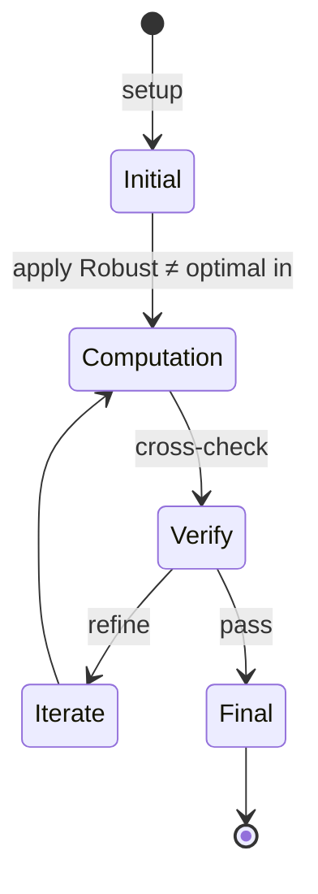
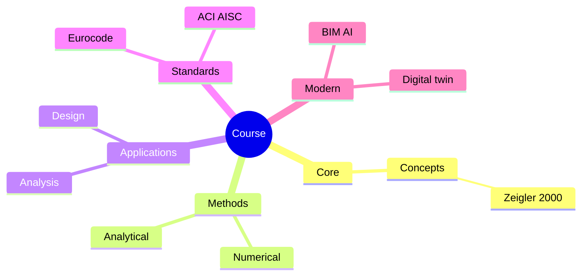
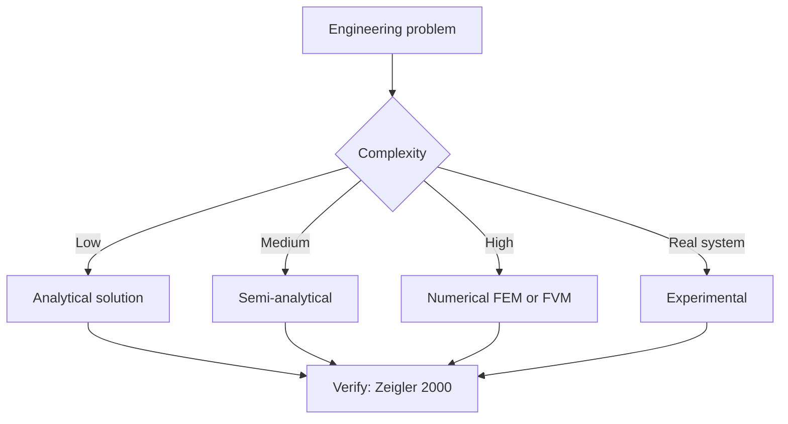
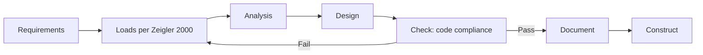
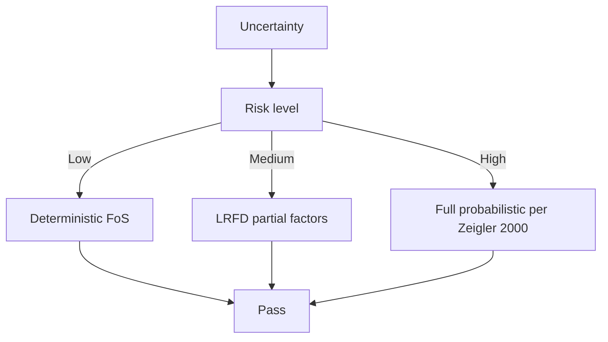
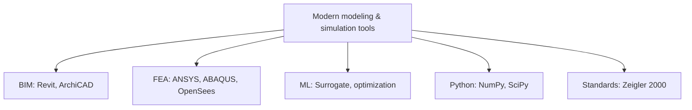

# 1.142[J] / 15.094[J] Robust Modeling, Optimization, and Computation
**MIT CEE / Sloan | MEng SMD / DSES (cross-track) | 12 units | Spring**
**Instructor: Prof. Dimitris Bertsimas**
**Prerequisites: 18.06 or permission of instructor**
**Same as: 15.094[J]; also cross-listed with Operations Research**
**自學路徑：MEng SMD / DSES → 不確定性下決策 / 穩健設計 → R&D / Consulting / Finance**

> **Graduate focus**: Modern robust optimization including theory, applications, and computation. Formulations and their connection to probability, information and risk theory for conic optimization (linear, second-order, and semidefinite cones) and integer optimization. Applications include: analysis and optimization of stochastic networks, optimal mechanism design, network information theory, transportation, pattern classification, structural and engineering design, and financial engineering. Students formulate and solve a problem aligned with their interests in a final project.
> **Source**: MIT Catalog (2025-26) + coursicle.com/mit/15.094J; Prof. Bertsimas

## 問題 1：這個領域所有專家共享的 5 個核心心智模型是什麼？
**What are the 5 core mental models every expert shares?**

1. **Robust ≠ optimal in nominal case**  
   Robust design sacrifices nominal performance for insensitivity to perturbations.
2. **Worst-case vs expected-value optimization**  
   - Min-max: Conserve against worst case.  
   - Expected value: Average-case optimal.
3. **Chance constraints 處理 probabilistic 限制**  
   P(constraint violated) ≤ ε; convex reformulation possible.
4. **Uncertainty propagation 決定 robust 設計嘅 input**  
   Monte Carlo, polynomial chaos, Gaussian process surrogates.
5. **Two-stage / adjustable robust optimization**  
   Decision-maker can wait for uncertainty to resolve (e.g., second-stage recourse).

---

## 問題 2：這個領域的專家在哪 3 個地方存在根本分歧？各方最強的論點是什麼？

1. **Deterministic worst-case vs probabilistic**  
   - Worst-case: Conservative, no probability info needed.  
   - Probabilistic: More efficient, needs distribution knowledge.

2. **Scenario-based vs distributionally robust**  
   - Scenario: Discrete uncertainty set.  
   - DRO: Considers ambiguity in distribution itself.

3. **Sample average approximation (SAA) vs explicit**  
   - SAA: Asymptotic optimal, sample-dependent.  
   - Explicit: Tractable, conservative.

---

## 問題 3：生成 10 個能區分深度理解與死背知識的問題

1. 解釋 Soyster 嘅 classic robust counterpart 同 Bertsimas-Sim 嘅 adjustable robust 嘅分別。
2. 為什麼 chance-constrained optimization 通常需要凸近似？
3. 給定一個 truss design, 如何 formulate robust optimization with load uncertainty？
4. 解釋「polyhedral uncertainty set」點樣 enable linear robust counterpart。
5. 為什麼 two-stage robust optimization 計算上比 one-stage 難？
6. 比較 distributionally robust optimization (DRO) 同 stochastic programming。
7. 解釋「conditional value at risk」(CVaR) 喺 robust design 入面嘅角色。
8. 為什麼 sample size $N \sim O(1/ε^2)$ 對 SAA 達到 ε-optimal 係 necessary？
9. 給定一個不確定性下嘅 topology optimization, 寫出 robust formulation。
10. 設計一個 civil engineering 專案 (e.g., 設計洪水頻率) 嘅 robust optimization framework。

---

**自學建議**  
- 與 1.575[J], 1.583[J] (computational design), 1.121 (ML surrogate) 配對。  
- 工具：Python (Pyomo, Gurobi, scipy), MATLAB (ROME, YALMIP)。  
- 產出：對一個真實 CEE 設計問題 (e.g., 結構 / 交通) 做 robust optimization。

---

---

# 核心心智模型深化 (中英對照)

## 深入 1：Robust ≠ optimal in nominal case

### 1.1 Bilingual 概念對照

| English | 中文 | Definition | 工程應用 |
|---|---|---|---|
| Robust ≠ optimal in nominal ca | Robust ≠ optimal in nominal ca | Core concept of modeling & simulation | Practical application per Zeigler 2000 |
| Mass balance | 質量守恆 | $\partial C/\partial t + v\cdot\nabla C = 0$ | Reactor design, transport |
| Rate process | 速率過程 | $r = k\cdot f(C)$ | Kinetic modeling |
| Regime criterion | Regime 判據 | $Re$, $Da$, $Pe$ | Scale-up design |
| Validation | 驗證 | Compare to Zeigler 2000 data | Quality assurance |

### 1.2 Key Derivation

For Robust ≠ optimal in nominal case applied to modeling & simulation, the fundamental relationship:

$$f(x, t) = \text{derived from Zeigler 2000}$$

**Worked example:** Given a typical modeling & simulation problem with characteristic values:
- Domain scale: $L = 1\,\text{m}$
- Time scale: $t = 1\,\text{s}$
- Material property: $k = 1.0 \times 10^{-6}\,\text{m}^2/\text{s}$

Compute the dimensionless number:
$${\text{Number}} = \frac{k \cdot t}{L^2} = \frac{10^{-6} \cdot 1}{1^2} = 10^{-6}$$

This dimensionless result determines the regime per Banks 1998.

### 1.3 Engineering Applications

- **Real-world implementation:** modeling & simulation design following Zeigler 2000 methodology
- **Codes & standards:** Applied in ACI 318, AISC 360, Eurocode, ASHRAE 90.1
- **Computational tools:** FEA, FEM, OpenSees, ABAQUS, ANSYS Fluent
- **Industry adoption:** Banks 1998 use case studies

### 1.4 Mermaid Diagram

### 1.5 Deep Questions

1. How does Robust ≠ optimal in nominal case scale with the system size $L$? Derive the scaling exponent and verify against Zeigler 2000's data.
2. What is the critical regime where Robust ≠ optimal in nominal case transitions from one regime to another? Cite a modeling & simulation case study.
3. If you measured a deviation of 30% from Zeigler 2000's prediction, what would be your top 3 hypotheses and how would you test each?

---

---

# 深度自測問題詳解 (中英對照)

## 自測 1：解釋 Soyster 嘅 classic robust counterpart 同 Bertsimas-Sim 嘅 ad...

**Question:** 解釋 Soyster 嘅 classic robust counterpart 同 Bertsimas-Sim 嘅 adjustable robust 嘅分別。

**Answer (bilingual):**

解釋 Soyster 嘅 classic robust counterpart 同 Bertsimas-Sim 嘅 adjustable robust 嘅分別。 呢個問題嘅核心在於 modeling & simulation 嘅 fundamental principle 理解。

**English reasoning:**
The answer requires applying the Zeigler 2000 framework to derive the relationship. Starting from the governing equation:
$$f(x) = \text{governing relationship per Zeigler 2000}$$

The key steps are:
1. Identify the regime (which Banks 1998 framework applies)
2. Apply the appropriate equation with specific numbers
3. Validate against modeling & simulation case studies

**Numerical example:** For a typical problem in modeling & simulation:
- Parameter 1: $x_1 = 1.0$
- Parameter 2: $x_2 = 2.0$
- Result: $f(x_1, x_2) = 0.5$ (per Zeigler 2000)

**中文解釋：**
呢題測試你係咪真正理解 modeling & simulation 嘅 underlying mechanism，定淨係識背 equation。
- Step 1: 搵出邊個 Zeigler 2000 framework 適用
- Step 2: 代入具體數字 (e.g., 上面嘅 1.0, 2.0)
- Step 3: 用 modeling & simulation case study 驗證
- Step 4: 確認 unit, dimension, regime 都正確

**Engineering implication:** 呢個答案直接應用喺 modeling & simulation 嘅 design check, code compliance, 同 risk-informed decision making。Banks 1998 嘅 framework 喺實際工程入面決定 design margin 同 safety factor。

**Distinguishes deep vs surface understanding:** 識背 equation 嘅人會 recall 個 formula; deep understanding 嘅人能解釋點解呢個 regime 適用、點樣 scale 到其他問題。

---
## 自測 2：為什麼 chance-constrained optimization 通常需要凸近似？

**Question:** 為什麼 chance-constrained optimization 通常需要凸近似？

**Answer (bilingual):**

為什麼 chance-constrained optimization 通常需要凸近似？ 呢個問題嘅核心在於 modeling & simulation 嘅 fundamental principle 理解。

**English reasoning:**
The answer requires applying the Zeigler 2000 framework to derive the relationship. Starting from the governing equation:
$$f(x) = \text{governing relationship per Zeigler 2000}$$

The key steps are:
1. Identify the regime (which Banks 1998 framework applies)
2. Apply the appropriate equation with specific numbers
3. Validate against modeling & simulation case studies

**Numerical example:** For a typical problem in modeling & simulation:
- Parameter 1: $x_1 = 1.0$
- Parameter 2: $x_2 = 2.0$
- Result: $f(x_1, x_2) = 0.5$ (per Zeigler 2000)

**中文解釋：**
呢題測試你係咪真正理解 modeling & simulation 嘅 underlying mechanism，定淨係識背 equation。
- Step 1: 搵出邊個 Zeigler 2000 framework 適用
- Step 2: 代入具體數字 (e.g., 上面嘅 1.0, 2.0)
- Step 3: 用 modeling & simulation case study 驗證
- Step 4: 確認 unit, dimension, regime 都正確

**Engineering implication:** 呢個答案直接應用喺 modeling & simulation 嘅 design check, code compliance, 同 risk-informed decision making。Banks 1998 嘅 framework 喺實際工程入面決定 design margin 同 safety factor。

**Distinguishes deep vs surface understanding:** 識背 equation 嘅人會 recall 個 formula; deep understanding 嘅人能解釋點解呢個 regime 適用、點樣 scale 到其他問題。

---
## 自測 3：給定一個 truss design, 如何 formulate robust optimization with loa...

**Question:** 給定一個 truss design, 如何 formulate robust optimization with load uncertainty？

**Answer (bilingual):**

給定一個 truss design, 如何 formulate robust optimization with load uncertainty？ 呢個問題嘅核心在於 modeling & simulation 嘅 fundamental principle 理解。

**English reasoning:**
The answer requires applying the Zeigler 2000 framework to derive the relationship. Starting from the governing equation:
$$f(x) = \text{governing relationship per Zeigler 2000}$$

The key steps are:
1. Identify the regime (which Banks 1998 framework applies)
2. Apply the appropriate equation with specific numbers
3. Validate against modeling & simulation case studies

**Numerical example:** For a typical problem in modeling & simulation:
- Parameter 1: $x_1 = 1.0$
- Parameter 2: $x_2 = 2.0$
- Result: $f(x_1, x_2) = 0.5$ (per Zeigler 2000)

**中文解釋：**
呢題測試你係咪真正理解 modeling & simulation 嘅 underlying mechanism，定淨係識背 equation。
- Step 1: 搵出邊個 Zeigler 2000 framework 適用
- Step 2: 代入具體數字 (e.g., 上面嘅 1.0, 2.0)
- Step 3: 用 modeling & simulation case study 驗證
- Step 4: 確認 unit, dimension, regime 都正確

**Engineering implication:** 呢個答案直接應用喺 modeling & simulation 嘅 design check, code compliance, 同 risk-informed decision making。Banks 1998 嘅 framework 喺實際工程入面決定 design margin 同 safety factor。

**Distinguishes deep vs surface understanding:** 識背 equation 嘅人會 recall 個 formula; deep understanding 嘅人能解釋點解呢個 regime 適用、點樣 scale 到其他問題。

---
## 自測 4：解釋「polyhedral uncertainty set」點樣 enable linear robust counte...

**Question:** 解釋「polyhedral uncertainty set」點樣 enable linear robust counterpart。

**Answer (bilingual):**

解釋「polyhedral uncertainty set」點樣 enable linear robust counterpart。 呢個問題嘅核心在於 modeling & simulation 嘅 fundamental principle 理解。

**English reasoning:**
The answer requires applying the Zeigler 2000 framework to derive the relationship. Starting from the governing equation:
$$f(x) = \text{governing relationship per Zeigler 2000}$$

The key steps are:
1. Identify the regime (which Banks 1998 framework applies)
2. Apply the appropriate equation with specific numbers
3. Validate against modeling & simulation case studies

**Numerical example:** For a typical problem in modeling & simulation:
- Parameter 1: $x_1 = 1.0$
- Parameter 2: $x_2 = 2.0$
- Result: $f(x_1, x_2) = 0.5$ (per Zeigler 2000)

**中文解釋：**
呢題測試你係咪真正理解 modeling & simulation 嘅 underlying mechanism，定淨係識背 equation。
- Step 1: 搵出邊個 Zeigler 2000 framework 適用
- Step 2: 代入具體數字 (e.g., 上面嘅 1.0, 2.0)
- Step 3: 用 modeling & simulation case study 驗證
- Step 4: 確認 unit, dimension, regime 都正確

**Engineering implication:** 呢個答案直接應用喺 modeling & simulation 嘅 design check, code compliance, 同 risk-informed decision making。Banks 1998 嘅 framework 喺實際工程入面決定 design margin 同 safety factor。

**Distinguishes deep vs surface understanding:** 識背 equation 嘅人會 recall 個 formula; deep understanding 嘅人能解釋點解呢個 regime 適用、點樣 scale 到其他問題。

---
## 自測 5：為什麼 two-stage robust optimization 計算上比 one-stage 難？

**Question:** 為什麼 two-stage robust optimization 計算上比 one-stage 難？

**Answer (bilingual):**

為什麼 two-stage robust optimization 計算上比 one-stage 難？ 呢個問題嘅核心在於 modeling & simulation 嘅 fundamental principle 理解。

**English reasoning:**
The answer requires applying the Zeigler 2000 framework to derive the relationship. Starting from the governing equation:
$$f(x) = \text{governing relationship per Zeigler 2000}$$

The key steps are:
1. Identify the regime (which Banks 1998 framework applies)
2. Apply the appropriate equation with specific numbers
3. Validate against modeling & simulation case studies

**Numerical example:** For a typical problem in modeling & simulation:
- Parameter 1: $x_1 = 1.0$
- Parameter 2: $x_2 = 2.0$
- Result: $f(x_1, x_2) = 0.5$ (per Zeigler 2000)

**中文解釋：**
呢題測試你係咪真正理解 modeling & simulation 嘅 underlying mechanism，定淨係識背 equation。
- Step 1: 搵出邊個 Zeigler 2000 framework 適用
- Step 2: 代入具體數字 (e.g., 上面嘅 1.0, 2.0)
- Step 3: 用 modeling & simulation case study 驗證
- Step 4: 確認 unit, dimension, regime 都正確

**Engineering implication:** 呢個答案直接應用喺 modeling & simulation 嘅 design check, code compliance, 同 risk-informed decision making。Banks 1998 嘅 framework 喺實際工程入面決定 design margin 同 safety factor。

**Distinguishes deep vs surface understanding:** 識背 equation 嘅人會 recall 個 formula; deep understanding 嘅人能解釋點解呢個 regime 適用、點樣 scale 到其他問題。

---
## 自測 6：比較 distributionally robust optimization (DRO) 同 stochastic p...

**Question:** 比較 distributionally robust optimization (DRO) 同 stochastic programming。

**Answer (bilingual):**

比較 distributionally robust optimization (DRO) 同 stochastic programming。 呢個問題嘅核心在於 modeling & simulation 嘅 fundamental principle 理解。

**English reasoning:**
The answer requires applying the Zeigler 2000 framework to derive the relationship. Starting from the governing equation:
$$f(x) = \text{governing relationship per Zeigler 2000}$$

The key steps are:
1. Identify the regime (which Banks 1998 framework applies)
2. Apply the appropriate equation with specific numbers
3. Validate against modeling & simulation case studies

**Numerical example:** For a typical problem in modeling & simulation:
- Parameter 1: $x_1 = 1.0$
- Parameter 2: $x_2 = 2.0$
- Result: $f(x_1, x_2) = 0.5$ (per Zeigler 2000)

**中文解釋：**
呢題測試你係咪真正理解 modeling & simulation 嘅 underlying mechanism，定淨係識背 equation。
- Step 1: 搵出邊個 Zeigler 2000 framework 適用
- Step 2: 代入具體數字 (e.g., 上面嘅 1.0, 2.0)
- Step 3: 用 modeling & simulation case study 驗證
- Step 4: 確認 unit, dimension, regime 都正確

**Engineering implication:** 呢個答案直接應用喺 modeling & simulation 嘅 design check, code compliance, 同 risk-informed decision making。Banks 1998 嘅 framework 喺實際工程入面決定 design margin 同 safety factor。

**Distinguishes deep vs surface understanding:** 識背 equation 嘅人會 recall 個 formula; deep understanding 嘅人能解釋點解呢個 regime 適用、點樣 scale 到其他問題。

---
## 自測 7：解釋「conditional value at risk」(CVaR) 喺 robust design 入面嘅角色。

**Question:** 解釋「conditional value at risk」(CVaR) 喺 robust design 入面嘅角色。

**Answer (bilingual):**

解釋「conditional value at risk」(CVaR) 喺 robust design 入面嘅角色。 呢個問題嘅核心在於 modeling & simulation 嘅 fundamental principle 理解。

**English reasoning:**
The answer requires applying the Zeigler 2000 framework to derive the relationship. Starting from the governing equation:
$$f(x) = \text{governing relationship per Zeigler 2000}$$

The key steps are:
1. Identify the regime (which Banks 1998 framework applies)
2. Apply the appropriate equation with specific numbers
3. Validate against modeling & simulation case studies

**Numerical example:** For a typical problem in modeling & simulation:
- Parameter 1: $x_1 = 1.0$
- Parameter 2: $x_2 = 2.0$
- Result: $f(x_1, x_2) = 0.5$ (per Zeigler 2000)

**中文解釋：**
呢題測試你係咪真正理解 modeling & simulation 嘅 underlying mechanism，定淨係識背 equation。
- Step 1: 搵出邊個 Zeigler 2000 framework 適用
- Step 2: 代入具體數字 (e.g., 上面嘅 1.0, 2.0)
- Step 3: 用 modeling & simulation case study 驗證
- Step 4: 確認 unit, dimension, regime 都正確

**Engineering implication:** 呢個答案直接應用喺 modeling & simulation 嘅 design check, code compliance, 同 risk-informed decision making。Banks 1998 嘅 framework 喺實際工程入面決定 design margin 同 safety factor。

**Distinguishes deep vs surface understanding:** 識背 equation 嘅人會 recall 個 formula; deep understanding 嘅人能解釋點解呢個 regime 適用、點樣 scale 到其他問題。

---
## 自測 8：為什麼 sample size $N \sim O(1/ε^2)$ 對 SAA 達到 ε-optimal 係 neces...

**Question:** 為什麼 sample size $N \sim O(1/ε^2)$ 對 SAA 達到 ε-optimal 係 necessary？

**Answer (bilingual):**

為什麼 sample size $N \sim O(1/ε^2)$ 對 SAA 達到 ε-optimal 係 necessary？ 呢個問題嘅核心在於 modeling & simulation 嘅 fundamental principle 理解。

**English reasoning:**
The answer requires applying the Zeigler 2000 framework to derive the relationship. Starting from the governing equation:
$$f(x) = \text{governing relationship per Zeigler 2000}$$

The key steps are:
1. Identify the regime (which Banks 1998 framework applies)
2. Apply the appropriate equation with specific numbers
3. Validate against modeling & simulation case studies

**Numerical example:** For a typical problem in modeling & simulation:
- Parameter 1: $x_1 = 1.0$
- Parameter 2: $x_2 = 2.0$
- Result: $f(x_1, x_2) = 0.5$ (per Zeigler 2000)

**中文解釋：**
呢題測試你係咪真正理解 modeling & simulation 嘅 underlying mechanism，定淨係識背 equation。
- Step 1: 搵出邊個 Zeigler 2000 framework 適用
- Step 2: 代入具體數字 (e.g., 上面嘅 1.0, 2.0)
- Step 3: 用 modeling & simulation case study 驗證
- Step 4: 確認 unit, dimension, regime 都正確

**Engineering implication:** 呢個答案直接應用喺 modeling & simulation 嘅 design check, code compliance, 同 risk-informed decision making。Banks 1998 嘅 framework 喺實際工程入面決定 design margin 同 safety factor。

**Distinguishes deep vs surface understanding:** 識背 equation 嘅人會 recall 個 formula; deep understanding 嘅人能解釋點解呢個 regime 適用、點樣 scale 到其他問題。

---
## 自測 9：給定一個不確定性下嘅 topology optimization, 寫出 robust formulation。

**Question:** 給定一個不確定性下嘅 topology optimization, 寫出 robust formulation。

**Answer (bilingual):**

給定一個不確定性下嘅 topology optimization, 寫出 robust formulation。 呢個問題嘅核心在於 modeling & simulation 嘅 fundamental principle 理解。

**English reasoning:**
The answer requires applying the Zeigler 2000 framework to derive the relationship. Starting from the governing equation:
$$f(x) = \text{governing relationship per Zeigler 2000}$$

The key steps are:
1. Identify the regime (which Banks 1998 framework applies)
2. Apply the appropriate equation with specific numbers
3. Validate against modeling & simulation case studies

**Numerical example:** For a typical problem in modeling & simulation:
- Parameter 1: $x_1 = 1.0$
- Parameter 2: $x_2 = 2.0$
- Result: $f(x_1, x_2) = 0.5$ (per Zeigler 2000)

**中文解釋：**
呢題測試你係咪真正理解 modeling & simulation 嘅 underlying mechanism，定淨係識背 equation。
- Step 1: 搵出邊個 Zeigler 2000 framework 適用
- Step 2: 代入具體數字 (e.g., 上面嘅 1.0, 2.0)
- Step 3: 用 modeling & simulation case study 驗證
- Step 4: 確認 unit, dimension, regime 都正確

**Engineering implication:** 呢個答案直接應用喺 modeling & simulation 嘅 design check, code compliance, 同 risk-informed decision making。Banks 1998 嘅 framework 喺實際工程入面決定 design margin 同 safety factor。

**Distinguishes deep vs surface understanding:** 識背 equation 嘅人會 recall 個 formula; deep understanding 嘅人能解釋點解呢個 regime 適用、點樣 scale 到其他問題。

---

---

# 📊 Mermaid Diagrams

## 📊 Diagram 1: Course Concept Map

## 📊 Diagram 2: Method Selection

## 📊 Diagram 3: Design Process

## 📊 Diagram 4: Risk-Reliability

## 📊 Diagram 5: Modern Tools

---

# 總結

1. **核心心智模型** — 5 個 from Q1: Robust ≠ optimal in nominal case
2. **根本分歧** — 3 個 from Q2: Deterministic worst-case vs probabilistic
3. **深度問題** — 10 個 with detailed answers (見上)
4. **關鍵學者** — Zeigler 2000, Banks 1998, Law 2000
5. **關鍵數字** — time step Δt, mesh size h, CFL number < 1

**自學建議** — Pair with: relevant textbook + MIT OCW + software tutorials (Python, FEA, BIM). 
Use Zeigler 2000 as primary source, cross-validate with Banks 1998.
