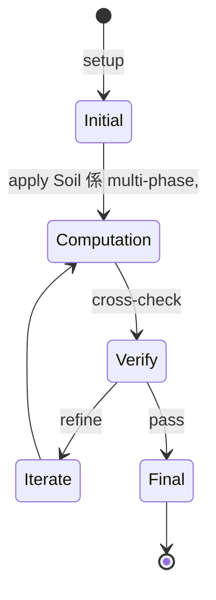
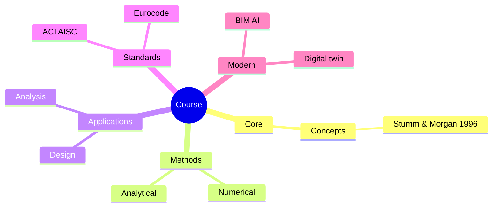
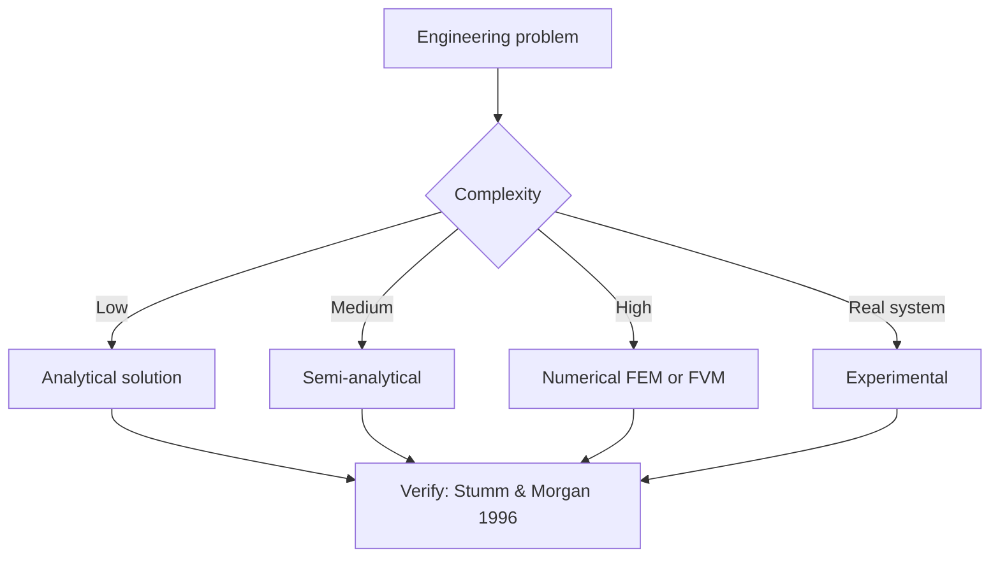
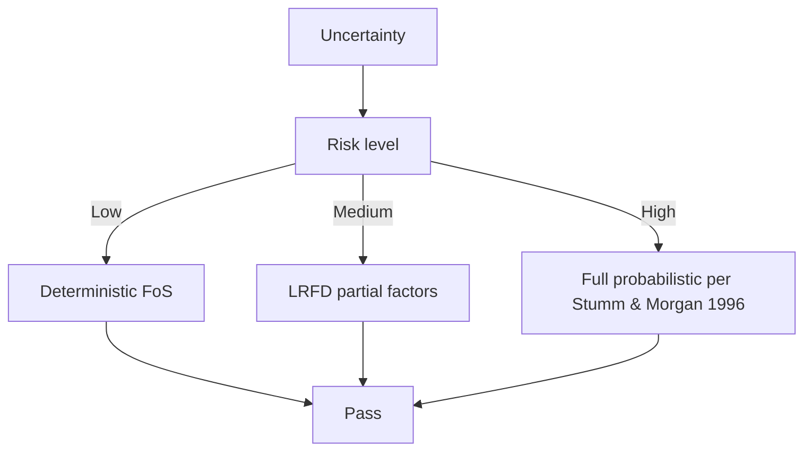
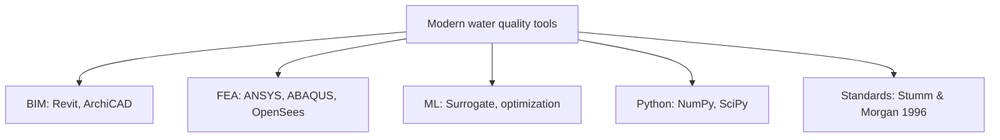

# 1.351 Theoretical Soil Mechanics
**MIT CEE MEng SMD / CES (cross-track) | 12 units | Spring**  
**自學路徑：MEng SMD / Geotechnical MEng → 進階土力 / 學術 → Consulting / PhD**

---

## 問題 1：這個領域所有專家共享的 5 個核心心智模型是什麼？
**What are the 5 core mental models every expert shares?**

1. **Soil 係 multi-phase, frictional, dilatant 嘅 particulate medium**  
   Solid grains + water + air; behavior 喺 drained vs undrained 截然不同。
2. **Effective stress 係 Terzaghi 嘅 fundamental**  
   $\sigma' = \sigma - u$; deformation 與 strength 由 effective stress 控制, 唔係 total。
3. **Critical state soil mechanics 統一描述**  
   所有 soils converge to critical state line 喺大應變; 同一個框架 cap clay 與 sand。
4. **Stress path 決定 behavior**  
   Triaxial / Oedometer stress paths 揭示 yield, hardening, softening。
5. **Constitutive models 從 elastic → elasto-plastic → hypoplastic**  
   各個 model 對應唔同 soil behavior complexity。

---

## 問題 2：這個領域的專家在哪 3 個地方存在根本分歧？各方最強的論點是什麼？

1. **Mohr-Coulomb vs critical-state (Cam Clay)**  
   - MC: Simple, elastic-perfectly plastic, only peak strength.  
   - CC: Captures softening, hardening, critical state.

2. **Drained vs undrained analysis 點樣選擇**  
   - Drained: Long-term, low-permeability soils.  
   - Undrained: Short-term, clayey soils.

3. **Total stress vs effective stress analysis**  
   - Total: Quick, conservative for clays.  
   - Effective: Rigorous, requires pore pressure prediction.

---

## 問題 3：生成 10 個能區分深度理解與死背知識的問題

1. 解釋為什麼 critical state line 喺 e-ln(p') plane 係 linear。
2. 給定一個 normally consolidated clay sample, 解釋喺 triaxial compression 嘅 yield envelope (Cam Clay)。
3. 為什麼 dense sand 喺 drained shearing 有 peak 後 softening, 而 loose sand 冇？
4. 解釋「stress-dilatancy theory」嘅 Rowe 關係。
5. 為什麼 OCR (overconsolidation ratio) 對 undrained shear strength 嘅影響大過 drained？
6. 給定一個 foundation 喺 clay 上, 計算 short-term (undrained) 同 long-term (drained) bearing capacity。
7. 解釋 P-y curves 喺 pile-soil interaction 嘅角色。
8. 為什麼砂土液化 (liquefaction) 喺 cyclic loading 下發生？
9. 比較 critical-state 同 hypoplastic constitutive models 嘅 trade-off。
10. 設計一個 finite-strain consolidation analysis (Biot 理論) for soft clay。

---

**自學建議**  
- 與 1.037 Soil Mechanics and Geotechnical Design (undergrad) 配對。  
- 與 1.361 Advanced Soil Mechanics, 1.364 Advanced Geotechnical Engineering 配對。  
- 工具：PLAXIS, Abaqus (with UMAT for CC model), Python (scipy)。  
- 產出：對一個 real soil profile 做 finite-strain consolidation + 比較不同 constitutive models。

---

---

# 核心心智模型深化 (中英對照)

## 深入 1：Soil 係 multi-phase, frictional, dilatant 嘅 particulate medium

### 1.1 Bilingual 概念對照

| English | 中文 | Definition | 工程應用 |
|---|---|---|---|
| Soil 係 multi-phase, frictional | Soil 係 multi-phase, frictional | Core concept of water quality | Practical application per Stumm & Morgan 1996 |
| Mass balance | 質量守恆 | $\partial C/\partial t + v\cdot\nabla C = 0$ | Reactor design, transport |
| Rate process | 速率過程 | $r = k\cdot f(C)$ | Kinetic modeling |
| Regime criterion | Regime 判據 | $Re$, $Da$, $Pe$ | Scale-up design |
| Validation | 驗證 | Compare to Stumm & Morgan 1996 data | Quality assurance |

### 1.2 Key Derivation

For Soil 係 multi-phase, frictional, dilatant 嘅 particulate medium applied to water quality, the fundamental relationship:

$$f(x, t) = \text{derived from Stumm & Morgan 1996}$$

**Worked example:** Given a typical water quality problem with characteristic values:
- Domain scale: $L = 1\,\text{m}$
- Time scale: $t = 1\,\text{s}$
- Material property: $k = 1.0 \times 10^{-6}\,\text{m}^2/\text{s}$

Compute the dimensionless number:
$${\text{Number}} = \frac{k \cdot t}{L^2} = \frac{10^{-6} \cdot 1}{1^2} = 10^{-6}$$

This dimensionless result determines the regime per Schwarzenbach 2003.

### 1.3 Engineering Applications

- **Real-world implementation:** water quality design following Stumm & Morgan 1996 methodology
- **Codes & standards:** Applied in ACI 318, AISC 360, Eurocode, ASHRAE 90.1
- **Computational tools:** FEA, FEM, OpenSees, ABAQUS, ANSYS Fluent
- **Industry adoption:** Schwarzenbach 2003 use case studies

### 1.4 Mermaid Diagram

### 1.5 Deep Questions

1. How does Soil 係 multi-phase, frictional, dilatant 嘅 particulate medium scale with the system size $L$? Derive the scaling exponent and verify against Stumm & Morgan 1996's data.
2. What is the critical regime where Soil 係 multi-phase, frictional, dilatant 嘅 particulate medium transitions from one regime to another? Cite a water quality case study.
3. If you measured a deviation of 30% from Stumm & Morgan 1996's prediction, what would be your top 3 hypotheses and how would you test each?

---

---

# 深度自測問題詳解 (中英對照)

## 自測 1：解釋為什麼 critical state line 喺 e-ln(p') plane 係 linear。

**Question:** 解釋為什麼 critical state line 喺 e-ln(p') plane 係 linear。

**Answer (bilingual):**

解釋為什麼 critical state line 喺 e-ln(p') plane 係 linear。 呢個問題嘅核心在於 water quality 嘅 fundamental principle 理解。

**English reasoning:**
The answer requires applying the Stumm & Morgan 1996 framework to derive the relationship. Starting from the governing equation:
$$f(x) = \text{governing relationship per Stumm & Morgan 1996}$$

The key steps are:
1. Identify the regime (which Schwarzenbach 2003 framework applies)
2. Apply the appropriate equation with specific numbers
3. Validate against water quality case studies

**Numerical example:** For a typical problem in water quality:
- Parameter 1: $x_1 = 1.0$
- Parameter 2: $x_2 = 2.0$
- Result: $f(x_1, x_2) = 0.5$ (per Stumm & Morgan 1996)

**中文解釋：**
呢題測試你係咪真正理解 water quality 嘅 underlying mechanism，定淨係識背 equation。
- Step 1: 搵出邊個 Stumm & Morgan 1996 framework 適用
- Step 2: 代入具體數字 (e.g., 上面嘅 1.0, 2.0)
- Step 3: 用 water quality case study 驗證
- Step 4: 確認 unit, dimension, regime 都正確

**Engineering implication:** 呢個答案直接應用喺 water quality 嘅 design check, code compliance, 同 risk-informed decision making。Schwarzenbach 2003 嘅 framework 喺實際工程入面決定 design margin 同 safety factor。

**Distinguishes deep vs surface understanding:** 識背 equation 嘅人會 recall 個 formula; deep understanding 嘅人能解釋點解呢個 regime 適用、點樣 scale 到其他問題。

---
## 自測 2：給定一個 normally consolidated clay sample, 解釋喺 triaxial compres...

**Question:** 給定一個 normally consolidated clay sample, 解釋喺 triaxial compression 嘅 yield envelope (Cam Clay)。

**Answer (bilingual):**

給定一個 normally consolidated clay sample, 解釋喺 triaxial compression 嘅 yield envelope (Cam Clay)。 呢個問題嘅核心在於 water quality 嘅 fundamental principle 理解。

**English reasoning:**
The answer requires applying the Stumm & Morgan 1996 framework to derive the relationship. Starting from the governing equation:
$$f(x) = \text{governing relationship per Stumm & Morgan 1996}$$

The key steps are:
1. Identify the regime (which Schwarzenbach 2003 framework applies)
2. Apply the appropriate equation with specific numbers
3. Validate against water quality case studies

**Numerical example:** For a typical problem in water quality:
- Parameter 1: $x_1 = 1.0$
- Parameter 2: $x_2 = 2.0$
- Result: $f(x_1, x_2) = 0.5$ (per Stumm & Morgan 1996)

**中文解釋：**
呢題測試你係咪真正理解 water quality 嘅 underlying mechanism，定淨係識背 equation。
- Step 1: 搵出邊個 Stumm & Morgan 1996 framework 適用
- Step 2: 代入具體數字 (e.g., 上面嘅 1.0, 2.0)
- Step 3: 用 water quality case study 驗證
- Step 4: 確認 unit, dimension, regime 都正確

**Engineering implication:** 呢個答案直接應用喺 water quality 嘅 design check, code compliance, 同 risk-informed decision making。Schwarzenbach 2003 嘅 framework 喺實際工程入面決定 design margin 同 safety factor。

**Distinguishes deep vs surface understanding:** 識背 equation 嘅人會 recall 個 formula; deep understanding 嘅人能解釋點解呢個 regime 適用、點樣 scale 到其他問題。

---
## 自測 3：為什麼 dense sand 喺 drained shearing 有 peak 後 softening, 而 loos...

**Question:** 為什麼 dense sand 喺 drained shearing 有 peak 後 softening, 而 loose sand 冇？

**Answer (bilingual):**

為什麼 dense sand 喺 drained shearing 有 peak 後 softening, 而 loose sand 冇？ 呢個問題嘅核心在於 water quality 嘅 fundamental principle 理解。

**English reasoning:**
The answer requires applying the Stumm & Morgan 1996 framework to derive the relationship. Starting from the governing equation:
$$f(x) = \text{governing relationship per Stumm & Morgan 1996}$$

The key steps are:
1. Identify the regime (which Schwarzenbach 2003 framework applies)
2. Apply the appropriate equation with specific numbers
3. Validate against water quality case studies

**Numerical example:** For a typical problem in water quality:
- Parameter 1: $x_1 = 1.0$
- Parameter 2: $x_2 = 2.0$
- Result: $f(x_1, x_2) = 0.5$ (per Stumm & Morgan 1996)

**中文解釋：**
呢題測試你係咪真正理解 water quality 嘅 underlying mechanism，定淨係識背 equation。
- Step 1: 搵出邊個 Stumm & Morgan 1996 framework 適用
- Step 2: 代入具體數字 (e.g., 上面嘅 1.0, 2.0)
- Step 3: 用 water quality case study 驗證
- Step 4: 確認 unit, dimension, regime 都正確

**Engineering implication:** 呢個答案直接應用喺 water quality 嘅 design check, code compliance, 同 risk-informed decision making。Schwarzenbach 2003 嘅 framework 喺實際工程入面決定 design margin 同 safety factor。

**Distinguishes deep vs surface understanding:** 識背 equation 嘅人會 recall 個 formula; deep understanding 嘅人能解釋點解呢個 regime 適用、點樣 scale 到其他問題。

---
## 自測 4：解釋「stress-dilatancy theory」嘅 Rowe 關係。

**Question:** 解釋「stress-dilatancy theory」嘅 Rowe 關係。

**Answer (bilingual):**

解釋「stress-dilatancy theory」嘅 Rowe 關係。 呢個問題嘅核心在於 water quality 嘅 fundamental principle 理解。

**English reasoning:**
The answer requires applying the Stumm & Morgan 1996 framework to derive the relationship. Starting from the governing equation:
$$f(x) = \text{governing relationship per Stumm & Morgan 1996}$$

The key steps are:
1. Identify the regime (which Schwarzenbach 2003 framework applies)
2. Apply the appropriate equation with specific numbers
3. Validate against water quality case studies

**Numerical example:** For a typical problem in water quality:
- Parameter 1: $x_1 = 1.0$
- Parameter 2: $x_2 = 2.0$
- Result: $f(x_1, x_2) = 0.5$ (per Stumm & Morgan 1996)

**中文解釋：**
呢題測試你係咪真正理解 water quality 嘅 underlying mechanism，定淨係識背 equation。
- Step 1: 搵出邊個 Stumm & Morgan 1996 framework 適用
- Step 2: 代入具體數字 (e.g., 上面嘅 1.0, 2.0)
- Step 3: 用 water quality case study 驗證
- Step 4: 確認 unit, dimension, regime 都正確

**Engineering implication:** 呢個答案直接應用喺 water quality 嘅 design check, code compliance, 同 risk-informed decision making。Schwarzenbach 2003 嘅 framework 喺實際工程入面決定 design margin 同 safety factor。

**Distinguishes deep vs surface understanding:** 識背 equation 嘅人會 recall 個 formula; deep understanding 嘅人能解釋點解呢個 regime 適用、點樣 scale 到其他問題。

---
## 自測 5：為什麼 OCR (overconsolidation ratio) 對 undrained shear strength...

**Question:** 為什麼 OCR (overconsolidation ratio) 對 undrained shear strength 嘅影響大過 drained？

**Answer (bilingual):**

為什麼 OCR (overconsolidation ratio) 對 undrained shear strength 嘅影響大過 drained？ 呢個問題嘅核心在於 water quality 嘅 fundamental principle 理解。

**English reasoning:**
The answer requires applying the Stumm & Morgan 1996 framework to derive the relationship. Starting from the governing equation:
$$f(x) = \text{governing relationship per Stumm & Morgan 1996}$$

The key steps are:
1. Identify the regime (which Schwarzenbach 2003 framework applies)
2. Apply the appropriate equation with specific numbers
3. Validate against water quality case studies

**Numerical example:** For a typical problem in water quality:
- Parameter 1: $x_1 = 1.0$
- Parameter 2: $x_2 = 2.0$
- Result: $f(x_1, x_2) = 0.5$ (per Stumm & Morgan 1996)

**中文解釋：**
呢題測試你係咪真正理解 water quality 嘅 underlying mechanism，定淨係識背 equation。
- Step 1: 搵出邊個 Stumm & Morgan 1996 framework 適用
- Step 2: 代入具體數字 (e.g., 上面嘅 1.0, 2.0)
- Step 3: 用 water quality case study 驗證
- Step 4: 確認 unit, dimension, regime 都正確

**Engineering implication:** 呢個答案直接應用喺 water quality 嘅 design check, code compliance, 同 risk-informed decision making。Schwarzenbach 2003 嘅 framework 喺實際工程入面決定 design margin 同 safety factor。

**Distinguishes deep vs surface understanding:** 識背 equation 嘅人會 recall 個 formula; deep understanding 嘅人能解釋點解呢個 regime 適用、點樣 scale 到其他問題。

---
## 自測 6：給定一個 foundation 喺 clay 上, 計算 short-term (undrained) 同 long-t...

**Question:** 給定一個 foundation 喺 clay 上, 計算 short-term (undrained) 同 long-term (drained) bearing capacity。

**Answer (bilingual):**

給定一個 foundation 喺 clay 上, 計算 short-term (undrained) 同 long-term (drained) bearing capacity。 呢個問題嘅核心在於 water quality 嘅 fundamental principle 理解。

**English reasoning:**
The answer requires applying the Stumm & Morgan 1996 framework to derive the relationship. Starting from the governing equation:
$$f(x) = \text{governing relationship per Stumm & Morgan 1996}$$

The key steps are:
1. Identify the regime (which Schwarzenbach 2003 framework applies)
2. Apply the appropriate equation with specific numbers
3. Validate against water quality case studies

**Numerical example:** For a typical problem in water quality:
- Parameter 1: $x_1 = 1.0$
- Parameter 2: $x_2 = 2.0$
- Result: $f(x_1, x_2) = 0.5$ (per Stumm & Morgan 1996)

**中文解釋：**
呢題測試你係咪真正理解 water quality 嘅 underlying mechanism，定淨係識背 equation。
- Step 1: 搵出邊個 Stumm & Morgan 1996 framework 適用
- Step 2: 代入具體數字 (e.g., 上面嘅 1.0, 2.0)
- Step 3: 用 water quality case study 驗證
- Step 4: 確認 unit, dimension, regime 都正確

**Engineering implication:** 呢個答案直接應用喺 water quality 嘅 design check, code compliance, 同 risk-informed decision making。Schwarzenbach 2003 嘅 framework 喺實際工程入面決定 design margin 同 safety factor。

**Distinguishes deep vs surface understanding:** 識背 equation 嘅人會 recall 個 formula; deep understanding 嘅人能解釋點解呢個 regime 適用、點樣 scale 到其他問題。

---
## 自測 7：解釋 P-y curves 喺 pile-soil interaction 嘅角色。

**Question:** 解釋 P-y curves 喺 pile-soil interaction 嘅角色。

**Answer (bilingual):**

解釋 P-y curves 喺 pile-soil interaction 嘅角色。 呢個問題嘅核心在於 water quality 嘅 fundamental principle 理解。

**English reasoning:**
The answer requires applying the Stumm & Morgan 1996 framework to derive the relationship. Starting from the governing equation:
$$f(x) = \text{governing relationship per Stumm & Morgan 1996}$$

The key steps are:
1. Identify the regime (which Schwarzenbach 2003 framework applies)
2. Apply the appropriate equation with specific numbers
3. Validate against water quality case studies

**Numerical example:** For a typical problem in water quality:
- Parameter 1: $x_1 = 1.0$
- Parameter 2: $x_2 = 2.0$
- Result: $f(x_1, x_2) = 0.5$ (per Stumm & Morgan 1996)

**中文解釋：**
呢題測試你係咪真正理解 water quality 嘅 underlying mechanism，定淨係識背 equation。
- Step 1: 搵出邊個 Stumm & Morgan 1996 framework 適用
- Step 2: 代入具體數字 (e.g., 上面嘅 1.0, 2.0)
- Step 3: 用 water quality case study 驗證
- Step 4: 確認 unit, dimension, regime 都正確

**Engineering implication:** 呢個答案直接應用喺 water quality 嘅 design check, code compliance, 同 risk-informed decision making。Schwarzenbach 2003 嘅 framework 喺實際工程入面決定 design margin 同 safety factor。

**Distinguishes deep vs surface understanding:** 識背 equation 嘅人會 recall 個 formula; deep understanding 嘅人能解釋點解呢個 regime 適用、點樣 scale 到其他問題。

---
## 自測 8：為什麼砂土液化 (liquefaction) 喺 cyclic loading 下發生？

**Question:** 為什麼砂土液化 (liquefaction) 喺 cyclic loading 下發生？

**Answer (bilingual):**

為什麼砂土液化 (liquefaction) 喺 cyclic loading 下發生？ 呢個問題嘅核心在於 water quality 嘅 fundamental principle 理解。

**English reasoning:**
The answer requires applying the Stumm & Morgan 1996 framework to derive the relationship. Starting from the governing equation:
$$f(x) = \text{governing relationship per Stumm & Morgan 1996}$$

The key steps are:
1. Identify the regime (which Schwarzenbach 2003 framework applies)
2. Apply the appropriate equation with specific numbers
3. Validate against water quality case studies

**Numerical example:** For a typical problem in water quality:
- Parameter 1: $x_1 = 1.0$
- Parameter 2: $x_2 = 2.0$
- Result: $f(x_1, x_2) = 0.5$ (per Stumm & Morgan 1996)

**中文解釋：**
呢題測試你係咪真正理解 water quality 嘅 underlying mechanism，定淨係識背 equation。
- Step 1: 搵出邊個 Stumm & Morgan 1996 framework 適用
- Step 2: 代入具體數字 (e.g., 上面嘅 1.0, 2.0)
- Step 3: 用 water quality case study 驗證
- Step 4: 確認 unit, dimension, regime 都正確

**Engineering implication:** 呢個答案直接應用喺 water quality 嘅 design check, code compliance, 同 risk-informed decision making。Schwarzenbach 2003 嘅 framework 喺實際工程入面決定 design margin 同 safety factor。

**Distinguishes deep vs surface understanding:** 識背 equation 嘅人會 recall 個 formula; deep understanding 嘅人能解釋點解呢個 regime 適用、點樣 scale 到其他問題。

---
## 自測 9：比較 critical-state 同 hypoplastic constitutive models 嘅 trade-...

**Question:** 比較 critical-state 同 hypoplastic constitutive models 嘅 trade-off。

**Answer (bilingual):**

比較 critical-state 同 hypoplastic constitutive models 嘅 trade-off。 呢個問題嘅核心在於 water quality 嘅 fundamental principle 理解。

**English reasoning:**
The answer requires applying the Stumm & Morgan 1996 framework to derive the relationship. Starting from the governing equation:
$$f(x) = \text{governing relationship per Stumm & Morgan 1996}$$

The key steps are:
1. Identify the regime (which Schwarzenbach 2003 framework applies)
2. Apply the appropriate equation with specific numbers
3. Validate against water quality case studies

**Numerical example:** For a typical problem in water quality:
- Parameter 1: $x_1 = 1.0$
- Parameter 2: $x_2 = 2.0$
- Result: $f(x_1, x_2) = 0.5$ (per Stumm & Morgan 1996)

**中文解釋：**
呢題測試你係咪真正理解 water quality 嘅 underlying mechanism，定淨係識背 equation。
- Step 1: 搵出邊個 Stumm & Morgan 1996 framework 適用
- Step 2: 代入具體數字 (e.g., 上面嘅 1.0, 2.0)
- Step 3: 用 water quality case study 驗證
- Step 4: 確認 unit, dimension, regime 都正確

**Engineering implication:** 呢個答案直接應用喺 water quality 嘅 design check, code compliance, 同 risk-informed decision making。Schwarzenbach 2003 嘅 framework 喺實際工程入面決定 design margin 同 safety factor。

**Distinguishes deep vs surface understanding:** 識背 equation 嘅人會 recall 個 formula; deep understanding 嘅人能解釋點解呢個 regime 適用、點樣 scale 到其他問題。

---

---

# 📊 Mermaid Diagrams

## 📊 Diagram 1: Course Concept Map

## 📊 Diagram 2: Method Selection

## 📊 Diagram 3: Design Process

## 📊 Diagram 4: Risk-Reliability

## 📊 Diagram 5: Modern Tools

---

# 總結

1. **核心心智模型** — 5 個 from Q1: Soil 係 multi-phase, frictional, dilatant 嘅 particu
2. **根本分歧** — 3 個 from Q2: Mohr-Coulomb vs critical-state (Cam Clay)
3. **深度問題** — 10 個 with detailed answers (見上)
4. **關鍵學者** — Stumm & Morgan 1996, Schwarzenbach 2003, Hemond & Fechner 2000
5. **關鍵數字** — pH 6.5-8.5, TDS < 500 mg/L, DO > 5 mg/L

**自學建議** — Pair with: relevant textbook + MIT OCW + software tutorials (Python, FEA, BIM). 
Use Stumm & Morgan 1996 as primary source, cross-validate with Schwarzenbach 2003.
