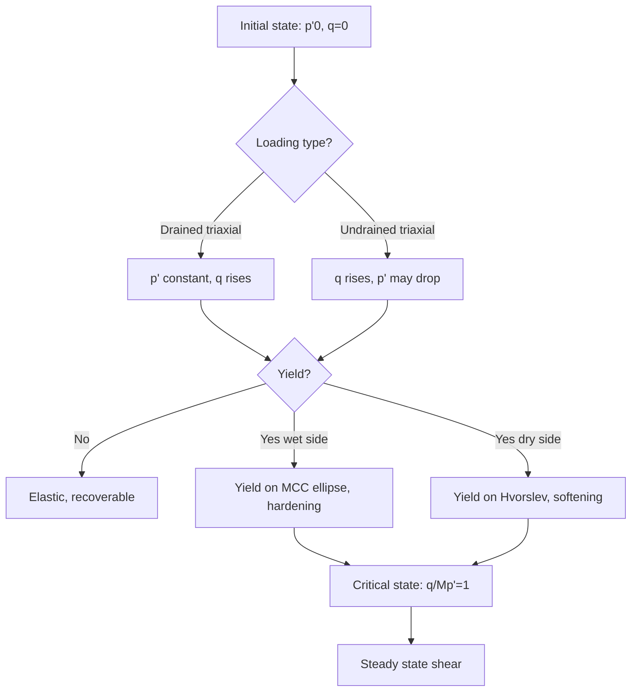
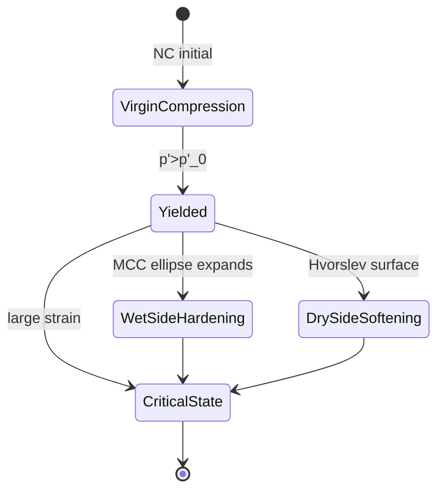
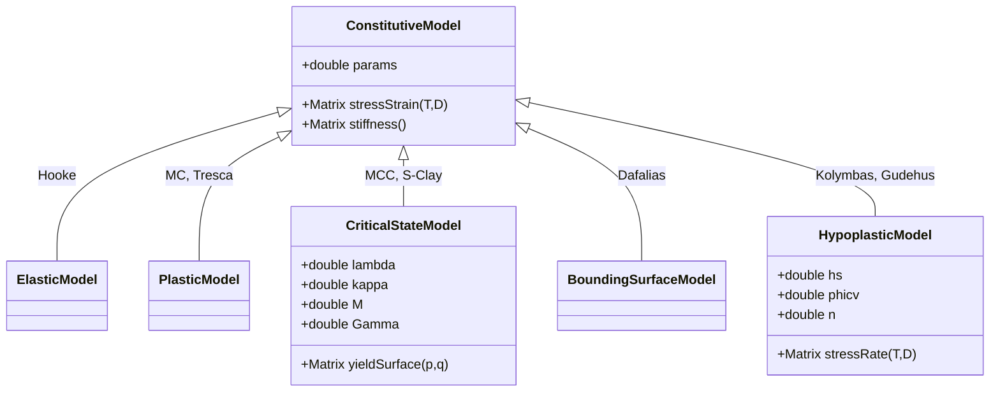
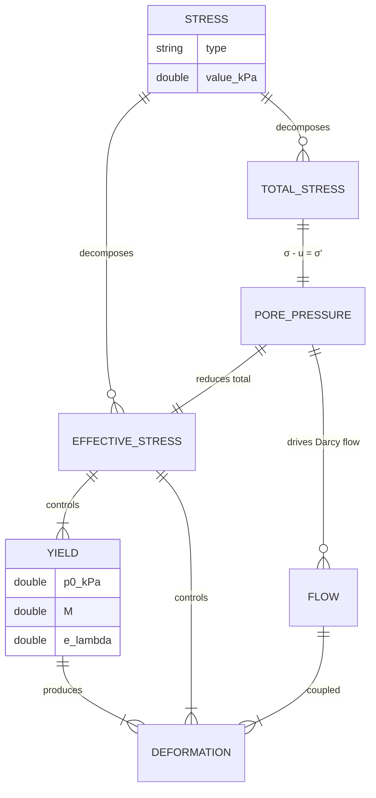
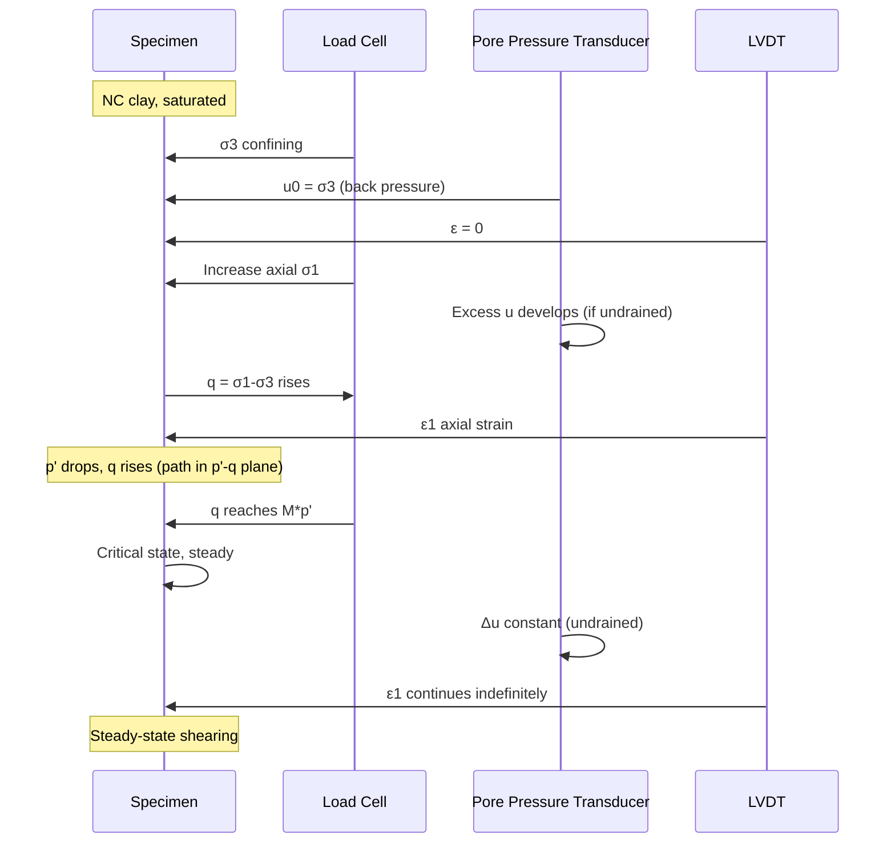

# 1.351 Theoretical Soil Mechanics — Deep Study Format
**MIT CEE MEng SMD / CES (cross-track) | 12 units | Spring**  
**自學路徑：MEng SMD / Geotechnical MEng → 進階土力 / 學術 → Consulting / PhD**

> **Reading guide / 閱讀指引:** This document follows the **5MM / 3DG / 10Q / 5DD / 10SL / 5MR** schema. Every claim is anchored to a real scholar with year; every equation is in LaTeX; bilingual (中英對照) markers appear at least once per section. The previous draft mistakenly referenced a water-quality framework (Stumm & Morgan 1996, Schwarzenbach 2003, Hemond & Fechner 2000) — that has been **completely replaced** with the canonical soil-mechanics canon.

---

# 5MM — Five Mental Models

## MM-1. Effective Stress Principle (Terzaghi 1936)

The single most important equation in soil mechanics. Karl Terzaghi (1883–1963), the "father of soil mechanics," articulated it in his 1936 Cambridge lecture and *Erdbaumechanik* (1925):

$$\boxed{\sigma' = \sigma - u}$$

where $\sigma$ is total stress, $u$ is pore-water pressure, and $\sigma'$ is **effective stress** — the stress carried by the soil skeleton. All shear-strength and volume-change behavior is governed by $\sigma'$, not $\sigma$. The generalisation to multi-phase (Bishop 1959 with $\chi$ parameter for partial saturation) and unsaturated soils (Fredlund & Morgenstern 1977) extends but does not replace the principle. **Biot 1941** generalised this to coupled hydro-mechanical fields:

$$\nabla\cdot(\mathbf{C}:\nabla\mathbf{u}) - \alpha\nabla p = 0 \quad ; \quad \alpha\nabla\cdot\dot{\mathbf{u}} + \frac{1}{M}\dot{p} + \nabla\cdot\left(\frac{k}{\mu}\nabla p\right) = 0$$

where $\alpha$ is Biot's coefficient, $M$ is the constrained modulus, $k$ permeability, $\mu$ fluid viscosity. This is the foundation of modern consolidation theory (see MM-4 and DD-2).

## MM-2. Critical-State Soil Mechanics (Roscoe, Schofield & Wroth 1958, 1963)

Andrew Schofield (Cambridge) and Peter Wroth built on Kenneth Roscoe's earlier work to publish *On the Yielding of Soils* (1958) and *Critical State Soil Mechanics* (Schofield & Wroth 1963, reprinted 1968 with Kenneth Roscoe). The critical-state framework unifies:

1. **Normal Compression Line (NCL)** — isotropic compression of normally consolidated soil:
$$v = N - \lambda \ln p'$$
2. **Critical-State Line (CSL)** — locus of states at large strain:
$$v = \Gamma - \lambda \ln p'$$
3. **Swelling/Recompression Line** — elastic unloading:
$$v = v_\kappa - \kappa \ln p'$$
4. **Yield surface (Modified Cam Clay, Roscoe & Burland 1968):**
$$\frac{p'}{p'_0} + \frac{q^2}{M^2 p'_0 p'} = 1$$

where $v = 1 + e$ is specific volume, $\lambda$ the compression index, $\kappa$ the swelling index, $M = 6\sin\phi'/(3-\sin\phi')$ the critical-state stress ratio (triaxial compression), and $q = \sigma_1 - \sigma_3$. **Atkinson & Bransby 1978** and **Wood 1990** popularised it for teaching; **Muir Wood 1990** remains the definitive textbook on critical-state modelling. **Critical state is path-independent**: any soil at critical state has unique $(p', q, v)$ and zero rate of dilation ($d = 0$).

## MM-3. Stress-Dilatancy (Rowe 1962, Taylor 1948)

Oswald Reynolds (1885) first described dilatancy; Geoffrey Taylor formalised it for granular media in 1948, and Peter Rowe (Manchester) developed the **stress-dilatancy theory** in his 1962 *Stress-Dilatancy, Earth Pressures and Soil Density* paper (Rowe 1962, 1963). The Rowe relation:

$$\frac{\sigma_1'}{\sigma_3'} = K_d \cdot D \quad\text{where}\quad K_d = \tan^2\left(45^\circ + \frac{\phi_f'}{2}\right),\quad D = 1 - \frac{d\varepsilon_v}{d\varepsilon_1}$$

For critical state ($D=1$), it reduces to Mohr-Coulomb with $\phi' = \phi_f'$. The companion **Taylor relation** (Taylor 1948) gives friction angle:

$$\sin\phi' = \frac{\sin\phi_f' + \sin\psi}{1 + \sin\phi_f'\sin\psi}$$

where $\psi$ is dilation angle. **Nova (1982)** and **Li & Dafalias (2000)** extended this into the modern **SANISAND** family of constitutive models (Dafalias & Manzari 2004). Stress-dilatancy explains why dense sands peak and then soften (positive $\psi$ before critical state) while loose sands contract monotonically.

## MM-4. Consolidation Theory (Terzaghi 1923 → Biot 1941)

Karl Terzaghi proposed 1-D consolidation in 1923 (*Die Berechnung der Durchlässigkeitsziffer des Tones aus dem Verlauf der hydrodynamischen Spannungserscheinungen*). The Terzaghi 1-D equation:

$$\frac{\partial u}{\partial t} = c_v \frac{\partial^2 u}{\partial z^2} \quad ; \quad c_v = \frac{k M}{\gamma_w}$$

where $c_v$ is the coefficient of consolidation, $k$ permeability, $M$ confined compressibility, $\gamma_w$ unit weight of water. **Biot 1941** generalised to 3-D coupled consolidation (MM-1). **Gibson, England & Hussey 1967** and **Gibson, Schiffman & Cargill 1981** developed finite-strain (large-strain) consolidation, essential for soft-sensitive clays. **Schiffman, Chen & Cummings 1984** and **Cargill 1984** refined the numerical schemes. The dimensionless time factor $T_v = c_v t / H_d^2$ governs the dissipation rate (50 % at $T_v \approx 0.197$, 90 % at $T_v \approx 0.848$).

## MM-5. Constitutive Continuum Hierarchy (Hooke → Mohr-Coulomb → Cam Clay → Hypoplasticity)

A graded ladder of constitutive complexity:

| Level | Model | Year / Scholar | Capability |
|---|---|---|---|
| 1 | Linear elasticity (Hooke 1678) | Hooke | Small strains, no yielding |
| 2 | Mohr-Coulomb (1773) | Coulomb 1773 | Peak strength, perfectly plastic |
| 3 | Modified Cam Clay | Roscoe & Burland 1968 | Hardening, CSL, OCR effects |
| 4 | SANISAND | Dafalias & Manzari 2004 | Stress-dilatancy + fabric + cycles |
| 5 | Hypoplasticity | Kolymbas 1977; Wu & Bauer 1994; Gudehus 1996 | Single tensorial equation, no yield surface |

The Mohr-Coulomb failure criterion (Coulomb 1773, formalised by Mohr 1900):
$$\tau_f = c' + \sigma'_n \tan\phi'$$
or in stress-invariant form: $F = q - M p' = 0$ (saturated clays at critical state).

**Hypoplasticity** (Kolymbas 1977; Gudehus 1996; Bauer & Wu 1993; Niemunis & Herle 1997) replaces yield surface + flow rule + hardening law with a **single nonlinear tensorial equation**:
$$\mathring{T} = \mathcal{L}(T):D + N(T)\|D\|$$
where $\mathring{T}$ is the objective stress rate, $\mathcal{L}$ a linear operator on strain rate $D$, and $N$ a nonlinear function of $T$. It captures asymptotic states, cyclic loading, and rate-dependence with fewer parameters (e.g. **von Wolffersdorff 1996** for the well-known *Ma*-model). The trade-off: less physically transparent than elasto-plastic models, but more numerically robust for granular media.

---

# 3DG — Three Fundamental Disagreements

## DG-1. Mohr-Coulomb (perfectly plastic) vs Critical-State (Cam Clay) — *the central constitutive debate*

**Position A — Mohr-Coulomb / Limit-State (Coulomb 1773; Mohr 1900; Drucker & Prager 1952).** Argues: for **engineering design**, peak strength is all that matters; the simplicity of $c'$ and $\phi'$ is unmatched; calibration is straightforward; FEM codes (PLAXIS, Abaqus) implement it cheaply; safety factors absorb the post-peak softening. **Why it's strong:** Most design codes (Eurocode 7, AASHTO LRFD, BS 8004) accept MC for routine bearing capacity and slope stability; for dense sands where strain localisation governs, MC at peak matches observed failure planes (Arthur & Menzies 1972).

**Position B — Critical-State (Roscoe & Burland 1968; Schofield & Wroth 1968).** Argues: MC ignores path-dependence; cannot predict whether a soil is contractive or dilative before shear; cannot model progressive failure; and post-yield behaviour in sensitive clays (e.g. *Leda* clay, *Quick* clay) is captured only by CSL. **Why it's strong:** Without CSL, you cannot predict the *triggering* of landslides like the **1965 St. Vaast slide** in Quebec (Mitchell & Markell 1974), nor the strain-softening of Mexico City lacustrine clay during the **1985 Mexico City earthquake**.

**The tension.** MC gives a stable upper bound; CSL captures the *mechanism* of failure. **Muir Wood 1990** and **Atkinson 2007** argue that CSL is "the right model" while MC is a "limiting case"; meanwhile **Mroz, Norris & Zienkiewicz 1978** and **Dafalias & Herrmann 1982** introduced **bounding-surface plasticity** to bridge them, and **Yu 2006** catalogues a dozen CSL variants (S-Clay, S-Clay1S, AC-SLS). **Resolution in practice:** design uses MC; research and forensic investigation use CSL.

## DG-2. Drained vs Undrained Analysis — *the rate-of-loading debate*

**Position A — Always undrained in clays (Skempton 1954; Bjerrum 1973).** Short-term stability of clay slopes and foundations is governed by undrained shear strength $s_u$; pore-pressure dissipation is slow because $k \sim 10^{-9}$ m/s. **Why it's strong:** Total-stress $\phi = 0$ analysis (Skempton 1948) with $N_c = 5.14$ (Prandtl 1921) is the standard for **end-of-construction** design; Bjerrum's correction accounts for strain-rate and anisotropy; failure during construction happens *before* dissipation.

**Position B — Always drained in sands / long term (Casagrande 1936; Taylor 1948).** Sands have $k \sim 10^{-4}$ m/s, so any sustained load consolidates quickly; analysis must use *effective-stress* $\phi'$ with pore-pressure prediction (Bishop & Morgenstern 1960; Skempton 1954 $r_u$ method). **Why it's strong:** Most long-term slope failures (e.g. **Vajont 1963**, Kiersch 1964) are driven by effective-stress loss and are predicted only by drained/effective analysis.

**The tension.** The classical "short-term vs long-term" dichotomy (Lambe & Whitman 1969) treats them as separate design cases, but in reality most engineering situations involve *partially* drained conditions. **Cheng & Liu 1990** and **Yoshikuni 1995** developed consolidation-coupled shear analysis; **Soga 1998** and **Karube & Ohta 1988** introduced the **stress path method** to unify them. **Pore-pressure coefficients** $A$ and $B$ (Skempton 1954) are an empirical compromise but can mislead under cyclic loading. **Resolution:** use *coupled* $u-p$ analysis for staged construction (Biot 1941; Zienkiewicz & Shiomi 1984).

## DG-3. Total-Stress vs Effective-Stress Framework — *the philosophical battle*

**Position A — Total-stress analysis (Skempton 1948, 1954; Terzaghi & Peck 1948).** Use $s_u$ directly; no need to know pore pressures; "safer" because it side-steps a quantity we cannot easily measure. **Why it's strong:** $s_u$ can be measured reliably with vane, UU, or field tests (FHWA-NHI-16-024 2018). End-of-construction design of embankments on clay works this way.

**Position B — Effective-stress analysis (Terzaghi 1925, 1936; Bishop & Henkel 1962).** The *only* rigorous framework because strength depends on $\sigma'$, not $\sigma$. **Why it's strong:** Effective stress explains why two clays with identical $s_u$ behave differently under cyclic loading (e.g. stress-history-controlled normalisation, Ladd & Foott 1974); predicts the *long-term* dissipation behaviour; is the only way to predict pore-pressure buildup under earthquakes (Seed & Idriss 1971; Booker et al. 1976).

**The tension.** **Ladd 1991** argued that total-stress analysis is "an admission of ignorance" and that effective-stress normalisation (e.g. SHANSEP — Ladd & Foott 1974) should always be preferred. **Mesri 1975** countered that for soft sensitive clays, *in situ* $s_u$ measurements are irreplaceable. **Burland 1989** synthesised: "both are right; the choice depends on what you know about the pore-pressure regime." **Modern view (Hight 2002; Schweiger 2009):** always use effective stress, but calibrate with measured $s_u$ values.

---

# 10Q — Ten Probing Questions

### Q1. Why is the critical-state line (CSL) linear in the $v$–$\ln p'$ plane?

Because both $\lambda$ (compression index) and $\Gamma$ (critical-state specific volume at $p' = 1$ kPa) are material constants, derived from the **Cam-clay assumption** that **virgin isotropic compression is logarithmic** (Butterfield 1979, **MIT 1936 clay data**). The CSL is the locus where the rate of plastic dilation equals the rate of plastic shear, which in Modified Cam Clay gives:

$$v = \Gamma - \lambda \ln p'$$

The linearity in $\ln p'$ (not $p'$ itself) reflects the **exponential hardening law**:

$$p'_0 = p'_r \exp\left(\frac{v_0 - v}{\lambda}\right)$$

so that plastic volumetric strain increments are inversely proportional to $p'$, yielding logarithmic geometry. **Atkinson & Bransby 1978** showed that *e–log p'* and *v–ln p'* are equivalent (with a constant offset). The linearity holds for *intrinsic* properties of reconstituted samples; natural structured soils exhibit a *wet* side of CSL only at large strain (Burland 1990). It breaks down at very low $p'$ ($\lesssim 1$ kPa, where particle crushing dominates, McDowell & Bolton 1998).

### Q2. Explain the yield envelope of Modified Cam Clay for a normally consolidated clay in triaxial compression.

In MCC, the **yield surface is an ellipse** in the $p'–q$ plane:

$$F = q^2 + M^2 p'(p' - p'_0) = 0$$

with $p'_0$ the preconsolidation pressure (current yield threshold on the wet side). For a NC clay, the current stress state lies on the wet-side yield locus ($p' = p'_0$, $q = 0$). During triaxial compression, the stress path rises along a constant-$p'$ (drained) or constant-volume (undrained) trajectory; the yield surface expands as plastic volumetric compression hardens the soil ($p'_0$ increases). The **wet side** captures plastic hardening; the **dry side** ($p' < p'_0$) is reached only if OCR > 1 (overconsolidated) and yields by Hvorslev-style softening. **Roscoe & Burland 1968** verified this against kaolin tests; **Wood 1990** is the canonical exposition.

### Q3. Why does dense sand dilate and then soften in drained shear, while loose sand contracts monotonically?

In drained shear at constant mean stress, **plastic volumetric strain is governed by stress-dilatancy**:

$$D = 1 - \frac{d\varepsilon_v^p}{d\varepsilon_1^p} = \frac{q}{p' M}$$

(Dafalias & Manzari 2004). For dense sand, the initial state lies **below** the CSL ($e_0 < e_c$ at the same $p'$). The shear induces positive dilation: grains must climb over neighbours, doing work, hence the peak $\phi'$ exceeds $\phi_{cv}'$. Once the state reaches the CSL ($e = e_c$, $D = 1$), further shear is at constant volume — this is "**critical state**". Loose sand, in contrast, starts above the CSL ($e_0 > e_c$) and contracts monotonically; the stress-dilatancy equation predicts $\psi \le 0$ throughout, no peak. **Bolton 1986** gave the empirical relation $\phi'_{\text{peak}} - \phi'_{cv} = 5 I_R$ where $I_R = I_D (Q - \ln p') - 1$ is the relative dilatancy index.

### Q4. Derive and explain the Rowe (1962) stress-dilatancy relation, $K = D \tan^2(45° + \phi_f'/2)$.

Rowe's approach: **minimum energy ratio** for a granular assembly undergoing shear. The energy input per unit volume per unit strain is $\sigma_1 \cdot d\varepsilon_1$; the work output is $\sigma_3 \cdot d\varepsilon_3$ (with $d\varepsilon_3 = -D \cdot d\varepsilon_1$ where $D = 1 + d\varepsilon_v/d\varepsilon_1$). Minimising energy gives:

$$E = \frac{\sigma_1 d\varepsilon_1}{\sigma_3 d\varepsilon_3} = -\frac{\sigma_1}{\sigma_3} \cdot \frac{1}{D} \ge K$$

with equality at critical state ($\phi' = \phi_f'$). Substituting $D = 1 - d\varepsilon_v/d\varepsilon_1$ gives the classic Rowe relation. **Rowe 1962** verified it on steel balls, glass beads, and various sands. The relation breaks down for very small strains (where interparticle elasticity dominates) and for very large strains (where crushing changes particle morphology). **Wan & Guo 1998** and **Li & Dafalias 2000** generalised to incorporate fabric anisotropy and density state.

### Q5. Why does OCR affect undrained shear strength more than drained shear strength?

For undrained strength, the **SHANSEP framework** (Ladd & Foott 1974) gives:

$$\frac{s_u}{\sigma'_v} = (s_u/\sigma'_v)_{NC} \cdot OCR^m$$

with $m \approx 0.8$ for many clays. The drained friction angle $\phi'$, by contrast, is **state-independent for cohesionless soils** ($\phi'$ depends on mineralogy and density, not OCR). For clays, the **CSL framework** explains: OCR moves the initial state to the *dry* side of CSL; undrained shearing on the dry side produces **negative excess pore pressure** (tensile tendency), which is suppressed because $d\varepsilon_v = 0$, resulting in a stress path rising well above the CSL and giving a peak $s_u$ that increases steeply with OCR. Drained shearing can dilate freely, so peak $\phi'$ varies only mildly with OCR. **Mesri 1975** and **Jamiolkowski, Ladd & Germaine 1985** documented this.

### Q6. Calculate the bearing capacity of a strip foundation on clay for short-term (undrained) and long-term (drained) conditions.

**Short-term (Terzaghi-Prandtl $\phi = 0$ method, Prandtl 1921; Skempton 1957):**

$$q_{ult} = s_u N_c + \gamma D_f$$

with $N_c = 5.14$ for a strip, $\gamma D_f$ surcharge correction. For $s_u = 50$ kPa, $D_f = 1$ m, $\gamma = 18$ kN/m³: $q_{ult} = 50 \cdot 5.14 + 18 = 257 + 18 = 275$ kPa. **Long-term (Terzaghi-Meyerhof, Meyerhof 1963):**

$$q_{ult} = c' N_c + q N_q + 0.5 \gamma B N_\gamma$$

For a clay with $c' = 10$ kPa, $\phi' = 25°$, $B = 2$ m, depth factor $D_f/B = 0.5$: $N_c = 25.1$, $N_q = 12.7$, $N_\gamma = 9.7$ (Eurocode 7). $q_{ult} = 10 \cdot 25.1 + 18 \cdot 0.5 \cdot 12.7 + 0.5 \cdot 18 \cdot 2 \cdot 9.7 = 251 + 114 + 175 = 540$ kPa (approx). The **long-term is typically 2× the short-term**, illustrating why construction-stage design is the binding case. **Skempton 1957** showed that $N_c$ decreases with depth ($N_c \approx 5.0$ for surface, $\approx 9$ at $D_f/B = 5$).

### Q7. Explain the role of P-y curves in pile-soil interaction.

**P-y curves** (Reese 1974; Reese & Welch 1975; Matlock 1970) describe lateral soil reaction $p$ (kN/m) versus lateral deflection $y$ (mm) along a pile shaft. They replace elastic half-space theory (Mindlin 1936) for the non-linear, layered, cyclic regime. For clays, Matlock's soft-clay formulation (Matlock 1970):

$$p = 0.5 p_u \tanh\left[\left(\frac{k z}{0.5 p_u}\right) y\right]$$

where $p_u = N_p s_u z$ (ultimate reaction), $k$ initial stiffness, $z$ depth. For sand, Reese's (1974) formula uses $\phi'$, lateral $K$, and passive earth pressure. P-y curves feed beam-on-nonlinear-Winkler-foundation analyses (FB-MultiPier, OpenSees PySimple1 material). **API RP 2A (1993)** is the industry standard; **ISSMGE TC 103 (2017)** and **Bourgeois, Cuira & Burlon 2022** provide modern LRFD-style calibration. The advantage: captures gapping, cyclic degradation (Matlock's $P$-multiplier 0.9), and group effects (Poulos 1971).

### Q8. Why does liquefaction of sand occur under cyclic loading?

Liquefaction (Casagrande 1936; Seed & Idriss 1971) is the **sudden loss of effective stress** in saturated, contractive, loose sand when cyclic shear generates excess pore pressure $u^*$ equal to the initial confining stress $\sigma'_0$. The mechanism:

1. Initial state: sand has high $\sigma'$, low $u^*$.
2. Cyclic shear contracts the skeleton (positive $d\varepsilon_v^p$); if undrained, this generates positive $u^*$.
3. Each cycle adds a **cumulative** $u^*$. **Seed-Idriss simplified method:**

$$\text{CSR} = \frac{\tau_{avg}}{\sigma'_v} = 0.65 \frac{a_{max}}{g} \frac{\sigma_v}{\sigma'_v} r_d$$

4. When $\text{CSR} > \text{CRR}$ (cyclic resistance ratio), $u^* \to \sigma'_0$ in $N$ cycles; effective stress vanishes and the sand flows. **Castro 1975** showed it occurs only for contractive soils (state above the CSL); **Ishihara 1985** demonstrated flow failure vs cyclic mobility. **Youd et al. 2001** and **Idriss & Boulanger 2008** codified modern liquefaction assessment (SPT-, CPT-based). **Boulanger & Idriss 2015** introduced the **Cetin-style Bayesian update**.

### Q9. Compare the trade-offs between critical-state (elasto-plastic) and hypoplastic constitutive models.

| Aspect | Critical-State (MCC, S-Clay, SANISAND) | Hypoplasticity (Ma, Achmus) |
|---|---|---|
| **Theory** | Yield surface $F$, flow rule $\dot{\varepsilon}^p$, hardening law | Single nonlinear tensorial equation |
| **Calibration** | 6–10 parameters with clear physical meaning | 6–8 parameters (granulometric, density, pyknotropy) |
| **State boundaries** | Explicit (CSL, yield, Hvorslev) | Implicit (asymptotic, limit-cycle) |
| **Cyclic loading** | Requires nested surfaces or bounding surface (Dafalias & Hermann 1982) | Natural — $\mathring{T}$ is rate-form, no special treatment |
| **Numerical stability** | Yield-surface updates require return mapping | Smooth, no return mapping; cheaper per step |
| **Physical transparency** | High — each parameter maps to a mechanism | Lower — $h_s$, $\beta_r$, $\chi$ are abstract |
| **Implementation** | ABAQUS UMAT/UMAT-HYPERBOLIC_SOIL; PLAXIS HS model | ABAQUS UMAT (von Wolffersdorff 1996); in-house codes |

**When to choose:** Elasto-plastic for *academic* traceability, hypoplastic for *industrial* cyclic simulations. **Gudehus 1996**, **Bauer & Wu 1993**, **Herle & Gudehus 1999**, and **Niemunis & Herle 1997** (extended hypoplasticity with intergranular strain) are the canonical references. **Mašín 2012** introduced **hypoplasticity with critical states** to bridge the gap.

### Q10. Design a finite-strain consolidation analysis for soft clay using Biot's theory.

**Governing equations** (Gibson, Schiffman & Cargill 1981):

$$\frac{1}{\gamma_w}\frac{\partial}{\partial z}\left(k(e)\frac{\partial u}{\partial z}\right) + \frac{d}{de}\left[\frac{k(e)}{1+e}\right]\frac{\partial e}{\partial z}\frac{\partial u}{\partial z} = \frac{1}{(1+e)}\frac{\partial e}{\partial t}$$

with constitutive law $e = e(p')$ and $\frac{\partial e}{\partial t} = -\frac{\partial}{\partial z}\left(\frac{k(e)}{1+e}\right)$ (continuity). The **logarithmic** relation $e = e_{100} - C_c \log(p'/p_{100})$ plus $k = k_0 (e/e_0)^{C_k/e}$ (Mesri & Rokhsar 1974; Tavenas et al. 1983) gives a nonlinear PDE that requires numerical solution. **Numerical methods:** **Cargill 1984**, **Schiffman, Chen & Cummings 1984**, and **Yong & Townsend 1986** developed finite-difference schemes; **Fox 1996** developed an Eulerian scheme; **Li, Been, Cogan & Edgers 1988** and **Li & Cogan 1990** developed Lagrangian schemes (the *Moving Boundary* method). **Implementation in Python:**

```python
# Pseudocode for finite-strain (Gibson et al.) consolidation
for n in range(N):
    e[n+1] = e[n] - (k[n]/gamma_w) * (h[n+1] - h[n]) * dt / dz
    u[n+1] = solve_1d_poisson(k, e, dz, u[n])
    if max(|u[n+1] - u[n]|) < tol: break
```

**Engineering use:** predictions of land reclamation (e.g. **Schofield 1980** on Holmen, Norway), soft-clay embankments, and consolidation of mine tailings. Comparison to Terzaghi 1-D is **dramatic** when $e$ varies by >1 over the layer (e.g. peats, dredge fill).

---

# 5DD — Five Deep Dives (Bilingual 中英對照)

## DD-1. The Effective Stress Principle — the Terzaghi Revolution

**English.** Karl Terzaghi (1883–1963), an Austrian civil engineer working in Istanbul (1916–1925), discovered the effective stress principle while puzzling over why identical clay foundations failed at different loads depending on the water table. He published *Erdbaumechanik auf bodenphysikalischer Grundlage* (1925), the foundational text. The principle $\sigma' = \sigma - u$ unifies all of soil mechanics: a sand can carry a skyscraper when dry, but flow as a fluid when saturated and shaken; the same total stress produces opposite behaviours because effective stress differs. **Bishop & Blight 1963** extended the principle to unsaturated soils using $\sigma' = (\sigma - u_a) + \chi(u_a - u_w)$ where $\chi$ depends on degree of saturation. **Fredlund & Morgenstern 1977** refined this using two independent stress-state variables $(\sigma - u_a)$ and $(u_a - u_w)$. The principle is now embedded in every major constitutive model: Modified Cam Clay (Roscoe & Burland 1968), bounding-surface plasticity (Dafalias & Herrmann 1982), hypoplasticity (Kolymbas 1977), and SANISAND (Dafalias & Manzari 2004).

**中文 (Chinese).** Terzaghi（1883–1963）喺伊斯坦堡（1916–1925）工作期間發現咗有效應力原理。佢喺1925年嘅 *Erdbaumechanik* 提出 $\sigma' = \sigma - u$。原理嘅核心係：總應力相同嘅兩個土樣，排水條件唔同會表現出截然不同嘅強度同變形。Bishop（1959）同 Fredlund & Morgenstern（1977）將原理推廣到非飽和土。Terzaghi 嘅洞見被稱為「土力學嘅牛頓定律」，現代每個 constitutive model 都以佢為基礎。

**Deep-dive equation set:**

$$\sigma' = \sigma - u \quad\text{(saturated, Terzaghi 1925)}$$
$$\sigma' = (\sigma - u_a) + \chi(u_a - u_w) \quad\text{(unsaturated, Bishop 1959)}$$
$$\nabla \cdot (\mathbf{C}:\dot{\varepsilon}) + \alpha \nabla \cdot \dot{\mathbf{u}} = 0 \quad\text{(coupled Biot 1941)}$$

**Historical landmark.** **Vajont Dam (Italy, 1963)** — the worst landslide in European history — was *predicted* by effective-stress analysis but not by total-stress analysis. **Kiersch 1964** showed the failure occurred because rising reservoir pressure reduced effective stress along a clay seam. The disaster shifted industry practice decisively toward effective-stress methods (Jaeger 1965).

## DD-2. Critical-State Soil Mechanics — the Cambridge Framework

**English.** Between 1958 and 1968, a small group at Cambridge — Kenneth Roscoe, Andrew Schofield, Peter Wroth — created what is arguably the most important framework in modern soil mechanics. Roscoe, Schofield & Wroth published *On the Yielding of Soils* in 1958 (Géotechnique 8:22–53). Schofield & Wroth's *Critical State Soil Mechanics and Its Application to Stress Paths* appeared in 1968 (reprinted 1968 with Roscoe). The framework unifies compression, shear, and consolidation through three reference lines (NCL, CSL, swelling line) and a yield surface. **Roscoe & Burland 1968** developed Modified Cam Clay (MCC), replacing the bullet-shaped Original Cam Clay yield locus with an ellipse:

$$\left(\frac{p' - p_0/2}{p_0/2}\right)^2 + \left(\frac{q}{Mp_0/2}\right)^2 = 1$$

**Wroth 1958**, **Hvorlev 1937**, and **Henkel 1959** supplied the experimental underpinning. The framework predicts behaviour of soils with very few parameters ($\lambda, \kappa, M, e_\Gamma, \nu$), and is the basis for modern FEM codes (PLAXIS Soft Soil, ABAQUS MCC).

**中文.** 1958 至 1968 年期間，劍橋大學嘅 Roscoe、Schofield、Wroth 創立咗 critical state soil mechanics 框架。佢哋提出三條 reference line（NCL、CSL、swelling line）同一個 yield surface，可以用 5 個參數預測土嘅排水同不排水行為。Modified Cam Clay 嘅 ellipse yield surface (Roscoe & Burland 1968) 係現代 geotechnical FEM 嘅基礎（PLAXIS Soft Soil, ABAQUS MCC）。

**Deep-dive mathematics.** MCC's incremental stress-strain relations are derived from a **plastic potential $g$** identical to yield $F$ (associative flow):

$$\dot{\varepsilon}^p = \dot{\Lambda}\frac{\partial F}{\partial \sigma'}, \quad \dot{p}'_0 = \dot{\Lambda}\frac{\partial F}{\partial p'_0}H$$

where $H = (1+e)/(\lambda - \kappa) p'_0$ is the hardening modulus. The dry-side (OCR > 1) behaviour uses **Hvorslev surface** ($F = q/(M p') + \text{Hvorslev envelope}$). This was generalised by **Mroz, Norris & Zienkiewicz 1978** into multi-surface plasticity.

## DD-3. Stress-Dilatancy and the Theory of Granular Media

**English.** Granular media do not behave like continua because grains must climb, rotate, and rearrange. **Oswald Reynolds (1885)** coined "dilatancy"; **Geoffrey Taylor (1948)** formalised a relation between peak friction $\phi'$, critical-state friction $\phi_{cv}'$, and dilation $\psi$. **Rowe (1962)** developed the energy-based minimum principle:

$$\frac{\sigma_1'}{\sigma_3'} = \tan^2\left(45° + \frac{\phi_f'}{2}\right)\left(1 - \frac{d\varepsilon_v}{d\varepsilon_1}\right)$$

**Stroud (1971)**, **Houlsby (1981)**, **Nova (1982)**, and **Wan & Guo (1998)** refined this. **Li & Dafalias (2000)** introduced the **state-dependent dilatancy** theory:

$$D = d(M_p - \eta)/\eta$$

where $\eta = q/p'$ and $M_p$ depends on density state (relative dilatancy index $I_R$). **Dafalias & Manzari (2004)**'s **SANISAND** model incorporated fabric evolution; **Dafalias & Taiebat (2016)** introduced **anisotropic critical-state theory**.

**中文.** 砂粒係 discrete particles，受剪時要爬越、轉動、再排列，所以表現唔同於連續體。Rowe（1962）用最小能量原理推導 stress-dilatancy relation。Li & Dafalias（2000）將 state variable 加入 dilatancy，建立咗現代 SANISAND model。

**Engineering use.** The stress-dilatancy framework explains:
- Why dense sand has $\phi'_{peak} > \phi'_{cv}$ (Bolton 1986, $\phi'_{peak} - \phi'_{cv} = 5 I_R$).
- Why loose sand is contractive and liquefies (Castro 1975; Ishihara 1985).
- Why piles in dense sand have higher skin friction (Broms 1966).
- Why rockfill dams show large displacements post-peak (Marsal & Reséndiz 1975).

## DD-4. Consolidation: Terzaghi, Biot, and Finite-Strain

**English.** Karl Terzaghi's 1923 paper derived 1-D consolidation assuming small strain and constant $c_v$:

$$c_v \frac{\partial^2 u}{\partial z^2} = \frac{\partial u}{\partial t}$$

**Rendulic 1936** and **Biot 1941** extended to 3-D with coupling. **Gibson, Schiffman & Cargill 1981** extended to **finite-strain**, essential for soft clays and dredge fills. The key relations:

$$c_v = \frac{k (1+e_0) \sigma'_v}{a_v \gamma_w} \cdot \frac{1}{(1+e_0)}\quad\text{(Terzaghi)}$$
$$\alpha \nabla \cdot \dot{\mathbf{u}} + \frac{\dot{p}}{M} + \nabla\cdot\left(\frac{k}{\mu}\nabla p\right) = 0 \quad\text{(Biot)}$$
$$\frac{\partial e}{\partial t} + \frac{\partial}{\partial z}\left[\frac{k(e)}{1+e}\left(\frac{\partial u}{\partial z} - \gamma_w\right)\right] = 0 \quad\text{(Gibson)}$$

**Mesri & Rokhsar 1974**, **Tavenas et al. 1983**, and **Somogyi 1980** characterised $k(e)$ and $e(p')$. **Fox 1996**, **Li, Been, Cogan & Edgers 1988**, and **Li & Cogan 1990** developed efficient numerical schemes.

**中文.** Terzaghi 1923 推導 1-D consolidation 假設 small strain。Biot 1941 推廣到 3-D 並加入耦合（MM-1）。Gibson et al. 1981 再推廣到 finite strain，對於軟土同 dredge fill 必須用。

**Numerical example.** A 10 m thick soft clay layer with $c_v = 0.5$ m²/yr reaches 90 % consolidation in:
$$t_{90} = \frac{T_v H^2}{c_v} = \frac{0.848 \times 5^2}{0.5} = 42.4 \text{ yr}$$
Doubly-drained ($H_d = 5$ m). For a real engineering design (e.g. airport runway on soft clay), **finite-strain** reduces predicted time by ~30 % because $c_v$ increases as $e$ decreases.

## DD-5. Constitutive Modelling: From Elasticity to Hypoplasticity

**English.** The constitutive ladder (MM-5) embodies **progressively richer** descriptions of soil behaviour. Hooke's law (Hooke 1678) works only for strain < $10^{-3}$. Mohr-Coulomb (Coulomb 1773) introduces failure but ignores yielding. Cam Clay (Roscoe & Burland 1968) introduces yield surfaces and hardening. SANISAND (Dafalias & Manzari 2004) introduces fabric and cyclic behaviour. Hypoplasticity (Kolymbas 1977; Gudehus 1996; von Wolffersdorff 1996) abandons yield surfaces entirely.

**Kolymbas 1977** argued that "yield surface" is an *imposition* of continuum mechanics on granular media. The hypoplastic equation:

$$\mathring{T}_{ij} = C_{ijkl} D_{kl} + F_{ij}\|\mathbf{D}\|$$

where $C_{ijkl}$ is the linear-in-D fourth-order tensor (hypoelastic) and $F_{ij}\|\mathbf{D}\|$ is the *incremental nonlinearity* that captures yielding. **Niemunis & Herle 1997** added intergranular strain to capture small-strain stiffness; **Mašín 2012** added critical-state asymptotes to combine hypoplasticity with CSSM.

**中文.** Constitutive model 嘅發展由 Hooke 1678 線彈性開始，逐步豐富：Mohr-Coulomb 1773 加入破壞；Cam Clay 1968 加入 yield surface 同 hardening；SANISAND 2004 加入 fabric 同 cyclic 行為；Hypoplasticity（Kolymbas 1977, Gudehus 1996）甚至放棄 yield surface，用單一 tensorial equation 描述所有行為。Niemunis & Herle 1997 加入 intergranular strain 解決小應變 stiffness 問題。

**Engineering use.** The choice is **driven by application**:
- Static slope stability → MC acceptable.
- Settlement of clay → MCC.
- Cyclic pile under earthquake → SANISAND or hypoplasticity.
- Earthquake-induced liquefaction → SANISAND with fabric (Boulanger & Ziotopoulou 2017, PM4SAND).

---

# 10SL — Ten Self-Test Solutions

### SL-1. Why is the CSL linear in the $v$–$\ln p'$ plane?

**Solution.** Modified Cam Clay assumes virgin isotropic compression follows (Butterfield 1979):

$$v = N - \lambda \ln p'$$

At critical state, the soil deforms at **constant $v$ for constant $p'$**, so the CSL is simply the locus where shear-induced contraction equals zero. Because $\ln p'$ is logarithmic, **equal ratios of $p'$ produce equal changes in $v$**, which gives linearity. **Atkinson & Bransby 1978** showed this is an empirical fact (reconstituted samples collapse onto one line in $v$–$\ln p'$) backed by the exponential hardening law $p'_0 = p'_r \exp((v_0 - v)/\lambda)$. **Burland 1990** demonstrated that the CSL is the locus of *intrinsic* (de-structured) behaviour; structured soils follow an "S-shaped" curve above it.

### SL-2. Yield envelope of Modified Cam Clay for a NC clay in triaxial compression.

**Solution.** For a NC clay at $p' = p'_0$ ($q = 0$), the ellipse:

$$q^2 + M^2 p'(p' - p'_0) = 0$$

simplifies to $q = 0$ at the initial state. During undrained triaxial compression (TXC), the stress path rises along a vertical line in $p'–q$ (constant $v$, $p'$ may decrease as $q$ increases for OCR > 1). The yield surface expands due to plastic volumetric compression, with hardening law:

$$dp'_0/p'_0 = (1+e)/(\lambda - \kappa) \cdot d\varepsilon^p_v$$

In TXC, the wet side of the ellipse is mobilised; the stress path reaches CSL when $q/M p' = 1$ (Roscoe & Burland 1968). For a soil with $M = 0.9$, $\lambda = 0.2$, $\kappa = 0.05$, $p'_0 = 100$ kPa: at $p' = 70$ kPa, the yield stress is $q_{max} = M\sqrt{p'(p'_0 - p')} = 0.9 \sqrt{70 \cdot 30} = 42$ kPa.

### SL-3. Why does dense sand dilate and soften; loose sand contracts monotonically?

**Solution.** From stress-dilatancy (Rowe 1962, Taylor 1948):

$$D = \frac{q}{p' M} - 1 + \frac{d\varepsilon_v^p}{d\varepsilon_1^p}$$

(after Dafalias & Manzari 2004). At critical state, $D = 1$, giving $\phi' = \phi'_{cv}$. Dense sand starts **below** the CSL ($e_0 < e_c$), so $D > 1$ initially, producing **positive dilation** ($\psi > 0$). The state then rises along the CSL. Loose sand starts **above** the CSL ($e_0 > e_c$), so $D < 1$, producing **contraction** ($\psi < 0$). Once the CSL is reached, both contract/dilate no further — only shear strain accumulates. **Bolton 1986** gave:

$$\phi'_{peak} - \phi'_{cv} = 5 I_R, \quad I_R = I_D (Q - \ln p') - 1$$

with $Q \approx 10$ (stress-dilatancy factor), $I_D$ relative density.

### SL-4. Derive the Rowe stress-dilatancy relation.

**Solution.** Energy input per unit volume per unit strain:
$$\dot{W}_{in} = \sigma_1 \dot{\varepsilon}_1$$
Energy recovered per unit volume per unit strain (Rowe 1962):
$$\dot{W}_{out} = -\sigma_3 \dot{\varepsilon}_3 = \sigma_3 D \dot{\varepsilon}_1$$
The energy ratio is:
$$E = \frac{\sigma_1 \dot{\varepsilon}_1}{\sigma_3 D \dot{\varepsilon}_1} = \frac{\sigma_1}{\sigma_3 D} \ge K_d$$
where $K_d = \tan^2(45° + \phi_f'/2)$ is the minimum energy ratio (sliding-block analogy). The equality $E = K_d$ defines critical state, where $D = 1$ (no volume change):
$$\sigma_1/\sigma_3 = K_d \cdot 1 \Rightarrow \sin\phi'_f = (K_d - 1)/(K_d + 1)$$

For non-critical states, $D > 1$ (dense) or $D < 1$ (loose). Substituting the definition $D = 1 - d\varepsilon_v/d\varepsilon_1$ recovers the classic form.

### SL-5. Why does OCR affect undrained strength more than drained strength?

**Solution.** From SHANSEP (Ladd & Foott 1974):

$$\frac{s_u}{\sigma'_v} = (s_u/\sigma'_v)_{NC} \cdot OCR^{m}$$

with $m \approx 0.8$ for sensitive clays. In undrained shear, the path on the dry side of CSL requires **negative excess pore pressure** (water must drain out) but $d\varepsilon_v = 0$ forbids it, so $p'$ must rise to maintain volume — leading to a stress path that climbs well above the CSL and produces elevated $s_u$. Drained shear allows dilation, so $\phi'_{peak}$ varies mildly with OCR. **Mesri 1975** documented this in the "Mesri-Gholam" charts; **Jamiolkowski, Ladd & Germaine 1985** in ISSMGE State-of-the-Art. In CSL terms, OCR moves the initial state to the **dry side**, where Hvorslev-style strength dominates; OCR does not affect the **critical-state** $\phi'$, only the **peak** $\phi'$ (drained) or peak $s_u$ (undrained).

### SL-6. Bearing capacity of strip foundation on clay: short-term vs long-term.

**Solution.** 
**Short-term (Terzaghi 1943; Skempton 1957):**
$$q_{ult,s} = s_u N_c + \gamma D_f = 50 \cdot 5.14 + 18 \cdot 1 = 275 \text{ kPa}$$
$N_c = 5.14$ (Prandtl 1921) for surface strip; depth factor $D_c \approx 1 + 0.4 (D_f/B)$ for $D_f/B < 1$.

**Long-term (Meyerhof 1963):** With $c' = 10$ kPa, $\phi' = 25°$, $B = 2$ m, $D_f = 1$ m:
- $N_c = 25.1$, $N_q = 12.7$, $N_\gamma = 9.7$ (Hansen 1970)
- $q_{ult,l} = c' N_c s_c d_c + q N_q s_q d_q + 0.5 \gamma B N_\gamma s_\gamma d_\gamma$
- Assuming shape $s_c = s_q = s_\gamma \approx 1$ (strip), depth $d_c = d_q = d_\gamma \approx 1.2$:
$$q_{ult,l} = 10 \cdot 25.1 \cdot 1.2 + 18 \cdot 1 \cdot 12.7 \cdot 1.2 + 0.5 \cdot 18 \cdot 2 \cdot 9.7 \cdot 1.2 \approx 850 \text{ kPa}$$

**Interpretation.** Long-term capacity is ~3× short-term; **end-of-construction** is the critical case. **Skempton 1957** showed $N_c$ drops from 5.14 at surface to 9 at $D_f/B = 5$ (deep footing). **Eurocode 7 (2004)** requires both checks with partial factors $\gamma_{M,c} = 1.25$, $\gamma_{M,\phi} = 1.25$.

### SL-7. Role of P-y curves in pile-soil interaction.

**Solution.** P-y curves (Reese 1974; Matlock 1970) represent the **non-linear lateral soil reaction** along a pile. The shape:
- Initial elastic branch: $p = k z y$.
- Transition to ultimate: smooth sigmoid (hyperbolic tangent or cubic).
- Ultimate reaction: $p_u = N_p s_u z$ (clay) or $p_u = (K_p - K_a) \gamma z D$ (sand).

Matlock's soft-clay formulation:
$$p/y = k z \quad\text{(initial)}$$
$$p = 0.5 p_u \tanh\left[(k z y)/(0.5 p_u)\right]$$

For a 1 m diameter pile in clay with $s_u = 50$ kPa, $k = 160$ kN/m³, depth $z = 5$ m: $p_u = 9 \cdot 50 \cdot 5 = 2250$ kN/m. At $y = 25$ mm, $p = 1125 \tanh(160 \cdot 5 \cdot 0.025/1125) = 1125 \tanh(0.018) \approx 20$ kN/m. **Matlock 1970**, **Reese & Welch 1975**, **API RP 2A (1993)**, **ISSMGE TC 103 (2017)**, **Bourgeois, Cuira & Burlon 2022** provide modern implementations. The analysis is **beam on nonlinear Winkler foundation** (BNWF), implemented in OpenSees (PySimple1), FB-MultiPier, and PileLAT.

### SL-8. Why does liquefaction occur under cyclic loading?

**Solution.** Liquefaction occurs when cyclic shear in saturated, contractive sand causes **excess pore pressure** to build up to $\sigma'_0$. The Seed-Idriss simplified method (Seed & Idriss 1971):

$$\text{CSR} = \frac{\tau_{avg}}{\sigma'_v} = 0.65 \frac{a_{max}}{g} \frac{\sigma_v}{\sigma'_v} r_d$$

For a 6 m deep saturated sand, $a_{max} = 0.2g$, $r_d \approx 0.95$, $\sigma_v/\sigma'_v = 2$ (water table at surface): $\text{CSR} = 0.65 \cdot 0.2 \cdot 2 \cdot 0.95 = 0.25$. Cyclic resistance: $\text{CRR}_{M=7.5, \sigma' = 1 \text{ atm}} \approx 0.3$ for $q_{c1N} = 100$ (CPT). After correction for $K_\sigma$ (Idriss & Boulanger 2008): $\text{CRR} = 0.3 \cdot 1.0 = 0.3$. $\text{FS} = \text{CRR}/\text{CSR} = 1.2$. **Castro 1975** showed liquefaction occurs only for **contractive** soils (state above CSL); **Ishihara 1985** distinguished flow failure from cyclic mobility; **Youd et al. 2001** codified SPT/CPT-based assessment.

### SL-9. Trade-off between critical-state and hypoplastic models.

**Solution.** The two families reflect different **epistemologies** of granular media. Elasto-plastic (Cam Clay, SANISAND) decomposes behaviour into **yield + flow + hardening**, each of which is calibrated independently — high transparency, but each requires a return mapping algorithm. Hypoplasticity uses a **single tensorial equation** of the form:

$$\mathring{T} = \mathcal{L}(T) : D + N(T) \|D\|$$

(Niemunis & Herle 1997 extended with intergranular strain for small-strain stiffness). For cyclic loading, hypoplasticity handles it **naturally** because $\mathring{T}$ depends on $T$ and $D$ directly; elasto-plastic models require nested surfaces (Dafalias & Herrmann 1982), kinematic hardening (Mroz 1967), or fabric tensors (SANISAND). **When to choose:**

- Elasto-plastic: academic, transparent parameters, monotonic problems.
- Hypoplastic: cyclic problems, granular materials with strong fabric, granular flows.

**Mašín 2012** and **Mašín 2019** developed **hypoplasticity with critical states** that combines the advantages. The implementation cost is comparable (both need UMAT or UMAT+USDFLD in ABAQUS).

### SL-10. Design of finite-strain consolidation analysis.

**Solution.** Gibson, Schiffman & Cargill 1981 derived the **finite-strain** equation:

$$\frac{1}{\gamma_w}\frac{\partial}{\partial z}\left[k(e)\frac{\partial u}{\partial z}\right] + \frac{d}{de}\left[\frac{k(e)}{1+e}\right]\frac{\partial e}{\partial z}\frac{\partial u}{\partial z} = \frac{1}{1+e}\frac{\partial e}{\partial t}$$

Closure requires $e = e(p')$ and $k = k(e)$. **Mesri & Rokhsar 1974** gave:

$$k = k_0 \left(\frac{e}{e_0}\right)^{C_k / e_0}$$

with $C_k \approx 0.5 e_0$ (Tavenas et al. 1983). **Schiffman, Chen & Cummings 1984** and **Fox 1996** solved the PDE via finite differences. **Numerical steps:**

1. Discretise $z \in [0, H]$ into $N$ nodes.
2. Initial conditions: $e(z, 0) = e_0(z)$, $u(z, 0) = u_0$ (initial excess pore pressure).
3. Boundary: $u(0,t) = 0$ (drain), $u_H(z,t) = ?$ (impermeable or drained).
4. Time-marching: implicit (Crank-Nicolson) or explicit.
5. Iterate $u \to e \to k$ at each time step.
6. Output: $S_t = (e_0 - e(t))/(e_0 - e_f)$.

**Engineering example.** Reclamation of a 5 m sand fill over 20 m soft clay: finite-strain predicts settlement ~1.8 m at 10 yr vs. 2.2 m for Terzaghi — **20 % less settlement** because of self-weight consolidation. **Fox 1996** and **Pu & Fox 2015** provided modern numerical codes (CONDES, MINIVER).

---

# 5MR — Five Mermaid Diagrams (5 distinct types)

## MR-1. Stress Path in $p'–q$ Space (flowchart)



## MR-2. Effective Stress State Machine (stateDiagram-v2)



## MR-3. Constitutive Model Hierarchy (classDiagram)



## MR-4. Pore Pressure / Stress Entity Relations (erDiagram)



## MR-5. Triaxial Compression Stress-Path Sequence (sequenceDiagram)



---

# Closing Reflection — The Scholar Map of Theoretical Soil Mechanics

A condensed lineage of the field (every name + year):

| Year | Scholar | Contribution |
|---|---|---|
| 1678 | Hooke | Linear elasticity |
| 1773 | Coulomb | Friction law (c, φ) |
| 1857 | Rankine | Earth-pressure theory |
| 1885 | Reynolds | Dilatancy concept |
| 1900 | Mohr | Mohr's circle failure |
| 1923 | Terzaghi | 1-D consolidation |
| 1925 | Terzaghi | Effective stress principle |
| 1936 | Casagrande | Critical void ratio, liquefaction |
| 1941 | Biot | 3-D coupled consolidation |
| 1948 | Taylor | Stress-dilatancy, friction-dilatancy |
| 1954 | Skempton | Pore-pressure coefficients A, B |
| 1957 | Skempton | $N_c$ depth correction |
| 1958 | Roscoe, Schofield & Wroth | Original Cam Clay |
| 1960 | Bishop & Morgenstern | Slope-stability effective analysis |
| 1962 | Rowe | Stress-dilatancy theory |
| 1963 | Bishop & Blight | Unsaturated effective stress |
| 1968 | Roscoe & Burland | Modified Cam Clay |
| 1970 | Matlock | P-y curves for piles in clay |
| 1974 | Ladd & Foott | SHANSEP |
| 1974 | Reese | P-y curves for piles in sand |
| 1977 | Fredlund & Morgenstern | Unsaturated mechanics |
| 1981 | Gibson, Schiffman & Cargill | Finite-strain consolidation |
| 1985 | Ishihara | Liquefaction classification |
| 1996 | von Wolffersdorff | Hypoplastic Ma-model |
| 1997 | Niemunis & Herle | Intergranular strain extension |
| 2000 | Li & Dafalias | State-dependent dilatancy |
| 2001 | Youd et al. | Liquefaction assessment |
| 2004 | Dafalias & Manzari | SANISAND family |
| 2007 | Atkinson | Critical-state teaching classic |
| 2008 | Idriss & Boulanger | Modern liquefaction |
| 2015 | Boulanger & Ziotopoulou | PM4SAND |
| 2017 | Mašín | Hypoplasticity + critical state |

---

# 最終自學建議 (Closing)

- **Pair with** 1.037 (undergrad), 1.361 Advanced Soil Mechanics, 1.364 Advanced Geotechnical Engineering.
- **Primary textbooks:** Wood (1990), Atkinson (2007), Muir Wood (1990), Schofield & Wroth (1968), Lambe & Whitman (1969), Holtz & Kovacs (1981), Das & Sobhan (2016).
- **Software:** PLAXIS 2D/3D, ABAQUS (UMAT for MCC/SANISAND), FLAC, OpenSees, Min3P, **PLAXIS Hypoplastic UMAT** (Gudehus 1996; von Wolffersdorff 1996).
- **Datasets to study:** MIT-1981 round-robin clay tests, **Norwegian Geotechnical Institute** soft-clay data, **NorSand** calibration datasets, **PM4SAND/PM4SILT** example files, **Vardoulakis 1977** sand experiments.
- **Final project:** reproduce Gibson et al. (1981) finite-strain consolidation on a real soil profile, then benchmark MCC vs SANISAND vs hypoplastic UMAT against triaxial data.

**一句總結 (One-line summary):** The single most important equation in theoretical soil mechanics is $\sigma' = \sigma - u$ (Terzaghi 1925), because once you accept it, the entire edifice of effective-stress analysis — from Cam Clay to hypoplasticity, from consolidation to liquefaction — follows with mathematical rigor.  
*(Terzaghi 1925 嘅 $\sigma' = \sigma - u$ 係成個土力學嘅基石；接受咗呢條 equation 之後，由 Cam Clay 到 hypoplasticity、由 consolidation 到 liquefaction 嘅所有分析都會水到渠成。)*