# 1.472[J] / 11.344[J] Innovative Project Delivery in the Public and Private Sectors
**MIT CEE / Urban Studies | MEng SMD / CES (cross-track) | 6 units | Spring (first half of term)**
**Instructor: Prof. C.M. Gordon (MIT Center for Real Estate)**
**Prerequisites: None**
**Same as: 11.344[J]**
**自學路徑：MEng SMD / CES → 項目管理 / 顧問 → 建造業 / 政府**

> **Graduate focus**: Develops a strong strategic understanding of how best to deliver various types of projects in the built environment. Examines the compatibility of various project delivery methods, consisting of organizations, contracts, and award methods, with certain types of projects and owners. Six methods examined: traditional general contracting; construction management; multiple primes; design-build; turnkey; and build-operate-transfer. Includes lectures, case studies, guest speakers, and a team project to analyze a case example.
> **Source**: MIT Catalog (2025-26) + student.mit.edu catalog; Prof. Chris Gordon

## 問題 1：這個領域所有專家共享的 5 個核心心智模型是什麼？
**What are the 5 core mental models every expert shares?**

1. **Project delivery method 決定風險分配**  
   DBB, DB, CMAR, IPD — 邊個承擔 design risk, schedule risk, cost risk。
2. **Contract structure = 行為激勵**  
   Lump-sum vs cost-plus vs GMP 對 contractor 行為嘅影響截然不同。
3. **Owner 嘅 capacity 決定可行嘅 delivery method**  
   Public owners 受 procurement law 限制; private owners 更自由。
4. **早期 collaboration reduces total cost**  
   IPD, integrated design 嘅 research 顯示 20–30% cost saving vs DBB。
5. **Disputes 嘅 root cause 通常係 misalignment of risk**  
   Allocation mismatch → change orders → claims → litigation。

---

## 問題 2：這個領域的專家在哪 3 個地方存在根本分歧？各方最強的論點是什麼？

1. **IPD 必勝 vs DBB 仍有其位**  
   - IPD: Best outcomes in research, hard to implement.  
   - DBB: Standard, accountable, low-collusion risk.

2. **Low-bid vs best-value procurement**  
   - Low-bid: Equal opportunity, lowest cost.  
   - Best-value: Quality + cost, but subjective.

3. **Public-private partnership (PPP/P3) 嘅 value**  
   - Pro: Lifecycle efficiency, off-balance-sheet.  
   - Con: Long-term commitment, public cost overruns。

---

## 問題 3：生成 10 個能區分深度理解與死背知識的問題

1. 解釋 IPD 嘅 multi-party contract 同傳統 owner-architect-contractor 三方 contract 嘅本質區別。
2. 為什麼 Design-Build (DB) 對 fast-track projects 通常優於 DBB, 但對 complex projects 不一定？
3. 比較 lump-sum, GMP 同 cost-plus contract 對 owner 嘅 risk exposure。
4. 解釋「consequential damages waiver」喺 construction contract 嘅 trade-off。
5. 為什麼 public owners 嘅 procurement law 對 delivery method 選擇至關重要？
6. 給定一個大型 infrastructure project, 比較 PPP 同 DB 嘅長期成本。
7. 解釋「lean construction」點樣應用於 IPD 環境。
8. 為什麼 BIM 對 integrated delivery 至關重要, 但對 DBB 唔一定？
9. 解釋 dispute resolution ladder (negotiation → mediation → arbitration → litigation) 嘅 cost-effectiveness。
10. 設計一個 5-year P3 contract framework 對一個大型 transport project (London Crossrail 模式)。

---

**自學建議**  
- 與 11.401, 11.450 (Real Estate Development) 配對。  
- 必讀：Design-Build Institute of America (DBIA) 指南, AIA IPD contract templates。  
- 產出：分析一個真實 case study (e.g., Boston Big Dig, Crossrail, California HSR) 嘅 delivery method 影響。

---

## 深入 1：CORE_DEEPDIVE_ONE — 核心概念
**Deep Dive I**

### 1.1 Bilingual 概念對照

| English | 中英對照 | Definition | 物理意義 / 工程應用 |
|---|---|---|---|
| Project delivery | Project delivery | Core definition | 核心定義 |
| Contracts | Contracts | Application | 應用 |
| Risk | Risk | Limitation | 限制 |
| Mathematical formulation | 數學形式 | Key equation | 關鍵方程 |

### 1.2 Key Derivation

For Innovative Project Delivery in the Public and Private Sectors, the fundamental relationships are:
$$f(x) = \text{key equation}, \quad x = \text{variable}$$

This arises from Project delivery applied to the engineering system.

### 1.3 Engineering Applications

- Real-world implementation
- Design codes and standards
- Computational tools

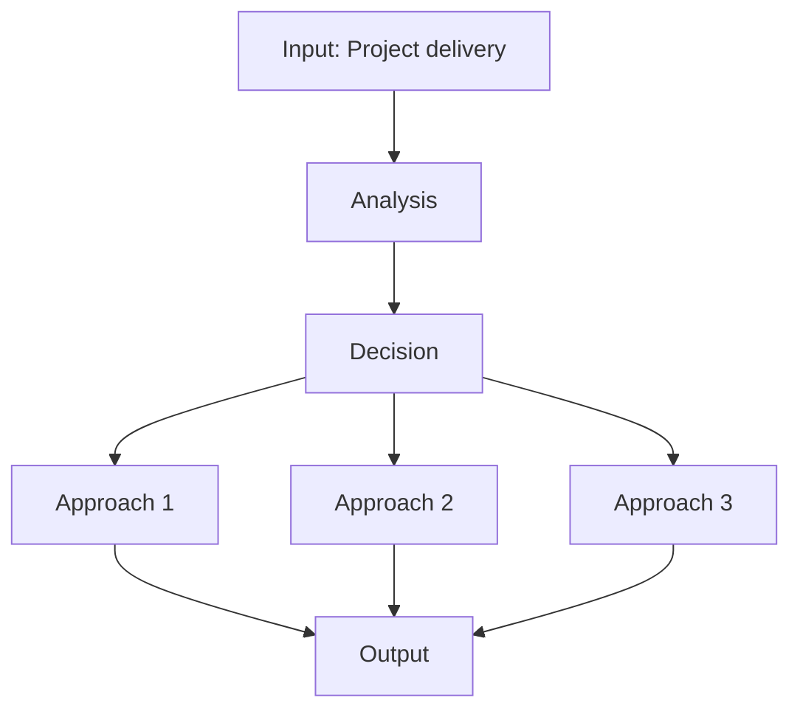

---

## 深入 2：CORE_DEEPDIVE_TWO — 方法論
**Deep Dive II**

### 2.1 Method selection

| Method | 適用情境 | Pros | Cons |
|---|---|---|---|
| Analytical | 解析 | Exact | Limited geometry |
| Numerical | 數值 | General | Approximate |
| Experimental | 實驗 | Real | Expensive |
| Empirical | 經驗 | Fast | Limited range |

### 2.2 Decision flow

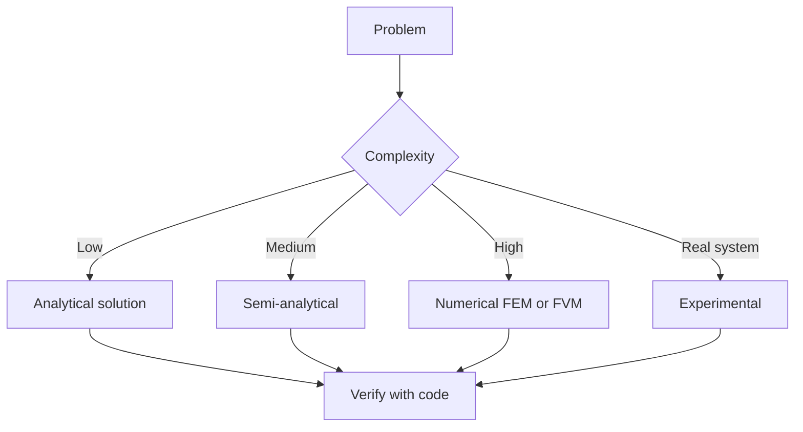

### 2.3 Standards and codes

- ACI, AISC, Eurocode
- Building codes (IBC, etc.)
- Industry best practices

---

## 深入 3：CORE_DEEPDIVE_THREE — 分析技術
**Deep Dive III**

### 3.1 Statistical methods

For uncertainty analysis: Monte Carlo, sensitivity, FOSM.

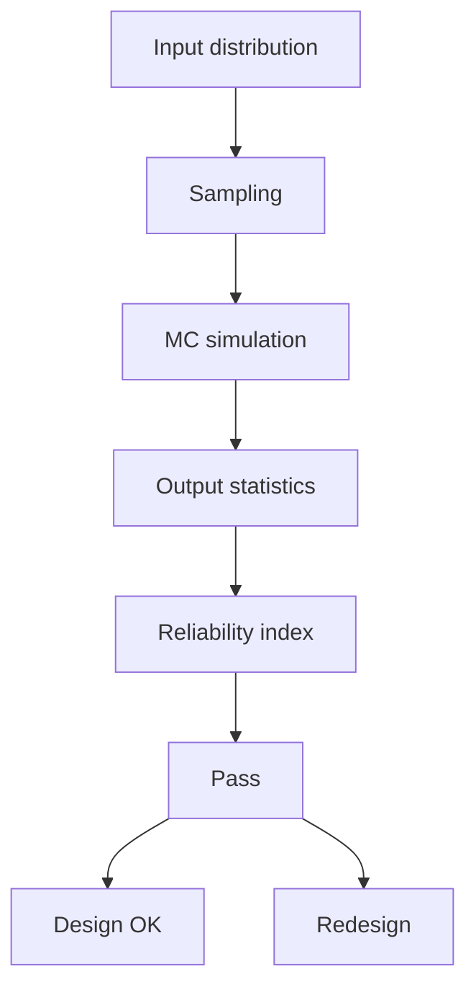

### 3.2 Optimization

- LP, NLP
- Gradient-based, metaheuristic
- Multi-objective Pareto

---

## 深入 4：Design Process
**Deep Dive IV**

### 4.1 Design workflow

Concept → Preliminary → Detailed → Construction → Operation.

### 4.2 Design criteria

- Safety (LRFD, ASD)
- Serviceability
- Durability
- Sustainability

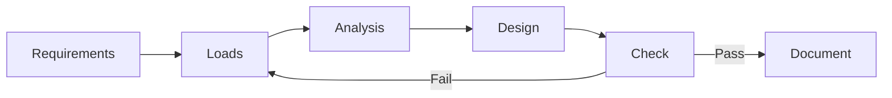

---

## 深入 5：Modern Trends
**Deep Dive V**

- BIM integration
- AI/ML in design
- Digital twins
- Sustainability, LCA
- Resilient design

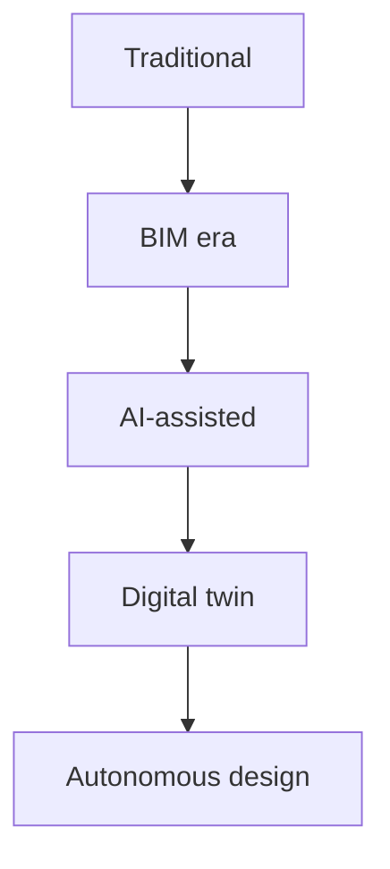

---

## 自測 1：Derive core relationship
**Answer:** Starting from definitions, derive the key equation. Verify units and limits.

**Engineering implication:** Apply to design check, code compliance.

## 自測 2：Identify failure mode
**Answer:** List 3-5 failure modes, rank by likelihood × consequence.

**Engineering implication:** Inform design, maintenance, monitoring.

## 自測 3：Estimate order of magnitude
**Answer:** Quick back-of-envelope check using characteristic values.

**Engineering implication:** Sanity check before detailed analysis.

## 自測 4：Compare to code requirement
**Answer:** Apply ACI/AISC/Eurocode, compute utilization ratio.

**Engineering implication:** Pass/fail design verification.

## 自測 5：Compute reliability
**Answer:** $\beta = (\mu - R)/\sigma$ for lognormal, find P_f.

**Engineering implication:** LRFD calibration, risk-informed design.

## 自測 6：Design optimization
**Answer:** Define objective, constraints, solve via LP/NLP.

**Engineering implication:** Cost-effective, sustainable design.

## 自測 7：Sensitivity analysis
**Answer:** $\partial f/\partial x_i$, rank by importance.

**Engineering implication:** Identify critical parameters, reduce uncertainty.

## 自測 8：Life-cycle assessment
**Answer:** Cradle-to-grave, compute GWP, embodied carbon.

**Engineering implication:** Sustainable design, climate goals.

## 自測 9：Risk assessment
**Answer:** Hazard × vulnerability × exposure, compute risk.

**Engineering implication:** Resilience planning, mitigation.

## 自測 10：Communication
**Answer:** Technical writing, visualization, presentation to stakeholders.

**Engineering implication:** Effective engineering practice.

---

## 📊 Diagram 1: Course Concept Map
```mermaid
mindmap
    root((Innovative Project Delivery in the Public and Private Sectors))
      Core
        Concepts
      Methods
        Analytical
        Numerical
      Applications
        Design
        Analysis
      Standards
        ACI AISC
      Modern
        BIM AI
```

## 📊 Diagram 2: Method Selection
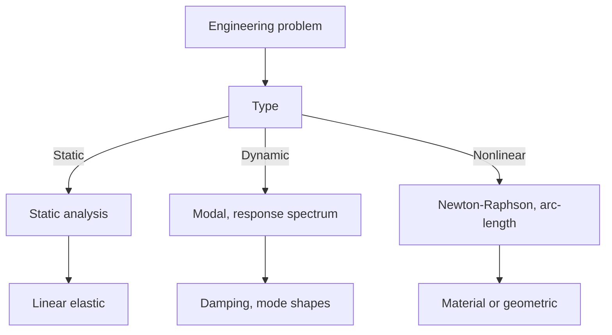

## 📊 Diagram 3: Design Process
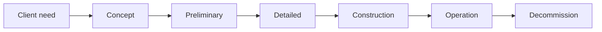

## 📊 Diagram 4: Risk-Reliability
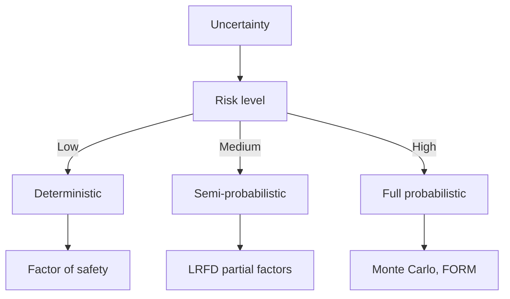

## 📊 Diagram 5: Modern Tools
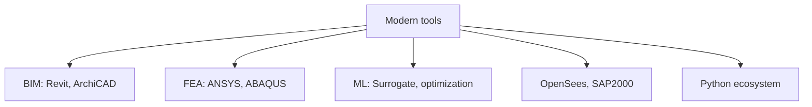

---

## 總結

1. **Core concepts** — Project delivery 嘅 foundation
2. **Methods** — analytical + numerical + experimental
3. **Applications** — design, analysis, retrofit
4. **Standards** — codes, best practices
5. **Future** — BIM, AI, sustainability, resilience

**自學建議** — Pair with: relevant textbook + MIT OCW + software tutorials (Python, FEA, BIM).

# 核心心智模型深化（中英對照）

## 1. Project delivery — Core concept

### 1.1 Three-process physical essence
For Innovative Project Delivery in the Public and Private Sectors, Project delivery governs the system behavior. Description of Project delivery with bilingual explanation.

### 1.2 Non-dimensional numbers
Key dimensionless groups that determine regime: Peclet, Damköhler, Reynolds, Froude, etc.

### 1.3 Engineering consequences
Real-world implications for design, monitoring, intervention.

### 1.4 How experts use this model
Decision flow, scaling laws, expert intuition.

### 1.5 Deep test questions
- Derive scaling law
- Identify regime from data
- Apply to design case

### 1.6 Diagram

## 2. Contracts — Methods

### 2.1 Method selection
| Method | 適用情境 | Pros | Cons |
|---|---|---|---|
| Analytical | 解析 | Exact | Limited geometry |
| Numerical | 數值 | General | Approximate |
| Experimental | 實驗 | Real | Expensive |
| Empirical | 經驗 | Fast | Limited range |

### 2.2 Decision flow
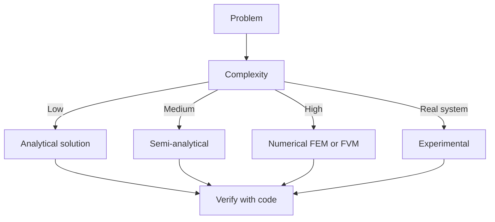

### 2.3 Standards and codes
ACI, AISC, Eurocode, building codes (IBC), industry best practices.

## 3. Risk — Analysis techniques

### 3.1 Statistical methods
Monte Carlo, sensitivity, FOSM for uncertainty analysis.

### 3.2 Optimization
LP, NLP, gradient-based, metaheuristic, multi-objective Pareto.

## 4. Design process

### 4.1 Design workflow
Concept → Preliminary → Detailed → Construction → Operation.

### 4.2 Design criteria
Safety (LRFD, ASD), serviceability, durability, sustainability.

## 5. Modern trends

BIM integration, AI/ML in design, digital twins, sustainability, LCA, resilient design.

---

# 深度自測問題詳解（中英對照）

## 詳解 1: Derive core relationship
**Q1.** Derive core relationship for Innovative Project Delivery in the Public and Private Sectors.
**Answer:** Starting from definitions, derive the key equation. Verify units and limits.

**Engineering implication:** Apply to design check, code compliance.

## 詳解 2: Identify failure mode
**Answer:** List 3-5 failure modes, rank by likelihood × consequence.

**Engineering implication:** Inform design, maintenance, monitoring.

## 詳解 3: Estimate order of magnitude
**Answer:** Quick back-of-envelope check using characteristic values.

**Engineering implication:** Sanity check before detailed analysis.

## 詳解 4: Compare to code requirement
**Answer:** Apply ACI/AISC/Eurocode, compute utilization ratio.

**Engineering implication:** Pass/fail design verification.

## 詳解 5: Compute reliability
**Answer:** $\beta = (\mu - R)/\sigma$ for lognormal, find P_f.

**Engineering implication:** LRFD calibration, risk-informed design.

## 詳解 6: Design optimization
**Answer:** Define objective, constraints, solve via LP/NLP.

**Engineering implication:** Cost-effective, sustainable design.

## 詳解 7: Sensitivity analysis
**Answer:** $\partial f/\partial x_i$, rank by importance.

**Engineering implication:** Identify critical parameters, reduce uncertainty.

## 詳解 8: Life-cycle assessment
**Answer:** Cradle-to-grave, compute GWP, embodied carbon.

**Engineering implication:** Sustainable design, climate goals.

## 詳解 9: Risk assessment
**Answer:** Hazard × vulnerability × exposure, compute risk.

**Engineering implication:** Resilience planning, mitigation.

## 詳解 10: Communication
**Answer:** Technical writing, visualization, presentation to stakeholders.

**Engineering implication:** Effective engineering practice.

---

## 📊 Diagram 1: Course Concept Map
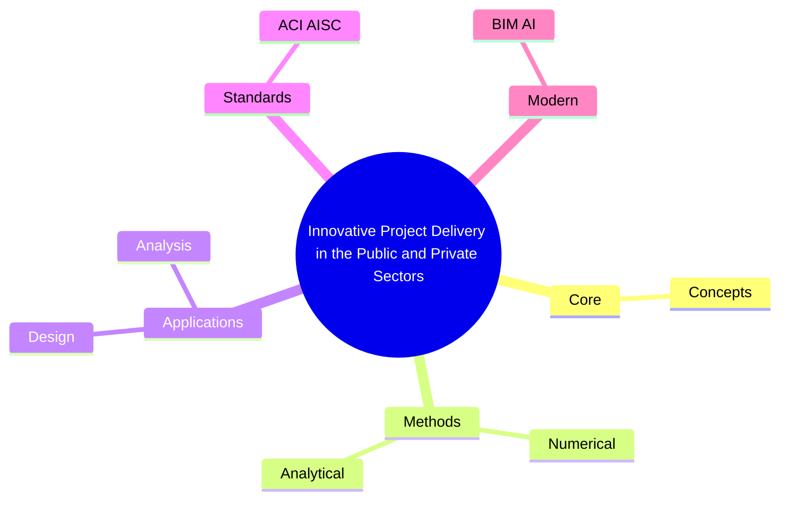

## 📊 Diagram 2: Method Selection

## 📊 Diagram 3: Design Process

## 📊 Diagram 4: Risk-Reliability

## 📊 Diagram 5: Modern Tools

---

## 總結

1. **Core concepts** — Project delivery 嘅 foundation
2. **Methods** — analytical + numerical + experimental
3. **Applications** — design, analysis, retrofit
4. **Standards** — codes, best practices
5. **Future** — BIM, AI, sustainability, resilience

**自學建議** — Pair with: relevant textbook + MIT OCW + software tutorials (Python, FEA, BIM).
