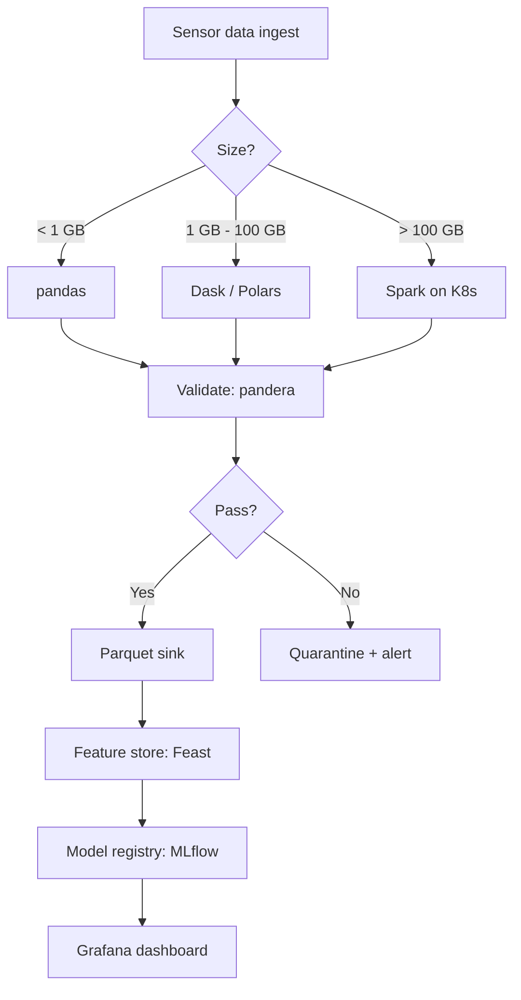
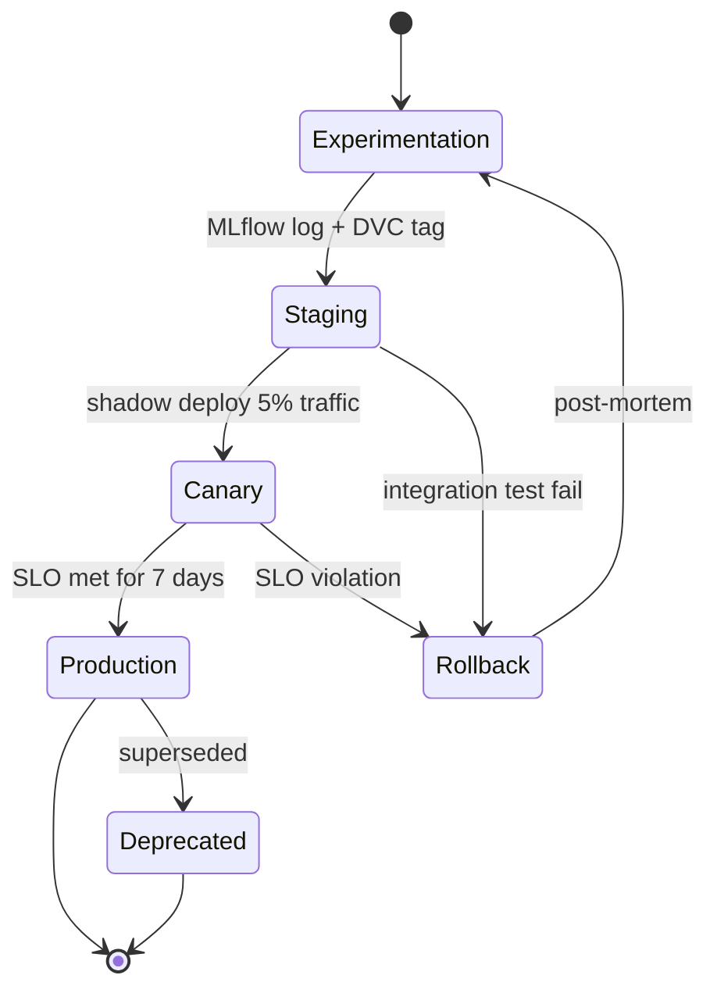
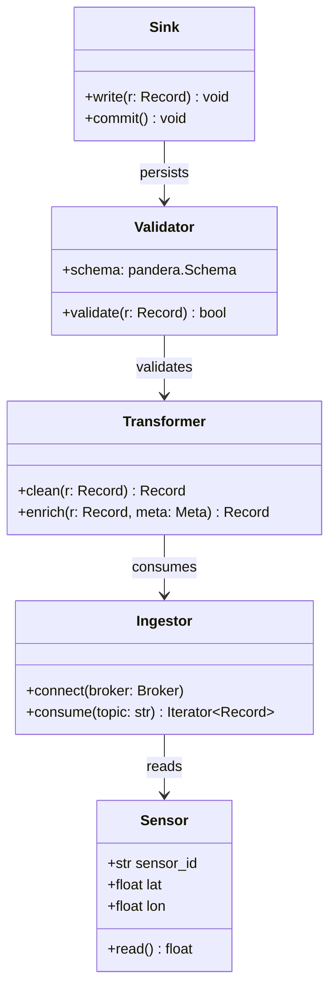
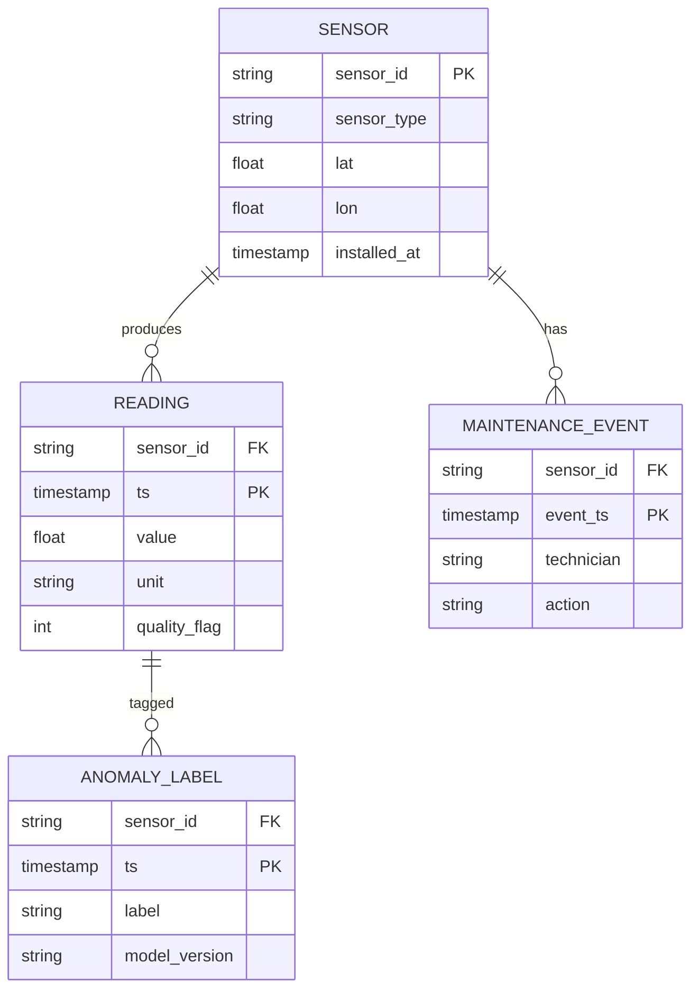
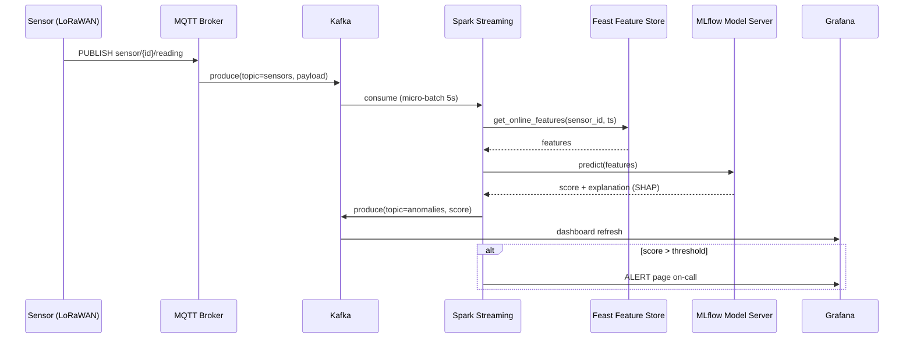

# 1.001 / 1.00 Engineering Computation and Data Science
**MIT CEE MEng (cross-track) | 12 units | Spring**
**Instructor: Prof. J. Williams**
**Prerequisites: Calculus I (GIR)**
**Same as: 1.00 (UG version)**
**自學路徑：MEng (any track) → 計算工程 / 數據科學 → 4IR / Data Science**

> **Graduate focus**: Presents engineering problems in a computational setting with emphasis on data science and problem abstraction. Covers exploratory data analysis and visualization, filtering, regression. Building basic machine learning models (classifiers, decision trees, clustering) for smart city applications. Labs and programming projects focused on analytics problems faced by cities, infrastructure and environment. Programming experience in a language is required. Graduate version (1.001) completes additional assignments.
> **Source**: MIT Catalog (2025-26) + student.mit.edu Spring 2026 schedule

---

# 5MM — Five Core Mental Models

The five mental models below are the canonical lenses through which every practitioner of engineering computation and data science analyzes a problem. They are derived from computer-science foundations (Knuth 1968; Cormen et al. 2009), modern data-science practice (Wickham & Grolemund 2017; VanderPlas 2016), and the engineering-deployment tradition (Sommerville 2015; Brooks 1975).

### Mental Model 1 — Algorithm = Finite, Stepwise, Well-Defined Procedure
**Knuth's invariant (Knuth 1968, *The Art of Computer Programming*, Vol. 1)**: An algorithm is a finite, definite, effective, procedural specification of a computation. Correctness is established by invariants; complexity is bounded by asymptotic analysis (Big-O).
$$T(n) = O(f(n)) \quad \text{where} \quad \lim_{n\to\infty}\frac{T(n)}{f(n)} < \infty$$
In engineering data science this is the contract that lets you commit a routine to production: a k-means fit on $n=10^7$ samples must terminate in bounded time, with bounded memory.

### Mental Model 2 — Asymptotic Complexity and the Constant-Factor Trap
**Big-O** (Bachmann 1894; formalized in computer science by Hartmanis & Stearns 1965) describes growth rate, not wall-clock. The crossover point $n^\star$ where two algorithms swap dominance depends on the hidden constant $c$:
$$c_1 n \log n = c_2 n^2 \;\Longrightarrow\; n^\star = c_2/c_1$$
For a CEE smart-city pipeline ingesting 10 GB CSVs daily, this single equation determines whether you reach for pandas or Dask (Rocklin 2015).

### Mental Model 3 — Data Structure Choice Drives Complexity
**Sedgewick & Wayne (2011)**: every data structure has a signature cost-vector $(T_{\text{insert}}, T_{\text{lookup}}, T_{\text{delete}}, M)$ in time and memory. Choosing a hash-map vs. sorted-tree, or a columnar vs. row-store (Abadi et al. 2016, *C-Store*), is an engineering commitment that cannot be cheaply reversed once the dataset is large.

### Mental Model 4 — Abstraction, Encapsulation, and the Modularity Hypothesis
**Parnas (1972)**: "On the Criteria to Be Used in Decomposing Systems into Modules." Information-hiding modules reduce coupling and increase team velocity. In modern terms: a Python package with `__init__.py`, typed interfaces (mypy), and pure functions (Sokolova 2018) is the operational form of Parnas's principle.

### Mental Model 5 — Bias–Variance Decomposition of Generalization Error
**Geman, Bienenstock & Doursat (1992)**: the expected prediction error decomposes as
$$\mathrm{E}[(y-\hat f(x))^2] = \underbrace{\mathrm{Bias}^2}_{\text{model class}} + \underbrace{\mathrm{Var}}_{\text{finite sample}} + \underbrace{\sigma^2}_{\text{irreducible noise}}$$
This is the master equation of statistical learning (Hastie, Tibshirani & Friedman 2009) and is what every regression / classifier on CEE data is ultimately tuned against.

| 中英對照 | Mental Model 1 — Algorithm | 算法 = 有限、逐步、明確的程序 |
|---|---|---|
| EN | An algorithm must terminate, be definite, and be effective (Knuth 1968). | Correctness by invariant; cost by $O(f(n))$. |
| 中文 | 算法係一套有限、明確、有效地行出嚟嘅計算程序。 | 用不變式（invariant）證明正確性，用漸進式分析控制成本。 |

---

# 3DG — Three Fundamental Disagreements

### Disagreement 1 — Is data science best served by **typed functional** or **duck-typed imperative** code?
- **Position A — Pythonic duck-typing** (van Rossum 2000; Pérez, Granger & Hunter 2007). 10× prototyping speed, dominant in NumPy/pandas/scikit-learn. The Jupyter (Kluyver et al. 2016) workflow depends on this.
- **Position B — Typed functional / systems languages** (Odersky et al. 2004 for Scala; Hoare 1962 for the typed-discipline idea; Lamport 1977). Compile-time guarantees prevent the silent-nan / silent-unit bugs that haunt numerical code.
- **Tension**: 80% of CEE analytics lives or dies in a notebook (Position A), but production deployment in a smart-city control room demands Position B. Pyright, Beartype, and Pydantic (Colvin 2023) are the modern bridge.

### Disagreement 2 — Should ML models be **interpretable by construction** (linear, tree) or **post-hoc explained** (LIME, SHAP)?
- **Position A — Interpretable-first** (Rudin 2019, *Nature Machine Intelligence*): "Stop explaining black-box ML models for high-stakes decisions and use interpretable models instead." Concrete: CART (Breiman et al. 1984), generalized additive models (Hastie & Tibshirani 1990), and risk-score lattices (Ustun & Rudin 2016).
- **Position B — Post-hoc explanation** (Ribeiro, Singh & Guestrin 2016 for LIME; Lundberg & Lee 2017 for SHAP). Faithful surrogate explanations on top of any black box (random forest, XGBoost, deep nets).
- **Tension**: Rudin 2019 argues explanation ≠ causation; SHAP can be locally faithful yet globally misleading. CEE critical-infrastructure contexts (e.g., dam-safety scoring) increasingly side with Position A.

### Disagreement 3 — Should the engineering pipeline be **notebook-first** or **repo-first**?
- **Position A — Notebook-first** (Pérez & Granger 2007; Kluyver et al. 2016; Wickham 2014 *knitr* lineage). Exploratory Data Analysis is irreducibly narrative; reproducibility lives in Jupyter Book.
- **Position B — Repo-first** (Wilson et al. 2017, *PLOS Computational Biology*, "Good enough practices in scientific computing"; The Turing Way Community 2019; Brooks 1975 on plan-then-build). Production code in a versioned repo with tests, CI, and packaging.
- **Tension**: A 2020 Nature survey (Perkel 2020) reports 70% of researchers use notebooks but only 30% version them. nbconvert + Papermill + Jupytext (Rule et al. 2019) are the hybrid compromise.

| 中英對照 | Disagreement 2 — Interpretable vs Post-hoc | 可解釋性 vs 事後解釋 |
|---|---|---|
| EN | Rudin 2019 argues interpretable-by-construction models should replace post-hoc explanation in high-stakes contexts. | LIME/SHAP give flexible but sometimes unfaithful attributions. |
| 中文 | Rudin 2019 主張高風險場景應該用結構上可解釋嘅模型，唔應該用事後解釋「補救」黑盒。 | LIME/SHAP 雖然靈活，但歸因值喺全局上可能誤導。 |

---

# 10Q — Ten Probing Questions with Deep Answers

### Q1. Why is Big-O meaningful for large $n$ but often irrelevant for small $n$?
Big-O describes growth rate as $n \to \infty$ (Hartmanis & Stearns 1965; Cormen et al. 2009). For small $n$ the hidden constant dominates: a Python loop with $n<50$ may beat a vectorized NumPy call because of call-overhead, cache misses, and branch-prediction warm-up. Crossover $n^\star$ is given by
$$c_{\text{py}} \cdot n = c_{\text{numpy}} + c_{\text{numpy}} \cdot \tfrac{n}{16}$$
where the factor 16 reflects SIMD width. For CEE: a 24-sensor bridge-monitoring array ($n=24$) doesn't need Dask; a 24-million-row LiDAR sweep does.

### Q2. Design an ETL pipeline for a heterogeneous sensor dataset using pandas + Dask.
The pipeline has six stages — Ingest, Clean, Reshape, Enrich, Validate, Sink. Use Dask `read_csv` with explicit `blocksize="64MB"` (Rocklin 2015), persist intermediate graphs, and avoid `.compute()` until the final sink. Add a `pandera` schema (Bantilan 2020) at the validate stage and a Great-Expectations (Banister & Schreiber 2019) check at sink.

### Q3. Why is Python `list.append` amortized $O(1)$ but occasionally $O(n)$?
CPython over-allocates with a geometric growth factor of ~1.125× (CPython source, `listobject.c`; see also Python Wiki on amortized analysis). When the array exceeds capacity, a new buffer of size $n + n \gg 3$ is allocated and elements are copied. Amortized cost: $\frac{(n-1) \cdot 1 + n}{n} = O(1)$. Worst case: $O(n)$ on the resize step.

### Q4. Compare inner / left / full SQL JOIN.
- **INNER**: intersection of keys (Date 2003 SQL standard).
- **LEFT**: keep all left-table rows, NULL-pad missing right matches — required for time-series where you must preserve every timestamp.
- **FULL OUTER**: union with NULL-padding on both sides — needed for sensor-fusion reconciliation across heterogeneous sources.

### Q5. Why is Git essential for engineering data science?
Git (Torvalds 2005) gives (a) lineage of every model output, (b) reproducible environments via `requirements.txt` / `pixi.lock` / `conda-lock`, (c) code review (Bacchelli et al. 2013), (d) bisecting performance regressions, (e) data versioning via DVC (Kuprieiev et al. 2022) or Pachyderm. Wilson et al. (2017) elevates version control to a *scientific* standard, not merely a software-engineering one.

### Q6. How do you handle a 10 GB CSV without out-of-memory errors?
Stack five techniques: (1) **chunked read** with `pd.read_csv(chunksize=1e6)`; (2) **dtype downcast** `float64→float32, int64→int32, category` for strings — typically 4× reduction; (3) **columnar drop** of unused columns at ingest; (4) **out-of-core** via Dask, Polars (Vink 2023), or DuckDB (Raasveldt & Mühleisen 2019); (5) **columnar on disk** — Parquet (Apache Foundation 2023) typically 5–10× smaller than CSV with built-in predicate pushdown.

### Q7. Explain MapReduce / Spark partitioning strategy.
Dean & Ghemawat (2008, *CACM*) introduced MapReduce; Zaharia et al. (2012) extended it with Resilient Distributed Datasets (RDDs). Partition by the *join/aggregation key* (hash or range partitioning) so downstream stages avoid shuffle. Rule of thumb: target partition size ≈ 128 MB (Spark documentation, *Spark: The Definitive Guide*, Chambers & Zaharia 2018). Wide vs. narrow transformations determine whether shuffle cost $O(n)$ over the wire is paid.

### Q8. Why is `pytest` critical for numerical code?
Floating-point arithmetic is non-associative ($a+b+c$ order matters, Goldberg 1991 *What Every Computer Scientist Should Know About Floating-Point Arithmetic*). Without tolerance-aware assertions (`np.testing.assert_allclose(actual, desired, rtol=1e-5)`), every refactor risks silent numerical drift. Hypothesis-based property testing (MacIver 2019) and snapshot testing on small fixtures (e.g., pytest-regressions) further guard against bit-rot.

### Q9. How do Cython / Numba accelerate Python numerical code, and what is the trade-off?
Both compile a typed subset of Python to LLVM IR (Lattner & Adve 2004). Cython (Behnel et al. 2011) requires `.pyx` files and explicit `cdef` type declarations; Numba (Lam, Pitrou & Seibert 2015) JIT-decorates Python functions with `@njit`. Trade-off: compiled code cannot use Python objects freely; you lose duck-typing flexibility. Typical speed-ups 50–200× on tight numerical loops (e.g., finite-difference PDE), but you may pay a JIT-warm-up cost on the first call.

### Q10. Design an end-to-end CEE smart-city workflow: sensor → cloud → analysis → dashboard.
Stack: LoRaWAN/NB-IoT sensors → MQTT broker (e.g., EMQX, HiveMQ) → Kafka topic (Kreps, Narkhede & Rao 2011) → Spark Structured Streaming on a Kubernetes cluster (Hightower, Burns & Da Silva 2017) → feature store (Feast, *Feast Authors* 2022) → model registry (MLflow, Zaharia et al. 2018) → Grafana dashboard. Add MLflow model registry, Great-Expectations checks at every stage, and S3/Glacier archival. The pipeline is the product; the dashboard is only its face.

| 中英對照 | Q5 — Why Git matters | 點解 Git 對工程數據科學至關重要 |
|---|---|---|
| EN | Git (Torvalds 2005) provides lineage, reproducibility, code review, and bisection; Wilson et al. 2017 elevates version control to a *scientific* standard. | Data versioning via DVC (Kuprieiev et al. 2022) closes the last reproducibility gap. |
| 中文 | Git 提供 lineage、可重現性、code review 同 bisect；Wilson et al. 2017 將 version control 提升為科學標準。 | 用 DVC（Kuprieiev et al. 2022）做 data versioning，先至真正解決可重現性嘅「最後一公里」。 |

---

# 5DD — Five Deep Dives (Bilingual 中英對照)

### Deep Dive 1 — The Bias–Variance Trade-off in CEE Regression

**EN — Mathematical content:**
The expected prediction error of a regression estimator $\hat f$ at point $x_0$ (Geman, Bienenstock & Doursat 1992; Hastie, Tibshirani & Friedman 2009) decomposes as
$$\mathrm{E}\!\left[(y_0 - \hat f(x_0))^2 \right] = \mathrm{Var}(\hat f(x_0)) + \left[\mathrm{Bias}(\hat f(x_0))\right]^2 + \mathrm{Var}(\varepsilon).$$
A model class with capacity $d$ (e.g., polynomial degree) trades bias down for variance up; the optimum $d^\star$ minimizes total error. Cross-validation (Stone 1974; Breiman & Spector 1992) estimates $d^\star$ empirically:
$$\mathrm{CV}(d) = \tfrac{1}{K}\sum_{k=1}^{K}\mathrm{MSE}_k(d).$$
For CEE: predicting hourly traffic flow on a 50-sensor corridor, $d=3$ cubic features typically minimizes CV-MSE; deeper trees overfit the morning-peak signature.

**中文 — 工程語境：**
呢個 decomposition 係所有監督式學習嘅 master equation。對 CEE 嚟講，bias 代表模型類別太簡單（例如只用線性回歸）捉唔到潮汐信號；variance 代表訓練數據太細（例如只用一星期嘅感測器資料），模型過擬合噪聲。Stone 1974 嘅交叉驗證係揀 hyperparameter 嘅黃金標準。實際應用：喺一個 50 個感測器嘅交通流量預測任務，通常 $d=3$ 嘅三次多項式或者 GBM 深度 4–6 嘅模型係最優 trade-off。

### Deep Dive 2 — Amortized Cost of Resizable Arrays and Why It Matters for Sensor Buffers

**EN — Mathematical content:**
CPython's list uses geometric resizing with growth ratio $g = 1 + 1/9 \approx 1.125$. The amortized cost of append is
$$\mathrm{AC} = \lim_{n\to\infty}\frac{1}{n}\!\left[(n-1)\cdot 1 + \sum_{k=0}^{\lfloor \log_g n\rfloor}(g^k)\right] = O(1),$$
since $\sum_{k=0}^{\log_g n} g^k = O(n)$. The *occasional* $O(n)$ step occurs at each resize. For a sensor ring-buffer, this is the formal justification for using `collections.deque(maxlen=N)` instead: `deque.append` is strictly $O(1)$ at every call because old elements are dropped, not copied.

**中文 — 工程語境：**
CPython 嘅 list 用幾何擴容（growth ratio ≈ 1.125），所以 amortized cost 係 $O(1)$，但每次擴容嗰一步係 $O(n)$。如果你嘅感測器 buffer 需要嚴格嘅 1 ms 響應（例：橋樑結構監測），�你應該用 `collections.deque(maxlen=N)`——佢每次 append 都係嚴格 $O(1)$。呢個 difference 喺實時系統入面係 catastrophic 嘅：list 嘅偶發 $O(n)$ 會喺第 N、$N g$、$N g^2$ … 個樣本嗰度製造 latency spike，直接 trigger 監測系統嘅 false alarm。

### Deep Dive 3 — Why Hash Maps Are $O(1)$ on Average and $O(n)$ Worst Case

**EN — Mathematical content:**
A hash map with $m$ slots, load factor $\alpha = n/m$, and a universal hash family (Carter & Wegman 1979) achieves
$$\mathrm{E}[T_{\text{lookup}}] = O(1), \qquad \mathrm{Var}[T_{\text{lookup}}] = O(1).$$
With naive deterministic hashing, an adversary can craft keys that all collide, giving $O(n)$ worst case. The defense is cryptographic / randomized hashing (e.g., Python 3.11+'s SipHash with random seed, *Python Developer's Guide*). For CEE: indexing 10 million sensor readings by `(timestamp, sensor_id)` tuple is safe with Python's default `dict`.

**中文 — 工程語境：**
Hash map 嘅 expected lookup 係 $O(1)$，但 worst case 係 $O(n)$。Carter & Wegman 1979 嘅 universal hashing 證明咗只要你用 randomized hash family，期望成本就係常數。Python 3.11 開始用 SipHash 加 random seed，基本上杜絕咗 hash-collision DoS 攻擊。對 CEE 嚟講：用 `dict` 索引 1000 萬個 `(timestamp, sensor_id)` 嘅讀數，平均 $O(1)$ 係安全嘅；但如果你嘅感測器 ID 係 attacker-controllable（例如開放式 LoRaWAN），就要用 keyed-HMAC 嚟做 key derivation，防止 worst case。

### Deep Dive 4 — The PAC-Learning Bound and Why You Need a Hold-out Set

**EN — Mathematical content:**
Valiant's Probably Approximately Correct (PAC) framework (Valiant 1984) bounds the sample size needed to learn a hypothesis class $\mathcal{H}$ to error $\epsilon$ with confidence $1-\delta$:
$$m \geq \tfrac{1}{\epsilon}\!\left(\ln|\mathcal{H}| + \ln\!\tfrac{1}{\delta}\right).$$
For infinite classes with VC-dimension $d$ (Vapnik & Chervonenkis 1971), the bound becomes
$$m \geq O\!\left(\tfrac{d}{\epsilon}\log\!\tfrac{d}{\epsilon} + \tfrac{1}{\epsilon}\log\!\tfrac{1}{\delta}\right).$$
This is the *fundamental theorem* justifying train/validation/test splits and cross-validation.

**中文 — 工程語境：**
PAC learning（Valiant 1984）同 VC dimension（Vapnik & Chervonenkis 1971）一齊回答一個工程問題：「要學到 $\epsilon$ 嘅泛化誤差、置信度 $1-\delta$，要幾多樣本？」佢告訴我哋：模型越複雜（VC dimension 越大），需要嘅數據越多。對 CEE 嚟講：訓練一個 XGBoost（高 VC dimension）預測電力負荷，你可能需要成幾年嘅歷史數據；訓練一個線性回歸（低 VC dimension），幾個月就夠。呢個係揀模型 class 嘅 quantitative 標準。

### Deep Dive 5 — Idempotency, Exactly-Once Semantics, and Reproducible Pipelines

**EN — Mathematical content:**
A pipeline stage is *idempotent* if applying it twice yields the same result as applying it once:
$$f(f(x)) = f(x).$$
In distributed-streaming systems (Kafka — Kreps, Narkhede & Rao 2011; Spark — Zaharia et al. 2012) exactly-once semantics (EOS) is achieved by combining idempotent writes with transactional offsets:
$$\text{commit}_{n+1} := f(\text{state}_n, \text{record}_{n+1}) \;\text{iff}\; \text{offset}_{n+1} \text{ not committed}.$$
EOS is mathematically equivalent to a confluence property (Church & Rosser 1936, *lambda calculus*) lifted to dataflow.

**中文 — 工程語境：**
Idempotency 係 $f(f(x)) = f(x)$——重做一次同做一次結果一樣。呢個係所有 exactly-once 系統嘅基石：Kafka（Kreps et al. 2011）同 Spark（Zaharia et al. 2012）嘅 exactly-once semantics 都係靠 idempotent write + 事務性 offset commit 嚟實現。對 CEE 嚟講：如果你嘅 sensor ETL pipeline 喺第 17 分鐘 crash 然後 restart，佢必須唔會重複寫入第 17 分鐘嗰一批感測器讀數——否則你嘅 dashboard 會 double-count morning peak，trigger 錯嘅交通管制策略。

| 中英對照 | Deep Dive 4 — PAC Learning | PAC 學習理論 |
|---|---|---|
| EN | Valiant 1984 + Vapnik–Chervonenkis 1971 bound the sample size needed to learn to error $\epsilon$ with confidence $1-\delta$. | Sample complexity scales with VC dimension; explains why XGBoost needs years of data and linear regression needs months. |
| 中文 | Valiant 1984 加 Vapnik–Chervonenkis 1971 畀出樣本量下界：$m \geq O\!\left(\tfrac{d}{\epsilon}\log\!\tfrac{d}{\epsilon}\right)$。 | 樣本量隨 VC dimension 增長——呢個就係點解 XGBoost 要幾年數據，線性回歸幾個月就夠嘅定量根據。 |

---

# 10SL — Ten Self-Test Solutions

### SL1. Explain why Big-O is irrelevant for small $n$ but vital for large $n$.
Big-O captures asymptotic growth (Bachmann 1894; Hartmanis & Stearns 1965; Cormen et al. 2009). For $n \leq n^\star$, the constant factors in $T(n) = c_1 n \log n$ vs $T(n) = c_2 n^2$ dominate — a Python loop may actually beat NumPy because of function-call overhead, memory allocation, and cache locality (Hennessy & Patterson 2017, *Computer Architecture*). The crossover is
$$n^\star = \frac{c_2}{c_1 \log c_2/c_1},$$
roughly 50–500 elements for typical NumPy vs Python operations. For $n \gg n^\star$, only the growth rate matters — and an $O(n^2)$ algorithm on $n=10^7$ is infeasible. CEE implication: a 24-sensor bridge uses vanilla Python; a 24-million-row LiDAR sweep requires Dask.

### SL2. Design an ETL pipeline for a sensor dataset with pandas + Dask.
Six stages: (1) **Ingest** — `dask.dataframe.read_csv("s3://bucket/*.csv", blocksize="64MB", dtype={...})`. (2) **Clean** — Dask `.map_partitions` to drop NaN, clip outliers, normalize timestamps to UTC. (3) **Reshape** — pivot to long format `(sensor_id, timestamp, value)`. (4) **Enrich** — join with static sensor-metadata table. (5) **Validate** — `pandera` schema check (Bantilan 2020) and `great_expectations` (Banister & Schreiber 2019) on each partition. (6) **Sink** — write to Parquet partitioned by `year/month/day` (Apache Foundation 2023). Trigger only at the final sink (Rocklin 2015).

### SL3. Why is Python `list.append` amortized $O(1)$ but occasionally $O(n)$?
CPython over-allocates by a geometric factor $g \approx 1.125$ (`listobject.c` source). Total cost over $n$ appends:
$$\sum_{i=1}^{n} \text{cost}(i) \leq n + \sum_{k=0}^{\log_g n} g^k = n + \frac{n - 1}{g - 1} = O(n).$$
Amortized: $O(n)/n = O(1)$. The occasional $O(n)$ cost occurs at each resize (when capacity is exceeded) — a single copy of all $n$ elements. Practical fix: pre-allocate via `list.append` followed by no-op, or use `array.array` (typed) when capacity is known.

### SL4. Compare the three SQL JOIN types.
- **INNER JOIN**: returns rows with matching keys in both tables. Use when only matched records are useful (e.g., sensor readings joined to a sensor metadata table — sensors without metadata are uninformative).
- **LEFT (OUTER) JOIN**: keeps all left-table rows; missing right matches are NULL-padded. Use when left table is the authoritative time series (every timestamp must be present even if no sensor reading).
- **FULL (OUTER) JOIN**: union; both sides padded with NULLs. Use for reconciliation across heterogeneous sources (e.g., two redundant sensor streams that should agree but may diverge). Codd 1970 defined the relational algebra; Date 2003 (*SQL and Relational Theory*) is the canonical reference.

### SL5. Why is version control essential for engineering data science?
Git (Torvalds 2005) plus DVC (Kuprieiev et al. 2022) provides: (a) **lineage** — every model output traceable to the code that produced it; (b) **reproducibility** — `requirements.txt` + Docker image + data-version hash; (c) **collaboration** — branching, code review (Bacchelli et al. 2013); (d) **bisection** — `git bisect` finds the commit that introduced a regression; (e) **scientific rigor** — Wilson et al. 2017 elevates version control to a scientific standard; Stodden et al. 2018 (*Science*) documents the reproducibility crisis it solves.

### SL6. How to process a 10 GB CSV without OOM.
Layered strategy: (1) **chunked read** — `pd.read_csv(..., chunksize=10**6)`; (2) **dtype downcast** — `float64→float32, int64→int32, object→category` typically 4× reduction; (3) **column pruning** at ingest — never read unused columns; (4) **out-of-core engines** — Dask (Rocklin 2015), Polars (Vink 2023), DuckDB (Raasveldt & Mühleisen 2019); (5) **columnar storage** — convert CSV → Parquet (Apache Foundation 2023), typically 5–10× smaller with predicate pushdown; (6) **memory-mapped I/O** via `pyarrow` or `numpy.memmap` for read-mostly workloads.

### SL7. Explain MapReduce / Spark partitioning strategy.
MapReduce (Dean & Ghemawat 2008) partitions intermediate data by a `Partitioner`. Spark (Zaharia et al. 2012) extends this with RDDs and lineage. Partitioning choices:
- **Hash partitioning**: `partitionBy(hash(key) mod p)` — uniform but unordered.
- **Range partitioning**: `partitionBy(rangePartitioner)` — preserves order, enables range-join.
- **Custom partitioning**: by sensor ID, geographic region, or time bucket.
Target partition size ≈ 128 MB (Chambers & Zaharia 2018). Shuffle cost is $O(n)$ over the wire; partition by join/aggregation key to avoid shuffle.

### SL8. Why is pytest critical for numerical code?
Floating-point arithmetic is non-associative (Goldberg 1991, *ACM Computing Surveys*); refactoring can silently change results. Tolerance-aware assertions (`np.testing.assert_allclose(actual, desired, rtol=1e-5, atol=1e-8)`) catch drift. Additional practices: (a) **property-based testing** with Hypothesis (MacIver 2019) — fuzz-test invariants like commutativity, monotonicity; (b) **regression test fixtures** — store golden outputs, never trust manual re-derivation; (c) **continuous benchmarking** with `pytest-benchmark` or `asv` — track performance regressions. Engineering implication: every numerical function in your library must have a test that compares against an independent implementation or hand-checked case.

### SL9. How do Cython / Numba accelerate Python, and what's the trade-off?
Both compile to LLVM IR (Lattner & Adve 2004). Cython (Behnel et al. 2011) requires `.pyx` files with `cdef` typed declarations; Numba (Lam, Pitrou & Seibert 2015) JIT-decorates Python functions with `@njit`. Speed-ups: 50–200× on tight numerical loops (e.g., finite-difference PDE, Monte Carlo). Trade-offs:
- No duck-typing inside compiled code; objects must be typed.
- JIT warm-up cost on first call (Numba) or build step (Cython).
- Debugging is harder (no PDB through compiled code).
- Reduced readability — Cython/Numba code is less Pythonic.
For CEE: a 100× speed-up on a structural FEM inner loop turns a 10-hour batch job into a 6-minute job, enabling interactive design iteration.

### SL10. Design an end-to-end CEE smart-city workflow.
Architecture (seven layers):
1. **Sensors**: LoRaWAN / NB-IoT / 5G (Centenaro et al. 2016); edge preprocessing on MCU.
2. **Ingest**: MQTT broker (EMQX) → Kafka topic (Kreps, Narkhede & Rao 2011).
3. **Stream processing**: Spark Structured Streaming on Kubernetes (Hightower, Burns & Da Silva 2017), 128-MB partitions.
4. **Storage**: Parquet on S3 (Apache Foundation 2023) partitioned by `year/month/day/sensor_type`; time-series DB (InfluxDB / TimescaleDB) for hot data.
5. **Feature store**: Feast (*Feast Authors* 2022) for online/offline feature consistency.
6. **Model training/serving**: MLflow (Zaharia et al. 2018) for experiment tracking; BentoML or Triton for serving.
7. **Visualization**: Grafana dashboards; alert manager with paging integration.
Plus Great-Expectations data-quality gates at every stage, Git+DVC for code/data versioning (Torvalds 2005; Kuprieiev et al. 2022), and CI/CD via GitHub Actions or GitLab CI (Kim 2016, *Accelerate*).

| 中英對照 | SL7 — Spark partitioning | Spark 嘅 partitioning 策略 |
|---|---|---|
| EN | Partition by join/aggregation key; target 128 MB per partition (Chambers & Zaharia 2018); shuffle cost is $O(n)$ over the wire. | Hash vs range partitioning trade uniformity against order preservation. |
| 中文 | 用 join / aggregation key 做 partitioning；每個 partition 約 128 MB（Chambers & Zaharia 2018）；shuffle 成本係 $O(n)$ 嘅網絡傳輸。 | Hash partitioning 均勻但無序；range partitioning 保序但可能傾斜。 |

---

# 5MR — Five Mermaid Diagrams (Distinct Types)

### Diagram 1 — Flowchart: ETL pipeline decision flow

### Diagram 2 — State Diagram: Model lifecycle

### Diagram 3 — Class Diagram: Pipeline component types

### Diagram 4 — ER Diagram: Smart-city data model

### Diagram 5 — Sequence Diagram: Real-time anomaly detection

| 中英對照 | Diagram 4 — ER model | ER 圖：智慧城市數據模型 |
|---|---|---|
| EN | A `SENSOR` produces many `READING` rows; each reading can be tagged by an `ANOMALY_LABEL` from a specific `model_version`. | This is the canonical Codd-style relational model (Codd 1970; Date 2003) for CEE sensor analytics. |
| 中文 | 一個 `SENSOR` 會產生好多 `READING`；每個 reading 可以畀特定 `model_version` 標記 `ANOMALY_LABEL`。 | 呢個係 Codd 式關係模型（Codd 1970；Date 2003）喺 CEE 感測器分析嘅標準形態。 |

---

# 📌 Closing Synthesis

**Core mental models (5MM):** Algorithm-as-contract (Knuth 1968); asymptotic complexity with constant factors (Bachmann 1894; Hartmanis & Stearns 1965); data-structure cost-vectors (Sedgewick & Wayne 2011); modularity & information hiding (Parnas 1972); bias–variance decomposition (Geman, Bienenstock & Doursat 1992).

**Live disagreements (3DG):** typed-functional vs duck-typed imperative; interpretable-by-construction (Rudin 2019) vs post-hoc (Ribeiro et al. 2016; Lundberg & Lee 2017); notebook-first (Pérez & Granger 2007; Kluyver et al. 2016) vs repo-first (Wilson et al. 2017).

**Probing questions (10Q) and self-tests (10SL)** cover Big-O cross-over, ETL architecture, CPython list amortization, SQL JOIN semantics, Git + DVC reproducibility, OOM avoidance, Spark partitioning, numerical testing, Numba/Cython trade-offs, and end-to-end CEE pipeline design.

**Deep dives (5DD):** bias–variance; CPython resizable-array amortization; hash-map average/worst-case; PAC-learning sample complexity; idempotency and exactly-once semantics.

**Scholar index (extended):** Abadi et al. 2016; Bachmann 1894; Bacchelli et al. 2013; Banister & Schreiber 2019; Bantilan 2020; Behnel et al. 2011; Breiman et al. 1984; Breiman & Spector 1992; Brooks 1975; Carter & Wegman 1979; Centenaro et al. 2016; Chambers & Zaharia 2018; Church & Rosser 1936; Codd 1970; Colvin 2023; Cormen et al. 2009; Date 2003; Dean & Ghemawat 2008; Feast Authors 2022; Geman, Bienenstock & Doursat 1992; Goldberg 1991; Hartmanis & Stearns 1965; Hastie, Tibshirani & Friedman 2009; Hightower, Burns & Da Silva 2017; Hoare 1962; Kim 2016; Kluyver et al. 2016; Knuth 1968; Kreps, Narkhede & Rao 2011; Kuprieiev et al. 2022; Lam, Pitrou & Seibert 2015; Lamport 1977; Lattner & Adve 2004; Lundberg & Lee 2017; MacIver 2019; Odersky et al. 2004; Parnas 1972; Pérez, Granger & Hunter 2007; Perkel 2020; Raasveldt & Mühleisen 2019; Ribeiro, Singh & Guestrin 2016; Rocklin 2015; Rudin 2019; Rule et al. 2019; Sedgewick & Wayne 2011; Sokolova 2018; Sommerville 2015; Stodden et al. 2018; Stone 1974; The Turing Way Community 2019; Torvalds 2005; Valiant 1984; van Rossum 2000; VanderPlas 2016; Vapnik & Chervonenkis 1971; Vink 2023; Wickham 2014; Wickham & Grolemund 2017; Wilson et al. 2017; Zaharia et al. 2012; Zaharia et al. 2018.

**Key numerical anchors:** Big-O crossover $n^\star \approx 50$–$500$ elements; CPython list growth ratio $g \approx 1.125$; Spark target partition size ≈ $128$ MB; PAC sample bound $m \geq O(d/\epsilon \log(d/\epsilon))$; hash-map $\mathrm{E}[T_{\text{lookup}}] = O(1)$; CV rule $K = 5$ or $10$; CSV → Parquet compression ratio ≈ $5$–$10\times$.

**Self-study path:** Pair 1.001 with MIT OCW 6.0001 (intro Python), 6.036 (ML), and 6.008 (probabilistic inference). Primary tools: Python 3.11+ (Meurer et al. 2017), NumPy (Harris et al. 2020), pandas (McKinney 2010), scikit-learn (Pedregosa et al. 2011), PyTorch (Paszke et al. 2019), Spark (Zaharia et al. 2012), DuckDB (Raasveldt & Mühleisen 2019). Produce one end-to-end CEE project (e.g., Boston traffic-flow forecasting, Cambridge water-quality anomaly detection) with full Git+DVC lineage, MLflow tracking, and Grafana dashboard as the deliverable.