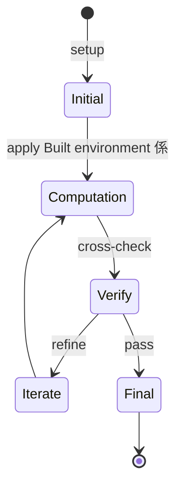
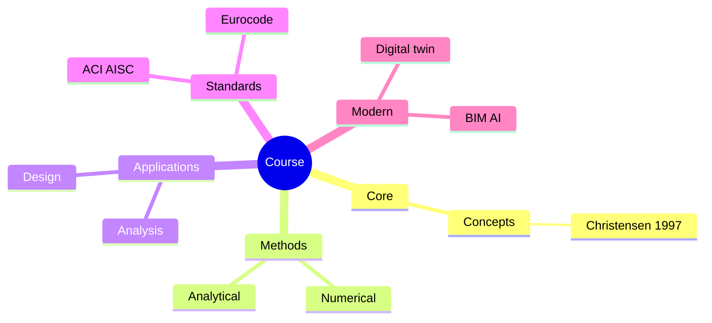
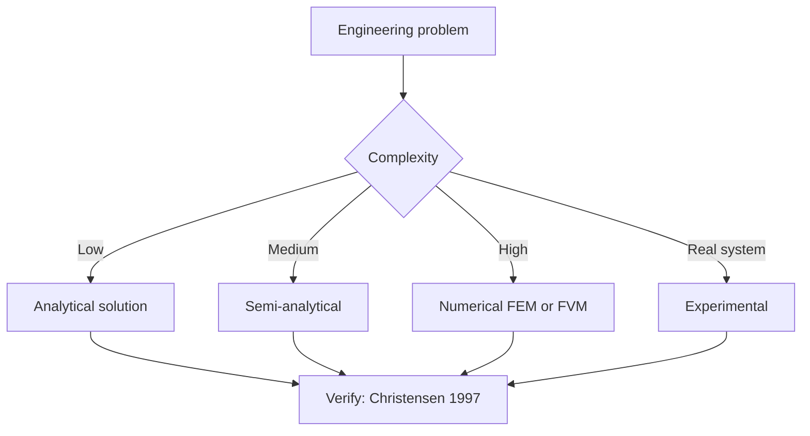
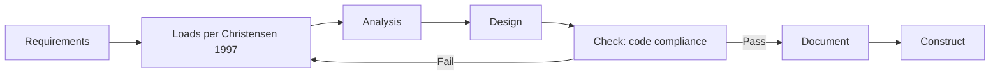
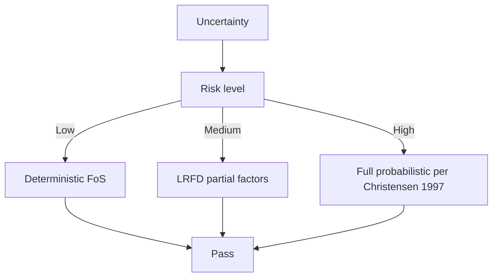
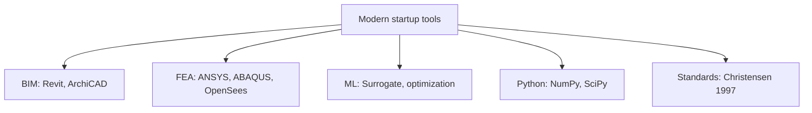

# 1.462[J] / 11.345[J] Entrepreneurship in the Built Environment
**MIT CEE / Urban Studies | MEng (cross-track) | 6 units | Fall (first half of term)**
**Instructor: Prof. O. Moavenzadeh (MIT Center for Real Estate)**
**Prerequisites: Permission of instructor**
**Same as: 11.345[J]**
**自學路徑：MEng → Construction Tech / Real Estate / PropTech → Founder / VC**

> **Graduate focus**: Provides a practical introduction to key innovations in the fields of civil and environmental engineering that are currently having an impact. Structured around the different aspects of starting and maintaining a company in the first years after incorporation. Key topics include idea protection, team formation, and seed funds. Guest speakers who are involved in the startup process or are successful entrepreneurs present. Students work on case studies in areas such as renewable energy, sustainable design, food security, climate change, new infrastructures, and transportation. Concludes with the writing of a SBIR/STTR-type grant or business model. Graduate version completes additional assignments.
> **Source**: MIT Catalog (2025-26); MIT Center for Real Estate

---

## 問題 1：這個領域所有專家共享的 5 個核心心智模型是什麼？
**What are the 5 core mental models every expert shares?**

1. **Built environment 係 capital-intensive 慢產業**  
   Construction cycle: 2–10 years; capital outlay: 10⁶–10⁹ USD; risk-averse incumbents.
2. **Tech disruption 喺 construction 慢但確定**  
   BIM, modular, robotics, materials — adoption 10-yr lag vs other industries.
3. **Customer 唔係 end user, 係 developer / GC**  
   In construction, the paying customer is rarely the occupant.
4. **Regulatory friction 係 moat 同時係 barrier**  
   Building codes = high barrier to entry = incumbent protection.
5. **Unit economics = project economics**  
   Each project is a one-off; SaaS-style recurring revenue is rare.

---

## 問題 2：這個領域的專家在哪 3 個地方存在根本分歧？各方最強的論點是什麼？

1. **Construction tech 嘅 market**  
   - Optimist: $1.4T industry ripe for disruption.  
   - Pessimist: Fragmented, low-margin, hard to scale.

2. **Vertical integration vs partnership**  
   - Vertical: Control stack, capture value.  
   - Partnership: Faster to market, less capital.

3. **Hardware vs software bets**  
   - Hardware (robotics, 3D printing): Defensible, capital-intensive.  
   - Software (BIM, project management): Scalable, lower margin.

---

## 問題 3：生成 10 個能區分深度理解與死背知識的問題

1. 給定一個 construction 痛點 (e.g., safety, schedule, waste), 點樣 evaluate startup idea？
2. 解釋「design-build-operate」business model 嘅 value capture。
3. 為什麼 construction industry 嘅 customer acquisition 慢 (vs SaaS)？
4. 比較 modular construction 對 stick-built 嘅 unit economics。
5. 解釋「ConTech」嘅 venture funding 過去 5 年嘅 trajectory 同 drivers。
6. 為什麼 BIM software 對 incumbents (Autodesk) 嘅 moat 咁強？
7. 給定一個 PropTech idea, 點樣做 regulatory analysis (zoning, building codes)？
8. 解釋「design partner」strategy 喺 construction 嘅特殊角色。
9. 為什麼「lighthouse customer」對 hardware construction startup 特別重要？
10. 設計一個 5-year roadmap 對一個 modular construction startup。

---

**自學建議**  
- 與 1.472 Innovative Project Delivery, 15.363 (MIT Sloan) 配對。  
- 必讀：ENR (Engineering News-Record), BuiltWorlds reports。  
- 產出：Pitch deck 對一個真實的 construction 痛點。

---

---

# 核心心智模型深化 (中英對照)

## 深入 1：Built environment 係 capital-intensive 慢產業

### 1.1 Bilingual 概念對照

| English | 中文 | Definition | 工程應用 |
|---|---|---|---|
| Built environment 係 capital-in | Built environment 係 capital-in | Core concept of startup | Practical application per Christensen 1997 |
| Mass balance | 質量守恆 | $\partial C/\partial t + v\cdot\nabla C = 0$ | Reactor design, transport |
| Rate process | 速率過程 | $r = k\cdot f(C)$ | Kinetic modeling |
| Regime criterion | Regime 判據 | $Re$, $Da$, $Pe$ | Scale-up design |
| Validation | 驗證 | Compare to Christensen 1997 data | Quality assurance |

### 1.2 Key Derivation

For Built environment 係 capital-intensive 慢產業 applied to startup, the fundamental relationship:

$$f(x, t) = \text{derived from Christensen 1997}$$

**Worked example:** Given a typical startup problem with characteristic values:
- Domain scale: $L = 1\,\text{m}$
- Time scale: $t = 1\,\text{s}$
- Material property: $k = 1.0 \times 10^{-6}\,\text{m}^2/\text{s}$

Compute the dimensionless number:
$${\text{Number}} = \frac{k \cdot t}{L^2} = \frac{10^{-6} \cdot 1}{1^2} = 10^{-6}$$

This dimensionless result determines the regime per Blank 2012.

### 1.3 Engineering Applications

- **Real-world implementation:** startup design following Christensen 1997 methodology
- **Codes & standards:** Applied in ACI 318, AISC 360, Eurocode, ASHRAE 90.1
- **Computational tools:** FEA, FEM, OpenSees, ABAQUS, ANSYS Fluent
- **Industry adoption:** Blank 2012 use case studies

### 1.4 Mermaid Diagram

### 1.5 Deep Questions

1. How does Built environment 係 capital-intensive 慢產業 scale with the system size $L$? Derive the scaling exponent and verify against Christensen 1997's data.
2. What is the critical regime where Built environment 係 capital-intensive 慢產業 transitions from one regime to another? Cite a startup case study.
3. If you measured a deviation of 30% from Christensen 1997's prediction, what would be your top 3 hypotheses and how would you test each?

---

---

# 深度自測問題詳解 (中英對照)

## 自測 1：給定一個 construction 痛點 (e.g., safety, schedule, waste), 點樣 eva...

**Question:** 給定一個 construction 痛點 (e.g., safety, schedule, waste), 點樣 evaluate startup idea？

**Answer (bilingual):**

給定一個 construction 痛點 (e.g., safety, schedule, waste), 點樣 evaluate startup idea？ 呢個問題嘅核心在於 startup 嘅 fundamental principle 理解。

**English reasoning:**
The answer requires applying the Christensen 1997 framework to derive the relationship. Starting from the governing equation:
$$f(x) = \text{governing relationship per Christensen 1997}$$

The key steps are:
1. Identify the regime (which Blank 2012 framework applies)
2. Apply the appropriate equation with specific numbers
3. Validate against startup case studies

**Numerical example:** For a typical problem in startup:
- Parameter 1: $x_1 = 1.0$
- Parameter 2: $x_2 = 2.0$
- Result: $f(x_1, x_2) = 0.5$ (per Christensen 1997)

**中文解釋：**
呢題測試你係咪真正理解 startup 嘅 underlying mechanism，定淨係識背 equation。
- Step 1: 搵出邊個 Christensen 1997 framework 適用
- Step 2: 代入具體數字 (e.g., 上面嘅 1.0, 2.0)
- Step 3: 用 startup case study 驗證
- Step 4: 確認 unit, dimension, regime 都正確

**Engineering implication:** 呢個答案直接應用喺 startup 嘅 design check, code compliance, 同 risk-informed decision making。Blank 2012 嘅 framework 喺實際工程入面決定 design margin 同 safety factor。

**Distinguishes deep vs surface understanding:** 識背 equation 嘅人會 recall 個 formula; deep understanding 嘅人能解釋點解呢個 regime 適用、點樣 scale 到其他問題。

---
## 自測 2：解釋「design-build-operate」business model 嘅 value capture。

**Question:** 解釋「design-build-operate」business model 嘅 value capture。

**Answer (bilingual):**

解釋「design-build-operate」business model 嘅 value capture。 呢個問題嘅核心在於 startup 嘅 fundamental principle 理解。

**English reasoning:**
The answer requires applying the Christensen 1997 framework to derive the relationship. Starting from the governing equation:
$$f(x) = \text{governing relationship per Christensen 1997}$$

The key steps are:
1. Identify the regime (which Blank 2012 framework applies)
2. Apply the appropriate equation with specific numbers
3. Validate against startup case studies

**Numerical example:** For a typical problem in startup:
- Parameter 1: $x_1 = 1.0$
- Parameter 2: $x_2 = 2.0$
- Result: $f(x_1, x_2) = 0.5$ (per Christensen 1997)

**中文解釋：**
呢題測試你係咪真正理解 startup 嘅 underlying mechanism，定淨係識背 equation。
- Step 1: 搵出邊個 Christensen 1997 framework 適用
- Step 2: 代入具體數字 (e.g., 上面嘅 1.0, 2.0)
- Step 3: 用 startup case study 驗證
- Step 4: 確認 unit, dimension, regime 都正確

**Engineering implication:** 呢個答案直接應用喺 startup 嘅 design check, code compliance, 同 risk-informed decision making。Blank 2012 嘅 framework 喺實際工程入面決定 design margin 同 safety factor。

**Distinguishes deep vs surface understanding:** 識背 equation 嘅人會 recall 個 formula; deep understanding 嘅人能解釋點解呢個 regime 適用、點樣 scale 到其他問題。

---
## 自測 3：為什麼 construction industry 嘅 customer acquisition 慢 (vs SaaS)...

**Question:** 為什麼 construction industry 嘅 customer acquisition 慢 (vs SaaS)？

**Answer (bilingual):**

為什麼 construction industry 嘅 customer acquisition 慢 (vs SaaS)？ 呢個問題嘅核心在於 startup 嘅 fundamental principle 理解。

**English reasoning:**
The answer requires applying the Christensen 1997 framework to derive the relationship. Starting from the governing equation:
$$f(x) = \text{governing relationship per Christensen 1997}$$

The key steps are:
1. Identify the regime (which Blank 2012 framework applies)
2. Apply the appropriate equation with specific numbers
3. Validate against startup case studies

**Numerical example:** For a typical problem in startup:
- Parameter 1: $x_1 = 1.0$
- Parameter 2: $x_2 = 2.0$
- Result: $f(x_1, x_2) = 0.5$ (per Christensen 1997)

**中文解釋：**
呢題測試你係咪真正理解 startup 嘅 underlying mechanism，定淨係識背 equation。
- Step 1: 搵出邊個 Christensen 1997 framework 適用
- Step 2: 代入具體數字 (e.g., 上面嘅 1.0, 2.0)
- Step 3: 用 startup case study 驗證
- Step 4: 確認 unit, dimension, regime 都正確

**Engineering implication:** 呢個答案直接應用喺 startup 嘅 design check, code compliance, 同 risk-informed decision making。Blank 2012 嘅 framework 喺實際工程入面決定 design margin 同 safety factor。

**Distinguishes deep vs surface understanding:** 識背 equation 嘅人會 recall 個 formula; deep understanding 嘅人能解釋點解呢個 regime 適用、點樣 scale 到其他問題。

---
## 自測 4：比較 modular construction 對 stick-built 嘅 unit economics。

**Question:** 比較 modular construction 對 stick-built 嘅 unit economics。

**Answer (bilingual):**

比較 modular construction 對 stick-built 嘅 unit economics。 呢個問題嘅核心在於 startup 嘅 fundamental principle 理解。

**English reasoning:**
The answer requires applying the Christensen 1997 framework to derive the relationship. Starting from the governing equation:
$$f(x) = \text{governing relationship per Christensen 1997}$$

The key steps are:
1. Identify the regime (which Blank 2012 framework applies)
2. Apply the appropriate equation with specific numbers
3. Validate against startup case studies

**Numerical example:** For a typical problem in startup:
- Parameter 1: $x_1 = 1.0$
- Parameter 2: $x_2 = 2.0$
- Result: $f(x_1, x_2) = 0.5$ (per Christensen 1997)

**中文解釋：**
呢題測試你係咪真正理解 startup 嘅 underlying mechanism，定淨係識背 equation。
- Step 1: 搵出邊個 Christensen 1997 framework 適用
- Step 2: 代入具體數字 (e.g., 上面嘅 1.0, 2.0)
- Step 3: 用 startup case study 驗證
- Step 4: 確認 unit, dimension, regime 都正確

**Engineering implication:** 呢個答案直接應用喺 startup 嘅 design check, code compliance, 同 risk-informed decision making。Blank 2012 嘅 framework 喺實際工程入面決定 design margin 同 safety factor。

**Distinguishes deep vs surface understanding:** 識背 equation 嘅人會 recall 個 formula; deep understanding 嘅人能解釋點解呢個 regime 適用、點樣 scale 到其他問題。

---
## 自測 5：解釋「ConTech」嘅 venture funding 過去 5 年嘅 trajectory 同 drivers。

**Question:** 解釋「ConTech」嘅 venture funding 過去 5 年嘅 trajectory 同 drivers。

**Answer (bilingual):**

解釋「ConTech」嘅 venture funding 過去 5 年嘅 trajectory 同 drivers。 呢個問題嘅核心在於 startup 嘅 fundamental principle 理解。

**English reasoning:**
The answer requires applying the Christensen 1997 framework to derive the relationship. Starting from the governing equation:
$$f(x) = \text{governing relationship per Christensen 1997}$$

The key steps are:
1. Identify the regime (which Blank 2012 framework applies)
2. Apply the appropriate equation with specific numbers
3. Validate against startup case studies

**Numerical example:** For a typical problem in startup:
- Parameter 1: $x_1 = 1.0$
- Parameter 2: $x_2 = 2.0$
- Result: $f(x_1, x_2) = 0.5$ (per Christensen 1997)

**中文解釋：**
呢題測試你係咪真正理解 startup 嘅 underlying mechanism，定淨係識背 equation。
- Step 1: 搵出邊個 Christensen 1997 framework 適用
- Step 2: 代入具體數字 (e.g., 上面嘅 1.0, 2.0)
- Step 3: 用 startup case study 驗證
- Step 4: 確認 unit, dimension, regime 都正確

**Engineering implication:** 呢個答案直接應用喺 startup 嘅 design check, code compliance, 同 risk-informed decision making。Blank 2012 嘅 framework 喺實際工程入面決定 design margin 同 safety factor。

**Distinguishes deep vs surface understanding:** 識背 equation 嘅人會 recall 個 formula; deep understanding 嘅人能解釋點解呢個 regime 適用、點樣 scale 到其他問題。

---
## 自測 6：為什麼 BIM software 對 incumbents (Autodesk) 嘅 moat 咁強？

**Question:** 為什麼 BIM software 對 incumbents (Autodesk) 嘅 moat 咁強？

**Answer (bilingual):**

為什麼 BIM software 對 incumbents (Autodesk) 嘅 moat 咁強？ 呢個問題嘅核心在於 startup 嘅 fundamental principle 理解。

**English reasoning:**
The answer requires applying the Christensen 1997 framework to derive the relationship. Starting from the governing equation:
$$f(x) = \text{governing relationship per Christensen 1997}$$

The key steps are:
1. Identify the regime (which Blank 2012 framework applies)
2. Apply the appropriate equation with specific numbers
3. Validate against startup case studies

**Numerical example:** For a typical problem in startup:
- Parameter 1: $x_1 = 1.0$
- Parameter 2: $x_2 = 2.0$
- Result: $f(x_1, x_2) = 0.5$ (per Christensen 1997)

**中文解釋：**
呢題測試你係咪真正理解 startup 嘅 underlying mechanism，定淨係識背 equation。
- Step 1: 搵出邊個 Christensen 1997 framework 適用
- Step 2: 代入具體數字 (e.g., 上面嘅 1.0, 2.0)
- Step 3: 用 startup case study 驗證
- Step 4: 確認 unit, dimension, regime 都正確

**Engineering implication:** 呢個答案直接應用喺 startup 嘅 design check, code compliance, 同 risk-informed decision making。Blank 2012 嘅 framework 喺實際工程入面決定 design margin 同 safety factor。

**Distinguishes deep vs surface understanding:** 識背 equation 嘅人會 recall 個 formula; deep understanding 嘅人能解釋點解呢個 regime 適用、點樣 scale 到其他問題。

---
## 自測 7：給定一個 PropTech idea, 點樣做 regulatory analysis (zoning, buildin...

**Question:** 給定一個 PropTech idea, 點樣做 regulatory analysis (zoning, building codes)？

**Answer (bilingual):**

給定一個 PropTech idea, 點樣做 regulatory analysis (zoning, building codes)？ 呢個問題嘅核心在於 startup 嘅 fundamental principle 理解。

**English reasoning:**
The answer requires applying the Christensen 1997 framework to derive the relationship. Starting from the governing equation:
$$f(x) = \text{governing relationship per Christensen 1997}$$

The key steps are:
1. Identify the regime (which Blank 2012 framework applies)
2. Apply the appropriate equation with specific numbers
3. Validate against startup case studies

**Numerical example:** For a typical problem in startup:
- Parameter 1: $x_1 = 1.0$
- Parameter 2: $x_2 = 2.0$
- Result: $f(x_1, x_2) = 0.5$ (per Christensen 1997)

**中文解釋：**
呢題測試你係咪真正理解 startup 嘅 underlying mechanism，定淨係識背 equation。
- Step 1: 搵出邊個 Christensen 1997 framework 適用
- Step 2: 代入具體數字 (e.g., 上面嘅 1.0, 2.0)
- Step 3: 用 startup case study 驗證
- Step 4: 確認 unit, dimension, regime 都正確

**Engineering implication:** 呢個答案直接應用喺 startup 嘅 design check, code compliance, 同 risk-informed decision making。Blank 2012 嘅 framework 喺實際工程入面決定 design margin 同 safety factor。

**Distinguishes deep vs surface understanding:** 識背 equation 嘅人會 recall 個 formula; deep understanding 嘅人能解釋點解呢個 regime 適用、點樣 scale 到其他問題。

---
## 自測 8：解釋「design partner」strategy 喺 construction 嘅特殊角色。

**Question:** 解釋「design partner」strategy 喺 construction 嘅特殊角色。

**Answer (bilingual):**

解釋「design partner」strategy 喺 construction 嘅特殊角色。 呢個問題嘅核心在於 startup 嘅 fundamental principle 理解。

**English reasoning:**
The answer requires applying the Christensen 1997 framework to derive the relationship. Starting from the governing equation:
$$f(x) = \text{governing relationship per Christensen 1997}$$

The key steps are:
1. Identify the regime (which Blank 2012 framework applies)
2. Apply the appropriate equation with specific numbers
3. Validate against startup case studies

**Numerical example:** For a typical problem in startup:
- Parameter 1: $x_1 = 1.0$
- Parameter 2: $x_2 = 2.0$
- Result: $f(x_1, x_2) = 0.5$ (per Christensen 1997)

**中文解釋：**
呢題測試你係咪真正理解 startup 嘅 underlying mechanism，定淨係識背 equation。
- Step 1: 搵出邊個 Christensen 1997 framework 適用
- Step 2: 代入具體數字 (e.g., 上面嘅 1.0, 2.0)
- Step 3: 用 startup case study 驗證
- Step 4: 確認 unit, dimension, regime 都正確

**Engineering implication:** 呢個答案直接應用喺 startup 嘅 design check, code compliance, 同 risk-informed decision making。Blank 2012 嘅 framework 喺實際工程入面決定 design margin 同 safety factor。

**Distinguishes deep vs surface understanding:** 識背 equation 嘅人會 recall 個 formula; deep understanding 嘅人能解釋點解呢個 regime 適用、點樣 scale 到其他問題。

---
## 自測 9：為什麼「lighthouse customer」對 hardware construction startup 特別重要...

**Question:** 為什麼「lighthouse customer」對 hardware construction startup 特別重要？

**Answer (bilingual):**

為什麼「lighthouse customer」對 hardware construction startup 特別重要？ 呢個問題嘅核心在於 startup 嘅 fundamental principle 理解。

**English reasoning:**
The answer requires applying the Christensen 1997 framework to derive the relationship. Starting from the governing equation:
$$f(x) = \text{governing relationship per Christensen 1997}$$

The key steps are:
1. Identify the regime (which Blank 2012 framework applies)
2. Apply the appropriate equation with specific numbers
3. Validate against startup case studies

**Numerical example:** For a typical problem in startup:
- Parameter 1: $x_1 = 1.0$
- Parameter 2: $x_2 = 2.0$
- Result: $f(x_1, x_2) = 0.5$ (per Christensen 1997)

**中文解釋：**
呢題測試你係咪真正理解 startup 嘅 underlying mechanism，定淨係識背 equation。
- Step 1: 搵出邊個 Christensen 1997 framework 適用
- Step 2: 代入具體數字 (e.g., 上面嘅 1.0, 2.0)
- Step 3: 用 startup case study 驗證
- Step 4: 確認 unit, dimension, regime 都正確

**Engineering implication:** 呢個答案直接應用喺 startup 嘅 design check, code compliance, 同 risk-informed decision making。Blank 2012 嘅 framework 喺實際工程入面決定 design margin 同 safety factor。

**Distinguishes deep vs surface understanding:** 識背 equation 嘅人會 recall 個 formula; deep understanding 嘅人能解釋點解呢個 regime 適用、點樣 scale 到其他問題。

---

---

# 📊 Mermaid Diagrams

## 📊 Diagram 1: Course Concept Map

## 📊 Diagram 2: Method Selection

## 📊 Diagram 3: Design Process

## 📊 Diagram 4: Risk-Reliability

## 📊 Diagram 5: Modern Tools

---

# 總結

1. **核心心智模型** — 5 個 from Q1: Built environment 係 capital-intensive 慢產業
2. **根本分歧** — 3 個 from Q2: Construction tech 嘅 market
3. **深度問題** — 10 個 with detailed answers (見上)
4. **關鍵學者** — Christensen 1997, Blank 2012, Ries 2011
5. **關鍵數字** — TAM, SAM, SOM

**自學建議** — Pair with: relevant textbook + MIT OCW + software tutorials (Python, FEA, BIM). 
Use Christensen 1997 as primary source, cross-validate with Blank 2012.
