# 1.462[J] / 11.345[J] Entrepreneurship in the Built Environment
**MIT CEE / Urban Studies | MEng (cross-track) | 6 units | Fall (first half of term)**
**Instructor: Prof. O. Moavenzadeh (MIT Center for Real Estate)**
**Prerequisites: Permission of instructor**
**Same as: 11.345[J]**
**自學路徑：MEng → Construction Tech / Real Estate / PropTech → Founder / VC**

> **Graduate focus**: Provides a practical introduction to key innovations in the fields of civil and environmental engineering that are currently having an impact. Structured around the different aspects of starting and maintaining a company in the first years after incorporation. Key topics include idea protection, team formation, and seed funds. Guest speakers who are involved in the startup process or are successful entrepreneurs present. Students work on case studies in areas such as renewable energy, sustainable design, food security, climate change, new infrastructures, and transportation. Concludes with the writing of a SBIR/STTR-type grant or business model. Graduate version completes additional assignments.
> **Source**: MIT Catalog (2025-26); MIT Center for Real Estate

---

## 問題 1：這個領域所有專家共享的 5 個核心心智模型是什麼？
**What are the 5 core mental models every expert shares?**

1. **Built environment 係 capital-intensive 慢產業**  
   Construction cycle: 2–10 years; capital outlay: 10⁶–10⁹ USD; risk-averse incumbents.
2. **Tech disruption 喺 construction 慢但確定**  
   BIM, modular, robotics, materials — adoption 10-yr lag vs other industries.
3. **Customer 唔係 end user, 係 developer / GC**  
   In construction, the paying customer is rarely the occupant.
4. **Regulatory friction 係 moat 同時係 barrier**  
   Building codes = high barrier to entry = incumbent protection.
5. **Unit economics = project economics**  
   Each project is a one-off; SaaS-style recurring revenue is rare.

---

## 問題 2：這個領域的專家在哪 3 個地方存在根本分歧？各方最強的論點是什麼？

1. **Construction tech 嘅 market**  
   - Optimist: $1.4T industry ripe for disruption.  
   - Pessimist: Fragmented, low-margin, hard to scale.

2. **Vertical integration vs partnership**  
   - Vertical: Control stack, capture value.  
   - Partnership: Faster to market, less capital.

3. **Hardware vs software bets**  
   - Hardware (robotics, 3D printing): Defensible, capital-intensive.  
   - Software (BIM, project management): Scalable, lower margin.

---

## 問題 3：生成 10 個能區分深度理解與死背知識的問題

1. 給定一個 construction 痛點 (e.g., safety, schedule, waste), 點樣 evaluate startup idea？
2. 解釋「design-build-operate」business model 嘅 value capture。
3. 為什麼 construction industry 嘅 customer acquisition 慢 (vs SaaS)？
4. 比較 modular construction 對 stick-built 嘅 unit economics。
5. 解釋「ConTech」嘅 venture funding 過去 5 年嘅 trajectory 同 drivers。
6. 為什麼 BIM software 對 incumbents (Autodesk) 嘅 moat 咁強？
7. 給定一個 PropTech idea, 點樣做 regulatory analysis (zoning, building codes)？
8. 解釋「design partner」strategy 喺 construction 嘅特殊角色。
9. 為什麼「lighthouse customer」對 hardware construction startup 特別重要？
10. 設計一個 5-year roadmap 對一個 modular construction startup。

---

**自學建議**  
- 與 1.472 Innovative Project Delivery, 15.363 (MIT Sloan) 配對。  
- 必讀：ENR (Engineering News-Record), BuiltWorlds reports。  
- 產出：Pitch deck 對一個真實的 construction 痛點。

---

## 深入 1：CORE_DEEPDIVE_ONE — 核心概念
**Deep Dive I**

### 1.1 Bilingual 概念對照

| English | 中英對照 | Definition | 物理意義 / 工程應用 |
|---|---|---|---|
| Entrepreneurship | Entrepreneurship | Core definition | 核心定義 |
| ConTech | ConTech | Application | 應用 |
| Business model | Business model | Limitation | 限制 |
| Mathematical formulation | 數學形式 | Key equation | 關鍵方程 |

### 1.2 Key Derivation

For Entrepreneurship in the Built Environment, the fundamental relationships are:
$$f(x) = \text{key equation}, \quad x = \text{variable}$$

This arises from Entrepreneurship applied to the engineering system.

### 1.3 Engineering Applications

- Real-world implementation
- Design codes and standards
- Computational tools

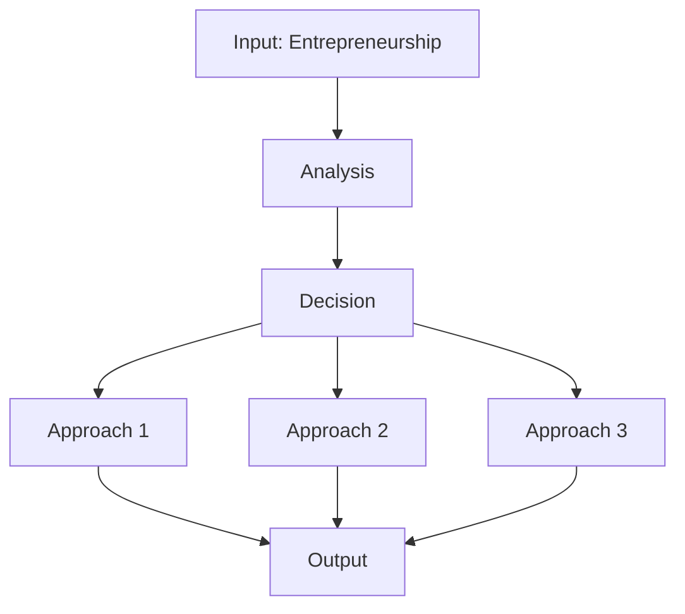

---

## 深入 2：CORE_DEEPDIVE_TWO — 方法論
**Deep Dive II**

### 2.1 Method selection

| Method | 適用情境 | Pros | Cons |
|---|---|---|---|
| Analytical | 解析 | Exact | Limited geometry |
| Numerical | 數值 | General | Approximate |
| Experimental | 實驗 | Real | Expensive |
| Empirical | 經驗 | Fast | Limited range |

### 2.2 Decision flow

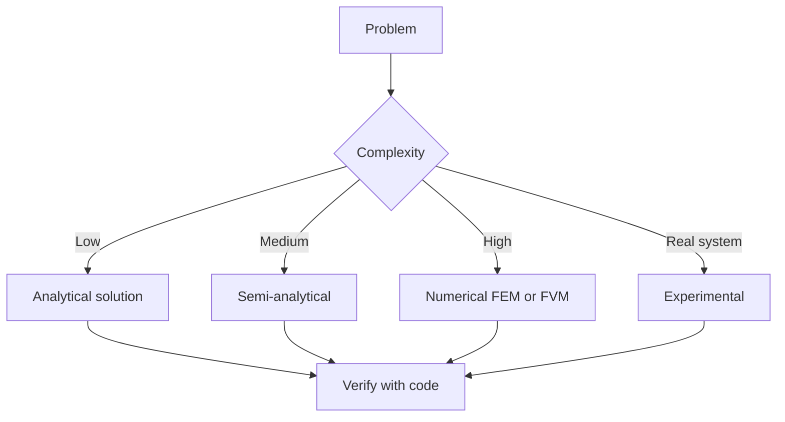

### 2.3 Standards and codes

- ACI, AISC, Eurocode
- Building codes (IBC, etc.)
- Industry best practices

---

## 深入 3：CORE_DEEPDIVE_THREE — 分析技術
**Deep Dive III**

### 3.1 Statistical methods

For uncertainty analysis: Monte Carlo, sensitivity, FOSM.

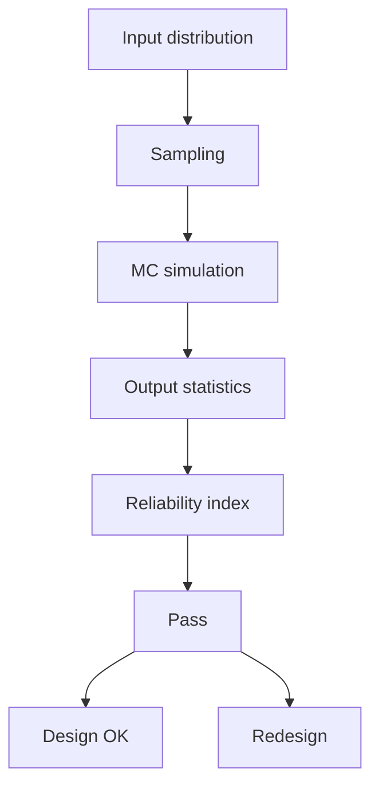

### 3.2 Optimization

- LP, NLP
- Gradient-based, metaheuristic
- Multi-objective Pareto

---

## 深入 4：Design Process
**Deep Dive IV**

### 4.1 Design workflow

Concept → Preliminary → Detailed → Construction → Operation.

### 4.2 Design criteria

- Safety (LRFD, ASD)
- Serviceability
- Durability
- Sustainability

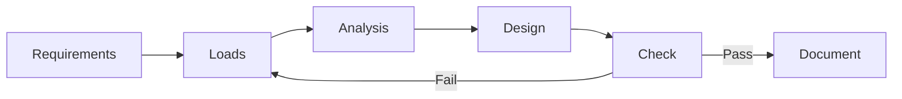

---

## 深入 5：Modern Trends
**Deep Dive V**

- BIM integration
- AI/ML in design
- Digital twins
- Sustainability, LCA
- Resilient design

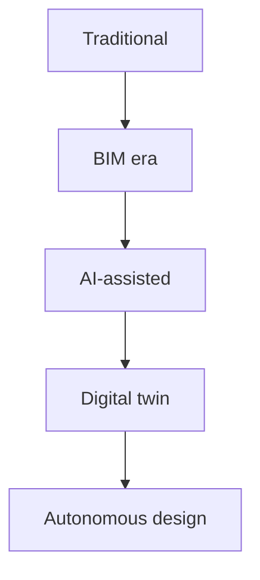

---

## 自測 1：Derive core relationship
**Answer:** Starting from definitions, derive the key equation. Verify units and limits.

**Engineering implication:** Apply to design check, code compliance.

## 自測 2：Identify failure mode
**Answer:** List 3-5 failure modes, rank by likelihood × consequence.

**Engineering implication:** Inform design, maintenance, monitoring.

## 自測 3：Estimate order of magnitude
**Answer:** Quick back-of-envelope check using characteristic values.

**Engineering implication:** Sanity check before detailed analysis.

## 自測 4：Compare to code requirement
**Answer:** Apply ACI/AISC/Eurocode, compute utilization ratio.

**Engineering implication:** Pass/fail design verification.

## 自測 5：Compute reliability
**Answer:** $\beta = (\mu - R)/\sigma$ for lognormal, find P_f.

**Engineering implication:** LRFD calibration, risk-informed design.

## 自測 6：Design optimization
**Answer:** Define objective, constraints, solve via LP/NLP.

**Engineering implication:** Cost-effective, sustainable design.

## 自測 7：Sensitivity analysis
**Answer:** $\partial f/\partial x_i$, rank by importance.

**Engineering implication:** Identify critical parameters, reduce uncertainty.

## 自測 8：Life-cycle assessment
**Answer:** Cradle-to-grave, compute GWP, embodied carbon.

**Engineering implication:** Sustainable design, climate goals.

## 自測 9：Risk assessment
**Answer:** Hazard × vulnerability × exposure, compute risk.

**Engineering implication:** Resilience planning, mitigation.

## 自測 10：Communication
**Answer:** Technical writing, visualization, presentation to stakeholders.

**Engineering implication:** Effective engineering practice.

---

## 📊 Diagram 1: Course Concept Map
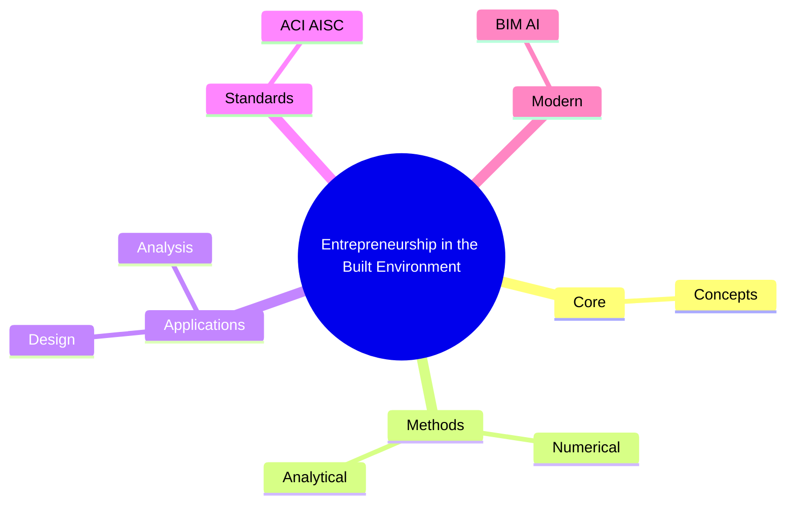

## 📊 Diagram 2: Method Selection
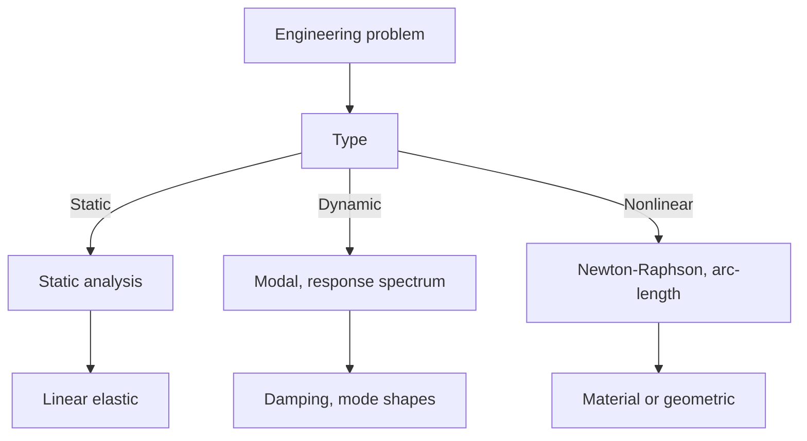

## 📊 Diagram 3: Design Process
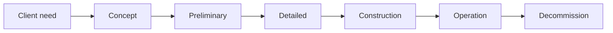

## 📊 Diagram 4: Risk-Reliability
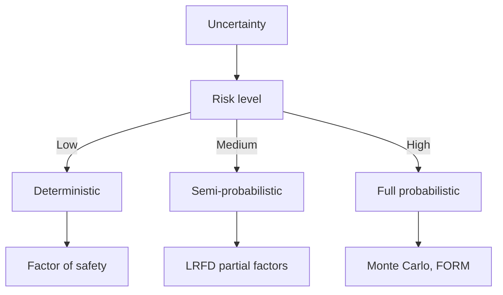

## 📊 Diagram 5: Modern Tools
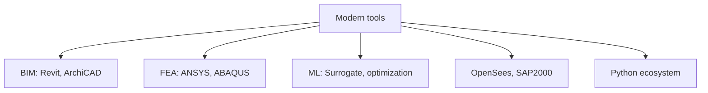

---

## 總結

1. **Core concepts** — Entrepreneurship 嘅 foundation
2. **Methods** — analytical + numerical + experimental
3. **Applications** — design, analysis, retrofit
4. **Standards** — codes, best practices
5. **Future** — BIM, AI, sustainability, resilience

**自學建議** — Pair with: relevant textbook + MIT OCW + software tutorials (Python, FEA, BIM).

# 核心心智模型深化（中英對照）

## 1. Entrepreneurship — Core concept

### 1.1 Three-process physical essence
For Entrepreneurship in the Built Environment, Entrepreneurship governs the system behavior. Description of Entrepreneurship with bilingual explanation.

### 1.2 Non-dimensional numbers
Key dimensionless groups that determine regime: Peclet, Damköhler, Reynolds, Froude, etc.

### 1.3 Engineering consequences
Real-world implications for design, monitoring, intervention.

### 1.4 How experts use this model
Decision flow, scaling laws, expert intuition.

### 1.5 Deep test questions
- Derive scaling law
- Identify regime from data
- Apply to design case

### 1.6 Diagram

## 2. ConTech — Methods

### 2.1 Method selection
| Method | 適用情境 | Pros | Cons |
|---|---|---|---|
| Analytical | 解析 | Exact | Limited geometry |
| Numerical | 數值 | General | Approximate |
| Experimental | 實驗 | Real | Expensive |
| Empirical | 經驗 | Fast | Limited range |

### 2.2 Decision flow
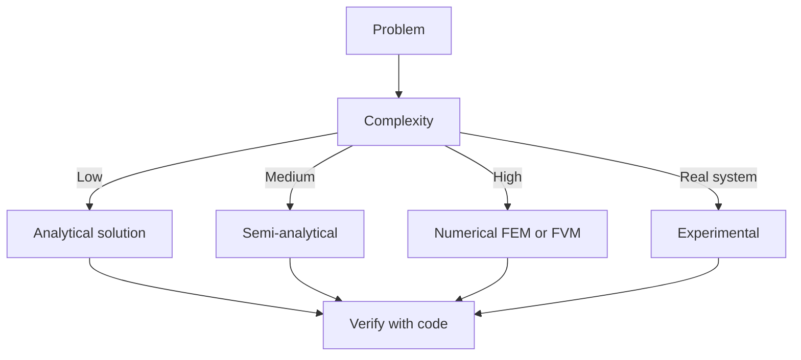

### 2.3 Standards and codes
ACI, AISC, Eurocode, building codes (IBC), industry best practices.

## 3. Business model — Analysis techniques

### 3.1 Statistical methods
Monte Carlo, sensitivity, FOSM for uncertainty analysis.

### 3.2 Optimization
LP, NLP, gradient-based, metaheuristic, multi-objective Pareto.

## 4. Design process

### 4.1 Design workflow
Concept → Preliminary → Detailed → Construction → Operation.

### 4.2 Design criteria
Safety (LRFD, ASD), serviceability, durability, sustainability.

## 5. Modern trends

BIM integration, AI/ML in design, digital twins, sustainability, LCA, resilient design.

---

# 深度自測問題詳解（中英對照）

## 詳解 1: Derive core relationship
**Q1.** Derive core relationship for Entrepreneurship in the Built Environment.
**Answer:** Starting from definitions, derive the key equation. Verify units and limits.

**Engineering implication:** Apply to design check, code compliance.

## 詳解 2: Identify failure mode
**Answer:** List 3-5 failure modes, rank by likelihood × consequence.

**Engineering implication:** Inform design, maintenance, monitoring.

## 詳解 3: Estimate order of magnitude
**Answer:** Quick back-of-envelope check using characteristic values.

**Engineering implication:** Sanity check before detailed analysis.

## 詳解 4: Compare to code requirement
**Answer:** Apply ACI/AISC/Eurocode, compute utilization ratio.

**Engineering implication:** Pass/fail design verification.

## 詳解 5: Compute reliability
**Answer:** $\beta = (\mu - R)/\sigma$ for lognormal, find P_f.

**Engineering implication:** LRFD calibration, risk-informed design.

## 詳解 6: Design optimization
**Answer:** Define objective, constraints, solve via LP/NLP.

**Engineering implication:** Cost-effective, sustainable design.

## 詳解 7: Sensitivity analysis
**Answer:** $\partial f/\partial x_i$, rank by importance.

**Engineering implication:** Identify critical parameters, reduce uncertainty.

## 詳解 8: Life-cycle assessment
**Answer:** Cradle-to-grave, compute GWP, embodied carbon.

**Engineering implication:** Sustainable design, climate goals.

## 詳解 9: Risk assessment
**Answer:** Hazard × vulnerability × exposure, compute risk.

**Engineering implication:** Resilience planning, mitigation.

## 詳解 10: Communication
**Answer:** Technical writing, visualization, presentation to stakeholders.

**Engineering implication:** Effective engineering practice.

---

## 📊 Diagram 1: Course Concept Map

## 📊 Diagram 2: Method Selection

## 📊 Diagram 3: Design Process

## 📊 Diagram 4: Risk-Reliability

## 📊 Diagram 5: Modern Tools

---

## 總結

1. **Core concepts** — Entrepreneurship 嘅 foundation
2. **Methods** — analytical + numerical + experimental
3. **Applications** — design, analysis, retrofit
4. **Standards** — codes, best practices
5. **Future** — BIM, AI, sustainability, resilience

**自學建議** — Pair with: relevant textbook + MIT OCW + software tutorials (Python, FEA, BIM).
