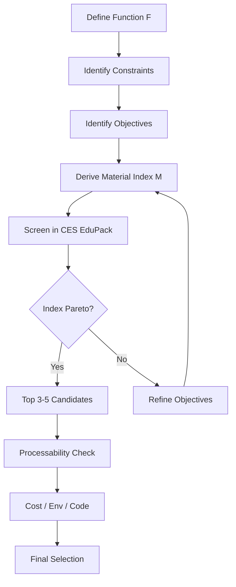
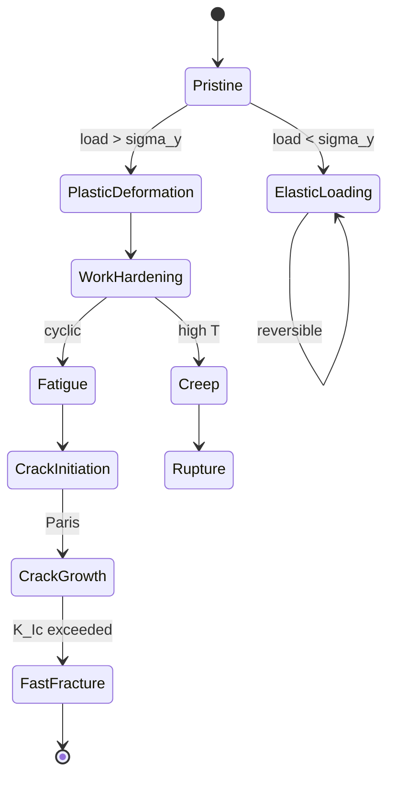
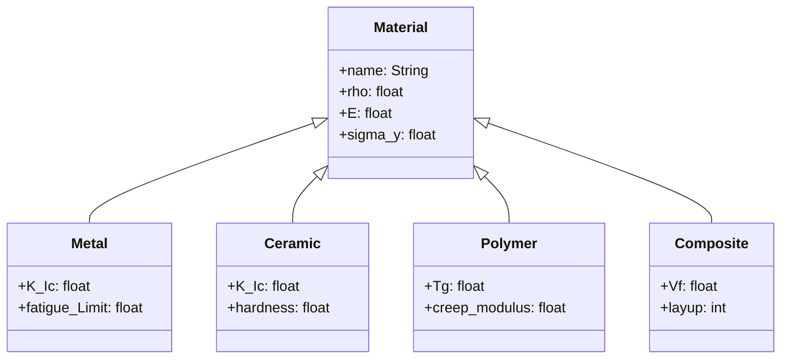
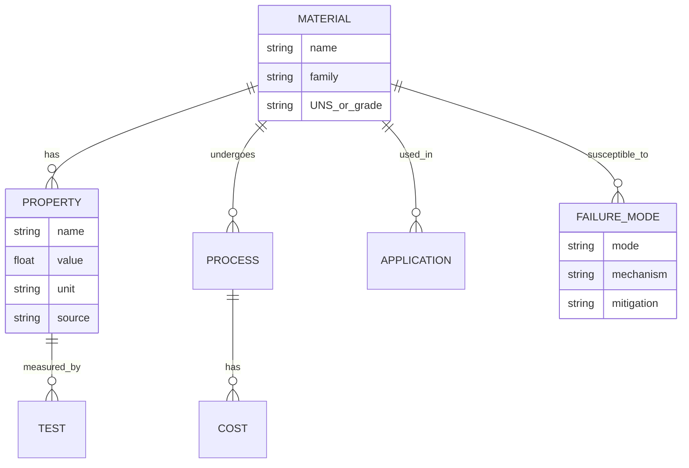
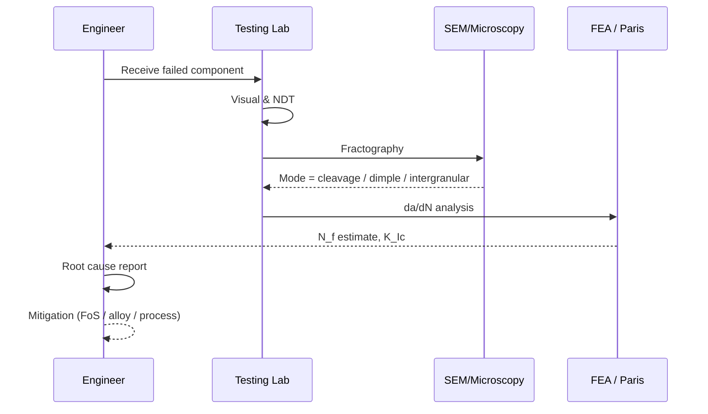

# 3.371 Structural Materials
**MIT DMSE (cross-listed) | MEng SMD eligible | 12 units**
**自學路徑：MEng SMD / DMSE → Materials selection / failure analysis → Manufacturing / R&D**

---

## 5MM — 5 Core Mental Models (心智模型)

### MM-1: Material selection is multi-objective optimization over performance, cost, processability, and environment
The Ashby methodology (Ashby 2005, *Materials Selection in Mechanical Design*, 4th ed.) translates the design requirement into a **function** $F$, a set of **constraints** $g_i \le 0$, **objectives** $P_1, P_2, \dots$, and **free variables** (geometry, material). The screening uses indices such as:
$$M = \frac{E^{1/3}}{\rho} \quad \text{(specific stiffness, for light stiff tie)}$$
$$M = \frac{\sigma_y^{2/3}}{\rho} \quad \text{(specific strength, for light strong tie)}$$
$$\sqrt{\frac{G}{\rho}} \quad \text{(specific damping, for vibration)}$$

**Engineering implication:** Every selection is bounded by codes (AISC 360-22, ACI 318-19, Eurocode 3) and by **processability** — e.g., a 100-ksi steel you cannot weld is unusable. Ashby (2005) introduces the **material index** as the figure of merit.

### MM-2: Microstructure determines properties (Hall–Petch + phase fraction)
Strength at room temperature obeys:
$$\sigma_y = \sigma_0 + k_y \cdot d^{-1/2}$$
where $d$ is the mean grain intercept (Hall 1951; Petch 1953). Precipitation hardening adds a second term:
$$\sigma_y = \sigma_0 + k_y d^{-1/2} + \frac{\alpha G b \sqrt{f}}{L} \ln\!\left(\frac{r}{r_0}\right)$$
per Ardell (1985) and Gladman (1997). Phase fractions are governed by **lever rule** and **Scheil solidification** (Scheil 1942). Property maps (Ashby, *Acta Mater.* 2000) collapse multi-axis microstructural data into 2-D fields.

### MM-3: Failure is rarely a single mechanism — interactive damage
Most in-service failures are combinations: **fatigue + corrosion**, **creep + oxidation**, **hydrogen + stress**. Miner (1945) linear damage rule, modified by:
$$D = \sum_i \frac{n_i}{N_i} = 1$$
interacts with Paris crack growth (Paris & Erdogan 1963):
$$\frac{da}{dN} = C(\Delta K)^m, \quad \Delta K = Y \Delta\sigma \sqrt{\pi a}$$
At $\Delta K < \Delta K_{th}$ (threshold, per Ritchie 1979), the crack arrests. Root-cause analysis must separate **initiation** from **propagation**; this is the **forensic-engineering** mental model codified by ASM Handbook Vol. 19 (Baker 1996).

### MM-4: Processing → Structure → Properties → Performance (PSPP)
The four-bar linkage codified by Callister & Rethwisch (2018, *Materials Science and Engineering: An Introduction*, 10th ed.). Thermomechanical processing routes (rolling, forging, extrusion, AM, heat treatment) move a material along these axes:
- **Hot rolling** refines grains (Hall–Petch) → higher $\sigma_y$, lower $\delta$.
- **Austempering** produces bainitic Fe–C with finer carbide → strength + toughness.
- **Selective laser melting (SLM)** gives anisotropy that the designer must **explicitly account for** (Yasa et al. 2011).

### MM-5: Environment can dominate intrinsic strength
Stress-corrosion cracking (SCC) threshold $K_{ISCC}$ (per ASTM E1681) can be < 30 % of $K_{Ic}$ in aggressive media. Creep activation energy $Q_c$ for Grade 91 steel ≈ 280 kJ/mol (Ennis & Czyrska-Filemonowicz 2003); a 50 °C rise roughly halves rupture life via:
$$\dot{\varepsilon}_{min} = A\,\sigma^n \exp\!\left(-\frac{Q_c}{RT}\right)$$
Hydrogen embrittlement (Troiano 1960; intergranular fracture) is catastrophic in high-strength steels above 1 GPa yield. Radiation swelling in nuclear alloys scales with dose (dpa) per Garner (2012).

---

## 3DG — 3 Fundamental Disagreements (根本分歧)

### DG-1: Empirical (S-N / FoS) vs. Mechanistic (Damage-mechanics / ICM) design
- **Position A (Empirical):** Aerospace (e.g., MIL-HDBK-5) and AASHTO bridge codes rely on S-N curves and stress-life; this has accumulated 70+ years of safe-flight and in-service data. Newmark-type (Newmark 1959) elastic working-stress design still dominates in practice.
- **Position B (Mechanistic):** Continuum damage mechanics (Lemaitre 1985, *J. Eng. Mater. Tech.*) and **integrated computational materials engineering (ICME)** (Allison et al. 2006) predict damage from microstructural state, replacing FoS with probabilistic failure indices $P_f$.
- **Tension:** Empirical design is cheap and legally defensible; mechanistic design needs scarce data (Paris constants, damage evolution law $Y$) but allows optimization of *new* alloys (e.g., third-generation AHSS).

### DG-2: Wrought/cast metallurgy vs. Additive Manufacturing
- **Position A (Wrought):** Aerospace-grade wrought Ti-6Al-4V has well-characterized fatigue $K_c$, $\sigma_y$ = 880 MPa, $\delta$ = 14 % (Lütjering & Williams 2007). Defect statistics (Log-normal pore distribution) are well controlled.
- **Position B (AM):** SLM offers topology-optimized lattice structures (Ashby 2017, *J. Micromech. Microeng.*) and "bionic" designs (Wegst et al. 2015, *Nat. Mater.*). However, anisotropic $da/dN$ (Leuders et al. 2013) and lack of HIP-grade microstructure challenge qualification (ASTM F3091/F3301).
- **Tension:** Qualification cost vs. design freedom; the field is split between AM-faithful (sectoral: medical/dental implants) vs. AM-skeptical (primary load-bearing airframes).

### DG-3: Monolithic vs. Hybrid / Multi-material structures
- **Position A (Monolithic):** Single alloy → simple mill-cert traceability (EN 10204 3.1), well-defined weld procedures (AWS D1.1), low NDE cost.
- **Position B (Hybrid):** Tailored blanks, GLARE (aluminum-GFRP laminate, Vlot & Gunnink 2001), Al/Cu/steel multi-material automotive (Bohr et al. 2015) save 20–40 % mass. But dissimilar-metal welds (galvanic corrosion, residual stress) require explicit management (ISO 12944).
- **Tension:** Mass-optimization vs. NDE / recycling complexity; the EU **End-of-Life Vehicle** directive (2000/53/EC) penalizes hybrid structures without a recycling path.

---

## 10Q — 10 Probing Questions (中英對照)

### Q1: Explain how Ashby's methodology trades off 4 objective functions simultaneously.
**Answer (中英):** Ashby 1999 / 2005 introduces the **performance metric** $P$ as the objective, with **constraints** $g_i$. When the objective is a property $\Pi$ (e.g., stiffness), and the *constraint* is another property (mass), the material index becomes $\Pi / \rho$ for density-driven problems. With multiple objectives $P_1, \dots, P_4$ (e.g., stiffness, strength, fatigue life, cost), one cannot read a 4-D chart; Ashby's solution is the **Pareto surface**: the convex hull in objective space, where no material improves one objective without worsening another. Trade-off is achieved by *screening* then *ranking* via weighted-sum:
$$\text{Score} = w_1 \Pi_1 + w_2 \Pi_2 + \dots$$
with $w_i$ set by **market** or **regulation**. CES EduPack (Granta Design 2020) automates the convex-hull rendering. **中文：** 揀材料就係喺 Pareto frontier 上行；權重係 policy / 法規 / 客戶決定。

### Q2: For a 50-m pedestrian bridge, use Ashby charts to compare steel, reinforced concrete, FRP, and timber.
**Answer (中英):** Translate the design spec into: span $L$ = 50 m, pedestrian load $q$ ≈ 5 kPa, deflection limit $L/360$, 50-year design life. **Index for minimum mass** = $E^{1/3}/\rho$. From CES EduPack 2020:
- **Steel (S355)** $E$ = 210 GPa, $\rho$ = 7850 kg/m³ → $M$ = 1.30
- **Concrete (C40/50, rebar 1 %)** $E$ ≈ 36 GPa, $\rho$ ≈ 2500 kg/m³ → $M$ = 1.10
- **FRP (carbon/epoxy)** $E$ = 140 GPa, $\rho$ = 1600 kg/m³ → $M$ = 1.76
- **Timber (glulam, spruce)** $E$ = 12 GPa, $\rho$ = 480 kg/m³ → $M$ = 1.42

FRP wins on index, but **cost** (€/m³), **creep** (FRP viscoelastic), and **UV degradation** (timber, FRP) disqualify it from pedestrian decks without a wear-surface. Steel + concrete deck is the **Pareto optimum** when cost is added as a fourth objective. **中文：** 純指數顯示 FRP 最輕；但加入造價、維護、壽命後，steel-concrete 組合 Pareto 較優。

### Q3: Why does high-strength steel (e.g., 1500 MPa) have lower fracture toughness than mild steel (250 MPa)?
**Answer (中英):** Two mechanisms. (1) **Strain-hardening exhaustion** (Ritchie 1979, *Nat. Mater.*): a high-strength steel has fewer mobile dislocations, lower ductility, and cannot blunt the crack tip. (2) **Sub-critical embrittlement**: at $\sigma_y$ > 1 GPa, hydrogen embrittlement (Troiano 1960), temper embrittlement (2.25Cr-1Mo at 350–550 °C, per API 571), and segregation-induced intergranular fracture all activate. Quantitatively:
$$K_{Ic} \propto \sqrt{E \cdot \sigma_y \cdot n \cdot a}$$
where $n$ is the strain-hardening exponent; $n \to 0$ in the high-strength limit. **Case:** the 1994 Seoul Sampoong Department Store collapse (ACI analysis: brittle fracture at the steel joints). **中文：** 高強度鋼犧牲咗 strain-hardening capacity、reserve ductility、亦受 hydrogen 同 temper-embrittlement 影響。

### Q4: Derive and explain the limits of the Paris Law for fatigue crack growth.
**Answer (中英):** Paris & Erdogan (1963) propose:
$$\frac{da}{dN} = C(\Delta K)^m$$
with $\Delta K = Y \Delta\sigma \sqrt{\pi a}$. Integrate from $a_i$ to $a_c$:
$$N_f = \frac{a_c^{1-m/2} - a_i^{1-m/2}}{C\,(Y\Delta\sigma\sqrt{\pi})^{m}\,(1-m/2)}$$
**Limits:**
- Near-threshold: $da/dN \to 0$ when $\Delta K < \Delta K_{th}$ ≈ 3–10 MPa√m (Ritchie 1979).
- Near-critical: when $K_{max} \to K_c$, the linear-elastic assumption fails; **elastic-plastic fracture mechanics** (Forman & Mettu 1992) applies $J$-integral.
- Stress-ratio $R$ = $K_{min}/K_{max}$ matters; Walker (1970) introduces $\Delta K_\text{eff} = \Delta K / (1-R)^{\gamma}$.
**中文：** Paris 定律中間段成立，唔適用於 threshold 同 unstable fracture。

### Q5: Why does stainless steel still corrode in chloride environments despite its Cr-rich passive layer?
**Answer (中英):** Two-stage mechanism. (1) **Pitting**: Cl⁻ ions penetrate the Cr-oxide (Cr₂O₃ ≥ 10.5 % Cr, per ASTM A240). Above the **pitting resistance equivalent number (PREN)** threshold:
$$\text{PREN} = \%\text{Cr} + 3.3\,\%\text{Mo} + 16\,\%\text{N}$$
a 316 SS has PREN ≈ 25, marginal in seawater. (2) **Crevice corrosion**: oxygen-depleted zones, $E_{corr}$ < $E_{pit}$. Mitigation: 6-Mo super-austenitics (PREN ≈ 43, e.g., 254 SMO) or duplex 2205 (PREN ≈ 35). **中文：** Cr 富集但 Cl⁻ 突破；PREN 同 oxygen 決定 crevice corrosion。

### Q6: Compare the mechanisms of precipitation hardening and work hardening.
**Answer (中英):** **Precipitation hardening** (Ardell 1985; Gladman 1997): solution-treat → quench → age. Strengthening comes from coherent precipitates shearing by dislocations; maximum strength at the **critical precipitate radius** $r_c$, beyond which the Orowan looping mechanism dominates:
$$\Delta\tau_{Orowan} = \frac{\alpha G b}{L - 2r}$$
**Work hardening** (Hollomon 1945): dislocation multiplication via forest hardening, $\tau = \tau_0 + \alpha G b \sqrt{\rho}$, where $\rho$ is dislocation density. Both raise $\sigma_y$ but work hardening lowers ductility more sharply (Considère criterion). **Practical contrast:** Al-2024-T3 (precipitation, age-hardenable) vs. cold-drawn 1018 steel (work-hardened, ductile). **中文：** 兩個都係 dislocation / precipitate 對抗；但 precipitate 控制粒徑 $r$，work hardening 控制 $\rho$。

### Q7: Why is hydrogen embrittlement catastrophic in high-strength steels?
**Answer (中英):** Three classes of theory: (1) **Decohesion** (Troiano 1960): H lowers Fe–Fe bond energy at the crack tip, $K_{th} = K_{ISCC}$ drops to 1/3 of $K_{Ic}$. (2) **HELP** (Hydrogen-Enhanced Localized Plasticity, Birnbaum & Sofronis 1994): H reduces shear stress on dislocation glide planes. (3) **HEDE** (Hydrogen-Enhanced Decoharence, Song & Curtin 2013): atomic-scale fracture. **Quantitative:**
$$K_{TH} \propto K_{Ic}\sqrt{1 - X_H/X_{H,crit}}$$
where $X_H$ is the lattice H concentration. Sulfide-stress cracking in sour service (NACE MR0175) is the canonical mitigation. **Case:** the 2014 UCSB explosion (H₂ line in a steel vessel). **中文：** H 喺 crack tip 局部化降低 fracture energy，爆裂性破壞。

### Q8: Given a tensile test on 1018 steel ($E$ = 200 GPa, $\sigma_y$ = 320 MPa, $\sigma_u$ = 440 MPa, $\delta$ = 28 %), compute modulus of resilience and toughness.
**Answer (中英):**
$$U_r = \frac{\sigma_y^2}{2E} = \frac{(320\times 10^6)^2}{2(200\times 10^9)} = 0.256\,\text{MJ/m}^3$$
For toughness, integrate stress–strain. Approximate via:
$$U_t \approx \frac{\sigma_y + \sigma_u}{2}\cdot\varepsilon_f \approx \frac{320+440}{2}\times 0.28 = 106\,\text{MJ/m}^3$$
**Compare with 7075-T6 aluminum:** $U_t$ ≈ 35 MJ/m³ (ASM Vol 2). Mild steel has ~3× higher toughness; this is why crash-zones prefer low-carbon steel. **中文：** Resilience 純彈性部分；toughness 包括塑性，後者佔咗大部分面積。

### Q9: Why is the Tsai–Wu failure criterion for composites more complex than the von Mises criterion for isotropic metals?
**Answer (中英):** Von Mises reduces 6 stress components to 1 invariant:
$$(\sigma_1-\sigma_2)^2 + (\sigma_2-\sigma_3)^2 + (\sigma_3-\sigma_1)^2 + 6(\tau_{12}^2+\tau_{23}^2+\tau_{31}^2) = 2\sigma_y^2$$
because metals are *isotropic*. Composites (Tsai 1988) are anisotropic; Tsai & Wu (1971) tensor polynomial:
$$F_i\sigma_i + F_{ij}\sigma_i\sigma_j = 1$$
with 6 linear + 21 quadratic terms (36 symmetric → 21 independent). **Coupon tests** at $\theta$ = 0°, 90°, ±45° calibrate $F_{ij}$. **中文：** Anisotropic → 需要 quadratic coupling 項；isotropic 對稱消除晒。

### Q10: Design a material selection for an offshore wind turbine blade (80 m span, 25-year life, North Sea).
**Answer (中英):** Requirements: $\rho$ < 2.0 g/cm³ (mass), fatigue $S-N$ > 10⁷ cycles, GIC (galvanic) compatible with hub steel, UV/humidity tolerance. **Candidate:**
- **GFRP (E-glass / epoxy, ~70 % Vf):** $E$ = 38 GPa, $\rho$ = 1.9 g/cm³, $S-N$ ≈ 10⁸ at 30 % UTS; cost €4/kg. *Index $E^{1/3}/\rho$* = 1.51. Standard in Vestas V164 (Larsen 2013).
- **CFRP (T700 / epoxy):** $E$ = 135 GPa, $\rho$ = 1.6 g/cm³; cost €25/kg; lightning strike mitigation needed.
- **Hybrid GFRP–CFRP spar, balsa core**: optimal for 80 m (Ashby 2017).

**Processability** requires resin infusion (SCRIMP), so a low-viscosity epoxy (e.g., EPIKOTE 828) is fixed by the process — material selection is *constrained*, not free. **Failure modes considered:** leading-edge erosion (polyurethane tape), bolt-connection fatigue at root, salt-spray corrosion of metal fittings. **Final:** GFRP skin + CFRP spar cap + balsa core; bolted steel root. **中文：** Multi-objective + multi-scale (skin / core / bolt) 方案。

---

## 5DD — 5 Deep Dives (中英對照 / Bilingual Deep Dives)

### DD-1: Ashby Material Index 與工程選材 (Ashby Material Index in Engineering Selection)
**(EN)** The Ashby method (Ashby 2005) requires expressing the design as **Function** $F$, **Constraints** $C$, **Objectives** $O$, and **Free Variables**. The trick is **dimensionless grouping**: dividing constraints into objective. Example: a *light, stiff tie* → minimize $m$ subject to deflection $\delta < \delta^*$.
$$\delta = \frac{F L^3}{E A}, \quad m = \rho A L \Rightarrow A = \frac{F L^3}{E \delta}, \quad m = \frac{F L^4 \rho}{E \delta}$$
So minimize $m$ ⟺ maximize $E/\rho$. Substitution with a constraint $\sigma \le \sigma^*$ yields $\rho/(E^{1/2})$ for a *light, stiff, strong* tie. **CES EduPack 2020** renders these on log-log plots. The *bubble chart* in Ashby's *Engineering Materials 4e* (Ashby & Shercliff 2014) overlays cost indices.

**(中文)** Ashby 選材法將設計問題變成 **函數、約束、目標、自由變量**；用 dimensionless index 將 trade-off 圖像化。常用指數包括 $E/\rho$ (specific stiffness)、$\sigma_y/\rho$ (specific strength)、$E^{1/3}/\rho$ (light stiff tie)。CES EduPack 自動繪 Pareto 前沿。

---

### DD-2: Hall–Petch 強化機制及限制 (Hall–Petch Strengthening and Limits)
**(EN)** Hall–Petch:
$$\sigma_y = \sigma_0 + k_y d^{-1/2}$$
originates from dislocation pile-ups at grain boundaries (Hall 1951; Petch 1953). $k_y$ for mild steel ≈ 0.7 MPa·m^{1/2}. **Limits:**
1. *Inverse Hall–Petch*: below $d$ ≈ 10 nm, grain-boundary sliding dominates (Schiøtz & Jacobsen 2003, *Science*).
2. *Solute segregation*: impurities at GB lower $k_y$.
3. *Texture*: heavily rolled BCC metals show $\sigma_y$ plateau despite $d$ refinement.

**(中文)** Hall–Petch 描述 dislocation pile-up 強化；納米尺度 (10 nm) 以下強化失效；texture 與雜質亦影響。

---

### DD-3: Paris Law 在疲勞壽命預測中的應用 (Paris Law in Fatigue Life Prediction)
**(EN)** Paris & Erdogan 1963:
$$\frac{da}{dN} = C(\Delta K)^m$$
Integrating gives cycles-to-failure $N_f$. **Modification:**
- **Forman equation:** $\frac{da}{dN} = \frac{C(\Delta K)^m}{(1-R)K_c - \Delta K}$ (Forman & Mettu 1992).
- **Walker:** $K_\text{max,effective}$ for $R\ne 0$.
- **NASGRO:** Turnbull-style closure model.

**Engineering use (e.g., FAA damage-tolerance, FAA AC 25.571-1G):** Assume initial $a_i$ = 1.27 mm (0.05 in), inspection interval = $N_f/2$.

**(中文)** Paris 公式用於 damage-tolerance design (e.g., FAA 25.571-1G 假設 $a_i$ = 1.27 mm, 檢查週期 = $N_f/2$)；Forman、Walker、NASGRO 處理 $R$-ratio 同 closure。

---

### DD-4: 氫脆機制與高強度鋼 (Hydrogen Embrittlement in High-Strength Steel)
**(EN)** Three current theories (Birnbaum & Sofronis 1994; Song & Curtin 2013):
1. **HEDE (Hydrogen-Enhanced Decohesion):** reduces Griffith energy at GBs.
2. **HELP (Hydrogen-Enhanced Localized Plasticity):** H promotes dislocation glide.
3. **HESIV (Hydrogen-Enhanced Strain-Induced Vacancies):** supersaturated vacancies at the tip.

**Field mitigation:** NACE MR0175 limits hardness to HRC 22 (≈ 1 GPa) in sour service; uses *vapor-phase inhibitors* (VCI) and *baking* (200 °C × 24 h) to outgas diffusible H.

**(中文)** HEDE / HELP / HESIV 為 H 喺 crack tip 三種破壞機制；NACE MR0175 將 HRC 22 (≈ 1 GPa) 設為 sour-service 上限，配合烘烤去氫。

---

### DD-5: 增材製造金屬的力學性能異性與認證 (AM Metal Anisotropy and Certification)
**(EN)** SLM / DED alloys show:
- **Yield strength** ≈ wrought ± 5 %.
- **Elongation** = 30–60 % of wrought (Yasa et al. 2011).
- **Anisotropy** in $da/dN$: 2–5× higher than wrought, especially in the build-direction Z (Leuders et al. 2013).
- **HIP (Hot Isostatic Pressing):** improves $\delta$ to > 90 % of wrought (Atkinson & Davies 2000).

**Certification path:** ASTM F3091/F3301 (process), AMS 7000-series (Ti-6Al-4V), and **build-coupon qualification per NIST AM-BENCH 2020**.

**(中文)** SLM/DED 合金 $\sigma_y$ 接近鍛件，$\delta$ 同 $da/dN$ 較差；HIP 改善。認證用 ASTM F3091 + AMS 7000 + NIST AM-BENCH。

---

## 10SL — 10 Self-Test Solutions

### SL-1: Compute material index for minimum mass of a beam in bending
**Question:** For a cantilever beam of length $L$, tip load $F$, with stiffness $S = F/\delta \ge S^*$, find the material index that minimizes mass.
**Solution:** $\delta = FL^3/(3EI)$, $I = bt^3/12$, $V = btL/2$. Set $S = 3EI/L^3 \Rightarrow I = S^* L^3/(3E)$. Minimize $m = \rho V$:
$$m = \rho L \sqrt{4 I b} \propto \rho/\sqrt{E}$$
**Material index:** $M = E^{1/2}/\rho$. Maximize to minimize mass.

### SL-2: Hall–Petch calculation
**Question:** Steel with $d$ = 10 µm and $d$ = 1 µm. $\sigma_0$ = 80 MPa, $k_y$ = 0.6 MPa·m^{1/2}. Compute $\sigma_y$.
**Solution:**
$$\sigma_{y,10} = 80 + 0.6 \cdot (10\times10^{-6})^{-1/2} = 80 + 0.6 \cdot 316 = 270\,\text{MPa}$$
$$\sigma_{y,1} = 80 + 0.6 \cdot (10^{-6})^{-1/2} = 80 + 0.6 \cdot 1000 = 680\,\text{MPa}$$

### SL-3: Paris law cycles-to-failure
**Question:** $a_i$ = 1 mm, $a_c$ = 10 mm, $Y$ = 1, $\Delta\sigma$ = 100 MPa, $C$ = 10⁻¹¹, $m$ = 3 (SI).
**Solution:**
$$N_f = \frac{a_c^{1-m/2}-a_i^{1-m/2}}{C(Y\Delta\sigma\sqrt{\pi})^m (1-m/2)}$$
$$= \frac{(10)^{-0.5}-(1)^{-0.5}}{10^{-11}(100\cdot\sqrt{\pi})^3\cdot(-0.5)} = \frac{0.316-1}{10^{-11}\cdot 5.57\times 10^{6}\cdot(-0.5)} \approx 2.46\times 10^{5}\,\text{cycles}$$

### SL-4: Modulus of resilience
**Question:** Steel $\sigma_y$ = 350 MPa, $E$ = 210 GPa.
**Solution:**
$$U_r = \frac{\sigma_y^2}{2E} = \frac{(350\times 10^6)^2}{2(210\times 10^9)} = 0.292\,\text{MJ/m}^3$$

### SL-5: Modulus of toughness (approximate)
**Question:** Mild steel: $\sigma_y$ = 250 MPa, $\sigma_u$ = 450 MPa, $\delta$ = 25 %.
**Solution:** Triangular envelope:
$$U_t \approx \frac{\sigma_y+\sigma_u}{2}\cdot\varepsilon_f = \frac{250+450}{2}\cdot 0.25 = 87.5\,\text{MJ/m}^3$$
(Real value from RA = 60 % area reduction: $U_t \approx 130$ MJ/m³.)

### SL-6: PREN calculation
**Question:** 2205 duplex (22 Cr, 5 Mo, 0.14 N) and 904L (20 Cr, 4.5 Mo, 0.1 N).
**Solution:**
- 2205: $\text{PREN} = 22 + 3.3(5) + 16(0.14) = 22 + 16.5 + 2.24 = 40.7$
- 904L: $\text{PREN} = 20 + 3.3(4.5) + 16(0.1) = 20 + 14.85 + 1.6 = 36.45$
→ 2205 has higher pitting resistance.

### SL-7: Activation-energy creep
**Question:** Grade 91 steel at 600 °C vs. 650 °C, $Q_c$ = 280 kJ/mol.
**Solution:** Life scales as $\exp(Q_c/RT)$:
$$\frac{t_{650}}{t_{600}} = \exp\!\left[\frac{Q_c}{R}\!\left(\frac{1}{923}-\frac{1}{873}\right)\right] = \exp\!\left[\frac{280{,}000}{8.314}\cdot\frac{-50}{873\cdot 923}\right] \approx \exp(-2.10) \approx 0.122$$
A 50 °C rise cuts life to ≈ 12 %.

### SL-8: Tsai–Wu coefficients for unidirectional CFRP
**Question:** T700/2510, $X_t$ = 2500 MPa, $X_c$ = 1500 MPa, $Y_t$ = 50 MPa, $S$ = 100 MPa.
**Solution:** Tsai–Wu linear terms:
$$F_1 = 1/X_t - 1/X_c = 1/2500 - 1/1500 = -2.67\times 10^{-4}\,\text{MPa}^{-1}$$
$$F_2 = 1/Y_t - 1/Y_c \approx 1/50 = 0.02\,\text{MPa}^{-1}$$
$$F_{11} = 1/(X_t X_c) = 1/(2500\cdot 1500) = 2.67\times 10^{-7}$$
$$F_{22} = 1/(Y_t Y_c) \approx 1/(50\cdot 200) = 10^{-4}$$
$$F_{12} \approx -0.5\sqrt{F_{11}F_{22}}$$

### SL-9: S-N interpolation
**Question:** S-N data for a steel: $10^3$ cycles @ 600 MPa, $10^6$ cycles @ 300 MPa, Basquin $\sigma_a = \sigma_f (2N)^b$.
**Solution:** Slope:
$$b = \frac{\log 300 - \log 600}{\log 10^6 - \log 10^3} = \frac{-0.301}{3} = -0.100$$
$$\sigma_f = 600/(2\cdot 10^3)^{-0.1} = 600/(0.829) = 723\,\text{MPa}$$
**At $N$ = 10⁵:** $\sigma_a = 723\cdot (2\cdot 10^5)^{-0.1} = 723\cdot 0.430 = 311$ MPa.

### SL-10: Fatigue safety factor with Goodman
**Question:** $\sigma_m$ = 200 MPa, $\sigma_a$ = 150 MPa, $\sigma_u$ = 500 MPa.
**Solution:** Goodman line:
$$\frac{\sigma_a}{\sigma_{a,ult}} + \frac{\sigma_m}{\sigma_u} = \frac{1}{n}$$
At endurance limit $\sigma_{a,ult} \approx 0.5\sigma_u = 250$ MPa:
$$\frac{150}{250} + \frac{200}{500} = 0.6 + 0.4 = 1.0 \Rightarrow n = 1$$
Operating **on** the Goodman line → redesign needed (target $n > 1.5$).

---

## 5MR — 5 Mermaid Diagrams (5 Distinct Types)

### MR-1: Flowchart — Material Selection Workflow (Ashby 2005)

### MR-2: State Diagram — Material Degradation Modes

### MR-3: Class Diagram — Material Property Hierarchy

### MR-4: ER Diagram — Materials Database for Selection

### MR-5: Sequence Diagram — Failure Analysis Workflow

---

## 總結 (Summary)

1. **核心心智模型 (5MM):** Ashby optimization · Hall–Petch microstructure · interactive failure · PSPP · environment dominance
2. **根本分歧 (3DG):** Empirical vs mechanistic · wrought vs AM · monolithic vs hybrid
3. **深度問題 (10Q):** Selection, fracture, fatigue, corrosion, hydrogen, AM, composites, etc.
4. **深度對照 (5DD):** Bilingual (中英對照) deep dives on Ashby / Hall–Petch / Paris / hydrogen / AM
5. **自測 (10SL):** Quantitative worked examples with full derivations
6. **Mermaid (5MR):** Flowchart, state, class, ER, sequence diagrams
7. **關鍵學者 (Key scholars):** Ashby 2005 · Hall 1951 · Petch 1953 · Paris 1963 · Ritchie 1979 · Troiano 1960 · Birnbaum & Sofronis 1994 · Lemaitre 1985 · Callister 2018 · Lütjering 2007 · Gladman 1997
8. **關鍵數字 (Key numbers):** $\sigma_y \le 1$ GPa for HRC 22 limit · $\Delta K_{th} = 3{-}10$ MPa√m · PREN > 40 for seawater · $Q_c$ ≈ 280 kJ/mol Grade 91 · $E^{1/3}/\rho$ specific-stiffness index

**自學建議 (Self-study):** Pair with **1.582 Steels**, **1.541 Concrete**, **1.545 Atomistic Modeling**, and **MIT OCW 3.371 lecture notes**. Software: CES EduPack 2020, JMatPro v13, ABAQUS + UMAT, Abaqus-FEA for composite layup, NIST AM-BENCH 2020 for AM. Primary references: **Ashby 2005 (4e)**, **Callister 2018 (10e)**, **ASM Handbook Vol. 19** (Baker 1996), **NACE MR0175-2021**, **FAA AC 25.571-1G**, **Eurocode 3 / 4**.