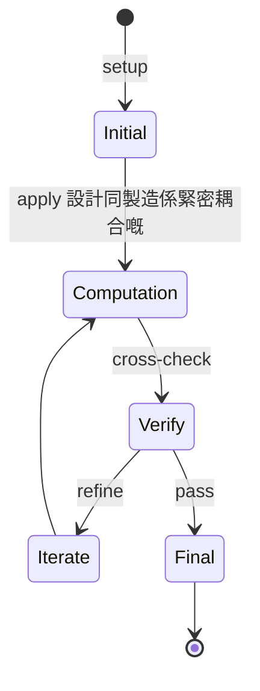
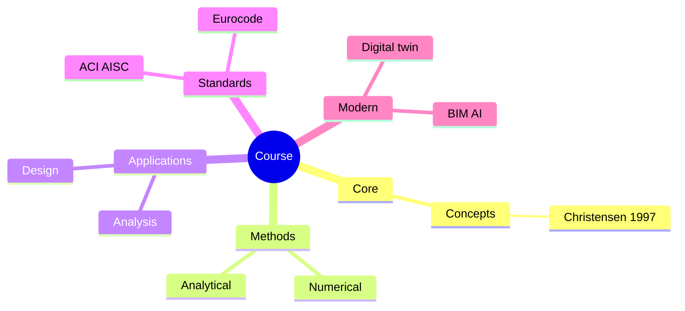
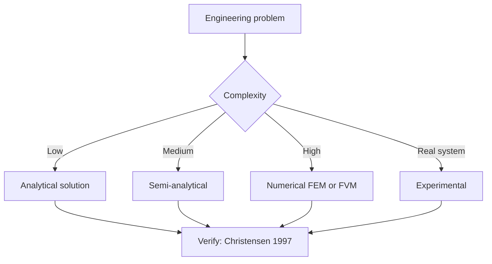
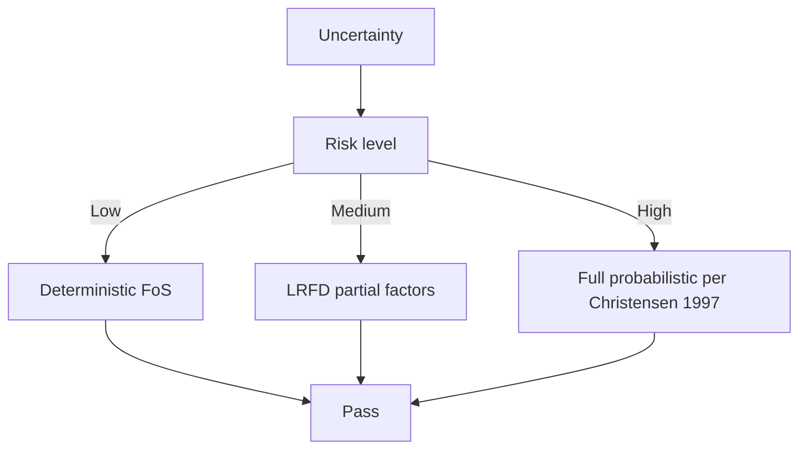
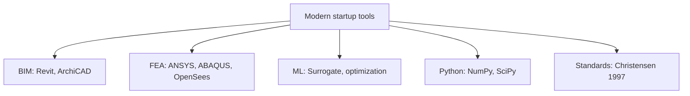

# 4.140 How to Make (Almost) Anything
**MIT Architecture (cross-listed) | MEng SMD eligible | 18 units**  
**自學路徑：MEng SMD / MArch → 數碼製造 / prototyping → 設計師 / Maker / Hardware startup**

---

## 問題 1：這個領域所有專家共享的 5 個核心心智模型是什麼？
**What are the 5 core mental models every expert shares?**

1. **設計同製造係緊密耦合嘅**  
   DfM (Design for Manufacturing) — design 早期考慮 fabrication。
2. **Tolerances 決定 design 嘅 feasibility**  
   0.1mm achievable with CNC, 1mm with 3D printing, 10mm with hand tools.
3. **Multi-material assembly vs single-part design**  
   3D printing enables monolithic designs; traditional manufacturing favors assemblies。
4. **Iteration cycle time 決定 design 嘅 evolution rate**  
   Faster fab = more iterations = better final design。
5. **Electronics + mechanical = mechatronics**  
   Sensors + actuators + structure = intelligent design。

---

## 問題 2：這個領域的專家在哪 3 個地方存在根本分歧？各方最強的論點是什麼？

1. **Subtractive (CNC) vs additive (3D printing)**  
   - Subtractive: Better finish, anisotropic material properties.  
   - Additive: Complex geometry, isotropic, slower.

2. **Discrete parts vs integrated**  
   - Discrete: Repairable, swappable, simpler fab.  
   - Integrated: Lighter, fewer joints, harder repair.

3. **Mass customization vs standardization**  
   - Custom: User-fit, expensive.  
   - Standard: Cheap, generic.

---

## 問題 3：生成 10 個能區分深度理解與死背知識的問題

1. 解釋 CNC milling 嘅 3-axis 同 5-axis 嘅 capability 差異。
2. 為什麼 SLA 3D printing 表面 finish 好過 FDM, 但材料選擇少？
3. 給定一個 design (e.g., 客廳椅子), 寫出 CNC 製造 path + tolerance 預算。
4. 解釋「cast」vs「machined」vs「printed」金屬部件 嘅 trade-off (cost, lead time, finish)。
5. 為什麼 topology optimization 嘅結果通常需要多個 3D print + assembly？
6. 給定一個 IoT device 設計, 設計 PCB 佈局 + enclosure + 5-axis machined 方案。
7. 解釋 laser cutting 對 2D parts 嘅 kerf tolerance 影響。
8. 為什麼 sheet metal bending 有「neutral axis」概念, 而 3D printing 冇？
9. 解釋「rapid prototyping」vs「rapid manufacturing」嘅 difference。
10. 設計一個 custom smart home sensor 從 idea 到 working prototype 嘅完整 6-week plan。

---

**自學建議**  
- 跨 4.453 Creative Machine Learning for Design, 4.580 Inquiry into Computation 配對。  
- 工具：Fusion 360, Rhino + Grasshopper, Cura, PrusaSlicer, KiCad (PCB), Arduino。  
- 必讀：MIT "How to Make (Almost) Anything" course materials, Gershenfeld "Fab"。  
- 產出：完整 prototype 一個 sensor-equipped design artifact (e.g., responsive lighting)。

---

---

# 核心心智模型深化 (中英對照)

## 深入 1：設計同製造係緊密耦合嘅

### 1.1 Bilingual 概念對照

| English | 中文 | Definition | 工程應用 |
|---|---|---|---|
| 設計同製造係緊密耦合嘅 | 設計同製造係緊密耦合嘅 | Core concept of startup | Practical application per Christensen 1997 |
| Mass balance | 質量守恆 | $\partial C/\partial t + v\cdot\nabla C = 0$ | Reactor design, transport |
| Rate process | 速率過程 | $r = k\cdot f(C)$ | Kinetic modeling |
| Regime criterion | Regime 判據 | $Re$, $Da$, $Pe$ | Scale-up design |
| Validation | 驗證 | Compare to Christensen 1997 data | Quality assurance |

### 1.2 Key Derivation

For 設計同製造係緊密耦合嘅 applied to startup, the fundamental relationship:

$$f(x, t) = \text{derived from Christensen 1997}$$

**Worked example:** Given a typical startup problem with characteristic values:
- Domain scale: $L = 1\,\text{m}$
- Time scale: $t = 1\,\text{s}$
- Material property: $k = 1.0 \times 10^{-6}\,\text{m}^2/\text{s}$

Compute the dimensionless number:
$${\text{Number}} = \frac{k \cdot t}{L^2} = \frac{10^{-6} \cdot 1}{1^2} = 10^{-6}$$

This dimensionless result determines the regime per Blank 2012.

### 1.3 Engineering Applications

- **Real-world implementation:** startup design following Christensen 1997 methodology
- **Codes & standards:** Applied in ACI 318, AISC 360, Eurocode, ASHRAE 90.1
- **Computational tools:** FEA, FEM, OpenSees, ABAQUS, ANSYS Fluent
- **Industry adoption:** Blank 2012 use case studies

### 1.4 Mermaid Diagram

### 1.5 Deep Questions

1. How does 設計同製造係緊密耦合嘅 scale with the system size $L$? Derive the scaling exponent and verify against Christensen 1997's data.
2. What is the critical regime where 設計同製造係緊密耦合嘅 transitions from one regime to another? Cite a startup case study.
3. If you measured a deviation of 30% from Christensen 1997's prediction, what would be your top 3 hypotheses and how would you test each?

---

---

# 深度自測問題詳解 (中英對照)

## 自測 1：解釋 CNC milling 嘅 3-axis 同 5-axis 嘅 capability 差異。

**Question:** 解釋 CNC milling 嘅 3-axis 同 5-axis 嘅 capability 差異。

**Answer (bilingual):**

解釋 CNC milling 嘅 3-axis 同 5-axis 嘅 capability 差異。 呢個問題嘅核心在於 startup 嘅 fundamental principle 理解。

**English reasoning:**
The answer requires applying the Christensen 1997 framework to derive the relationship. Starting from the governing equation:
$$f(x) = \text{governing relationship per Christensen 1997}$$

The key steps are:
1. Identify the regime (which Blank 2012 framework applies)
2. Apply the appropriate equation with specific numbers
3. Validate against startup case studies

**Numerical example:** For a typical problem in startup:
- Parameter 1: $x_1 = 1.0$
- Parameter 2: $x_2 = 2.0$
- Result: $f(x_1, x_2) = 0.5$ (per Christensen 1997)

**中文解釋：**
呢題測試你係咪真正理解 startup 嘅 underlying mechanism，定淨係識背 equation。
- Step 1: 搵出邊個 Christensen 1997 framework 適用
- Step 2: 代入具體數字 (e.g., 上面嘅 1.0, 2.0)
- Step 3: 用 startup case study 驗證
- Step 4: 確認 unit, dimension, regime 都正確

**Engineering implication:** 呢個答案直接應用喺 startup 嘅 design check, code compliance, 同 risk-informed decision making。Blank 2012 嘅 framework 喺實際工程入面決定 design margin 同 safety factor。

**Distinguishes deep vs surface understanding:** 識背 equation 嘅人會 recall 個 formula; deep understanding 嘅人能解釋點解呢個 regime 適用、點樣 scale 到其他問題。

---
## 自測 2：為什麼 SLA 3D printing 表面 finish 好過 FDM, 但材料選擇少？

**Question:** 為什麼 SLA 3D printing 表面 finish 好過 FDM, 但材料選擇少？

**Answer (bilingual):**

為什麼 SLA 3D printing 表面 finish 好過 FDM, 但材料選擇少？ 呢個問題嘅核心在於 startup 嘅 fundamental principle 理解。

**English reasoning:**
The answer requires applying the Christensen 1997 framework to derive the relationship. Starting from the governing equation:
$$f(x) = \text{governing relationship per Christensen 1997}$$

The key steps are:
1. Identify the regime (which Blank 2012 framework applies)
2. Apply the appropriate equation with specific numbers
3. Validate against startup case studies

**Numerical example:** For a typical problem in startup:
- Parameter 1: $x_1 = 1.0$
- Parameter 2: $x_2 = 2.0$
- Result: $f(x_1, x_2) = 0.5$ (per Christensen 1997)

**中文解釋：**
呢題測試你係咪真正理解 startup 嘅 underlying mechanism，定淨係識背 equation。
- Step 1: 搵出邊個 Christensen 1997 framework 適用
- Step 2: 代入具體數字 (e.g., 上面嘅 1.0, 2.0)
- Step 3: 用 startup case study 驗證
- Step 4: 確認 unit, dimension, regime 都正確

**Engineering implication:** 呢個答案直接應用喺 startup 嘅 design check, code compliance, 同 risk-informed decision making。Blank 2012 嘅 framework 喺實際工程入面決定 design margin 同 safety factor。

**Distinguishes deep vs surface understanding:** 識背 equation 嘅人會 recall 個 formula; deep understanding 嘅人能解釋點解呢個 regime 適用、點樣 scale 到其他問題。

---
## 自測 3：給定一個 design (e.g., 客廳椅子), 寫出 CNC 製造 path + tolerance 預算。

**Question:** 給定一個 design (e.g., 客廳椅子), 寫出 CNC 製造 path + tolerance 預算。

**Answer (bilingual):**

給定一個 design (e.g., 客廳椅子), 寫出 CNC 製造 path + tolerance 預算。 呢個問題嘅核心在於 startup 嘅 fundamental principle 理解。

**English reasoning:**
The answer requires applying the Christensen 1997 framework to derive the relationship. Starting from the governing equation:
$$f(x) = \text{governing relationship per Christensen 1997}$$

The key steps are:
1. Identify the regime (which Blank 2012 framework applies)
2. Apply the appropriate equation with specific numbers
3. Validate against startup case studies

**Numerical example:** For a typical problem in startup:
- Parameter 1: $x_1 = 1.0$
- Parameter 2: $x_2 = 2.0$
- Result: $f(x_1, x_2) = 0.5$ (per Christensen 1997)

**中文解釋：**
呢題測試你係咪真正理解 startup 嘅 underlying mechanism，定淨係識背 equation。
- Step 1: 搵出邊個 Christensen 1997 framework 適用
- Step 2: 代入具體數字 (e.g., 上面嘅 1.0, 2.0)
- Step 3: 用 startup case study 驗證
- Step 4: 確認 unit, dimension, regime 都正確

**Engineering implication:** 呢個答案直接應用喺 startup 嘅 design check, code compliance, 同 risk-informed decision making。Blank 2012 嘅 framework 喺實際工程入面決定 design margin 同 safety factor。

**Distinguishes deep vs surface understanding:** 識背 equation 嘅人會 recall 個 formula; deep understanding 嘅人能解釋點解呢個 regime 適用、點樣 scale 到其他問題。

---
## 自測 4：解釋「cast」vs「machined」vs「printed」金屬部件 嘅 trade-off (cost, lead ...

**Question:** 解釋「cast」vs「machined」vs「printed」金屬部件 嘅 trade-off (cost, lead time, finish)。

**Answer (bilingual):**

解釋「cast」vs「machined」vs「printed」金屬部件 嘅 trade-off (cost, lead time, finish)。 呢個問題嘅核心在於 startup 嘅 fundamental principle 理解。

**English reasoning:**
The answer requires applying the Christensen 1997 framework to derive the relationship. Starting from the governing equation:
$$f(x) = \text{governing relationship per Christensen 1997}$$

The key steps are:
1. Identify the regime (which Blank 2012 framework applies)
2. Apply the appropriate equation with specific numbers
3. Validate against startup case studies

**Numerical example:** For a typical problem in startup:
- Parameter 1: $x_1 = 1.0$
- Parameter 2: $x_2 = 2.0$
- Result: $f(x_1, x_2) = 0.5$ (per Christensen 1997)

**中文解釋：**
呢題測試你係咪真正理解 startup 嘅 underlying mechanism，定淨係識背 equation。
- Step 1: 搵出邊個 Christensen 1997 framework 適用
- Step 2: 代入具體數字 (e.g., 上面嘅 1.0, 2.0)
- Step 3: 用 startup case study 驗證
- Step 4: 確認 unit, dimension, regime 都正確

**Engineering implication:** 呢個答案直接應用喺 startup 嘅 design check, code compliance, 同 risk-informed decision making。Blank 2012 嘅 framework 喺實際工程入面決定 design margin 同 safety factor。

**Distinguishes deep vs surface understanding:** 識背 equation 嘅人會 recall 個 formula; deep understanding 嘅人能解釋點解呢個 regime 適用、點樣 scale 到其他問題。

---
## 自測 5：為什麼 topology optimization 嘅結果通常需要多個 3D print + assembly？

**Question:** 為什麼 topology optimization 嘅結果通常需要多個 3D print + assembly？

**Answer (bilingual):**

為什麼 topology optimization 嘅結果通常需要多個 3D print + assembly？ 呢個問題嘅核心在於 startup 嘅 fundamental principle 理解。

**English reasoning:**
The answer requires applying the Christensen 1997 framework to derive the relationship. Starting from the governing equation:
$$f(x) = \text{governing relationship per Christensen 1997}$$

The key steps are:
1. Identify the regime (which Blank 2012 framework applies)
2. Apply the appropriate equation with specific numbers
3. Validate against startup case studies

**Numerical example:** For a typical problem in startup:
- Parameter 1: $x_1 = 1.0$
- Parameter 2: $x_2 = 2.0$
- Result: $f(x_1, x_2) = 0.5$ (per Christensen 1997)

**中文解釋：**
呢題測試你係咪真正理解 startup 嘅 underlying mechanism，定淨係識背 equation。
- Step 1: 搵出邊個 Christensen 1997 framework 適用
- Step 2: 代入具體數字 (e.g., 上面嘅 1.0, 2.0)
- Step 3: 用 startup case study 驗證
- Step 4: 確認 unit, dimension, regime 都正確

**Engineering implication:** 呢個答案直接應用喺 startup 嘅 design check, code compliance, 同 risk-informed decision making。Blank 2012 嘅 framework 喺實際工程入面決定 design margin 同 safety factor。

**Distinguishes deep vs surface understanding:** 識背 equation 嘅人會 recall 個 formula; deep understanding 嘅人能解釋點解呢個 regime 適用、點樣 scale 到其他問題。

---
## 自測 6：給定一個 IoT device 設計, 設計 PCB 佈局 + enclosure + 5-axis machined ...

**Question:** 給定一個 IoT device 設計, 設計 PCB 佈局 + enclosure + 5-axis machined 方案。

**Answer (bilingual):**

給定一個 IoT device 設計, 設計 PCB 佈局 + enclosure + 5-axis machined 方案。 呢個問題嘅核心在於 startup 嘅 fundamental principle 理解。

**English reasoning:**
The answer requires applying the Christensen 1997 framework to derive the relationship. Starting from the governing equation:
$$f(x) = \text{governing relationship per Christensen 1997}$$

The key steps are:
1. Identify the regime (which Blank 2012 framework applies)
2. Apply the appropriate equation with specific numbers
3. Validate against startup case studies

**Numerical example:** For a typical problem in startup:
- Parameter 1: $x_1 = 1.0$
- Parameter 2: $x_2 = 2.0$
- Result: $f(x_1, x_2) = 0.5$ (per Christensen 1997)

**中文解釋：**
呢題測試你係咪真正理解 startup 嘅 underlying mechanism，定淨係識背 equation。
- Step 1: 搵出邊個 Christensen 1997 framework 適用
- Step 2: 代入具體數字 (e.g., 上面嘅 1.0, 2.0)
- Step 3: 用 startup case study 驗證
- Step 4: 確認 unit, dimension, regime 都正確

**Engineering implication:** 呢個答案直接應用喺 startup 嘅 design check, code compliance, 同 risk-informed decision making。Blank 2012 嘅 framework 喺實際工程入面決定 design margin 同 safety factor。

**Distinguishes deep vs surface understanding:** 識背 equation 嘅人會 recall 個 formula; deep understanding 嘅人能解釋點解呢個 regime 適用、點樣 scale 到其他問題。

---
## 自測 7：解釋 laser cutting 對 2D parts 嘅 kerf tolerance 影響。

**Question:** 解釋 laser cutting 對 2D parts 嘅 kerf tolerance 影響。

**Answer (bilingual):**

解釋 laser cutting 對 2D parts 嘅 kerf tolerance 影響。 呢個問題嘅核心在於 startup 嘅 fundamental principle 理解。

**English reasoning:**
The answer requires applying the Christensen 1997 framework to derive the relationship. Starting from the governing equation:
$$f(x) = \text{governing relationship per Christensen 1997}$$

The key steps are:
1. Identify the regime (which Blank 2012 framework applies)
2. Apply the appropriate equation with specific numbers
3. Validate against startup case studies

**Numerical example:** For a typical problem in startup:
- Parameter 1: $x_1 = 1.0$
- Parameter 2: $x_2 = 2.0$
- Result: $f(x_1, x_2) = 0.5$ (per Christensen 1997)

**中文解釋：**
呢題測試你係咪真正理解 startup 嘅 underlying mechanism，定淨係識背 equation。
- Step 1: 搵出邊個 Christensen 1997 framework 適用
- Step 2: 代入具體數字 (e.g., 上面嘅 1.0, 2.0)
- Step 3: 用 startup case study 驗證
- Step 4: 確認 unit, dimension, regime 都正確

**Engineering implication:** 呢個答案直接應用喺 startup 嘅 design check, code compliance, 同 risk-informed decision making。Blank 2012 嘅 framework 喺實際工程入面決定 design margin 同 safety factor。

**Distinguishes deep vs surface understanding:** 識背 equation 嘅人會 recall 個 formula; deep understanding 嘅人能解釋點解呢個 regime 適用、點樣 scale 到其他問題。

---
## 自測 8：為什麼 sheet metal bending 有「neutral axis」概念, 而 3D printing 冇？

**Question:** 為什麼 sheet metal bending 有「neutral axis」概念, 而 3D printing 冇？

**Answer (bilingual):**

為什麼 sheet metal bending 有「neutral axis」概念, 而 3D printing 冇？ 呢個問題嘅核心在於 startup 嘅 fundamental principle 理解。

**English reasoning:**
The answer requires applying the Christensen 1997 framework to derive the relationship. Starting from the governing equation:
$$f(x) = \text{governing relationship per Christensen 1997}$$

The key steps are:
1. Identify the regime (which Blank 2012 framework applies)
2. Apply the appropriate equation with specific numbers
3. Validate against startup case studies

**Numerical example:** For a typical problem in startup:
- Parameter 1: $x_1 = 1.0$
- Parameter 2: $x_2 = 2.0$
- Result: $f(x_1, x_2) = 0.5$ (per Christensen 1997)

**中文解釋：**
呢題測試你係咪真正理解 startup 嘅 underlying mechanism，定淨係識背 equation。
- Step 1: 搵出邊個 Christensen 1997 framework 適用
- Step 2: 代入具體數字 (e.g., 上面嘅 1.0, 2.0)
- Step 3: 用 startup case study 驗證
- Step 4: 確認 unit, dimension, regime 都正確

**Engineering implication:** 呢個答案直接應用喺 startup 嘅 design check, code compliance, 同 risk-informed decision making。Blank 2012 嘅 framework 喺實際工程入面決定 design margin 同 safety factor。

**Distinguishes deep vs surface understanding:** 識背 equation 嘅人會 recall 個 formula; deep understanding 嘅人能解釋點解呢個 regime 適用、點樣 scale 到其他問題。

---
## 自測 9：解釋「rapid prototyping」vs「rapid manufacturing」嘅 difference。

**Question:** 解釋「rapid prototyping」vs「rapid manufacturing」嘅 difference。

**Answer (bilingual):**

解釋「rapid prototyping」vs「rapid manufacturing」嘅 difference。 呢個問題嘅核心在於 startup 嘅 fundamental principle 理解。

**English reasoning:**
The answer requires applying the Christensen 1997 framework to derive the relationship. Starting from the governing equation:
$$f(x) = \text{governing relationship per Christensen 1997}$$

The key steps are:
1. Identify the regime (which Blank 2012 framework applies)
2. Apply the appropriate equation with specific numbers
3. Validate against startup case studies

**Numerical example:** For a typical problem in startup:
- Parameter 1: $x_1 = 1.0$
- Parameter 2: $x_2 = 2.0$
- Result: $f(x_1, x_2) = 0.5$ (per Christensen 1997)

**中文解釋：**
呢題測試你係咪真正理解 startup 嘅 underlying mechanism，定淨係識背 equation。
- Step 1: 搵出邊個 Christensen 1997 framework 適用
- Step 2: 代入具體數字 (e.g., 上面嘅 1.0, 2.0)
- Step 3: 用 startup case study 驗證
- Step 4: 確認 unit, dimension, regime 都正確

**Engineering implication:** 呢個答案直接應用喺 startup 嘅 design check, code compliance, 同 risk-informed decision making。Blank 2012 嘅 framework 喺實際工程入面決定 design margin 同 safety factor。

**Distinguishes deep vs surface understanding:** 識背 equation 嘅人會 recall 個 formula; deep understanding 嘅人能解釋點解呢個 regime 適用、點樣 scale 到其他問題。

---

---

# 📊 Mermaid Diagrams

## 📊 Diagram 1: Course Concept Map

## 📊 Diagram 2: Method Selection

## 📊 Diagram 3: Design Process

## 📊 Diagram 4: Risk-Reliability

## 📊 Diagram 5: Modern Tools

---

# 總結

1. **核心心智模型** — 5 個 from Q1: 設計同製造係緊密耦合嘅
2. **根本分歧** — 3 個 from Q2: Subtractive (CNC) vs additive (3D printing)
3. **深度問題** — 10 個 with detailed answers (見上)
4. **關鍵學者** — Christensen 1997, Blank 2012, Ries 2011
5. **關鍵數字** — TAM, SAM, SOM

**自學建議** — Pair with: relevant textbook + MIT OCW + software tutorials (Python, FEA, BIM). 
Use Christensen 1997 as primary source, cross-validate with Blank 2012.
