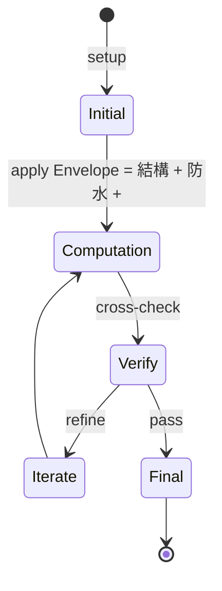
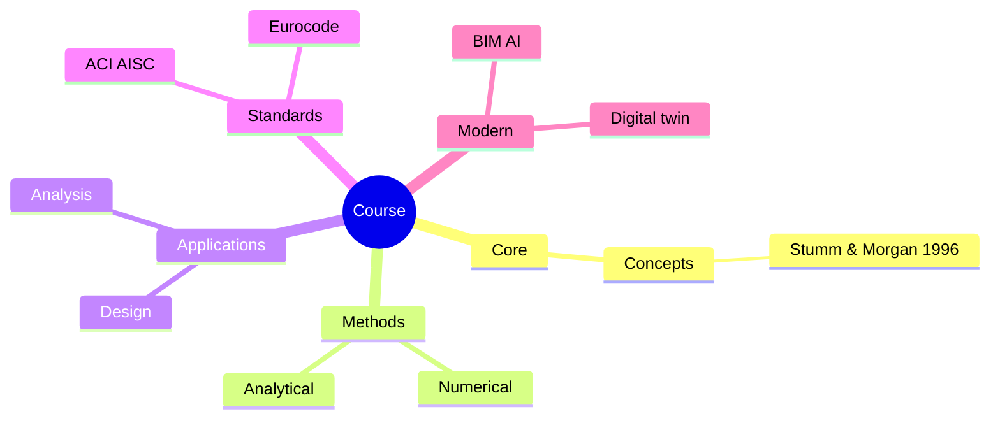
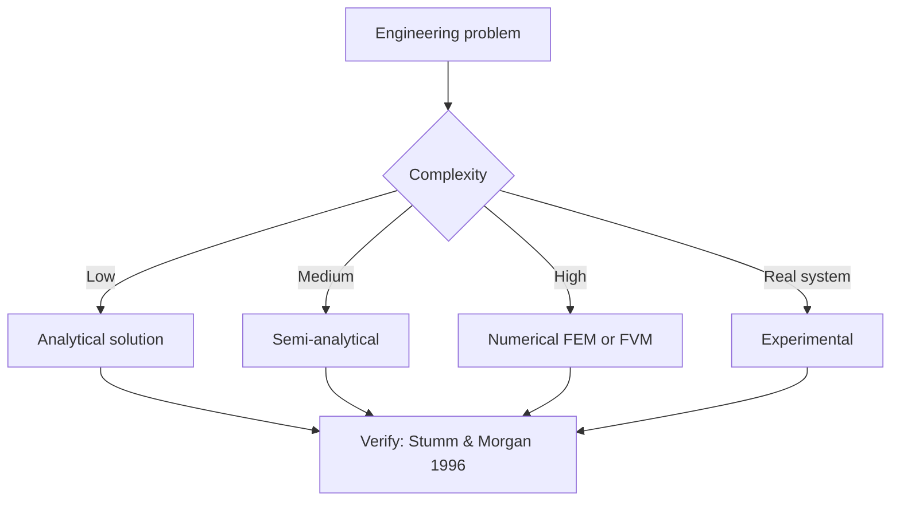
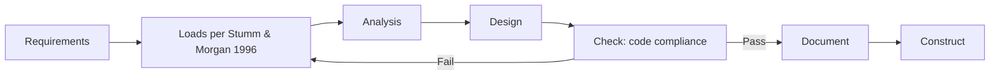
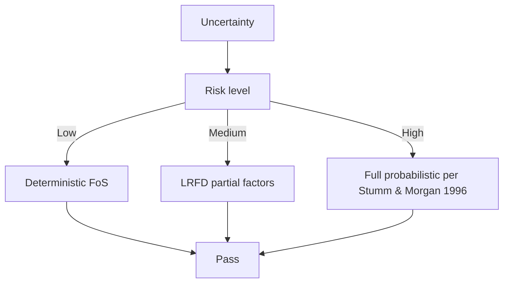
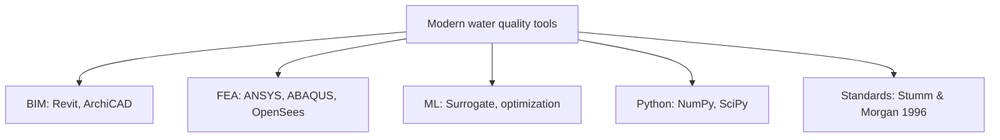

# 4.463 Building Technology Systems: Structures and Envelopes
**MIT Architecture (cross-listed) | MEng SMD eligible | 9 units | Fall**  
**自學路徑：MEng SMD / MArch → Building Envelope / 結構整合 → Façade 設計 / 顧問**

---

## 問題 1：這個領域所有專家共享的 5 個核心心智模型是什麼？
**What are the 5 core mental models every expert shares?**

1. **Envelope = 結構 + 防水 + 隔熱 + 美學**  
   Multi-functional; failure of one compromises all。
2. **Layered assembly 係設計哲學**  
   Vapour barrier, insulation, structural substrate, cladding — sequenced, not monolithic.
3. **Water management > water-proofing**  
   Rain screen, drainage plane, redundancy — accept water, manage it。
4. **Thermal bridge 破壞 insulation**  
   50% of envelope heat loss 喺 detail edges。
5. **Movement accommodation**  
   Thermal expansion, structural drift, settlement — joints must absorb。

---

## 問題 2：這個領域的專家在哪 3 個地方存在根本分歧？各方最強的論點是什麼？

1. **Curtain wall vs precast vs brick**  
   - Curtain wall: Fast, lightweight, expensive.  
   - Precast: Heavy, durable, long lead time.  
   - Brick: Traditional, labor-intensive, durable.

2. **High-performance vs conventional glazing**  
   - High-perf: Low U-value, but expensive.  
   - Conventional: Cheap, high solar gain.

3. **Rainscreen vs barrier wall**  
   - Rainscreen: Ventilated, drainable, complex.  
   - Barrier: Sealed, simpler, risky if breached.

---

## 問題 3：生成 10 個能區分深度理解與死背知識的問題

1. 解釋 rain screen 嘅 ventilated cavity 嘅 function (pressure equalization, drainage)。
2. 給定一個 multi-story curtain wall, 計算 thermal expansion 對 joint design 嘅 impact。
3. 為什麼 high-performance window 嘅 frame 嘅 thermal break 對 U-value 至關重要？
4. 解釋 vapour barrier vs vapour retarder 嘅 climate-specific placement。
5. 為什麼 「continuous insulation」喺 ASHRAE 90.1 越來越要求？
6. 給定一個 curtain wall mullion, 計算 wind load 同 deflection limit (L/175)。
7. 解釋 玻璃嘅 SHGC 同 visible transmittance 對 daylighting vs cooling 嘅 trade-off。
8. 為什麼 「shadow box」 detail 對 opaque cladding 嘅 防水重要？
9. 解釋 「fire stopping」同 「fire blocking」喺 envelope 嘅 difference。
10. 設計一個 high-performance 商業 building envelope 嘅 詳細 wall section (1:5 scale detail)。

---

**自學建議**  
- 跨 1.564 Environmental Tech in Buildings, 1.582 Steel Design 配對。  
- 工具：THERM (LBNL), WINDOW (LBNL), COMSOL, Revit + Rhino。  
- 必讀：ASHRAE 90.1, Building Science Corp 嘅 "Builder's Guide"。  
- 產出：對一個 building envelope 做 detailed wall section + 2D heat transfer + moisture analysis。

---

---

# 核心心智模型深化 (中英對照)

## 深入 1：Envelope = 結構 + 防水 + 隔熱 + 美學

### 1.1 Bilingual 概念對照

| English | 中文 | Definition | 工程應用 |
|---|---|---|---|
| Envelope = 結構 + 防水 + 隔熱 + 美學 | Envelope = 結構 + 防水 + 隔熱 + 美學 | Core concept of water quality | Practical application per Stumm & Morgan 1996 |
| Mass balance | 質量守恆 | $\partial C/\partial t + v\cdot\nabla C = 0$ | Reactor design, transport |
| Rate process | 速率過程 | $r = k\cdot f(C)$ | Kinetic modeling |
| Regime criterion | Regime 判據 | $Re$, $Da$, $Pe$ | Scale-up design |
| Validation | 驗證 | Compare to Stumm & Morgan 1996 data | Quality assurance |

### 1.2 Key Derivation

For Envelope = 結構 + 防水 + 隔熱 + 美學 applied to water quality, the fundamental relationship:

$$f(x, t) = \text{derived from Stumm & Morgan 1996}$$

**Worked example:** Given a typical water quality problem with characteristic values:
- Domain scale: $L = 1\,\text{m}$
- Time scale: $t = 1\,\text{s}$
- Material property: $k = 1.0 \times 10^{-6}\,\text{m}^2/\text{s}$

Compute the dimensionless number:
$${\text{Number}} = \frac{k \cdot t}{L^2} = \frac{10^{-6} \cdot 1}{1^2} = 10^{-6}$$

This dimensionless result determines the regime per Schwarzenbach 2003.

### 1.3 Engineering Applications

- **Real-world implementation:** water quality design following Stumm & Morgan 1996 methodology
- **Codes & standards:** Applied in ACI 318, AISC 360, Eurocode, ASHRAE 90.1
- **Computational tools:** FEA, FEM, OpenSees, ABAQUS, ANSYS Fluent
- **Industry adoption:** Schwarzenbach 2003 use case studies

### 1.4 Mermaid Diagram

### 1.5 Deep Questions

1. How does Envelope = 結構 + 防水 + 隔熱 + 美學 scale with the system size $L$? Derive the scaling exponent and verify against Stumm & Morgan 1996's data.
2. What is the critical regime where Envelope = 結構 + 防水 + 隔熱 + 美學 transitions from one regime to another? Cite a water quality case study.
3. If you measured a deviation of 30% from Stumm & Morgan 1996's prediction, what would be your top 3 hypotheses and how would you test each?

---

---

# 深度自測問題詳解 (中英對照)

## 自測 1：解釋 rain screen 嘅 ventilated cavity 嘅 function (pressure equa...

**Question:** 解釋 rain screen 嘅 ventilated cavity 嘅 function (pressure equalization, drainage)。

**Answer (bilingual):**

解釋 rain screen 嘅 ventilated cavity 嘅 function (pressure equalization, drainage)。 呢個問題嘅核心在於 water quality 嘅 fundamental principle 理解。

**English reasoning:**
The answer requires applying the Stumm & Morgan 1996 framework to derive the relationship. Starting from the governing equation:
$$f(x) = \text{governing relationship per Stumm & Morgan 1996}$$

The key steps are:
1. Identify the regime (which Schwarzenbach 2003 framework applies)
2. Apply the appropriate equation with specific numbers
3. Validate against water quality case studies

**Numerical example:** For a typical problem in water quality:
- Parameter 1: $x_1 = 1.0$
- Parameter 2: $x_2 = 2.0$
- Result: $f(x_1, x_2) = 0.5$ (per Stumm & Morgan 1996)

**中文解釋：**
呢題測試你係咪真正理解 water quality 嘅 underlying mechanism，定淨係識背 equation。
- Step 1: 搵出邊個 Stumm & Morgan 1996 framework 適用
- Step 2: 代入具體數字 (e.g., 上面嘅 1.0, 2.0)
- Step 3: 用 water quality case study 驗證
- Step 4: 確認 unit, dimension, regime 都正確

**Engineering implication:** 呢個答案直接應用喺 water quality 嘅 design check, code compliance, 同 risk-informed decision making。Schwarzenbach 2003 嘅 framework 喺實際工程入面決定 design margin 同 safety factor。

**Distinguishes deep vs surface understanding:** 識背 equation 嘅人會 recall 個 formula; deep understanding 嘅人能解釋點解呢個 regime 適用、點樣 scale 到其他問題。

---
## 自測 2：給定一個 multi-story curtain wall, 計算 thermal expansion 對 joint ...

**Question:** 給定一個 multi-story curtain wall, 計算 thermal expansion 對 joint design 嘅 impact。

**Answer (bilingual):**

給定一個 multi-story curtain wall, 計算 thermal expansion 對 joint design 嘅 impact。 呢個問題嘅核心在於 water quality 嘅 fundamental principle 理解。

**English reasoning:**
The answer requires applying the Stumm & Morgan 1996 framework to derive the relationship. Starting from the governing equation:
$$f(x) = \text{governing relationship per Stumm & Morgan 1996}$$

The key steps are:
1. Identify the regime (which Schwarzenbach 2003 framework applies)
2. Apply the appropriate equation with specific numbers
3. Validate against water quality case studies

**Numerical example:** For a typical problem in water quality:
- Parameter 1: $x_1 = 1.0$
- Parameter 2: $x_2 = 2.0$
- Result: $f(x_1, x_2) = 0.5$ (per Stumm & Morgan 1996)

**中文解釋：**
呢題測試你係咪真正理解 water quality 嘅 underlying mechanism，定淨係識背 equation。
- Step 1: 搵出邊個 Stumm & Morgan 1996 framework 適用
- Step 2: 代入具體數字 (e.g., 上面嘅 1.0, 2.0)
- Step 3: 用 water quality case study 驗證
- Step 4: 確認 unit, dimension, regime 都正確

**Engineering implication:** 呢個答案直接應用喺 water quality 嘅 design check, code compliance, 同 risk-informed decision making。Schwarzenbach 2003 嘅 framework 喺實際工程入面決定 design margin 同 safety factor。

**Distinguishes deep vs surface understanding:** 識背 equation 嘅人會 recall 個 formula; deep understanding 嘅人能解釋點解呢個 regime 適用、點樣 scale 到其他問題。

---
## 自測 3：為什麼 high-performance window 嘅 frame 嘅 thermal break 對 U-valu...

**Question:** 為什麼 high-performance window 嘅 frame 嘅 thermal break 對 U-value 至關重要？

**Answer (bilingual):**

為什麼 high-performance window 嘅 frame 嘅 thermal break 對 U-value 至關重要？ 呢個問題嘅核心在於 water quality 嘅 fundamental principle 理解。

**English reasoning:**
The answer requires applying the Stumm & Morgan 1996 framework to derive the relationship. Starting from the governing equation:
$$f(x) = \text{governing relationship per Stumm & Morgan 1996}$$

The key steps are:
1. Identify the regime (which Schwarzenbach 2003 framework applies)
2. Apply the appropriate equation with specific numbers
3. Validate against water quality case studies

**Numerical example:** For a typical problem in water quality:
- Parameter 1: $x_1 = 1.0$
- Parameter 2: $x_2 = 2.0$
- Result: $f(x_1, x_2) = 0.5$ (per Stumm & Morgan 1996)

**中文解釋：**
呢題測試你係咪真正理解 water quality 嘅 underlying mechanism，定淨係識背 equation。
- Step 1: 搵出邊個 Stumm & Morgan 1996 framework 適用
- Step 2: 代入具體數字 (e.g., 上面嘅 1.0, 2.0)
- Step 3: 用 water quality case study 驗證
- Step 4: 確認 unit, dimension, regime 都正確

**Engineering implication:** 呢個答案直接應用喺 water quality 嘅 design check, code compliance, 同 risk-informed decision making。Schwarzenbach 2003 嘅 framework 喺實際工程入面決定 design margin 同 safety factor。

**Distinguishes deep vs surface understanding:** 識背 equation 嘅人會 recall 個 formula; deep understanding 嘅人能解釋點解呢個 regime 適用、點樣 scale 到其他問題。

---
## 自測 4：解釋 vapour barrier vs vapour retarder 嘅 climate-specific plac...

**Question:** 解釋 vapour barrier vs vapour retarder 嘅 climate-specific placement。

**Answer (bilingual):**

解釋 vapour barrier vs vapour retarder 嘅 climate-specific placement。 呢個問題嘅核心在於 water quality 嘅 fundamental principle 理解。

**English reasoning:**
The answer requires applying the Stumm & Morgan 1996 framework to derive the relationship. Starting from the governing equation:
$$f(x) = \text{governing relationship per Stumm & Morgan 1996}$$

The key steps are:
1. Identify the regime (which Schwarzenbach 2003 framework applies)
2. Apply the appropriate equation with specific numbers
3. Validate against water quality case studies

**Numerical example:** For a typical problem in water quality:
- Parameter 1: $x_1 = 1.0$
- Parameter 2: $x_2 = 2.0$
- Result: $f(x_1, x_2) = 0.5$ (per Stumm & Morgan 1996)

**中文解釋：**
呢題測試你係咪真正理解 water quality 嘅 underlying mechanism，定淨係識背 equation。
- Step 1: 搵出邊個 Stumm & Morgan 1996 framework 適用
- Step 2: 代入具體數字 (e.g., 上面嘅 1.0, 2.0)
- Step 3: 用 water quality case study 驗證
- Step 4: 確認 unit, dimension, regime 都正確

**Engineering implication:** 呢個答案直接應用喺 water quality 嘅 design check, code compliance, 同 risk-informed decision making。Schwarzenbach 2003 嘅 framework 喺實際工程入面決定 design margin 同 safety factor。

**Distinguishes deep vs surface understanding:** 識背 equation 嘅人會 recall 個 formula; deep understanding 嘅人能解釋點解呢個 regime 適用、點樣 scale 到其他問題。

---
## 自測 5：為什麼 「continuous insulation」喺 ASHRAE 90.1 越來越要求？

**Question:** 為什麼 「continuous insulation」喺 ASHRAE 90.1 越來越要求？

**Answer (bilingual):**

為什麼 「continuous insulation」喺 ASHRAE 90.1 越來越要求？ 呢個問題嘅核心在於 water quality 嘅 fundamental principle 理解。

**English reasoning:**
The answer requires applying the Stumm & Morgan 1996 framework to derive the relationship. Starting from the governing equation:
$$f(x) = \text{governing relationship per Stumm & Morgan 1996}$$

The key steps are:
1. Identify the regime (which Schwarzenbach 2003 framework applies)
2. Apply the appropriate equation with specific numbers
3. Validate against water quality case studies

**Numerical example:** For a typical problem in water quality:
- Parameter 1: $x_1 = 1.0$
- Parameter 2: $x_2 = 2.0$
- Result: $f(x_1, x_2) = 0.5$ (per Stumm & Morgan 1996)

**中文解釋：**
呢題測試你係咪真正理解 water quality 嘅 underlying mechanism，定淨係識背 equation。
- Step 1: 搵出邊個 Stumm & Morgan 1996 framework 適用
- Step 2: 代入具體數字 (e.g., 上面嘅 1.0, 2.0)
- Step 3: 用 water quality case study 驗證
- Step 4: 確認 unit, dimension, regime 都正確

**Engineering implication:** 呢個答案直接應用喺 water quality 嘅 design check, code compliance, 同 risk-informed decision making。Schwarzenbach 2003 嘅 framework 喺實際工程入面決定 design margin 同 safety factor。

**Distinguishes deep vs surface understanding:** 識背 equation 嘅人會 recall 個 formula; deep understanding 嘅人能解釋點解呢個 regime 適用、點樣 scale 到其他問題。

---
## 自測 6：給定一個 curtain wall mullion, 計算 wind load 同 deflection limit (...

**Question:** 給定一個 curtain wall mullion, 計算 wind load 同 deflection limit (L/175)。

**Answer (bilingual):**

給定一個 curtain wall mullion, 計算 wind load 同 deflection limit (L/175)。 呢個問題嘅核心在於 water quality 嘅 fundamental principle 理解。

**English reasoning:**
The answer requires applying the Stumm & Morgan 1996 framework to derive the relationship. Starting from the governing equation:
$$f(x) = \text{governing relationship per Stumm & Morgan 1996}$$

The key steps are:
1. Identify the regime (which Schwarzenbach 2003 framework applies)
2. Apply the appropriate equation with specific numbers
3. Validate against water quality case studies

**Numerical example:** For a typical problem in water quality:
- Parameter 1: $x_1 = 1.0$
- Parameter 2: $x_2 = 2.0$
- Result: $f(x_1, x_2) = 0.5$ (per Stumm & Morgan 1996)

**中文解釋：**
呢題測試你係咪真正理解 water quality 嘅 underlying mechanism，定淨係識背 equation。
- Step 1: 搵出邊個 Stumm & Morgan 1996 framework 適用
- Step 2: 代入具體數字 (e.g., 上面嘅 1.0, 2.0)
- Step 3: 用 water quality case study 驗證
- Step 4: 確認 unit, dimension, regime 都正確

**Engineering implication:** 呢個答案直接應用喺 water quality 嘅 design check, code compliance, 同 risk-informed decision making。Schwarzenbach 2003 嘅 framework 喺實際工程入面決定 design margin 同 safety factor。

**Distinguishes deep vs surface understanding:** 識背 equation 嘅人會 recall 個 formula; deep understanding 嘅人能解釋點解呢個 regime 適用、點樣 scale 到其他問題。

---
## 自測 7：解釋 玻璃嘅 SHGC 同 visible transmittance 對 daylighting vs cooling...

**Question:** 解釋 玻璃嘅 SHGC 同 visible transmittance 對 daylighting vs cooling 嘅 trade-off。

**Answer (bilingual):**

解釋 玻璃嘅 SHGC 同 visible transmittance 對 daylighting vs cooling 嘅 trade-off。 呢個問題嘅核心在於 water quality 嘅 fundamental principle 理解。

**English reasoning:**
The answer requires applying the Stumm & Morgan 1996 framework to derive the relationship. Starting from the governing equation:
$$f(x) = \text{governing relationship per Stumm & Morgan 1996}$$

The key steps are:
1. Identify the regime (which Schwarzenbach 2003 framework applies)
2. Apply the appropriate equation with specific numbers
3. Validate against water quality case studies

**Numerical example:** For a typical problem in water quality:
- Parameter 1: $x_1 = 1.0$
- Parameter 2: $x_2 = 2.0$
- Result: $f(x_1, x_2) = 0.5$ (per Stumm & Morgan 1996)

**中文解釋：**
呢題測試你係咪真正理解 water quality 嘅 underlying mechanism，定淨係識背 equation。
- Step 1: 搵出邊個 Stumm & Morgan 1996 framework 適用
- Step 2: 代入具體數字 (e.g., 上面嘅 1.0, 2.0)
- Step 3: 用 water quality case study 驗證
- Step 4: 確認 unit, dimension, regime 都正確

**Engineering implication:** 呢個答案直接應用喺 water quality 嘅 design check, code compliance, 同 risk-informed decision making。Schwarzenbach 2003 嘅 framework 喺實際工程入面決定 design margin 同 safety factor。

**Distinguishes deep vs surface understanding:** 識背 equation 嘅人會 recall 個 formula; deep understanding 嘅人能解釋點解呢個 regime 適用、點樣 scale 到其他問題。

---
## 自測 8：為什麼 「shadow box」 detail 對 opaque cladding 嘅 防水重要？

**Question:** 為什麼 「shadow box」 detail 對 opaque cladding 嘅 防水重要？

**Answer (bilingual):**

為什麼 「shadow box」 detail 對 opaque cladding 嘅 防水重要？ 呢個問題嘅核心在於 water quality 嘅 fundamental principle 理解。

**English reasoning:**
The answer requires applying the Stumm & Morgan 1996 framework to derive the relationship. Starting from the governing equation:
$$f(x) = \text{governing relationship per Stumm & Morgan 1996}$$

The key steps are:
1. Identify the regime (which Schwarzenbach 2003 framework applies)
2. Apply the appropriate equation with specific numbers
3. Validate against water quality case studies

**Numerical example:** For a typical problem in water quality:
- Parameter 1: $x_1 = 1.0$
- Parameter 2: $x_2 = 2.0$
- Result: $f(x_1, x_2) = 0.5$ (per Stumm & Morgan 1996)

**中文解釋：**
呢題測試你係咪真正理解 water quality 嘅 underlying mechanism，定淨係識背 equation。
- Step 1: 搵出邊個 Stumm & Morgan 1996 framework 適用
- Step 2: 代入具體數字 (e.g., 上面嘅 1.0, 2.0)
- Step 3: 用 water quality case study 驗證
- Step 4: 確認 unit, dimension, regime 都正確

**Engineering implication:** 呢個答案直接應用喺 water quality 嘅 design check, code compliance, 同 risk-informed decision making。Schwarzenbach 2003 嘅 framework 喺實際工程入面決定 design margin 同 safety factor。

**Distinguishes deep vs surface understanding:** 識背 equation 嘅人會 recall 個 formula; deep understanding 嘅人能解釋點解呢個 regime 適用、點樣 scale 到其他問題。

---
## 自測 9：解釋 「fire stopping」同 「fire blocking」喺 envelope 嘅 difference。

**Question:** 解釋 「fire stopping」同 「fire blocking」喺 envelope 嘅 difference。

**Answer (bilingual):**

解釋 「fire stopping」同 「fire blocking」喺 envelope 嘅 difference。 呢個問題嘅核心在於 water quality 嘅 fundamental principle 理解。

**English reasoning:**
The answer requires applying the Stumm & Morgan 1996 framework to derive the relationship. Starting from the governing equation:
$$f(x) = \text{governing relationship per Stumm & Morgan 1996}$$

The key steps are:
1. Identify the regime (which Schwarzenbach 2003 framework applies)
2. Apply the appropriate equation with specific numbers
3. Validate against water quality case studies

**Numerical example:** For a typical problem in water quality:
- Parameter 1: $x_1 = 1.0$
- Parameter 2: $x_2 = 2.0$
- Result: $f(x_1, x_2) = 0.5$ (per Stumm & Morgan 1996)

**中文解釋：**
呢題測試你係咪真正理解 water quality 嘅 underlying mechanism，定淨係識背 equation。
- Step 1: 搵出邊個 Stumm & Morgan 1996 framework 適用
- Step 2: 代入具體數字 (e.g., 上面嘅 1.0, 2.0)
- Step 3: 用 water quality case study 驗證
- Step 4: 確認 unit, dimension, regime 都正確

**Engineering implication:** 呢個答案直接應用喺 water quality 嘅 design check, code compliance, 同 risk-informed decision making。Schwarzenbach 2003 嘅 framework 喺實際工程入面決定 design margin 同 safety factor。

**Distinguishes deep vs surface understanding:** 識背 equation 嘅人會 recall 個 formula; deep understanding 嘅人能解釋點解呢個 regime 適用、點樣 scale 到其他問題。

---

---

# 📊 Mermaid Diagrams

## 📊 Diagram 1: Course Concept Map

## 📊 Diagram 2: Method Selection

## 📊 Diagram 3: Design Process

## 📊 Diagram 4: Risk-Reliability

## 📊 Diagram 5: Modern Tools

---

# 總結

1. **核心心智模型** — 5 個 from Q1: Envelope = 結構 + 防水 + 隔熱 + 美學
2. **根本分歧** — 3 個 from Q2: Curtain wall vs precast vs brick
3. **深度問題** — 10 個 with detailed answers (見上)
4. **關鍵學者** — Stumm & Morgan 1996, Schwarzenbach 2003, Hemond & Fechner 2000
5. **關鍵數字** — pH 6.5-8.5, TDS < 500 mg/L, DO > 5 mg/L

**自學建議** — Pair with: relevant textbook + MIT OCW + software tutorials (Python, FEA, BIM). 
Use Stumm & Morgan 1996 as primary source, cross-validate with Schwarzenbach 2003.
