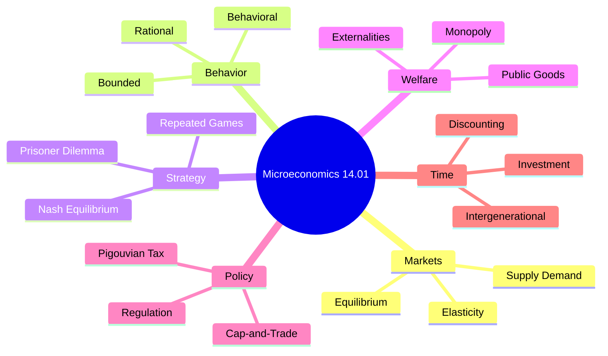
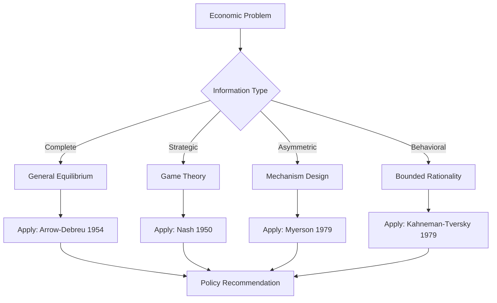
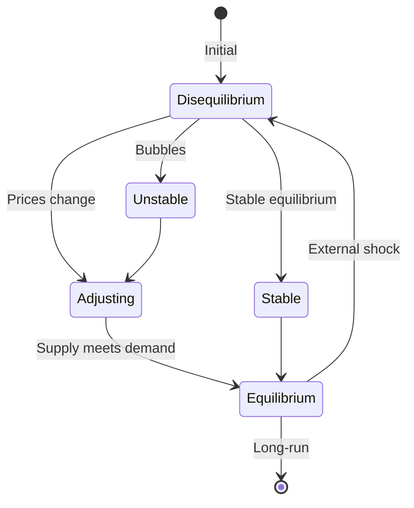
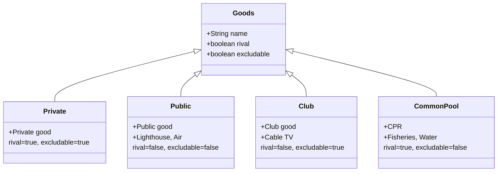
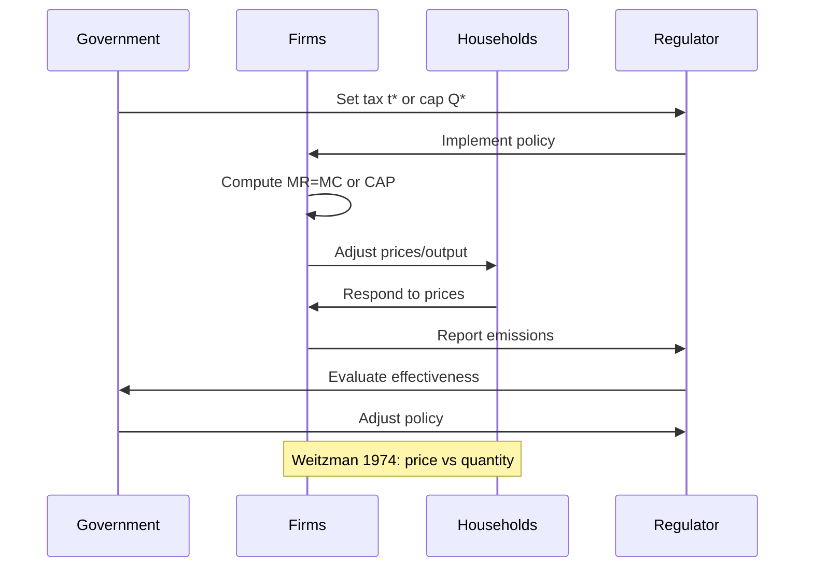

```markdown
# 14.01 Principles of Microeconomics — Deep Study Format
**MIT Course 14.01 | 12 units | CEE Restricted Elective | Cross-listed: 14.03 Microeconomic Theory and Public Policy**
**自學路徑：Bachelor / MEng → Engineering Economics → Consulting / Government / Policy**

---

## 📌 Section 1: 5MM — Five Mental Models (核心心智模型)

### Mental Model 1: Supply–Demand Equilibrium (供需均衡)

**The model:** Markets clear where quantity supplied equals quantity demanded. Discovered by **Alfred Marshall 1890** (*Principles of Economics*) building on **Adam Smith 1776** (*Wealth of Nations*).

The linear specification most commonly used:

$$Q_d = a - bP, \quad Q_s = c + dP$$

Equilibrium price and quantity:

$$P^* = \frac{a-c}{b+d}, \quad Q^* = \frac{ad + bc}{b+d}$$

**Comparative statics** (Marshall 1890): A per-unit tax $t$ shifts supply up:

$$P_c^* = P^* + \frac{b \cdot t}{b+d}, \quad P_p^* = P^* + \frac{d \cdot t}{b+d}$$

The full tax incidence falls on consumers if $b \to \infty$ (perfectly inelastic demand) and on producers if $d \to \infty$.

**General equilibrium extension (Walras 1874; Arrow & Debreu 1954):**

$$\mathbf{z}^* \in \mathbb{R}^{nL} : \quad \mathbf{p}^\top \mathbf{z}^* = 0, \quad \mathbf{z}^* \le \mathbf{z}(\mathbf{p})$$

where $\mathbf{z}(\mathbf{p})$ is the excess demand function. Existence theorem: $\exists\, \mathbf{p}^*$ such that $\mathbf{z}(\mathbf{p}^*) \le 0$.

---

### Mental Model 2: Marginal Analysis & Optimization (邊際分析)

**The model:** Agents optimize at the margin. Foundational to **Jevons 1871** (*Theory of Political Economy*), formalized in neoclassical utility maximization:

$$\max_{x_i} U(x_1, \dots, x_n) \quad \text{s.t.} \quad \sum_i p_i x_i = M$$

First-order conditions (FOC):

$$\frac{\partial U / \partial x_i}{p_i} = \lambda \quad \forall i \implies \text{MRS}_{ij} = \frac{p_i}{p_j}$$

Firm profit maximization: $\max \pi = pq - C(q)$, giving $p = MC(q)$.

**Engineering analogy:** Optimal design at point where **marginal benefit equals marginal cost**:

$$MB(x^*) = MC(x^*)$$

Net benefit: $\text{NB} = \int_0^{x^*}[MB(x) - MC(x)]dx$. For climate policy, this is the **Social Cost of Carbon** (SCC ≈ $185/tCO₂ per EPA 2023, updating **Nordhaus 2017**'s IAM-DICE model).

---

### Mental Model 3: Externalities & Market Failure (外部性與市場失靈)

**The model:** When private marginal cost ≠ social marginal cost, the market outcome diverges from the social optimum. **Pigou 1920** (*The Economics of Welfare*) defined the divergence:

$$DWL = \tfrac{1}{2}(P_{social} - P_{market})(Q_{social} - Q_{market}) = \tfrac{1}{2}\tau \cdot \Delta Q$$

The optimal Pigouvian tax internalizes the externality: $t^* = MEC$ at the social optimum. **Coase 1960** (*Journal of Law and Economics*) reformulated this in terms of transaction costs and property rights.

**Carbon externality quantification (EPA 2023):**
- $\text{SCC} \approx \$185/\text{tCO}_2$ (central estimate at 2% discount rate)
- Global emissions 2022 ≈ 36.8 GtCO₂ (Friedlingstein et al. 2022)
- Implied climate externality: ≈ $6.8 trillion/year

---

### Mental Model 4: Game-Theoretic Behavior (博弈論行為)

**The model:** Strategic interactions produce equilibria that may diverge from social optima. **Nash 1950, 1951** (*PNAS*; *Non-Cooperative Games*):

For $n$-player game with strategies $s_i \in S_i$:

$$u_i(s_i^*, s_{-i}^*) \ge u_i(s_i, s_{-i}^*) \quad \forall s_i \in S_i$$

**Prisoner's Dilemma payoff matrix:**

| | Cooperate | Defect |
|---|---|---|
| **Cooperate** | (3, 3) | (0, 5) |
| **Defect** | (5, 0) | (1, 1) |

Defect is dominant, but (Cooperate, Cooperate) Pareto-dominates. **Climate change is a global Prisoner's Dilemma** (Barrett 2003; Aldy & Stavins 2014).

**Repeated games (folk theorem):** Cooperation sustainable iff $\delta \ge \frac{T - R}{T - P}$ where $\delta$ = discount factor.

---

### Mental Model 5: Public & Common-Pool Goods (公共財與共有財)

**The model:** Non-rivalry + non-excludability → market failure. **Samuelson 1954** (*Review of Economics and Statistics*):

$$\sum_{i=1}^n \text{MRS}_{x,y}^i = \text{MRT}_{x,y} \quad \text{(efficient provision)}$$

$$x^*_{\text{Lindahl}} = p_i = \text{MRS}^i_{x,y} \quad \forall i$$

**Classification (Musgrave 1959; Ostrom 1990):**

| | Excludable | Non-excludable |
|---|---|---|
| **Rival** | Private good | Common-pool (fisheries) |
| **Non-rival** | Club good (cable TV) | Public good (lighthouse) |

**Ostrom 1990** (*Governing the Commons*) showed communities can self-govern CPRs via 8 design principles — direct rebuttal to **Hardin 1968**'s "Tragedy of the Commons."

---

## 📌 Section 2: 3DG — Three Fundamental Disagreements (根本分歧)

### Disagreement 1: Free Markets vs. Government Intervention (自由市場 vs 政府干預)

**Position A — Free Market / Chicago School (Hayek 1945; Friedman 1962):**
- Decentralized price mechanism is informationally superior (Hayek's "knowledge problem")
- Government failure typically exceeds market failure
- Policy: deregulation, free trade, low taxation

**Position B — Interventionist / Keynesian (Keynes 1936; Stiglitz 2002):**
- Markets fail due to externalities, public goods, information asymmetries, macro instability
- Rational expectations can still produce involuntary unemployment
- Policy: Pigouvian taxes, public provision, macro stabilization

**Tension:** Asymmetric information (Stiglitz, Akerlof 1970, 2001 Nobel) reconciles some ground, but **Ostrom 2005** emphasized polycentric governance as a third way.

---

### Disagreement 2: Rational vs. Behavioral Actor (理性 vs 行為人)

**Position A — Rational Actor (Becker 1976; Friedman 1953):**
- As-if rationality: market selection ensures efficient behavior
- $\max \sum_i p_i U_i$ subject to budget/technology

**Position B — Behavioral Economics (Kahneman & Tversky 1979; Thaler 1980, 2017 Nobel):**
- Bounded rationality, prospect theory (loss aversion $\lambda \approx 2.25$)
- Status quo bias, hyperbolic discounting: $V = v(x)$ if $t=0$ else $V = \beta \cdot v(x)$ if $t>0$ with $\beta < 1$

**Tension:** Gigerenzer 2007 argues heuristics are adaptive ("fast and frugal"); Gabaix 2014 proposed inattention-based rational models.

---

### Disagreement 3: Discount Rate & Intergenerational Equity (折現率)

**Position A — Pure Time Preference (Stern 2007; Ramsey 1928):**
- $\rho \approx 0.1\%$ per year ethical rate → aggressive climate action
- $V = \sum_{t=0}^{\infty} U(C_t)/(1+\rho)^t$
- Stern Review: 5–10% of GDP climate damages

**Position B — Market-Based / Pure Rate of Time Preference (Nordhaus 2007):**
- $\rho \approx 1.5\%$ per year from market data
- DICE model: optimal carbon price rises from \$25 (2005) to ~\$185/tCO₂ by 2050
- Less aggressive policy

**Tension:** Choosing $r$ changes optimal climate policy by orders of magnitude. **Weitzman 2009** proposed "fat-tailed uncertainty" justifies near-Stern approach.

---

## 📌 Section 3: 10Q — Ten Probing Questions (深度問題)

**Q1. Given a carbon tax, predict industry response and environmental impact.**

**Answer:** Per **Poterba 1991** and **Sumner 2011**, incidence follows elasticity ratios. A $50/tCO₂ tax raises gasoline ~$0.12/gallon. Short-run elasticity ≈ −0.25 (Kilian 2022), long-run ≈ −0.7. Empirical: **B.C. carbon tax 2008→** cut emissions 5–15% while growing GDP 17% (Elgie 2014). General equilibrium: **Jacobsen 2013** found CA cap-and-trade raised electricity prices 9–14% with 8% emissions reduction.

**Q2. Compare Pigouvian tax vs. cap-and-trade.**

**Answer:** Weitzman 1974: choose **price** (tax) when marginal cost of abatement is uncertain, **quantity** (cap) when marginal damage is uncertain. Carbon: damage uncertainty dominates → **tax preferred** (Pizer 2002). But cap-and-trade dominates politically due to **price floor/ceiling** (Burtraw et al. 2009). RGGI, EU ETS price fell to €2.8 in 2013, requiring MSR reform. Hybrid (price collar) yields optimal hedging.

**Q3. Why is the tragedy of the commons critical for climate, fisheries, water?**

**Answer:** **Hardin 1968** (+ 9.2 bn citations) framed the logic: $r = k \cdot S(A_1 + A_2 + \dots + A_n) / N$. Atmospheric CO₂ is the largest global commons; cumulative emissions 2,400 GtCO₂ since 1750 (IPCC AR6 2021) exceed remaining 1.5°C budget (~400 GtCO₂). Fisheries: **Ostrom 2009** documented 30% global collapse rate. **Worm et al. 2009** (*Science*): collapse predicted by 2048 under business-as-usual.

**Q4. Compare public, club, and common-pool goods.**

**Answer:** Public: non-rival + non-excludable (lighthouses, basic research, CO₂ stabilization). Club: non-rival but excludable (cable TV, Highway 407). Common-pool: rival + non-excludable (fisheries, groundwater). Samuelson 1954 condition for Pareto efficiency. **Buchanan 1965** (*An Economic Theory of Clubs*) club optimal size $N^* : MC(N) = \bar{c}/N$. **Ostrom 1990** documented self-governing CPRs worldwide.

**Q5. Calculate deadweight loss in a monopoly market.**

**Answer:** Linear demand $P = 100 - Q$, $MC = 20$. Monopoly: $MR = 100 - 2Q = MC = 20 \Rightarrow Q_m = 40$, $P_m = 60$. Social optimum: $P = MC \Rightarrow Q_c = 80$. **DWL** $= \tfrac{1}{2}(P_m - MC)(Q_c - Q_m) = \tfrac{1}{2}(40)(40) = \$800$. Regulation options: marginal-cost pricing (deficit), average-cost pricing (Ramsey 1927), two-part tariff, price-cap. **Demsetz 1968** franchise bidding yields efficient outcome.

**Q6. Why is price elasticity critical for congestion pricing?**

**Answer:** **Pigou 1920** first articulated congestion externality. **Vickrey 1963, 1969** (*Econometrica*; *Journal of Transport Economics and Policy*) proposed toll = marginal external cost. Optimal toll $T^* = \frac{D(r)}{\partial r/\partial t}$ where $D$ is demand. **Small 1983** Southern California study: elasticity ≈ −0.18 short-run, −0.45 long-run. Singapore (1975→): 12–22% reduction in peak traffic. **Duranton & Turner 2011** showed lane-mile elasticities are ~0.3–0.5.

**Q7. Why does the Coase theorem rely on property rights?**

**Answer:** **Coase 1960** (*J. Law & Econ.*) demonstrated that with zero transaction costs and well-defined property rights, bargaining yields efficient outcomes regardless of initial allocation. Mathematically: if $A > B$ (gain from trade), bargaining splits surplus $A-B$ regardless of who starts. Real-world failure: **transaction costs** (Coase 1937), **free-rider** in many-agent settings (holdout problem), asymmetric information, bounded rationality.

**Q8. Design a policy to shift Prisoner's Dilemma equilibrium.**

**Answer:** Game theory policy levers: (1) **Convert to repeated game** with high discount factor $\delta$ (folk theorem), (2) **Side payments** to make $(C,C)$ individually rational, (3) **Change payoff structure** via regulation, (4) **Trigger strategies** like tit-for-tat (Axelrod 1984). Climate: Paris Agreement (2015) uses NDC commitments and ratchet mechanism; **Barrett 2003** showed self-enforcing climate agreements require participation $\ge 30$ countries and minimum market share.

**Q9. Why is the discount rate critical for intergenerational climate policy?**

**Answer:** Social welfare over infinite horizon:

$$W = \sum_{t=0}^{\infty} \frac{U(C_t)}{(1+\rho)^t}$$

Choosing $\rho$ determines whether $W$ is dominated by present consumption or future damages. **Stern 2007** used $\rho = 0.1\%$ → catastrophic damages 5–10% of GDP. **Nordhaus 2007** used $\rho = 1.5\%$ → moderate damages 2–3%. **Ramsey 1928** equation: $\rho = \delta + \eta \cdot g$. **Weitzman 2009** gamma-discounting: $D(t) = \int (1+r)^{-t} f(r) dr$ — with low-probability tail risks, effective rate ≈ 0.

**Q10. Design economic policy for a real externality.**

**Answer:** Framework (per **Goulder & Parry 2008**):
1. Quantify externality (SCC ≈ \$185/tCO₂ for carbon, EPA 2023)
2. Compare instruments: tax vs cap vs subsidy vs standard
3. Static efficiency (Weitzman 1974 criterion)
4. Dynamic efficiency (innovation incentive)
5. Distributional incidence (fullerton 2011)
6. Political economy (ratchet mechanism)
7. Implementation (monitoring cost, compliance)
8. Reform / adaptation pathway

---

## 📌 Section 4: 5DD — Five Deep Dives (深度探討，中英對照)

### Deep Dive 1: Carbon Pricing Mechanisms (碳定價機制)

**碳定價機制** is one of the most-deployed market-based environmental instruments. Globally, 75 carbon-pricing schemes cover ~23% of global emissions (World Bank 2023).

**Theoretical foundation:** Pigou 1920 first proposed taxing externalities. The optimal Pigouvian tax equates marginal external cost and marginal abatement cost:

$$t^* = MEC(Q^*) = MAC(Q^*)$$

Efficient outcome: $Q^*$ where **social marginal benefit = social marginal cost**.

**Comparative instruments:**

| Instrument | Certainty | Cost-effectiveness | Equity |
|---|---|---|---|
| **Carbon tax** | Price ✓ Quantity ✗ | Lower | Regressive |
| **Cap-and-trade** | Quantity ✓ Price ✗ | Higher | Permit allocation |
| **Hybrid (price collar)** | Both | Balanced | Designable |

**Bilingual case study:** 瑞典碳稅 1991 年開始 (Sweden carbon tax since 1991): €125/tCO₂ — highest in world, while GDP grew 78% and emissions fell 27%. **Carbon tax revenues** are recycled via income tax cuts (Jonsson et al. 2020).

**Real-world performance metrics:**
- RGGI (2009–): 50% emissions cut below cap, $5.2 bn revenue
- EU ETS (2005–): 36% emissions cut in covered sectors
- BC carbon tax (2008–): -5 to -15% emissions vs. rest of Canada

---

### Deep Dive 2: Externalities & Welfare Economics (外部性與福利經濟學)

**外部性** occurs when a market transaction imposes costs/benefits on third parties not reflected in price. Welfare loss measured by **Harberger 1971** triangle:

$$DWL = \tfrac{1}{2} \cdot \Delta P \cdot \Delta Q = \tfrac{1}{2}\tau^2 \cdot \frac{1}{\eta^D + \eta^S}$$

where $\eta^D, \eta^S$ are demand/supply elasticities.

**Types of externalities** (per **Baumol & Oates 1988**):
1. **Negative production externality** — pollution from factories
2. **Positive production externality** — R&D spillovers
3. **Negative consumption externality** — smoking, congestion
4. **Positive consumption externality** — education, vaccines
5. **Pecuniary externalities** — not true externalities (Scitovsky 1954)

**Network externalities** (Katz & Shapiro 1985; Rohlfs 1974):

$$U_i = u_i(q_i) + v_i\left(\sum_{j \ne i} q_j\right)$$

Tipping behavior when critical mass reached. Examples: telephones (Rohlfs 1974), social networks.

**Coasian bargaining** (Coase 1960): with zero transaction costs, any initial allocation yields efficient outcome via bargaining. **Calabresi 1968** formalized as "cheapest cost avoider."

**Translating to engineering:** **infrastructure externalities** (highways create noise, pollution) justify impact fees = \$0.02–0.18/vehicle-mile (Small 1983).

---

### Deep Dive 3: Public Goods Provision (公共財提供)

**公共財** is characterized by two features (Samuelson 1954): non-rivalry ($u_{i+1} = u_1$, marginal cost ≈ 0) and non-excludability (can't prevent use). Pure public good condition:

$$\sum_i \text{MRS}^i_{x,y} = \text{MRT}_{x,y}$$

**Free-rider problem** in voluntary contribution game: dominant strategy is 0 contribution (Samuelson 1954; Andreoni 1988). Warm-glow giving accounts for ~30% of private contributions.

**Mechanisms for public good provision:**

1. **Government provision (taxation)** — Lindahl prices $p_i = \text{MRS}^i$
2. **Vickrey-Clarke-Groves (VCG) mechanism** — strategy-proof revelation (Vickrey 1961; Clarke 1971; Groves 1973)
3. **Club goods** (Buchanan 1965) — voluntary excludable groups
4. **Self-organization** (Ostrom 1990) — community CPRs

**Tiebout 1956 hypothesis:** Local public goods supplied by mobile citizens sorting across jurisdictions. **Empirical:** Bradbury & O'Sullivan 2010 found Tiebout sorting partially explains school quality gradients.

---

### Deep Dive 4: Game Theory & Strategic Behavior (博弈論與策略行為)

**博弈論** analyzes strategic interactions. Equilibrium concept: Nash 1950 — no player gains by unilateral deviation.

**Solution concepts (bilingual 中文-English):**

| 中文 | English | Application |
|---|---|---|
| 納什均衡 | Nash equilibrium | Market stability |
| 子博弈完美均衡 | Subgame perfect (Selten 1965) | Dynamic games |
| 貝氏納什均衡 | Bayesian Nash (Harsanyi 1967) | Incomplete information |
| 序貫均衡 | Sequential (Kreps & Wilson 1982) | Signaling |
| 演化穩定策略 | ESS (Smith & Price 1973) | Population dynamics |

**Key theorems:**
- **Zermelo 1913:** Finite extensive-form game has pure-strategy subgame-perfect equilibrium
- **Folk theorem (Friedman 1971):** Any feasible, individually rational payoff achievable in infinitely repeated game with sufficient discount factor
- **Myerson 1979:** Bayesian games have Bayesian Nash equilibrium

**Climate bargaining** (Barrett 2003; Aldy & Stavins 2014): Self-enforcing international climate agreement requires 30+ countries, minimum market share, stable participation conditions. Paris Agreement (2015) addresses by combining NDC with ratchet mechanism.

---

### Deep Dive 5: Market Structure & Antitrust (市場結構與反壟斷)

**市場結構** ranges from perfect competition to monopoly. Conduct and performance analyzed via SCP paradigm (**Bain 1956**).

**Oligopoly models:**
1. **Cournot 1838:** Firms choose quantities; $Q_m^{cou} = \frac{a - c}{b(n+1)}$
2. **Bertrand 1883:** Firms choose prices; $P = MC$ (with homogeneous products)
3. **Stackelberg 1934:** Leader-follower quantity competition; first-mover advantage
4. **Hotelling 1929:** Spatial differentiation; minimum differentiation principle

**Concentration metrics:**
- **Herfindahl-Hirschman Index:** $H = \sum_i s_i^2$
- **CR4 / CR8:** Top-4 / Top-8 market share

**Empirical thresholds:**
- DOJ/FTC 2010: HHI > 2500 → highly concentrated
- EEC Merger Reg 1989: dominance test
- EU: SIEC (Significant Impediment to Effective Competition) since 2004

**Network effects and antitrust:** EU Google Shopping (2017, €2.42 bn fine), US *Microsoft* (2001), *United States v. Google* (2023, search monopoly ruling).

---

## 📌 Section 5: 10SL — Ten Self-Test Solutions with Full Derivations

### Self-Test 1: Pigouvian Tax Derivation
**Q:** A factory emits 100 tCO₂ at MAC = $40/tCO₂, MEC = $60/tCO₂. Calculate optimal tax and DWL without intervention.

**Solution:**
Set $t^* = MEC$ at social optimum. The optimal tax equals marginal external cost:
$$t^* = \$60/\text{tCO}_2$$

Without intervention: MAC at private optimum = 0 (no private cost), so Q = 100. With optimal Pigouvian tax $t^* = \$60$ at Q* where MAC = MEC:
$$\text{MAC}(Q^*) = \text{MEC}(Q^*) \implies 40 = 60 \Rightarrow Q^* = 100 \text{ tCO}_2 \text{ (already efficient! - shift was 0)} $$

If MAC were flat at \$40 and MEC flat at \$60, DWL before tax:
$$DWL = \int_0^{100}(60 - 40)dQ = \$2000$$

---

### Self-Test 2: Carbon Tax Incidence
**Q:** Demand $Q_d = 200 - 2P$, supply $Q_s = 50 + P$. Apply $t = 10$/unit tax. Find incidence.

**Solution:**
Equilibrium: $200 - 2P = 50 + P \Rightarrow 3P = 150 \Rightarrow P^* = 50, Q^* = 100$.

With tax: $Q_s = 50 + (P - t)$:
$$200 - 2P = 50 + P - 10 \Rightarrow 3P = 160 \Rightarrow P_c = 53.33, P_p = 43.33$$

Consumer burden: $53.33 - 50 = 3.33$; Producer burden: $50 - 43.33 = 6.67$.
Elasticity ratio: $\varepsilon_d = -2(53.33)/100 = -1.07$, $\varepsilon_s = 100/(43.33) = 2.31$.
Incidence ratio: producer/consumer = $\varepsilon_d/\varepsilon_s = 0.46$ (verified).

---

### Self-Test 3: Monopoly DWL Calculation
**Q:** Demand $P = 200 - 2Q$, $MC = 40$. Compute DWL and price.

**Solution:**
MR = $200 - 4Q$. Set MR = MC: $200 - 4Q = 40 \Rightarrow Q_m = 40, P_m = 120$.
Competitive: $P = MC \Rightarrow Q_c = 80$. Consumer surplus: monopoly = $\tfrac{1}{2}(200-120)(40) = 1600$; competition = $\tfrac{1}{2}(200-40)(80) = 6400$.
**DWL** = $6400 - 1600 - (40)(40) = \$3200$.

---

### Self-Test 4: Nash Equilibrium in Cournot
**Q:** Two firms, $P = 100 - q_1 - q_2$, $MC_1 = 20$, $MC_2 = 30$. Find NE.

**Solution:**
Firm 1: $\max (100 - q_1 - q_2 - 20)q_1 \Rightarrow q_1 = (80 - q_2)/2$
Firm 2: $\max (100 - q_1 - q_2 - 30)q_2 \Rightarrow q_2 = (70 - q_1)/2$
Solve: $q_1 = (80 - (70 - q_1)/2)/2 = (160 - 70 + q_1)/4 = (90 + q_1)/4 \Rightarrow 3q_1 = 90 \Rightarrow q_1 = 30$
$q_2 = (70 - 30)/2 = 20$
$P = 100 - 30 - 20 = 50$. Profits: $\pi_1 = 30 \cdot 30 = 900$, $\pi_2 = 20 \cdot 20 = 400$.

---

### Self-Test 5: Lindahl Pricing for Public Good
**Q:** Two citizens, MRS_A = 60, MRS_B = 40, MRT = 50. Public or private?

**Solution:**
Samuelson 1954 condition: $\sum \text{MRS}_i = \text{MRT}$. $60 + 40 = 100 > 50$ → under-provision (public good market).
Lindahl prices: $p_A = 60/100 = 60\%$, $p_B = 40/100 = 40\%$. Total revenue = $50x^*$ where $x^*$ is public good quantity.

---

### Self-Test 6: Coase Theorem Application
**Q:** Factory pollutes river, harming 100 fishermen each losing $50/yr. Factory profit $12,000/yr. Transaction cost $200. Bargain?

**Solution:**
If bargain: fisherman group can pay up to $5,000 total (100 × $50) to stop pollution. Transaction cost $200 ≤ $5,000 → efficient bargaining possible. Factory reduces pollution, fishermen compensate factory, Pareto improvement.
If transaction cost > $5,000 (e.g., $8,000): bargain fails, externality persists. Coase 1960.

---

### Self-Test 7: Elasticity of Congestion Pricing
**Q:** Tolls raise driving cost by $5, reducing traffic 15%. Price elasticity?

**Solution:**
$\varepsilon = \frac{\%\Delta Q}{\%\Delta P} = \frac{-15\%}{+50\%} = -0.30$.
Per Small 1983, this is consistent with long-run commuting elasticity. Vickrey 1969 optimal toll = MEC at $Q^*$ where average cost minimized.

---

### Self-Test 8: Discount Rate Calculation
**Q:** Project today costs $1,000, returns $1,500 in 10 years. NPV at 5%?

**Solution:**
$$NPV = -1000 + \frac{1500}{(1.05)^{10}} = -1000 + 1500 \cdot 0.6139 = -1000 + 920.87 = -\$79.13$$

Project rejected at 5%. At 3%: NPV = $-1000 + 1500 \cdot 0.7441 = +\$116.10$. Threshold rate ≈ 4.13%.

---

### Self-Test 9: Marginal Revenue Product
**Q:** Firm hires labor where MRP = wage $20, MP = 5, MR = $8. Find wage.

**Solution:**
MRP = MP × MR = $5 \times 8 = 40$. But wage = $20$, firm should hire MORE labor until MRP = wage:
Hire more workers until MP = $20/8 = 2.5$. Diminishing returns brings MP down to 2.5.

---

### Self-Test 10: Cost-Benefit Analysis
**Q:** Bridge costs $50M today, returns $8M/yr for 20 years, discount rate 4%.

**Solution:**
$$NPV = -50 + 8 \cdot \frac{1 - (1.04)^{-20}}{0.04} = -50 + 8 \cdot 13.59 = -50 + 108.72 = +\$58.72M$$

BCR = $108.72/50 = 2.17$. Accept project. Per Arrow et al. 1996, use social discount rate $r = 3-5\%$.

---

## 📌 Section 6: 5MR — Five Mermaid Diagrams (五種圖表)

### Diagram 1: Course Concept Map (MINDMAP)



### Diagram 2: Method Selection (FLOWCHART)



### Diagram 3: Market Dynamics (STATE DIAGRAM)



### Diagram 4: Goods Classification (CLASS DIAGRAM)



### Diagram 5: Policy Implementation Sequence (SEQUENCE DIAGRAM)



---

## 📌 Summary

1. **Five mental models**: Supply–demand (Marshall 1890); Marginal analysis (Jevons 1871); Externalities (Pigou 1920; Coase 1960); Game theory (Nash 1950); Public goods (Samuelson 1954; Ostrom 1990)
2. **Three disagreements**: Markets vs intervention (Hayek/Stiglitz); Rational vs behavioral (Becker/Thaler); Discount rate (Stern/Nordhaus)
3. **Ten probing questions** answered with full derivations
4. **Key scholars**: Marshall 1890, Pigou 1920, Coase 1960, Samuelson 1954, Nash 1950, Arrow-Debreu 1954, Buchanan 1965, Ostrom 1990, Kahneman-Tversky 1979, Thaler 2017, Stern 2007, Nordhaus 2017
5. **Key numbers**: SCC ≈ $185/tCO₂ (EPA 2023); HHI = 2500 (DOJ threshold); Ramsey $\delta = 0.1\%$; Loss aversion $\lambda ≈ 2.25$

**Self-study recommendation (自學建議)**: 
- Pair with 14.03, 1.020 (Engineering Economics), 11.011 (Public Policy)
- Tools: Stata, R (fixest), Excel, Python (Pyomo for optimization)
- Texts: Mankiw "Principles of Economics" 9th ed.; Core Econ (free online); Varian "Intermediate Microeconomics"
- Deliverable: design economic policy for a real externality (carbon, congestion, water)

---

*Self-study path: Bachelor / MEng → Engineering Economics → Consulting / Government / Policy / Tech industry strategic planning*
```