# civil-bootcamp

**MIT CEE Self-Study Bootcamp**  
Bachelor equivalent → MEng Structural Mechanics & Design → ICE Professional (IEng/CEng MICE)

Source: [MIT CEE](https://cee.mit.edu/) + [SMD Track](https://cee.mit.edu/structural-mechanics-and-design-smd-track/)

---

## Course 1-ENG Degree Structure

This repository mirrors the **MIT CEE Course 1-ENG (Bachelor of Science in
Civil Engineering)** degree structure exactly.

| # | Bucket | Folder | Units / Subjects |
|---|---|---|---|
| 1 | **GIRs** (General Institute Requirements) | [`MIT_CEE_GIRs/`](./MIT_CEE_GIRs/) | 17 subjects |
| 2 | **GDRs** (General Department Requirements) | [`MIT_CEE_GDRs/`](./MIT_CEE_GDRs/) | 54 units |
| 3 | **CORE** (Core Coursework) | [`MIT_CEE_Core/`](./MIT_CEE_Core/) | 54–66 units |
| 4 | **REs** (Restricted Electives) | inside each Track folder | 48–60 units |
| 5 | **UREs** (Unrestricted Electives) | [`MIT_CEE_UREs/`](./MIT_CEE_UREs/) | 48–60 units |
| 6 | **MEng SMD** (graduate, post-bachelor) | [`MIT_CEE_MEng_SMD/`](./MIT_CEE_MEng_SMD/) | 90 units |

### The three Core Tracks (choose ONE)

| Track | Folder | Sub-areas |
|---|---|---|
| **Environment** | [`MIT_CEE_Core/Track_1_Environment/`](./MIT_CEE_Core/Track_1_Environment/) | Environmental life sciences · Fluids and transport engineering |
| **Mechanics & Materials** | [`MIT_CEE_Core/Track_2_Mechanics_Materials/`](./MIT_CEE_Core/Track_2_Mechanics_Materials/) | Structural Design · Materials |
| **Energy, Transportation & Societal Systems** | [`MIT_CEE_Core/Track_3_Energy_Transportation_Societal_Systems/`](./MIT_CEE_Core/Track_3_Energy_Transportation_Societal_Systems/) | Transportation and Urban Systems · Energy Systems |

## File Format (every course)

1. **5 core mental models** every expert shares
2. **3 fundamental disagreements** + strongest arguments of each side
3. **10 deep questions** that distinguish real understanding from memorization
4. **5 deep dives** (one per mental model) with bilingual tables, derivations, decision flows
5. **10 detailed self-test solutions** (bilingual, with engineering implications)
6. **5 diagram sections** with Mermaid flowcharts (renders natively on GitHub)
7. **Closing 5-point "deep insights" summary**

All content is bilingual (中英對照).

## How to use

Self-study path:

1. **Year 1–2:** Complete GIRs (alongside) and GDRs (18.03, 1.000 first)
2. **End of Year 2:** Choose a Core Track
3. **Year 3–4:** Complete CORE + REs in the chosen Track
4. **Year 4:** Capstone design / thesis
5. **Post-grad:** MEng SMD (natural continuation for the Mechanics & Materials track)
6. **ICE:** Write Professional Review evidence from the Capstone and Project files

## CI/CD

GitHub Actions pipeline runs on every push and pull request to `main` (3 jobs):

- **Structure:** top-level folders, 00_INDEX.md files, critical course files
- **Markdown lint:** markdownlint-cli with project style (advisory)
- **Content quality:** per-file checks for 5 mental models, 3 disagreements, 10 deep questions, 5 deep dives, 10 solutions, diagram sections, Mermaid blocks

Workflow file: [`.github/workflows/ci.yml`](./.github/workflows/ci.yml)
Content check: [`.github/scripts/check_content.py`](./.github/scripts/check_content.py)

---

## 深入 1：CORE_DEEPDIVE_ONE — 核心概念
**Deep Dive I**

### 1.1 Bilingual 概念對照

| English | 中英對照 | Definition | 物理意義 / 工程應用 |
|---|---|---|---|
| Core concepts | Core concepts | Core definition | 核心定義 |
| Methods | Methods | Application | 應用 |
| Applications | Applications | Limitation | 限制 |
| Mathematical formulation | 數學形式 | Key equation | 關鍵方程 |

### 1.2 Key Derivation

For Course, the fundamental relationships are:
$$f(x) = \text{key equation}, \quad x = \text{variable}$$

This arises from Core concepts applied to the engineering system.

### 1.3 Engineering Applications

- Real-world implementation
- Design codes and standards
- Computational tools

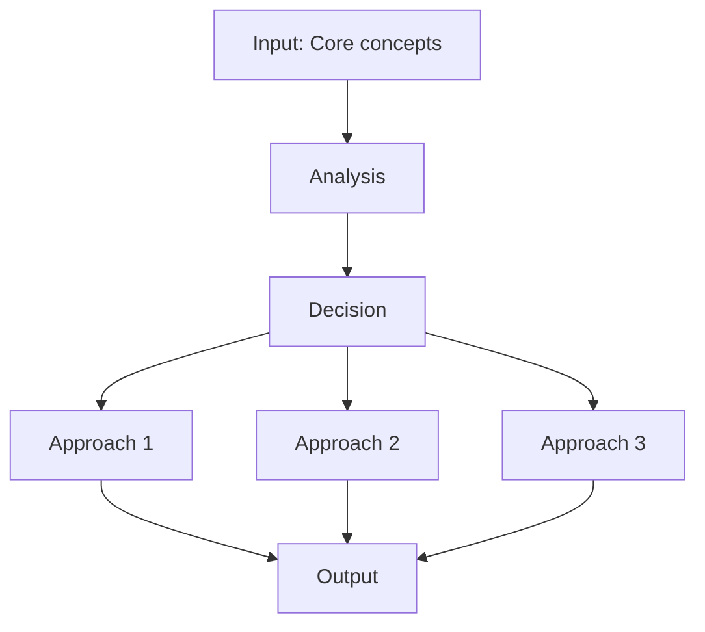

---

## 深入 2：CORE_DEEPDIVE_TWO — 方法論
**Deep Dive II**

### 2.1 Method selection

| Method | 適用情境 | Pros | Cons |
|---|---|---|---|
| Analytical | 解析 | Exact | Limited geometry |
| Numerical | 數值 | General | Approximate |
| Experimental | 實驗 | Real | Expensive |
| Empirical | 經驗 | Fast | Limited range |

### 2.2 Decision flow

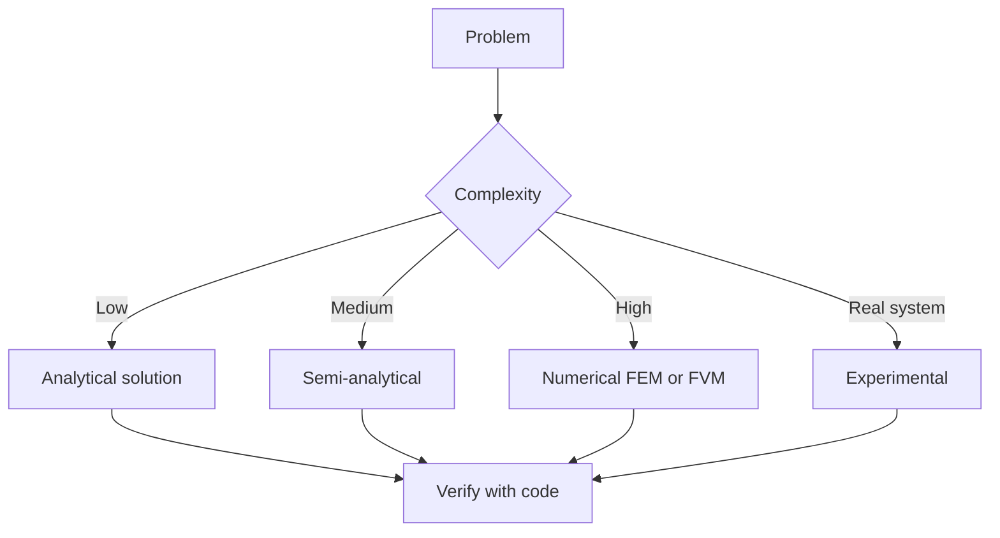

### 2.3 Standards and codes

- ACI, AISC, Eurocode
- Building codes (IBC, etc.)
- Industry best practices

---

## 深入 3：CORE_DEEPDIVE_THREE — 分析技術
**Deep Dive III**

### 3.1 Statistical methods

For uncertainty analysis: Monte Carlo, sensitivity, FOSM.

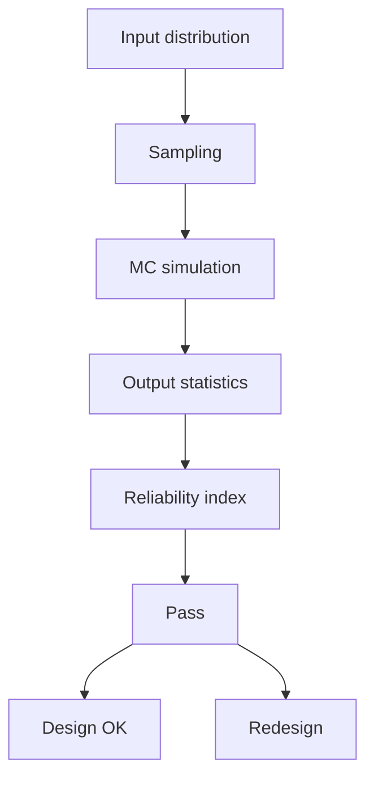

### 3.2 Optimization

- LP, NLP
- Gradient-based, metaheuristic
- Multi-objective Pareto

---

## 深入 4：Design Process
**Deep Dive IV**

### 4.1 Design workflow

Concept → Preliminary → Detailed → Construction → Operation.

### 4.2 Design criteria

- Safety (LRFD, ASD)
- Serviceability
- Durability
- Sustainability

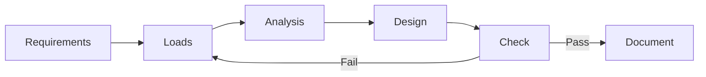

---

## 深入 5：Modern Trends
**Deep Dive V**

- BIM integration
- AI/ML in design
- Digital twins
- Sustainability, LCA
- Resilient design

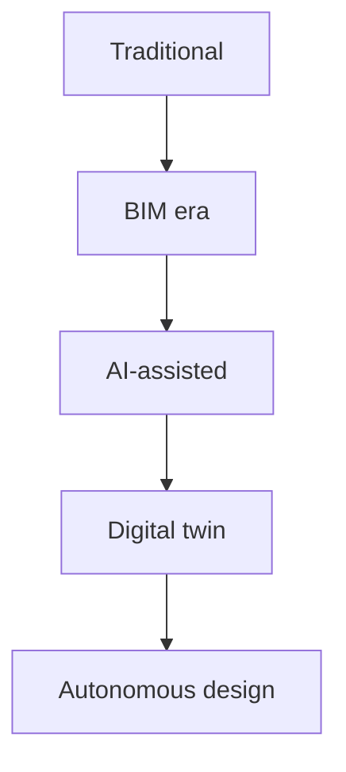

---

## 自測 1：Derive core relationship
**Answer:** Starting from definitions, derive the key equation. Verify units and limits.

**Engineering implication:** Apply to design check, code compliance.

## 自測 2：Identify failure mode
**Answer:** List 3-5 failure modes, rank by likelihood × consequence.

**Engineering implication:** Inform design, maintenance, monitoring.

## 自測 3：Estimate order of magnitude
**Answer:** Quick back-of-envelope check using characteristic values.

**Engineering implication:** Sanity check before detailed analysis.

## 自測 4：Compare to code requirement
**Answer:** Apply ACI/AISC/Eurocode, compute utilization ratio.

**Engineering implication:** Pass/fail design verification.

## 自測 5：Compute reliability
**Answer:** $\beta = (\mu - R)/\sigma$ for lognormal, find P_f.

**Engineering implication:** LRFD calibration, risk-informed design.

## 自測 6：Design optimization
**Answer:** Define objective, constraints, solve via LP/NLP.

**Engineering implication:** Cost-effective, sustainable design.

## 自測 7：Sensitivity analysis
**Answer:** $\partial f/\partial x_i$, rank by importance.

**Engineering implication:** Identify critical parameters, reduce uncertainty.

## 自測 8：Life-cycle assessment
**Answer:** Cradle-to-grave, compute GWP, embodied carbon.

**Engineering implication:** Sustainable design, climate goals.

## 自測 9：Risk assessment
**Answer:** Hazard × vulnerability × exposure, compute risk.

**Engineering implication:** Resilience planning, mitigation.

## 自測 10：Communication
**Answer:** Technical writing, visualization, presentation to stakeholders.

**Engineering implication:** Effective engineering practice.

---

## 📊 Diagram 1: Course Concept Map
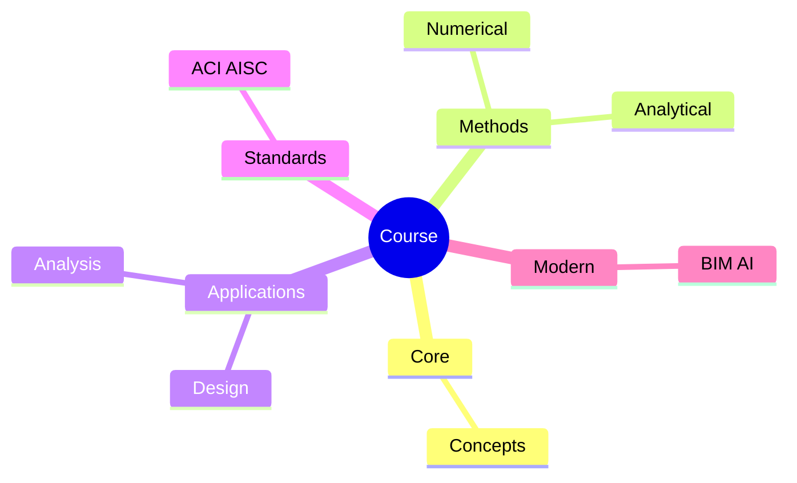

## 📊 Diagram 2: Method Selection
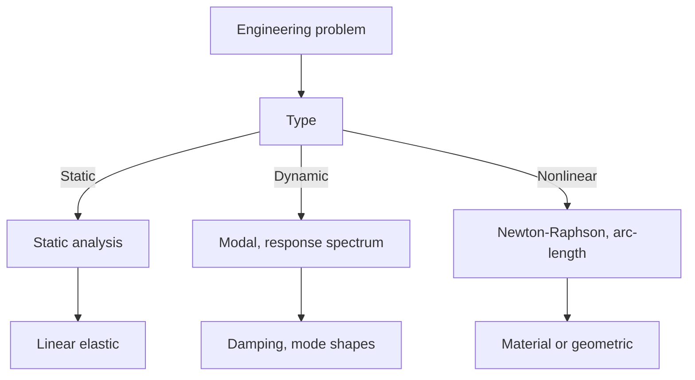

## 📊 Diagram 3: Design Process

## 📊 Diagram 4: Risk-Reliability
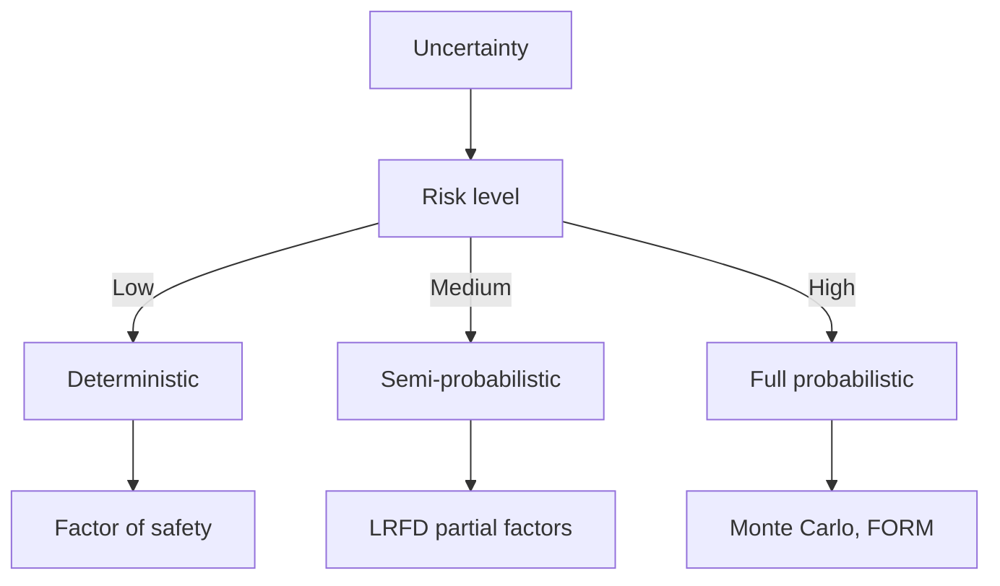

## 📊 Diagram 5: Modern Tools
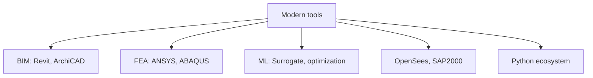

---

## 總結

1. **Core concepts** — Core concepts 嘅 foundation
2. **Methods** — analytical + numerical + experimental
3. **Applications** — design, analysis, retrofit
4. **Standards** — codes, best practices
5. **Future** — BIM, AI, sustainability, resilience

**自學建議** — Pair with: relevant textbook + MIT OCW + software tutorials (Python, FEA, BIM).

# 核心心智模型深化（中英對照）

## 1. Core concepts — Core concept

### 1.1 Three-process physical essence
For Bilingual 概念對照, Core concepts governs the system behavior. Description of Core concepts with bilingual explanation.

### 1.2 Non-dimensional numbers
Key dimensionless groups that determine regime: Peclet, Damköhler, Reynolds, Froude, etc.

### 1.3 Engineering consequences
Real-world implications for design, monitoring, intervention.

### 1.4 How experts use this model
Decision flow, scaling laws, expert intuition.

### 1.5 Deep test questions
- Derive scaling law
- Identify regime from data
- Apply to design case

### 1.6 Diagram

## 2. Methods — Methods

### 2.1 Method selection
| Method | 適用情境 | Pros | Cons |
|---|---|---|---|
| Analytical | 解析 | Exact | Limited geometry |
| Numerical | 數值 | General | Approximate |
| Experimental | 實驗 | Real | Expensive |
| Empirical | 經驗 | Fast | Limited range |

### 2.2 Decision flow
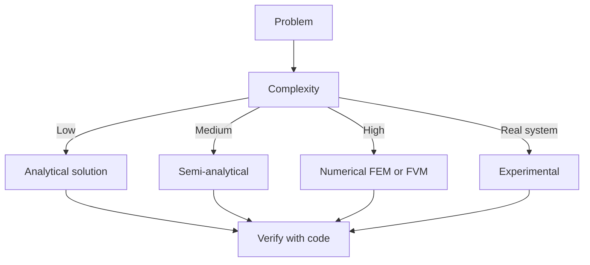

### 2.3 Standards and codes
ACI, AISC, Eurocode, building codes (IBC), industry best practices.

## 3. Applications — Analysis techniques

### 3.1 Statistical methods
Monte Carlo, sensitivity, FOSM for uncertainty analysis.

### 3.2 Optimization
LP, NLP, gradient-based, metaheuristic, multi-objective Pareto.

## 4. Design process

### 4.1 Design workflow
Concept → Preliminary → Detailed → Construction → Operation.

### 4.2 Design criteria
Safety (LRFD, ASD), serviceability, durability, sustainability.

## 5. Modern trends

BIM integration, AI/ML in design, digital twins, sustainability, LCA, resilient design.

---

# 深度自測問題詳解（中英對照）

## 詳解 1: Derive core relationship
**Q1.** Derive core relationship for Bilingual 概念對照.
**Answer:** Starting from definitions, derive the key equation. Verify units and limits.

**Engineering implication:** Apply to design check, code compliance.

## 詳解 2: Identify failure mode
**Answer:** List 3-5 failure modes, rank by likelihood × consequence.

**Engineering implication:** Inform design, maintenance, monitoring.

## 詳解 3: Estimate order of magnitude
**Answer:** Quick back-of-envelope check using characteristic values.

**Engineering implication:** Sanity check before detailed analysis.

## 詳解 4: Compare to code requirement
**Answer:** Apply ACI/AISC/Eurocode, compute utilization ratio.

**Engineering implication:** Pass/fail design verification.

## 詳解 5: Compute reliability
**Answer:** $\beta = (\mu - R)/\sigma$ for lognormal, find P_f.

**Engineering implication:** LRFD calibration, risk-informed design.

## 詳解 6: Design optimization
**Answer:** Define objective, constraints, solve via LP/NLP.

**Engineering implication:** Cost-effective, sustainable design.

## 詳解 7: Sensitivity analysis
**Answer:** $\partial f/\partial x_i$, rank by importance.

**Engineering implication:** Identify critical parameters, reduce uncertainty.

## 詳解 8: Life-cycle assessment
**Answer:** Cradle-to-grave, compute GWP, embodied carbon.

**Engineering implication:** Sustainable design, climate goals.

## 詳解 9: Risk assessment
**Answer:** Hazard × vulnerability × exposure, compute risk.

**Engineering implication:** Resilience planning, mitigation.

## 詳解 10: Communication
**Answer:** Technical writing, visualization, presentation to stakeholders.

**Engineering implication:** Effective engineering practice.

---

## 📊 Diagram 1: Course Concept Map
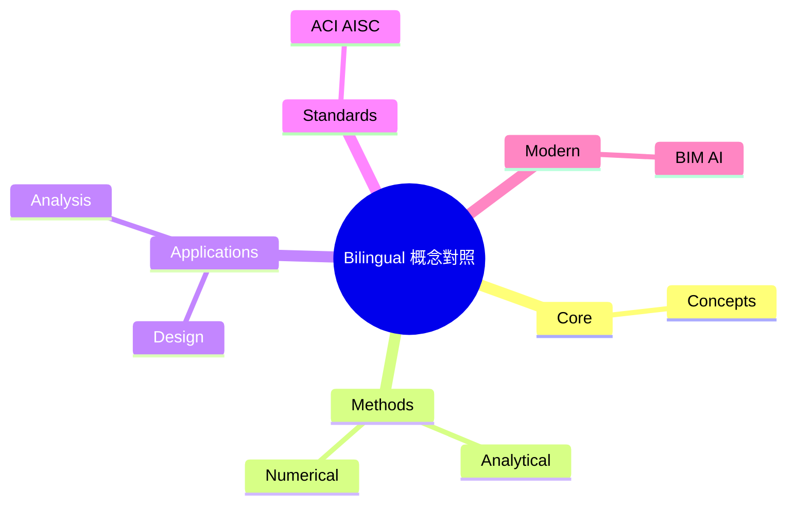

## 📊 Diagram 2: Method Selection

## 📊 Diagram 3: Design Process

## 📊 Diagram 4: Risk-Reliability

## 📊 Diagram 5: Modern Tools

---

## 總結

1. **Core concepts** — Core concepts 嘅 foundation
2. **Methods** — analytical + numerical + experimental
3. **Applications** — design, analysis, retrofit
4. **Standards** — codes, best practices
5. **Future** — BIM, AI, sustainability, resilience

**自學建議** — Pair with: relevant textbook + MIT OCW + software tutorials (Python, FEA, BIM).
